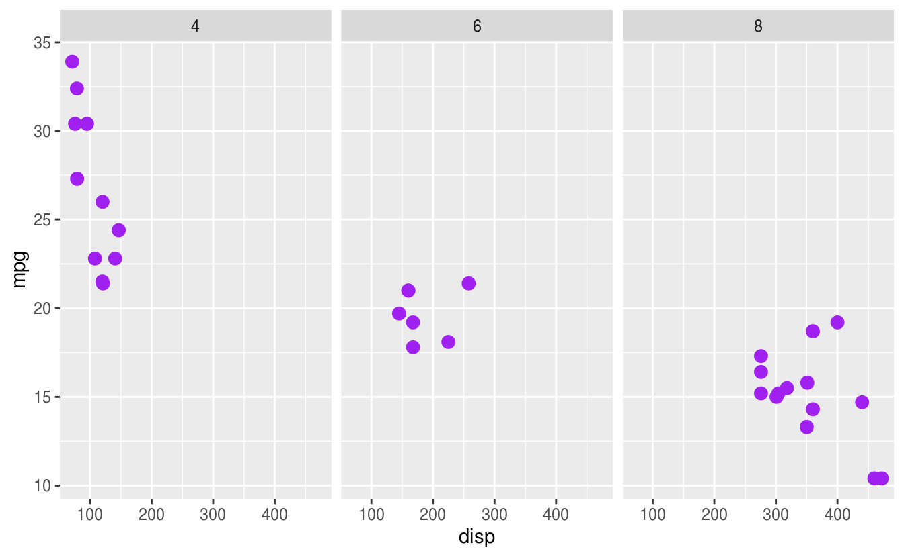
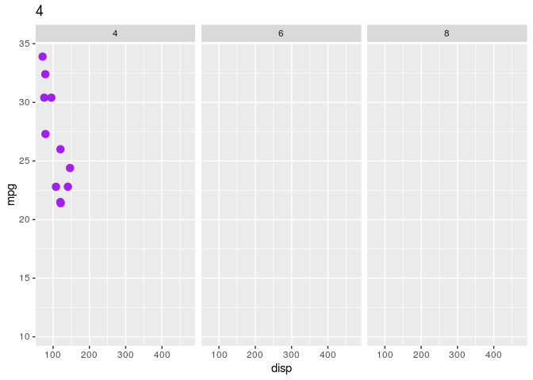
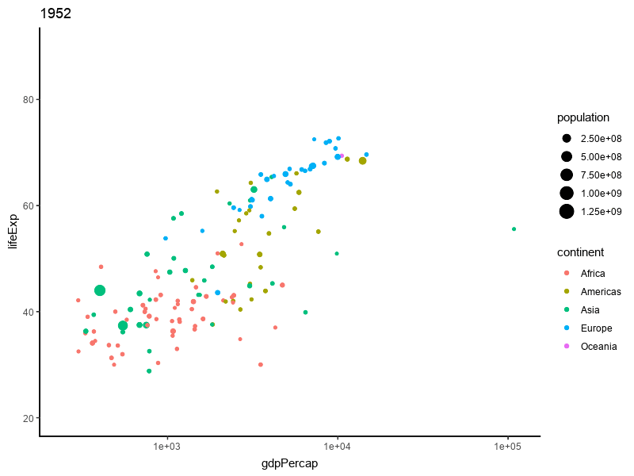
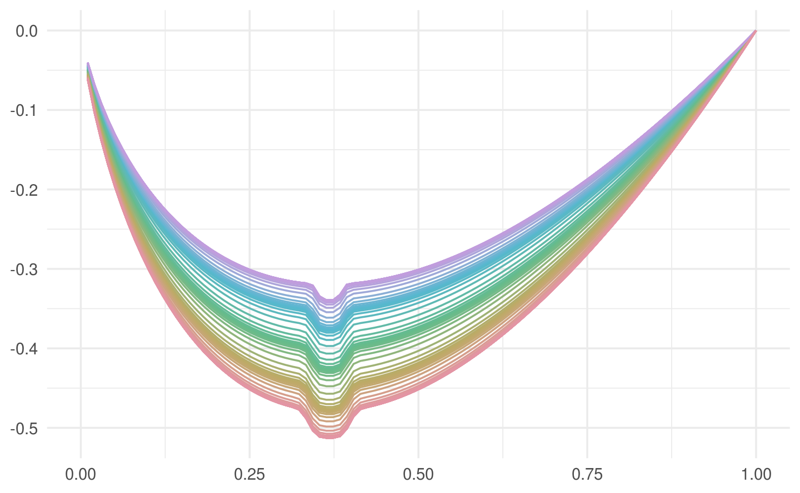

# 动画 {#Animated-Graphics}

rgl 和 svg 制作的动画，包括由静态图形转化过来的图形如 animation 或者 magick 和 gganimate 制作的图形 

[mapmate](https://github.com/leonawicz/mapmate) 制作地图方面的三维可视化图形和 [gganimate 案例合集](https://github.com/ropenscilabs/learngganimate)

## gganimate


```r
library(ggplot2)
library(gganimate)
```

生成静态图片


```r
ggplot(mtcars, aes(disp, mpg)) +
  geom_point(colour = "purple", size = 3) +
  facet_wrap(~cyl)
```



用来分面的变量 cyl 作为转场的帧


```r
base_pic <- ggplot(mtcars, aes(disp, mpg)) +
  geom_point(colour = "purple", size = 3) +
  facet_wrap(~cyl) +
  transition_manual(cyl) +
  labs(title = "{current_frame}")
animate(base_pic, nframes = 100, fps = 50)
#> nframes and fps adjusted to match transition
```




```r
install.packages(c('transformr','gganimate','av'))

# Create the gganimate plot
library(gganimate)
p <- ggplot(airquality, aes(Day, Temp)) + 
  geom_line(size = 2, colour = 'steelblue') + 
  transition_states(Month, 4, 1) + 
  shadow_mark(size = 1, colour = 'grey')

# Render and show the video
q <- 2
df <- animate(p, renderer = av_renderer('animation.mp4'), 
         width = 720*q, height = 480*q, res = 72*q, fps = 25)                                               

utils::browseURL('animation.mp4')
```

## magick

由一帧帧静态图片合并转化为 GIF 图


```r
library(gapminder)
library(magick)
img <- image_graph(res = 96)
datalist <- split(gapminder, gapminder$year)
out <- lapply(datalist, function(data) {
  p <- ggplot(data, aes(gdpPercap, lifeExp, size = pop, color = continent)) +
    scale_size("population", limits = range(gapminder$pop)) +
    scale_x_log10(limits = range(gapminder$gdpPercap)) +
    geom_point() + ylim(20, 90) + ggtitle(data$year) + theme_classic()
  print(p)
})
dev.off()
gapminder <- image_animate(img, fps = 2)
image_write(gapminder, "data/gapminder.gif")
```



tweenr 用于中间过渡，插值。

这个栗子叫 3D 版邪恶的曲线，源于 Y 叔的博客^[<https://guangchuangyu.github.io/cn/2017/09/3d-breast/>]。

$$f(x;\theta,\phi) = \theta x\log(x)-\frac{1}{\phi}\mathit{e}^{-\phi^4(x-\frac{1}{\mathit{e}})^4}$$

其中 $\theta \in (2,3), \phi \in (30,50), x \in (0,1)$


```r
f <- function(a, b) {
  function(y) {
    a * y * log(y, base = 10) - 1 / b * exp(-(b * y - b / exp(1))^4)
  }
}

y <- seq(0, 1, length.out = 100)
cols <- colorspace::rainbow_hcl(5)
d5 <- data.frame(x = f(3, 30)(y), y = y, color = cols[1])
d4 <- data.frame(x = f(2.8, 33)(y), y = y, color = cols[2])
d3 <- data.frame(x = f(2.5, 36)(y), y = y, color = cols[3])
d2 <- data.frame(x = f(2.2, 40)(y), y = y, color = cols[4])
d1 <- data.frame(x = f(2, 50)(y), y = y, color = cols[5])

df <- list(d5, d4, d3, d2, d1)

library(tweenr)
df2 <- tween_states(df,
  tweenlength = 2, statelength = 1,
  ease = rep("cubic-in-out", 4), nframes = 100
)

library(ggplot2)
ggplot(data = df2, aes(x, y, color = I(color), frame = .frame)) +
  geom_path() +
  coord_flip() +
  theme_minimal() +
  labs(x = NULL, y = NULL)
#> Warning: Removed 52 row(s) containing missing values (geom_path).
```

<div class="figure" style="text-align: center">

<p class="caption">(\#fig:brest-tweenr)tweenr 添加过渡效果</p>
</div>
