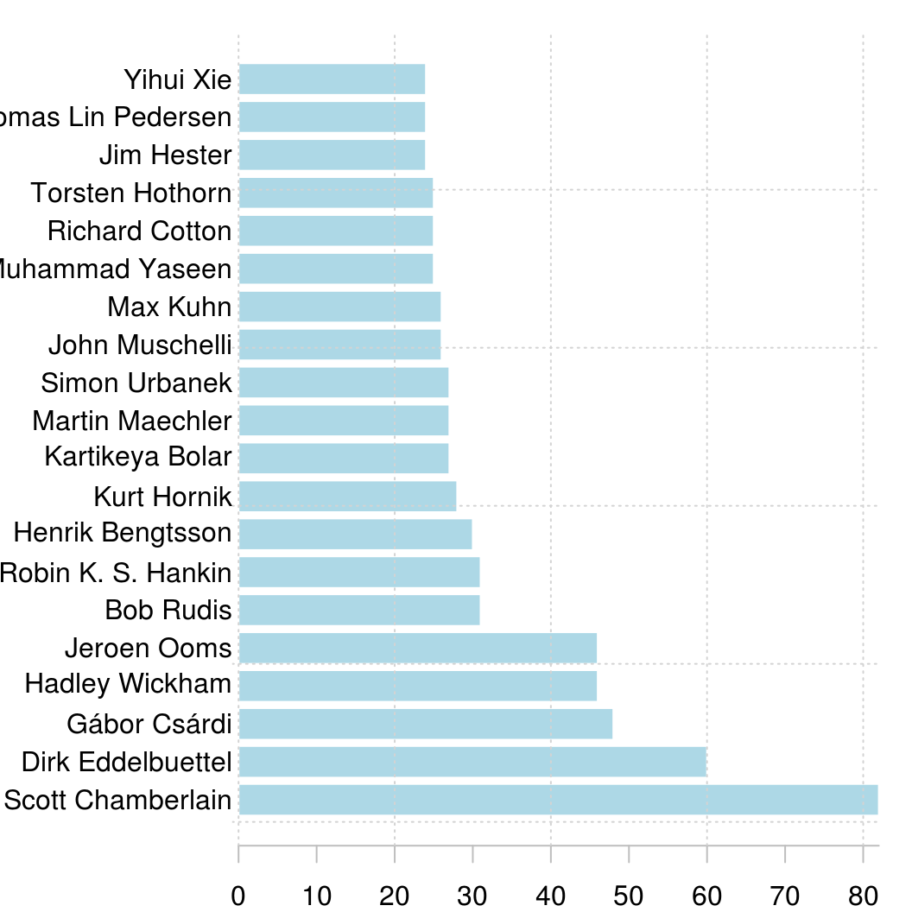
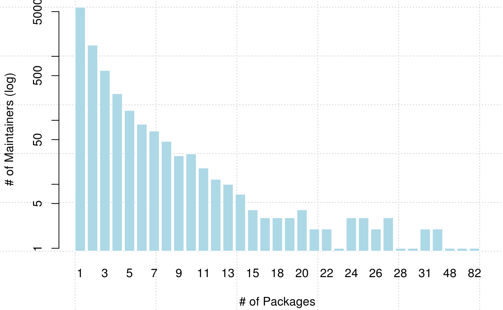
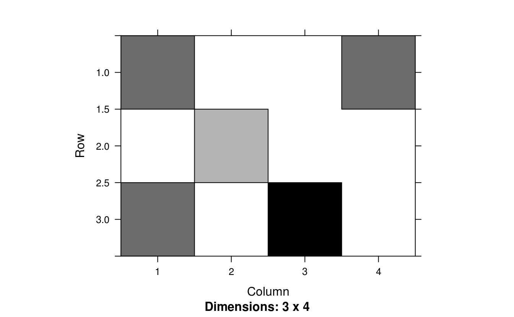
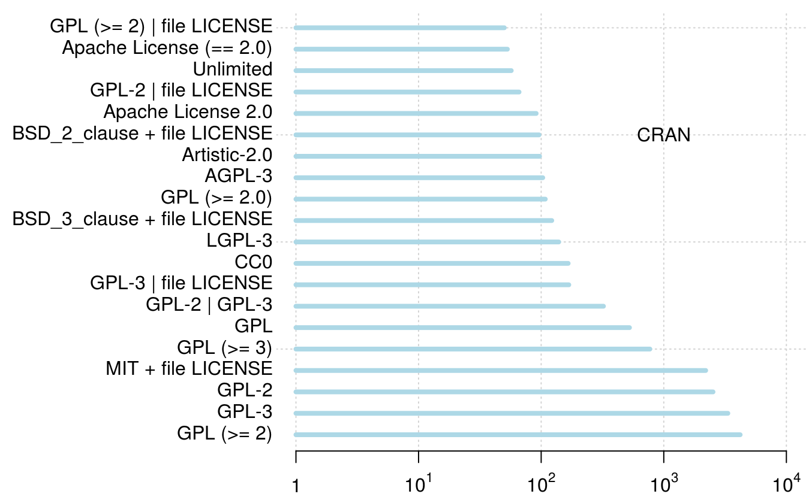

# 案例：分析 CRAN {#case-cran}


```r
library(ggplot2)
library(magrittr)
options(
  ggplot2.continuous.colour = "viridis",
  ggplot2.continuous.fill = "viridis"
)
```

首先我们从 CRAN 官网下载 R 包描述信息


```r
pdb <- tools::CRAN_package_db()
```

接着，我们可以看看CRAN 上发布的 R 包数量


```r
length(pdb[, "Package"])
#> [1] 15367
```

经过与官网发布的数据来对比，我们发现这里计算的结果与实际不符，多出来了几十个R包，所以我们再观察一下是否有重复的 R 包描述信息


```r
pdb[, "Package"][duplicated(pdb[, "Package"])]
#>  [1] "boot"        "class"       "cluster"     "codetools"   "foreign"    
#>  [6] "KernSmooth"  "lattice"     "MASS"        "Matrix"      "mgcv"       
#> [11] "nlme"        "nnet"        "rpart"       "spatial"     "survival"   
#> [16] "adimpro"     "aws"         "frailtypack" "mpmi"
```

不难发现，果然有！所以去掉重复的 R 包信息，就是 CRAN 上实际发布的 R 包数量


```r
dim(subset(pdb, subset = !duplicated(pdb[, "Package"])))[1]
#> [1] 15348
```

接下来就是分析去掉重复信息后的数据矩阵 pdb


```r
pdb <- subset(pdb, subset = !duplicated(pdb[, "Package"]))
```

## R 核心团队 {#R-Core-Team}

R 核心团队除了维护开发 Base R 包以外，还开发了哪些 R 包，我们依据这些开发者邮箱 `<Firstname>.<Lastname>@R-project.org` 的特点，从数据集 pdb 中提取他们开发的 R 包


```r
core_pdb <- subset(pdb,
  subset = grepl(
    x = pdb[, "Maintainer"],
    pattern = "(@R-project\\.org)"
  ),
  select = c("Package", "Maintainer")
)
dim(core_pdb[order(core_pdb[, "Maintainer"]), ])
#> [1] 95  2
```

这么少，是不是有点意外，看来很多大佬更喜欢用自己的邮箱，比如 Paul Murrell， 他的邮箱是 <paul@stat.auckland.ac.nz>


```r
subset(pdb, subset = grepl(x = pdb[, "Maintainer"], pattern = "(Paul Murrell)"), 
                   select = c("Package", "Maintainer"))
#>            Package                              Maintainer
#> 2100       compare Paul Murrell <p.murrell@auckland.ac.nz>
#> 5310    graphicsQC Paul Murrell <paul@stat.auckland.ac.nz>
#> 5342      gridBase Paul Murrell <paul@stat.auckland.ac.nz>
#> 5343    gridBezier Paul Murrell <paul@stat.auckland.ac.nz>
#> 5344     gridDebug Paul Murrell <p.murrell@auckland.ac.nz>
#> 5346  gridGeometry Paul Murrell <paul@stat.auckland.ac.nz>
#> 5347  gridGraphics Paul Murrell <paul@stat.auckland.ac.nz>
#> 5348  gridGraphviz Paul Murrell <p.murrell@auckland.ac.nz>
#> 5351       gridSVG Paul Murrell <paul@stat.auckland.ac.nz>
....
```

所以这种方式不行了，只能列举所有 R Core Team 成员，挨个去匹配，幸好 `contributors()` 函数已经收集了成员名单，不需要我们去官网找了。


```r
core_team <- read.table(
  text = "
Douglas Bates
John Chambers
Peter Dalgaard
Robert Gentleman
Kurt Hornik
Ross Ihaka
Tomas Kalibera
Michael Lawrence
Friedrich Leisch
Uwe Ligges
Thomas Lumley
Martin Maechler
Martin Morgan
Paul Murrell
Martyn Plummer
Brian Ripley
Deepayan Sarkar
Duncan Temple Lang
Luke Tierney
Simon Urbanek
Heiner Schwarte
Guido Masarotto
Stefano Iacus
Seth Falcon
Duncan Murdoch
David Meyer
Simon Wood
", header = FALSE, sep = "\n", check.names = FALSE, stringsAsFactors = FALSE,
  colClasses = "character", comment.char = "", col.names = "name"
)
```

R 核心团队维护的 R 包及其最新发布的日期


```r
core_pdb <- subset(pdb,
  subset = grepl(
    x = pdb[, "Maintainer"],
    pattern = paste("(", core_team$name, ")", collapse = "|", sep = "")
  ),
  select = c("Package", "Maintainer", "Published")
)
```

清理 Maintainer 字段中的邮箱部分，方便表格展示


```r
clean_maintainer <- function(x) {
  # 去掉邮箱
  x <- gsub("<([^<>]*)>", "", x)
  # 去掉 \n \t \' \" 和 '
  x <- gsub("(\\\n)|(\\\t)|(\\\")|(\\\')|(')", "", x)
  # 去掉末尾空格
  x <- gsub(" +$", "", x)
}
core_pdb[, "Maintainer"] <- clean_maintainer(core_pdb[, "Maintainer"])
```

我们可以看到 R 核心团队总共开发维护有 172 个 R 包


```r
dim(core_pdb)
#> [1] 172   3
```

篇幅所限，我们就展示部分人和R包，见表 \@ref(tab:r-core-team) 按照拼音顺序 Brian Ripley 是第一位


```r
knitr::kable(head(core_pdb[order(
  core_pdb[, "Maintainer"],
  core_pdb[, "Published"]
), ], 10),
caption = "R Core Team 维护的 R 包（展示部分）", 
booktabs = TRUE, row.names = FALSE
)
```


Table: (\#tab:r-core-team)R Core Team 维护的 R 包（展示部分）

Package      Maintainer     Published  
-----------  -------------  -----------
spatial      Brian Ripley   2015-08-30 
nnet         Brian Ripley   2016-02-02 
mix          Brian Ripley   2017-06-12 
pspline      Brian Ripley   2017-06-12 
class        Brian Ripley   2019-01-01 
tree         Brian Ripley   2019-04-26 
fastICA      Brian Ripley   2019-07-08 
RODBC        Brian Ripley   2019-09-03 
KernSmooth   Brian Ripley   2019-10-15 
gee          Brian Ripley   2019-11-07 

分组计数，看看每个核心开发者维护的 R 包有多少


```r
sort(table(core_pdb[, "Maintainer"]), decreasing = TRUE)
#> 
#>        Kurt Hornik    Martin Maechler      Simon Urbanek       Paul Murrell 
#>                 28                 26                 24                 18 
#>       Brian Ripley      Thomas Lumley         Uwe Ligges     Duncan Murdoch 
#>                 12                 10                  9                  7 
#>   Michael Lawrence        David Meyer   Friedrich Leisch       Luke Tierney 
#>                  7                  6                  5                  5 
#>      Douglas Bates      John Chambers         Simon Wood    Deepayan Sarkar 
#>                  3                  3                  3                  2 
#>     Martyn Plummer Duncan Temple Lang     Peter Dalgaard 
#>                  2                  1                  1
```


## 高产的开发者 {#Top-Creators}

> 这些人的个人简介

接下来，我们再来查看一些比较高产的 R 包开发者谢益辉都维护了哪些R包，如表 \@ref(tab:rmarkdown-ecology) 所示


```r
yihui_pdb <- subset(pdb,
  subset = grepl("Yihui Xie", pdb[, "Maintainer"]),
  select = c("Package", "Title")
)
yihui_pdb[, "Title"] <- gsub("(\\\n)", " ", yihui_pdb[, "Title"])
knitr::kable(yihui_pdb, caption = "谢益辉维护的 R Markdown 生态", 
             booktabs = TRUE, row.names = FALSE)
```


Table: (\#tab:rmarkdown-ecology)谢益辉维护的 R Markdown 生态

Package      Title                                                                                       
-----------  --------------------------------------------------------------------------------------------
animation    A Gallery of Animations in Statistics and Utilities to Create Animations                    
blogdown     Create Blogs and Websites with R Markdown                                                   
bookdown     Authoring Books and Technical Documents with R Markdown                                     
DT           A Wrapper of the JavaScript Library 'DataTables'                                            
evaluate     Parsing and Evaluation Tools that Provide More Details than the Default                     
formatR      Format R Code Automatically                                                                 
fun          Use R for Fun                                                                               
highr        Syntax Highlighting for R Source Code                                                       
knitr        A General-Purpose Package for Dynamic Report Generation in R                                
markdown     Render Markdown with the C Library 'Sundown'                                                
mime         Map Filenames to MIME Types                                                                 
MSG          Data and Functions for the Book Modern Statistical Graphics                                 
pagedown     Paginate the HTML Output of R Markdown with CSS for Print                                   
printr       Automatically Print R Objects to Appropriate Formats According to the 'knitr' Output Format 
Rd2roxygen   Convert Rd to 'Roxygen' Documentation                                                       
rmarkdown    Dynamic Documents for R                                                                     
rolldown     R Markdown Output Formats for Storytelling                                                  
rticles      Article Formats for R Markdown                                                              
servr        A Simple HTTP Server to Serve Static Files or Dynamic Documents                             
testit       A Simple Package for Testing R Packages                                                     
tinytex      Helper Functions to Install and Maintain 'TeX Live', and Compile 'LaTeX' Documents          
tufte        Tufte's Styles for R Markdown Documents                                                     
xaringan     Presentation Ninja                                                                          
xfun         Miscellaneous Functions by 'Yihui Xie'                                                      

Jeroen Ooms 维护从 C++ 世界搬运进来的库，如图像处理 magick 包、 视频处理 av 包、 PDF 文档操作 qpdf 包


```r
subset(pdb, subset = grepl("Jeroen Ooms", pdb[, "Maintainer"]),
       select = 'Package', drop = TRUE)
#>  [1] "antiword"    "askpass"     "av"          "base64"      "bcrypt"     
#>  [6] "brotli"      "cld2"        "cld3"        "commonmark"  "credentials"
#> [11] "curl"        "gert"        "gifski"      "gpg"         "graphql"    
#> [16] "hunspell"    "jenkins"     "jose"        "js"          "jsonld"     
#> [21] "jsonlite"    "magick"      "minimist"    "mongolite"   "opencpu"    
#> [26] "opencv"      "openssl"     "pdftools"    "protolite"   "qpdf"       
#> [31] "RAppArmor"   "rjade"       "RMySQL"      "rsvg"        "rzmq"       
#> [36] "sodium"      "spelling"    "ssh"         "sys"         "tesseract"  
#> [41] "unix"        "unrtf"       "V8"          "webp"        "webutils"   
#> [46] "writexl"     "xslt"
```

Dirk Eddelbuettel 维护 Rcpp 生态


```r
subset(pdb, subset = grepl("Dirk Eddelbuettel", pdb[, "Maintainer"]),
       select = 'Package', drop = TRUE)
#>  [1] "anytime"             "AsioHeaders"         "BH"                 
#>  [4] "binb"                "dang"                "digest"             
#>  [7] "drat"                "gaussfacts"          "gcbd"               
#> [10] "gettz"               "gunsales"            "inline"             
#> [13] "linl"                "littler"             "nanotime"           
#> [16] "pinp"                "pkgKitten"           "prrd"               
#> [19] "random"              "RApiDatetime"        "RApiSerialize"      
#> [22] "Rblpapi"             "Rcpp"                "RcppAnnoy"          
#> [25] "RcppAPT"             "RcppArmadillo"       "RcppBDT"            
#> [28] "RcppCCTZ"            "RcppClassic"         "RcppClassicExamples"
#> [31] "RcppCNPy"            "RcppDE"              "RcppEigen"          
#> [34] "RcppExamples"        "RcppGetconf"         "RcppGSL"            
#> [37] "RcppMsgPack"         "RcppNLoptExample"    "RcppQuantuccia"     
#> [40] "RcppRedis"           "RcppSMC"             "RcppStreams"        
#> [43] "RcppTOML"            "RcppXts"             "RcppZiggurat"       
#> [46] "RDieHarder"          "rfoaas"              "RInside"            
#> [49] "rmsfact"             "RProtoBuf"           "RPushbullet"        
#> [52] "RQuantLib"           "RVowpalWabbit"       "sanitizers"         
#> [55] "tint"                "ttdo"                "x13binary"
```

Hadley Wickham 维护 tidyverse 生态 


```r
subset(pdb, subset = grepl("Hadley Wickham", pdb[, "Maintainer"]),
       select = 'Package', drop = TRUE)
#>  [1] "assertthat"    "babynames"     "bigrquery"     "classifly"    
#>  [5] "clusterfly"    "conflicted"    "dbplyr"        "dplyr"        
#>  [9] "dtplyr"        "ellipsis"      "feather"       "forcats"      
#> [13] "fueleconomy"   "ggplot2"       "ggplot2movies" "gtable"       
#> [17] "haven"         "hflights"      "highlight"     "httr"         
#> [21] "lazyeval"      "lobstr"        "lvplot"        "meifly"       
#> [25] "modelr"        "nasaweather"   "nycflights13"  "pkgdown"      
#> [29] "plyr"          "productplots"  "profr"         "proto"        
#> [33] "pryr"          "rappdirs"      "reshape"       "reshape2"     
#> [37] "rggobi"        "roxygen2"      "rvest"         "scales"       
#> [41] "sloop"         "stringr"       "testthat"      "tidyr"        
#> [45] "tidyverse"     "vctrs"
```

[Scott Chamberlain](https://scottchamberlain.info/) 是非营利性组织 [rOpenSci](https://ropensci.org/) 的联合创始人，但是没几个 R 包听说过


```r
subset(pdb, subset = grepl("Scott Chamberlain", pdb[, "Maintainer"]),
       select = 'Package', drop = TRUE)
#>  [1] "analogsea"   "bold"        "brranching"  "ccafs"       "charlatan"  
#>  [6] "citecorp"    "ckanr"       "conditionz"  "cowsay"      "crminer"    
#> [11] "crul"        "discgolf"    "elastic"     "fauxpas"     "finch"      
#> [16] "fulltext"    "geoaxe"      "geojson"     "geojsonio"   "geojsonlint"
#> [21] "geoops"      "getlandsat"  "gistr"       "handlr"      "hoardr"     
#> [26] "httpcode"    "httping"     "isdparser"   "jaod"        "jqr"        
#> [31] "lawn"        "mapr"        "microdemic"  "mregions"    "natserv"    
#> [36] "nodbi"       "oai"         "openadds"    "originr"     "pangaear"   
#> [41] "phylocomr"   "pleiades"    "pubchunks"   "randgeo"     "rbhl"       
#> [46] "rbison"      "rbraries"    "rcitoid"     "rcoreoa"     "rcrossref"  
#> [51] "rdatacite"   "rdpla"       "rdryad"      "request"     "rerddap"    
#> [56] "rgbif"       "rif"         "ritis"       "rjsonapi"    "rnoaa"      
#> [61] "rnpn"        "rorcid"      "rphylopic"   "rplos"       "rredlist"   
#> [66] "rsnps"       "rvertnet"    "scrubr"      "seaaroundus" "sofa"       
#> [71] "solrium"     "spocc"       "taxize"      "taxizedb"    "traits"     
#> [76] "vcr"         "webmockr"    "wellknown"   "wikitaxa"    "worrms"     
#> [81] "zbank"
```

## 社区开发者 {#R-Package-Developers}

接下来，我们想看看 R 包维护者数量有多少


```r
length(unique(pdb[, "Maintainer"]))
#> [1] 9057
```

可实际上没有这么多的开发者，因为存在这样的情况，以 R 包维护者 Hadley Wickham 为例，由于他曾使用过不同的邮箱，所以在维护者字段出现了不一致的情况，实际却是同一个人。


```r
subset(pdb,
  subset = grepl("Hadley Wickham", pdb[, "Maintainer"]),
  select = c("Package", "Maintainer")
)
#>             Package                             Maintainer
#> 511      assertthat    Hadley Wickham <hadley@rstudio.com>
#> 640       babynames    Hadley Wickham <hadley@rstudio.com>
#> 1024      bigrquery    Hadley Wickham <hadley@rstudio.com>
#> 1830      classifly   Hadley Wickham <h.wickham@gmail.com>
#> 1917     clusterfly   Hadley Wickham <h.wickham@gmail.com>
#> 2171     conflicted    Hadley Wickham <hadley@rstudio.com>
#> 2705         dbplyr    Hadley Wickham <hadley@rstudio.com>
#> 3210          dplyr    Hadley Wickham <hadley@rstudio.com>
#> 3296         dtplyr    Hadley Wickham <hadley@rstudio.com>
....
```

因此，有必要先把 Maintainer 字段中的邮箱部分去掉，这样我们可以得到比较靠谱的R包维护者数量了！


```r
pdb[, "Maintainer"] <- clean_maintainer(pdb[, "Maintainer"])
length(unique(pdb[, "Maintainer"]))
#> [1] 8374
```

接下来，我们还想把 R 包维护者，按照其维护的R包数量排个序，用条形图\@ref(fig:top-maintainers) 表示


```r
top_maintainer <- head(sort(table(pdb[, "Maintainer"]), decreasing = TRUE), 20)

par(mar = c(2, 7, 1, 1))
barCenters <- barplot(top_maintainer,
  col = "lightblue", axes = FALSE,
  axisnames = FALSE, horiz = TRUE, border = "white"
)
text(
  y = barCenters, x = par("usr")[3],
  adj = 1, labels = names(top_maintainer), xpd = TRUE
)
axis(1,
  labels = seq(0, 90, by = 10), at = seq(0, 90, by = 10),
  las = 1, col = "gray"
)
grid()
```

<div class="figure" style="text-align: center">

<p class="caption">(\#fig:top-maintainers)(ref:top-maintainers)</p>
</div>

调用 ggplot2 包绘图要求输入的数据类型是 `data.frame`，所以我们首先将 `top_maintainer` 转化为数据框类型


```r
top_maintainer <- as.data.frame(top_maintainer)
colnames(top_maintainer) <- c("Maintainer", "Freq")

ggplot(top_maintainer) +
  geom_bar(aes(x = Maintainer, y = Freq), stat = "identity") +
  coord_flip() +
  xlab("Maintainer") +
  ylab("Numbers of Package")
```


条形图在柱子很多的情况下，点线图是一种更加简洁的替代方式


```r
ggplot(top_maintainer, aes(x = Freq, y = Maintainer)) +
  geom_segment(aes(x = 20, xend = Freq, yend = Maintainer), colour = "grey50") +
  geom_point(size = 2, colour = "red") +
  labs(x = " # of Packages ", y = " Maintainer ")
```



接下来，我们想看看开发者维护的 R 包数量的分布，仅从上图，我们知道有的人能维护 80 多个 R 包，总体的分布情况又是如何呢？如图所示，我们将纵轴刻度设置为 log 模式，随着开发的R包数量的增加，开发者人数是指数级递减，可见开发R包依然是一个门槛很高的工作！


```r
barplot(table(table(pdb[, "Maintainer"])),
  col = "lightblue", log = "y", border = "white",
  xlab = "# of Packages", ylab = "# of Maintainers (log)",
  panel.first = grid()
)
```


只开发一个 R 包的人数达到 5276 人，占开发者总数的 67.31\%，约为2/3。

## 首次贡献 R 包 {#first-commit}

我们还想进一步了解这些人是不是就自己开发自己维护，基本没有其他人参与，答案是 Almost Sure. 这些人其实占了大部分，相比于前面的 R 核心开发团队或者 R Markdown 生态的维护者，他们绝大部分属于金字塔底部的人，二八定律似乎在这里再次得到印证。


```r
sub_pdb <- subset(pdb, select = c("Package", "Maintainer", "Author"))
```

接着先清理一下 Maintainer 和 Author 字段，Author 字段的内容比起 Maintainer 复杂一些


```r
clean_author <- function(x) {
  # 去掉中括号及其内容 [aut] [aut, cre]
  x <- gsub("(\\[.*?\\])", "", x)
  # 去掉小括号及其内容 ()
  x <- gsub("(\\(.*?\\))", "", x)
  # 去掉尖括号及其内容 < >
  x <- gsub("(<.*?>)", "", x)
  # 去掉 \n
  x <- gsub("(\\\n)", "", x)
  # 去掉制表符、双引号、单引号和 \'，如 'Hadley Wickham' 中的单引号 ' 等
  x <- gsub("(\\\t)|(\\\")|(\\\')|(')|(\\))", "", x)
  # Christian P. Robert, Universite Paris Dauphine, and Jean-Michel\n        Marin, Universite Montpellier 2
  x <- gsub("(and)", "", x)
  # 两个以上的空格替换为一个空格
  x <- gsub("( {2,})"," ",x)
  x
}

sub_pdb[, "Maintainer"] <- clean_maintainer(sub_pdb[, "Maintainer"])
sub_pdb[, "Author"] <- clean_author(sub_pdb[, "Author"])
```

维护多个 R 包的开发者数量


```r
length(unique(sub_pdb[, "Maintainer"][duplicated(sub_pdb[, "Maintainer"])]))
#> [1] 2725
```

总的开发者中去掉开发了多个R包的人，就剩下只维护1个R包的开发者，共有 


```r
first_ctb <- setdiff(
  sub_pdb[, "Maintainer"][!duplicated(sub_pdb[, "Maintainer"])],
  unique(sub_pdb[, "Maintainer"][duplicated(sub_pdb[, "Maintainer"])])
)
```

按照每个R包贡献者的数量分组，如图所示，有一个或者没有贡献者的占总数占 70.60\%，说明这些 R 包的开发者基本在单干，有 4 个及以下的贡献者占总数（这个总数是指只开发了一个R包的那些开发者）的 90.85\%。


```r
ctb_num <- unlist(
  lapply(
    strsplit(
      subset(sub_pdb,
             subset = sub_pdb[, "Maintainer"] %in% first_ctb,
             select = "Author", drop = TRUE # drop out data.frame return vector
      ),
      split = ","
    ), length
  )
)
hist(ctb_num, col = "lightblue", border = "white", probability = TRUE, labels = TRUE,
     xlab = "# of Contributors", ylab = "Proportion", main = "",
     panel.first = grid(), xlim = c(0, 10))
```


这些基本单干的R包开发者是否参与其它 R 包的贡献？如果不参与，则他们对社区的贡献非常有限，仅限于为社区带来数量上的堆积！


```r
table(ctb_num)
#> ctb_num
#>    1    2    3    4    5    6    7    8    9   10   11   12   13   14   15 
#> 2733 1178  744  452  201  112   78   49   30   26    9    8    3    4    3 
#>   16   17   18   19   21   22   27   42 
#>    5    3    2    1    3    2    2    1
```

有意思的是，有一个开发者虽然只开发了一个 R 包，但是却引来37位贡献者（包括开发者本人在内），下面把这个颇受欢迎的 R 包找出来


```r
# 找到开发者
first_ctb[which.max(ctb_num)]
#> [1] "Matt Dowle"
# 找到 R 包
subset(sub_pdb, subset = grepl("Matt Dowle", sub_pdb[, "Maintainer"]), select = "Package")
#>         Package
#> 2627 data.table
```

哇，大名鼎鼎的 [data.table](https://github.com/Rdatatable/data.table) 包！！ I JUST find it!! 这是个异数，我们知道 data.table 在R社区享有盛名，影响范围很广，从 Matt Dowle 的 [Github 主页](https://github.com/mattdowle) 来看，他确实只开发了这一个 R 包！黑天鹅在这里出现了！如果按照谁的贡献者多谁影响力大的规律来看，有 10 个以上贡献者的其它几个 R 包也必定是名器！这里留给读者把它找出来吧！

## 贡献关系网络 {#Contribution-Network}

<!-- 综合上面的分析，社区的主要推动者是余下的 1/3，他们相互之间的合作应该比较多，我们接下来想分析一下他们之间的贡献网络。 -->

接下来进入本节最核心的部分，分析所有的开发者之间的贡献网络，在第\@ref(first-commit)节清理 Author 字段的正则表达式几乎不可能覆盖到所有的情况，所以既然 Maintainer 字段是比较好清理的，不妨以它作为匹配的模式去匹配 Author 字段，这样做的代价就是迭代次数会很多，增加一定的计算负担，但是为了更加准确的清理结果，也是拼了！


```r
net_pdb <- subset(pdb, select = c("Maintainer", "Author"))
net_pdb[, "Maintainer"] <- clean_maintainer(net_pdb[, "Maintainer"])
total_maintainer <- unique(net_pdb[, "Maintainer"])
clean_author <- function(maintainer) {
  sapply(net_pdb[, "Author"], grepl, pattern = paste0("(", maintainer, ")"))
}
```

接下来是非常耗时的一步，实际是两层循环 1.2 亿次左右的查找计算， `grepl` 耗时 30分钟左右，正则表达式本身的性能优化问题，`maintainer_author` 逻辑型矩阵占用内存空间 430 M 左右


```r
maintainer_author <- Reduce("cbind", lapply(total_maintainer, clean_author))
colnames(maintainer_author) <- total_maintainer
rownames(maintainer_author) <- net_pdb[, "Maintainer"]
```

为了重复运行这段耗时很长的代码，我们将中间结果保存到磁盘，推荐保存为 R 支持的序列化后的数据格式 `*.rds`，相比于 `*.csv` 格式能极大地减少磁盘存储空间，读者可运行下面两行保存数据的代码，比较看看！ 


```r
saveRDS(maintainer_author, file = "data/maintainer_author.rds")
write.table(maintainer_author,file = "data/maintainer_author.csv", row.names = TRUE, col.names = TRUE)
```


查看 `maintainer_author` 数据集占用内存空间的大小


```r
format(object.size(maintainer_author), units = "auto")
#> [1] "430.5 Mb"
```

看几个数字，R 包贡献者最多的有 62 人,这个 R 包的粉丝是真多！有一个开发者对 137 个 R 包的做出过贡献，其中包括自己开发的 R 包，快来快来抓住他！


```r
max(rowSums(maintainer_author))
#> [1] 62
max(colSums(maintainer_author))
#> [1] 137
```

继续看看每个开发者对外贡献的量的分布情况，由图可知，绝大部分开发者对外输出不超过 3，其表示对其它 R 包的贡献不超过 3个


```r
hist(colSums(maintainer_author)[colSums(maintainer_author) <= 10], 
     probability = FALSE, xlab = "", main = "")
```


每个 R 包参与贡献的人数分布又是如何呢？如图所示，基本集中在1~2个人的样子


```r
hist(rowSums(maintainer_author)[rowSums(maintainer_author) <= 20], 
     xlab = "", main = "",probability = FALSE)
```


好了，接下来我们要深入挖掘贡献协作网络中的结构特点，看看是不是由几位领导人在完全掌控，还有一大群人其实是自己搞自己的那点事，写论文、发布 R 包、投稿等如此循环。其实这就是 R 社区的特点，也决定了它不会像 Python 那样应用性强，有足够多的工程开发人员加入。大多数人写 R 包只是为了配合发论文而已，并不关心有没有人来用自己的 R 包！此外，没有人来做功能整合和持续维护，所以发展缓慢！各自造轮子的事情太多！

接着，先从表面看看开发者和贡献者的关系矩阵，`maintainer_author` 是一个大型的超稀疏矩阵，非零元素最多的行、列分别只占 0.79\% 和 0.95\%，都不到百分之一。


```r
# 非零元素最多的行
max(rowMeans(maintainer_author))
#> [1] 0.007904131
# 非零元素最多的列
max(colMeans(maintainer_author))
#> [1] 0.009548369
```

> 用稀疏索引的方式重新编码矩阵，然后用[社群检测的算法][community-detection]找到其中的结构，网络关系图用 Gephi 画，igraph 肯定是不行了，参考文献 [社会网络分析：探索人人网好友推荐系统](https://cosx.org/2011/04/exploring-renren-social-network) 网络的统计建模分析 [^statnet]

重新获取 `maintainer_author` 矩阵，存储指标向量，然后调用 Matrix 生成稀疏矩阵，后续的数据操作就好办了，因为 Matrix 包是内置的，它定义的稀疏矩阵类其它 R 包也都支持。先以一个简单的例子说明构造稀疏矩阵的过程


```r
library(Matrix)
spM <- spMatrix(3, 4, i = c(1, 1, 2, 3, 3), 
                j = c(4, 1, 2, 1, 3),
                x = c(4, 4, 1, 4, 8))
spM
#> 3 x 4 sparse Matrix of class "dgTMatrix"
#>             
#> [1,] 4 . . 4
#> [2,] . 1 . .
#> [3,] 4 . 8 .
image(spM)
```

<div class="figure" style="text-align: center">

<p class="caption">(\#fig:vis-sparse-mat)稀疏矩阵的图表示</p>
</div>

`i` 和 `j` 表示矩阵中有值的位置，`x` 表示对应位置上的值，`i`，`j` 和 `x` 是三个长度相等的数值型向量，我们还可以调用 `image `函数，把稀疏矩阵可视化出来，对于大型稀疏矩阵可视化其稀疏模式是重要的。

> 贡献网络可视化 [^intro-igraph]


```r
clean_net_pdb <- function(maintainer) {
  index <- clean_author(maintainer)
  if (sum(index) == 0) {
    return(NULL)
  }
  data.frame(
    from_id = maintainer,
    to_id = net_pdb[, "Maintainer"][index],
    stringsAsFactors = FALSE
  )
}
```


```r
# maintainer_author <- data.table::rbindlist(lapply(total_maintainer, clean_net_pdb))
# saveRDS(maintainer_author, file = "data/maintainer_author.rds")
toc <- system.time({
  maintainer_author_net <- Reduce("rbind", lapply(total_maintainer, clean_net_pdb))
}, gcFirst = TRUE)
```


分组统计开发者之间贡献次数，从开发者到


```r
maintainer_author_net$weight <- 1
edges <- aggregate(weight ~ from_id + to_id, data = maintainer_author_net, sum)

dup_edges <- edges[edges[, 1] != edges[, 2], ]

library(geomnet)
ggplot(data = dup_edges, aes(from_id = from_id, to_id = to_id)) +
  geom_net(aes(linewidth = weight),
    layout.alg = "kamadakawai",
    labelon = FALSE, directed = TRUE, show.legend = FALSE, ealpha = 1,
    ecolour = "grey70", arrowsize = 0.1, size = 0.5
  ) +
  theme_net()
```


```r
# https://smallstats.blogspot.jp/2012/12/loading-huge-graphs-with-igraph-and-r.html
library(igraph)
# 贡献矩阵
ctb_df <- graph.data.frame(maintainer_author, directed = TRUE)

vertex.attrs <- list(name = unique(c(ctb_df$from_id, ctb_df$to_id)))
edges <- rbind(
  match(ctb_df$from_id, vertex.attrs$name),
  match(ctb_df$to_id, vertex.attrs$name)
)

ctb_net <- graph.empty(n = 0, directed = T)
ctb_net <- add.vertices(ctb_net, length(vertex.attrs$name), attr = vertex.attrs)
ctb_net <- add.edges(ctb_net, edges)
```

[community-detection]: https://bommaritollc.com/2012/06/17/summary-community-detection-algorithms-igraph-0-6/

(ref:top-maintainers) 维护R包数量最多的20个人[^orphaned]

[^statnet]: Statistical Modeling of Networks in R <https://user2010.org/Invited/handcockuser2010.pdf>
[^intro-igraph]: Network Analysis and Visualization with R and igraph <https://kateto.net/networks-r-igraph> with [PDF](https://kateto.net/wp-content/uploads/2016/01/NetSciX_2016_Workshop.pdf)
[^orphaned]: 其中 Orphaned 表示之前的R包维护者不愿意继续维护了，后来有人接手维护，Orphaned 表示这一类接盘侠


## 更新知多少 {#CRAN-Update-Packages}

这节标题取其字面意思表达 CRAN 服务器的特殊日子 2012-10-29，那天 CRAN 更新了一大波 R 包，像一根擎天柱一样支撑这幅图！


```r
update_pdb <- as.data.frame(pdb[, c("Package", "Published")], stringsAsFactors = FALSE)
# 这天要更新的R包最多
sort(table(update_pdb[,"Published"]), decreasing = TRUE)[1]
#> 2012-10-29 
#>        127

ggplot(update_pdb, aes(as.Date(Published))) +
  geom_bar(color = "skyblue4") +
  geom_line(
    data = data.frame(
      date = as.Date(c("2011-01-01", "2012-10-20")),
      count = c(80, 100)
    ), aes(x = date, y = count),
    arrow = arrow(angle = 15, length = unit(0.15, "inches"))
  ) +
  annotate("text", x = as.Date("2010-11-01"), y = 75, label = "(2012-10-29,130)") +
  scale_x_date(date_breaks = "1 year", date_labels = "%Y") +
  labs(x = "Published Date", y = "Count") +
  theme_minimal()
```

<div class="figure" style="text-align: center">

<p class="caption">(\#fig:pdb-update-history)R 包更新历史</p>
</div>

当日发布的R包，不论是新增还是更新之前发布的R包都视为最新版，当日之前的都是旧版本，它们可能存在已经修复的 BUG！这句子好奇怪是吧，因为很多 R 包要么托管在 Github 上，要么托管在 [R-Forge](https://r-forge.r-project.org/) 上开发，而 CRAN 上的版本除了发布日外，一般来讲都会落后。如图所示待更新的 R 包在日期上的分布，有的已经10来年没有更新了，最老的 R 包可以追溯到 2006-03-15，它是 coxrobust！！


## 使用许可证 {#Package-Licenses}

> 列举 R 社区使用的许可证及其区别和联系
R 开源还体现在许可证信息，顺便谈谈美国和中国技术封锁，开源社区可能面临的风险

社区主要使用 GPL 及其相关授权协议，因为 R 软件本身也是授权在 GPL-2 或 GPL-3 下


```r
license_pdb <- head(sort(table(pdb[, "License"]), decreasing = TRUE), 20)
par(mar = c(2, 12, 0.5, 0))
plot(c(1, 1e1, 1e2, 1e3, 1e4), c(1, 5, 10, 15, 20),
     type = "n",panel.first = grid(),
     ann = FALSE, log = "x", axes = FALSE
)
axis(1,
     at = c(1, 1e1, 1e2, 1e3, 1e4),
     labels = expression(1, 10^1, 10^2, 10^3, 10^4)
)
text(
  y = seq(length(license_pdb)), x = 1, cex = 1, offset = 1,
  pos = 2, labels = names(license_pdb), xpd = TRUE
)
text(1e3, 15, "CRAN")
segments(x0 = 1, y0 = seq(length(license_pdb)), 
         x1 = license_pdb, y1 = seq(length(license_pdb)), 
         col = "lightblue", lwd = 4)
```

<div class="figure" style="text-align: center">

<p class="caption">(\#fig:license-cran)CRAN 上采用的发布协议</p>
</div>


```r
rforge_pdb <- available.packages(repos = "http://R-Forge.R-project.org")
license_rforge_pdb <- head(sort(table(rforge_pdb[, "License"]), decreasing = TRUE), 20)
par(mar = c(2, 12, 0.5, 0))
plot(c(1, 1e1, 1e2, 1e3), seq(from = 1, to = 20,length.out = 4),
  type = "n",panel.first = grid(),
  ann = FALSE, log = "x", axes = FALSE
)
axis(1,
  at = c(1, 1e1, 1e2, 1e3),
  labels = expression(1, 10^1, 10^2, 10^3)
)

text(
  y = seq(length(license_rforge_pdb)), x = 1, cex = 1, offset = 1,
  pos = 2, labels = names(license_rforge_pdb), xpd = TRUE
)
text(1e2, 15, "R-Forge")
segments(x0 = 1, y0 = seq(length(license_rforge_pdb)), 
         x1 = license_rforge_pdb, y1 = seq(length(license_rforge_pdb)), 
         lwd = 4, col = "lightblue")
```

<div class="figure" style="text-align: center">

<p class="caption">(\#fig:license-rforge)R-Forge 开发者采用的发布协议</p>
</div>


> 改进的方向是含义相同的进行合并，这需要研究一下各个许可证，然后使用对比型条形图合并上面两个图

CRAN 会检测 R 包的授权，只有授权协议包含在数据库中的才可以在 CRAN 上发布 <https://svn.r-project.org/R/trunk/share/licenses/license.db>


## R 包增长速度

```r
# 抓取网页数据
library(rvest)
library(dplyr)
library(zoo)
url <- "https://cran.r-project.org/web/packages/available_packages_by_date.html"
page <- read_html(url)
page %>%
  html_node("table") %>%
  html_table() %>%
  mutate(count = rev(1:nrow(.))) %>%
  mutate(Date = as.Date(Date)) %>%
  mutate(Month = format(Date, format = "%Y-%m")) %>%
  group_by(Month) %>%
  summarise(published = min(count)) %>%
  mutate(Date = as.Date(as.yearmon(Month))) -> pkgs
# 计算自2013年以来R包增长速度
pkgs %>%
  filter(Date > as.Date("2012-12-31")) %>%
  mutate(publishedGrowth = c(tail(.$published, -1), NA) / published) %>%
  mutate(counter = 1:nrow(.)) -> new_pkgs
# 绘图
library(ggplot2)
library(grid)
gg <- ggplot(pkgs, aes(x = Date, y = published)) +
  geom_line(size = 1.5) +
  scale_y_log10(
    breaks = c(0, 10, 100, 1000, 10000),
    labels = c("1", "10", "100", "1.000", "10.000")
  ) +
  labs(
    x = "", y = "# Packages (log)",
    title = "Packages published on CRAN ever since"
  ) +
  theme_minimal(base_size = 14, base_family = "sans") +
  theme(panel.grid.major.x = element_blank()) +
  geom_hline(yintercept = 0, size = 1, colour = "#535353")

gg2 <- ggplot(new_pkgs, aes(x = Date, y = published)) +
  geom_line(size = 1) +
  geom_line(
    data = new_pkgs, aes(y = (min(published) * 1.048^counter)),
    color = "red", size = .7, linetype = 1
  ) +
  annotate("segment",
           x = as.Date("2015-04-01"), xend = as.Date("2015-08-01"),
           y = 1000, yend = 1000, colour = "red", size = 1
  ) +
  annotate("text",
           x = as.Date("2016-12-01"),
           y = 1000, label = "4.6% growth estimation", size = 3.5
  ) +
  scale_y_continuous(
    breaks = seq(from = 0, to = 12000, by = 2000),
    labels = seq(from = 0, to = 12000, by = 2000)
  ) +
  labs(y = "# Packages", x = "", 
       subtitle = "Packages published on CRAN since 2013") +
  theme_minimal(
    base_size = 11, base_family = "sans"
  ) +
  theme(panel.grid.major.x = element_blank()) +
  geom_hline(yintercept = 0, size = .6, colour = "#535353")
gg
print(gg2, vp = viewport(.70, .31, .43, .43))
```


## 选择 R 包 {#Choose-Package}

R 社区开发的 R 包实在太多了，重复造的轮子也很多，哪个轮子结实好用就选哪个，挑选合适的 R 包

```r
install.packages("formattable")
devtools::install_github("ropenscilabs/packagemetrics")

library(formattable)
library(packagemetrics)
library(dplyr)

address <- sprintf("%s/web/packages/packages.rds", getOption("repos")["CRAN"])
con <- url(address, "rb")
pdb <- as.data.frame(readRDS(gzcon(con)), stringsAsFactors = FALSE)
close(con)

packages <- subset(pdb, Maintainer == maintainer("rmarkdown"), select = "Package")

pd <- apply(packages, 1, combine_metrics) %>%
  data.table::rbindlist() %>%
  select(
    package, published, dl_last_month,
    stars, forks, last_commit,
    depends_count, watchers
  ) %>%
  mutate(last_commit = round(last_commit, 1))

pd[is.na(pd)] <- ""

formattable(pd, list(
  package = formatter("span",
    style = x ~ style(font.weight = "bold")
  ),
  contributors = color_tile("white", "#1CC2E3"),
  depends_count = color_tile("white", "#1CC2E3"),
  reverse_count = color_tile("white", "#1CC2E3"),
  tidyverse_happy = formatter("span",
    style = x ~ style(color = ifelse(x, "purple", "white")),
    x ~ icontext(ifelse(x, "glass", "glass"))
  ),
  vignette = formatter("span",
    style = x ~ style(color = ifelse(x, "green", "white")),
    x ~ icontext(ifelse(x, "ok", "ok"))
  ),
  has_tests = formatter("span",
    style = x ~ style(color = ifelse(x, "green", "red")),
    x ~ icontext(ifelse(x, "ok", "remove"))
  ),
  dl_last_month = color_bar("#56A33E"),
  forks = color_tile("white", "#56A33E"),
  stars = color_tile("white", "#56A33E"),
  last_commit = color_tile("#F06B13", "white", na.rm = T)
))

webshot::webshot(url = "http://localhost:16977/session/viewhtml150c673821fc/index.html",file = "figures/packages.png")
```

## 运行环境 {#cs-network-session-info}


```r
xfun::session_info()
#> R Under development (unstable) (2020-01-03 r77628)
#> Platform: x86_64-pc-linux-gnu (64-bit)
#> Running under: Ubuntu 16.04.6 LTS
#> 
#> Locale:
#>   LC_CTYPE=en_US.UTF-8       LC_NUMERIC=C              
#>   LC_TIME=en_US.UTF-8        LC_COLLATE=en_US.UTF-8    
#>   LC_MONETARY=en_US.UTF-8    LC_MESSAGES=en_US.UTF-8   
#>   LC_PAPER=en_US.UTF-8       LC_NAME=C                 
#>   LC_ADDRESS=C               LC_TELEPHONE=C            
#>   LC_MEASUREMENT=en_US.UTF-8 LC_IDENTIFICATION=C       
#> 
#> Package version:
#>   assertthat_0.2.1   backports_1.1.5    base64enc_0.1.3   
#>   BH_1.72.0.2        bookdown_0.16      cli_2.0.0         
#>   colorspace_1.4-1   compiler_4.0.0     crayon_1.3.4      
#>   curl_4.3           digest_0.6.23      dplyr_0.8.3       
#>   ellipsis_0.3.0     evaluate_0.14      fansi_0.4.0       
#>   farver_2.0.1       ggplot2_3.2.1      glue_1.3.1        
#>   graphics_4.0.0     grDevices_4.0.0    grid_4.0.0        
#>   gtable_0.3.0       highr_0.8          htmltools_0.4.0   
#>   jsonlite_1.6       knitr_1.26         labeling_0.3      
#>   lattice_0.20-38    lazyeval_0.2.2     lifecycle_0.1.0   
#>   magrittr_1.5       markdown_1.1       MASS_7.3.51.5     
#>   Matrix_1.2-18      methods_4.0.0      mgcv_1.8.31       
#>   mime_0.8           munsell_0.5.0      nlme_3.1.143      
#>   pillar_1.4.3       pkgconfig_2.0.3    plogr_0.2.0       
#>   plyr_1.8.5         purrr_0.3.3        R6_2.4.1          
#>   RColorBrewer_1.1.2 Rcpp_1.0.3         reshape2_1.4.3    
#>   rlang_0.4.2        rmarkdown_2.0      scales_1.1.0      
#>   splines_4.0.0      stats_4.0.0        stringi_1.4.3     
#>   stringr_1.4.0      tibble_2.1.3       tidyselect_0.2.5  
#>   tinytex_0.18       tools_4.0.0        utf8_1.1.4        
#>   utils_4.0.0        vctrs_0.2.1        viridisLite_0.3.0 
#>   withr_2.1.2        xfun_0.11          yaml_2.2.0        
#>   zeallot_0.1.0
```

