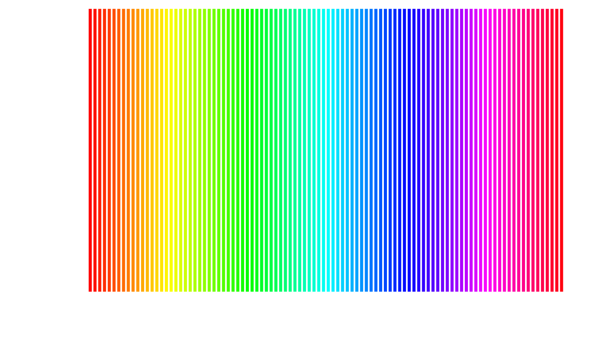

# 色彩与字体 {#colors-fonts}

## 颜色 {#colors-in-r}

在 R 语言中，如何表示颜色，

1. 使用内置的颜色名称，如 `red` 表示红色，`green` 表示绿色，而 `blue` 表示蓝色，完整的颜色名称列表，见 `colors()` 或者 `colours()`，有人整理了一张 R 内置的颜色名称和对应颜色图 <https://stat.columbia.edu/~tzheng/files/Rcolor.pdf>，可供参考
1. 用十六进制的字符串表示颜色，如 `#000000` 表示黑色，`#FF0000` 表示红色，`#00FF00` 表示绿色

如何构造颜色

1. `rgb` 函数是最常用的

红(red)、绿(green)、蓝(blue)是三原色，由他们的不同配比可以构成大千世界里五光十色


```r
rgb(red, green, blue, alpha, names = NULL, maxColorValue = 1)
```

函数参数说明：

- `red, blue, green` 取值范围$[0,M]$，$M$ 是 `maxColorValue` 默认情况下参数 `maxColorValue` 为 1
- `names` 字符向量，给这组颜色值取名
- `maxColorValue` 红，绿，蓝三色范围的最大值 
- `alpha` 是颜色的透明度

rgb 产生一种颜色，如 `rgb(255, 0, 0, maxColorValue = 255)` 的颜色是 `"#FF0000"` ，这是一串16进制数，每两个一组，那么一组有 $16^2 = 256$ 种组合，整个一串有 $256^3 = 16777216$ 种组合，这就是RGB表达的所有颜色，一个标准的 RGB 颜色空间，即 sRGB (IEC
standard 61966)。用色条示意，如图 \@ref(fig:rgb-rainbow)


```r
# 黑色 红色 绿色 黄色 蓝色 紫色 青色 白色
rgb(expand.grid(r = c(0, 1), g = c(0, 1), b = c(0, 1)))
#> [1] "#000000" "#FF0000" "#00FF00" "#FFFF00" "#0000FF" "#FF00FF" "#00FFFF"
#> [8] "#FFFFFF"
```

`palette("default")` 默认的调色板将灰色替换上述白色


```r
barplot(seq(8), col = palette("default"), border = "white")
```

<div class="figure" style="text-align: center">

<p class="caption">(\#fig:default-palette)默认的调色板</p>
</div>


```r
barplot(rep(1, times = 100), col = rainbow(100), border = FALSE, axes = FALSE)
```

<div class="figure" style="text-align: center">

<p class="caption">(\#fig:rgb-rainbow)内置的彩虹系调色板</p>
</div>


## 配色 {#choose-colors}

调色板合集 [paletteer](https://github.com/EmilHvitfeldt/paletteer)，其收录了很多 R 包制作的调色板，其中包括 [r-color-palettes](https://github.com/EmilHvitfeldt/r-color-palettes) 和 [wesanderson](https://github.com/karthik/wesanderson)，根据电影 Harry Potter 制作的调色板 [harrypotter](https://github.com/aljrico/harrypotter)，根据网站 [CARTO](https://carto.com/) 设计的 [rcartocolor](https://github.com/Nowosad/rcartocolor) 包

[colorblindr](https://github.com/clauswilke/colorblindr) 模拟色盲环境下的配色方案

不同的颜色模式，从 RGB 到 HCL 的基本操作 <https://stat545.com/block018_colors.html>


```r
# https://github.com/hadley/ggplot2-book
library(tidyverse)
hcl <- expand.grid(x = seq(-1, 1, length = 100), y = seq(-1, 1, length=100)) %>%
  tbl_df() %>%
  filter(x^2 + y^2 < 1) %>%
  mutate(
    r = sqrt(x^2 + y^2),
    c = 100 * r,
    h = 180 / pi * atan2(y, x),
    l = 65,
    colour = hcl(h, c, l)
  )
#> Warning: `tbl_df()` is deprecated as of dplyr 1.0.0.
#> Please use `tibble::as_tibble()` instead.
#> This warning is displayed once every 8 hours.
#> Call `lifecycle::last_warnings()` to see where this warning was generated.

# sin(h) = y / (c / 100)
# y = sin(h) * c / 100

cols <- scales::hue_pal()(5)
selected <- colorspace::RGB(t(col2rgb(cols)) / 255) %>%
  as("polarLUV") %>%
  colorspace::coords() %>%
  as.data.frame() %>%
  mutate(
    x = cos(H / 180 * pi) * C / 100,
    y = sin(H / 180 * pi) * C / 100,
    colour = cols
  )

ggplot(hcl, aes(x, y)) +
  geom_raster(aes(fill = colour)) +
  scale_fill_identity() +
  scale_colour_identity() +
  coord_equal() +
  scale_x_continuous("", breaks = NULL) +
  scale_y_continuous("", breaks = NULL) +
  geom_point(data = selected, size = 10, color = "white") +
  geom_point(data = selected, size = 5, aes(colour = colour))
```

<div class="figure" style="text-align: center">

<p class="caption">(\#fig:unnamed-chunk-3)HCL调色</p>
</div>

R 内置了 502 种不同颜色的名称，下面随机地选取 20 种颜色


```r
sample(colors(TRUE), 20)
#>  [1] "azure4"          "gray48"          "palevioletred4"  "gray4"          
#>  [5] "orangered2"      "lightblue1"      "mediumvioletred" "mediumorchid2"  
#>  [9] "orange4"         "mediumorchid1"   "brown4"          "orangered"      
#> [13] "rosybrown3"      "darkorchid3"     "darkred"         "mediumpurple3"  
#> [17] "pink2"           "green"           "bisque3"         "gray14"
```

R 包 grDevices 提供 hcl 调色板[^hcl-palettes] 调制两个色板

[^hcl-palettes]: https://developer.r-project.org/Blog/public/2019/04/01/hcl-based-color-palettes-in-grdevices/index.html


```r
# Colors from https://github.com/johannesbjork/LaCroixColoR
color_pal <- c("#FF3200", "#E9A17C", "#E9E4A6", "#1BB6AF", "#0076BB", "#172869")
n <- 16
more_colors <- (grDevices::colorRampPalette(color_pal))(n)
scales::show_col(colours = more_colors)
```

<div class="figure" style="text-align: center">

<p class="caption">(\#fig:color-pal)桃色至梨色的渐变</p>
</div>


```r
# colors in colortools from http://www.gastonsanchez.com/
fish_pal <- c(
  "#69D2E7", "#6993E7", "#7E69E7", "#BD69E7",
  "#E769D2", "#E76993", "#E77E69", "#E7BD69",
  "#D2E769", "#93E769", "#69E77E", "#69E7BD"
)
more_colors <- (grDevices::colorRampPalette(fish_pal))(n)
scales::show_col(colours = more_colors)
```

<div class="figure" style="text-align: center">

<p class="caption">(\#fig:fish-hsv-pal)Hue-Saturation-Value (HSV) color model</p>
</div>


```r
rgb(red = 86, green = 180, blue = 233, maxColorValue = 255) # "#56B4E9"
#> [1] "#56B4E9"
rgb(red = 0, green = 158, blue = 115, maxColorValue = 255) # "#009E73"
#> [1] "#009E73"
rgb(red = 240, green = 228, blue = 66, maxColorValue = 255) # "#F0E442"
#> [1] "#F0E442"
rgb(red = 0, green = 114, blue = 178, maxColorValue = 255) # "#0072B2"
#> [1] "#0072B2"
```

举例子，直方图配色与不配色


```r
# library(pander)
# evalsOptions('graph.unify', TRUE)
# panderOptions('graph.colors') 获取调色板
# https://www.fontke.com/tool/rgbschemes/ 在线配色
cols <- c(
  "#56B4E9", "#009E73", "#F0E442", "#0072B2",
  "#D55E00", "#CC79A7", "#999999", "#E69F00"
)
hist(mtcars$hp, col = "#56B4E9", border = "white", grid = grid())
```

<div class="figure" style="text-align: center">

<p class="caption">(\#fig:unnamed-chunk-6)直方图</p>
</div>


```r
ggplot(mtcars) +
  geom_histogram(aes(x = hp, fill = as.factor(..count..)),
    color = "white", bins = 6
  ) +
  scale_fill_manual(values = rep("#56B4E9", 10)) +
  ggtitle("Histogram with ggplot2") +
  theme_minimal() +
  theme(legend.position = "none") 
```

<div class="figure" style="text-align: center">

<p class="caption">(\#fig:unnamed-chunk-7)直方图</p>
</div>

### colourlovers

colourlovers 包借助 XML, jsonlite 和 httr 包可以在线获取网站 [COLOURlovers](https://www.colourlovers.com/) 的调色板


```r
library(colourlovers)
palette1 <- clpalette('113451')
palette2 <- clpalette('92095')
palette3 <- clpalette('629637')
palette4 <- clpalette('694737')
```

使用调色板


```r
layout(matrix(1:4, nrow = 2))
par(mar = c(2, 2, 2, 2))

barplot(VADeaths, col = swatch(palette1)[[1]], border = NA)
barplot(VADeaths, col = swatch(palette2)[[1]], border = NA)
barplot(VADeaths, col = swatch(palette3)[[1]], border = NA)
barplot(VADeaths, col = swatch(palette4)[[1]], border = NA)
```


调色板的描述信息


```r
palette1
#> Palette ID:      113451 
#> Title:           Anaconda 
#> Created by user: kunteper 
#> Date created:    2007-08-05 14:14:15 
#> Views:           712 
#> Votes:           2 
#> Comments:        2 
#> Hearts:          0 
#> Rank:            0 
#> URL:             http://www.colourlovers.com/palette/113451/Anaconda 
#> Image URL:       
#> Colors:          #2B2D42, #7A7D7F, #B1BBCF, #6E0B21, #9B4D73
```

获取调色板中的颜色向量


```r
swatch(palette1)[[1]]
#> [1] "#2B2D42" "#7A7D7F" "#B1BBCF" "#6E0B21" "#9B4D73"
```
