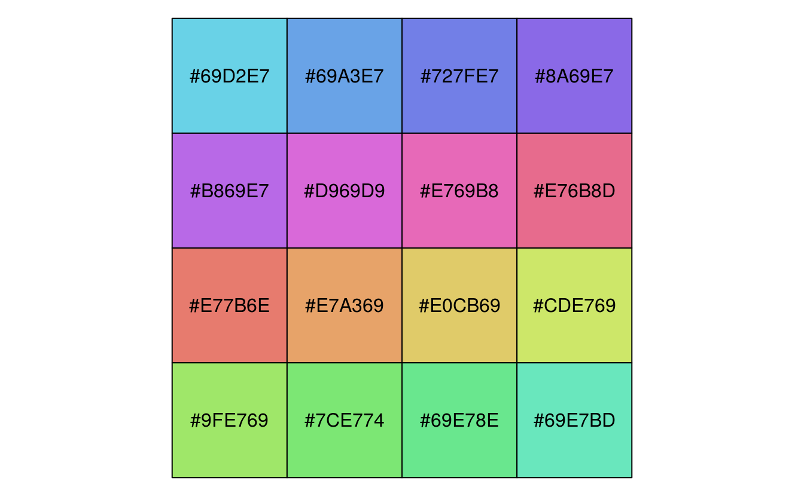

# 色彩与字体 {#colors-fonts}

## 颜色 {#colors-in-r}

在 R 语言中，如何表示颜色，

1. 使用内置的颜色名称，如 `red` 表示红色，`green` 表示绿色，而 `blue` 表示蓝色，完整的颜色名称列表，见 `colors()` 或者 `colours()`，有人整理了一张 R 内置的颜色名称和对应颜色图 <https://stat.columbia.edu/~tzheng/files/Rcolor.pdf>，可供参考
1. 用十六进制的字符串表示颜色，如 `#000000` 表示黑色，`#FF0000` 表示红色，`#00FF00` 表示绿色

如何构造颜色

1. `rgb` 函数是最常用的

红(red)、绿(green)、蓝(blue)是三原色，由他们的不同配比可以构成大千世界里五光十色


```r
rgb(red, green, blue, alpha, names = NULL, maxColorValue = 1)
```

函数参数说明：

- `red, blue, green` 取值范围$[0,M]$，$M$ 是 `maxColorValue` 默认情况下参数 `maxColorValue` 为 1
- `names` 字符向量，给这组颜色值取名
- `maxColorValue` 红，绿，蓝三色范围的最大值 
- `alpha` 是颜色的透明度

rgb 产生一种颜色，如 `rgb(255, 0, 0, maxColorValue = 255)` 的颜色是 `"#FF0000"` ，这是一串16进制数，每两个一组，那么一组有 $16^2 = 256$ 种组合，整个一串有 $256^3 = 16777216$ 种组合，这就是RGB表达的所有颜色，一个标准的 RGB 颜色空间，即 sRGB (IEC
standard 61966)。用色条示意，如图 \@ref(fig:rgb-rainbow)


```r
# 黑色 红色 绿色 黄色 蓝色 紫色 青色 白色
rgb(expand.grid(r = c(0, 1), g = c(0, 1), b = c(0, 1)))
#> [1] "#000000" "#FF0000" "#00FF00" "#FFFF00" "#0000FF" "#FF00FF" "#00FFFF"
#> [8] "#FFFFFF"
```

`palette("default")` 默认的调色板将灰色替换上述白色


```r
barplot(seq(8), col = palette("default"), border = "white")
```

<div class="figure" style="text-align: center">

<p class="caption">(\#fig:default-palette)默认的调色板</p>
</div>


```r
barplot(rep(1, times = 100), col = rainbow(100), border = FALSE, axes = FALSE)
```

<div class="figure" style="text-align: center">

<p class="caption">(\#fig:rgb-rainbow)内置的彩虹系调色板</p>
</div>


## 配色 {#choose-colors}

调色板合集 [paletteer](https://github.com/EmilHvitfeldt/paletteer)，其收录了很多 R 包制作的调色板，其中包括 [r-color-palettes](https://github.com/EmilHvitfeldt/r-color-palettes) 和 [wesanderson](https://github.com/karthik/wesanderson)，根据电影 Harry Potter 制作的调色板 [harrypotter](https://github.com/aljrico/harrypotter)，根据网站 [CARTO](https://carto.com/) 设计的 [rcartocolor](https://github.com/Nowosad/rcartocolor) 包

[colorblindr](https://github.com/clauswilke/colorblindr) 模拟色盲环境下的配色方案

不同的颜色模式，从 RGB 到 HCL 的基本操作 <https://stat545.com/block018_colors.html>


```r
# https://github.com/hadley/ggplot2-book
library(tidyverse)
hcl <- expand.grid(x = seq(-1, 1, length = 100), y = seq(-1, 1, length=100)) %>%
  tbl_df() %>%
  filter(x^2 + y^2 < 1) %>%
  mutate(
    r = sqrt(x^2 + y^2),
    c = 100 * r,
    h = 180 / pi * atan2(y, x),
    l = 65,
    colour = hcl(h, c, l)
  )

# sin(h) = y / (c / 100)
# y = sin(h) * c / 100

cols <- scales::hue_pal()(5)
selected <- colorspace::RGB(t(col2rgb(cols)) / 255) %>%
  as("polarLUV") %>%
  colorspace::coords() %>%
  as.data.frame() %>%
  mutate(
    x = cos(H / 180 * pi) * C / 100,
    y = sin(H / 180 * pi) * C / 100,
    colour = cols
  )

ggplot(hcl, aes(x, y)) +
  geom_raster(aes(fill = colour)) +
  scale_fill_identity() +
  scale_colour_identity() +
  coord_equal() +
  scale_x_continuous("", breaks = NULL) +
  scale_y_continuous("", breaks = NULL) +
  geom_point(data = selected, size = 10, color = "white") +
  geom_point(data = selected, size = 5, aes(colour = colour))
```

<div class="figure" style="text-align: center">

<p class="caption">(\#fig:unnamed-chunk-3)HCL调色</p>
</div>

R 内置了 502 种不同颜色的名称，下面随机地选取 20 种颜色


```r
sample(colors(TRUE), 20)
#>  [1] "azure4"          "gray48"          "palevioletred4"  "gray4"          
#>  [5] "orangered2"      "lightblue1"      "mediumvioletred" "mediumorchid2"  
#>  [9] "orange4"         "mediumorchid1"   "brown4"          "orangered"      
#> [13] "rosybrown3"      "darkorchid3"     "darkred"         "mediumpurple3"  
#> [17] "pink2"           "green"           "bisque3"         "gray14"
```

R 包 grDevices 提供 hcl 调色板[^hcl-palettes] 调制两个色板

[^hcl-palettes]: https://developer.r-project.org/Blog/public/2019/04/01/hcl-based-color-palettes-in-grdevices/index.html


```r
# Colors from https://github.com/johannesbjork/LaCroixColoR
color_pal <- c("#FF3200", "#E9A17C", "#E9E4A6", "#1BB6AF", "#0076BB", "#172869")
n <- 16
more_colors <- (grDevices::colorRampPalette(color_pal))(n)
scales::show_col(colours = more_colors)
```

<div class="figure" style="text-align: center">

<p class="caption">(\#fig:color-pal)桃色至梨色的渐变</p>
</div>


```r
# colors in colortools from http://www.gastonsanchez.com/
fish_pal <- c(
  "#69D2E7", "#6993E7", "#7E69E7", "#BD69E7",
  "#E769D2", "#E76993", "#E77E69", "#E7BD69",
  "#D2E769", "#93E769", "#69E77E", "#69E7BD"
)
more_colors <- (grDevices::colorRampPalette(fish_pal))(n)
scales::show_col(colours = more_colors)
```

<div class="figure" style="text-align: center">

<p class="caption">(\#fig:fish-hsv-pal)Hue-Saturation-Value (HSV) color model</p>
</div>


```r
rgb(red = 86, green = 180, blue = 233, maxColorValue = 255) # "#56B4E9"
#> [1] "#56B4E9"
rgb(red = 0, green = 158, blue = 115, maxColorValue = 255) # "#009E73"
#> [1] "#009E73"
rgb(red = 240, green = 228, blue = 66, maxColorValue = 255) # "#F0E442"
#> [1] "#F0E442"
rgb(red = 0, green = 114, blue = 178, maxColorValue = 255) # "#0072B2"
#> [1] "#0072B2"
```

举例子，直方图配色与不配色


```r
# library(pander)
# evalsOptions('graph.unify', TRUE)
# panderOptions('graph.colors') 获取调色板
# https://www.fontke.com/tool/rgbschemes/ 在线配色
cols <- c(
  "#56B4E9", "#009E73", "#F0E442", "#0072B2",
  "#D55E00", "#CC79A7", "#999999", "#E69F00"
)
hist(mtcars$hp, col = "#56B4E9", border = "white", grid = grid())
```

<div class="figure" style="text-align: center">

<p class="caption">(\#fig:unnamed-chunk-6)直方图</p>
</div>


```r
ggplot(mtcars) +
  geom_histogram(aes(x = hp, fill = as.factor(..count..)),
    color = "white", bins = 6
  ) +
  scale_fill_manual(values = rep("#56B4E9", 10)) +
  ggtitle("Histogram with ggplot2") +
  theme_minimal() +
  theme(legend.position = "none") 
```

<div class="figure" style="text-align: center">

<p class="caption">(\#fig:unnamed-chunk-7)直方图</p>
</div>

### colourlovers

colourlovers 包借助 XML, jsonlite 和 httr 包可以在线获取网站 [COLOURlovers](https://www.colourlovers.com/) 的调色板


```r
library(colourlovers)
palette1 <- clpalette('113451')
palette2 <- clpalette('92095')
palette3 <- clpalette('629637')
palette4 <- clpalette('694737')
```

使用调色板


```r
layout(matrix(1:4, nrow = 2))
par(mar = c(2, 2, 2, 2))

barplot(VADeaths, col = swatch(palette1)[[1]], border = NA)
barplot(VADeaths, col = swatch(palette2)[[1]], border = NA)
barplot(VADeaths, col = swatch(palette3)[[1]], border = NA)
barplot(VADeaths, col = swatch(palette4)[[1]], border = NA)
```


调色板的描述信息


```r
palette1
#> Palette ID:      113451 
#> Title:           Anaconda 
#> Created by user: kunteper 
#> Date created:    2007-08-05 14:14:15 
#> Views:           700 
#> Votes:           2 
#> Comments:        2 
#> Hearts:          0 
#> Rank:            0 
#> URL:             http://www.colourlovers.com/palette/113451/Anaconda 
#> Image URL:       
#> Colors:          #2B2D42, #7A7D7F, #B1BBCF, #6E0B21, #9B4D73
```

获取调色板中的颜色向量


```r
swatch(palette1)[[1]]
#> [1] "#2B2D42" "#7A7D7F" "#B1BBCF" "#6E0B21" "#9B4D73"
```


## 字体 {#fonts}

[firatheme](https://github.com/vankesteren/firatheme) 包提供基于 fira sans 字体的 GGplot2 主题，类似的字体主题包还有 [trekfont](https://github.com/leonawicz/trekfont) 、 [fontHind](https://github.com/bhaskarvk/fontHind)， [fontquiver](https://github.com/lionel-/fontquiver) 包与 fontBitstreamVera（Bitstream Vera 字体）、 fontLiberation（Liberation 字体）包和 [fontDejaVu](https://github.com/lionel-/fontDejaVu) （DejaVu 字体）包一道提供了一些可允许使用的字体文件，这样，我们可以不依赖系统制作可重复的图形。

Thomas Lin Pedersen 开发的 [systemfonts](https://github.com/r-lib/systemfonts) 可直接使用系统自带的字体


```r
library(firatheme)
ggplot(mtcars, aes(x = mpg * 0.43, y = wt * 0.4535924, colour = factor(cyl))) +
  geom_point(size = 2) +
  geom_smooth(se = FALSE) +
  labs(
    title = "Car weight vs efficiency",
    x = "Efficiency (km/l)",
    y = "Weight (1000 kg)",
    colour = "Cylinders"
  ) +
  theme_fira() +
  scale_colour_fira()
#> Scanning ttf files in /home/travis/R/Library/firatheme/font ...
#> Extracting .afm files from .ttf files...
#> /home/travis/R/Library/firatheme/font/FiraSans-Bold.ttf => /home/travis/R/Library/extrafontdb/metrics/FiraSans-Bold
#> /home/travis/R/Library/firatheme/font/FiraSans-BoldItalic.ttf => /home/travis/R/Library/extrafontdb/metrics/FiraSans-BoldItalic
#> /home/travis/R/Library/firatheme/font/FiraSans-Italic.ttf => /home/travis/R/Library/extrafontdb/metrics/FiraSans-Italic
#> /home/travis/R/Library/firatheme/font/FiraSans-Medium.ttf => /home/travis/R/Library/extrafontdb/metrics/FiraSans-Medium
#> /home/travis/R/Library/firatheme/font/FiraSans-MediumItalic.ttf => /home/travis/R/Library/extrafontdb/metrics/FiraSans-MediumItalic
#> /home/travis/R/Library/firatheme/font/FiraSans-Regular.ttf => /home/travis/R/Library/extrafontdb/metrics/FiraSans-Regular
#> Found FontName for 6 fonts.
#> Scanning afm files in /home/travis/R/Library/extrafontdb/metrics
#> Writing font table in /home/travis/R/Library/extrafontdb/fontmap/fonttable.csv
#> Writing Fontmap to /home/travis/R/Library/extrafontdb/fontmap/Fontmap...
#> `geom_smooth()` using method = 'loess' and formula 'y ~ x'
```


以常用的新罗马字体为例，在 R 绘图代码中全局设置字体 `par(family="Times")` 或者 `par(family="serif")`，数据集 cars 的含义，散点图 \@ref(fig:times-font) 表达的统计意义
 

```r
# plot(speed ~ dist, data = cars)
# 
# plot(speed ~ dist, data = cars, panel.first = grid(8, 8),
#   pch = 0, cex = 1.2, col = "blue", xlab = "speed", ylab = "dist"
# )
# 
# plot(speed ~ dist, data = cars,
#   panel.first = lines(stats::lowess(cars$speed, cars$dist), lty = "dashed"),
#   pch = 0, cex = 1.2, col = "blue", xlab = "speed", ylab = "dist"
# )

plot(Ozone ~ Wind, data = airquality, pch = as.character(Month),
     subset = Month != 7)
```

<div class="figure" style="text-align: center">

<p class="caption">(\#fig:times-font)数学字体</p>
</div>

pdf 设备使用 sans 字体 ArialMT + SymbolMT 字体显示，默认字体，添加代码块设置 `dev.args=list(family = "sans")` 图\@ref(fig:sans-font)


```r
par(mar = c(4, 4, 2, 1))
x <- seq(-4, 4, len = 101)
y <- cbind(sin(x), cos(x))
matplot(x, y,
  type = "l", xaxt = "n",
  main = expression(paste(
    plain(sin) * phi, "  and  ",
    plain(cos) * phi
  )),
  ylab = expression("sin" * phi, "cos" * phi), # only 1st is taken
  xlab = expression(paste("Phase Angle ", phi)),
  col.main = "blue"
)
axis(1,
  at = c(-pi, -pi / 2, 0, pi / 2, pi),
  labels = expression(-pi, -pi / 2, 0, pi / 2, pi)
)
```

<div class="figure" style="text-align: center">

<p class="caption">(\#fig:sans-font)默认 sans 字体</p>
</div>


```r
CM <- Type1Font(
  "CM",
  c(file.path(
    system.file("fonts", "metrics", package = "fontcm"),
    c(
      "fcmr8a.afm", "fcmb8a.afm", "fcmri8a.afm",
      "fcmbi8a.afm", "cmsyase.afm"
    )
  ))
)
pdfFonts(CM = CM)
```

family 指定字体，默认字体 Helvetica


```r
pdf("cm.pdf", family = "CM", width = 4, height = 4)
par(mar = c(4.1, 4.1, 0.5, 0.5))
x <- seq(-4, 4, len = 101)
y <- cbind(sin(x), cos(x))
matplot(x, y,
  type = "l", xaxt = "n",
  main = expression(paste(
    plain(sin) * phi, "  and  ",
    plain(cos) * phi
  )),
  ylab = expression("sin" * phi, "cos" * phi), # only 1st is taken
  xlab = expression(paste("Phase Angle ", phi)),
  col.main = "blue"
)
axis(1,
  at = c(-pi, -pi / 2, 0, pi / 2, pi),
  labels = expression(-pi, -pi / 2, 0, pi / 2, pi)
)
dev.off()
```


```r
Sys.setenv(R_GSCMD = "C:/Program Files/gs/gs9.26/bin/gswin64c.exe")
# embedFonts(file = "cm.pdf", outfile = "cm-embed.pdf") # GS 默认搜索路径不对
embedFonts(
  file = "cm.pdf", outfile = "cm-embed.pdf",
  fontpaths = system.file("fonts", package = "fontcm") # 指定字体搜索路径
)
```

fontcm 包 [@Paul_2006_fonts] 实现在 Base R 图形中嵌入数学字体 [^cmr-fonts]，图形中嵌入重音字符[^accent-fonts]

[^cmr-fonts]: https://www.stat.auckland.ac.nz/~paul/R/CM/CMR.html
[^accent-fonts]: https://www.stat.auckland.ac.nz/~paul/Reports/maori/maori.html

调用系统字体，安装使用网络字体


```r
library(showtext, quietly = TRUE)
showtext_auto()
pdf("google-fonts.pdf")
font_add_google("Alegreya Sans", "aleg")
par(family = "serif")
plot(0:5, 0:5, type = "n")
text(1:4, 1:4, "Serif", font = 1:4, cex = 2)
par(family = "fira-sans")
plot(0:5, 0:5, type = "n")
text(1:4, 1:4, "Sans", font = 1:4, cex = 2)
dev.off()
```


**knitr** 支持的引擎有：


```r
names(knitr::knit_engines$get())
#>  [1] "awk"         "bash"        "coffee"      "gawk"        "groovy"     
#>  [6] "haskell"     "lein"        "mysql"       "node"        "octave"     
#> [11] "perl"        "psql"        "Rscript"     "ruby"        "sas"        
#> [16] "scala"       "sed"         "sh"          "stata"       "zsh"        
#> [21] "highlight"   "Rcpp"        "tikz"        "dot"         "c"          
#> [26] "fortran"     "fortran95"   "asy"         "cat"         "asis"       
#> [31] "stan"        "block"       "block2"      "js"          "css"        
#> [36] "sql"         "go"          "python"      "julia"       "sass"       
#> [41] "scss"        "theorem"     "lemma"       "corollary"   "proposition"
#> [46] "conjecture"  "definition"  "example"     "exercise"    "proof"      
#> [51] "remark"      "solution"
```

导入系统TTF类型字体到 R 环境中，这样绘图可以使用更多的字体


```r
install.packages("extrafont")
library(extrafont)
font_import()
# 查看可用的字体
# Vector of font family names
fonts()
# Show entire table
fonttable()
# 加载字体

# Only necessary in session where you ran font_import()
loadfonts()
# For PostScript output, use loadfonts(device="postscript")
# Suppress output with loadfonts(quiet=TRUE)
```

测试字体是否被正确调用


```r
pdf("font_Impact.pdf", family = "Impact", width = 4, height = 4)
par(mar = c(4.1, 4.1, 2.1, 0.5))
plot(mtcars$mpg, mtcars$wt,
  main = "Fuel Efficiency of 32 Cars",
  xlab = "Weight (x1000 lb)",
  ylab = "Miles per Gallon"
)
dev.off()
```

PDF 格式图片转 PNG 格式

```bash
convert -quality 100 -density 300x300 font_Impact.pdf font_Impact.png
```

<div class="figure" style="text-align: center">

<p class="caption">(\#fig:fonts-Impact)Impact 字体</p>
</div>


