# 数据可视化 {#ggplot2-visualization}


> 3-D bar plots are an abomination. Just because Excel can do them doesn't mean you should. (Dismount pulpit).
>
>   --- Berton Gunter [^BG-help-2007]
      

[^BG-help-2007]: <https://stat.ethz.ch/pipermail/r-help/2007-October/142420.html>

grid graphics lattice 和 ggplot2 之间的历史发展关系脉络

gganimate 只是一个扩展，并不是新的东西，因为它是静态图形转化为帧，然后借助第三方工具合成

ggplot2 生态系统 \@ref(tab:ggplot2-eco)


Table: (\#tab:ggplot2-eco)ggplot2 生态系统

Package                 Title                                                                                      
----------------------  -------------------------------------------------------------------------------------------
**ggallin**             Grab Bag of ggplot2 Functions                                                              
**ggalluvial**          Alluvial Plots in ggplot2                                                                  
**ggalt**               Extra Coordinate Systems, Geoms, Statistical Transformations, Scales and Fonts for ggplot2 
**ggamma**              Generalized Gamma Probability Distribution                                                 
**gganimate**           A Grammar of Animated Graphics                                                             
**ggasym**              Asymmetric Matrix Plotting in ggplot2                                                      
**ggbeeswarm**          Categorical Scatter (Violin Point) Plots                                                   
**ggBubbles**           Mini Bubble Plots for Comparison of Discrete Data with ggplot2                             
**ggbuildr**            Save Incremental Builds of Plots                                                           
**ggChernoff**          Chernoff Faces for ggplot2                                                                 
**ggconf**              Simpler Appearance Modification of ggplot2                                                 
**ggcorrplot**          Visualization of a Correlation Matrix using ggplot2                                        
**ggdag**               Analyze and Create Elegant Directed Acyclic Graphs                                         
**ggdark**              Dark Mode for ggplot2 Themes                                                               
**ggdemetra**           ggplot2 Extension for Seasonal and Trading Day Adjustment with RJDemetra                   
**ggdendro**            Create Dendrograms and Tree Diagrams Using ggplot2                                         
**ggdistribute**        A ggplot2 Extension for Plotting Unimodal Distributions                                    
**ggdmc**               Cognitive Models                                                                           
**gge**                 Genotype Plus Genotype-by-Environment Biplots                                              
**ggedit**              Interactive ggplot2 Layer and Theme Aesthetic Editor                                       
**ggeffects**           Create Tidy Data Frames of Marginal Effects for ggplot from Model Outputs                  
**ggenealogy**          Visualization Tools for Genealogical Data                                                  
**ggetho**              Visualisation of High-Throughput Behavioural (i.e. Ethomics) Data                          
**ggExtra**             Add Marginal Histograms to ggplot2, and More ggplot2 Enhancements                          
**ggfan**               Summarise a Distribution Through Coloured Intervals                                        
**ggfittext**           Fit Text Inside a Box in ggplot2                                                           
**ggfocus**             Focus on Specific Factor Levels in your ggplot()                                           
**ggforce**             Accelerating ggplot2                                                                       
**ggformula**           Formula Interface to the Grammar of Graphics                                               
**ggfortify**           Data Visualization Tools for Statistical Analysis Results                                  
**gg.gap**              Define Segments in y-Axis for ggplot2                                                      
**gggenes**             Draw Gene Arrow Maps in ggplot2                                                            
**ggghost**             Capture the Spirit of Your ggplot2 Calls                                                   
**gggibbous**           Moon Charts, a Pie Chart Alternative                                                       
**ggguitar**            Utilities for Creating Guitar Tablature                                                    
**gghalfnorm**          Create a Half Normal Plot Using ggplot2                                                    
**gghalves**            Compose Half-Half Plots Using Your Favourite Geoms                                         
**gghighlight**         Highlight Lines and Points in ggplot2                                                      
**ggimage**             Use Image in ggplot2                                                                       
**gginference**         Visualise the Results of Inferential Statistics using ggplot2                              
**gginnards**           Explore the Innards of ggplot2 Objects                                                     
**ggiraph**             Make ggplot2 Graphics Interactive                                                          
**ggiraphExtra**        Make Interactive ggplot2. Extension to ggplot2 and ggiraph                                 
**ggjoy**               Joyplots in ggplot2                                                                        
**gglasso**             Group Lasso Penalized Learning Using a Unified BMD Algorithm                               
**gglogo**              Geom for Logo Sequence Plots                                                               
**ggloop**              Create ggplot2 Plots in a Loop                                                             
**gglorenz**            Plotting Lorenz Curve with the Blessing of ggplot2                                         
**ggm**                 Functions for graphical Markov models                                                      
**ggmap**               Spatial Visualization with ggplot2                                                         
**ggmcmc**              Tools for Analyzing MCMC Simulations from Bayesian Inference                               
**ggmosaic**            Mosaic Plots in the ggplot2 Framework                                                      
**ggmr**                Generalized Gauss Markov Regression                                                        
**ggmsa**               Plot Multiple Sequence Alignment using ggplot2                                             
**ggmuller**            Create Muller Plots of Evolutionary Dynamics                                               
**ggnetwork**           Geometries to Plot Networks with ggplot2                                                   
**ggnewscale**          Multiple Fill and Color Scales in ggplot2                                                  
**ggnormalviolin**      A ggplot2 Extension to Make Normal Violin Plots                                            
**ggpage**              Creates Page Layout Visualizations                                                         
**ggparallel**          Variations of Parallel Coordinate Plots for Categorical Data                               
**ggparliament**        Parliament Plots                                                                           
**ggparty**             ggplot Visualizations for the partykit Package                                             
**ggperiodic**          Easy Plotting of Periodic Data with ggplot2                                                
**ggplot2**             Create Elegant Data Visualisations Using the Grammar of Graphics                           
**ggplot2movies**       Movies Data                                                                                
**ggplotAssist**        RStudio Addin for Teaching and Learning ggplot2                                            
**ggplotgui**           Create Ggplots via a Graphical User Interface                                              
**ggplotify**           Convert Plot to grob or ggplot Object                                                      
**ggplotlyExtra**       Extra Convenience Functions for Plotly                                                     
**ggplot.multistats**   Multiple Summary Statistics for Binned Stats/Geometries                                    
**ggpmisc**             Miscellaneous Extensions to ggplot2                                                        
**ggPMX**               ggplot2 Based Tool to Facilitate Diagnostic Plots for NLME Models                          
**ggpointdensity**      A Cross Between a 2D Density Plot and a Scatter Plot                                       
**ggpol**               Visualizing Social Science Data with ggplot2                                               
**ggpolypath**          Polygons with Holes for the Grammar of Graphics                                            
**ggpubr**              ggplot2 Based Publication Ready Plots                                                      
**ggpval**              Annotate Statistical Tests for ggplot2                                                     
**ggQC**                Quality Control Charts for ggplot                                                          
**ggQQunif**            Compare Big Datasets to the Uniform Distribution                                           
**ggquickeda**          Quickly Explore Your Data Using ggplot2 and table1 Summary Tables                          
**ggquiver**            Quiver Plots for ggplot2                                                                   
**ggRandomForests**     Visually Exploring Random Forests                                                          
**ggraph**              An Implementation of Grammar of Graphics for Graphs and Networks                           
**ggraptR**             Allows Interactive Visualization of Data Through a Web Browser GUI                         
**ggrasp**              Gaussian-Based Genome Representative Selector with Prioritization                          
**ggrepel**             Automatically Position Non-Overlapping Text Labels with ggplot2                            
**ggResidpanel**        Panels and Interactive Versions of Diagnostic Plots using ggplot2                          
**ggridges**            Ridgeline Plots in ggplot2                                                                 
**ggROC**               package for roc curve plot with ggplot2                                                    
**ggroups**             Pedigree and Genetic Groups                                                                
**ggsci**               Scientific Journal and Sci-Fi Themed Color Palettes for ggplot2                            
**ggseas**              stats for Seasonal Adjustment on the Fly with ggplot2                                      
**ggseqlogo**           A ggplot2 Extension for Drawing Publication-Ready Sequence Logos                           
**ggsignif**            Significance Brackets for ggplot2                                                          
**ggsn**                North Symbols and Scale Bars for Maps Created with ggplot2 or ggmap                        
**ggsoccer**            Plot Soccer Event Data                                                                     
**ggsolvencyii**        A ggplot2-Plot of Composition of Solvency II SCR: SF and IM                                
**ggsom**               New Data Visualisations for SOMs Cluster                                                   
**ggspatial**           Spatial Data Framework for ggplot2                                                         
**ggspectra**           Extensions to ggplot2 for Radiation Spectra                                                
**ggstance**            Horizontal ggplot2 Components                                                              
**ggstatsplot**         ggplot2 Based Plots with Statistical Details                                               
**ggswissmaps**         Offers Various Swiss Maps as Data Frames and ggplot2 Objects                               
**ggtern**              An Extension to ggplot2, for the Creation of Ternary Diagrams                              
**ggThemeAssist**       Add-in to Customize ggplot2 Themes                                                         
**ggthemes**            Extra Themes, Scales and Geoms for ggplot2                                                 
**ggTimeSeries**        Time Series Visualisations Using the Grammar of Graphics                                   
**ggupset**             Combination Matrix Axis for ggplot2 to Create UpSet Plots                                  
**ggVennDiagram**       A ggplot2 Implement of Venn Diagram                                                        
**ggversa**             Graficas Versatiles Con ggplot2                                                            
**ggvis**               Interactive Grammar of Graphics                                                            
**ggvoronoi**           Voronoi Diagrams and Heatmaps with ggplot2                                                 
**ggwordcloud**         A Word Cloud Geom for ggplot2                                                              

David Robinson 给出为何使用 ggplot2 [^why-ggplot2] 当然也有 Jeff Leek 指出在某些重要场合不适合 ggplot2 [^why-not-ggplot2] 并且给出强有力的 [证据](http://motioninsocial.com/tufte/)，其实不管怎么样，适合自己的才是好的。也不枉费 Garrick Aden-Buie 花费 160 页幻灯片逐步分解介绍 [优雅的ggplot2](https://pkg.garrickadenbuie.com/gentle-ggplot2)，[Malcolm Barrett](https://malco.io/) 也介绍了 [ggplot2 基础用法](https://malco.io/slides/hs_ggplot2)，还有 Selva Prabhakaran 精心总结给出了 50 个 ggplot2 数据可视化的 [例子](https://r-statistics.co/Top50-Ggplot2-Visualizations-MasterList-R-Code.html) 以及 Victor Perrier 为小白用 ggplot2 操碎了心地开发 RStudio 插件 [esquisse](https://github.com/dreamRs/esquisse) 包，Claus O. Wilke 教你一步步创建出版级的图形 <https://github.com/clauswilke/practical_ggplot2>。

GGplot2 是十分方便的统计作图工具，相比 Base R，为了一张出版级的图形，不需要去调整每个参数，实现快速出图。集成了很多其它统计计算的 R 包，支持丰富的统计分析和计算功能，如回归、平滑等，实现了作图和模型的无缝连接。比如图\@ref(fig:awesome-ggplot2)，使用 loess 局部多项式平滑得到数据的趋势，不仅仅是散点图，代码量也非常少。


```r
ggplot(mpg, aes(displ, hwy)) +
  geom_point(aes(color = class)) +
  geom_smooth(se = TRUE, method = "loess") +
  labs(
    title = "Fuel efficiency generally decreases with engine size",
    subtitle = "Two seaters (sports cars) are an exception because of their light weight",
    caption = "Data from fueleconomy.gov"
  )
```

<div class="figure" style="text-align: center">

<p class="caption">(\#fig:awesome-ggplot2)简洁美观</p>
</div>

故事源于一幅图片，我不记得第一次见到这幅图是什么时候了，只因多次在多个场合中见过，所以留下了深刻的印象，后来才知道它出自于一篇博文 --- [Using R packages and education to scale Data Science at Airbnb](https://medium.com/airbnb-engineering/using-r-packages-and-education-to-scale-data-science-at-airbnb)，作者 Ricardo Bion 还在其 Github 上传了相关代码^[<https://github.com/ricardo-bion/medium_visualization>]。除此之外还有几篇重要的参考资料：

1. Pablo Barberá 的 [Data Visualization with R and ggplot2](https://github.com/pablobarbera/Rdataviz)
2. Kieran Healy 的新书 [Data Visualization: A Practical Introduction](https://kieranhealy.org/publications/dataviz/)
3. Matt Leonawicz 的新作 [mapmate](https://github.com/leonawicz/mapmate), 可以去其主页欣赏系列作品^[<https://leonawicz.github.io/>] 
1. [tidytuesday 可视化挑战官方项目](https://github.com/rfordatascience/tidytuesday) 还有 [tidytuesday](https://github.com/abichat/tidytuesday)
1. [ggstatsplot](https://github.com/IndrajeetPatil/ggstatsplot) 可视化统计检验、模型的结果
1. [ggpubr](https://github.com/kassambara/ggpubr) 制作出版级统计图形

[^why-ggplot2]: http://varianceexplained.org/r/why-I-use-ggplot2/
[^why-not-ggplot2]: https://simplystatistics.org/2016/02/11/why-i-dont-use-ggplot2/

## 基础语法 {#intro-ggplot2}

以数据集 airquality 为例介绍GGplot2 图层、主题、配色、坐标、尺度、注释和组合等

### 图层 {#ggplot2-layer}


```r
ls("package:ggplot2", pattern = "^geom_")
#>  [1] "geom_abline"     "geom_area"       "geom_bar"        "geom_bin2d"     
#>  [5] "geom_blank"      "geom_boxplot"    "geom_col"        "geom_contour"   
#>  [9] "geom_count"      "geom_crossbar"   "geom_curve"      "geom_density"   
#> [13] "geom_density_2d" "geom_density2d"  "geom_dotplot"    "geom_errorbar"  
#> [17] "geom_errorbarh"  "geom_freqpoly"   "geom_hex"        "geom_histogram" 
#> [21] "geom_hline"      "geom_jitter"     "geom_label"      "geom_line"      
#> [25] "geom_linerange"  "geom_map"        "geom_path"       "geom_point"     
#> [29] "geom_pointrange" "geom_polygon"    "geom_qq"         "geom_qq_line"   
#> [33] "geom_quantile"   "geom_raster"     "geom_rect"       "geom_ribbon"    
#> [37] "geom_rug"        "geom_segment"    "geom_sf"         "geom_sf_label"  
#> [41] "geom_sf_text"    "geom_smooth"     "geom_spoke"      "geom_step"      
#> [45] "geom_text"       "geom_tile"       "geom_violin"     "geom_vline"
```

生成一个散点图


```r
ggplot(airquality, aes(x = Temp, y = Ozone)) + geom_point()
#> Warning: Removed 37 rows containing missing values (geom_point).
```


### 主题 {#ggplot2-theme}


```r
ls("package:ggplot2", pattern = "^theme_")
#>  [1] "theme_bw"       "theme_classic"  "theme_dark"     "theme_get"     
#>  [5] "theme_gray"     "theme_grey"     "theme_light"    "theme_linedraw"
#>  [9] "theme_minimal"  "theme_replace"  "theme_set"      "theme_test"    
#> [13] "theme_update"   "theme_void"
```

这里只展示 `theme_bw()` `theme_void()` `theme_minimal() ` 和 `theme_void()` 等四个常见主题，更多主题参考 [ggsci](https://github.com/nanxstats/ggsci)、[ggthemes](https://github.com/jrnold/ggthemes) 、[ggtech](https://github.com/ricardo-bion/ggtech)、[hrbrthemes](https://github.com/hrbrmstr/hrbrthemes) 和 [ggthemr](https://github.com/cttobin/ggthemr) 包


```r
ggplot(airquality, aes(x = Temp, y = Ozone)) + geom_point() + theme_bw()
#> Warning: Removed 37 rows containing missing values (geom_point).
ggplot(airquality, aes(x = Temp, y = Ozone)) + geom_point() + theme_void()
#> Warning: Removed 37 rows containing missing values (geom_point).
ggplot(airquality, aes(x = Temp, y = Ozone)) + geom_point() + theme_minimal()
#> Warning: Removed 37 rows containing missing values (geom_point).
ggplot(airquality, aes(x = Temp, y = Ozone)) + geom_point() + theme_void()
#> Warning: Removed 37 rows containing missing values (geom_point).
```


除主题之外，还有一类提供一整套统一的风格样式来绘制各种统计图形，如 [ggpubr](https://github.com/kassambara/ggpubr) 和 [bbplot](https://github.com/bbc/bbplot)

### 配色 {#ggplot2-color}


```r
ls("package:ggplot2", pattern = "^scale_(color|fill)_")
#>  [1] "scale_color_brewer"     "scale_color_continuous" "scale_color_discrete"  
#>  [4] "scale_color_distiller"  "scale_color_gradient"   "scale_color_gradient2" 
#>  [7] "scale_color_gradientn"  "scale_color_grey"       "scale_color_hue"       
#> [10] "scale_color_identity"   "scale_color_manual"     "scale_color_viridis_c" 
#> [13] "scale_color_viridis_d"  "scale_fill_brewer"      "scale_fill_continuous" 
#> [16] "scale_fill_date"        "scale_fill_datetime"    "scale_fill_discrete"   
#> [19] "scale_fill_distiller"   "scale_fill_gradient"    "scale_fill_gradient2"  
#> [22] "scale_fill_gradientn"   "scale_fill_grey"        "scale_fill_hue"        
#> [25] "scale_fill_identity"    "scale_fill_manual"      "scale_fill_ordinal"    
#> [28] "scale_fill_viridis_c"   "scale_fill_viridis_d"
```


```r
ggplot(airquality, aes(x = Temp, y = Ozone, color = as.factor(Month))) +
  geom_point(na.rm = TRUE)
ggplot(airquality, aes(x = Temp, y = Ozone, color = as.ordered(Month))) +
  geom_point(na.rm = TRUE)
```


### 刻度 {#ggplot2-scale}


```r
ls("package:ggplot2", pattern = "^scale_(x|y)_")
#>  [1] "scale_x_continuous" "scale_x_date"       "scale_x_datetime"  
#>  [4] "scale_x_discrete"   "scale_x_log10"      "scale_x_reverse"   
#>  [7] "scale_x_sqrt"       "scale_x_time"       "scale_y_continuous"
#> [10] "scale_y_date"       "scale_y_datetime"   "scale_y_discrete"  
#> [13] "scale_y_log10"      "scale_y_reverse"    "scale_y_sqrt"      
#> [16] "scale_y_time"
```


```r
range(airquality$Temp, na.rm = TRUE)
#> [1] 56 97
range(airquality$Ozone, na.rm = TRUE)
#> [1]   1 168
ggplot(airquality, aes(x = Temp, y = Ozone)) + 
  geom_point(na.rm = TRUE) +
  scale_x_continuous(breaks = seq(50, 100, 5)) +
  scale_y_continuous(breaks = seq(0, 200, 20))
```


### 注释 {#ggplot2-annotate}


```r
ls("package:ggplot2", pattern = "^annotation_")
#> [1] "annotation_custom"   "annotation_logticks" "annotation_map"     
#> [4] "annotation_raster"
```


```r
ggplot(airquality, aes(x = Temp, y = Ozone)) + 
  geom_point(na.rm = TRUE)
```


```r
ggplot(airquality, aes(x = Temp, y = Ozone)) + 
  geom_point(na.rm = TRUE) +
  labs(title = substitute(paste(d *
    bolditalic(x)[italic(t)] == alpha * (theta - bolditalic(x)[italic(t)]) *
    d * italic(t) + lambda * d * italic(B)[italic(t)]), list(lambda = 4)))
```


### 图例 {#ggplot2-legend}

二维的图例 [biscale](https://github.com/slu-openGIS/biscale) 和 [multiscales](https://github.com/clauswilke/multiscales) 和 [ggnewscale](https://github.com/eliocamp/ggnewscale)


### 组合 {#ggplot2-grid}


```r
ggplot(airquality) + 
  geom_point(aes(x = Temp, y = Ozone), na.rm = TRUE) + 
  facet_wrap(~ as.ordered(Month))
ggplot(airquality) + 
  geom_point(aes(x = Temp, y = Ozone), na.rm = TRUE) + 
  facet_wrap(~ as.ordered(Month), nrow = 1)
```


[cowplot](https://github.com/wilkelab/cowplot) 是以作者 [Claus O. Wilke](https://wilkelab.org/) 命名的，用来组合 ggplot 对象画图，类似的组合图形的功能包还有 [baptiste auguié](https://baptiste.github.io/) 开发的 [gridExtra](https://CRAN.R-project.org/package=gridExtra) 和 [egg](https://github.com/baptiste/egg)， [Thomas Lin Pedersen](https://www.data-imaginist.com/) 开发的 [patchwork](https://github.com/thomasp85/patchwork)

[Dean Attali](https://deanattali.com/) 开发的 [ggExtra](https://github.com/daattali/ggExtra) 可以在图的边界添加密度估计曲线，直方图等


### 坐标系 {#ggplot2-coord}

极坐标，直角坐标


```r
ls("package:ggplot2", pattern = "^coord_")
#>  [1] "coord_cartesian" "coord_equal"     "coord_fixed"     "coord_flip"     
#>  [5] "coord_map"       "coord_munch"     "coord_polar"     "coord_quickmap" 
#>  [9] "coord_sf"        "coord_trans"
```

### 坐标轴 {#ggplot2-axes}

坐标轴标签位置、大小、字体

## 统计图形 {#ggplot2-gallary}

### 散点图 {#ggplot2-scatter}

下面以 diamonds 数据集为例展示 ggplot2 的绘图过程，首先加载 diamonds 数据集，查看数据集的内容


```r
data(diamonds)
str(diamonds)
#> Classes 'tbl_df', 'tbl' and 'data.frame':	53940 obs. of  10 variables:
#>  $ carat  : num  0.23 0.21 0.23 0.29 0.31 0.24 0.24 0.26 0.22 0.23 ...
#>  $ cut    : Ord.factor w/ 5 levels "Fair"<"Good"<..: 5 4 2 4 2 3 3 3 1 3 ...
#>  $ color  : Ord.factor w/ 7 levels "D"<"E"<"F"<"G"<..: 2 2 2 6 7 7 6 5 2 5 ...
#>  $ clarity: Ord.factor w/ 8 levels "I1"<"SI2"<"SI1"<..: 2 3 5 4 2 6 7 3 4 5 ...
#>  $ depth  : num  61.5 59.8 56.9 62.4 63.3 62.8 62.3 61.9 65.1 59.4 ...
#>  $ table  : num  55 61 65 58 58 57 57 55 61 61 ...
#>  $ price  : int  326 326 327 334 335 336 336 337 337 338 ...
#>  $ x      : num  3.95 3.89 4.05 4.2 4.34 3.94 3.95 4.07 3.87 4 ...
#>  $ y      : num  3.98 3.84 4.07 4.23 4.35 3.96 3.98 4.11 3.78 4.05 ...
#>  $ z      : num  2.43 2.31 2.31 2.63 2.75 2.48 2.47 2.53 2.49 2.39 ...
```

数值型变量 carat 作为 x 轴


```r
ggplot(diamonds, aes(x = carat))
ggplot(diamonds, aes(x = carat, y = price))
ggplot(diamonds, aes(x = carat, color = cut))
ggplot(diamonds, aes(x = carat), color = "steelblue")
```

<div class="figure" style="text-align: center">

<p class="caption">(\#fig:diamonds-axis)绘图过程</p>
</div>

图 \@ref(fig:diamonds-axis) 的基础上添加数据图层


```r
sub_diamonds <- diamonds[sample(1:nrow(diamonds), 1000), ]
ggplot(sub_diamonds, aes(x = carat, y = price)) +
  geom_point()
```

<div class="figure" style="text-align: center">

<p class="caption">(\#fig:scatter)添加数据图层</p>
</div>

给散点图\@ref(fig:scatter)上色


```r
ggplot(sub_diamonds, aes(x = carat, y = price)) +
  geom_point(color = "steelblue")
```

<div class="figure" style="text-align: center">

<p class="caption">(\#fig:scatter-color-1)散点图配色</p>
</div>


```r
ggplot(sub_diamonds, aes(x = carat, y = price)) +
  geom_point(color = "steelblue") +
  scale_y_continuous(
    labels = scales::unit_format(unit = "k", scale = 1e-3),
    breaks = seq(0, 20000, 4000)
  )
```

<div class="figure" style="text-align: center">

<p class="caption">(\#fig:scatter-scale-1)格式化坐标轴刻度标签</p>
</div>

让另一变量 cut 作为颜色分类指标


```r
ggplot(sub_diamonds, aes(x = carat, y = price, color = cut)) +
  geom_point()
```

<div class="figure" style="text-align: center">

<p class="caption">(\#fig:scatter-color-2)分类散点图</p>
</div>

当然还有一种类似的表示就是分组，默认情况下，ggplot2将所有观测点视为一组，以分类变量 cut 来分组


```r
ggplot(sub_diamonds, aes(x = carat, y = price, group = cut)) +
  geom_point()
```

<div class="figure" style="text-align: center">

<p class="caption">(\#fig:scatter-group)分组</p>
</div>

在图\@ref(fig:scatter-group) 上没有体现出来分组的意思，下面以 cut 分组线性回归为例


```r
ggplot(sub_diamonds, aes(x = carat, y = price)) +
  geom_point() +
  geom_smooth(method = "lm")
ggplot(sub_diamonds, aes(x = carat, y = price, group = cut)) +
  geom_point() +
  geom_smooth(method = "lm")
```

<div class="figure" style="text-align: center">

<p class="caption">(\#fig:group-lm)分组线性回归</p>
</div>

我们当然可以选择更加合适的拟合方式，如局部多项式平滑 `loess` 但是该方法不太适用观测值比较多的情况，因为它会占用比较多的内存，建议使用广义可加模型作平滑拟合


```r
ggplot(sub_diamonds, aes(x = carat, y = price, group = cut)) +
  geom_point() +
  geom_smooth(method = "loess")
```

<div class="figure" style="text-align: center">

<p class="caption">(\#fig:unnamed-chunk-16)局部多项式平滑</p>
</div>


```r
ggplot(sub_diamonds, aes(x = carat, y = price, group = cut)) +
  geom_point() +
  geom_smooth(method = "gam", formula = y ~ s(x, bs = "cs"))
```

<div class="figure" style="text-align: center">
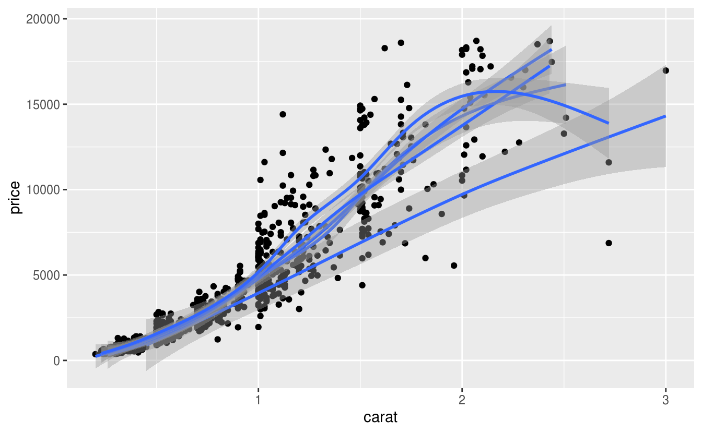
<p class="caption">(\#fig:group-gam)数据分组应用广义可加平滑</p>
</div>

::: sidebar
[ggfortify](https://github.com/sinhrks/ggfortify) 包支持更多的统计分析结果的可视化
:::

为了更好地区分开组别，我们在图\@ref(fig:group-gam)的基础上分面或者配色


```r
ggplot(sub_diamonds, aes(x = carat, y = price, group = cut)) +
  geom_point() +
  geom_smooth(method = "gam", formula = y ~ s(x, bs = "cs")) +
  facet_grid(~cut)
ggplot(sub_diamonds, aes(x = carat, y = price, group = cut, color = cut)) +
  geom_point() +
  geom_smooth(method = "gam", formula = y ~ s(x, bs = "cs"))
```

<div class="figure" style="text-align: center">

<p class="caption">(\#fig:group-facet)分组配色</p>
</div>

在分类散点图的另一种表示方法就是分面图，以 cut 变量作为分面的依据


```r
ggplot(sub_diamonds, aes(x = carat, y = price)) +
  geom_point() +
  facet_grid(~cut)
```

<div class="figure" style="text-align: center">

<p class="caption">(\#fig:scatter-facet)分面散点图</p>
</div>

给图 \@ref(fig:scatter-facet) 上色


```r
ggplot(sub_diamonds, aes(x = carat, y = price)) +
  geom_point(color = "steelblue") +
  facet_grid(~cut)
```

<div class="figure" style="text-align: center">

<p class="caption">(\#fig:scatter-facet-color-1)给分面散点图上色</p>
</div>

在图\@ref(fig:scatter-facet-color-1)的基础上，给不同的类上不同的颜色


```r
ggplot(sub_diamonds, aes(x = carat, y = price, color = cut)) +
  geom_point() +
  facet_grid(~cut)
```

<div class="figure" style="text-align: center">

<p class="caption">(\#fig:scatter-facet-color-2)给不同的类上不同的颜色</p>
</div>

去掉图例，此时图例属于冗余信息了


```r
ggplot(sub_diamonds, aes(x = carat, y = price, color = cut)) +
  geom_point(show.legend = FALSE) +
  facet_grid(~cut)
```

<div class="figure" style="text-align: center">

<p class="caption">(\#fig:scatter-facet-color-3)去掉图例</p>
</div>

四块土地，所施肥料不同，肥力大小顺序 4 < 2 < 3 < 1 小麦产量随肥力的变化


```r
data(Wheat2, package = "nlme") # Wheat Yield Trials
library(colorspace)
ggplot(Wheat2, aes(longitude, latitude)) +
  geom_point(aes(size = yield, colour = Block)) +
  scale_color_discrete_sequential(palette = "Viridis") +
  scale_x_continuous(breaks = seq(0, 30, 5)) +
  scale_y_continuous(breaks = seq(0, 50, 10))
```

<div class="figure" style="text-align: center">

<p class="caption">(\#fig:unnamed-chunk-17)多个图例</p>
</div>
  

```r
ggplot(mtcars, aes(x = hp, y = mpg, color = factor(am))) +
  geom_point()
```

<div class="figure" style="text-align: center">
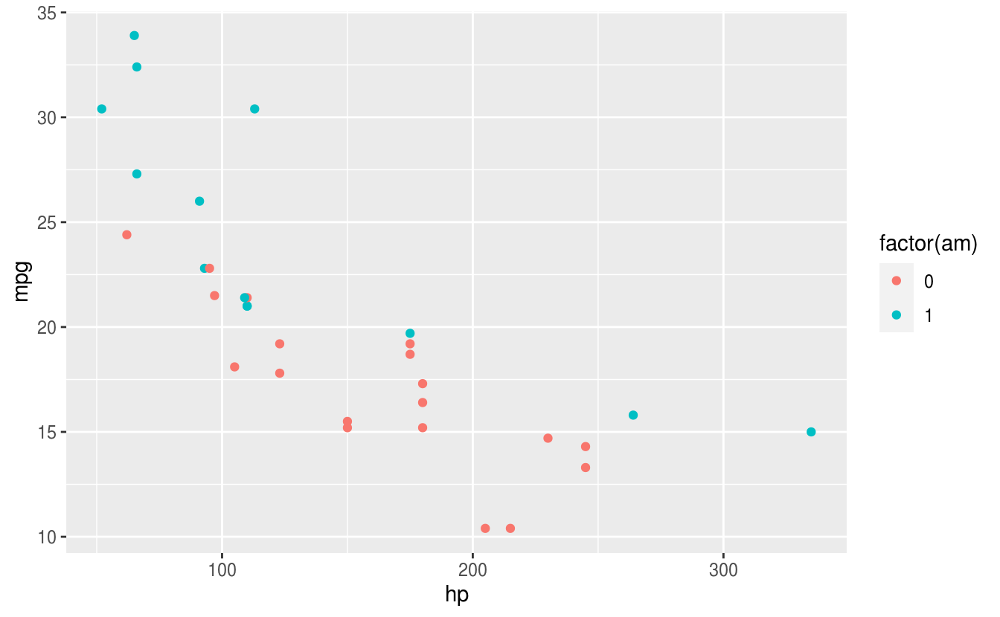
<p class="caption">(\#fig:category-ggplot)分类散点图</p>
</div>

图层、分组、分面和散点图介绍完了，接下来就是其它统计图形，如箱线图，小提琴图和条形图


```r
dat <- as.data.frame(cbind(rep(1948 + seq(12), each = 12), rep(seq(12), 12), AirPassengers))
colnames(dat) <- c("year", "month", "passengers")

ggplot(data = dat, aes(x = as.factor(year), y = as.factor(month))) +
  stat_sum(aes(size = passengers), colour = "lightblue") +
  scale_size(range = c(1, 10), breaks = seq(100, 650, 50)) +
  labs(x = "Year", y = "Month", colour = "Passengers") +
  theme_minimal()
```

<div class="figure" style="text-align: center">

<p class="caption">(\#fig:unnamed-chunk-18)1948年至1960年航班乘客人数变化</p>
</div>

### 箱线图 {#ggplot2-boxplot}

以 PlantGrowth 数据集为例展示箱线图，在两组不同实验条件下，植物生长的情况，纵坐标是干燥植物的量，横坐标表示不同的实验条件。这是非常典型的适合用箱线图来表达数据的场合，Y 轴对应数值型变量，X 轴对应分类变量，在 R 语言中，分类变量的类型是 factor


```r
data("PlantGrowth")
str(PlantGrowth)
#> 'data.frame':	30 obs. of  2 variables:
#>  $ weight: num  4.17 5.58 5.18 6.11 4.5 4.61 5.17 4.53 5.33 5.14 ...
#>  $ group : Factor w/ 3 levels "ctrl","trt1",..: 1 1 1 1 1 1 1 1 1 1 ...
```


```r
ggplot(data = PlantGrowth, aes(x = group, y = weight)) + geom_boxplot()
```


PlantGrowth 数据量比较小，此时比较适合采用抖动散点图，抖动是为了避免点之间相互重叠，为了增加不同类别之间的识别性，我们可以用不同的点的形状或者不同的颜色来表示类别


```r
ggplot(data = PlantGrowth, aes(x = group, y = weight, shape = group)) + geom_jitter()
ggplot(data = PlantGrowth, aes(x = group, y = weight, color = group)) + geom_jitter()
```


::: base

```r
boxplot(weight ~ group,
  data = PlantGrowth,
  ylab = "Dried weight of plants", col = "lightgray",
  notch = FALSE, varwidth = TRUE
)
```


:::

以钻石切割质量 cut 为分面依据，以钻石颜色类别 color 为 x 轴，钻石价格为 y 轴，绘制箱线图\@ref(fig:boxplot-facet-color)


```r
ggplot(diamonds, aes(x = color, y = price, color = cut)) +
  geom_boxplot(show.legend = FALSE) +
  facet_grid(~cut)
```

<div class="figure" style="text-align: center">
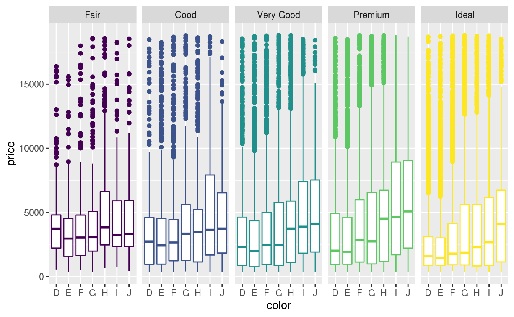
<p class="caption">(\#fig:boxplot-facet-color)箱线图</p>
</div>

我们当然还可以添加钻石的纯净度 clarity 作为分面依据，那么箱线图可以为图 \@ref(fig:boxplot-facet-color-clarity-1)


```r
ggplot(diamonds, aes(x = color, y = price, color = cut)) +
  geom_boxplot(show.legend = FALSE) +
  facet_grid(clarity ~ cut)
```

<div class="figure" style="text-align: center">

<p class="caption">(\#fig:boxplot-facet-color-clarity-1)复合分面箱线图</p>
</div>

经过观察，我们发现水平分类过多，考虑用切割质量 cut 替换钻石颜色 color 绘图，但是由于分类过细，图信息展示不简练，反而不好，如图 \@ref(fig:boxplot-facet-color-clarity-2)


```r
ggplot(diamonds, aes(x = cut, y = price, color = cut)) +
  geom_boxplot(show.legend = FALSE) +
  facet_grid(clarity ~ color)
ggplot(diamonds, aes(x = cut, y = price, color = color)) +
  geom_boxplot(show.legend = FALSE) +
  facet_grid(clarity ~ color)
```

<div class="figure" style="text-align: center">
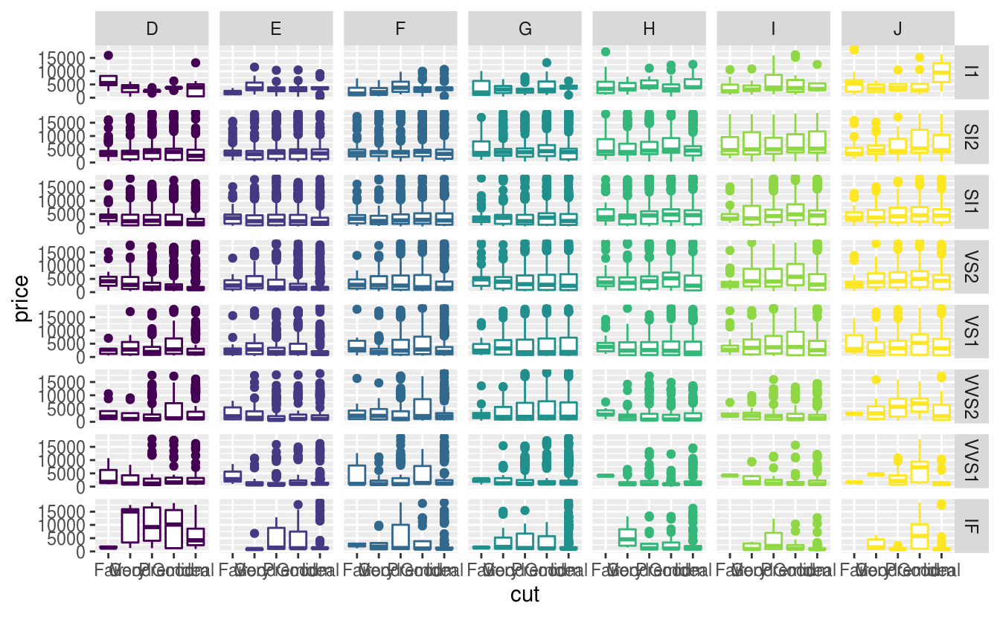
<p class="caption">(\#fig:boxplot-facet-color-clarity-2)钻石颜色配色</p>
</div>

### 条形图 {#ggplot2-barplot}

条形图特别适合分类变量的展示，我们这里展示钻石切割质量 cut 不同等级的数量，当然我们可以直接展示各类的数目，在图层 `geom_bar` 中指定 `stat="identity"`


```r
# 需要映射数据框的两个变量，相当于自己先计算了每类的数量
with(diamonds, table(cut))
#> cut
#>      Fair      Good Very Good   Premium     Ideal 
#>      1610      4906     12082     13791     21551
cut_df <- as.data.frame(table(diamonds$cut))
ggplot(cut_df, aes(x = Var1, y = Freq)) + geom_bar(stat = "identity")
```


```r
ggplot(diamonds, aes(x = cut)) + geom_bar()
```

<div class="figure" style="text-align: center">
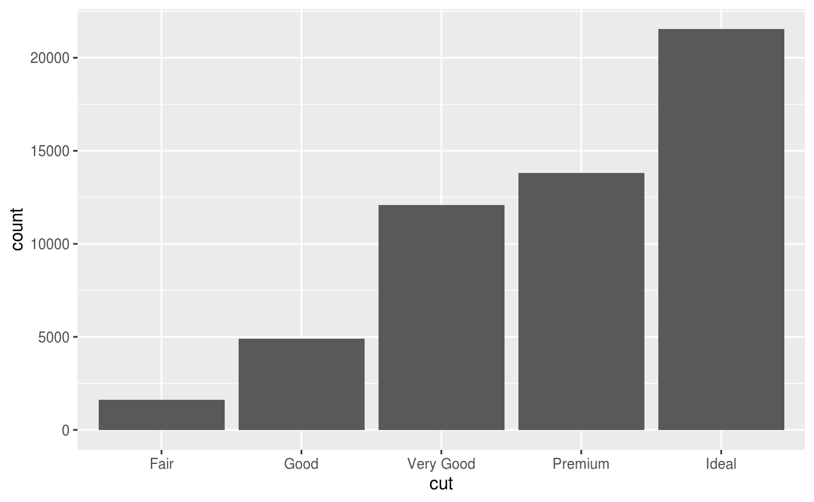
<p class="caption">(\#fig:diamonds-barplot-1)频数条形图</p>
</div>

还有另外三种表示方法


```r
ggplot(diamonds, aes(x = cut)) + geom_bar(stat = "count")
ggplot(diamonds, aes(x = cut, y = ..count..)) + geom_bar()
ggplot(diamonds, aes(x = cut, y = stat(count))) + geom_bar()
```


我们还可以在图 \@ref(fig:diamonds-barplot-1) 的基础上再添加一个分类变量钻石的纯净度 clarity，形成堆积条形图


```r
ggplot(diamonds, aes(x = cut, fill = clarity)) + geom_bar()
```

<div class="figure" style="text-align: center">

<p class="caption">(\#fig:diamonds-barplot-2)堆积条形图</p>
</div>

再添加一个分类变量钻石颜色 color 比较好的做法是分面


```r
ggplot(diamonds, aes(x = color, fill = clarity)) +
  geom_bar() +
  facet_grid(~cut)
```

<div class="figure" style="text-align: center">

<p class="caption">(\#fig:diamonds-barplot-3)分面堆积条形图</p>
</div>

实际上，绘制图\@ref(fig:diamonds-barplot-3)包含了对分类变量的分组计数过程，如下


```r
with(diamonds, table(cut, color))
#>            color
#> cut            D    E    F    G    H    I    J
#>   Fair       163  224  312  314  303  175  119
#>   Good       662  933  909  871  702  522  307
#>   Very Good 1513 2400 2164 2299 1824 1204  678
#>   Premium   1603 2337 2331 2924 2360 1428  808
#>   Ideal     2834 3903 3826 4884 3115 2093  896
```

还有一种堆积的方法是按比例，而不是按数量，如图\@ref(fig:diamonds-barplot-4)


```r
ggplot(diamonds, aes(x = color, fill = clarity)) +
  geom_bar(position = "fill") +
  facet_grid(~cut)
```

<div class="figure" style="text-align: center">

<p class="caption">(\#fig:diamonds-barplot-4)比例堆积条形图</p>
</div>

接下来就是复合条形图


```r
ggplot(diamonds, aes(x = color, fill = clarity)) +
  geom_bar(position = "dodge")
```

<div class="figure" style="text-align: center">
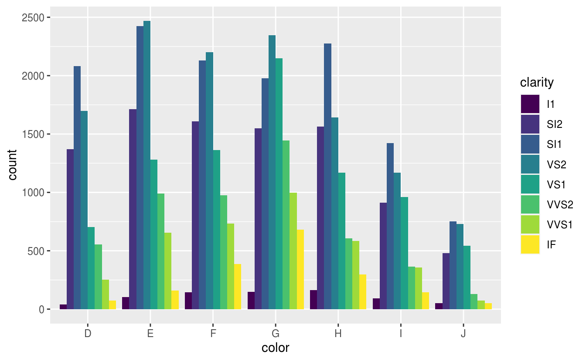
<p class="caption">(\#fig:diamonds-barplot-5)复合条形图</p>
</div>

再添加一个分类变量，就是需要分面大法了，图 \@ref(fig:diamonds-barplot-5) 展示了三个分类变量，其实我们还可以再添加一个分类变量用作分面的列依据


```r
ggplot(diamonds, aes(x = color, fill = clarity)) +
  geom_bar(position = "dodge") +
  facet_grid(rows = vars(cut))
```

<div class="figure" style="text-align: center">

<p class="caption">(\#fig:diamonds-barplot-6)分面复合条形图</p>
</div>

图 \@ref(fig:diamonds-barplot-6) 展示的数据如下


```r
with(diamonds, table(color, clarity, cut))
#> , , cut = Fair
#> 
#>      clarity
#> color   I1  SI2  SI1  VS2  VS1 VVS2 VVS1   IF
#>     D    4   56   58   25    5    9    3    3
#>     E    9   78   65   42   14   13    3    0
#>     F   35   89   83   53   33   10    5    4
#>     G   53   80   69   45   45   17    3    2
#>     H   52   91   75   41   32   11    1    0
#>     I   34   45   30   32   25    8    1    0
#>     J   23   27   28   23   16    1    1    0
#> 
#> , , cut = Good
#> 
#>      clarity
#> color   I1  SI2  SI1  VS2  VS1 VVS2 VVS1   IF
#>     D    8  223  237  104   43   25   13    9
#>     E   23  202  355  160   89   52   43    9
#>     F   19  201  273  184  132   50   35   15
#>     G   19  163  207  192  152   75   41   22
#>     H   14  158  235  138   77   45   31    4
#>     I    9   81  165  110  103   26   22    6
#>     J    4   53   88   90   52   13    1    6
#> 
#> , , cut = Very Good
#> 
#>      clarity
#> color   I1  SI2  SI1  VS2  VS1 VVS2 VVS1   IF
#>     D    5  314  494  309  175  141   52   23
#>     E   22  445  626  503  293  298  170   43
#>     F   13  343  559  466  293  249  174   67
#>     G   16  327  474  479  432  302  190   79
#>     H   12  343  547  376  257  145  115   29
#>     I    8  200  358  274  205   71   69   19
#>     J    8  128  182  184  120   29   19    8
#> 
#> , , cut = Premium
#> 
#>      clarity
#> color   I1  SI2  SI1  VS2  VS1 VVS2 VVS1   IF
#>     D   12  421  556  339  131   94   40   10
#>     E   30  519  614  629  292  121  105   27
#>     F   34  523  608  619  290  146   80   31
#>     G   46  492  566  721  566  275  171   87
#>     H   46  521  655  532  336  118  112   40
#>     I   24  312  367  315  221   82   84   23
#>     J   13  161  209  202  153   34   24   12
#> 
#> , , cut = Ideal
#> 
#>      clarity
#> color   I1  SI2  SI1  VS2  VS1 VVS2 VVS1   IF
#>     D   13  356  738  920  351  284  144   28
#>     E   18  469  766 1136  593  507  335   79
#>     F   42  453  608  879  616  520  440  268
#>     G   16  486  660  910  953  774  594  491
#>     H   38  450  763  556  467  289  326  226
#>     I   17  274  504  438  408  178  179   95
#>     J    2  110  243  232  201   54   29   25
```


### 折线图 {#ggplot2-line}

时间序列数据的展示，时序图


```r
ggplot(economics, aes(date, unemploy)) + geom_line()
```

<div class="figure" style="text-align: center">

<p class="caption">(\#fig:unnamed-chunk-25)时序图</p>
</div>


### 直方图 {#ggplot2-histogram}

直方图用来查看连续变量的分布


```r
ggplot(diamonds, aes(price)) + geom_histogram(bins = 30)
```

<div class="figure" style="text-align: center">

<p class="caption">(\#fig:unnamed-chunk-26)钻石价格的分布</p>
</div>

堆积直方图


```r
ggplot(diamonds, aes(x = price, fill = cut)) + geom_histogram(bins = 30)
```

<div class="figure" style="text-align: center">

<p class="caption">(\#fig:unnamed-chunk-27)钻石价格随切割质量的分布</p>
</div>

基础 R 包与 Ggplot2 包绘制的直方图的对比，Base R 绘图速度快，代码更加稳定，Ggplot2 代码简洁，更美观


```r
par(mar = c(2.1, 2.1, 1.5, 0.5))
plot(c(50, 350), c(0, 10),
  type = "n", font.main = 1,
  xlab = "", ylab = "", frame.plot = FALSE, axes = FALSE,
  # xlab = "hp", ylab = "Frequency",
  main = paste("Histogram with Base R", paste(rep(" ", 60), collapse = ""))
)
axis(
  side = 1, at = seq(50, 350, 50), labels = seq(50, 350, 50),
  tick = FALSE, las = 1, padj = 0, mgp = c(3, 0.1, 0)
)
axis(
  side = 2, at = seq(0, 10, 2), labels = seq(0, 10, 2),
  # col = "white", 坐标轴的颜色
  # col.ticks 刻度线的颜色
  tick = FALSE, # 取消刻度线
  las = 1, # 水平方向
  hadj = 1, # 右侧对齐
  mgp = c(3, 0.1, 0) # 纵轴边距线设置为 0.1
)
abline(h = seq(0, 10, 2), v = seq(50, 350, 50), col = "gray90", lty = "solid")
abline(h = seq(1, 9, 2), v = seq(75, 325, 50), col = "gray95", lty = "solid")
hist(mtcars$hp,
  col = "#56B4E9", border = "white",
  freq = TRUE, add = TRUE
  # labels = TRUE, axes = TRUE, ylim = c(0, 10.5),
  # xlab = "hp",main = "Histogram with Base R"
)
mtext("hp", 1, line = 1.0)
mtext("Frequency", 2, line = 1.0)

ggplot(mtcars) +
  geom_histogram(aes(x = hp), fill = "#56B4E9", color = "white", breaks = seq(50, 350, 50)) +
  scale_x_continuous(breaks = seq(50, 350, 50)) +
  scale_y_continuous(breaks = seq(0, 12, 2)) +
  labs(x = "hp", y = "Frequency", title = "Histogram with Ggplot2") +
  theme_minimal(base_size = 12)
```

<div class="figure" style="text-align: center">
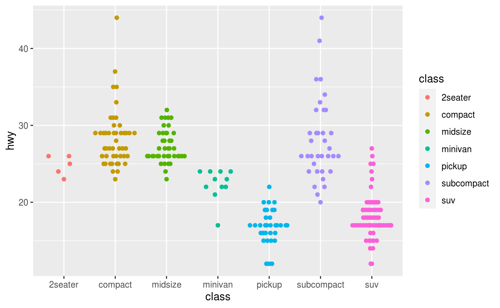
<p class="caption">(\#fig:unnamed-chunk-28)直方图</p>
</div>


### 提琴图 {#ggplot2-violin}

提琴图


```r
ggplot(diamonds, aes(x = cut, y = price)) + geom_boxplot()
ggplot(diamonds, aes(x = cut, y = price)) + geom_violin()
```

<div class="figure" style="text-align: center">

<p class="caption">(\#fig:violin)小提琴图</p>
</div>


```r
ggplot(mpg, aes(class, cty)) +
  geom_violin() +
  labs(
    title = "Violin plot",
    subtitle = "City Mileage vs Class of vehicle",
    caption = "Source: mpg",
    x = "Class of Vehicle",
    y = "City Mileage"
  )
```

<div class="figure" style="text-align: center">

<p class="caption">(\#fig:violin-mpg)城市里程与车辆类别</p>
</div>

蜂群图 [ggbeeswarm](https://github.com/eclarke/ggbeeswarm) 是分类散点图加箱线图的合体


```r
ggplot(mpg, aes(x = class, y = hwy, color = class)) +
  ggbeeswarm::geom_quasirandom()
```


### 抖动图 {#ggplot2-jitter}


抖动图适合数据量比较小的情况


```r
ggplot(mpg, aes(x = class, y = hwy, color = class)) + geom_jitter()
```


抖不抖，还是抖一下


```r
ggplot(iris, aes(x = Species, y = Sepal.Length)) +
  geom_point(aes(fill = Species), size = 5, shape = 21, colour = "grey20") +
  # geom_boxplot(outlier.colour = NA, fill = NA, colour = "grey20") +
  labs(title = "Not Jittered")

ggplot(iris, aes(x = Species, y = Sepal.Length)) +
  geom_point(aes(fill = Species),
    size = 5, shape = 21, colour = "grey20",
    position = position_jitter(width = 0.2, height = 0.1)
  ) +
  # geom_boxplot(outlier.colour = NA, fill = NA, colour = "grey20") +
  labs(title = "Jittered")
```


在数据量比较大的时候，可以用箱线图、密度图、提琴图


```r
ggplot(sub_diamonds, aes(x = cut, y = price)) + geom_jitter()
```

<div class="figure" style="text-align: center">

<p class="caption">(\#fig:unnamed-chunk-32)抖动图的反例</p>
</div>

上色和分面都不好使的抖动图，因为区分度变小


```r
ggplot(sub_diamonds, aes(x = color, y = price, color = color)) +
  geom_jitter() +
  facet_grid(clarity ~ cut)
```

<div class="figure" style="text-align: center">

<p class="caption">(\#fig:unnamed-chunk-33)根据钻石颜色上色</p>
</div>

箱线图此时不宜分的过细


```r
ggplot(diamonds, aes(x = color, y = price, color = color)) +
  geom_boxplot() +
  facet_grid(cut ~ clarity)
```

<div class="figure" style="text-align: center">
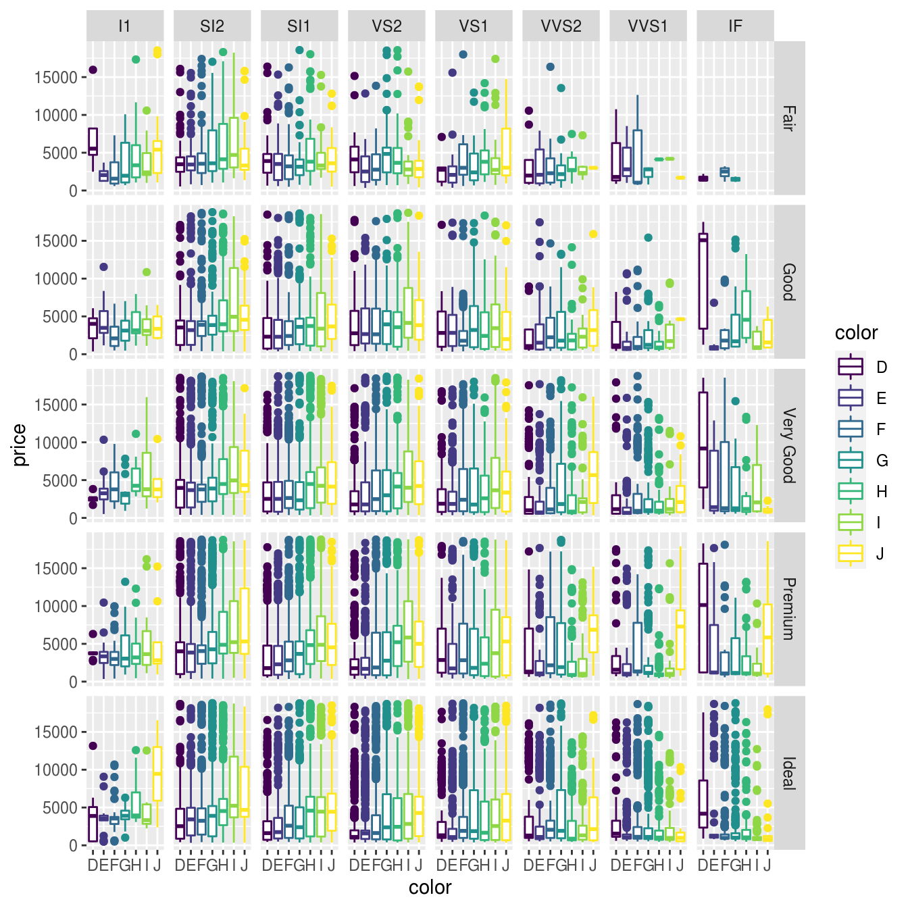
<p class="caption">(\#fig:boxplot-facet-cut-clarity)箱线图</p>
</div>

所以这样更好，先按纯净度分面，再对比不同的颜色，钻石价格的差异


```r
ggplot(diamonds, aes(x = color, y = price, color = color)) +
  geom_boxplot() +
  facet_grid(~clarity)
```

<div class="figure" style="text-align: center">

<p class="caption">(\#fig:boxplot-facet-clarity)钻石按纯净度分面</p>
</div>

最好只比较一个维度，不同颜色钻石的价格对比


```r
ggplot(diamonds, aes(x = color, y = price, color = color)) +
  geom_boxplot()
```

<div class="figure" style="text-align: center">
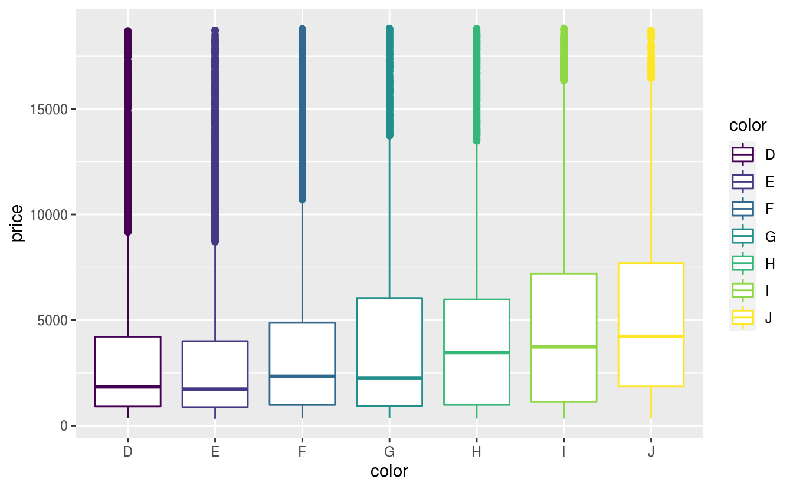
<p class="caption">(\#fig:boxplot-color)不同颜色钻石的价格比较</p>
</div>

### 密度图 {#ggplot2-ridge}


```r
ggplot(mpg, aes(cty)) +
  geom_density(aes(fill = factor(cyl)), alpha = 0.8) +
  labs(
    title = "Density plot",
    subtitle = "City Mileage Grouped by Number of cylinders",
    caption = "Source: mpg",
    x = "City Mileage",
    fill = "# Cylinders"
  )
```

<div class="figure" style="text-align: center">

<p class="caption">(\#fig:mpg-cyl-density)按汽缸数分组的城市里程</p>
</div>

添加透明度，解决遮挡


```r
ggplot(diamonds, aes(x = price, fill = cut)) + geom_density()
ggplot(diamonds, aes(x = price, fill = cut)) + geom_density(alpha = 0.5)
```

<div class="figure" style="text-align: center">

<p class="caption">(\#fig:density)添加透明度的密度图</p>
</div>

堆积密度图


```r
ggplot(diamonds, aes(x = price, fill = cut)) +
  geom_density(position = "stack")
```

<div class="figure" style="text-align: center">

<p class="caption">(\#fig:stack-density)堆积密度图</p>
</div>

条件密度估计


```r
# You can use position="fill" to produce a conditional density estimate
ggplot(diamonds, aes(carat, stat(count), fill = cut)) +
  geom_density(position = "fill")
```

<div class="figure" style="text-align: center">

<p class="caption">(\#fig:unnamed-chunk-34)条件密度估计图</p>
</div>


岭线图是密度图的一种变体，可以防止密度曲线重叠在一起


```r
ggplot(diamonds) +
  ggridges::geom_density_ridges(aes(x = price, y = color, fill = color))
#> Picking joint bandwidth of 535
```

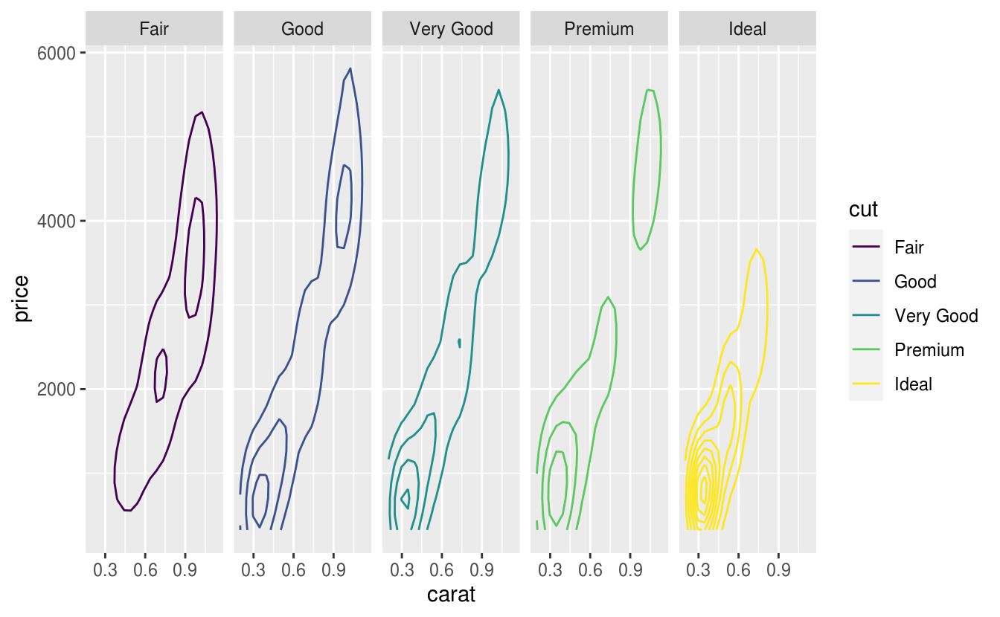

二维的密度图又是一种延伸


```r
ggplot(diamonds, aes(x = carat, y = price)) +
  geom_density_2d(aes(color = cut)) +
  facet_grid(~cut)
```

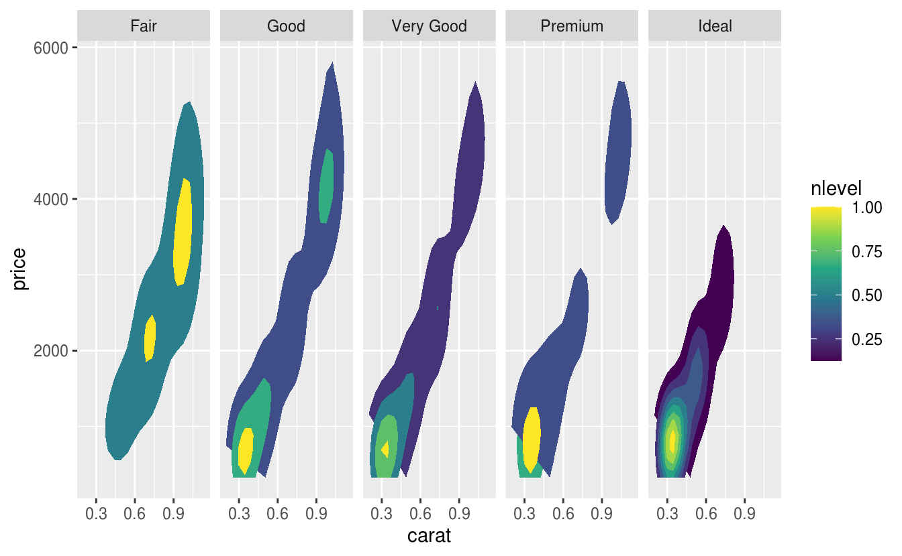

`stat` 函数，特别是 nlevel 参数，在密度曲线之间填充我们又可以得到热力图


```r
ggplot(diamonds, aes(x = carat, y = price)) +
  stat_density_2d(aes(fill = stat(nlevel)), geom = "polygon") +
  facet_grid(. ~ cut)
```


`gemo_hex` 也是二维密度图的一种变体，特别适合数据量比较大的情形


```r
ggplot(diamonds, aes(x = carat, y = price)) + geom_hex() +
  scale_fill_viridis_c()
```


### 玫瑰图 {#ggplot2-rose}

南丁格尔风玫瑰图[^nightingale-rose] 可以作为堆积条形图，分组条形图


```r
ggplot(diamonds, aes(x = color, fill = clarity)) +
  geom_bar()
ggplot(diamonds, aes(x = color, fill = clarity)) +
  geom_bar() +
  coord_polar()
```

<div class="figure" style="text-align: center">

<p class="caption">(\#fig:stack-to-rose)堆积条形图转风玫瑰图</p>
</div>


```r
# 风玫瑰图 http://blog.csdn.net/Bone_ACE/article/details/47624987
set.seed(2018)
# 随机生成100次风向，并汇集到16个区间内
direction <- cut_interval(runif(100, 0, 360), n = 16)
# 随机生成100次风速，并划分成4种强度
mag <- cut_interval(rgamma(100, 15), 4)
dat <- data.frame(direction = direction, mag = mag)
# 将风向映射到X轴，频数映射到Y轴，风速大小映射到填充色，生成条形图后再转为极坐标形式即可
p <- ggplot(dat, aes(x = direction, y = ..count.., fill = mag))
p + geom_bar(colour = "white") +
  coord_polar() +
  theme(axis.ticks = element_blank(), axis.text.y = element_blank()) +
  labs(x = "", y = "", fill = "Magnitude")
```

<div class="figure" style="text-align: center">

<p class="caption">(\#fig:wind-rose)风玫瑰图</p>
</div>


```r
p + geom_bar(position = "fill") +
  coord_polar() +
  theme(axis.ticks = element_blank(), axis.text.y = element_blank()) +
  labs(x = "", y = "", fill = "Magnitude")
```


[^nightingale-rose]: https://mbostock.github.io/protovis/ex/crimea-rose-full.html


### 词云图 {#ggplot2-wordcloud}

词云 [ggwordcloud](https://github.com/lepennec/ggwordcloud)


### 日历图 {#calendar-map}

这是 heatmap 的变种


```r
# 这个图和 Github 的打码图一样的
# 展示每日变化情况
library(ggplot2)
library(ggthemes)
library(data.table)

week.abb <- c("Mon", "Tue", "Wed", "Thu", "Fri", "Sat", "Sun")
month.abb <- c(
  "Jan", "Feb", "Mar", "Apr", "May", "Jun",
  "Jul", "Aug", "Sep", "Oct", "Nov", "Dec"
)

rides <- data.frame(date = seq.Date(
  from = as.Date("2016-04-04"),
  to = as.Date("2019-11-09"), by = "day"
))

rides$year <- year(rides$date)
rides$week <- week(rides$date)
rides$weekdays <- factor(wday(rides$date), labels = week.abb)
rides$N <- sample(1:40, dim(rides)[1], replace = TRUE)

ggplot(rides, aes(x = week, y = weekdays, fill = N)) +
  scale_fill_viridis_c(name = "Divvy Rides", option = "C", limits = c(0, max(rides$N))) +
  geom_tile(color = "white", size = 0.4) +
  facet_wrap("year", ncol = 1) +
  scale_x_continuous(expand = c(0, 0), breaks = seq(1, 52, length = 12), labels = month.abb) +
  theme_tufte()
```


## 运行环境  {#ggplot2-session-info}


```r
xfun::session_info(
  packages = c(
    "ggplot2", "magrittr", "colorspace",
    "nlme", "mgcv", "ggbeeswarm", "ggridges", "hexbin"
  )
)
#> R Under development (unstable) (2019-12-29 r77627)
#> Platform: x86_64-pc-linux-gnu (64-bit)
#> Running under: Ubuntu 16.04.6 LTS
#> 
#> Locale:
#>   LC_CTYPE=en_US.UTF-8       LC_NUMERIC=C              
#>   LC_TIME=en_US.UTF-8        LC_COLLATE=en_US.UTF-8    
#>   LC_MONETARY=en_US.UTF-8    LC_MESSAGES=en_US.UTF-8   
#>   LC_PAPER=en_US.UTF-8       LC_NAME=C                 
#>   LC_ADDRESS=C               LC_TELEPHONE=C            
#>   LC_MEASUREMENT=en_US.UTF-8 LC_IDENTIFICATION=C       
#> 
#> Package version:
#>   assertthat_0.2.1   backports_1.1.5    beeswarm_0.2.3    
#>   cli_2.0.0          colorspace_1.4-1   crayon_1.3.4      
#>   digest_0.6.23      ellipsis_0.3.0     fansi_0.4.0       
#>   farver_2.0.1       ggbeeswarm_0.6.0   ggplot2_3.2.1     
#>   ggridges_0.5.1     glue_1.3.1         graphics_4.0.0    
#>   grDevices_4.0.0    grid_4.0.0         gtable_0.3.0      
#>   hexbin_1.28.0      labeling_0.3       lattice_0.20.38   
#>   lazyeval_0.2.2     lifecycle_0.1.0    magrittr_1.5      
#>   MASS_7.3.51.5      Matrix_1.2.18      methods_4.0.0     
#>   mgcv_1.8-31        munsell_0.5.0      nlme_3.1-143      
#>   pillar_1.4.3       pkgconfig_2.0.3    plyr_1.8.5        
#>   R6_2.4.1           RColorBrewer_1.1.2 Rcpp_1.0.3        
#>   reshape2_1.4.3     rlang_0.4.2        scales_1.1.0      
#>   splines_4.0.0      stats_4.0.0        stringi_1.4.3     
#>   stringr_1.4.0      tibble_2.1.3       tools_4.0.0       
#>   utf8_1.1.4         utils_4.0.0        vctrs_0.2.1       
#>   vipor_0.4.5        viridisLite_0.3.0  withr_2.1.2       
#>   zeallot_0.1.0
```

