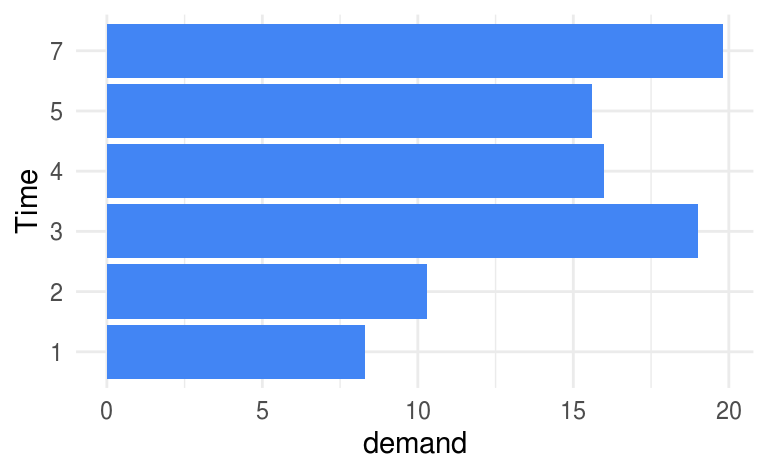
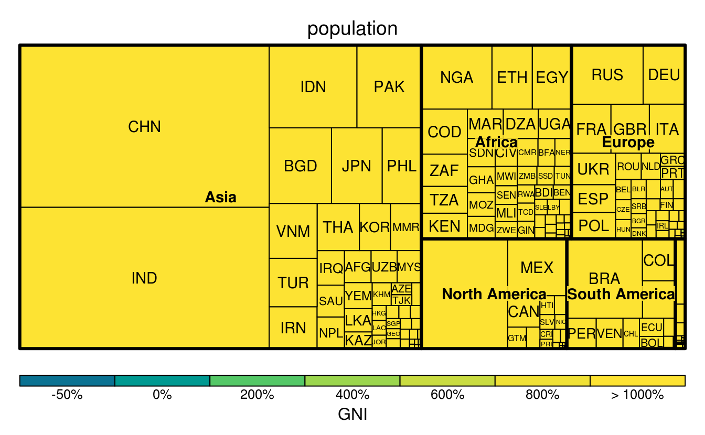

# highcharter 图形 {#chap:highcharter}

> The combination of some data and an aching desire for an answer does not ensure that a reasonable answer can be extracted from a given body of data.
>
>   --- John W. Tukey [@John_1986_Sunset]
      
      
这才是真的动态图形，底层设计的图形语法已经与 ggplot2 大不相同，和用户交互是核心的部分

[rgl](https://r-forge.r-project.org/projects/rgl/) 只是一种展现形式，它是基于 OpenGL，不拘泥于显示设备， [plotly](https://github.com/ropensci/plotly) 包 [@plotly2020] 和 [highcharter](https://github.com/jbkunst/highcharter) 是基于网页的


Table: (\#tab:htmlwidgets-js-eco)JavaScript 生态系统

Package                Title                                                                                                 
---------------------  ------------------------------------------------------------------------------------------------------
**apexcharter**        Create Interactive Chart with the JavaScript ApexCharts Library                                       
**billboarder**        Create Interactive Chart with the JavaScript Billboard Library                                        
**BioCircos**          Interactive Circular Visualization of Genomic Data using htmlwidgets and BioCircos.js                 
**c3**                 C3.js Chart Library                                                                                   
**chromoMap**          Interactive Visualization and Mapping of Chromosomes                                                  
**collapsibleTree**    Interactive Collapsible Tree Diagrams using D3.js                                                     
**cubeview**           View 3D Raster Cubes Interactively                                                                    
**d3heatmap**          Interactive Heat Maps Using htmlwidgets and D3.js                                                     
**D3partitionR**       Interactive Charts of Nested and Hierarchical Data with D3.js                                         
**d3Tree**             Create Interactive Collapsible Trees with the JavaScript D3 Library                                   
**datadigest**         Create an Interactive Data Summary                                                                    
**datamaps**           Create Interactive Web Maps with the JavaScript Datamaps Library                                      
**diffr**              Display Differences Between Two Files using Codediff Library                                          
**dragulaR**           Drag and Drop Elements in Shiny using Dragula Javascript Library                                      
**DT**                 A Wrapper of the JavaScript Library DataTables                                                        
**dygraphs**           Interface to Dygraphs Interactive Time Series Charting Library                                        
**echarts4r**          Create Interactive Graphs with Echarts JavaScript Version 4                                           
**excelR**             A Wrapper of the JavaScript Library jExcel                                                            
**focusedMDS**         Focused, Interactive Multidimensional Scaling                                                         
**g3viz**              Interactively Visualize Genetic Mutation Data using a Lollipop-Diagram                                
**ggiraph**            Make ggplot2 Graphics Interactive                                                                     
**gradientPickerD3**   Interactive Color Gradient Picker Using htmlwidgets and the Modified JS Script jquery-gradient-picker 
**heatmaply**          Interactive Cluster Heat Maps Using plotly                                                            
**highcharter**        A Wrapper for the Highcharts Library                                                                  
**iheatmapr**          Interactive, Complex Heatmaps                                                                         
**imageviewer**        Simple htmlwidgets Image Viewer with WebGL Brightness/Contrast                                        
**jsTree**             Create Interactive Trees with the jQuery jsTree Plugin                                                
**leaflet**            Create Interactive Web Maps with the JavaScript Leaflet Library                                       
**learnr**             Interactive Tutorials for R                                                                           
**listviewer**         htmlwidget for Interactive Views of R Lists                                                           
**manipulateWidget**   Add Even More Interactivity to Interactive Charts                                                     
**mapdeck**            Interactive Maps Using Mapbox GL JS and Deck.gl                                                       
**mapedit**            Interactive Editing of Spatial Data in R                                                              
**mapview**            Interactive Viewing of Spatial Data in R                                                              
**metricsgraphics**    Create Interactive Charts with the JavaScript MetricsGraphics Library                                 
**networkD3**          D3 JavaScript Network Graphs from R                                                                   
**parcats**            Interactive Parallel Categories Diagrams for easyalluvial                                             
**parcoords**          Htmlwidget for d3.js Parallel Coordinates Chart                                                       
**phylocanvas**        Interactive Phylogenetic Trees Using the Phylocanvas JavaScript Library                               
**plainview**          Plot Raster Images Interactively on a Plain HTML Canvas                                               
**plotly**             Create Interactive Web Graphics via plotly.js                                                         
**profvis**            Interactive Visualizations for Profiling R Code                                                       
**QRAGadget**          A Shiny Gadget for Interactive QRA Visualizations                                                     
**qrage**              Tools that Create D3 JavaScript Force Directed Graph from R                                           
**qtlcharts**          Interactive Graphics for QTL Experiments                                                              
**radarchart**         Radar Chart from Chart.js                                                                             
**RagGrid**            A Wrapper of the JavaScript Library agGrid                                                            
**rAmCharts**          JavaScript Charts Tool                                                                                
**reactable**          Interactive Data Tables Based on React Table                                                          
**rhandsontable**      Interface to the Handsontable.js Library                                                              
**safetyGraphics**     Create Interactive Graphics Related to Clinical Trial Safety                                          
**scatterD3**          D3 JavaScript Scatterplot from R                                                                      
**shinyTree**          jsTree Bindings for Shiny                                                                             
**sigmajs**            Interface to Sigma.js Graph Visualization Library                                                     
**sigmaNet**           Render Graphs Using Sigma.js                                                                          
**slickR**             Create Interactive Carousels with the JavaScript Slick Library                                        
**threejs**            Interactive 3D Scatter Plots, Networks and Globes                                                     
**timevis**            Create Interactive Timeline Visualizations in R                                                       
**trelliscopejs**      Create Interactive Trelliscope Displays                                                               
**visNetwork**         Network Visualization using vis.js Library                                                            

下面以 highcharter 包为例介绍动态图形，

::: rmdnote

不推荐使用 **highcharter** 包提供的 `hchart()` 接口，这个接口函数走的路线和 **ggplot2** 包内的 `qplot()` 函数一致，用它就好像在拄着拐杖走路，很别扭！

:::


- `highchart()` hc 对象
- `hc_*` 系列函数分类整理出 R 包结构，归纳出学习路径

- `hc_color()` 配色
- `hc_xAxis()` X 轴
- `hc_yAxis()` Y 轴
- `hc_title()` 标题
- `hc_subtitle()` 副标题
- `hc_legend()` 图例
- `hc_add_series()` 添加序列
- `hc_rm_series()` 移除序列
- `hc_exporting()` 导出图形
- `hc_credits()` 添加图形注释，比如数据来源，版权

以数据集 discoveries 为例介绍 highcharter 包的使用


```r
library(highcharter)
#> Registered S3 method overwritten by 'xts':
#>   method     from
#>   as.zoo.xts zoo
#> Registered S3 method overwritten by 'quantmod':
#>   method            from
#>   as.zoo.data.frame zoo
#> Highcharts (www.highcharts.com) is a Highsoft software product which is
#> not free for commercial and Governmental use
highchart() %>% 
  hc_xAxis(type = "datetime") %>% 
  hc_title(text = "Yearly Numbers of Important Discoveries",
           margin = 20, align = "left",
           style = list(color = "#51B749", useHTML = TRUE)) %>% 
  hc_add_series(data = discoveries, name = "discoveries") %>% 
  hc_exporting(enabled = TRUE)
```

<!--html_preserve--><div id="htmlwidget-0eb6828b6c1154486afe" style="width:100%;height:500px;" class="highchart html-widget"></div>
<script type="application/json" data-for="htmlwidget-0eb6828b6c1154486afe">{"x":{"hc_opts":{"title":{"text":"Yearly Numbers of Important Discoveries","margin":20,"align":"left","style":{"color":"#51B749","useHTML":true}},"yAxis":{"title":{"text":null}},"credits":{"enabled":false},"exporting":{"enabled":true},"plotOptions":{"series":{"label":{"enabled":false},"turboThreshold":0},"treemap":{"layoutAlgorithm":"squarified"}},"xAxis":{"type":"datetime"},"series":[{"data":[[-3471292800000,5],[-3439670400000,3],[-3408134400000,0],[-3376598400000,2],[-3345062400000,0],[-3313440000000,3],[-3281904000000,2],[-3250368000000,3],[-3218832000000,6],[-3187209600000,1],[-3155673600000,2],[-3124137600000,1],[-3092601600000,2],[-3060979200000,1],[-3029443200000,3],[-2997907200000,3],[-2966371200000,3],[-2934748800000,5],[-2903212800000,2],[-2871676800000,4],[-2840140800000,4],[-2808518400000,0],[-2776982400000,2],[-2745446400000,3],[-2713910400000,7],[-2682288000000,12],[-2650752000000,3],[-2619216000000,10],[-2587680000000,9],[-2556057600000,2],[-2524521600000,3],[-2492985600000,7],[-2461449600000,7],[-2429827200000,2],[-2398291200000,3],[-2366755200000,3],[-2335219200000,6],[-2303596800000,2],[-2272060800000,4],[-2240524800000,3],[-2208988800000,5],[-2177452800000,2],[-2145916800000,2],[-2114380800000,4],[-2082844800000,0],[-2051222400000,4],[-2019686400000,2],[-1988150400000,5],[-1956614400000,2],[-1924992000000,3],[-1893456000000,3],[-1861920000000,6],[-1830384000000,5],[-1798761600000,8],[-1767225600000,3],[-1735689600000,6],[-1704153600000,6],[-1672531200000,0],[-1640995200000,5],[-1609459200000,2],[-1577923200000,2],[-1546300800000,2],[-1514764800000,6],[-1483228800000,3],[-1451692800000,4],[-1420070400000,4],[-1388534400000,2],[-1356998400000,2],[-1325462400000,4],[-1293840000000,7],[-1262304000000,5],[-1230768000000,3],[-1199232000000,3],[-1167609600000,0],[-1136073600000,2],[-1104537600000,2],[-1073001600000,2],[-1041379200000,1],[-1009843200000,3],[-978307200000,4],[-946771200000,2],[-915148800000,2],[-883612800000,1],[-852076800000,1],[-820540800000,1],[-788918400000,2],[-757382400000,1],[-725846400000,4],[-694310400000,4],[-662688000000,3],[-631152000000,2],[-599616000000,1],[-568080000000,4],[-536457600000,1],[-504921600000,1],[-473385600000,1],[-441849600000,0],[-410227200000,0],[-378691200000,2],[-347155200000,0]],"name":"discoveries"}]},"theme":{"chart":{"backgroundColor":"transparent"}},"conf_opts":{"global":{"Date":null,"VMLRadialGradientURL":"http =//code.highcharts.com/list(version)/gfx/vml-radial-gradient.png","canvasToolsURL":"http =//code.highcharts.com/list(version)/modules/canvas-tools.js","getTimezoneOffset":null,"timezoneOffset":0,"useUTC":true},"lang":{"contextButtonTitle":"Chart context menu","decimalPoint":".","downloadJPEG":"Download JPEG image","downloadPDF":"Download PDF document","downloadPNG":"Download PNG image","downloadSVG":"Download SVG vector image","drillUpText":"Back to {series.name}","invalidDate":null,"loading":"Loading...","months":["January","February","March","April","May","June","July","August","September","October","November","December"],"noData":"No data to display","numericSymbols":["k","M","G","T","P","E"],"printChart":"Print chart","resetZoom":"Reset zoom","resetZoomTitle":"Reset zoom level 1:1","shortMonths":["Jan","Feb","Mar","Apr","May","Jun","Jul","Aug","Sep","Oct","Nov","Dec"],"thousandsSep":" ","weekdays":["Sunday","Monday","Tuesday","Wednesday","Thursday","Friday","Saturday"]}},"type":"chart","fonts":[],"debug":false},"evals":[],"jsHooks":[]}</script><!--/html_preserve-->


## 折线图 {#subsec:hc-line} 

### 简单折线图 {#subsubsec:simple-hc-line}


```r
library(ggplot2)
ggplot(data = BOD, aes(x = Time, y = demand)) +
  geom_point() +
  geom_line() +
  theme_minimal()
```


```r
library(highcharter)
hchart(BOD, "line", hcaes(x = Time, y = demand))
```

<!--html_preserve--><div id="htmlwidget-471f6b9f57594e8bea12" style="width:100%;height:500px;" class="highchart html-widget"></div>
<script type="application/json" data-for="htmlwidget-471f6b9f57594e8bea12">{"x":{"hc_opts":{"title":{"text":null},"yAxis":{"title":{"text":"demand"},"type":"linear"},"credits":{"enabled":false},"exporting":{"enabled":false},"plotOptions":{"series":{"label":{"enabled":false},"turboThreshold":0,"showInLegend":false},"treemap":{"layoutAlgorithm":"squarified"},"scatter":{"marker":{"symbol":"circle"}}},"series":[{"group":"group","data":[{"Time":1,"demand":8.3,"x":1,"y":8.3},{"Time":2,"demand":10.3,"x":2,"y":10.3},{"Time":3,"demand":19,"x":3,"y":19},{"Time":4,"demand":16,"x":4,"y":16},{"Time":5,"demand":15.6,"x":5,"y":15.6},{"Time":7,"demand":19.8,"x":7,"y":19.8}],"type":"line"}],"xAxis":{"type":"linear","title":{"text":"Time"},"categories":null}},"theme":{"chart":{"backgroundColor":"transparent"}},"conf_opts":{"global":{"Date":null,"VMLRadialGradientURL":"http =//code.highcharts.com/list(version)/gfx/vml-radial-gradient.png","canvasToolsURL":"http =//code.highcharts.com/list(version)/modules/canvas-tools.js","getTimezoneOffset":null,"timezoneOffset":0,"useUTC":true},"lang":{"contextButtonTitle":"Chart context menu","decimalPoint":".","downloadJPEG":"Download JPEG image","downloadPDF":"Download PDF document","downloadPNG":"Download PNG image","downloadSVG":"Download SVG vector image","drillUpText":"Back to {series.name}","invalidDate":null,"loading":"Loading...","months":["January","February","March","April","May","June","July","August","September","October","November","December"],"noData":"No data to display","numericSymbols":["k","M","G","T","P","E"],"printChart":"Print chart","resetZoom":"Reset zoom","resetZoomTitle":"Reset zoom level 1:1","shortMonths":["Jan","Feb","Mar","Apr","May","Jun","Jul","Aug","Sep","Oct","Nov","Dec"],"thousandsSep":" ","weekdays":["Sunday","Monday","Tuesday","Wednesday","Thursday","Friday","Saturday"]}},"type":"chart","fonts":[],"debug":false},"evals":[],"jsHooks":[]}</script><!--/html_preserve-->

### 分组折线图 {#subsubsec:group-hc-line}


```r
ggplot(data = Orange, aes(x = age, y = circumference, color = Tree)) +
  geom_point() +
  geom_line() +
  theme_minimal()
```


```r
hchart(Orange, "line", hcaes(x = age, y = circumference, group = Tree))
```

<!--html_preserve--><div id="htmlwidget-9580c84d0c32f0a22a8c" style="width:100%;height:500px;" class="highchart html-widget"></div>
<script type="application/json" data-for="htmlwidget-9580c84d0c32f0a22a8c">{"x":{"hc_opts":{"title":{"text":null},"yAxis":{"title":{"text":"circumference"},"type":"linear"},"credits":{"enabled":false},"exporting":{"enabled":false},"plotOptions":{"series":{"label":{"enabled":false},"turboThreshold":0,"showInLegend":true},"treemap":{"layoutAlgorithm":"squarified"},"scatter":{"marker":{"symbol":"circle"}}},"series":[{"name":"3","data":[{"Tree":"3","age":118,"circumference":30,"x":118,"y":30},{"Tree":"3","age":484,"circumference":51,"x":484,"y":51},{"Tree":"3","age":664,"circumference":75,"x":664,"y":75},{"Tree":"3","age":1004,"circumference":108,"x":1004,"y":108},{"Tree":"3","age":1231,"circumference":115,"x":1231,"y":115},{"Tree":"3","age":1372,"circumference":139,"x":1372,"y":139},{"Tree":"3","age":1582,"circumference":140,"x":1582,"y":140}],"type":"line"},{"name":"1","data":[{"Tree":"1","age":118,"circumference":30,"x":118,"y":30},{"Tree":"1","age":484,"circumference":58,"x":484,"y":58},{"Tree":"1","age":664,"circumference":87,"x":664,"y":87},{"Tree":"1","age":1004,"circumference":115,"x":1004,"y":115},{"Tree":"1","age":1231,"circumference":120,"x":1231,"y":120},{"Tree":"1","age":1372,"circumference":142,"x":1372,"y":142},{"Tree":"1","age":1582,"circumference":145,"x":1582,"y":145}],"type":"line"},{"name":"5","data":[{"Tree":"5","age":118,"circumference":30,"x":118,"y":30},{"Tree":"5","age":484,"circumference":49,"x":484,"y":49},{"Tree":"5","age":664,"circumference":81,"x":664,"y":81},{"Tree":"5","age":1004,"circumference":125,"x":1004,"y":125},{"Tree":"5","age":1231,"circumference":142,"x":1231,"y":142},{"Tree":"5","age":1372,"circumference":174,"x":1372,"y":174},{"Tree":"5","age":1582,"circumference":177,"x":1582,"y":177}],"type":"line"},{"name":"2","data":[{"Tree":"2","age":118,"circumference":33,"x":118,"y":33},{"Tree":"2","age":484,"circumference":69,"x":484,"y":69},{"Tree":"2","age":664,"circumference":111,"x":664,"y":111},{"Tree":"2","age":1004,"circumference":156,"x":1004,"y":156},{"Tree":"2","age":1231,"circumference":172,"x":1231,"y":172},{"Tree":"2","age":1372,"circumference":203,"x":1372,"y":203},{"Tree":"2","age":1582,"circumference":203,"x":1582,"y":203}],"type":"line"},{"name":"4","data":[{"Tree":"4","age":118,"circumference":32,"x":118,"y":32},{"Tree":"4","age":484,"circumference":62,"x":484,"y":62},{"Tree":"4","age":664,"circumference":112,"x":664,"y":112},{"Tree":"4","age":1004,"circumference":167,"x":1004,"y":167},{"Tree":"4","age":1231,"circumference":179,"x":1231,"y":179},{"Tree":"4","age":1372,"circumference":209,"x":1372,"y":209},{"Tree":"4","age":1582,"circumference":214,"x":1582,"y":214}],"type":"line"}],"xAxis":{"type":"linear","title":{"text":"age"},"categories":null}},"theme":{"chart":{"backgroundColor":"transparent"}},"conf_opts":{"global":{"Date":null,"VMLRadialGradientURL":"http =//code.highcharts.com/list(version)/gfx/vml-radial-gradient.png","canvasToolsURL":"http =//code.highcharts.com/list(version)/modules/canvas-tools.js","getTimezoneOffset":null,"timezoneOffset":0,"useUTC":true},"lang":{"contextButtonTitle":"Chart context menu","decimalPoint":".","downloadJPEG":"Download JPEG image","downloadPDF":"Download PDF document","downloadPNG":"Download PNG image","downloadSVG":"Download SVG vector image","drillUpText":"Back to {series.name}","invalidDate":null,"loading":"Loading...","months":["January","February","March","April","May","June","July","August","September","October","November","December"],"noData":"No data to display","numericSymbols":["k","M","G","T","P","E"],"printChart":"Print chart","resetZoom":"Reset zoom","resetZoomTitle":"Reset zoom level 1:1","shortMonths":["Jan","Feb","Mar","Apr","May","Jun","Jul","Aug","Sep","Oct","Nov","Dec"],"thousandsSep":" ","weekdays":["Sunday","Monday","Tuesday","Wednesday","Thursday","Friday","Saturday"]}},"type":"chart","fonts":[],"debug":false},"evals":[],"jsHooks":[]}</script><!--/html_preserve-->

```r

# hchart(DNase, "line", hcaes(x = conc, y = density, group = Run))
# hchart(Loblolly, "line", hcaes(x = age, y = height, group = Seed))
```

### 时间序列图 {#subsubsec:ts-hc-line}


```r
library(ggfortify)
```

::: rmdtip
**ggfortify** 包 [@Tang_2016_ggfortify] 大大扩展了 **ggplot2** 包内置的函数 `autoplot()` 的功能，使得它可以适用 67 种数据对象的直接绘图
:::

Base R 对时间序列类型 ts 的数据对象提供了泛型函数 `plot.ts()` 支持


```r
plot(Nile, main = "Flow of the River Nile")

library(ggfortify)
autoplot(Nile, xlab = "Time", ylab = "Nile", main = "Flow of the River Nile") +
  theme_minimal()
```

<div class="figure" style="text-align: center">

<p class="caption">(\#fig:nile-line)时序图</p>
</div>


<!-- 讲点尼罗河历史，1898 年附近出现了 changepoint 尼罗河流量骤减 -->


```r
highchart() %>% 
  hc_xAxis(type = "datetime") %>% 
  hc_add_series(data = Nile,  name = "Nile")
```

<!--html_preserve--><div id="htmlwidget-30d3a97e9514ca5bbcd5" style="width:100%;height:500px;" class="highchart html-widget"></div>
<script type="application/json" data-for="htmlwidget-30d3a97e9514ca5bbcd5">{"x":{"hc_opts":{"title":{"text":null},"yAxis":{"title":{"text":null}},"credits":{"enabled":false},"exporting":{"enabled":false},"plotOptions":{"series":{"label":{"enabled":false},"turboThreshold":0},"treemap":{"layoutAlgorithm":"squarified"}},"xAxis":{"type":"datetime"},"series":[{"data":[[-3124137600000,1120],[-3092601600000,1160],[-3060979200000,963],[-3029443200000,1210],[-2997907200000,1160],[-2966371200000,1160],[-2934748800000,813],[-2903212800000,1230],[-2871676800000,1370],[-2840140800000,1140],[-2808518400000,995],[-2776982400000,935],[-2745446400000,1110],[-2713910400000,994],[-2682288000000,1020],[-2650752000000,960],[-2619216000000,1180],[-2587680000000,799],[-2556057600000,958],[-2524521600000,1140],[-2492985600000,1100],[-2461449600000,1210],[-2429827200000,1150],[-2398291200000,1250],[-2366755200000,1260],[-2335219200000,1220],[-2303596800000,1030],[-2272060800000,1100],[-2240524800000,774],[-2208988800000,840],[-2177452800000,874],[-2145916800000,694],[-2114380800000,940],[-2082844800000,833],[-2051222400000,701],[-2019686400000,916],[-1988150400000,692],[-1956614400000,1020],[-1924992000000,1050],[-1893456000000,969],[-1861920000000,831],[-1830384000000,726],[-1798761600000,456],[-1767225600000,824],[-1735689600000,702],[-1704153600000,1120],[-1672531200000,1100],[-1640995200000,832],[-1609459200000,764],[-1577923200000,821],[-1546300800000,768],[-1514764800000,845],[-1483228800000,864],[-1451692800000,862],[-1420070400000,698],[-1388534400000,845],[-1356998400000,744],[-1325462400000,796],[-1293840000000,1040],[-1262304000000,759],[-1230768000000,781],[-1199232000000,865],[-1167609600000,845],[-1136073600000,944],[-1104537600000,984],[-1073001600000,897],[-1041379200000,822],[-1009843200000,1010],[-978307200000,771],[-946771200000,676],[-915148800000,649],[-883612800000,846],[-852076800000,812],[-820540800000,742],[-788918400000,801],[-757382400000,1040],[-725846400000,860],[-694310400000,874],[-662688000000,848],[-631152000000,890],[-599616000000,744],[-568080000000,749],[-536457600000,838],[-504921600000,1050],[-473385600000,918],[-441849600000,986],[-410227200000,797],[-378691200000,923],[-347155200000,975],[-315619200000,815],[-283996800000,1020],[-252460800000,906],[-220924800000,901],[-189388800000,1170],[-157766400000,912],[-126230400000,746],[-94694400000,919],[-63158400000,718],[-31536000000,714],[0,740]],"name":"Nile"}]},"theme":{"chart":{"backgroundColor":"transparent"}},"conf_opts":{"global":{"Date":null,"VMLRadialGradientURL":"http =//code.highcharts.com/list(version)/gfx/vml-radial-gradient.png","canvasToolsURL":"http =//code.highcharts.com/list(version)/modules/canvas-tools.js","getTimezoneOffset":null,"timezoneOffset":0,"useUTC":true},"lang":{"contextButtonTitle":"Chart context menu","decimalPoint":".","downloadJPEG":"Download JPEG image","downloadPDF":"Download PDF document","downloadPNG":"Download PNG image","downloadSVG":"Download SVG vector image","drillUpText":"Back to {series.name}","invalidDate":null,"loading":"Loading...","months":["January","February","March","April","May","June","July","August","September","October","November","December"],"noData":"No data to display","numericSymbols":["k","M","G","T","P","E"],"printChart":"Print chart","resetZoom":"Reset zoom","resetZoomTitle":"Reset zoom level 1:1","shortMonths":["Jan","Feb","Mar","Apr","May","Jun","Jul","Aug","Sep","Oct","Nov","Dec"],"thousandsSep":" ","weekdays":["Sunday","Monday","Tuesday","Wednesday","Thursday","Friday","Saturday"]}},"type":"chart","fonts":[],"debug":false},"evals":[],"jsHooks":[]}</script><!--/html_preserve-->


## 散点图 {#subsec:hc-scatter}

散点图，没有比散点图更能表达数据

### 简单散点图 {#subsubsec:simple-hc-scatter}


```r
hchart(faithful, "scatter", hcaes(x = waiting, y = eruptions))
```

<!--html_preserve--><div id="htmlwidget-98e1496814bc81b07d36" style="width:100%;height:500px;" class="highchart html-widget"></div>
<script type="application/json" data-for="htmlwidget-98e1496814bc81b07d36">{"x":{"hc_opts":{"title":{"text":null},"yAxis":{"title":{"text":"eruptions"},"type":"linear"},"credits":{"enabled":false},"exporting":{"enabled":false},"plotOptions":{"series":{"label":{"enabled":false},"turboThreshold":0,"showInLegend":false},"treemap":{"layoutAlgorithm":"squarified"},"scatter":{"marker":{"symbol":"circle"}}},"series":[{"group":"group","data":[{"eruptions":3.6,"waiting":79,"x":79,"y":3.6},{"eruptions":1.8,"waiting":54,"x":54,"y":1.8},{"eruptions":3.333,"waiting":74,"x":74,"y":3.333},{"eruptions":2.283,"waiting":62,"x":62,"y":2.283},{"eruptions":4.533,"waiting":85,"x":85,"y":4.533},{"eruptions":2.883,"waiting":55,"x":55,"y":2.883},{"eruptions":4.7,"waiting":88,"x":88,"y":4.7},{"eruptions":3.6,"waiting":85,"x":85,"y":3.6},{"eruptions":1.95,"waiting":51,"x":51,"y":1.95},{"eruptions":4.35,"waiting":85,"x":85,"y":4.35},{"eruptions":1.833,"waiting":54,"x":54,"y":1.833},{"eruptions":3.917,"waiting":84,"x":84,"y":3.917},{"eruptions":4.2,"waiting":78,"x":78,"y":4.2},{"eruptions":1.75,"waiting":47,"x":47,"y":1.75},{"eruptions":4.7,"waiting":83,"x":83,"y":4.7},{"eruptions":2.167,"waiting":52,"x":52,"y":2.167},{"eruptions":1.75,"waiting":62,"x":62,"y":1.75},{"eruptions":4.8,"waiting":84,"x":84,"y":4.8},{"eruptions":1.6,"waiting":52,"x":52,"y":1.6},{"eruptions":4.25,"waiting":79,"x":79,"y":4.25},{"eruptions":1.8,"waiting":51,"x":51,"y":1.8},{"eruptions":1.75,"waiting":47,"x":47,"y":1.75},{"eruptions":3.45,"waiting":78,"x":78,"y":3.45},{"eruptions":3.067,"waiting":69,"x":69,"y":3.067},{"eruptions":4.533,"waiting":74,"x":74,"y":4.533},{"eruptions":3.6,"waiting":83,"x":83,"y":3.6},{"eruptions":1.967,"waiting":55,"x":55,"y":1.967},{"eruptions":4.083,"waiting":76,"x":76,"y":4.083},{"eruptions":3.85,"waiting":78,"x":78,"y":3.85},{"eruptions":4.433,"waiting":79,"x":79,"y":4.433},{"eruptions":4.3,"waiting":73,"x":73,"y":4.3},{"eruptions":4.467,"waiting":77,"x":77,"y":4.467},{"eruptions":3.367,"waiting":66,"x":66,"y":3.367},{"eruptions":4.033,"waiting":80,"x":80,"y":4.033},{"eruptions":3.833,"waiting":74,"x":74,"y":3.833},{"eruptions":2.017,"waiting":52,"x":52,"y":2.017},{"eruptions":1.867,"waiting":48,"x":48,"y":1.867},{"eruptions":4.833,"waiting":80,"x":80,"y":4.833},{"eruptions":1.833,"waiting":59,"x":59,"y":1.833},{"eruptions":4.783,"waiting":90,"x":90,"y":4.783},{"eruptions":4.35,"waiting":80,"x":80,"y":4.35},{"eruptions":1.883,"waiting":58,"x":58,"y":1.883},{"eruptions":4.567,"waiting":84,"x":84,"y":4.567},{"eruptions":1.75,"waiting":58,"x":58,"y":1.75},{"eruptions":4.533,"waiting":73,"x":73,"y":4.533},{"eruptions":3.317,"waiting":83,"x":83,"y":3.317},{"eruptions":3.833,"waiting":64,"x":64,"y":3.833},{"eruptions":2.1,"waiting":53,"x":53,"y":2.1},{"eruptions":4.633,"waiting":82,"x":82,"y":4.633},{"eruptions":2,"waiting":59,"x":59,"y":2},{"eruptions":4.8,"waiting":75,"x":75,"y":4.8},{"eruptions":4.716,"waiting":90,"x":90,"y":4.716},{"eruptions":1.833,"waiting":54,"x":54,"y":1.833},{"eruptions":4.833,"waiting":80,"x":80,"y":4.833},{"eruptions":1.733,"waiting":54,"x":54,"y":1.733},{"eruptions":4.883,"waiting":83,"x":83,"y":4.883},{"eruptions":3.717,"waiting":71,"x":71,"y":3.717},{"eruptions":1.667,"waiting":64,"x":64,"y":1.667},{"eruptions":4.567,"waiting":77,"x":77,"y":4.567},{"eruptions":4.317,"waiting":81,"x":81,"y":4.317},{"eruptions":2.233,"waiting":59,"x":59,"y":2.233},{"eruptions":4.5,"waiting":84,"x":84,"y":4.5},{"eruptions":1.75,"waiting":48,"x":48,"y":1.75},{"eruptions":4.8,"waiting":82,"x":82,"y":4.8},{"eruptions":1.817,"waiting":60,"x":60,"y":1.817},{"eruptions":4.4,"waiting":92,"x":92,"y":4.4},{"eruptions":4.167,"waiting":78,"x":78,"y":4.167},{"eruptions":4.7,"waiting":78,"x":78,"y":4.7},{"eruptions":2.067,"waiting":65,"x":65,"y":2.067},{"eruptions":4.7,"waiting":73,"x":73,"y":4.7},{"eruptions":4.033,"waiting":82,"x":82,"y":4.033},{"eruptions":1.967,"waiting":56,"x":56,"y":1.967},{"eruptions":4.5,"waiting":79,"x":79,"y":4.5},{"eruptions":4,"waiting":71,"x":71,"y":4},{"eruptions":1.983,"waiting":62,"x":62,"y":1.983},{"eruptions":5.067,"waiting":76,"x":76,"y":5.067},{"eruptions":2.017,"waiting":60,"x":60,"y":2.017},{"eruptions":4.567,"waiting":78,"x":78,"y":4.567},{"eruptions":3.883,"waiting":76,"x":76,"y":3.883},{"eruptions":3.6,"waiting":83,"x":83,"y":3.6},{"eruptions":4.133,"waiting":75,"x":75,"y":4.133},{"eruptions":4.333,"waiting":82,"x":82,"y":4.333},{"eruptions":4.1,"waiting":70,"x":70,"y":4.1},{"eruptions":2.633,"waiting":65,"x":65,"y":2.633},{"eruptions":4.067,"waiting":73,"x":73,"y":4.067},{"eruptions":4.933,"waiting":88,"x":88,"y":4.933},{"eruptions":3.95,"waiting":76,"x":76,"y":3.95},{"eruptions":4.517,"waiting":80,"x":80,"y":4.517},{"eruptions":2.167,"waiting":48,"x":48,"y":2.167},{"eruptions":4,"waiting":86,"x":86,"y":4},{"eruptions":2.2,"waiting":60,"x":60,"y":2.2},{"eruptions":4.333,"waiting":90,"x":90,"y":4.333},{"eruptions":1.867,"waiting":50,"x":50,"y":1.867},{"eruptions":4.817,"waiting":78,"x":78,"y":4.817},{"eruptions":1.833,"waiting":63,"x":63,"y":1.833},{"eruptions":4.3,"waiting":72,"x":72,"y":4.3},{"eruptions":4.667,"waiting":84,"x":84,"y":4.667},{"eruptions":3.75,"waiting":75,"x":75,"y":3.75},{"eruptions":1.867,"waiting":51,"x":51,"y":1.867},{"eruptions":4.9,"waiting":82,"x":82,"y":4.9},{"eruptions":2.483,"waiting":62,"x":62,"y":2.483},{"eruptions":4.367,"waiting":88,"x":88,"y":4.367},{"eruptions":2.1,"waiting":49,"x":49,"y":2.1},{"eruptions":4.5,"waiting":83,"x":83,"y":4.5},{"eruptions":4.05,"waiting":81,"x":81,"y":4.05},{"eruptions":1.867,"waiting":47,"x":47,"y":1.867},{"eruptions":4.7,"waiting":84,"x":84,"y":4.7},{"eruptions":1.783,"waiting":52,"x":52,"y":1.783},{"eruptions":4.85,"waiting":86,"x":86,"y":4.85},{"eruptions":3.683,"waiting":81,"x":81,"y":3.683},{"eruptions":4.733,"waiting":75,"x":75,"y":4.733},{"eruptions":2.3,"waiting":59,"x":59,"y":2.3},{"eruptions":4.9,"waiting":89,"x":89,"y":4.9},{"eruptions":4.417,"waiting":79,"x":79,"y":4.417},{"eruptions":1.7,"waiting":59,"x":59,"y":1.7},{"eruptions":4.633,"waiting":81,"x":81,"y":4.633},{"eruptions":2.317,"waiting":50,"x":50,"y":2.317},{"eruptions":4.6,"waiting":85,"x":85,"y":4.6},{"eruptions":1.817,"waiting":59,"x":59,"y":1.817},{"eruptions":4.417,"waiting":87,"x":87,"y":4.417},{"eruptions":2.617,"waiting":53,"x":53,"y":2.617},{"eruptions":4.067,"waiting":69,"x":69,"y":4.067},{"eruptions":4.25,"waiting":77,"x":77,"y":4.25},{"eruptions":1.967,"waiting":56,"x":56,"y":1.967},{"eruptions":4.6,"waiting":88,"x":88,"y":4.6},{"eruptions":3.767,"waiting":81,"x":81,"y":3.767},{"eruptions":1.917,"waiting":45,"x":45,"y":1.917},{"eruptions":4.5,"waiting":82,"x":82,"y":4.5},{"eruptions":2.267,"waiting":55,"x":55,"y":2.267},{"eruptions":4.65,"waiting":90,"x":90,"y":4.65},{"eruptions":1.867,"waiting":45,"x":45,"y":1.867},{"eruptions":4.167,"waiting":83,"x":83,"y":4.167},{"eruptions":2.8,"waiting":56,"x":56,"y":2.8},{"eruptions":4.333,"waiting":89,"x":89,"y":4.333},{"eruptions":1.833,"waiting":46,"x":46,"y":1.833},{"eruptions":4.383,"waiting":82,"x":82,"y":4.383},{"eruptions":1.883,"waiting":51,"x":51,"y":1.883},{"eruptions":4.933,"waiting":86,"x":86,"y":4.933},{"eruptions":2.033,"waiting":53,"x":53,"y":2.033},{"eruptions":3.733,"waiting":79,"x":79,"y":3.733},{"eruptions":4.233,"waiting":81,"x":81,"y":4.233},{"eruptions":2.233,"waiting":60,"x":60,"y":2.233},{"eruptions":4.533,"waiting":82,"x":82,"y":4.533},{"eruptions":4.817,"waiting":77,"x":77,"y":4.817},{"eruptions":4.333,"waiting":76,"x":76,"y":4.333},{"eruptions":1.983,"waiting":59,"x":59,"y":1.983},{"eruptions":4.633,"waiting":80,"x":80,"y":4.633},{"eruptions":2.017,"waiting":49,"x":49,"y":2.017},{"eruptions":5.1,"waiting":96,"x":96,"y":5.1},{"eruptions":1.8,"waiting":53,"x":53,"y":1.8},{"eruptions":5.033,"waiting":77,"x":77,"y":5.033},{"eruptions":4,"waiting":77,"x":77,"y":4},{"eruptions":2.4,"waiting":65,"x":65,"y":2.4},{"eruptions":4.6,"waiting":81,"x":81,"y":4.6},{"eruptions":3.567,"waiting":71,"x":71,"y":3.567},{"eruptions":4,"waiting":70,"x":70,"y":4},{"eruptions":4.5,"waiting":81,"x":81,"y":4.5},{"eruptions":4.083,"waiting":93,"x":93,"y":4.083},{"eruptions":1.8,"waiting":53,"x":53,"y":1.8},{"eruptions":3.967,"waiting":89,"x":89,"y":3.967},{"eruptions":2.2,"waiting":45,"x":45,"y":2.2},{"eruptions":4.15,"waiting":86,"x":86,"y":4.15},{"eruptions":2,"waiting":58,"x":58,"y":2},{"eruptions":3.833,"waiting":78,"x":78,"y":3.833},{"eruptions":3.5,"waiting":66,"x":66,"y":3.5},{"eruptions":4.583,"waiting":76,"x":76,"y":4.583},{"eruptions":2.367,"waiting":63,"x":63,"y":2.367},{"eruptions":5,"waiting":88,"x":88,"y":5},{"eruptions":1.933,"waiting":52,"x":52,"y":1.933},{"eruptions":4.617,"waiting":93,"x":93,"y":4.617},{"eruptions":1.917,"waiting":49,"x":49,"y":1.917},{"eruptions":2.083,"waiting":57,"x":57,"y":2.083},{"eruptions":4.583,"waiting":77,"x":77,"y":4.583},{"eruptions":3.333,"waiting":68,"x":68,"y":3.333},{"eruptions":4.167,"waiting":81,"x":81,"y":4.167},{"eruptions":4.333,"waiting":81,"x":81,"y":4.333},{"eruptions":4.5,"waiting":73,"x":73,"y":4.5},{"eruptions":2.417,"waiting":50,"x":50,"y":2.417},{"eruptions":4,"waiting":85,"x":85,"y":4},{"eruptions":4.167,"waiting":74,"x":74,"y":4.167},{"eruptions":1.883,"waiting":55,"x":55,"y":1.883},{"eruptions":4.583,"waiting":77,"x":77,"y":4.583},{"eruptions":4.25,"waiting":83,"x":83,"y":4.25},{"eruptions":3.767,"waiting":83,"x":83,"y":3.767},{"eruptions":2.033,"waiting":51,"x":51,"y":2.033},{"eruptions":4.433,"waiting":78,"x":78,"y":4.433},{"eruptions":4.083,"waiting":84,"x":84,"y":4.083},{"eruptions":1.833,"waiting":46,"x":46,"y":1.833},{"eruptions":4.417,"waiting":83,"x":83,"y":4.417},{"eruptions":2.183,"waiting":55,"x":55,"y":2.183},{"eruptions":4.8,"waiting":81,"x":81,"y":4.8},{"eruptions":1.833,"waiting":57,"x":57,"y":1.833},{"eruptions":4.8,"waiting":76,"x":76,"y":4.8},{"eruptions":4.1,"waiting":84,"x":84,"y":4.1},{"eruptions":3.966,"waiting":77,"x":77,"y":3.966},{"eruptions":4.233,"waiting":81,"x":81,"y":4.233},{"eruptions":3.5,"waiting":87,"x":87,"y":3.5},{"eruptions":4.366,"waiting":77,"x":77,"y":4.366},{"eruptions":2.25,"waiting":51,"x":51,"y":2.25},{"eruptions":4.667,"waiting":78,"x":78,"y":4.667},{"eruptions":2.1,"waiting":60,"x":60,"y":2.1},{"eruptions":4.35,"waiting":82,"x":82,"y":4.35},{"eruptions":4.133,"waiting":91,"x":91,"y":4.133},{"eruptions":1.867,"waiting":53,"x":53,"y":1.867},{"eruptions":4.6,"waiting":78,"x":78,"y":4.6},{"eruptions":1.783,"waiting":46,"x":46,"y":1.783},{"eruptions":4.367,"waiting":77,"x":77,"y":4.367},{"eruptions":3.85,"waiting":84,"x":84,"y":3.85},{"eruptions":1.933,"waiting":49,"x":49,"y":1.933},{"eruptions":4.5,"waiting":83,"x":83,"y":4.5},{"eruptions":2.383,"waiting":71,"x":71,"y":2.383},{"eruptions":4.7,"waiting":80,"x":80,"y":4.7},{"eruptions":1.867,"waiting":49,"x":49,"y":1.867},{"eruptions":3.833,"waiting":75,"x":75,"y":3.833},{"eruptions":3.417,"waiting":64,"x":64,"y":3.417},{"eruptions":4.233,"waiting":76,"x":76,"y":4.233},{"eruptions":2.4,"waiting":53,"x":53,"y":2.4},{"eruptions":4.8,"waiting":94,"x":94,"y":4.8},{"eruptions":2,"waiting":55,"x":55,"y":2},{"eruptions":4.15,"waiting":76,"x":76,"y":4.15},{"eruptions":1.867,"waiting":50,"x":50,"y":1.867},{"eruptions":4.267,"waiting":82,"x":82,"y":4.267},{"eruptions":1.75,"waiting":54,"x":54,"y":1.75},{"eruptions":4.483,"waiting":75,"x":75,"y":4.483},{"eruptions":4,"waiting":78,"x":78,"y":4},{"eruptions":4.117,"waiting":79,"x":79,"y":4.117},{"eruptions":4.083,"waiting":78,"x":78,"y":4.083},{"eruptions":4.267,"waiting":78,"x":78,"y":4.267},{"eruptions":3.917,"waiting":70,"x":70,"y":3.917},{"eruptions":4.55,"waiting":79,"x":79,"y":4.55},{"eruptions":4.083,"waiting":70,"x":70,"y":4.083},{"eruptions":2.417,"waiting":54,"x":54,"y":2.417},{"eruptions":4.183,"waiting":86,"x":86,"y":4.183},{"eruptions":2.217,"waiting":50,"x":50,"y":2.217},{"eruptions":4.45,"waiting":90,"x":90,"y":4.45},{"eruptions":1.883,"waiting":54,"x":54,"y":1.883},{"eruptions":1.85,"waiting":54,"x":54,"y":1.85},{"eruptions":4.283,"waiting":77,"x":77,"y":4.283},{"eruptions":3.95,"waiting":79,"x":79,"y":3.95},{"eruptions":2.333,"waiting":64,"x":64,"y":2.333},{"eruptions":4.15,"waiting":75,"x":75,"y":4.15},{"eruptions":2.35,"waiting":47,"x":47,"y":2.35},{"eruptions":4.933,"waiting":86,"x":86,"y":4.933},{"eruptions":2.9,"waiting":63,"x":63,"y":2.9},{"eruptions":4.583,"waiting":85,"x":85,"y":4.583},{"eruptions":3.833,"waiting":82,"x":82,"y":3.833},{"eruptions":2.083,"waiting":57,"x":57,"y":2.083},{"eruptions":4.367,"waiting":82,"x":82,"y":4.367},{"eruptions":2.133,"waiting":67,"x":67,"y":2.133},{"eruptions":4.35,"waiting":74,"x":74,"y":4.35},{"eruptions":2.2,"waiting":54,"x":54,"y":2.2},{"eruptions":4.45,"waiting":83,"x":83,"y":4.45},{"eruptions":3.567,"waiting":73,"x":73,"y":3.567},{"eruptions":4.5,"waiting":73,"x":73,"y":4.5},{"eruptions":4.15,"waiting":88,"x":88,"y":4.15},{"eruptions":3.817,"waiting":80,"x":80,"y":3.817},{"eruptions":3.917,"waiting":71,"x":71,"y":3.917},{"eruptions":4.45,"waiting":83,"x":83,"y":4.45},{"eruptions":2,"waiting":56,"x":56,"y":2},{"eruptions":4.283,"waiting":79,"x":79,"y":4.283},{"eruptions":4.767,"waiting":78,"x":78,"y":4.767},{"eruptions":4.533,"waiting":84,"x":84,"y":4.533},{"eruptions":1.85,"waiting":58,"x":58,"y":1.85},{"eruptions":4.25,"waiting":83,"x":83,"y":4.25},{"eruptions":1.983,"waiting":43,"x":43,"y":1.983},{"eruptions":2.25,"waiting":60,"x":60,"y":2.25},{"eruptions":4.75,"waiting":75,"x":75,"y":4.75},{"eruptions":4.117,"waiting":81,"x":81,"y":4.117},{"eruptions":2.15,"waiting":46,"x":46,"y":2.15},{"eruptions":4.417,"waiting":90,"x":90,"y":4.417},{"eruptions":1.817,"waiting":46,"x":46,"y":1.817},{"eruptions":4.467,"waiting":74,"x":74,"y":4.467}],"type":"scatter"}],"xAxis":{"type":"linear","title":{"text":"waiting"},"categories":null}},"theme":{"chart":{"backgroundColor":"transparent"}},"conf_opts":{"global":{"Date":null,"VMLRadialGradientURL":"http =//code.highcharts.com/list(version)/gfx/vml-radial-gradient.png","canvasToolsURL":"http =//code.highcharts.com/list(version)/modules/canvas-tools.js","getTimezoneOffset":null,"timezoneOffset":0,"useUTC":true},"lang":{"contextButtonTitle":"Chart context menu","decimalPoint":".","downloadJPEG":"Download JPEG image","downloadPDF":"Download PDF document","downloadPNG":"Download PNG image","downloadSVG":"Download SVG vector image","drillUpText":"Back to {series.name}","invalidDate":null,"loading":"Loading...","months":["January","February","March","April","May","June","July","August","September","October","November","December"],"noData":"No data to display","numericSymbols":["k","M","G","T","P","E"],"printChart":"Print chart","resetZoom":"Reset zoom","resetZoomTitle":"Reset zoom level 1:1","shortMonths":["Jan","Feb","Mar","Apr","May","Jun","Jul","Aug","Sep","Oct","Nov","Dec"],"thousandsSep":" ","weekdays":["Sunday","Monday","Tuesday","Wednesday","Thursday","Friday","Saturday"]}},"type":"chart","fonts":[],"debug":false},"evals":[],"jsHooks":[]}</script><!--/html_preserve-->

```r

hchart(women, "scatter", hcaes(x = weight, y = height))
```

<!--html_preserve--><div id="htmlwidget-b5c116749c6fa9b6854d" style="width:100%;height:500px;" class="highchart html-widget"></div>
<script type="application/json" data-for="htmlwidget-b5c116749c6fa9b6854d">{"x":{"hc_opts":{"title":{"text":null},"yAxis":{"title":{"text":"height"},"type":"linear"},"credits":{"enabled":false},"exporting":{"enabled":false},"plotOptions":{"series":{"label":{"enabled":false},"turboThreshold":0,"showInLegend":false},"treemap":{"layoutAlgorithm":"squarified"},"scatter":{"marker":{"symbol":"circle"}}},"series":[{"group":"group","data":[{"height":58,"weight":115,"x":115,"y":58},{"height":59,"weight":117,"x":117,"y":59},{"height":60,"weight":120,"x":120,"y":60},{"height":61,"weight":123,"x":123,"y":61},{"height":62,"weight":126,"x":126,"y":62},{"height":63,"weight":129,"x":129,"y":63},{"height":64,"weight":132,"x":132,"y":64},{"height":65,"weight":135,"x":135,"y":65},{"height":66,"weight":139,"x":139,"y":66},{"height":67,"weight":142,"x":142,"y":67},{"height":68,"weight":146,"x":146,"y":68},{"height":69,"weight":150,"x":150,"y":69},{"height":70,"weight":154,"x":154,"y":70},{"height":71,"weight":159,"x":159,"y":71},{"height":72,"weight":164,"x":164,"y":72}],"type":"scatter"}],"xAxis":{"type":"linear","title":{"text":"weight"},"categories":null}},"theme":{"chart":{"backgroundColor":"transparent"}},"conf_opts":{"global":{"Date":null,"VMLRadialGradientURL":"http =//code.highcharts.com/list(version)/gfx/vml-radial-gradient.png","canvasToolsURL":"http =//code.highcharts.com/list(version)/modules/canvas-tools.js","getTimezoneOffset":null,"timezoneOffset":0,"useUTC":true},"lang":{"contextButtonTitle":"Chart context menu","decimalPoint":".","downloadJPEG":"Download JPEG image","downloadPDF":"Download PDF document","downloadPNG":"Download PNG image","downloadSVG":"Download SVG vector image","drillUpText":"Back to {series.name}","invalidDate":null,"loading":"Loading...","months":["January","February","March","April","May","June","July","August","September","October","November","December"],"noData":"No data to display","numericSymbols":["k","M","G","T","P","E"],"printChart":"Print chart","resetZoom":"Reset zoom","resetZoomTitle":"Reset zoom level 1:1","shortMonths":["Jan","Feb","Mar","Apr","May","Jun","Jul","Aug","Sep","Oct","Nov","Dec"],"thousandsSep":" ","weekdays":["Sunday","Monday","Tuesday","Wednesday","Thursday","Friday","Saturday"]}},"type":"chart","fonts":[],"debug":false},"evals":[],"jsHooks":[]}</script><!--/html_preserve-->

### 分组散点图 {#subsubsec:group-hc-scatter}


```r
hchart(sleep, "scatter", hcaes(x = ID, y = extra, group = group))
```

<!--html_preserve--><div id="htmlwidget-dfbd77401f418852d97e" style="width:100%;height:500px;" class="highchart html-widget"></div>
<script type="application/json" data-for="htmlwidget-dfbd77401f418852d97e">{"x":{"hc_opts":{"title":{"text":null},"yAxis":{"title":{"text":"extra"},"type":"linear"},"credits":{"enabled":false},"exporting":{"enabled":false},"plotOptions":{"series":{"label":{"enabled":false},"turboThreshold":0,"showInLegend":true},"treemap":{"layoutAlgorithm":"squarified"},"scatter":{"marker":{"symbol":"circle"}}},"series":[{"name":"1","data":[{"extra":0.7,"ID":"1","y":0.7,"name":"1"},{"extra":-1.6,"ID":"2","y":-1.6,"name":"2"},{"extra":-0.2,"ID":"3","y":-0.2,"name":"3"},{"extra":-1.2,"ID":"4","y":-1.2,"name":"4"},{"extra":-0.1,"ID":"5","y":-0.1,"name":"5"},{"extra":3.4,"ID":"6","y":3.4,"name":"6"},{"extra":3.7,"ID":"7","y":3.7,"name":"7"},{"extra":0.8,"ID":"8","y":0.8,"name":"8"},{"extra":0,"ID":"9","y":0,"name":"9"},{"extra":2,"ID":"10","y":2,"name":"10"}],"type":"scatter"},{"name":"2","data":[{"extra":1.9,"ID":"1","y":1.9,"name":"1"},{"extra":0.8,"ID":"2","y":0.8,"name":"2"},{"extra":1.1,"ID":"3","y":1.1,"name":"3"},{"extra":0.1,"ID":"4","y":0.1,"name":"4"},{"extra":-0.1,"ID":"5","y":-0.1,"name":"5"},{"extra":4.4,"ID":"6","y":4.4,"name":"6"},{"extra":5.5,"ID":"7","y":5.5,"name":"7"},{"extra":1.6,"ID":"8","y":1.6,"name":"8"},{"extra":4.6,"ID":"9","y":4.6,"name":"9"},{"extra":3.4,"ID":"10","y":3.4,"name":"10"}],"type":"scatter"}],"xAxis":{"type":"category","title":{"text":"ID"},"categories":null}},"theme":{"chart":{"backgroundColor":"transparent"}},"conf_opts":{"global":{"Date":null,"VMLRadialGradientURL":"http =//code.highcharts.com/list(version)/gfx/vml-radial-gradient.png","canvasToolsURL":"http =//code.highcharts.com/list(version)/modules/canvas-tools.js","getTimezoneOffset":null,"timezoneOffset":0,"useUTC":true},"lang":{"contextButtonTitle":"Chart context menu","decimalPoint":".","downloadJPEG":"Download JPEG image","downloadPDF":"Download PDF document","downloadPNG":"Download PNG image","downloadSVG":"Download SVG vector image","drillUpText":"Back to {series.name}","invalidDate":null,"loading":"Loading...","months":["January","February","March","April","May","June","July","August","September","October","November","December"],"noData":"No data to display","numericSymbols":["k","M","G","T","P","E"],"printChart":"Print chart","resetZoom":"Reset zoom","resetZoomTitle":"Reset zoom level 1:1","shortMonths":["Jan","Feb","Mar","Apr","May","Jun","Jul","Aug","Sep","Oct","Nov","Dec"],"thousandsSep":" ","weekdays":["Sunday","Monday","Tuesday","Wednesday","Thursday","Friday","Saturday"]}},"type":"chart","fonts":[],"debug":false},"evals":[],"jsHooks":[]}</script><!--/html_preserve-->

```r

hchart(Puromycin, "scatter", hcaes(x = conc, y = rate, group = state))
```

<!--html_preserve--><div id="htmlwidget-e861ba92203e71a60a0f" style="width:100%;height:500px;" class="highchart html-widget"></div>
<script type="application/json" data-for="htmlwidget-e861ba92203e71a60a0f">{"x":{"hc_opts":{"title":{"text":null},"yAxis":{"title":{"text":"rate"},"type":"linear"},"credits":{"enabled":false},"exporting":{"enabled":false},"plotOptions":{"series":{"label":{"enabled":false},"turboThreshold":0,"showInLegend":true},"treemap":{"layoutAlgorithm":"squarified"},"scatter":{"marker":{"symbol":"circle"}}},"series":[{"name":"treated","data":[{"conc":0.02,"rate":76,"state":"treated","x":0.02,"y":76},{"conc":0.02,"rate":47,"state":"treated","x":0.02,"y":47},{"conc":0.06,"rate":97,"state":"treated","x":0.06,"y":97},{"conc":0.06,"rate":107,"state":"treated","x":0.06,"y":107},{"conc":0.11,"rate":123,"state":"treated","x":0.11,"y":123},{"conc":0.11,"rate":139,"state":"treated","x":0.11,"y":139},{"conc":0.22,"rate":159,"state":"treated","x":0.22,"y":159},{"conc":0.22,"rate":152,"state":"treated","x":0.22,"y":152},{"conc":0.56,"rate":191,"state":"treated","x":0.56,"y":191},{"conc":0.56,"rate":201,"state":"treated","x":0.56,"y":201},{"conc":1.1,"rate":207,"state":"treated","x":1.1,"y":207},{"conc":1.1,"rate":200,"state":"treated","x":1.1,"y":200}],"type":"scatter"},{"name":"untreated","data":[{"conc":0.02,"rate":67,"state":"untreated","x":0.02,"y":67},{"conc":0.02,"rate":51,"state":"untreated","x":0.02,"y":51},{"conc":0.06,"rate":84,"state":"untreated","x":0.06,"y":84},{"conc":0.06,"rate":86,"state":"untreated","x":0.06,"y":86},{"conc":0.11,"rate":98,"state":"untreated","x":0.11,"y":98},{"conc":0.11,"rate":115,"state":"untreated","x":0.11,"y":115},{"conc":0.22,"rate":131,"state":"untreated","x":0.22,"y":131},{"conc":0.22,"rate":124,"state":"untreated","x":0.22,"y":124},{"conc":0.56,"rate":144,"state":"untreated","x":0.56,"y":144},{"conc":0.56,"rate":158,"state":"untreated","x":0.56,"y":158},{"conc":1.1,"rate":160,"state":"untreated","x":1.1,"y":160}],"type":"scatter"}],"xAxis":{"type":"linear","title":{"text":"conc"},"categories":null}},"theme":{"chart":{"backgroundColor":"transparent"}},"conf_opts":{"global":{"Date":null,"VMLRadialGradientURL":"http =//code.highcharts.com/list(version)/gfx/vml-radial-gradient.png","canvasToolsURL":"http =//code.highcharts.com/list(version)/modules/canvas-tools.js","getTimezoneOffset":null,"timezoneOffset":0,"useUTC":true},"lang":{"contextButtonTitle":"Chart context menu","decimalPoint":".","downloadJPEG":"Download JPEG image","downloadPDF":"Download PDF document","downloadPNG":"Download PNG image","downloadSVG":"Download SVG vector image","drillUpText":"Back to {series.name}","invalidDate":null,"loading":"Loading...","months":["January","February","March","April","May","June","July","August","September","October","November","December"],"noData":"No data to display","numericSymbols":["k","M","G","T","P","E"],"printChart":"Print chart","resetZoom":"Reset zoom","resetZoomTitle":"Reset zoom level 1:1","shortMonths":["Jan","Feb","Mar","Apr","May","Jun","Jul","Aug","Sep","Oct","Nov","Dec"],"thousandsSep":" ","weekdays":["Sunday","Monday","Tuesday","Wednesday","Thursday","Friday","Saturday"]}},"type":"chart","fonts":[],"debug":false},"evals":[],"jsHooks":[]}</script><!--/html_preserve-->

```r

hchart(Orange, "scatter", hcaes(x = age, y = circumference, group = Tree))
```

<!--html_preserve--><div id="htmlwidget-1033cd0e33b6a9d6e0d1" style="width:100%;height:500px;" class="highchart html-widget"></div>
<script type="application/json" data-for="htmlwidget-1033cd0e33b6a9d6e0d1">{"x":{"hc_opts":{"title":{"text":null},"yAxis":{"title":{"text":"circumference"},"type":"linear"},"credits":{"enabled":false},"exporting":{"enabled":false},"plotOptions":{"series":{"label":{"enabled":false},"turboThreshold":0,"showInLegend":true},"treemap":{"layoutAlgorithm":"squarified"},"scatter":{"marker":{"symbol":"circle"}}},"series":[{"name":"3","data":[{"Tree":"3","age":118,"circumference":30,"x":118,"y":30},{"Tree":"3","age":484,"circumference":51,"x":484,"y":51},{"Tree":"3","age":664,"circumference":75,"x":664,"y":75},{"Tree":"3","age":1004,"circumference":108,"x":1004,"y":108},{"Tree":"3","age":1231,"circumference":115,"x":1231,"y":115},{"Tree":"3","age":1372,"circumference":139,"x":1372,"y":139},{"Tree":"3","age":1582,"circumference":140,"x":1582,"y":140}],"type":"scatter"},{"name":"1","data":[{"Tree":"1","age":118,"circumference":30,"x":118,"y":30},{"Tree":"1","age":484,"circumference":58,"x":484,"y":58},{"Tree":"1","age":664,"circumference":87,"x":664,"y":87},{"Tree":"1","age":1004,"circumference":115,"x":1004,"y":115},{"Tree":"1","age":1231,"circumference":120,"x":1231,"y":120},{"Tree":"1","age":1372,"circumference":142,"x":1372,"y":142},{"Tree":"1","age":1582,"circumference":145,"x":1582,"y":145}],"type":"scatter"},{"name":"5","data":[{"Tree":"5","age":118,"circumference":30,"x":118,"y":30},{"Tree":"5","age":484,"circumference":49,"x":484,"y":49},{"Tree":"5","age":664,"circumference":81,"x":664,"y":81},{"Tree":"5","age":1004,"circumference":125,"x":1004,"y":125},{"Tree":"5","age":1231,"circumference":142,"x":1231,"y":142},{"Tree":"5","age":1372,"circumference":174,"x":1372,"y":174},{"Tree":"5","age":1582,"circumference":177,"x":1582,"y":177}],"type":"scatter"},{"name":"2","data":[{"Tree":"2","age":118,"circumference":33,"x":118,"y":33},{"Tree":"2","age":484,"circumference":69,"x":484,"y":69},{"Tree":"2","age":664,"circumference":111,"x":664,"y":111},{"Tree":"2","age":1004,"circumference":156,"x":1004,"y":156},{"Tree":"2","age":1231,"circumference":172,"x":1231,"y":172},{"Tree":"2","age":1372,"circumference":203,"x":1372,"y":203},{"Tree":"2","age":1582,"circumference":203,"x":1582,"y":203}],"type":"scatter"},{"name":"4","data":[{"Tree":"4","age":118,"circumference":32,"x":118,"y":32},{"Tree":"4","age":484,"circumference":62,"x":484,"y":62},{"Tree":"4","age":664,"circumference":112,"x":664,"y":112},{"Tree":"4","age":1004,"circumference":167,"x":1004,"y":167},{"Tree":"4","age":1231,"circumference":179,"x":1231,"y":179},{"Tree":"4","age":1372,"circumference":209,"x":1372,"y":209},{"Tree":"4","age":1582,"circumference":214,"x":1582,"y":214}],"type":"scatter"}],"xAxis":{"type":"linear","title":{"text":"age"},"categories":null}},"theme":{"chart":{"backgroundColor":"transparent"}},"conf_opts":{"global":{"Date":null,"VMLRadialGradientURL":"http =//code.highcharts.com/list(version)/gfx/vml-radial-gradient.png","canvasToolsURL":"http =//code.highcharts.com/list(version)/modules/canvas-tools.js","getTimezoneOffset":null,"timezoneOffset":0,"useUTC":true},"lang":{"contextButtonTitle":"Chart context menu","decimalPoint":".","downloadJPEG":"Download JPEG image","downloadPDF":"Download PDF document","downloadPNG":"Download PNG image","downloadSVG":"Download SVG vector image","drillUpText":"Back to {series.name}","invalidDate":null,"loading":"Loading...","months":["January","February","March","April","May","June","July","August","September","October","November","December"],"noData":"No data to display","numericSymbols":["k","M","G","T","P","E"],"printChart":"Print chart","resetZoom":"Reset zoom","resetZoomTitle":"Reset zoom level 1:1","shortMonths":["Jan","Feb","Mar","Apr","May","Jun","Jul","Aug","Sep","Oct","Nov","Dec"],"thousandsSep":" ","weekdays":["Sunday","Monday","Tuesday","Wednesday","Thursday","Friday","Saturday"]}},"type":"chart","fonts":[],"debug":false},"evals":[],"jsHooks":[]}</script><!--/html_preserve-->

## 条形图 {#subsec:hc-bar}

本书中条形图和柱形图不再做区分，一般来讲，横着放叫条形图，否则就叫柱形图

### 简单条形图  {#subsubsec:simple-hc-bar}

严格来讲，条形图适合分类数据的展示


```r
barplot(
  data = BOD, demand ~ Time, col = "#4285F4",
  border = "white", horiz = TRUE, xlim = c(0, 20)
)

library(ggplot2)
ggplot(data = BOD, aes(x = factor(Time), y = demand)) +
  geom_col(fill = "#4285F4") +
  coord_flip() +
  theme_minimal() +
  labs(x = "Time")
```

<div class="figure" style="text-align: center">

<p class="caption">(\#fig:barplot-BOD)条形图</p>
</div>


```r
# 条形图
hchart(BOD, "bar", hcaes(x = factor(Time), y = demand))
```

<!--html_preserve--><div id="htmlwidget-7e9a3a47d2bfaa781ea2" style="width:100%;height:500px;" class="highchart html-widget"></div>
<script type="application/json" data-for="htmlwidget-7e9a3a47d2bfaa781ea2">{"x":{"hc_opts":{"title":{"text":null},"yAxis":{"title":{"text":"demand"},"type":"linear"},"credits":{"enabled":false},"exporting":{"enabled":false},"plotOptions":{"series":{"label":{"enabled":false},"turboThreshold":0,"showInLegend":false},"treemap":{"layoutAlgorithm":"squarified"},"scatter":{"marker":{"symbol":"circle"}}},"series":[{"group":"group","data":[{"Time":1,"demand":8.3,"y":8.3,"name":"1"},{"Time":2,"demand":10.3,"y":10.3,"name":"2"},{"Time":3,"demand":19,"y":19,"name":"3"},{"Time":4,"demand":16,"y":16,"name":"4"},{"Time":5,"demand":15.6,"y":15.6,"name":"5"},{"Time":7,"demand":19.8,"y":19.8,"name":"7"}],"type":"bar"}],"xAxis":{"type":"category","title":{"text":["factor","Time"]},"categories":null}},"theme":{"chart":{"backgroundColor":"transparent"}},"conf_opts":{"global":{"Date":null,"VMLRadialGradientURL":"http =//code.highcharts.com/list(version)/gfx/vml-radial-gradient.png","canvasToolsURL":"http =//code.highcharts.com/list(version)/modules/canvas-tools.js","getTimezoneOffset":null,"timezoneOffset":0,"useUTC":true},"lang":{"contextButtonTitle":"Chart context menu","decimalPoint":".","downloadJPEG":"Download JPEG image","downloadPDF":"Download PDF document","downloadPNG":"Download PNG image","downloadSVG":"Download SVG vector image","drillUpText":"Back to {series.name}","invalidDate":null,"loading":"Loading...","months":["January","February","March","April","May","June","July","August","September","October","November","December"],"noData":"No data to display","numericSymbols":["k","M","G","T","P","E"],"printChart":"Print chart","resetZoom":"Reset zoom","resetZoomTitle":"Reset zoom level 1:1","shortMonths":["Jan","Feb","Mar","Apr","May","Jun","Jul","Aug","Sep","Oct","Nov","Dec"],"thousandsSep":" ","weekdays":["Sunday","Monday","Tuesday","Wednesday","Thursday","Friday","Saturday"]}},"type":"chart","fonts":[],"debug":false},"evals":[],"jsHooks":[]}</script><!--/html_preserve-->

```r
# 柱形图
hchart(BOD, "column", hcaes(x = factor(Time), y = demand), color = "#4285F4") %>% 
  hc_xAxis(title = list(text = "Time"))
```

<!--html_preserve--><div id="htmlwidget-4841876f73651001955e" style="width:100%;height:500px;" class="highchart html-widget"></div>
<script type="application/json" data-for="htmlwidget-4841876f73651001955e">{"x":{"hc_opts":{"title":{"text":null},"yAxis":{"title":{"text":"demand"},"type":"linear"},"credits":{"enabled":false},"exporting":{"enabled":false},"plotOptions":{"series":{"label":{"enabled":false},"turboThreshold":0,"showInLegend":false},"treemap":{"layoutAlgorithm":"squarified"},"scatter":{"marker":{"symbol":"circle"}}},"series":[{"group":"group","data":[{"Time":1,"demand":8.3,"y":8.3,"name":"1"},{"Time":2,"demand":10.3,"y":10.3,"name":"2"},{"Time":3,"demand":19,"y":19,"name":"3"},{"Time":4,"demand":16,"y":16,"name":"4"},{"Time":5,"demand":15.6,"y":15.6,"name":"5"},{"Time":7,"demand":19.8,"y":19.8,"name":"7"}],"type":"column","color":"#4285F4"}],"xAxis":{"type":"category","title":{"text":"Time"}}},"theme":{"chart":{"backgroundColor":"transparent"}},"conf_opts":{"global":{"Date":null,"VMLRadialGradientURL":"http =//code.highcharts.com/list(version)/gfx/vml-radial-gradient.png","canvasToolsURL":"http =//code.highcharts.com/list(version)/modules/canvas-tools.js","getTimezoneOffset":null,"timezoneOffset":0,"useUTC":true},"lang":{"contextButtonTitle":"Chart context menu","decimalPoint":".","downloadJPEG":"Download JPEG image","downloadPDF":"Download PDF document","downloadPNG":"Download PNG image","downloadSVG":"Download SVG vector image","drillUpText":"Back to {series.name}","invalidDate":null,"loading":"Loading...","months":["January","February","March","April","May","June","July","August","September","October","November","December"],"noData":"No data to display","numericSymbols":["k","M","G","T","P","E"],"printChart":"Print chart","resetZoom":"Reset zoom","resetZoomTitle":"Reset zoom level 1:1","shortMonths":["Jan","Feb","Mar","Apr","May","Jun","Jul","Aug","Sep","Oct","Nov","Dec"],"thousandsSep":" ","weekdays":["Sunday","Monday","Tuesday","Wednesday","Thursday","Friday","Saturday"]}},"type":"chart","fonts":[],"debug":false},"evals":[],"jsHooks":[]}</script><!--/html_preserve-->


### 复合条形图 {#subsubsec:dodge-hc-bar}


```r
longer_VADeaths <- transform(
  expand.grid(
    sex = colnames(VADeaths),
    age = rownames(VADeaths)
  ),
  rates = as.vector(t(VADeaths))
)
hchart(longer_VADeaths, "column", hcaes(x = sex, y = rates, group = age))
```

<!--html_preserve--><div id="htmlwidget-f89cc8e12fb6b46607cb" style="width:100%;height:500px;" class="highchart html-widget"></div>
<script type="application/json" data-for="htmlwidget-f89cc8e12fb6b46607cb">{"x":{"hc_opts":{"title":{"text":null},"yAxis":{"title":{"text":"rates"},"type":"linear"},"credits":{"enabled":false},"exporting":{"enabled":false},"plotOptions":{"series":{"label":{"enabled":false},"turboThreshold":0,"showInLegend":true},"treemap":{"layoutAlgorithm":"squarified"},"scatter":{"marker":{"symbol":"circle"}}},"series":[{"name":"50-54","data":[{"sex":"Rural Male","age":"50-54","rates":11.7,"y":11.7,"name":"Rural Male"},{"sex":"Rural Female","age":"50-54","rates":8.7,"y":8.7,"name":"Rural Female"},{"sex":"Urban Male","age":"50-54","rates":15.4,"y":15.4,"name":"Urban Male"},{"sex":"Urban Female","age":"50-54","rates":8.4,"y":8.4,"name":"Urban Female"}],"type":"column"},{"name":"55-59","data":[{"sex":"Rural Male","age":"55-59","rates":18.1,"y":18.1,"name":"Rural Male"},{"sex":"Rural Female","age":"55-59","rates":11.7,"y":11.7,"name":"Rural Female"},{"sex":"Urban Male","age":"55-59","rates":24.3,"y":24.3,"name":"Urban Male"},{"sex":"Urban Female","age":"55-59","rates":13.6,"y":13.6,"name":"Urban Female"}],"type":"column"},{"name":"60-64","data":[{"sex":"Rural Male","age":"60-64","rates":26.9,"y":26.9,"name":"Rural Male"},{"sex":"Rural Female","age":"60-64","rates":20.3,"y":20.3,"name":"Rural Female"},{"sex":"Urban Male","age":"60-64","rates":37,"y":37,"name":"Urban Male"},{"sex":"Urban Female","age":"60-64","rates":19.3,"y":19.3,"name":"Urban Female"}],"type":"column"},{"name":"65-69","data":[{"sex":"Rural Male","age":"65-69","rates":41,"y":41,"name":"Rural Male"},{"sex":"Rural Female","age":"65-69","rates":30.9,"y":30.9,"name":"Rural Female"},{"sex":"Urban Male","age":"65-69","rates":54.6,"y":54.6,"name":"Urban Male"},{"sex":"Urban Female","age":"65-69","rates":35.1,"y":35.1,"name":"Urban Female"}],"type":"column"},{"name":"70-74","data":[{"sex":"Rural Male","age":"70-74","rates":66,"y":66,"name":"Rural Male"},{"sex":"Rural Female","age":"70-74","rates":54.3,"y":54.3,"name":"Rural Female"},{"sex":"Urban Male","age":"70-74","rates":71.1,"y":71.1,"name":"Urban Male"},{"sex":"Urban Female","age":"70-74","rates":50,"y":50,"name":"Urban Female"}],"type":"column"}],"xAxis":{"type":"category","title":{"text":"sex"},"categories":null}},"theme":{"chart":{"backgroundColor":"transparent"}},"conf_opts":{"global":{"Date":null,"VMLRadialGradientURL":"http =//code.highcharts.com/list(version)/gfx/vml-radial-gradient.png","canvasToolsURL":"http =//code.highcharts.com/list(version)/modules/canvas-tools.js","getTimezoneOffset":null,"timezoneOffset":0,"useUTC":true},"lang":{"contextButtonTitle":"Chart context menu","decimalPoint":".","downloadJPEG":"Download JPEG image","downloadPDF":"Download PDF document","downloadPNG":"Download PNG image","downloadSVG":"Download SVG vector image","drillUpText":"Back to {series.name}","invalidDate":null,"loading":"Loading...","months":["January","February","March","April","May","June","July","August","September","October","November","December"],"noData":"No data to display","numericSymbols":["k","M","G","T","P","E"],"printChart":"Print chart","resetZoom":"Reset zoom","resetZoomTitle":"Reset zoom level 1:1","shortMonths":["Jan","Feb","Mar","Apr","May","Jun","Jul","Aug","Sep","Oct","Nov","Dec"],"thousandsSep":" ","weekdays":["Sunday","Monday","Tuesday","Wednesday","Thursday","Friday","Saturday"]}},"type":"chart","fonts":[],"debug":false},"evals":[],"jsHooks":[]}</script><!--/html_preserve-->

### 堆积条形图 {#subsubsec:stack-hc-bar}


### 百分比条形图 {#subsubsec:fill-hc-bar}


## 箱线图 {#subsec:hc-boxplot}

### 简单箱线图 {#subsubsec:simple-hc-boxplot}


```r
with(ToothGrowth, {
  hcboxplot(x = len, var = supp)
})
#> Warning: `cols` is now required.
#> Please use `cols = c(data)`
```

<!--html_preserve--><div id="htmlwidget-567cdad14922bb83d171" style="width:100%;height:500px;" class="highchart html-widget"></div>
<script type="application/json" data-for="htmlwidget-567cdad14922bb83d171">{"x":{"hc_opts":{"title":{"text":null},"yAxis":{"title":{"text":null}},"credits":{"enabled":false},"exporting":{"enabled":false},"plotOptions":{"series":{"label":{"enabled":false},"turboThreshold":0,"marker":{"symbol":"circle"},"showInLegend":false},"treemap":{"layoutAlgorithm":"squarified"}},"chart":{"type":"bar"},"xAxis":{"type":"category","categories":""},"series":[{"name":null,"data":[{"name":"OJ","low":8.2,"q1":15.2,"median":22.7,"q3":25.8,"high":30.9},{"name":"VC","low":4.2,"q1":11.2,"median":16.5,"q3":23.3,"high":33.9}],"type":"boxplot","id":null}]},"theme":{"chart":{"backgroundColor":"transparent"}},"conf_opts":{"global":{"Date":null,"VMLRadialGradientURL":"http =//code.highcharts.com/list(version)/gfx/vml-radial-gradient.png","canvasToolsURL":"http =//code.highcharts.com/list(version)/modules/canvas-tools.js","getTimezoneOffset":null,"timezoneOffset":0,"useUTC":true},"lang":{"contextButtonTitle":"Chart context menu","decimalPoint":".","downloadJPEG":"Download JPEG image","downloadPDF":"Download PDF document","downloadPNG":"Download PNG image","downloadSVG":"Download SVG vector image","drillUpText":"Back to {series.name}","invalidDate":null,"loading":"Loading...","months":["January","February","March","April","May","June","July","August","September","October","November","December"],"noData":"No data to display","numericSymbols":["k","M","G","T","P","E"],"printChart":"Print chart","resetZoom":"Reset zoom","resetZoomTitle":"Reset zoom level 1:1","shortMonths":["Jan","Feb","Mar","Apr","May","Jun","Jul","Aug","Sep","Oct","Nov","Dec"],"thousandsSep":" ","weekdays":["Sunday","Monday","Tuesday","Wednesday","Thursday","Friday","Saturday"]}},"type":"chart","fonts":[],"debug":false},"evals":[],"jsHooks":[]}</script><!--/html_preserve-->

### 复合箱线图 {#subssubsec:dodge-hc-boxplot}


```r
with(ToothGrowth, {
  hcboxplot(x = len, var = supp, var2 = dose, outliers = FALSE) %>%
    hc_chart(type = "column") # to put box vertical
})
#> Warning: `cols` is now required.
#> Please use `cols = c(data)`
```

<!--html_preserve--><div id="htmlwidget-444383c7becafddd0260" style="width:100%;height:500px;" class="highchart html-widget"></div>
<script type="application/json" data-for="htmlwidget-444383c7becafddd0260">{"x":{"hc_opts":{"title":{"text":null},"yAxis":{"title":{"text":null}},"credits":{"enabled":false},"exporting":{"enabled":false},"plotOptions":{"series":{"label":{"enabled":false},"turboThreshold":0,"marker":{"symbol":"circle"}},"treemap":{"layoutAlgorithm":"squarified"}},"chart":{"type":"column"},"xAxis":{"type":"category"},"series":[{"name":0.5,"data":[{"name":"OJ","low":8.2,"q1":9.7,"median":12.25,"q3":16.5,"high":21.5},{"name":"VC","low":4.2,"q1":5.8,"median":7.15,"q3":11.2,"high":11.5}],"type":"boxplot","id":"0.5"},{"name":1,"data":[{"name":"OJ","low":14.5,"q1":20,"median":23.45,"q3":25.8,"high":27.3},{"name":"VC","low":13.6,"q1":15.2,"median":16.5,"q3":17.3,"high":18.8}],"type":"boxplot","id":"1"},{"name":2,"data":[{"name":"OJ","low":22.4,"q1":24.5,"median":25.95,"q3":27.3,"high":30.9},{"name":"VC","low":18.5,"q1":23.3,"median":25.95,"q3":29.5,"high":33.9}],"type":"boxplot","id":"2"}]},"theme":{"chart":{"backgroundColor":"transparent"}},"conf_opts":{"global":{"Date":null,"VMLRadialGradientURL":"http =//code.highcharts.com/list(version)/gfx/vml-radial-gradient.png","canvasToolsURL":"http =//code.highcharts.com/list(version)/modules/canvas-tools.js","getTimezoneOffset":null,"timezoneOffset":0,"useUTC":true},"lang":{"contextButtonTitle":"Chart context menu","decimalPoint":".","downloadJPEG":"Download JPEG image","downloadPDF":"Download PDF document","downloadPNG":"Download PNG image","downloadSVG":"Download SVG vector image","drillUpText":"Back to {series.name}","invalidDate":null,"loading":"Loading...","months":["January","February","March","April","May","June","July","August","September","October","November","December"],"noData":"No data to display","numericSymbols":["k","M","G","T","P","E"],"printChart":"Print chart","resetZoom":"Reset zoom","resetZoomTitle":"Reset zoom level 1:1","shortMonths":["Jan","Feb","Mar","Apr","May","Jun","Jul","Aug","Sep","Oct","Nov","Dec"],"thousandsSep":" ","weekdays":["Sunday","Monday","Tuesday","Wednesday","Thursday","Friday","Saturday"]}},"type":"chart","fonts":[],"debug":false},"evals":[],"jsHooks":[]}</script><!--/html_preserve-->

## 密度图 {#subsec:hc-density}


```r
hchart(density(diamonds$price), type = "area", color = "#B71C1C", name = "Price")
```

<!--html_preserve--><div id="htmlwidget-a299cab6601195d82a89" style="width:100%;height:500px;" class="highchart html-widget"></div>
<script type="application/json" data-for="htmlwidget-a299cab6601195d82a89">{"x":{"hc_opts":{"title":{"text":null},"yAxis":{"title":{"text":null}},"credits":{"enabled":false},"exporting":{"enabled":false},"plotOptions":{"series":{"label":{"enabled":false},"turboThreshold":0},"treemap":{"layoutAlgorithm":"squarified"}},"series":[{"data":[{"x":-671.195655791473,"y":2.58360858911189e-07},{"x":-631.095085710097,"y":3.88594897806545e-07},{"x":-590.994515628722,"y":5.7553499041037e-07},{"x":-550.893945547346,"y":8.39740324756935e-07},{"x":-510.79337546597,"y":1.22987555135006e-06},{"x":-470.692805384595,"y":1.77449449507177e-06},{"x":-430.592235303219,"y":2.52161257209848e-06},{"x":-390.491665221843,"y":3.53041067941898e-06},{"x":-350.391095140468,"y":4.87166688201438e-06},{"x":-310.290525059092,"y":6.62835455368344e-06},{"x":-270.189954977716,"y":8.89582020896778e-06},{"x":-230.089384896341,"y":1.1781436047413e-05},{"x":-189.988814814965,"y":1.54389006941799e-05},{"x":-149.888244733589,"y":2.00882487590576e-05},{"x":-109.787674652214,"y":2.57820778178773e-05},{"x":-69.6871045708382,"y":3.26513678418884e-05},{"x":-29.5865344894626,"y":4.08179423188555e-05},{"x":10.5140355919131,"y":5.03877142433779e-05},{"x":50.6146056732887,"y":6.14435264148147e-05},{"x":90.7151757546643,"y":7.40378430616118e-05},{"x":130.81574583604,"y":8.81855745522976e-05},{"x":170.916315917416,"y":0.000103973976085722},{"x":211.016885998791,"y":0.000121254031736888},{"x":251.117456080167,"y":0.000139756634270418},{"x":291.218026161543,"y":0.0001592574536741},{"x":331.318596242918,"y":0.000179480850202393},{"x":371.419166324294,"y":0.000200105794604611},{"x":411.519736405669,"y":0.000220774003403846},{"x":451.620306487045,"y":0.000241100077292174},{"x":491.720876568421,"y":0.000260683372092085},{"x":531.821446649796,"y":0.000278912184242035},{"x":571.922016731172,"y":0.000295461134974621},{"x":612.022586812548,"y":0.000310025082454413},{"x":652.123156893923,"y":0.000322323942919626},{"x":692.223726975299,"y":0.000332138225277668},{"x":732.324297056675,"y":0.0003393158591171},{"x":772.42486713805,"y":0.000343776514822828},{"x":812.525437219426,"y":0.000345513321088211},{"x":852.626007300801,"y":0.000344537576912306},{"x":892.726577382177,"y":0.000340766900603463},{"x":932.827147463553,"y":0.000334767932411524},{"x":972.927717544928,"y":0.000326813202538306},{"x":1013.0282876263,"y":0.000317207651817939},{"x":1053.12885770768,"y":0.000306277280317524},{"x":1093.22942778906,"y":0.000294357877559267},{"x":1133.32999787043,"y":0.000281784138015082},{"x":1173.43056795181,"y":0.000268879443109962},{"x":1213.53113803318,"y":0.000255966345920974},{"x":1253.63170811456,"y":0.000243378922818534},{"x":1293.73227819593,"y":0.00023133017782055},{"x":1333.83284827731,"y":0.000219990117993695},{"x":1373.93341835868,"y":0.000209485548217792},{"x":1414.03398844006,"y":0.000199900650460829},{"x":1454.13455852144,"y":0.000191278892021304},{"x":1494.23512860281,"y":0.000183626134287622},{"x":1534.33569868419,"y":0.000176914797090155},{"x":1574.43626876556,"y":0.000171174126127938},{"x":1614.53683884694,"y":0.00016624127684547},{"x":1654.63740892831,"y":0.000161983310454857},{"x":1694.73797900969,"y":0.000158297495841029},{"x":1734.83854909107,"y":0.000155081861115469},{"x":1774.93911917244,"y":0.000152239527589692},{"x":1815.03968925382,"y":0.000149682205206581},{"x":1855.14025933519,"y":0.00014733278678804},{"x":1895.24082941657,"y":0.000145127385201758},{"x":1935.34139949794,"y":0.000143021586166656},{"x":1975.44196957932,"y":0.000140964488363664},{"x":2015.54253966069,"y":0.000138936322669724},{"x":2055.64310974207,"y":0.000136925667680694},{"x":2095.74367982345,"y":0.000134927381912181},{"x":2135.84424990482,"y":0.000132940616892199},{"x":2175.9448199862,"y":0.000130967008269743},{"x":2216.04539006757,"y":0.00012900912606483},{"x":2256.14596014895,"y":0.000127070159254004},{"x":2296.24653023032,"y":0.000125151958938065},{"x":2336.3471003117,"y":0.000123251305690692},{"x":2376.44767039308,"y":0.00012136542506874},{"x":2416.54824047445,"y":0.000119490571596961},{"x":2456.64881055583,"y":0.000117622499351084},{"x":2496.7493806372,"y":0.000115756952943678},{"x":2536.84995071858,"y":0.000113890140584431},{"x":2576.95052079995,"y":0.000112019156617214},{"x":2617.05109088133,"y":0.000110141832472827},{"x":2657.15166096271,"y":0.000108258827287195},{"x":2697.25223104408,"y":0.000106372931383361},{"x":2737.35280112546,"y":0.000104488186763809},{"x":2777.45337120683,"y":0.000102610103294964},{"x":2817.55394128821,"y":0.000100745502624652},{"x":2857.65451136958,"y":9.89023288654412e-05},{"x":2897.75508145096,"y":9.70894333736338e-05},{"x":2937.85565153233,"y":9.53163403183249e-05},{"x":2977.95622161371,"y":9.36015808966939e-05},{"x":3018.05679169509,"y":9.1950772032549e-05},{"x":3058.15736177646,"y":9.03729324743549e-05},{"x":3098.25793185784,"y":8.88772181072907e-05},{"x":3138.35850193921,"y":8.74720663296963e-05},{"x":3178.45907202059,"y":8.61650490702256e-05},{"x":3218.55964210196,"y":8.49627606528956e-05},{"x":3258.66021218334,"y":8.38707413884076e-05},{"x":3298.76078226472,"y":8.28970727582361e-05},{"x":3338.86135234609,"y":8.20558688488579e-05},{"x":3378.96192242747,"y":8.13351562427379e-05},{"x":3419.06249250884,"y":8.07355816500244e-05},{"x":3459.16306259022,"y":8.02568637205085e-05},{"x":3499.26363267159,"y":7.98978312222902e-05},{"x":3539.36420275297,"y":7.96564458219902e-05},{"x":3579.46477283434,"y":7.9529806776009e-05},{"x":3619.56534291572,"y":7.95141357858689e-05},{"x":3659.6659129971,"y":7.96120993670567e-05},{"x":3699.76648307847,"y":7.98161092546903e-05},{"x":3739.86705315985,"y":8.01108319386235e-05},{"x":3779.96762324122,"y":8.04876281164803e-05},{"x":3820.0681933226,"y":8.09366193492446e-05},{"x":3860.16876340397,"y":8.14466701651585e-05},{"x":3900.26933348535,"y":8.20054084125651e-05},{"x":3940.36990356673,"y":8.25992906200926e-05},{"x":3980.4704736481,"y":8.32137182536385e-05},{"x":4020.57104372948,"y":8.38312941780061e-05},{"x":4060.67161381085,"y":8.44321952610041e-05},{"x":4100.77218389223,"y":8.50000790136822e-05},{"x":4140.8727539736,"y":8.551910645075e-05},{"x":4180.97332405498,"y":8.59742454517483e-05},{"x":4221.07389413636,"y":8.63516480779485e-05},{"x":4261.17446421773,"y":8.66390006860441e-05},{"x":4301.27503429911,"y":8.68258330506534e-05},{"x":4341.37560438048,"y":8.69022539504942e-05},{"x":4381.47617446186,"y":8.68474860961291e-05},{"x":4421.57674454323,"y":8.66741347292886e-05},{"x":4461.67731462461,"y":8.63822668877302e-05},{"x":4501.77788470598,"y":8.5974051155922e-05},{"x":4541.87845478736,"y":8.54535275242253e-05},{"x":4581.97902486874,"y":8.48263373340709e-05},{"x":4622.07959495011,"y":8.40994257190976e-05},{"x":4662.18016503149,"y":8.32807289528446e-05},{"x":4702.28073511286,"y":8.23747526966992e-05},{"x":4742.38130519424,"y":8.13901169631205e-05},{"x":4782.48187527561,"y":8.03433550082958e-05},{"x":4822.58244535699,"y":7.92430857072202e-05},{"x":4862.68301543837,"y":7.80974987544093e-05},{"x":4902.78358551974,"y":7.69142786953696e-05},{"x":4942.88415560112,"y":7.57005693840414e-05},{"x":4982.98472568249,"y":7.44629743911304e-05},{"x":5023.08529576387,"y":7.32075881483768e-05},{"x":5063.18586584524,"y":7.19395008693281e-05},{"x":5103.28643592662,"y":7.06656895282833e-05},{"x":5143.38700600799,"y":6.93915559582955e-05},{"x":5183.48757608937,"y":6.81217742252457e-05},{"x":5223.58814617075,"y":6.68608849568246e-05},{"x":5263.68871625212,"y":6.56133136314258e-05},{"x":5303.7892863335,"y":6.43833698026735e-05},{"x":5343.88985641487,"y":6.31752283163908e-05},{"x":5383.99042649625,"y":6.19928943293513e-05},{"x":5424.09099657762,"y":6.08450910260118e-05},{"x":5464.191566659,"y":5.97315419370753e-05},{"x":5504.29213674038,"y":5.86550055719461e-05},{"x":5544.39270682175,"y":5.76179309201623e-05},{"x":5584.49327690313,"y":5.66222874585927e-05},{"x":5624.5938469845,"y":5.56695373843363e-05},{"x":5664.69441706588,"y":5.4760617515745e-05},{"x":5704.79498714725,"y":5.38959303626672e-05},{"x":5744.89555722863,"y":5.30770458677873e-05},{"x":5784.99612731,"y":5.23060177470887e-05},{"x":5825.09669739138,"y":5.15765280897783e-05},{"x":5865.19726747276,"y":5.08866162836156e-05},{"x":5905.29783755413,"y":5.02338739529617e-05},{"x":5945.39840763551,"y":4.96154761548875e-05},{"x":5985.49897771688,"y":4.90282181967728e-05},{"x":6025.59954779826,"y":4.8468558921306e-05},{"x":6065.70011787963,"y":4.7932671271869e-05},{"x":6105.80068796101,"y":4.74176963032588e-05},{"x":6145.90125804239,"y":4.69180095390142e-05},{"x":6186.00182812376,"y":4.64280975959064e-05},{"x":6226.10239820514,"y":4.59438295555324e-05},{"x":6266.20296828651,"y":4.54612887352907e-05},{"x":6306.30353836789,"y":4.49768761585824e-05},{"x":6346.40410844926,"y":4.44874130823635e-05},{"x":6386.50467853064,"y":4.39902397545873e-05},{"x":6426.60524861202,"y":4.34833073651536e-05},{"x":6466.70581869339,"y":4.29637986616174e-05},{"x":6506.80638877477,"y":4.24325497847632e-05},{"x":6546.90695885614,"y":4.18905145956096e-05},{"x":6587.00752893752,"y":4.13391757815211e-05},{"x":6627.10809901889,"y":4.07807284478816e-05},{"x":6667.20866910027,"y":4.02179883302226e-05},{"x":6707.30923918164,"y":3.96542713458098e-05},{"x":6747.40980926302,"y":3.90932473921724e-05},{"x":6787.5103793444,"y":3.85390154674573e-05},{"x":6827.61094942577,"y":3.79972888370307e-05},{"x":6867.71151950715,"y":3.74705966880975e-05},{"x":6907.81208958852,"y":3.69617627695646e-05},{"x":6947.9126596699,"y":3.64729276802614e-05},{"x":6988.01322975127,"y":3.60054518960516e-05},{"x":7028.11379983265,"y":3.55598569430679e-05},{"x":7068.21436991403,"y":3.513580620552e-05},{"x":7108.3149399954,"y":3.47321257729504e-05},{"x":7148.41551007678,"y":3.43478483311442e-05},{"x":7188.51608015815,"y":3.39797704221223e-05},{"x":7228.61665023953,"y":3.36230173401456e-05},{"x":7268.7172203209,"y":3.32740167837477e-05},{"x":7308.81779040228,"y":3.29291479433719e-05},{"x":7348.91836048365,"y":3.25848993656638e-05},{"x":7389.01893056503,"y":3.22380138966713e-05},{"x":7429.11950064641,"y":3.18856168262004e-05},{"x":7469.22007072778,"y":3.15253239651993e-05},{"x":7509.32064080916,"y":3.11541305740257e-05},{"x":7549.42121089053,"y":3.07715944651582e-05},{"x":7589.52178097191,"y":3.03780205607093e-05},{"x":7629.62235105328,"y":2.99739763427164e-05},{"x":7669.72292113466,"y":2.95606457503077e-05},{"x":7709.82349121604,"y":2.91397840374075e-05},{"x":7749.92406129741,"y":2.87136637309442e-05},{"x":7790.02463137879,"y":2.82850137872661e-05},{"x":7830.12520146016,"y":2.78569744672533e-05},{"x":7870.22577154154,"y":2.74343218181616e-05},{"x":7910.32634162291,"y":2.70207485692424e-05},{"x":7950.42691170429,"y":2.66201222422666e-05},{"x":7990.52748178566,"y":2.62363097287532e-05},{"x":8030.62805186704,"y":2.58730826808938e-05},{"x":8070.72862194842,"y":2.55340155406345e-05},{"x":8110.82919202979,"y":2.52223767362785e-05},{"x":8150.92976211117,"y":2.49410141435272e-05},{"x":8191.03033219254,"y":2.46938927365497e-05},{"x":8231.13090227392,"y":2.44845649068095e-05},{"x":8271.23147235529,"y":2.43100317805069e-05},{"x":8311.33204243667,"y":2.41696513542908e-05},{"x":8351.43261251805,"y":2.40618104904923e-05},{"x":8391.53318259942,"y":2.39839290079322e-05},{"x":8431.6337526808,"y":2.39325030174692e-05},{"x":8471.73432276217,"y":2.39031885265328e-05},{"x":8511.83489284355,"y":2.38909252169963e-05},{"x":8551.93546292492,"y":2.38904484760202e-05},{"x":8592.0360330063,"y":2.38939812192264e-05},{"x":8632.13660308767,"y":2.38950031831291e-05},{"x":8672.23717316905,"y":2.38879689622906e-05},{"x":8712.33774325043,"y":2.38679048768318e-05},{"x":8752.4383133318,"y":2.38305907190506e-05},{"x":8792.53888341318,"y":2.3772704156062e-05},{"x":8832.63945349455,"y":2.36919222834839e-05},{"x":8872.74002357593,"y":2.35869760000885e-05},{"x":8912.8405936573,"y":2.34545432665847e-05},{"x":8952.94116373868,"y":2.32989290080347e-05},{"x":8993.04173382006,"y":2.31225416183843e-05},{"x":9033.14230390143,"y":2.29280519514166e-05},{"x":9073.24287398281,"y":2.27185343851922e-05},{"x":9113.34344406418,"y":2.24972911724832e-05},{"x":9153.44401414556,"y":2.22676858773979e-05},{"x":9193.54458422693,"y":2.20329925027689e-05},{"x":9233.64515430831,"y":2.17963016050846e-05},{"x":9273.74572438968,"y":2.15609004903294e-05},{"x":9313.84629447106,"y":2.13290920364118e-05},{"x":9353.94686455244,"y":2.11025237529164e-05},{"x":9394.04743463381,"y":2.08824375257273e-05},{"x":9434.14800471519,"y":2.06697030598035e-05},{"x":9474.24857479656,"y":2.04648602708837e-05},{"x":9514.34914487794,"y":2.02681668713767e-05},{"x":9554.44971495932,"y":2.00796477241972e-05},{"x":9594.55028504069,"y":1.98997095855288e-05},{"x":9634.65085512206,"y":1.97279389742177e-05},{"x":9674.75142520344,"y":1.95633026734369e-05},{"x":9714.85199528482,"y":1.94053181261253e-05},{"x":9754.95256536619,"y":1.9253480685813e-05},{"x":9795.05313544757,"y":1.91072848411824e-05},{"x":9835.15370552894,"y":1.89662446347757e-05},{"x":9875.25427561032,"y":1.88299136478608e-05},{"x":9915.3548456917,"y":1.86979047166135e-05},{"x":9955.45541577307,"y":1.85703585595795e-05},{"x":9995.55598585445,"y":1.84467228280553e-05},{"x":10035.6565559358,"y":1.83268545564603e-05},{"x":10075.7571260172,"y":1.82108554070184e-05},{"x":10115.8576960986,"y":1.80989441628761e-05},{"x":10155.9582661799,"y":1.79914449967308e-05},{"x":10196.0588362613,"y":1.78887693629597e-05},{"x":10236.1594063427,"y":1.77913920673137e-05},{"x":10276.2599764241,"y":1.76999065011803e-05},{"x":10316.3605465055,"y":1.76156918770912e-05},{"x":10356.4611165868,"y":1.75383804286644e-05},{"x":10396.5616866682,"y":1.74682898376359e-05},{"x":10436.6622567496,"y":1.74056023664238e-05},{"x":10476.762826831,"y":1.73503383883306e-05},{"x":10516.8633969123,"y":1.73023339104514e-05},{"x":10556.9639669937,"y":1.72612223308118e-05},{"x":10597.0645370751,"y":1.72264206511711e-05},{"x":10637.1651071565,"y":1.71973558944468e-05},{"x":10677.2656772378,"y":1.71728031819973e-05},{"x":10717.3662473192,"y":1.71508660414241e-05},{"x":10757.4668174006,"y":1.71299526132055e-05},{"x":10797.567387482,"y":1.71083047320649e-05},{"x":10837.6679575633,"y":1.70840356710532e-05},{"x":10877.7685276447,"y":1.70551764616164e-05},{"x":10917.8690977261,"y":1.70197302465404e-05},{"x":10957.9696678075,"y":1.6975733826706e-05},{"x":10998.0702378888,"y":1.69200678316811e-05},{"x":11038.1708079702,"y":1.6851335948594e-05},{"x":11078.2713780516,"y":1.67688322667042e-05},{"x":11118.371948133,"y":1.66717046405199e-05},{"x":11158.4725182143,"y":1.65595061991877e-05},{"x":11198.5730882957,"y":1.64322207321587e-05},{"x":11238.6736583771,"y":1.62902725715685e-05},{"x":11278.7742284585,"y":1.61345206530613e-05},{"x":11318.8747985398,"y":1.59662368846259e-05},{"x":11358.9753686212,"y":1.57858956853924e-05},{"x":11399.0759387026,"y":1.55974088885974e-05},{"x":11439.176508784,"y":1.54031381731201e-05},{"x":11479.2770788653,"y":1.52055178277256e-05},{"x":11519.3776489467,"y":1.50070308213926e-05},{"x":11559.4782190281,"y":1.48101413650835e-05},{"x":11599.5787891095,"y":1.46172313586164e-05},{"x":11639.6793591908,"y":1.44305417531658e-05},{"x":11679.7799292722,"y":1.42525293410064e-05},{"x":11719.8804993536,"y":1.40860331829923e-05},{"x":11759.981069435,"y":1.39314636490951e-05},{"x":11800.0816395163,"y":1.37898197086248e-05},{"x":11840.1822095977,"y":1.36617649720346e-05},{"x":11880.2827796791,"y":1.35476279546951e-05},{"x":11920.3833497605,"y":1.34474111908658e-05},{"x":11960.4839198419,"y":1.33608089204557e-05},{"x":12000.5844899232,"y":1.32872328915415e-05},{"x":12040.6850600046,"y":1.32267455656867e-05},{"x":12080.785630086,"y":1.31777678301016e-05},{"x":12120.8862001674,"y":1.3138237657679e-05},{"x":12160.9867702487,"y":1.31068136656986e-05},{"x":12201.0873403301,"y":1.30821183972864e-05},{"x":12241.1879104115,"y":1.3062770451378e-05},{"x":12281.2884804929,"y":1.30474100238789e-05},{"x":12321.3890505742,"y":1.30347176259921e-05},{"x":12361.4896206556,"y":1.30234260616274e-05},{"x":12401.590190737,"y":1.30121603663542e-05},{"x":12441.6907608184,"y":1.29995627766739e-05},{"x":12481.7913308997,"y":1.29845744891792e-05},{"x":12521.8919009811,"y":1.29661952803982e-05},{"x":12561.9924710625,"y":1.29434895445628e-05},{"x":12602.0930411439,"y":1.29155975326065e-05},{"x":12642.1936112252,"y":1.28817510559789e-05},{"x":12682.2941813066,"y":1.28412931275442e-05},{"x":12722.394751388,"y":1.27935358633818e-05},{"x":12762.4953214694,"y":1.27373064190545e-05},{"x":12802.5958915507,"y":1.26734626959926e-05},{"x":12842.6964616321,"y":1.26021678119046e-05},{"x":12882.7970317135,"y":1.25238017892534e-05},{"x":12922.8976017949,"y":1.24389561071828e-05},{"x":12962.9981718762,"y":1.23484195967678e-05},{"x":13003.0987419576,"y":1.22531559002356e-05},{"x":13043.199312039,"y":1.21542729290944e-05},{"x":13083.2998821204,"y":1.2052931442701e-05},{"x":13123.4004522017,"y":1.19507082282988e-05},{"x":13163.5010222831,"y":1.18490388703015e-05},{"x":13203.6015923645,"y":1.17490758805058e-05},{"x":13243.7021624459,"y":1.16518356618083e-05},{"x":13283.8027325272,"y":1.1558159690212e-05},{"x":13323.9033026086,"y":1.14686838864439e-05},{"x":13364.00387269,"y":1.13838177303329e-05},{"x":13404.1044427714,"y":1.13037345076384e-05},{"x":13444.2050128528,"y":1.12288442141142e-05},{"x":13484.3055829341,"y":1.11584118918872e-05},{"x":13524.4061530155,"y":1.10917302501473e-05},{"x":13564.5067230969,"y":1.10281947841652e-05},{"x":13604.6072931783,"y":1.09671751973751e-05},{"x":13644.7078632596,"y":1.09080694625696e-05},{"x":13684.808433341,"y":1.08503522134124e-05},{"x":13724.9090034224,"y":1.07936141587233e-05},{"x":13765.0095735038,"y":1.07375920944618e-05},{"x":13805.1101435851,"y":1.06822759631314e-05},{"x":13845.2107136665,"y":1.06276653578393e-05},{"x":13885.3112837479,"y":1.05739372589624e-05},{"x":13925.4118538293,"y":1.05212885806443e-05},{"x":13965.5124239106,"y":1.04698802068339e-05},{"x":14005.612993992,"y":1.04197842973724e-05},{"x":14045.7135640734,"y":1.03709393162142e-05},{"x":14085.8141341548,"y":1.03231168616836e-05},{"x":14125.9147042361,"y":1.02758960708144e-05},{"x":14166.0152743175,"y":1.02284917752946e-05},{"x":14206.1158443989,"y":1.01800495415513e-05},{"x":14246.2164144803,"y":1.01297358110017e-05},{"x":14286.3169845616,"y":1.00767554396617e-05},{"x":14326.417554643,"y":1.00204278252604e-05},{"x":14366.5181247244,"y":9.96025839253414e-06},{"x":14406.6186948058,"y":9.89600058917674e-06},{"x":14446.7192648871,"y":9.82770387264959e-06},{"x":14486.8198349685,"y":9.75550079222855e-06},{"x":14526.9204050499,"y":9.68051308718886e-06},{"x":14567.0209751313,"y":9.60409800005993e-06},{"x":14607.1215452126,"y":9.52759421514218e-06},{"x":14647.222115294,"y":9.45244203744114e-06},{"x":14687.3226853754,"y":9.38009412878864e-06},{"x":14727.4232554568,"y":9.31192602955735e-06},{"x":14767.5238255381,"y":9.24915153980642e-06},{"x":14807.6243956195,"y":9.19274793947281e-06},{"x":14847.7249657009,"y":9.14439322661287e-06},{"x":14887.8255357823,"y":9.10346944425526e-06},{"x":14927.9261058636,"y":9.06969507424204e-06},{"x":14968.026675945,"y":9.04260362350865e-06},{"x":15008.1272460264,"y":9.02151103459067e-06},{"x":15048.2278161078,"y":9.00558714946712e-06},{"x":15088.3283861892,"y":8.99393296219018e-06},{"x":15128.4289562705,"y":8.98565854088249e-06},{"x":15168.5295263519,"y":8.98001247608303e-06},{"x":15208.6300964333,"y":8.97641275833988e-06},{"x":15248.7306665147,"y":8.9742101112597e-06},{"x":15288.831236596,"y":8.97324985850716e-06},{"x":15328.9318066774,"y":8.97353528574701e-06},{"x":15369.0323767588,"y":8.9751768061746e-06},{"x":15409.1329468402,"y":8.97832985501596e-06},{"x":15449.2335169215,"y":8.98312659809463e-06},{"x":15489.3340870029,"y":8.98960676963392e-06},{"x":15529.4346570843,"y":8.99773227795393e-06},{"x":15569.5352271657,"y":9.00699530153812e-06},{"x":15609.635797247,"y":9.01656919379389e-06},{"x":15649.7363673284,"y":9.025528035148e-06},{"x":15689.8369374098,"y":9.03278140867992e-06},{"x":15729.9375074912,"y":9.03713965869938e-06},{"x":15770.0380775725,"y":9.03739061202129e-06},{"x":15810.1386476539,"y":9.03238274225762e-06},{"x":15850.2392177353,"y":9.0211094835565e-06},{"x":15890.3397878167,"y":9.00189912340871e-06},{"x":15930.440357898,"y":8.97494374207651e-06},{"x":15970.5409279794,"y":8.94054283683198e-06},{"x":16010.6414980608,"y":8.89912862071722e-06},{"x":16050.7420681422,"y":8.85145684532358e-06},{"x":16090.8426382235,"y":8.79856324219846e-06},{"x":16130.9432083049,"y":8.74170681268186e-06},{"x":16171.0437783863,"y":8.68230346506143e-06},{"x":16211.1443484677,"y":8.62186331223251e-06},{"x":16251.244918549,"y":8.56224957981239e-06},{"x":16291.3454886304,"y":8.50496199948158e-06},{"x":16331.4460587118,"y":8.45118759361325e-06},{"x":16371.5466287932,"y":8.40190347150585e-06},{"x":16411.6471988745,"y":8.35785133917072e-06},{"x":16451.7477689559,"y":8.31952199678195e-06},{"x":16491.8483390373,"y":8.2871489177752e-06},{"x":16531.9489091187,"y":8.26070991699206e-06},{"x":16572.0494792001,"y":8.24021914739445e-06},{"x":16612.1500492814,"y":8.22515559723856e-06},{"x":16652.2506193628,"y":8.21417636099551e-06},{"x":16692.3511894442,"y":8.20629696725323e-06},{"x":16732.4517595256,"y":8.20040363905869e-06},{"x":16772.5523296069,"y":8.19528688446574e-06},{"x":16812.6528996883,"y":8.18967825453375e-06},{"x":16852.7534697697,"y":8.1822902760503e-06},{"x":16892.8540398511,"y":8.17185947281723e-06},{"x":16932.9546099324,"y":8.1566339085698e-06},{"x":16973.0551800138,"y":8.13560598884913e-06},{"x":17013.1557500952,"y":8.10823752221288e-06},{"x":17053.2563201766,"y":8.0740370978308e-06},{"x":17093.3568902579,"y":8.03280255775482e-06},{"x":17133.4574603393,"y":7.98464318083575e-06},{"x":17173.5580304207,"y":7.92999010695165e-06},{"x":17213.6586005021,"y":7.86959372430795e-06},{"x":17253.7591705834,"y":7.8045070036816e-06},{"x":17293.8597406648,"y":7.7358766689573e-06},{"x":17333.9603107462,"y":7.66601541478444e-06},{"x":17374.0608808276,"y":7.5966514395846e-06},{"x":17414.1614509089,"y":7.52950166212784e-06},{"x":17454.2620209903,"y":7.46620499967829e-06},{"x":17494.3625910717,"y":7.40824487577518e-06},{"x":17534.4631611531,"y":7.35687731532512e-06},{"x":17574.5637312344,"y":7.31306719709025e-06},{"x":17614.6643013158,"y":7.27776397426501e-06},{"x":17654.7648713972,"y":7.25170651338704e-06},{"x":17694.8654414786,"y":7.23356607361061e-06},{"x":17734.9660115599,"y":7.2225119302725e-06},{"x":17775.0665816413,"y":7.21734073853881e-06},{"x":17815.1671517227,"y":7.21651326250514e-06},{"x":17855.2677218041,"y":7.21819917175909e-06},{"x":17895.3682918854,"y":7.2203279723788e-06},{"x":17935.4688619668,"y":7.22064413388281e-06},{"x":17975.5694320482,"y":7.21615510248637e-06},{"x":18015.6700021296,"y":7.20387324498271e-06},{"x":18055.7705722109,"y":7.18166673120015e-06},{"x":18095.8711422923,"y":7.14719540178082e-06},{"x":18135.9717123737,"y":7.09824354677838e-06},{"x":18176.0722824551,"y":7.03275762531411e-06},{"x":18216.1728525365,"y":6.94888152578921e-06},{"x":18256.2734226178,"y":6.84499015462401e-06},{"x":18296.3739926992,"y":6.71972216655655e-06},{"x":18336.4745627806,"y":6.56906037200874e-06},{"x":18376.575132862,"y":6.39467853516687e-06},{"x":18416.6757029433,"y":6.19697509692889e-06},{"x":18456.7762730247,"y":5.9762865698912e-06},{"x":18496.8768431061,"y":5.73340751379026e-06},{"x":18536.9774131875,"y":5.46960876926158e-06},{"x":18577.0779832688,"y":5.18664560207735e-06},{"x":18617.1785533502,"y":4.88675355840746e-06},{"x":18657.2791234316,"y":4.57240211494291e-06},{"x":18697.379693513,"y":4.24634421768562e-06},{"x":18737.4802635943,"y":3.9140304871213e-06},{"x":18777.5808336757,"y":3.57930160994466e-06},{"x":18817.6814037571,"y":3.24607886119502e-06},{"x":18857.7819738385,"y":2.9182496121625e-06},{"x":18897.8825439198,"y":2.59955202721451e-06},{"x":18937.9831140012,"y":2.29346339135375e-06},{"x":18978.0836840826,"y":2.00309644232703e-06},{"x":19018.184254164,"y":1.73247777736625e-06},{"x":19058.2848242453,"y":1.48441208964511e-06},{"x":19098.3853943267,"y":1.25852479831795e-06},{"x":19138.4859644081,"y":1.05539897135536e-06},{"x":19178.5865344895,"y":8.75063929593875e-07},{"x":19218.6871045708,"y":7.17045288386588e-07},{"x":19258.7876746522,"y":5.8042895868092e-07},{"x":19298.8882447336,"y":4.63935629459934e-07},{"x":19338.988814815,"y":3.66002126261754e-07},{"x":19379.0893848963,"y":2.86439292270519e-07},{"x":19419.1899549777,"y":2.21792212823363e-07},{"x":19459.2905250591,"y":1.69535241004992e-07},{"x":19499.3910951405,"y":1.27874059739274e-07},{"x":19539.4916652218,"y":9.51312083288171e-08},{"x":19579.5922353032,"y":6.97741254677522e-08},{"x":19619.6928053846,"y":5.04330526920649e-08},{"x":19659.793375466,"y":3.59097310602622e-08},{"x":19699.8939455474,"y":2.51903445713377e-08},{"x":19739.9945156287,"y":1.76918695633865e-08},{"x":19780.0950857101,"y":1.2244192450207e-08},{"x":19820.1956557915,"y":8.3463197317027e-09}],"type":"area","color":"#B71C1C","name":"Price"}]},"theme":{"chart":{"backgroundColor":"transparent"}},"conf_opts":{"global":{"Date":null,"VMLRadialGradientURL":"http =//code.highcharts.com/list(version)/gfx/vml-radial-gradient.png","canvasToolsURL":"http =//code.highcharts.com/list(version)/modules/canvas-tools.js","getTimezoneOffset":null,"timezoneOffset":0,"useUTC":true},"lang":{"contextButtonTitle":"Chart context menu","decimalPoint":".","downloadJPEG":"Download JPEG image","downloadPDF":"Download PDF document","downloadPNG":"Download PNG image","downloadSVG":"Download SVG vector image","drillUpText":"Back to {series.name}","invalidDate":null,"loading":"Loading...","months":["January","February","March","April","May","June","July","August","September","October","November","December"],"noData":"No data to display","numericSymbols":["k","M","G","T","P","E"],"printChart":"Print chart","resetZoom":"Reset zoom","resetZoomTitle":"Reset zoom level 1:1","shortMonths":["Jan","Feb","Mar","Apr","May","Jun","Jul","Aug","Sep","Oct","Nov","Dec"],"thousandsSep":" ","weekdays":["Sunday","Monday","Tuesday","Wednesday","Thursday","Friday","Saturday"]}},"type":"chart","fonts":[],"debug":false},"evals":[],"jsHooks":[]}</script><!--/html_preserve-->


## 直方图 {#subsec:hc-hist}


```r
hchart(diamonds$price, name = "price") 
```

<!--html_preserve--><div id="htmlwidget-09b8e56f793ce78b35c1" style="width:100%;height:500px;" class="highchart html-widget"></div>
<script type="application/json" data-for="htmlwidget-09b8e56f793ce78b35c1">{"x":{"hc_opts":{"title":{"text":null},"yAxis":{"title":{"text":null}},"credits":{"enabled":false},"exporting":{"enabled":false},"plotOptions":{"series":{"label":{"enabled":false},"turboThreshold":0},"treemap":{"layoutAlgorithm":"squarified"}},"chart":{"zoomType":"x"},"tooltip":{"formatter":"function() { return  this.point.name + '<br/>' + this.y; }"},"series":[{"data":[{"x":300,"y":251,"name":"(200, 400]"},{"x":500,"y":3885,"name":"(400, 600]"},{"x":700,"y":5668,"name":"(600, 800]"},{"x":900,"y":4720,"name":"(800, 1000]"},{"x":1100,"y":3051,"name":"(1000, 1200]"},{"x":1300,"y":1866,"name":"(1200, 1400]"},{"x":1500,"y":1049,"name":"(1400, 1600]"},{"x":1700,"y":2029,"name":"(1600, 1800]"},{"x":1900,"y":1688,"name":"(1800, 2000]"},{"x":2100,"y":1274,"name":"(2000, 2200]"},{"x":2300,"y":1478,"name":"(2200, 2400]"},{"x":2500,"y":1196,"name":"(2400, 2600]"},{"x":2700,"y":1080,"name":"(2600, 2800]"},{"x":2900,"y":1101,"name":"(2800, 3000]"},{"x":3100,"y":888,"name":"(3000, 3200]"},{"x":3300,"y":867,"name":"(3200, 3400]"},{"x":3500,"y":778,"name":"(3400, 3600]"},{"x":3700,"y":865,"name":"(3600, 3800]"},{"x":3900,"y":827,"name":"(3800, 4000]"},{"x":4100,"y":954,"name":"(4000, 4200]"},{"x":4300,"y":995,"name":"(4200, 4400]"},{"x":4500,"y":975,"name":"(4400, 4600]"},{"x":4700,"y":928,"name":"(4600, 4800]"},{"x":4900,"y":813,"name":"(4800, 5000]"},{"x":5100,"y":766,"name":"(5000, 5200]"},{"x":5300,"y":696,"name":"(5200, 5400]"},{"x":5500,"y":614,"name":"(5400, 5600]"},{"x":5700,"y":558,"name":"(5600, 5800]"},{"x":5900,"y":529,"name":"(5800, 6000]"},{"x":6100,"y":513,"name":"(6000, 6200]"},{"x":6300,"y":486,"name":"(6200, 6400]"},{"x":6500,"y":463,"name":"(6400, 6600]"},{"x":6700,"y":449,"name":"(6600, 6800]"},{"x":6900,"y":367,"name":"(6800, 7000]"},{"x":7100,"y":363,"name":"(7000, 7200]"},{"x":7300,"y":349,"name":"(7200, 7400]"},{"x":7500,"y":367,"name":"(7400, 7600]"},{"x":7700,"y":307,"name":"(7600, 7800]"},{"x":7900,"y":282,"name":"(7800, 8000]"},{"x":8100,"y":264,"name":"(8000, 8200]"},{"x":8300,"y":237,"name":"(8200, 8400]"},{"x":8500,"y":248,"name":"(8400, 8600]"},{"x":8700,"y":286,"name":"(8600, 8800]"},{"x":8900,"y":272,"name":"(8800, 9000]"},{"x":9100,"y":223,"name":"(9000, 9200]"},{"x":9300,"y":234,"name":"(9200, 9400]"},{"x":9500,"y":229,"name":"(9400, 9600]"},{"x":9700,"y":195,"name":"(9600, 9800]"},{"x":9900,"y":195,"name":"(9800, 10000]"},{"x":10100,"y":201,"name":"(10000, 10200]"},{"x":10300,"y":190,"name":"(10200, 10400]"},{"x":10500,"y":175,"name":"(10400, 10600]"},{"x":10700,"y":197,"name":"(10600, 10800]"},{"x":10900,"y":171,"name":"(10800, 11000]"},{"x":11100,"y":212,"name":"(11000, 11200]"},{"x":11300,"y":157,"name":"(11200, 11400]"},{"x":11500,"y":173,"name":"(11400, 11600]"},{"x":11700,"y":141,"name":"(11600, 11800]"},{"x":11900,"y":142,"name":"(11800, 12000]"},{"x":12100,"y":132,"name":"(12000, 12200]"},{"x":12300,"y":152,"name":"(12200, 12400]"},{"x":12500,"y":124,"name":"(12400, 12600]"},{"x":12700,"y":156,"name":"(12600, 12800]"},{"x":12900,"y":137,"name":"(12800, 13000]"},{"x":13100,"y":126,"name":"(13000, 13200]"},{"x":13300,"y":131,"name":"(13200, 13400]"},{"x":13500,"y":106,"name":"(13400, 13600]"},{"x":13700,"y":124,"name":"(13600, 13800]"},{"x":13900,"y":116,"name":"(13800, 14000]"},{"x":14100,"y":98,"name":"(14000, 14200]"},{"x":14300,"y":116,"name":"(14200, 14400]"},{"x":14500,"y":110,"name":"(14400, 14600]"},{"x":14700,"y":98,"name":"(14600, 14800]"},{"x":14900,"y":82,"name":"(14800, 15000]"},{"x":15100,"y":105,"name":"(15000, 15200]"},{"x":15300,"y":105,"name":"(15200, 15400]"},{"x":15500,"y":85,"name":"(15400, 15600]"},{"x":15700,"y":89,"name":"(15600, 15800]"},{"x":15900,"y":129,"name":"(15800, 16000]"},{"x":16100,"y":81,"name":"(16000, 16200]"},{"x":16300,"y":93,"name":"(16200, 16400]"},{"x":16500,"y":78,"name":"(16400, 16600]"},{"x":16700,"y":102,"name":"(16600, 16800]"},{"x":16900,"y":71,"name":"(16800, 17000]"},{"x":17100,"y":102,"name":"(17000, 17200]"},{"x":17300,"y":82,"name":"(17200, 17400]"},{"x":17500,"y":77,"name":"(17400, 17600]"},{"x":17700,"y":68,"name":"(17600, 17800]"},{"x":17900,"y":76,"name":"(17800, 18000]"},{"x":18100,"y":93,"name":"(18000, 18200]"},{"x":18300,"y":75,"name":"(18200, 18400]"},{"x":18500,"y":77,"name":"(18400, 18600]"},{"x":18700,"y":62,"name":"(18600, 18800]"},{"x":18900,"y":5,"name":"(18800, 19000]"}],"type":"column","pointRange":200,"groupPadding":0,"pointPadding":0,"borderWidth":0,"name":"price"}]},"theme":{"chart":{"backgroundColor":"transparent"}},"conf_opts":{"global":{"Date":null,"VMLRadialGradientURL":"http =//code.highcharts.com/list(version)/gfx/vml-radial-gradient.png","canvasToolsURL":"http =//code.highcharts.com/list(version)/modules/canvas-tools.js","getTimezoneOffset":null,"timezoneOffset":0,"useUTC":true},"lang":{"contextButtonTitle":"Chart context menu","decimalPoint":".","downloadJPEG":"Download JPEG image","downloadPDF":"Download PDF document","downloadPNG":"Download PNG image","downloadSVG":"Download SVG vector image","drillUpText":"Back to {series.name}","invalidDate":null,"loading":"Loading...","months":["January","February","March","April","May","June","July","August","September","October","November","December"],"noData":"No data to display","numericSymbols":["k","M","G","T","P","E"],"printChart":"Print chart","resetZoom":"Reset zoom","resetZoomTitle":"Reset zoom level 1:1","shortMonths":["Jan","Feb","Mar","Apr","May","Jun","Jul","Aug","Sep","Oct","Nov","Dec"],"thousandsSep":" ","weekdays":["Sunday","Monday","Tuesday","Wednesday","Thursday","Friday","Saturday"]}},"type":"chart","fonts":[],"debug":false},"evals":["hc_opts.tooltip.formatter"],"jsHooks":[]}</script><!--/html_preserve-->

## 生存图 {#subsec:hc-survival}


```r
library(survival)
leukemia.surv <- survfit(Surv(time, status) ~ x, data = aml)
hchart(leukemia.surv, ranges = TRUE)
```

<!--html_preserve--><div id="htmlwidget-10fa4fbdc97454c188ab" style="width:100%;height:500px;" class="highchart html-widget"></div>
<script type="application/json" data-for="htmlwidget-10fa4fbdc97454c188ab">{"x":{"hc_opts":{"title":{"text":null},"yAxis":{"title":{"text":null},"min":0,"max":1},"credits":{"enabled":false},"exporting":{"enabled":false},"plotOptions":{"series":{"label":{"enabled":false},"turboThreshold":0,"states":{"hover":{"enabled":false}}},"treemap":{"layoutAlgorithm":"squarified"},"line":{"marker":{"enabled":false}}},"tooltip":{"shared":true},"series":[{"data":[{"x":0,"y":1},{"x":9,"y":0.909090909090909,"up":1,"low":0.754133845081525,"group":"x=Maintained"},{"x":13,"y":0.818181818181818,"up":1,"low":0.619248987399364,"group":"x=Maintained","marker":{"fillColor":"black","symbol":"plus","enabled":true}},{"x":18,"y":0.715909090909091,"up":1,"low":0.488426287422128,"group":"x=Maintained"},{"x":23,"y":0.613636363636364,"up":0.999157600228473,"low":0.37686705950168,"group":"x=Maintained"},{"x":28,"y":0.613636363636364,"up":0.999157600228473,"low":0.37686705950168,"group":"x=Maintained","marker":{"fillColor":"black","symbol":"plus","enabled":true}},{"x":31,"y":0.490909090909091,"up":0.945584955200429,"low":0.254859951199317,"group":"x=Maintained"},{"x":34,"y":0.368181818181818,"up":0.875260678143908,"low":0.154877117897191,"group":"x=Maintained"},{"x":45,"y":0.368181818181818,"up":0.875260678143908,"low":0.154877117897191,"group":"x=Maintained","marker":{"fillColor":"black","symbol":"plus","enabled":true}},{"x":48,"y":0.184090909090909,"up":0.943525769474552,"low":0.0359178984891853,"group":"x=Maintained"},{"x":161,"y":0.184090909090909,"up":0.943525769474552,"low":0.0359178984891853,"group":"x=Maintained","marker":{"fillColor":"black","symbol":"plus","enabled":true}}],"step":"left","name":"x=Maintained","zIndex":1,"color":"Highcharts.getOptions().colors[0]"},{"data":[[9,0.754133845081525,1],[13,0.619248987399364,1],[18,0.488426287422128,1],[23,0.37686705950168,0.999157600228473],[28,0.37686705950168,0.999157600228473],[31,0.254859951199317,0.945584955200429],[34,0.154877117897191,0.875260678143908],[45,0.154877117897191,0.875260678143908],[48,0.0359178984891853,0.943525769474552],[161,0.0359178984891853,0.943525769474552]],"step":"left","name":"Ranges","type":"arearange","zIndex":0,"linkedTo":":previous","fillOpacity":0.3,"lineWidth":0,"color":"Highcharts.getOptions().colors[0]"},{"data":[{"x":0,"y":1},{"x":5,"y":0.833333333333333,"up":1,"low":0.647036987013362,"group":"x=Nonmaintained"},{"x":8,"y":0.666666666666667,"up":0.994625360259092,"low":0.446846081150264,"group":"x=Nonmaintained"},{"x":12,"y":0.583333333333333,"up":0.940998012173809,"low":0.361613705210385,"group":"x=Nonmaintained"},{"x":16,"y":0.583333333333333,"up":0.940998012173809,"low":0.361613705210385,"group":"x=Nonmaintained","marker":{"fillColor":"black","symbol":"plus","enabled":true}},{"x":23,"y":0.486111111111111,"up":0.883319225339558,"low":0.267518248858267,"group":"x=Nonmaintained"},{"x":27,"y":0.388888888888889,"up":0.815735715691272,"low":0.185396526095557,"group":"x=Nonmaintained"},{"x":30,"y":0.291666666666667,"up":0.740822018515804,"low":0.11483115015247,"group":"x=Nonmaintained"},{"x":33,"y":0.194444444444444,"up":0.664223659882563,"low":0.0569215525716042,"group":"x=Nonmaintained"},{"x":43,"y":0.0972222222222222,"up":0.619548629119056,"low":0.0152565271708652,"group":"x=Nonmaintained"},{"x":45,"y":0,"up":null,"low":null,"group":"x=Nonmaintained"}],"step":"left","name":"x=Nonmaintained","zIndex":1,"color":"Highcharts.getOptions().colors[1]"},{"data":[[5,0.647036987013362,1],[8,0.446846081150264,0.994625360259092],[12,0.361613705210385,0.940998012173809],[16,0.361613705210385,0.940998012173809],[23,0.267518248858267,0.883319225339558],[27,0.185396526095557,0.815735715691272],[30,0.11483115015247,0.740822018515804],[33,0.0569215525716042,0.664223659882563],[43,0.0152565271708652,0.619548629119056],[45,null,null]],"step":"left","name":"Ranges","type":"arearange","zIndex":0,"linkedTo":":previous","fillOpacity":0.3,"lineWidth":0,"color":"Highcharts.getOptions().colors[1]"}]},"theme":{"chart":{"backgroundColor":"transparent"}},"conf_opts":{"global":{"Date":null,"VMLRadialGradientURL":"http =//code.highcharts.com/list(version)/gfx/vml-radial-gradient.png","canvasToolsURL":"http =//code.highcharts.com/list(version)/modules/canvas-tools.js","getTimezoneOffset":null,"timezoneOffset":0,"useUTC":true},"lang":{"contextButtonTitle":"Chart context menu","decimalPoint":".","downloadJPEG":"Download JPEG image","downloadPDF":"Download PDF document","downloadPNG":"Download PNG image","downloadSVG":"Download SVG vector image","drillUpText":"Back to {series.name}","invalidDate":null,"loading":"Loading...","months":["January","February","March","April","May","June","July","August","September","October","November","December"],"noData":"No data to display","numericSymbols":["k","M","G","T","P","E"],"printChart":"Print chart","resetZoom":"Reset zoom","resetZoomTitle":"Reset zoom level 1:1","shortMonths":["Jan","Feb","Mar","Apr","May","Jun","Jul","Aug","Sep","Oct","Nov","Dec"],"thousandsSep":" ","weekdays":["Sunday","Monday","Tuesday","Wednesday","Thursday","Friday","Saturday"]}},"type":"chart","fonts":[],"debug":false},"evals":["hc_opts.series.0.color","hc_opts.series.1.color","hc_opts.series.2.color","hc_opts.series.3.color"],"jsHooks":[]}</script><!--/html_preserve-->

## 等高图 {#subsec:hc-heatmap}

颜色等高图


```r
hchart(volcano) %>% 
  hc_colorAxis(stops = color_stops(colors = hcl.colors(10)))
```

<!--html_preserve--><div id="htmlwidget-6ad8ccaf15464bc5d43d" style="width:100%;height:500px;" class="highchart html-widget"></div>
<script type="application/json" data-for="htmlwidget-6ad8ccaf15464bc5d43d">{"x":{"hc_opts":{"title":{"text":null},"yAxis":{"title":{"text":null},"visible":false,"reversed":true},"credits":{"enabled":false},"exporting":{"enabled":false},"plotOptions":{"series":{"label":{"enabled":false},"turboThreshold":0,"showInLegend":false,"boderWidth":0,"dataLabels":{"enabled":false}},"treemap":{"layoutAlgorithm":"squarified"}},"series":[{"data":[{"x":1,"y":1,"value":100,"name":"1 ~ 1"},{"x":1,"y":2,"value":101,"name":"1 ~ 2"},{"x":1,"y":3,"value":102,"name":"1 ~ 3"},{"x":1,"y":4,"value":103,"name":"1 ~ 4"},{"x":1,"y":5,"value":104,"name":"1 ~ 5"},{"x":1,"y":6,"value":105,"name":"1 ~ 6"},{"x":1,"y":7,"value":105,"name":"1 ~ 7"},{"x":1,"y":8,"value":106,"name":"1 ~ 8"},{"x":1,"y":9,"value":107,"name":"1 ~ 9"},{"x":1,"y":10,"value":108,"name":"1 ~ 10"},{"x":1,"y":11,"value":109,"name":"1 ~ 11"},{"x":1,"y":12,"value":110,"name":"1 ~ 12"},{"x":1,"y":13,"value":110,"name":"1 ~ 13"},{"x":1,"y":14,"value":111,"name":"1 ~ 14"},{"x":1,"y":15,"value":114,"name":"1 ~ 15"},{"x":1,"y":16,"value":116,"name":"1 ~ 16"},{"x":1,"y":17,"value":118,"name":"1 ~ 17"},{"x":1,"y":18,"value":120,"name":"1 ~ 18"},{"x":1,"y":19,"value":120,"name":"1 ~ 19"},{"x":1,"y":20,"value":121,"name":"1 ~ 20"},{"x":1,"y":21,"value":122,"name":"1 ~ 21"},{"x":1,"y":22,"value":122,"name":"1 ~ 22"},{"x":1,"y":23,"value":123,"name":"1 ~ 23"},{"x":1,"y":24,"value":124,"name":"1 ~ 24"},{"x":1,"y":25,"value":123,"name":"1 ~ 25"},{"x":1,"y":26,"value":123,"name":"1 ~ 26"},{"x":1,"y":27,"value":120,"name":"1 ~ 27"},{"x":1,"y":28,"value":118,"name":"1 ~ 28"},{"x":1,"y":29,"value":117,"name":"1 ~ 29"},{"x":1,"y":30,"value":115,"name":"1 ~ 30"},{"x":1,"y":31,"value":114,"name":"1 ~ 31"},{"x":1,"y":32,"value":115,"name":"1 ~ 32"},{"x":1,"y":33,"value":113,"name":"1 ~ 33"},{"x":1,"y":34,"value":111,"name":"1 ~ 34"},{"x":1,"y":35,"value":110,"name":"1 ~ 35"},{"x":1,"y":36,"value":109,"name":"1 ~ 36"},{"x":1,"y":37,"value":108,"name":"1 ~ 37"},{"x":1,"y":38,"value":108,"name":"1 ~ 38"},{"x":1,"y":39,"value":107,"name":"1 ~ 39"},{"x":1,"y":40,"value":107,"name":"1 ~ 40"},{"x":1,"y":41,"value":107,"name":"1 ~ 41"},{"x":1,"y":42,"value":108,"name":"1 ~ 42"},{"x":1,"y":43,"value":109,"name":"1 ~ 43"},{"x":1,"y":44,"value":110,"name":"1 ~ 44"},{"x":1,"y":45,"value":111,"name":"1 ~ 45"},{"x":1,"y":46,"value":111,"name":"1 ~ 46"},{"x":1,"y":47,"value":112,"name":"1 ~ 47"},{"x":1,"y":48,"value":113,"name":"1 ~ 48"},{"x":1,"y":49,"value":113,"name":"1 ~ 49"},{"x":1,"y":50,"value":114,"name":"1 ~ 50"},{"x":1,"y":51,"value":115,"name":"1 ~ 51"},{"x":1,"y":52,"value":115,"name":"1 ~ 52"},{"x":1,"y":53,"value":114,"name":"1 ~ 53"},{"x":1,"y":54,"value":113,"name":"1 ~ 54"},{"x":1,"y":55,"value":112,"name":"1 ~ 55"},{"x":1,"y":56,"value":111,"name":"1 ~ 56"},{"x":1,"y":57,"value":111,"name":"1 ~ 57"},{"x":1,"y":58,"value":112,"name":"1 ~ 58"},{"x":1,"y":59,"value":112,"name":"1 ~ 59"},{"x":1,"y":60,"value":112,"name":"1 ~ 60"},{"x":1,"y":61,"value":113,"name":"1 ~ 61"},{"x":1,"y":62,"value":114,"name":"1 ~ 62"},{"x":1,"y":63,"value":114,"name":"1 ~ 63"},{"x":1,"y":64,"value":115,"name":"1 ~ 64"},{"x":1,"y":65,"value":115,"name":"1 ~ 65"},{"x":1,"y":66,"value":116,"name":"1 ~ 66"},{"x":1,"y":67,"value":116,"name":"1 ~ 67"},{"x":1,"y":68,"value":117,"name":"1 ~ 68"},{"x":1,"y":69,"value":117,"name":"1 ~ 69"},{"x":1,"y":70,"value":116,"name":"1 ~ 70"},{"x":1,"y":71,"value":114,"name":"1 ~ 71"},{"x":1,"y":72,"value":112,"name":"1 ~ 72"},{"x":1,"y":73,"value":109,"name":"1 ~ 73"},{"x":1,"y":74,"value":106,"name":"1 ~ 74"},{"x":1,"y":75,"value":104,"name":"1 ~ 75"},{"x":1,"y":76,"value":102,"name":"1 ~ 76"},{"x":1,"y":77,"value":101,"name":"1 ~ 77"},{"x":1,"y":78,"value":100,"name":"1 ~ 78"},{"x":1,"y":79,"value":100,"name":"1 ~ 79"},{"x":1,"y":80,"value":99,"name":"1 ~ 80"},{"x":1,"y":81,"value":99,"name":"1 ~ 81"},{"x":1,"y":82,"value":99,"name":"1 ~ 82"},{"x":1,"y":83,"value":99,"name":"1 ~ 83"},{"x":1,"y":84,"value":98,"name":"1 ~ 84"},{"x":1,"y":85,"value":98,"name":"1 ~ 85"},{"x":1,"y":86,"value":97,"name":"1 ~ 86"},{"x":1,"y":87,"value":97,"name":"1 ~ 87"},{"x":2,"y":1,"value":100,"name":"2 ~ 1"},{"x":2,"y":2,"value":101,"name":"2 ~ 2"},{"x":2,"y":3,"value":102,"name":"2 ~ 3"},{"x":2,"y":4,"value":103,"name":"2 ~ 4"},{"x":2,"y":5,"value":104,"name":"2 ~ 5"},{"x":2,"y":6,"value":105,"name":"2 ~ 6"},{"x":2,"y":7,"value":106,"name":"2 ~ 7"},{"x":2,"y":8,"value":107,"name":"2 ~ 8"},{"x":2,"y":9,"value":108,"name":"2 ~ 9"},{"x":2,"y":10,"value":109,"name":"2 ~ 10"},{"x":2,"y":11,"value":110,"name":"2 ~ 11"},{"x":2,"y":12,"value":110,"name":"2 ~ 12"},{"x":2,"y":13,"value":111,"name":"2 ~ 13"},{"x":2,"y":14,"value":113,"name":"2 ~ 14"},{"x":2,"y":15,"value":115,"name":"2 ~ 15"},{"x":2,"y":16,"value":118,"name":"2 ~ 16"},{"x":2,"y":17,"value":120,"name":"2 ~ 17"},{"x":2,"y":18,"value":121,"name":"2 ~ 18"},{"x":2,"y":19,"value":122,"name":"2 ~ 19"},{"x":2,"y":20,"value":124,"name":"2 ~ 20"},{"x":2,"y":21,"value":125,"name":"2 ~ 21"},{"x":2,"y":22,"value":125,"name":"2 ~ 22"},{"x":2,"y":23,"value":126,"name":"2 ~ 23"},{"x":2,"y":24,"value":127,"name":"2 ~ 24"},{"x":2,"y":25,"value":128,"name":"2 ~ 25"},{"x":2,"y":26,"value":127,"name":"2 ~ 26"},{"x":2,"y":27,"value":124,"name":"2 ~ 27"},{"x":2,"y":28,"value":121,"name":"2 ~ 28"},{"x":2,"y":29,"value":120,"name":"2 ~ 29"},{"x":2,"y":30,"value":118,"name":"2 ~ 30"},{"x":2,"y":31,"value":116,"name":"2 ~ 31"},{"x":2,"y":32,"value":114,"name":"2 ~ 32"},{"x":2,"y":33,"value":113,"name":"2 ~ 33"},{"x":2,"y":34,"value":112,"name":"2 ~ 34"},{"x":2,"y":35,"value":112,"name":"2 ~ 35"},{"x":2,"y":36,"value":110,"name":"2 ~ 36"},{"x":2,"y":37,"value":109,"name":"2 ~ 37"},{"x":2,"y":38,"value":109,"name":"2 ~ 38"},{"x":2,"y":39,"value":108,"name":"2 ~ 39"},{"x":2,"y":40,"value":108,"name":"2 ~ 40"},{"x":2,"y":41,"value":108,"name":"2 ~ 41"},{"x":2,"y":42,"value":109,"name":"2 ~ 42"},{"x":2,"y":43,"value":110,"name":"2 ~ 43"},{"x":2,"y":44,"value":111,"name":"2 ~ 44"},{"x":2,"y":45,"value":112,"name":"2 ~ 45"},{"x":2,"y":46,"value":112,"name":"2 ~ 46"},{"x":2,"y":47,"value":113,"name":"2 ~ 47"},{"x":2,"y":48,"value":114,"name":"2 ~ 48"},{"x":2,"y":49,"value":114,"name":"2 ~ 49"},{"x":2,"y":50,"value":115,"name":"2 ~ 50"},{"x":2,"y":51,"value":116,"name":"2 ~ 51"},{"x":2,"y":52,"value":116,"name":"2 ~ 52"},{"x":2,"y":53,"value":115,"name":"2 ~ 53"},{"x":2,"y":54,"value":114,"name":"2 ~ 54"},{"x":2,"y":55,"value":113,"name":"2 ~ 55"},{"x":2,"y":56,"value":112,"name":"2 ~ 56"},{"x":2,"y":57,"value":112,"name":"2 ~ 57"},{"x":2,"y":58,"value":113,"name":"2 ~ 58"},{"x":2,"y":59,"value":113,"name":"2 ~ 59"},{"x":2,"y":60,"value":114,"name":"2 ~ 60"},{"x":2,"y":61,"value":114,"name":"2 ~ 61"},{"x":2,"y":62,"value":115,"name":"2 ~ 62"},{"x":2,"y":63,"value":115,"name":"2 ~ 63"},{"x":2,"y":64,"value":116,"name":"2 ~ 64"},{"x":2,"y":65,"value":116,"name":"2 ~ 65"},{"x":2,"y":66,"value":117,"name":"2 ~ 66"},{"x":2,"y":67,"value":117,"name":"2 ~ 67"},{"x":2,"y":68,"value":118,"name":"2 ~ 68"},{"x":2,"y":69,"value":118,"name":"2 ~ 69"},{"x":2,"y":70,"value":117,"name":"2 ~ 70"},{"x":2,"y":71,"value":115,"name":"2 ~ 71"},{"x":2,"y":72,"value":113,"name":"2 ~ 72"},{"x":2,"y":73,"value":111,"name":"2 ~ 73"},{"x":2,"y":74,"value":107,"name":"2 ~ 74"},{"x":2,"y":75,"value":105,"name":"2 ~ 75"},{"x":2,"y":76,"value":103,"name":"2 ~ 76"},{"x":2,"y":77,"value":102,"name":"2 ~ 77"},{"x":2,"y":78,"value":101,"name":"2 ~ 78"},{"x":2,"y":79,"value":101,"name":"2 ~ 79"},{"x":2,"y":80,"value":100,"name":"2 ~ 80"},{"x":2,"y":81,"value":100,"name":"2 ~ 81"},{"x":2,"y":82,"value":100,"name":"2 ~ 82"},{"x":2,"y":83,"value":99,"name":"2 ~ 83"},{"x":2,"y":84,"value":99,"name":"2 ~ 84"},{"x":2,"y":85,"value":98,"name":"2 ~ 85"},{"x":2,"y":86,"value":98,"name":"2 ~ 86"},{"x":2,"y":87,"value":97,"name":"2 ~ 87"},{"x":3,"y":1,"value":101,"name":"3 ~ 1"},{"x":3,"y":2,"value":102,"name":"3 ~ 2"},{"x":3,"y":3,"value":103,"name":"3 ~ 3"},{"x":3,"y":4,"value":104,"name":"3 ~ 4"},{"x":3,"y":5,"value":105,"name":"3 ~ 5"},{"x":3,"y":6,"value":105,"name":"3 ~ 6"},{"x":3,"y":7,"value":106,"name":"3 ~ 7"},{"x":3,"y":8,"value":107,"name":"3 ~ 8"},{"x":3,"y":9,"value":108,"name":"3 ~ 9"},{"x":3,"y":10,"value":109,"name":"3 ~ 10"},{"x":3,"y":11,"value":110,"name":"3 ~ 11"},{"x":3,"y":12,"value":111,"name":"3 ~ 12"},{"x":3,"y":13,"value":113,"name":"3 ~ 13"},{"x":3,"y":14,"value":115,"name":"3 ~ 14"},{"x":3,"y":15,"value":117,"name":"3 ~ 15"},{"x":3,"y":16,"value":118,"name":"3 ~ 16"},{"x":3,"y":17,"value":120,"name":"3 ~ 17"},{"x":3,"y":18,"value":122,"name":"3 ~ 18"},{"x":3,"y":19,"value":125,"name":"3 ~ 19"},{"x":3,"y":20,"value":126,"name":"3 ~ 20"},{"x":3,"y":21,"value":127,"name":"3 ~ 21"},{"x":3,"y":22,"value":128,"name":"3 ~ 22"},{"x":3,"y":23,"value":129,"name":"3 ~ 23"},{"x":3,"y":24,"value":130,"name":"3 ~ 24"},{"x":3,"y":25,"value":131,"name":"3 ~ 25"},{"x":3,"y":26,"value":131,"name":"3 ~ 26"},{"x":3,"y":27,"value":128,"name":"3 ~ 27"},{"x":3,"y":28,"value":125,"name":"3 ~ 28"},{"x":3,"y":29,"value":121,"name":"3 ~ 29"},{"x":3,"y":30,"value":120,"name":"3 ~ 30"},{"x":3,"y":31,"value":118,"name":"3 ~ 31"},{"x":3,"y":32,"value":116,"name":"3 ~ 32"},{"x":3,"y":33,"value":114,"name":"3 ~ 33"},{"x":3,"y":34,"value":113,"name":"3 ~ 34"},{"x":3,"y":35,"value":113,"name":"3 ~ 35"},{"x":3,"y":36,"value":111,"name":"3 ~ 36"},{"x":3,"y":37,"value":111,"name":"3 ~ 37"},{"x":3,"y":38,"value":111,"name":"3 ~ 38"},{"x":3,"y":39,"value":111,"name":"3 ~ 39"},{"x":3,"y":40,"value":110,"name":"3 ~ 40"},{"x":3,"y":41,"value":109,"name":"3 ~ 41"},{"x":3,"y":42,"value":110,"name":"3 ~ 42"},{"x":3,"y":43,"value":111,"name":"3 ~ 43"},{"x":3,"y":44,"value":112,"name":"3 ~ 44"},{"x":3,"y":45,"value":113,"name":"3 ~ 45"},{"x":3,"y":46,"value":113,"name":"3 ~ 46"},{"x":3,"y":47,"value":114,"name":"3 ~ 47"},{"x":3,"y":48,"value":115,"name":"3 ~ 48"},{"x":3,"y":49,"value":115,"name":"3 ~ 49"},{"x":3,"y":50,"value":116,"name":"3 ~ 50"},{"x":3,"y":51,"value":117,"name":"3 ~ 51"},{"x":3,"y":52,"value":117,"name":"3 ~ 52"},{"x":3,"y":53,"value":116,"name":"3 ~ 53"},{"x":3,"y":54,"value":115,"name":"3 ~ 54"},{"x":3,"y":55,"value":114,"name":"3 ~ 55"},{"x":3,"y":56,"value":114,"name":"3 ~ 56"},{"x":3,"y":57,"value":113,"name":"3 ~ 57"},{"x":3,"y":58,"value":113,"name":"3 ~ 58"},{"x":3,"y":59,"value":114,"name":"3 ~ 59"},{"x":3,"y":60,"value":114,"name":"3 ~ 60"},{"x":3,"y":61,"value":115,"name":"3 ~ 61"},{"x":3,"y":62,"value":115,"name":"3 ~ 62"},{"x":3,"y":63,"value":116,"name":"3 ~ 63"},{"x":3,"y":64,"value":116,"name":"3 ~ 64"},{"x":3,"y":65,"value":117,"name":"3 ~ 65"},{"x":3,"y":66,"value":118,"name":"3 ~ 66"},{"x":3,"y":67,"value":118,"name":"3 ~ 67"},{"x":3,"y":68,"value":119,"name":"3 ~ 68"},{"x":3,"y":69,"value":119,"name":"3 ~ 69"},{"x":3,"y":70,"value":118,"name":"3 ~ 70"},{"x":3,"y":71,"value":116,"name":"3 ~ 71"},{"x":3,"y":72,"value":114,"name":"3 ~ 72"},{"x":3,"y":73,"value":112,"name":"3 ~ 73"},{"x":3,"y":74,"value":108,"name":"3 ~ 74"},{"x":3,"y":75,"value":105,"name":"3 ~ 75"},{"x":3,"y":76,"value":103,"name":"3 ~ 76"},{"x":3,"y":77,"value":103,"name":"3 ~ 77"},{"x":3,"y":78,"value":102,"name":"3 ~ 78"},{"x":3,"y":79,"value":101,"name":"3 ~ 79"},{"x":3,"y":80,"value":101,"name":"3 ~ 80"},{"x":3,"y":81,"value":100,"name":"3 ~ 81"},{"x":3,"y":82,"value":100,"name":"3 ~ 82"},{"x":3,"y":83,"value":99,"name":"3 ~ 83"},{"x":3,"y":84,"value":99,"name":"3 ~ 84"},{"x":3,"y":85,"value":98,"name":"3 ~ 85"},{"x":3,"y":86,"value":98,"name":"3 ~ 86"},{"x":3,"y":87,"value":97,"name":"3 ~ 87"},{"x":4,"y":1,"value":101,"name":"4 ~ 1"},{"x":4,"y":2,"value":102,"name":"4 ~ 2"},{"x":4,"y":3,"value":103,"name":"4 ~ 3"},{"x":4,"y":4,"value":104,"name":"4 ~ 4"},{"x":4,"y":5,"value":105,"name":"4 ~ 5"},{"x":4,"y":6,"value":106,"name":"4 ~ 6"},{"x":4,"y":7,"value":107,"name":"4 ~ 7"},{"x":4,"y":8,"value":108,"name":"4 ~ 8"},{"x":4,"y":9,"value":109,"name":"4 ~ 9"},{"x":4,"y":10,"value":110,"name":"4 ~ 10"},{"x":4,"y":11,"value":111,"name":"4 ~ 11"},{"x":4,"y":12,"value":113,"name":"4 ~ 12"},{"x":4,"y":13,"value":115,"name":"4 ~ 13"},{"x":4,"y":14,"value":117,"name":"4 ~ 14"},{"x":4,"y":15,"value":117,"name":"4 ~ 15"},{"x":4,"y":16,"value":118,"name":"4 ~ 16"},{"x":4,"y":17,"value":121,"name":"4 ~ 17"},{"x":4,"y":18,"value":123,"name":"4 ~ 18"},{"x":4,"y":19,"value":126,"name":"4 ~ 19"},{"x":4,"y":20,"value":128,"name":"4 ~ 20"},{"x":4,"y":21,"value":130,"name":"4 ~ 21"},{"x":4,"y":22,"value":130,"name":"4 ~ 22"},{"x":4,"y":23,"value":131,"name":"4 ~ 23"},{"x":4,"y":24,"value":132,"name":"4 ~ 24"},{"x":4,"y":25,"value":133,"name":"4 ~ 25"},{"x":4,"y":26,"value":134,"name":"4 ~ 26"},{"x":4,"y":27,"value":131,"name":"4 ~ 27"},{"x":4,"y":28,"value":129,"name":"4 ~ 28"},{"x":4,"y":29,"value":125,"name":"4 ~ 29"},{"x":4,"y":30,"value":122,"name":"4 ~ 30"},{"x":4,"y":31,"value":120,"name":"4 ~ 31"},{"x":4,"y":32,"value":118,"name":"4 ~ 32"},{"x":4,"y":33,"value":116,"name":"4 ~ 33"},{"x":4,"y":34,"value":114,"name":"4 ~ 34"},{"x":4,"y":35,"value":113,"name":"4 ~ 35"},{"x":4,"y":36,"value":112,"name":"4 ~ 36"},{"x":4,"y":37,"value":112,"name":"4 ~ 37"},{"x":4,"y":38,"value":113,"name":"4 ~ 38"},{"x":4,"y":39,"value":112,"name":"4 ~ 39"},{"x":4,"y":40,"value":112,"name":"4 ~ 40"},{"x":4,"y":41,"value":111,"name":"4 ~ 41"},{"x":4,"y":42,"value":112,"name":"4 ~ 42"},{"x":4,"y":43,"value":113,"name":"4 ~ 43"},{"x":4,"y":44,"value":113,"name":"4 ~ 44"},{"x":4,"y":45,"value":114,"name":"4 ~ 45"},{"x":4,"y":46,"value":115,"name":"4 ~ 46"},{"x":4,"y":47,"value":116,"name":"4 ~ 47"},{"x":4,"y":48,"value":116,"name":"4 ~ 48"},{"x":4,"y":49,"value":117,"name":"4 ~ 49"},{"x":4,"y":50,"value":117,"name":"4 ~ 50"},{"x":4,"y":51,"value":118,"name":"4 ~ 51"},{"x":4,"y":52,"value":118,"name":"4 ~ 52"},{"x":4,"y":53,"value":116,"name":"4 ~ 53"},{"x":4,"y":54,"value":116,"name":"4 ~ 54"},{"x":4,"y":55,"value":115,"name":"4 ~ 55"},{"x":4,"y":56,"value":115,"name":"4 ~ 56"},{"x":4,"y":57,"value":115,"name":"4 ~ 57"},{"x":4,"y":58,"value":114,"name":"4 ~ 58"},{"x":4,"y":59,"value":114,"name":"4 ~ 59"},{"x":4,"y":60,"value":115,"name":"4 ~ 60"},{"x":4,"y":61,"value":116,"name":"4 ~ 61"},{"x":4,"y":62,"value":116,"name":"4 ~ 62"},{"x":4,"y":63,"value":117,"name":"4 ~ 63"},{"x":4,"y":64,"value":117,"name":"4 ~ 64"},{"x":4,"y":65,"value":118,"name":"4 ~ 65"},{"x":4,"y":66,"value":118,"name":"4 ~ 66"},{"x":4,"y":67,"value":119,"name":"4 ~ 67"},{"x":4,"y":68,"value":119,"name":"4 ~ 68"},{"x":4,"y":69,"value":120,"name":"4 ~ 69"},{"x":4,"y":70,"value":120,"name":"4 ~ 70"},{"x":4,"y":71,"value":117,"name":"4 ~ 71"},{"x":4,"y":72,"value":115,"name":"4 ~ 72"},{"x":4,"y":73,"value":112,"name":"4 ~ 73"},{"x":4,"y":74,"value":108,"name":"4 ~ 74"},{"x":4,"y":75,"value":106,"name":"4 ~ 75"},{"x":4,"y":76,"value":104,"name":"4 ~ 76"},{"x":4,"y":77,"value":103,"name":"4 ~ 77"},{"x":4,"y":78,"value":102,"name":"4 ~ 78"},{"x":4,"y":79,"value":102,"name":"4 ~ 79"},{"x":4,"y":80,"value":102,"name":"4 ~ 80"},{"x":4,"y":81,"value":101,"name":"4 ~ 81"},{"x":4,"y":82,"value":100,"name":"4 ~ 82"},{"x":4,"y":83,"value":99,"name":"4 ~ 83"},{"x":4,"y":84,"value":99,"name":"4 ~ 84"},{"x":4,"y":85,"value":99,"name":"4 ~ 85"},{"x":4,"y":86,"value":98,"name":"4 ~ 86"},{"x":4,"y":87,"value":98,"name":"4 ~ 87"},{"x":5,"y":1,"value":101,"name":"5 ~ 1"},{"x":5,"y":2,"value":102,"name":"5 ~ 2"},{"x":5,"y":3,"value":103,"name":"5 ~ 3"},{"x":5,"y":4,"value":104,"name":"5 ~ 4"},{"x":5,"y":5,"value":105,"name":"5 ~ 5"},{"x":5,"y":6,"value":106,"name":"5 ~ 6"},{"x":5,"y":7,"value":107,"name":"5 ~ 7"},{"x":5,"y":8,"value":108,"name":"5 ~ 8"},{"x":5,"y":9,"value":109,"name":"5 ~ 9"},{"x":5,"y":10,"value":110,"name":"5 ~ 10"},{"x":5,"y":11,"value":111,"name":"5 ~ 11"},{"x":5,"y":12,"value":112,"name":"5 ~ 12"},{"x":5,"y":13,"value":114,"name":"5 ~ 13"},{"x":5,"y":14,"value":116,"name":"5 ~ 14"},{"x":5,"y":15,"value":117,"name":"5 ~ 15"},{"x":5,"y":16,"value":120,"name":"5 ~ 16"},{"x":5,"y":17,"value":122,"name":"5 ~ 17"},{"x":5,"y":18,"value":124,"name":"5 ~ 18"},{"x":5,"y":19,"value":126,"name":"5 ~ 19"},{"x":5,"y":20,"value":129,"name":"5 ~ 20"},{"x":5,"y":21,"value":130,"name":"5 ~ 21"},{"x":5,"y":22,"value":132,"name":"5 ~ 22"},{"x":5,"y":23,"value":133,"name":"5 ~ 23"},{"x":5,"y":24,"value":135,"name":"5 ~ 24"},{"x":5,"y":25,"value":136,"name":"5 ~ 25"},{"x":5,"y":26,"value":136,"name":"5 ~ 26"},{"x":5,"y":27,"value":134,"name":"5 ~ 27"},{"x":5,"y":28,"value":132,"name":"5 ~ 28"},{"x":5,"y":29,"value":129,"name":"5 ~ 29"},{"x":5,"y":30,"value":126,"name":"5 ~ 30"},{"x":5,"y":31,"value":122,"name":"5 ~ 31"},{"x":5,"y":32,"value":120,"name":"5 ~ 32"},{"x":5,"y":33,"value":118,"name":"5 ~ 33"},{"x":5,"y":34,"value":116,"name":"5 ~ 34"},{"x":5,"y":35,"value":114,"name":"5 ~ 35"},{"x":5,"y":36,"value":114,"name":"5 ~ 36"},{"x":5,"y":37,"value":114,"name":"5 ~ 37"},{"x":5,"y":38,"value":114,"name":"5 ~ 38"},{"x":5,"y":39,"value":114,"name":"5 ~ 39"},{"x":5,"y":40,"value":113,"name":"5 ~ 40"},{"x":5,"y":41,"value":113,"name":"5 ~ 41"},{"x":5,"y":42,"value":114,"name":"5 ~ 42"},{"x":5,"y":43,"value":115,"name":"5 ~ 43"},{"x":5,"y":44,"value":116,"name":"5 ~ 44"},{"x":5,"y":45,"value":116,"name":"5 ~ 45"},{"x":5,"y":46,"value":117,"name":"5 ~ 46"},{"x":5,"y":47,"value":117,"name":"5 ~ 47"},{"x":5,"y":48,"value":117,"name":"5 ~ 48"},{"x":5,"y":49,"value":118,"name":"5 ~ 49"},{"x":5,"y":50,"value":118,"name":"5 ~ 50"},{"x":5,"y":51,"value":119,"name":"5 ~ 51"},{"x":5,"y":52,"value":119,"name":"5 ~ 52"},{"x":5,"y":53,"value":118,"name":"5 ~ 53"},{"x":5,"y":54,"value":117,"name":"5 ~ 54"},{"x":5,"y":55,"value":116,"name":"5 ~ 55"},{"x":5,"y":56,"value":116,"name":"5 ~ 56"},{"x":5,"y":57,"value":115,"name":"5 ~ 57"},{"x":5,"y":58,"value":115,"name":"5 ~ 58"},{"x":5,"y":59,"value":116,"name":"5 ~ 59"},{"x":5,"y":60,"value":116,"name":"5 ~ 60"},{"x":5,"y":61,"value":116,"name":"5 ~ 61"},{"x":5,"y":62,"value":117,"name":"5 ~ 62"},{"x":5,"y":63,"value":117,"name":"5 ~ 63"},{"x":5,"y":64,"value":118,"name":"5 ~ 64"},{"x":5,"y":65,"value":118,"name":"5 ~ 65"},{"x":5,"y":66,"value":119,"name":"5 ~ 66"},{"x":5,"y":67,"value":120,"name":"5 ~ 67"},{"x":5,"y":68,"value":120,"name":"5 ~ 68"},{"x":5,"y":69,"value":120,"name":"5 ~ 69"},{"x":5,"y":70,"value":120,"name":"5 ~ 70"},{"x":5,"y":71,"value":119,"name":"5 ~ 71"},{"x":5,"y":72,"value":116,"name":"5 ~ 72"},{"x":5,"y":73,"value":113,"name":"5 ~ 73"},{"x":5,"y":74,"value":109,"name":"5 ~ 74"},{"x":5,"y":75,"value":106,"name":"5 ~ 75"},{"x":5,"y":76,"value":104,"name":"5 ~ 76"},{"x":5,"y":77,"value":104,"name":"5 ~ 77"},{"x":5,"y":78,"value":103,"name":"5 ~ 78"},{"x":5,"y":79,"value":102,"name":"5 ~ 79"},{"x":5,"y":80,"value":102,"name":"5 ~ 80"},{"x":5,"y":81,"value":101,"name":"5 ~ 81"},{"x":5,"y":82,"value":101,"name":"5 ~ 82"},{"x":5,"y":83,"value":100,"name":"5 ~ 83"},{"x":5,"y":84,"value":99,"name":"5 ~ 84"},{"x":5,"y":85,"value":99,"name":"5 ~ 85"},{"x":5,"y":86,"value":99,"name":"5 ~ 86"},{"x":5,"y":87,"value":98,"name":"5 ~ 87"},{"x":6,"y":1,"value":101,"name":"6 ~ 1"},{"x":6,"y":2,"value":102,"name":"6 ~ 2"},{"x":6,"y":3,"value":103,"name":"6 ~ 3"},{"x":6,"y":4,"value":104,"name":"6 ~ 4"},{"x":6,"y":5,"value":105,"name":"6 ~ 5"},{"x":6,"y":6,"value":106,"name":"6 ~ 6"},{"x":6,"y":7,"value":107,"name":"6 ~ 7"},{"x":6,"y":8,"value":108,"name":"6 ~ 8"},{"x":6,"y":9,"value":109,"name":"6 ~ 9"},{"x":6,"y":10,"value":110,"name":"6 ~ 10"},{"x":6,"y":11,"value":111,"name":"6 ~ 11"},{"x":6,"y":12,"value":111,"name":"6 ~ 12"},{"x":6,"y":13,"value":113,"name":"6 ~ 13"},{"x":6,"y":14,"value":115,"name":"6 ~ 14"},{"x":6,"y":15,"value":118,"name":"6 ~ 15"},{"x":6,"y":16,"value":121,"name":"6 ~ 16"},{"x":6,"y":17,"value":123,"name":"6 ~ 17"},{"x":6,"y":18,"value":125,"name":"6 ~ 18"},{"x":6,"y":19,"value":127,"name":"6 ~ 19"},{"x":6,"y":20,"value":129,"name":"6 ~ 20"},{"x":6,"y":21,"value":131,"name":"6 ~ 21"},{"x":6,"y":22,"value":133,"name":"6 ~ 22"},{"x":6,"y":23,"value":135,"name":"6 ~ 23"},{"x":6,"y":24,"value":137,"name":"6 ~ 24"},{"x":6,"y":25,"value":138,"name":"6 ~ 25"},{"x":6,"y":26,"value":138,"name":"6 ~ 26"},{"x":6,"y":27,"value":137,"name":"6 ~ 27"},{"x":6,"y":28,"value":134,"name":"6 ~ 28"},{"x":6,"y":29,"value":132,"name":"6 ~ 29"},{"x":6,"y":30,"value":130,"name":"6 ~ 30"},{"x":6,"y":31,"value":127,"name":"6 ~ 31"},{"x":6,"y":32,"value":122,"name":"6 ~ 32"},{"x":6,"y":33,"value":120,"name":"6 ~ 33"},{"x":6,"y":34,"value":118,"name":"6 ~ 34"},{"x":6,"y":35,"value":116,"name":"6 ~ 35"},{"x":6,"y":36,"value":116,"name":"6 ~ 36"},{"x":6,"y":37,"value":116,"name":"6 ~ 37"},{"x":6,"y":38,"value":116,"name":"6 ~ 38"},{"x":6,"y":39,"value":115,"name":"6 ~ 39"},{"x":6,"y":40,"value":113,"name":"6 ~ 40"},{"x":6,"y":41,"value":114,"name":"6 ~ 41"},{"x":6,"y":42,"value":115,"name":"6 ~ 42"},{"x":6,"y":43,"value":116,"name":"6 ~ 43"},{"x":6,"y":44,"value":117,"name":"6 ~ 44"},{"x":6,"y":45,"value":117,"name":"6 ~ 45"},{"x":6,"y":46,"value":118,"name":"6 ~ 46"},{"x":6,"y":47,"value":118,"name":"6 ~ 47"},{"x":6,"y":48,"value":119,"name":"6 ~ 48"},{"x":6,"y":49,"value":119,"name":"6 ~ 49"},{"x":6,"y":50,"value":119,"name":"6 ~ 50"},{"x":6,"y":51,"value":120,"name":"6 ~ 51"},{"x":6,"y":52,"value":120,"name":"6 ~ 52"},{"x":6,"y":53,"value":119,"name":"6 ~ 53"},{"x":6,"y":54,"value":118,"name":"6 ~ 54"},{"x":6,"y":55,"value":117,"name":"6 ~ 55"},{"x":6,"y":56,"value":117,"name":"6 ~ 56"},{"x":6,"y":57,"value":116,"name":"6 ~ 57"},{"x":6,"y":58,"value":116,"name":"6 ~ 58"},{"x":6,"y":59,"value":117,"name":"6 ~ 59"},{"x":6,"y":60,"value":117,"name":"6 ~ 60"},{"x":6,"y":61,"value":117,"name":"6 ~ 61"},{"x":6,"y":62,"value":118,"name":"6 ~ 62"},{"x":6,"y":63,"value":119,"name":"6 ~ 63"},{"x":6,"y":64,"value":119,"name":"6 ~ 64"},{"x":6,"y":65,"value":119,"name":"6 ~ 65"},{"x":6,"y":66,"value":120,"name":"6 ~ 66"},{"x":6,"y":67,"value":121,"name":"6 ~ 67"},{"x":6,"y":68,"value":121,"name":"6 ~ 68"},{"x":6,"y":69,"value":121,"name":"6 ~ 69"},{"x":6,"y":70,"value":121,"name":"6 ~ 70"},{"x":6,"y":71,"value":119,"name":"6 ~ 71"},{"x":6,"y":72,"value":116,"name":"6 ~ 72"},{"x":6,"y":73,"value":113,"name":"6 ~ 73"},{"x":6,"y":74,"value":110,"name":"6 ~ 74"},{"x":6,"y":75,"value":107,"name":"6 ~ 75"},{"x":6,"y":76,"value":105,"name":"6 ~ 76"},{"x":6,"y":77,"value":105,"name":"6 ~ 77"},{"x":6,"y":78,"value":103,"name":"6 ~ 78"},{"x":6,"y":79,"value":103,"name":"6 ~ 79"},{"x":6,"y":80,"value":103,"name":"6 ~ 80"},{"x":6,"y":81,"value":102,"name":"6 ~ 81"},{"x":6,"y":82,"value":101,"name":"6 ~ 82"},{"x":6,"y":83,"value":100,"name":"6 ~ 83"},{"x":6,"y":84,"value":100,"name":"6 ~ 84"},{"x":6,"y":85,"value":99,"name":"6 ~ 85"},{"x":6,"y":86,"value":99,"name":"6 ~ 86"},{"x":6,"y":87,"value":99,"name":"6 ~ 87"},{"x":7,"y":1,"value":101,"name":"7 ~ 1"},{"x":7,"y":2,"value":102,"name":"7 ~ 2"},{"x":7,"y":3,"value":103,"name":"7 ~ 3"},{"x":7,"y":4,"value":104,"name":"7 ~ 4"},{"x":7,"y":5,"value":105,"name":"7 ~ 5"},{"x":7,"y":6,"value":106,"name":"7 ~ 6"},{"x":7,"y":7,"value":107,"name":"7 ~ 7"},{"x":7,"y":8,"value":108,"name":"7 ~ 8"},{"x":7,"y":9,"value":109,"name":"7 ~ 9"},{"x":7,"y":10,"value":110,"name":"7 ~ 10"},{"x":7,"y":11,"value":111,"name":"7 ~ 11"},{"x":7,"y":12,"value":113,"name":"7 ~ 12"},{"x":7,"y":13,"value":114,"name":"7 ~ 13"},{"x":7,"y":14,"value":116,"name":"7 ~ 14"},{"x":7,"y":15,"value":119,"name":"7 ~ 15"},{"x":7,"y":16,"value":121,"name":"7 ~ 16"},{"x":7,"y":17,"value":124,"name":"7 ~ 17"},{"x":7,"y":18,"value":126,"name":"7 ~ 18"},{"x":7,"y":19,"value":128,"name":"7 ~ 19"},{"x":7,"y":20,"value":130,"name":"7 ~ 20"},{"x":7,"y":21,"value":133,"name":"7 ~ 21"},{"x":7,"y":22,"value":135,"name":"7 ~ 22"},{"x":7,"y":23,"value":137,"name":"7 ~ 23"},{"x":7,"y":24,"value":138,"name":"7 ~ 24"},{"x":7,"y":25,"value":140,"name":"7 ~ 25"},{"x":7,"y":26,"value":140,"name":"7 ~ 26"},{"x":7,"y":27,"value":139,"name":"7 ~ 27"},{"x":7,"y":28,"value":137,"name":"7 ~ 28"},{"x":7,"y":29,"value":135,"name":"7 ~ 29"},{"x":7,"y":30,"value":133,"name":"7 ~ 30"},{"x":7,"y":31,"value":131,"name":"7 ~ 31"},{"x":7,"y":32,"value":127,"name":"7 ~ 32"},{"x":7,"y":33,"value":122,"name":"7 ~ 33"},{"x":7,"y":34,"value":120,"name":"7 ~ 34"},{"x":7,"y":35,"value":118,"name":"7 ~ 35"},{"x":7,"y":36,"value":118,"name":"7 ~ 36"},{"x":7,"y":37,"value":117,"name":"7 ~ 37"},{"x":7,"y":38,"value":117,"name":"7 ~ 38"},{"x":7,"y":39,"value":116,"name":"7 ~ 39"},{"x":7,"y":40,"value":115,"name":"7 ~ 40"},{"x":7,"y":41,"value":116,"name":"7 ~ 41"},{"x":7,"y":42,"value":116,"name":"7 ~ 42"},{"x":7,"y":43,"value":117,"name":"7 ~ 43"},{"x":7,"y":44,"value":118,"name":"7 ~ 44"},{"x":7,"y":45,"value":118,"name":"7 ~ 45"},{"x":7,"y":46,"value":118,"name":"7 ~ 46"},{"x":7,"y":47,"value":119,"name":"7 ~ 47"},{"x":7,"y":48,"value":119,"name":"7 ~ 48"},{"x":7,"y":49,"value":120,"name":"7 ~ 49"},{"x":7,"y":50,"value":120,"name":"7 ~ 50"},{"x":7,"y":51,"value":121,"name":"7 ~ 51"},{"x":7,"y":52,"value":121,"name":"7 ~ 52"},{"x":7,"y":53,"value":120,"name":"7 ~ 53"},{"x":7,"y":54,"value":119,"name":"7 ~ 54"},{"x":7,"y":55,"value":119,"name":"7 ~ 55"},{"x":7,"y":56,"value":118,"name":"7 ~ 56"},{"x":7,"y":57,"value":117,"name":"7 ~ 57"},{"x":7,"y":58,"value":117,"name":"7 ~ 58"},{"x":7,"y":59,"value":118,"name":"7 ~ 59"},{"x":7,"y":60,"value":119,"name":"7 ~ 60"},{"x":7,"y":61,"value":118,"name":"7 ~ 61"},{"x":7,"y":62,"value":118,"name":"7 ~ 62"},{"x":7,"y":63,"value":118,"name":"7 ~ 63"},{"x":7,"y":64,"value":119,"name":"7 ~ 64"},{"x":7,"y":65,"value":120,"name":"7 ~ 65"},{"x":7,"y":66,"value":122,"name":"7 ~ 66"},{"x":7,"y":67,"value":123,"name":"7 ~ 67"},{"x":7,"y":68,"value":123,"name":"7 ~ 68"},{"x":7,"y":69,"value":123,"name":"7 ~ 69"},{"x":7,"y":70,"value":122,"name":"7 ~ 70"},{"x":7,"y":71,"value":120,"name":"7 ~ 71"},{"x":7,"y":72,"value":117,"name":"7 ~ 72"},{"x":7,"y":73,"value":113,"name":"7 ~ 73"},{"x":7,"y":74,"value":110,"name":"7 ~ 74"},{"x":7,"y":75,"value":108,"name":"7 ~ 75"},{"x":7,"y":76,"value":106,"name":"7 ~ 76"},{"x":7,"y":77,"value":105,"name":"7 ~ 77"},{"x":7,"y":78,"value":104,"name":"7 ~ 78"},{"x":7,"y":79,"value":103,"name":"7 ~ 79"},{"x":7,"y":80,"value":103,"name":"7 ~ 80"},{"x":7,"y":81,"value":102,"name":"7 ~ 81"},{"x":7,"y":82,"value":101,"name":"7 ~ 82"},{"x":7,"y":83,"value":101,"name":"7 ~ 83"},{"x":7,"y":84,"value":100,"name":"7 ~ 84"},{"x":7,"y":85,"value":100,"name":"7 ~ 85"},{"x":7,"y":86,"value":99,"name":"7 ~ 86"},{"x":7,"y":87,"value":99,"name":"7 ~ 87"},{"x":8,"y":1,"value":100,"name":"8 ~ 1"},{"x":8,"y":2,"value":101,"name":"8 ~ 2"},{"x":8,"y":3,"value":102,"name":"8 ~ 3"},{"x":8,"y":4,"value":103,"name":"8 ~ 4"},{"x":8,"y":5,"value":104,"name":"8 ~ 5"},{"x":8,"y":6,"value":105,"name":"8 ~ 6"},{"x":8,"y":7,"value":106,"name":"8 ~ 7"},{"x":8,"y":8,"value":107,"name":"8 ~ 8"},{"x":8,"y":9,"value":108,"name":"8 ~ 9"},{"x":8,"y":10,"value":109,"name":"8 ~ 10"},{"x":8,"y":11,"value":110,"name":"8 ~ 11"},{"x":8,"y":12,"value":112,"name":"8 ~ 12"},{"x":8,"y":13,"value":114,"name":"8 ~ 13"},{"x":8,"y":14,"value":117,"name":"8 ~ 14"},{"x":8,"y":15,"value":119,"name":"8 ~ 15"},{"x":8,"y":16,"value":122,"name":"8 ~ 16"},{"x":8,"y":17,"value":124,"name":"8 ~ 17"},{"x":8,"y":18,"value":127,"name":"8 ~ 18"},{"x":8,"y":19,"value":129,"name":"8 ~ 19"},{"x":8,"y":20,"value":131,"name":"8 ~ 20"},{"x":8,"y":21,"value":134,"name":"8 ~ 21"},{"x":8,"y":22,"value":136,"name":"8 ~ 22"},{"x":8,"y":23,"value":138,"name":"8 ~ 23"},{"x":8,"y":24,"value":140,"name":"8 ~ 24"},{"x":8,"y":25,"value":142,"name":"8 ~ 25"},{"x":8,"y":26,"value":142,"name":"8 ~ 26"},{"x":8,"y":27,"value":142,"name":"8 ~ 27"},{"x":8,"y":28,"value":140,"name":"8 ~ 28"},{"x":8,"y":29,"value":138,"name":"8 ~ 29"},{"x":8,"y":30,"value":136,"name":"8 ~ 30"},{"x":8,"y":31,"value":133,"name":"8 ~ 31"},{"x":8,"y":32,"value":129,"name":"8 ~ 32"},{"x":8,"y":33,"value":125,"name":"8 ~ 33"},{"x":8,"y":34,"value":122,"name":"8 ~ 34"},{"x":8,"y":35,"value":120,"name":"8 ~ 35"},{"x":8,"y":36,"value":119,"name":"8 ~ 36"},{"x":8,"y":37,"value":118,"name":"8 ~ 37"},{"x":8,"y":38,"value":118,"name":"8 ~ 38"},{"x":8,"y":39,"value":117,"name":"8 ~ 39"},{"x":8,"y":40,"value":116,"name":"8 ~ 40"},{"x":8,"y":41,"value":117,"name":"8 ~ 41"},{"x":8,"y":42,"value":117,"name":"8 ~ 42"},{"x":8,"y":43,"value":118,"name":"8 ~ 43"},{"x":8,"y":44,"value":119,"name":"8 ~ 44"},{"x":8,"y":45,"value":119,"name":"8 ~ 45"},{"x":8,"y":46,"value":120,"name":"8 ~ 46"},{"x":8,"y":47,"value":120,"name":"8 ~ 47"},{"x":8,"y":48,"value":120,"name":"8 ~ 48"},{"x":8,"y":49,"value":121,"name":"8 ~ 49"},{"x":8,"y":50,"value":121,"name":"8 ~ 50"},{"x":8,"y":51,"value":121,"name":"8 ~ 51"},{"x":8,"y":52,"value":122,"name":"8 ~ 52"},{"x":8,"y":53,"value":121,"name":"8 ~ 53"},{"x":8,"y":54,"value":120,"name":"8 ~ 54"},{"x":8,"y":55,"value":120,"name":"8 ~ 55"},{"x":8,"y":56,"value":120,"name":"8 ~ 56"},{"x":8,"y":57,"value":119,"name":"8 ~ 57"},{"x":8,"y":58,"value":119,"name":"8 ~ 58"},{"x":8,"y":59,"value":120,"name":"8 ~ 59"},{"x":8,"y":60,"value":120,"name":"8 ~ 60"},{"x":8,"y":61,"value":120,"name":"8 ~ 61"},{"x":8,"y":62,"value":120,"name":"8 ~ 62"},{"x":8,"y":63,"value":120,"name":"8 ~ 63"},{"x":8,"y":64,"value":120,"name":"8 ~ 64"},{"x":8,"y":65,"value":123,"name":"8 ~ 65"},{"x":8,"y":66,"value":123,"name":"8 ~ 66"},{"x":8,"y":67,"value":124,"name":"8 ~ 67"},{"x":8,"y":68,"value":124,"name":"8 ~ 68"},{"x":8,"y":69,"value":124,"name":"8 ~ 69"},{"x":8,"y":70,"value":123,"name":"8 ~ 70"},{"x":8,"y":71,"value":121,"name":"8 ~ 71"},{"x":8,"y":72,"value":119,"name":"8 ~ 72"},{"x":8,"y":73,"value":114,"name":"8 ~ 73"},{"x":8,"y":74,"value":112,"name":"8 ~ 74"},{"x":8,"y":75,"value":108,"name":"8 ~ 75"},{"x":8,"y":76,"value":106,"name":"8 ~ 76"},{"x":8,"y":77,"value":106,"name":"8 ~ 77"},{"x":8,"y":78,"value":104,"name":"8 ~ 78"},{"x":8,"y":79,"value":104,"name":"8 ~ 79"},{"x":8,"y":80,"value":103,"name":"8 ~ 80"},{"x":8,"y":81,"value":102,"name":"8 ~ 81"},{"x":8,"y":82,"value":102,"name":"8 ~ 82"},{"x":8,"y":83,"value":101,"name":"8 ~ 83"},{"x":8,"y":84,"value":101,"name":"8 ~ 84"},{"x":8,"y":85,"value":100,"name":"8 ~ 85"},{"x":8,"y":86,"value":100,"name":"8 ~ 86"},{"x":8,"y":87,"value":99,"name":"8 ~ 87"},{"x":9,"y":1,"value":100,"name":"9 ~ 1"},{"x":9,"y":2,"value":101,"name":"9 ~ 2"},{"x":9,"y":3,"value":102,"name":"9 ~ 3"},{"x":9,"y":4,"value":103,"name":"9 ~ 4"},{"x":9,"y":5,"value":104,"name":"9 ~ 5"},{"x":9,"y":6,"value":105,"name":"9 ~ 6"},{"x":9,"y":7,"value":106,"name":"9 ~ 7"},{"x":9,"y":8,"value":107,"name":"9 ~ 8"},{"x":9,"y":9,"value":108,"name":"9 ~ 9"},{"x":9,"y":10,"value":109,"name":"9 ~ 10"},{"x":9,"y":11,"value":110,"name":"9 ~ 11"},{"x":9,"y":12,"value":112,"name":"9 ~ 12"},{"x":9,"y":13,"value":115,"name":"9 ~ 13"},{"x":9,"y":14,"value":117,"name":"9 ~ 14"},{"x":9,"y":15,"value":120,"name":"9 ~ 15"},{"x":9,"y":16,"value":122,"name":"9 ~ 16"},{"x":9,"y":17,"value":125,"name":"9 ~ 17"},{"x":9,"y":18,"value":127,"name":"9 ~ 18"},{"x":9,"y":19,"value":130,"name":"9 ~ 19"},{"x":9,"y":20,"value":132,"name":"9 ~ 20"},{"x":9,"y":21,"value":135,"name":"9 ~ 21"},{"x":9,"y":22,"value":137,"name":"9 ~ 22"},{"x":9,"y":23,"value":139,"name":"9 ~ 23"},{"x":9,"y":24,"value":142,"name":"9 ~ 24"},{"x":9,"y":25,"value":144,"name":"9 ~ 25"},{"x":9,"y":26,"value":144,"name":"9 ~ 26"},{"x":9,"y":27,"value":144,"name":"9 ~ 27"},{"x":9,"y":28,"value":142,"name":"9 ~ 28"},{"x":9,"y":29,"value":140,"name":"9 ~ 29"},{"x":9,"y":30,"value":138,"name":"9 ~ 30"},{"x":9,"y":31,"value":136,"name":"9 ~ 31"},{"x":9,"y":32,"value":132,"name":"9 ~ 32"},{"x":9,"y":33,"value":129,"name":"9 ~ 33"},{"x":9,"y":34,"value":126,"name":"9 ~ 34"},{"x":9,"y":35,"value":123,"name":"9 ~ 35"},{"x":9,"y":36,"value":120,"name":"9 ~ 36"},{"x":9,"y":37,"value":120,"name":"9 ~ 37"},{"x":9,"y":38,"value":119,"name":"9 ~ 38"},{"x":9,"y":39,"value":119,"name":"9 ~ 39"},{"x":9,"y":40,"value":118,"name":"9 ~ 40"},{"x":9,"y":41,"value":119,"name":"9 ~ 41"},{"x":9,"y":42,"value":119,"name":"9 ~ 42"},{"x":9,"y":43,"value":120,"name":"9 ~ 43"},{"x":9,"y":44,"value":120,"name":"9 ~ 44"},{"x":9,"y":45,"value":120,"name":"9 ~ 45"},{"x":9,"y":46,"value":121,"name":"9 ~ 46"},{"x":9,"y":47,"value":122,"name":"9 ~ 47"},{"x":9,"y":48,"value":122,"name":"9 ~ 48"},{"x":9,"y":49,"value":123,"name":"9 ~ 49"},{"x":9,"y":50,"value":123,"name":"9 ~ 50"},{"x":9,"y":51,"value":123,"name":"9 ~ 51"},{"x":9,"y":52,"value":123,"name":"9 ~ 52"},{"x":9,"y":53,"value":122,"name":"9 ~ 53"},{"x":9,"y":54,"value":123,"name":"9 ~ 54"},{"x":9,"y":55,"value":122,"name":"9 ~ 55"},{"x":9,"y":56,"value":122,"name":"9 ~ 56"},{"x":9,"y":57,"value":121,"name":"9 ~ 57"},{"x":9,"y":58,"value":122,"name":"9 ~ 58"},{"x":9,"y":59,"value":122,"name":"9 ~ 59"},{"x":9,"y":60,"value":122,"name":"9 ~ 60"},{"x":9,"y":61,"value":123,"name":"9 ~ 61"},{"x":9,"y":62,"value":123,"name":"9 ~ 62"},{"x":9,"y":63,"value":123,"name":"9 ~ 63"},{"x":9,"y":64,"value":124,"name":"9 ~ 64"},{"x":9,"y":65,"value":125,"name":"9 ~ 65"},{"x":9,"y":66,"value":125,"name":"9 ~ 66"},{"x":9,"y":67,"value":126,"name":"9 ~ 67"},{"x":9,"y":68,"value":126,"name":"9 ~ 68"},{"x":9,"y":69,"value":125,"name":"9 ~ 69"},{"x":9,"y":70,"value":124,"name":"9 ~ 70"},{"x":9,"y":71,"value":122,"name":"9 ~ 71"},{"x":9,"y":72,"value":120,"name":"9 ~ 72"},{"x":9,"y":73,"value":116,"name":"9 ~ 73"},{"x":9,"y":74,"value":113,"name":"9 ~ 74"},{"x":9,"y":75,"value":109,"name":"9 ~ 75"},{"x":9,"y":76,"value":107,"name":"9 ~ 76"},{"x":9,"y":77,"value":106,"name":"9 ~ 77"},{"x":9,"y":78,"value":105,"name":"9 ~ 78"},{"x":9,"y":79,"value":104,"name":"9 ~ 79"},{"x":9,"y":80,"value":104,"name":"9 ~ 80"},{"x":9,"y":81,"value":103,"name":"9 ~ 81"},{"x":9,"y":82,"value":102,"name":"9 ~ 82"},{"x":9,"y":83,"value":102,"name":"9 ~ 83"},{"x":9,"y":84,"value":101,"name":"9 ~ 84"},{"x":9,"y":85,"value":101,"name":"9 ~ 85"},{"x":9,"y":86,"value":100,"name":"9 ~ 86"},{"x":9,"y":87,"value":100,"name":"9 ~ 87"},{"x":10,"y":1,"value":100,"name":"10 ~ 1"},{"x":10,"y":2,"value":101,"name":"10 ~ 2"},{"x":10,"y":3,"value":102,"name":"10 ~ 3"},{"x":10,"y":4,"value":103,"name":"10 ~ 4"},{"x":10,"y":5,"value":103,"name":"10 ~ 5"},{"x":10,"y":6,"value":104,"name":"10 ~ 6"},{"x":10,"y":7,"value":105,"name":"10 ~ 7"},{"x":10,"y":8,"value":106,"name":"10 ~ 8"},{"x":10,"y":9,"value":107,"name":"10 ~ 9"},{"x":10,"y":10,"value":108,"name":"10 ~ 10"},{"x":10,"y":11,"value":110,"name":"10 ~ 11"},{"x":10,"y":12,"value":114,"name":"10 ~ 12"},{"x":10,"y":13,"value":117,"name":"10 ~ 13"},{"x":10,"y":14,"value":119,"name":"10 ~ 14"},{"x":10,"y":15,"value":121,"name":"10 ~ 15"},{"x":10,"y":16,"value":123,"name":"10 ~ 16"},{"x":10,"y":17,"value":126,"name":"10 ~ 17"},{"x":10,"y":18,"value":128,"name":"10 ~ 18"},{"x":10,"y":19,"value":130,"name":"10 ~ 19"},{"x":10,"y":20,"value":133,"name":"10 ~ 20"},{"x":10,"y":21,"value":136,"name":"10 ~ 21"},{"x":10,"y":22,"value":139,"name":"10 ~ 22"},{"x":10,"y":23,"value":141,"name":"10 ~ 23"},{"x":10,"y":24,"value":144,"name":"10 ~ 24"},{"x":10,"y":25,"value":146,"name":"10 ~ 25"},{"x":10,"y":26,"value":147,"name":"10 ~ 26"},{"x":10,"y":27,"value":146,"name":"10 ~ 27"},{"x":10,"y":28,"value":145,"name":"10 ~ 28"},{"x":10,"y":29,"value":143,"name":"10 ~ 29"},{"x":10,"y":30,"value":141,"name":"10 ~ 30"},{"x":10,"y":31,"value":138,"name":"10 ~ 31"},{"x":10,"y":32,"value":136,"name":"10 ~ 32"},{"x":10,"y":33,"value":133,"name":"10 ~ 33"},{"x":10,"y":34,"value":130,"name":"10 ~ 34"},{"x":10,"y":35,"value":127,"name":"10 ~ 35"},{"x":10,"y":36,"value":124,"name":"10 ~ 36"},{"x":10,"y":37,"value":121,"name":"10 ~ 37"},{"x":10,"y":38,"value":120,"name":"10 ~ 38"},{"x":10,"y":39,"value":120,"name":"10 ~ 39"},{"x":10,"y":40,"value":120,"name":"10 ~ 40"},{"x":10,"y":41,"value":120,"name":"10 ~ 41"},{"x":10,"y":42,"value":120,"name":"10 ~ 42"},{"x":10,"y":43,"value":121,"name":"10 ~ 43"},{"x":10,"y":44,"value":122,"name":"10 ~ 44"},{"x":10,"y":45,"value":123,"name":"10 ~ 45"},{"x":10,"y":46,"value":124,"name":"10 ~ 46"},{"x":10,"y":47,"value":124,"name":"10 ~ 47"},{"x":10,"y":48,"value":125,"name":"10 ~ 48"},{"x":10,"y":49,"value":125,"name":"10 ~ 49"},{"x":10,"y":50,"value":126,"name":"10 ~ 50"},{"x":10,"y":51,"value":126,"name":"10 ~ 51"},{"x":10,"y":52,"value":125,"name":"10 ~ 52"},{"x":10,"y":53,"value":126,"name":"10 ~ 53"},{"x":10,"y":54,"value":126,"name":"10 ~ 54"},{"x":10,"y":55,"value":126,"name":"10 ~ 55"},{"x":10,"y":56,"value":125,"name":"10 ~ 56"},{"x":10,"y":57,"value":126,"name":"10 ~ 57"},{"x":10,"y":58,"value":127,"name":"10 ~ 58"},{"x":10,"y":59,"value":128,"name":"10 ~ 59"},{"x":10,"y":60,"value":128,"name":"10 ~ 60"},{"x":10,"y":61,"value":129,"name":"10 ~ 61"},{"x":10,"y":62,"value":129,"name":"10 ~ 62"},{"x":10,"y":63,"value":128,"name":"10 ~ 63"},{"x":10,"y":64,"value":128,"name":"10 ~ 64"},{"x":10,"y":65,"value":128,"name":"10 ~ 65"},{"x":10,"y":66,"value":128,"name":"10 ~ 66"},{"x":10,"y":67,"value":128,"name":"10 ~ 67"},{"x":10,"y":68,"value":128,"name":"10 ~ 68"},{"x":10,"y":69,"value":126,"name":"10 ~ 69"},{"x":10,"y":70,"value":125,"name":"10 ~ 70"},{"x":10,"y":71,"value":123,"name":"10 ~ 71"},{"x":10,"y":72,"value":122,"name":"10 ~ 72"},{"x":10,"y":73,"value":119,"name":"10 ~ 73"},{"x":10,"y":74,"value":114,"name":"10 ~ 74"},{"x":10,"y":75,"value":109,"name":"10 ~ 75"},{"x":10,"y":76,"value":108,"name":"10 ~ 76"},{"x":10,"y":77,"value":107,"name":"10 ~ 77"},{"x":10,"y":78,"value":106,"name":"10 ~ 78"},{"x":10,"y":79,"value":105,"name":"10 ~ 79"},{"x":10,"y":80,"value":104,"name":"10 ~ 80"},{"x":10,"y":81,"value":103,"name":"10 ~ 81"},{"x":10,"y":82,"value":103,"name":"10 ~ 82"},{"x":10,"y":83,"value":102,"name":"10 ~ 83"},{"x":10,"y":84,"value":102,"name":"10 ~ 84"},{"x":10,"y":85,"value":101,"name":"10 ~ 85"},{"x":10,"y":86,"value":100,"name":"10 ~ 86"},{"x":10,"y":87,"value":100,"name":"10 ~ 87"},{"x":11,"y":1,"value":101,"name":"11 ~ 1"},{"x":11,"y":2,"value":102,"name":"11 ~ 2"},{"x":11,"y":3,"value":103,"name":"11 ~ 3"},{"x":11,"y":4,"value":103,"name":"11 ~ 4"},{"x":11,"y":5,"value":104,"name":"11 ~ 5"},{"x":11,"y":6,"value":104,"name":"11 ~ 6"},{"x":11,"y":7,"value":105,"name":"11 ~ 7"},{"x":11,"y":8,"value":106,"name":"11 ~ 8"},{"x":11,"y":9,"value":108,"name":"11 ~ 9"},{"x":11,"y":10,"value":110,"name":"11 ~ 10"},{"x":11,"y":11,"value":112,"name":"11 ~ 11"},{"x":11,"y":12,"value":116,"name":"11 ~ 12"},{"x":11,"y":13,"value":119,"name":"11 ~ 13"},{"x":11,"y":14,"value":121,"name":"11 ~ 14"},{"x":11,"y":15,"value":124,"name":"11 ~ 15"},{"x":11,"y":16,"value":125,"name":"11 ~ 16"},{"x":11,"y":17,"value":127,"name":"11 ~ 17"},{"x":11,"y":18,"value":130,"name":"11 ~ 18"},{"x":11,"y":19,"value":132,"name":"11 ~ 19"},{"x":11,"y":20,"value":135,"name":"11 ~ 20"},{"x":11,"y":21,"value":137,"name":"11 ~ 21"},{"x":11,"y":22,"value":140,"name":"11 ~ 22"},{"x":11,"y":23,"value":143,"name":"11 ~ 23"},{"x":11,"y":24,"value":147,"name":"11 ~ 24"},{"x":11,"y":25,"value":149,"name":"11 ~ 25"},{"x":11,"y":26,"value":149,"name":"11 ~ 26"},{"x":11,"y":27,"value":149,"name":"11 ~ 27"},{"x":11,"y":28,"value":147,"name":"11 ~ 28"},{"x":11,"y":29,"value":145,"name":"11 ~ 29"},{"x":11,"y":30,"value":143,"name":"11 ~ 30"},{"x":11,"y":31,"value":141,"name":"11 ~ 31"},{"x":11,"y":32,"value":139,"name":"11 ~ 32"},{"x":11,"y":33,"value":136,"name":"11 ~ 33"},{"x":11,"y":34,"value":133,"name":"11 ~ 34"},{"x":11,"y":35,"value":131,"name":"11 ~ 35"},{"x":11,"y":36,"value":128,"name":"11 ~ 36"},{"x":11,"y":37,"value":125,"name":"11 ~ 37"},{"x":11,"y":38,"value":122,"name":"11 ~ 38"},{"x":11,"y":39,"value":121,"name":"11 ~ 39"},{"x":11,"y":40,"value":122,"name":"11 ~ 40"},{"x":11,"y":41,"value":122,"name":"11 ~ 41"},{"x":11,"y":42,"value":122,"name":"11 ~ 42"},{"x":11,"y":43,"value":123,"name":"11 ~ 43"},{"x":11,"y":44,"value":125,"name":"11 ~ 44"},{"x":11,"y":45,"value":125,"name":"11 ~ 45"},{"x":11,"y":46,"value":126,"name":"11 ~ 46"},{"x":11,"y":47,"value":127,"name":"11 ~ 47"},{"x":11,"y":48,"value":127,"name":"11 ~ 48"},{"x":11,"y":49,"value":127,"name":"11 ~ 49"},{"x":11,"y":50,"value":128,"name":"11 ~ 50"},{"x":11,"y":51,"value":128,"name":"11 ~ 51"},{"x":11,"y":52,"value":128,"name":"11 ~ 52"},{"x":11,"y":53,"value":129,"name":"11 ~ 53"},{"x":11,"y":54,"value":129,"name":"11 ~ 54"},{"x":11,"y":55,"value":130,"name":"11 ~ 55"},{"x":11,"y":56,"value":131,"name":"11 ~ 56"},{"x":11,"y":57,"value":131,"name":"11 ~ 57"},{"x":11,"y":58,"value":132,"name":"11 ~ 58"},{"x":11,"y":59,"value":132,"name":"11 ~ 59"},{"x":11,"y":60,"value":133,"name":"11 ~ 60"},{"x":11,"y":61,"value":133,"name":"11 ~ 61"},{"x":11,"y":62,"value":133,"name":"11 ~ 62"},{"x":11,"y":63,"value":132,"name":"11 ~ 63"},{"x":11,"y":64,"value":132,"name":"11 ~ 64"},{"x":11,"y":65,"value":131,"name":"11 ~ 65"},{"x":11,"y":66,"value":131,"name":"11 ~ 66"},{"x":11,"y":67,"value":130,"name":"11 ~ 67"},{"x":11,"y":68,"value":129,"name":"11 ~ 68"},{"x":11,"y":69,"value":128,"name":"11 ~ 69"},{"x":11,"y":70,"value":126,"name":"11 ~ 70"},{"x":11,"y":71,"value":125,"name":"11 ~ 71"},{"x":11,"y":72,"value":124,"name":"11 ~ 72"},{"x":11,"y":73,"value":121,"name":"11 ~ 73"},{"x":11,"y":74,"value":117,"name":"11 ~ 74"},{"x":11,"y":75,"value":111,"name":"11 ~ 75"},{"x":11,"y":76,"value":109,"name":"11 ~ 76"},{"x":11,"y":77,"value":108,"name":"11 ~ 77"},{"x":11,"y":78,"value":106,"name":"11 ~ 78"},{"x":11,"y":79,"value":105,"name":"11 ~ 79"},{"x":11,"y":80,"value":104,"name":"11 ~ 80"},{"x":11,"y":81,"value":103,"name":"11 ~ 81"},{"x":11,"y":82,"value":102,"name":"11 ~ 82"},{"x":11,"y":83,"value":101,"name":"11 ~ 83"},{"x":11,"y":84,"value":101,"name":"11 ~ 84"},{"x":11,"y":85,"value":100,"name":"11 ~ 85"},{"x":11,"y":86,"value":100,"name":"11 ~ 86"},{"x":11,"y":87,"value":100,"name":"11 ~ 87"},{"x":12,"y":1,"value":101,"name":"12 ~ 1"},{"x":12,"y":2,"value":102,"name":"12 ~ 2"},{"x":12,"y":3,"value":103,"name":"12 ~ 3"},{"x":12,"y":4,"value":104,"name":"12 ~ 4"},{"x":12,"y":5,"value":104,"name":"12 ~ 5"},{"x":12,"y":6,"value":105,"name":"12 ~ 6"},{"x":12,"y":7,"value":106,"name":"12 ~ 7"},{"x":12,"y":8,"value":107,"name":"12 ~ 8"},{"x":12,"y":9,"value":108,"name":"12 ~ 9"},{"x":12,"y":10,"value":110,"name":"12 ~ 10"},{"x":12,"y":11,"value":114,"name":"12 ~ 11"},{"x":12,"y":12,"value":119,"name":"12 ~ 12"},{"x":12,"y":13,"value":121,"name":"12 ~ 13"},{"x":12,"y":14,"value":124,"name":"12 ~ 14"},{"x":12,"y":15,"value":126,"name":"12 ~ 15"},{"x":12,"y":16,"value":128,"name":"12 ~ 16"},{"x":12,"y":17,"value":129,"name":"12 ~ 17"},{"x":12,"y":18,"value":132,"name":"12 ~ 18"},{"x":12,"y":19,"value":134,"name":"12 ~ 19"},{"x":12,"y":20,"value":137,"name":"12 ~ 20"},{"x":12,"y":21,"value":140,"name":"12 ~ 21"},{"x":12,"y":22,"value":143,"name":"12 ~ 22"},{"x":12,"y":23,"value":147,"name":"12 ~ 23"},{"x":12,"y":24,"value":149,"name":"12 ~ 24"},{"x":12,"y":25,"value":151,"name":"12 ~ 25"},{"x":12,"y":26,"value":151,"name":"12 ~ 26"},{"x":12,"y":27,"value":151,"name":"12 ~ 27"},{"x":12,"y":28,"value":149,"name":"12 ~ 28"},{"x":12,"y":29,"value":147,"name":"12 ~ 29"},{"x":12,"y":30,"value":145,"name":"12 ~ 30"},{"x":12,"y":31,"value":143,"name":"12 ~ 31"},{"x":12,"y":32,"value":141,"name":"12 ~ 32"},{"x":12,"y":33,"value":138,"name":"12 ~ 33"},{"x":12,"y":34,"value":136,"name":"12 ~ 34"},{"x":12,"y":35,"value":134,"name":"12 ~ 35"},{"x":12,"y":36,"value":131,"name":"12 ~ 36"},{"x":12,"y":37,"value":128,"name":"12 ~ 37"},{"x":12,"y":38,"value":126,"name":"12 ~ 38"},{"x":12,"y":39,"value":124,"name":"12 ~ 39"},{"x":12,"y":40,"value":125,"name":"12 ~ 40"},{"x":12,"y":41,"value":125,"name":"12 ~ 41"},{"x":12,"y":42,"value":126,"name":"12 ~ 42"},{"x":12,"y":43,"value":126,"name":"12 ~ 43"},{"x":12,"y":44,"value":127,"name":"12 ~ 44"},{"x":12,"y":45,"value":128,"name":"12 ~ 45"},{"x":12,"y":46,"value":128,"name":"12 ~ 46"},{"x":12,"y":47,"value":129,"name":"12 ~ 47"},{"x":12,"y":48,"value":129,"name":"12 ~ 48"},{"x":12,"y":49,"value":130,"name":"12 ~ 49"},{"x":12,"y":50,"value":130,"name":"12 ~ 50"},{"x":12,"y":51,"value":131,"name":"12 ~ 51"},{"x":12,"y":52,"value":131,"name":"12 ~ 52"},{"x":12,"y":53,"value":132,"name":"12 ~ 53"},{"x":12,"y":54,"value":132,"name":"12 ~ 54"},{"x":12,"y":55,"value":133,"name":"12 ~ 55"},{"x":12,"y":56,"value":134,"name":"12 ~ 56"},{"x":12,"y":57,"value":135,"name":"12 ~ 57"},{"x":12,"y":58,"value":135,"name":"12 ~ 58"},{"x":12,"y":59,"value":136,"name":"12 ~ 59"},{"x":12,"y":60,"value":136,"name":"12 ~ 60"},{"x":12,"y":61,"value":137,"name":"12 ~ 61"},{"x":12,"y":62,"value":137,"name":"12 ~ 62"},{"x":12,"y":63,"value":136,"name":"12 ~ 63"},{"x":12,"y":64,"value":136,"name":"12 ~ 64"},{"x":12,"y":65,"value":135,"name":"12 ~ 65"},{"x":12,"y":66,"value":134,"name":"12 ~ 66"},{"x":12,"y":67,"value":133,"name":"12 ~ 67"},{"x":12,"y":68,"value":131,"name":"12 ~ 68"},{"x":12,"y":69,"value":129,"name":"12 ~ 69"},{"x":12,"y":70,"value":128,"name":"12 ~ 70"},{"x":12,"y":71,"value":127,"name":"12 ~ 71"},{"x":12,"y":72,"value":126,"name":"12 ~ 72"},{"x":12,"y":73,"value":123,"name":"12 ~ 73"},{"x":12,"y":74,"value":119,"name":"12 ~ 74"},{"x":12,"y":75,"value":115,"name":"12 ~ 75"},{"x":12,"y":76,"value":111,"name":"12 ~ 76"},{"x":12,"y":77,"value":109,"name":"12 ~ 77"},{"x":12,"y":78,"value":107,"name":"12 ~ 78"},{"x":12,"y":79,"value":105,"name":"12 ~ 79"},{"x":12,"y":80,"value":104,"name":"12 ~ 80"},{"x":12,"y":81,"value":103,"name":"12 ~ 81"},{"x":12,"y":82,"value":102,"name":"12 ~ 82"},{"x":12,"y":83,"value":101,"name":"12 ~ 83"},{"x":12,"y":84,"value":100,"name":"12 ~ 84"},{"x":12,"y":85,"value":100,"name":"12 ~ 85"},{"x":12,"y":86,"value":100,"name":"12 ~ 86"},{"x":12,"y":87,"value":99,"name":"12 ~ 87"},{"x":13,"y":1,"value":102,"name":"13 ~ 1"},{"x":13,"y":2,"value":103,"name":"13 ~ 2"},{"x":13,"y":3,"value":104,"name":"13 ~ 3"},{"x":13,"y":4,"value":104,"name":"13 ~ 4"},{"x":13,"y":5,"value":105,"name":"13 ~ 5"},{"x":13,"y":6,"value":105,"name":"13 ~ 6"},{"x":13,"y":7,"value":106,"name":"13 ~ 7"},{"x":13,"y":8,"value":108,"name":"13 ~ 8"},{"x":13,"y":9,"value":110,"name":"13 ~ 9"},{"x":13,"y":10,"value":113,"name":"13 ~ 10"},{"x":13,"y":11,"value":118,"name":"13 ~ 11"},{"x":13,"y":12,"value":121,"name":"13 ~ 12"},{"x":13,"y":13,"value":124,"name":"13 ~ 13"},{"x":13,"y":14,"value":126,"name":"13 ~ 14"},{"x":13,"y":15,"value":128,"name":"13 ~ 15"},{"x":13,"y":16,"value":130,"name":"13 ~ 16"},{"x":13,"y":17,"value":132,"name":"13 ~ 17"},{"x":13,"y":18,"value":134,"name":"13 ~ 18"},{"x":13,"y":19,"value":136,"name":"13 ~ 19"},{"x":13,"y":20,"value":139,"name":"13 ~ 20"},{"x":13,"y":21,"value":143,"name":"13 ~ 21"},{"x":13,"y":22,"value":147,"name":"13 ~ 22"},{"x":13,"y":23,"value":150,"name":"13 ~ 23"},{"x":13,"y":24,"value":154,"name":"13 ~ 24"},{"x":13,"y":25,"value":154,"name":"13 ~ 25"},{"x":13,"y":26,"value":154,"name":"13 ~ 26"},{"x":13,"y":27,"value":153,"name":"13 ~ 27"},{"x":13,"y":28,"value":151,"name":"13 ~ 28"},{"x":13,"y":29,"value":149,"name":"13 ~ 29"},{"x":13,"y":30,"value":148,"name":"13 ~ 30"},{"x":13,"y":31,"value":146,"name":"13 ~ 31"},{"x":13,"y":32,"value":143,"name":"13 ~ 32"},{"x":13,"y":33,"value":141,"name":"13 ~ 33"},{"x":13,"y":34,"value":139,"name":"13 ~ 34"},{"x":13,"y":35,"value":137,"name":"13 ~ 35"},{"x":13,"y":36,"value":136,"name":"13 ~ 36"},{"x":13,"y":37,"value":132,"name":"13 ~ 37"},{"x":13,"y":38,"value":130,"name":"13 ~ 38"},{"x":13,"y":39,"value":128,"name":"13 ~ 39"},{"x":13,"y":40,"value":128,"name":"13 ~ 40"},{"x":13,"y":41,"value":128,"name":"13 ~ 41"},{"x":13,"y":42,"value":129,"name":"13 ~ 42"},{"x":13,"y":43,"value":129,"name":"13 ~ 43"},{"x":13,"y":44,"value":130,"name":"13 ~ 44"},{"x":13,"y":45,"value":130,"name":"13 ~ 45"},{"x":13,"y":46,"value":131,"name":"13 ~ 46"},{"x":13,"y":47,"value":132,"name":"13 ~ 47"},{"x":13,"y":48,"value":132,"name":"13 ~ 48"},{"x":13,"y":49,"value":132,"name":"13 ~ 49"},{"x":13,"y":50,"value":133,"name":"13 ~ 50"},{"x":13,"y":51,"value":134,"name":"13 ~ 51"},{"x":13,"y":52,"value":134,"name":"13 ~ 52"},{"x":13,"y":53,"value":135,"name":"13 ~ 53"},{"x":13,"y":54,"value":135,"name":"13 ~ 54"},{"x":13,"y":55,"value":136,"name":"13 ~ 55"},{"x":13,"y":56,"value":137,"name":"13 ~ 56"},{"x":13,"y":57,"value":138,"name":"13 ~ 57"},{"x":13,"y":58,"value":139,"name":"13 ~ 58"},{"x":13,"y":59,"value":139,"name":"13 ~ 59"},{"x":13,"y":60,"value":140,"name":"13 ~ 60"},{"x":13,"y":61,"value":140,"name":"13 ~ 61"},{"x":13,"y":62,"value":140,"name":"13 ~ 62"},{"x":13,"y":63,"value":139,"name":"13 ~ 63"},{"x":13,"y":64,"value":139,"name":"13 ~ 64"},{"x":13,"y":65,"value":138,"name":"13 ~ 65"},{"x":13,"y":66,"value":137,"name":"13 ~ 66"},{"x":13,"y":67,"value":137,"name":"13 ~ 67"},{"x":13,"y":68,"value":135,"name":"13 ~ 68"},{"x":13,"y":69,"value":132,"name":"13 ~ 69"},{"x":13,"y":70,"value":130,"name":"13 ~ 70"},{"x":13,"y":71,"value":129,"name":"13 ~ 71"},{"x":13,"y":72,"value":127,"name":"13 ~ 72"},{"x":13,"y":73,"value":124,"name":"13 ~ 73"},{"x":13,"y":74,"value":120,"name":"13 ~ 74"},{"x":13,"y":75,"value":116,"name":"13 ~ 75"},{"x":13,"y":76,"value":112,"name":"13 ~ 76"},{"x":13,"y":77,"value":109,"name":"13 ~ 77"},{"x":13,"y":78,"value":106,"name":"13 ~ 78"},{"x":13,"y":79,"value":105,"name":"13 ~ 79"},{"x":13,"y":80,"value":103,"name":"13 ~ 80"},{"x":13,"y":81,"value":102,"name":"13 ~ 81"},{"x":13,"y":82,"value":101,"name":"13 ~ 82"},{"x":13,"y":83,"value":101,"name":"13 ~ 83"},{"x":13,"y":84,"value":100,"name":"13 ~ 84"},{"x":13,"y":85,"value":99,"name":"13 ~ 85"},{"x":13,"y":86,"value":99,"name":"13 ~ 86"},{"x":13,"y":87,"value":99,"name":"13 ~ 87"},{"x":14,"y":1,"value":102,"name":"14 ~ 1"},{"x":14,"y":2,"value":103,"name":"14 ~ 2"},{"x":14,"y":3,"value":104,"name":"14 ~ 3"},{"x":14,"y":4,"value":104,"name":"14 ~ 4"},{"x":14,"y":5,"value":105,"name":"14 ~ 5"},{"x":14,"y":6,"value":106,"name":"14 ~ 6"},{"x":14,"y":7,"value":107,"name":"14 ~ 7"},{"x":14,"y":8,"value":108,"name":"14 ~ 8"},{"x":14,"y":9,"value":111,"name":"14 ~ 9"},{"x":14,"y":10,"value":116,"name":"14 ~ 10"},{"x":14,"y":11,"value":121,"name":"14 ~ 11"},{"x":14,"y":12,"value":124,"name":"14 ~ 12"},{"x":14,"y":13,"value":126,"name":"14 ~ 13"},{"x":14,"y":14,"value":128,"name":"14 ~ 14"},{"x":14,"y":15,"value":131,"name":"14 ~ 15"},{"x":14,"y":16,"value":134,"name":"14 ~ 16"},{"x":14,"y":17,"value":135,"name":"14 ~ 17"},{"x":14,"y":18,"value":137,"name":"14 ~ 18"},{"x":14,"y":19,"value":139,"name":"14 ~ 19"},{"x":14,"y":20,"value":143,"name":"14 ~ 20"},{"x":14,"y":21,"value":147,"name":"14 ~ 21"},{"x":14,"y":22,"value":152,"name":"14 ~ 22"},{"x":14,"y":23,"value":156,"name":"14 ~ 23"},{"x":14,"y":24,"value":157,"name":"14 ~ 24"},{"x":14,"y":25,"value":157,"name":"14 ~ 25"},{"x":14,"y":26,"value":157,"name":"14 ~ 26"},{"x":14,"y":27,"value":156,"name":"14 ~ 27"},{"x":14,"y":28,"value":155,"name":"14 ~ 28"},{"x":14,"y":29,"value":153,"name":"14 ~ 29"},{"x":14,"y":30,"value":151,"name":"14 ~ 30"},{"x":14,"y":31,"value":148,"name":"14 ~ 31"},{"x":14,"y":32,"value":146,"name":"14 ~ 32"},{"x":14,"y":33,"value":143,"name":"14 ~ 33"},{"x":14,"y":34,"value":142,"name":"14 ~ 34"},{"x":14,"y":35,"value":141,"name":"14 ~ 35"},{"x":14,"y":36,"value":140,"name":"14 ~ 36"},{"x":14,"y":37,"value":138,"name":"14 ~ 37"},{"x":14,"y":38,"value":135,"name":"14 ~ 38"},{"x":14,"y":39,"value":133,"name":"14 ~ 39"},{"x":14,"y":40,"value":132,"name":"14 ~ 40"},{"x":14,"y":41,"value":132,"name":"14 ~ 41"},{"x":14,"y":42,"value":133,"name":"14 ~ 42"},{"x":14,"y":43,"value":133,"name":"14 ~ 43"},{"x":14,"y":44,"value":133,"name":"14 ~ 44"},{"x":14,"y":45,"value":134,"name":"14 ~ 45"},{"x":14,"y":46,"value":135,"name":"14 ~ 46"},{"x":14,"y":47,"value":135,"name":"14 ~ 47"},{"x":14,"y":48,"value":135,"name":"14 ~ 48"},{"x":14,"y":49,"value":135,"name":"14 ~ 49"},{"x":14,"y":50,"value":136,"name":"14 ~ 50"},{"x":14,"y":51,"value":136,"name":"14 ~ 51"},{"x":14,"y":52,"value":137,"name":"14 ~ 52"},{"x":14,"y":53,"value":137,"name":"14 ~ 53"},{"x":14,"y":54,"value":138,"name":"14 ~ 54"},{"x":14,"y":55,"value":138,"name":"14 ~ 55"},{"x":14,"y":56,"value":139,"name":"14 ~ 56"},{"x":14,"y":57,"value":140,"name":"14 ~ 57"},{"x":14,"y":58,"value":141,"name":"14 ~ 58"},{"x":14,"y":59,"value":141,"name":"14 ~ 59"},{"x":14,"y":60,"value":142,"name":"14 ~ 60"},{"x":14,"y":61,"value":142,"name":"14 ~ 61"},{"x":14,"y":62,"value":143,"name":"14 ~ 62"},{"x":14,"y":63,"value":142,"name":"14 ~ 63"},{"x":14,"y":64,"value":142,"name":"14 ~ 64"},{"x":14,"y":65,"value":141,"name":"14 ~ 65"},{"x":14,"y":66,"value":141,"name":"14 ~ 66"},{"x":14,"y":67,"value":140,"name":"14 ~ 67"},{"x":14,"y":68,"value":139,"name":"14 ~ 68"},{"x":14,"y":69,"value":137,"name":"14 ~ 69"},{"x":14,"y":70,"value":134,"name":"14 ~ 70"},{"x":14,"y":71,"value":133,"name":"14 ~ 71"},{"x":14,"y":72,"value":129,"name":"14 ~ 72"},{"x":14,"y":73,"value":125,"name":"14 ~ 73"},{"x":14,"y":74,"value":121,"name":"14 ~ 74"},{"x":14,"y":75,"value":114,"name":"14 ~ 75"},{"x":14,"y":76,"value":110,"name":"14 ~ 76"},{"x":14,"y":77,"value":107,"name":"14 ~ 77"},{"x":14,"y":78,"value":106,"name":"14 ~ 78"},{"x":14,"y":79,"value":106,"name":"14 ~ 79"},{"x":14,"y":80,"value":104,"name":"14 ~ 80"},{"x":14,"y":81,"value":103,"name":"14 ~ 81"},{"x":14,"y":82,"value":102,"name":"14 ~ 82"},{"x":14,"y":83,"value":101,"name":"14 ~ 83"},{"x":14,"y":84,"value":100,"name":"14 ~ 84"},{"x":14,"y":85,"value":99,"name":"14 ~ 85"},{"x":14,"y":86,"value":99,"name":"14 ~ 86"},{"x":14,"y":87,"value":99,"name":"14 ~ 87"},{"x":15,"y":1,"value":102,"name":"15 ~ 1"},{"x":15,"y":2,"value":103,"name":"15 ~ 2"},{"x":15,"y":3,"value":104,"name":"15 ~ 3"},{"x":15,"y":4,"value":105,"name":"15 ~ 4"},{"x":15,"y":5,"value":105,"name":"15 ~ 5"},{"x":15,"y":6,"value":106,"name":"15 ~ 6"},{"x":15,"y":7,"value":108,"name":"15 ~ 7"},{"x":15,"y":8,"value":110,"name":"15 ~ 8"},{"x":15,"y":9,"value":113,"name":"15 ~ 9"},{"x":15,"y":10,"value":118,"name":"15 ~ 10"},{"x":15,"y":11,"value":123,"name":"15 ~ 11"},{"x":15,"y":12,"value":127,"name":"15 ~ 12"},{"x":15,"y":13,"value":129,"name":"15 ~ 13"},{"x":15,"y":14,"value":132,"name":"15 ~ 14"},{"x":15,"y":15,"value":137,"name":"15 ~ 15"},{"x":15,"y":16,"value":141,"name":"15 ~ 16"},{"x":15,"y":17,"value":142,"name":"15 ~ 17"},{"x":15,"y":18,"value":142,"name":"15 ~ 18"},{"x":15,"y":19,"value":145,"name":"15 ~ 19"},{"x":15,"y":20,"value":150,"name":"15 ~ 20"},{"x":15,"y":21,"value":154,"name":"15 ~ 21"},{"x":15,"y":22,"value":157,"name":"15 ~ 22"},{"x":15,"y":23,"value":161,"name":"15 ~ 23"},{"x":15,"y":24,"value":161,"name":"15 ~ 24"},{"x":15,"y":25,"value":160,"name":"15 ~ 25"},{"x":15,"y":26,"value":160,"name":"15 ~ 26"},{"x":15,"y":27,"value":160,"name":"15 ~ 27"},{"x":15,"y":28,"value":159,"name":"15 ~ 28"},{"x":15,"y":29,"value":157,"name":"15 ~ 29"},{"x":15,"y":30,"value":154,"name":"15 ~ 30"},{"x":15,"y":31,"value":151,"name":"15 ~ 31"},{"x":15,"y":32,"value":148,"name":"15 ~ 32"},{"x":15,"y":33,"value":146,"name":"15 ~ 33"},{"x":15,"y":34,"value":145,"name":"15 ~ 34"},{"x":15,"y":35,"value":143,"name":"15 ~ 35"},{"x":15,"y":36,"value":142,"name":"15 ~ 36"},{"x":15,"y":37,"value":142,"name":"15 ~ 37"},{"x":15,"y":38,"value":139,"name":"15 ~ 38"},{"x":15,"y":39,"value":137,"name":"15 ~ 39"},{"x":15,"y":40,"value":136,"name":"15 ~ 40"},{"x":15,"y":41,"value":137,"name":"15 ~ 41"},{"x":15,"y":42,"value":137,"name":"15 ~ 42"},{"x":15,"y":43,"value":138,"name":"15 ~ 43"},{"x":15,"y":44,"value":138,"name":"15 ~ 44"},{"x":15,"y":45,"value":139,"name":"15 ~ 45"},{"x":15,"y":46,"value":139,"name":"15 ~ 46"},{"x":15,"y":47,"value":139,"name":"15 ~ 47"},{"x":15,"y":48,"value":139,"name":"15 ~ 48"},{"x":15,"y":49,"value":139,"name":"15 ~ 49"},{"x":15,"y":50,"value":139,"name":"15 ~ 50"},{"x":15,"y":51,"value":139,"name":"15 ~ 51"},{"x":15,"y":52,"value":139,"name":"15 ~ 52"},{"x":15,"y":53,"value":140,"name":"15 ~ 53"},{"x":15,"y":54,"value":140,"name":"15 ~ 54"},{"x":15,"y":55,"value":141,"name":"15 ~ 55"},{"x":15,"y":56,"value":142,"name":"15 ~ 56"},{"x":15,"y":57,"value":142,"name":"15 ~ 57"},{"x":15,"y":58,"value":143,"name":"15 ~ 58"},{"x":15,"y":59,"value":144,"name":"15 ~ 59"},{"x":15,"y":60,"value":144,"name":"15 ~ 60"},{"x":15,"y":61,"value":144,"name":"15 ~ 61"},{"x":15,"y":62,"value":145,"name":"15 ~ 62"},{"x":15,"y":63,"value":145,"name":"15 ~ 63"},{"x":15,"y":64,"value":145,"name":"15 ~ 64"},{"x":15,"y":65,"value":145,"name":"15 ~ 65"},{"x":15,"y":66,"value":145,"name":"15 ~ 66"},{"x":15,"y":67,"value":144,"name":"15 ~ 67"},{"x":15,"y":68,"value":142,"name":"15 ~ 68"},{"x":15,"y":69,"value":140,"name":"15 ~ 69"},{"x":15,"y":70,"value":139,"name":"15 ~ 70"},{"x":15,"y":71,"value":136,"name":"15 ~ 71"},{"x":15,"y":72,"value":129,"name":"15 ~ 72"},{"x":15,"y":73,"value":124,"name":"15 ~ 73"},{"x":15,"y":74,"value":119,"name":"15 ~ 74"},{"x":15,"y":75,"value":113,"name":"15 ~ 75"},{"x":15,"y":76,"value":109,"name":"15 ~ 76"},{"x":15,"y":77,"value":106,"name":"15 ~ 77"},{"x":15,"y":78,"value":106,"name":"15 ~ 78"},{"x":15,"y":79,"value":105,"name":"15 ~ 79"},{"x":15,"y":80,"value":104,"name":"15 ~ 80"},{"x":15,"y":81,"value":103,"name":"15 ~ 81"},{"x":15,"y":82,"value":102,"name":"15 ~ 82"},{"x":15,"y":83,"value":101,"name":"15 ~ 83"},{"x":15,"y":84,"value":101,"name":"15 ~ 84"},{"x":15,"y":85,"value":100,"name":"15 ~ 85"},{"x":15,"y":86,"value":99,"name":"15 ~ 86"},{"x":15,"y":87,"value":99,"name":"15 ~ 87"},{"x":16,"y":1,"value":102,"name":"16 ~ 1"},{"x":16,"y":2,"value":103,"name":"16 ~ 2"},{"x":16,"y":3,"value":104,"name":"16 ~ 3"},{"x":16,"y":4,"value":105,"name":"16 ~ 4"},{"x":16,"y":5,"value":106,"name":"16 ~ 5"},{"x":16,"y":6,"value":107,"name":"16 ~ 6"},{"x":16,"y":7,"value":109,"name":"16 ~ 7"},{"x":16,"y":8,"value":113,"name":"16 ~ 8"},{"x":16,"y":9,"value":116,"name":"16 ~ 9"},{"x":16,"y":10,"value":120,"name":"16 ~ 10"},{"x":16,"y":11,"value":125,"name":"16 ~ 11"},{"x":16,"y":12,"value":129,"name":"16 ~ 12"},{"x":16,"y":13,"value":133,"name":"16 ~ 13"},{"x":16,"y":14,"value":137,"name":"16 ~ 14"},{"x":16,"y":15,"value":143,"name":"16 ~ 15"},{"x":16,"y":16,"value":147,"name":"16 ~ 16"},{"x":16,"y":17,"value":149,"name":"16 ~ 17"},{"x":16,"y":18,"value":151,"name":"16 ~ 18"},{"x":16,"y":19,"value":152,"name":"16 ~ 19"},{"x":16,"y":20,"value":154,"name":"16 ~ 20"},{"x":16,"y":21,"value":158,"name":"16 ~ 21"},{"x":16,"y":22,"value":161,"name":"16 ~ 22"},{"x":16,"y":23,"value":164,"name":"16 ~ 23"},{"x":16,"y":24,"value":165,"name":"16 ~ 24"},{"x":16,"y":25,"value":164,"name":"16 ~ 25"},{"x":16,"y":26,"value":164,"name":"16 ~ 26"},{"x":16,"y":27,"value":163,"name":"16 ~ 27"},{"x":16,"y":28,"value":163,"name":"16 ~ 28"},{"x":16,"y":29,"value":160,"name":"16 ~ 29"},{"x":16,"y":30,"value":157,"name":"16 ~ 30"},{"x":16,"y":31,"value":154,"name":"16 ~ 31"},{"x":16,"y":32,"value":151,"name":"16 ~ 32"},{"x":16,"y":33,"value":149,"name":"16 ~ 33"},{"x":16,"y":34,"value":147,"name":"16 ~ 34"},{"x":16,"y":35,"value":145,"name":"16 ~ 35"},{"x":16,"y":36,"value":145,"name":"16 ~ 36"},{"x":16,"y":37,"value":144,"name":"16 ~ 37"},{"x":16,"y":38,"value":143,"name":"16 ~ 38"},{"x":16,"y":39,"value":141,"name":"16 ~ 39"},{"x":16,"y":40,"value":140,"name":"16 ~ 40"},{"x":16,"y":41,"value":141,"name":"16 ~ 41"},{"x":16,"y":42,"value":141,"name":"16 ~ 42"},{"x":16,"y":43,"value":141,"name":"16 ~ 43"},{"x":16,"y":44,"value":141,"name":"16 ~ 44"},{"x":16,"y":45,"value":141,"name":"16 ~ 45"},{"x":16,"y":46,"value":142,"name":"16 ~ 46"},{"x":16,"y":47,"value":142,"name":"16 ~ 47"},{"x":16,"y":48,"value":142,"name":"16 ~ 48"},{"x":16,"y":49,"value":142,"name":"16 ~ 49"},{"x":16,"y":50,"value":142,"name":"16 ~ 50"},{"x":16,"y":51,"value":142,"name":"16 ~ 51"},{"x":16,"y":52,"value":142,"name":"16 ~ 52"},{"x":16,"y":53,"value":143,"name":"16 ~ 53"},{"x":16,"y":54,"value":143,"name":"16 ~ 54"},{"x":16,"y":55,"value":143,"name":"16 ~ 55"},{"x":16,"y":56,"value":144,"name":"16 ~ 56"},{"x":16,"y":57,"value":144,"name":"16 ~ 57"},{"x":16,"y":58,"value":145,"name":"16 ~ 58"},{"x":16,"y":59,"value":146,"name":"16 ~ 59"},{"x":16,"y":60,"value":146,"name":"16 ~ 60"},{"x":16,"y":61,"value":146,"name":"16 ~ 61"},{"x":16,"y":62,"value":147,"name":"16 ~ 62"},{"x":16,"y":63,"value":148,"name":"16 ~ 63"},{"x":16,"y":64,"value":148,"name":"16 ~ 64"},{"x":16,"y":65,"value":148,"name":"16 ~ 65"},{"x":16,"y":66,"value":148,"name":"16 ~ 66"},{"x":16,"y":67,"value":145,"name":"16 ~ 67"},{"x":16,"y":68,"value":143,"name":"16 ~ 68"},{"x":16,"y":69,"value":142,"name":"16 ~ 69"},{"x":16,"y":70,"value":140,"name":"16 ~ 70"},{"x":16,"y":71,"value":134,"name":"16 ~ 71"},{"x":16,"y":72,"value":128,"name":"16 ~ 72"},{"x":16,"y":73,"value":123,"name":"16 ~ 73"},{"x":16,"y":74,"value":117,"name":"16 ~ 74"},{"x":16,"y":75,"value":112,"name":"16 ~ 75"},{"x":16,"y":76,"value":108,"name":"16 ~ 76"},{"x":16,"y":77,"value":106,"name":"16 ~ 77"},{"x":16,"y":78,"value":105,"name":"16 ~ 78"},{"x":16,"y":79,"value":105,"name":"16 ~ 79"},{"x":16,"y":80,"value":104,"name":"16 ~ 80"},{"x":16,"y":81,"value":104,"name":"16 ~ 81"},{"x":16,"y":82,"value":103,"name":"16 ~ 82"},{"x":16,"y":83,"value":102,"name":"16 ~ 83"},{"x":16,"y":84,"value":101,"name":"16 ~ 84"},{"x":16,"y":85,"value":100,"name":"16 ~ 85"},{"x":16,"y":86,"value":100,"name":"16 ~ 86"},{"x":16,"y":87,"value":99,"name":"16 ~ 87"},{"x":17,"y":1,"value":103,"name":"17 ~ 1"},{"x":17,"y":2,"value":104,"name":"17 ~ 2"},{"x":17,"y":3,"value":105,"name":"17 ~ 3"},{"x":17,"y":4,"value":106,"name":"17 ~ 4"},{"x":17,"y":5,"value":107,"name":"17 ~ 5"},{"x":17,"y":6,"value":109,"name":"17 ~ 6"},{"x":17,"y":7,"value":111,"name":"17 ~ 7"},{"x":17,"y":8,"value":115,"name":"17 ~ 8"},{"x":17,"y":9,"value":118,"name":"17 ~ 9"},{"x":17,"y":10,"value":122,"name":"17 ~ 10"},{"x":17,"y":11,"value":127,"name":"17 ~ 11"},{"x":17,"y":12,"value":133,"name":"17 ~ 12"},{"x":17,"y":13,"value":140,"name":"17 ~ 13"},{"x":17,"y":14,"value":143,"name":"17 ~ 14"},{"x":17,"y":15,"value":150,"name":"17 ~ 15"},{"x":17,"y":16,"value":152,"name":"17 ~ 16"},{"x":17,"y":17,"value":153,"name":"17 ~ 17"},{"x":17,"y":18,"value":155,"name":"17 ~ 18"},{"x":17,"y":19,"value":157,"name":"17 ~ 19"},{"x":17,"y":20,"value":159,"name":"17 ~ 20"},{"x":17,"y":21,"value":162,"name":"17 ~ 21"},{"x":17,"y":22,"value":164,"name":"17 ~ 22"},{"x":17,"y":23,"value":167,"name":"17 ~ 23"},{"x":17,"y":24,"value":168,"name":"17 ~ 24"},{"x":17,"y":25,"value":168,"name":"17 ~ 25"},{"x":17,"y":26,"value":168,"name":"17 ~ 26"},{"x":17,"y":27,"value":167,"name":"17 ~ 27"},{"x":17,"y":28,"value":166,"name":"17 ~ 28"},{"x":17,"y":29,"value":163,"name":"17 ~ 29"},{"x":17,"y":30,"value":160,"name":"17 ~ 30"},{"x":17,"y":31,"value":157,"name":"17 ~ 31"},{"x":17,"y":32,"value":153,"name":"17 ~ 32"},{"x":17,"y":33,"value":150,"name":"17 ~ 33"},{"x":17,"y":34,"value":148,"name":"17 ~ 34"},{"x":17,"y":35,"value":148,"name":"17 ~ 35"},{"x":17,"y":36,"value":147,"name":"17 ~ 36"},{"x":17,"y":37,"value":147,"name":"17 ~ 37"},{"x":17,"y":38,"value":147,"name":"17 ~ 38"},{"x":17,"y":39,"value":145,"name":"17 ~ 39"},{"x":17,"y":40,"value":145,"name":"17 ~ 40"},{"x":17,"y":41,"value":144,"name":"17 ~ 41"},{"x":17,"y":42,"value":143,"name":"17 ~ 42"},{"x":17,"y":43,"value":143,"name":"17 ~ 43"},{"x":17,"y":44,"value":143,"name":"17 ~ 44"},{"x":17,"y":45,"value":144,"name":"17 ~ 45"},{"x":17,"y":46,"value":144,"name":"17 ~ 46"},{"x":17,"y":47,"value":144,"name":"17 ~ 47"},{"x":17,"y":48,"value":144,"name":"17 ~ 48"},{"x":17,"y":49,"value":145,"name":"17 ~ 49"},{"x":17,"y":50,"value":145,"name":"17 ~ 50"},{"x":17,"y":51,"value":145,"name":"17 ~ 51"},{"x":17,"y":52,"value":145,"name":"17 ~ 52"},{"x":17,"y":53,"value":146,"name":"17 ~ 53"},{"x":17,"y":54,"value":146,"name":"17 ~ 54"},{"x":17,"y":55,"value":146,"name":"17 ~ 55"},{"x":17,"y":56,"value":146,"name":"17 ~ 56"},{"x":17,"y":57,"value":146,"name":"17 ~ 57"},{"x":17,"y":58,"value":147,"name":"17 ~ 58"},{"x":17,"y":59,"value":147,"name":"17 ~ 59"},{"x":17,"y":60,"value":148,"name":"17 ~ 60"},{"x":17,"y":61,"value":149,"name":"17 ~ 61"},{"x":17,"y":62,"value":150,"name":"17 ~ 62"},{"x":17,"y":63,"value":150,"name":"17 ~ 63"},{"x":17,"y":64,"value":150,"name":"17 ~ 64"},{"x":17,"y":65,"value":150,"name":"17 ~ 65"},{"x":17,"y":66,"value":149,"name":"17 ~ 66"},{"x":17,"y":67,"value":147,"name":"17 ~ 67"},{"x":17,"y":68,"value":145,"name":"17 ~ 68"},{"x":17,"y":69,"value":143,"name":"17 ~ 69"},{"x":17,"y":70,"value":141,"name":"17 ~ 70"},{"x":17,"y":71,"value":134,"name":"17 ~ 71"},{"x":17,"y":72,"value":127,"name":"17 ~ 72"},{"x":17,"y":73,"value":123,"name":"17 ~ 73"},{"x":17,"y":74,"value":117,"name":"17 ~ 74"},{"x":17,"y":75,"value":111,"name":"17 ~ 75"},{"x":17,"y":76,"value":108,"name":"17 ~ 76"},{"x":17,"y":77,"value":105,"name":"17 ~ 77"},{"x":17,"y":78,"value":105,"name":"17 ~ 78"},{"x":17,"y":79,"value":104,"name":"17 ~ 79"},{"x":17,"y":80,"value":104,"name":"17 ~ 80"},{"x":17,"y":81,"value":103,"name":"17 ~ 81"},{"x":17,"y":82,"value":103,"name":"17 ~ 82"},{"x":17,"y":83,"value":102,"name":"17 ~ 83"},{"x":17,"y":84,"value":101,"name":"17 ~ 84"},{"x":17,"y":85,"value":100,"name":"17 ~ 85"},{"x":17,"y":86,"value":100,"name":"17 ~ 86"},{"x":17,"y":87,"value":100,"name":"17 ~ 87"},{"x":18,"y":1,"value":104,"name":"18 ~ 1"},{"x":18,"y":2,"value":105,"name":"18 ~ 2"},{"x":18,"y":3,"value":106,"name":"18 ~ 3"},{"x":18,"y":4,"value":107,"name":"18 ~ 4"},{"x":18,"y":5,"value":108,"name":"18 ~ 5"},{"x":18,"y":6,"value":110,"name":"18 ~ 6"},{"x":18,"y":7,"value":113,"name":"18 ~ 7"},{"x":18,"y":8,"value":117,"name":"18 ~ 8"},{"x":18,"y":9,"value":120,"name":"18 ~ 9"},{"x":18,"y":10,"value":125,"name":"18 ~ 10"},{"x":18,"y":11,"value":129,"name":"18 ~ 11"},{"x":18,"y":12,"value":138,"name":"18 ~ 12"},{"x":18,"y":13,"value":145,"name":"18 ~ 13"},{"x":18,"y":14,"value":151,"name":"18 ~ 14"},{"x":18,"y":15,"value":156,"name":"18 ~ 15"},{"x":18,"y":16,"value":156,"name":"18 ~ 16"},{"x":18,"y":17,"value":157,"name":"18 ~ 17"},{"x":18,"y":18,"value":158,"name":"18 ~ 18"},{"x":18,"y":19,"value":160,"name":"18 ~ 19"},{"x":18,"y":20,"value":164,"name":"18 ~ 20"},{"x":18,"y":21,"value":166,"name":"18 ~ 21"},{"x":18,"y":22,"value":168,"name":"18 ~ 22"},{"x":18,"y":23,"value":170,"name":"18 ~ 23"},{"x":18,"y":24,"value":171,"name":"18 ~ 24"},{"x":18,"y":25,"value":172,"name":"18 ~ 25"},{"x":18,"y":26,"value":171,"name":"18 ~ 26"},{"x":18,"y":27,"value":171,"name":"18 ~ 27"},{"x":18,"y":28,"value":169,"name":"18 ~ 28"},{"x":18,"y":29,"value":166,"name":"18 ~ 29"},{"x":18,"y":30,"value":163,"name":"18 ~ 30"},{"x":18,"y":31,"value":160,"name":"18 ~ 31"},{"x":18,"y":32,"value":156,"name":"18 ~ 32"},{"x":18,"y":33,"value":153,"name":"18 ~ 33"},{"x":18,"y":34,"value":151,"name":"18 ~ 34"},{"x":18,"y":35,"value":150,"name":"18 ~ 35"},{"x":18,"y":36,"value":150,"name":"18 ~ 36"},{"x":18,"y":37,"value":149,"name":"18 ~ 37"},{"x":18,"y":38,"value":149,"name":"18 ~ 38"},{"x":18,"y":39,"value":149,"name":"18 ~ 39"},{"x":18,"y":40,"value":148,"name":"18 ~ 40"},{"x":18,"y":41,"value":146,"name":"18 ~ 41"},{"x":18,"y":42,"value":146,"name":"18 ~ 42"},{"x":18,"y":43,"value":146,"name":"18 ~ 43"},{"x":18,"y":44,"value":146,"name":"18 ~ 44"},{"x":18,"y":45,"value":146,"name":"18 ~ 45"},{"x":18,"y":46,"value":146,"name":"18 ~ 46"},{"x":18,"y":47,"value":146,"name":"18 ~ 47"},{"x":18,"y":48,"value":147,"name":"18 ~ 48"},{"x":18,"y":49,"value":148,"name":"18 ~ 49"},{"x":18,"y":50,"value":148,"name":"18 ~ 50"},{"x":18,"y":51,"value":149,"name":"18 ~ 51"},{"x":18,"y":52,"value":149,"name":"18 ~ 52"},{"x":18,"y":53,"value":149,"name":"18 ~ 53"},{"x":18,"y":54,"value":148,"name":"18 ~ 54"},{"x":18,"y":55,"value":148,"name":"18 ~ 55"},{"x":18,"y":56,"value":148,"name":"18 ~ 56"},{"x":18,"y":57,"value":148,"name":"18 ~ 57"},{"x":18,"y":58,"value":149,"name":"18 ~ 58"},{"x":18,"y":59,"value":149,"name":"18 ~ 59"},{"x":18,"y":60,"value":150,"name":"18 ~ 60"},{"x":18,"y":61,"value":150,"name":"18 ~ 61"},{"x":18,"y":62,"value":150,"name":"18 ~ 62"},{"x":18,"y":63,"value":150,"name":"18 ~ 63"},{"x":18,"y":64,"value":150,"name":"18 ~ 64"},{"x":18,"y":65,"value":150,"name":"18 ~ 65"},{"x":18,"y":66,"value":150,"name":"18 ~ 66"},{"x":18,"y":67,"value":148,"name":"18 ~ 67"},{"x":18,"y":68,"value":146,"name":"18 ~ 68"},{"x":18,"y":69,"value":143,"name":"18 ~ 69"},{"x":18,"y":70,"value":141,"name":"18 ~ 70"},{"x":18,"y":71,"value":136,"name":"18 ~ 71"},{"x":18,"y":72,"value":129,"name":"18 ~ 72"},{"x":18,"y":73,"value":123,"name":"18 ~ 73"},{"x":18,"y":74,"value":117,"name":"18 ~ 74"},{"x":18,"y":75,"value":110,"name":"18 ~ 75"},{"x":18,"y":76,"value":108,"name":"18 ~ 76"},{"x":18,"y":77,"value":105,"name":"18 ~ 77"},{"x":18,"y":78,"value":104,"name":"18 ~ 78"},{"x":18,"y":79,"value":103,"name":"18 ~ 79"},{"x":18,"y":80,"value":102,"name":"18 ~ 80"},{"x":18,"y":81,"value":102,"name":"18 ~ 81"},{"x":18,"y":82,"value":101,"name":"18 ~ 82"},{"x":18,"y":83,"value":101,"name":"18 ~ 83"},{"x":18,"y":84,"value":100,"name":"18 ~ 84"},{"x":18,"y":85,"value":100,"name":"18 ~ 85"},{"x":18,"y":86,"value":100,"name":"18 ~ 86"},{"x":18,"y":87,"value":100,"name":"18 ~ 87"},{"x":19,"y":1,"value":103,"name":"19 ~ 1"},{"x":19,"y":2,"value":104,"name":"19 ~ 2"},{"x":19,"y":3,"value":105,"name":"19 ~ 3"},{"x":19,"y":4,"value":106,"name":"19 ~ 4"},{"x":19,"y":5,"value":108,"name":"19 ~ 5"},{"x":19,"y":6,"value":110,"name":"19 ~ 6"},{"x":19,"y":7,"value":114,"name":"19 ~ 7"},{"x":19,"y":8,"value":118,"name":"19 ~ 8"},{"x":19,"y":9,"value":123,"name":"19 ~ 9"},{"x":19,"y":10,"value":127,"name":"19 ~ 10"},{"x":19,"y":11,"value":133,"name":"19 ~ 11"},{"x":19,"y":12,"value":143,"name":"19 ~ 12"},{"x":19,"y":13,"value":150,"name":"19 ~ 13"},{"x":19,"y":14,"value":156,"name":"19 ~ 14"},{"x":19,"y":15,"value":160,"name":"19 ~ 15"},{"x":19,"y":16,"value":160,"name":"19 ~ 16"},{"x":19,"y":17,"value":161,"name":"19 ~ 17"},{"x":19,"y":18,"value":162,"name":"19 ~ 18"},{"x":19,"y":19,"value":167,"name":"19 ~ 19"},{"x":19,"y":20,"value":170,"name":"19 ~ 20"},{"x":19,"y":21,"value":171,"name":"19 ~ 21"},{"x":19,"y":22,"value":172,"name":"19 ~ 22"},{"x":19,"y":23,"value":173,"name":"19 ~ 23"},{"x":19,"y":24,"value":175,"name":"19 ~ 24"},{"x":19,"y":25,"value":175,"name":"19 ~ 25"},{"x":19,"y":26,"value":174,"name":"19 ~ 26"},{"x":19,"y":27,"value":174,"name":"19 ~ 27"},{"x":19,"y":28,"value":173,"name":"19 ~ 28"},{"x":19,"y":29,"value":171,"name":"19 ~ 29"},{"x":19,"y":30,"value":168,"name":"19 ~ 30"},{"x":19,"y":31,"value":164,"name":"19 ~ 31"},{"x":19,"y":32,"value":160,"name":"19 ~ 32"},{"x":19,"y":33,"value":156,"name":"19 ~ 33"},{"x":19,"y":34,"value":155,"name":"19 ~ 34"},{"x":19,"y":35,"value":154,"name":"19 ~ 35"},{"x":19,"y":36,"value":153,"name":"19 ~ 36"},{"x":19,"y":37,"value":153,"name":"19 ~ 37"},{"x":19,"y":38,"value":152,"name":"19 ~ 38"},{"x":19,"y":39,"value":152,"name":"19 ~ 39"},{"x":19,"y":40,"value":150,"name":"19 ~ 40"},{"x":19,"y":41,"value":149,"name":"19 ~ 41"},{"x":19,"y":42,"value":148,"name":"19 ~ 42"},{"x":19,"y":43,"value":148,"name":"19 ~ 43"},{"x":19,"y":44,"value":148,"name":"19 ~ 44"},{"x":19,"y":45,"value":148,"name":"19 ~ 45"},{"x":19,"y":46,"value":148,"name":"19 ~ 46"},{"x":19,"y":47,"value":149,"name":"19 ~ 47"},{"x":19,"y":48,"value":149,"name":"19 ~ 48"},{"x":19,"y":49,"value":150,"name":"19 ~ 49"},{"x":19,"y":50,"value":152,"name":"19 ~ 50"},{"x":19,"y":51,"value":152,"name":"19 ~ 51"},{"x":19,"y":52,"value":152,"name":"19 ~ 52"},{"x":19,"y":53,"value":152,"name":"19 ~ 53"},{"x":19,"y":54,"value":151,"name":"19 ~ 54"},{"x":19,"y":55,"value":150,"name":"19 ~ 55"},{"x":19,"y":56,"value":150,"name":"19 ~ 56"},{"x":19,"y":57,"value":150,"name":"19 ~ 57"},{"x":19,"y":58,"value":150,"name":"19 ~ 58"},{"x":19,"y":59,"value":150,"name":"19 ~ 59"},{"x":19,"y":60,"value":150,"name":"19 ~ 60"},{"x":19,"y":61,"value":150,"name":"19 ~ 61"},{"x":19,"y":62,"value":150,"name":"19 ~ 62"},{"x":19,"y":63,"value":150,"name":"19 ~ 63"},{"x":19,"y":64,"value":150,"name":"19 ~ 64"},{"x":19,"y":65,"value":150,"name":"19 ~ 65"},{"x":19,"y":66,"value":150,"name":"19 ~ 66"},{"x":19,"y":67,"value":149,"name":"19 ~ 67"},{"x":19,"y":68,"value":147,"name":"19 ~ 68"},{"x":19,"y":69,"value":144,"name":"19 ~ 69"},{"x":19,"y":70,"value":141,"name":"19 ~ 70"},{"x":19,"y":71,"value":138,"name":"19 ~ 71"},{"x":19,"y":72,"value":132,"name":"19 ~ 72"},{"x":19,"y":73,"value":125,"name":"19 ~ 73"},{"x":19,"y":74,"value":118,"name":"19 ~ 74"},{"x":19,"y":75,"value":111,"name":"19 ~ 75"},{"x":19,"y":76,"value":108,"name":"19 ~ 76"},{"x":19,"y":77,"value":105,"name":"19 ~ 77"},{"x":19,"y":78,"value":103,"name":"19 ~ 78"},{"x":19,"y":79,"value":102,"name":"19 ~ 79"},{"x":19,"y":80,"value":101,"name":"19 ~ 80"},{"x":19,"y":81,"value":101,"name":"19 ~ 81"},{"x":19,"y":82,"value":101,"name":"19 ~ 82"},{"x":19,"y":83,"value":100,"name":"19 ~ 83"},{"x":19,"y":84,"value":100,"name":"19 ~ 84"},{"x":19,"y":85,"value":100,"name":"19 ~ 85"},{"x":19,"y":86,"value":100,"name":"19 ~ 86"},{"x":19,"y":87,"value":100,"name":"19 ~ 87"},{"x":20,"y":1,"value":102,"name":"20 ~ 1"},{"x":20,"y":2,"value":103,"name":"20 ~ 2"},{"x":20,"y":3,"value":104,"name":"20 ~ 3"},{"x":20,"y":4,"value":106,"name":"20 ~ 4"},{"x":20,"y":5,"value":108,"name":"20 ~ 5"},{"x":20,"y":6,"value":112,"name":"20 ~ 6"},{"x":20,"y":7,"value":116,"name":"20 ~ 7"},{"x":20,"y":8,"value":120,"name":"20 ~ 8"},{"x":20,"y":9,"value":125,"name":"20 ~ 9"},{"x":20,"y":10,"value":129,"name":"20 ~ 10"},{"x":20,"y":11,"value":137,"name":"20 ~ 11"},{"x":20,"y":12,"value":146,"name":"20 ~ 12"},{"x":20,"y":13,"value":154,"name":"20 ~ 13"},{"x":20,"y":14,"value":161,"name":"20 ~ 14"},{"x":20,"y":15,"value":163,"name":"20 ~ 15"},{"x":20,"y":16,"value":165,"name":"20 ~ 16"},{"x":20,"y":17,"value":166,"name":"20 ~ 17"},{"x":20,"y":18,"value":169,"name":"20 ~ 18"},{"x":20,"y":19,"value":172,"name":"20 ~ 19"},{"x":20,"y":20,"value":173,"name":"20 ~ 20"},{"x":20,"y":21,"value":174,"name":"20 ~ 21"},{"x":20,"y":22,"value":175,"name":"20 ~ 22"},{"x":20,"y":23,"value":177,"name":"20 ~ 23"},{"x":20,"y":24,"value":178,"name":"20 ~ 24"},{"x":20,"y":25,"value":178,"name":"20 ~ 25"},{"x":20,"y":26,"value":178,"name":"20 ~ 26"},{"x":20,"y":27,"value":178,"name":"20 ~ 27"},{"x":20,"y":28,"value":177,"name":"20 ~ 28"},{"x":20,"y":29,"value":174,"name":"20 ~ 29"},{"x":20,"y":30,"value":171,"name":"20 ~ 30"},{"x":20,"y":31,"value":168,"name":"20 ~ 31"},{"x":20,"y":32,"value":164,"name":"20 ~ 32"},{"x":20,"y":33,"value":160,"name":"20 ~ 33"},{"x":20,"y":34,"value":158,"name":"20 ~ 34"},{"x":20,"y":35,"value":157,"name":"20 ~ 35"},{"x":20,"y":36,"value":157,"name":"20 ~ 36"},{"x":20,"y":37,"value":156,"name":"20 ~ 37"},{"x":20,"y":38,"value":156,"name":"20 ~ 38"},{"x":20,"y":39,"value":156,"name":"20 ~ 39"},{"x":20,"y":40,"value":155,"name":"20 ~ 40"},{"x":20,"y":41,"value":152,"name":"20 ~ 41"},{"x":20,"y":42,"value":151,"name":"20 ~ 42"},{"x":20,"y":43,"value":150,"name":"20 ~ 43"},{"x":20,"y":44,"value":150,"name":"20 ~ 44"},{"x":20,"y":45,"value":151,"name":"20 ~ 45"},{"x":20,"y":46,"value":151,"name":"20 ~ 46"},{"x":20,"y":47,"value":152,"name":"20 ~ 47"},{"x":20,"y":48,"value":154,"name":"20 ~ 48"},{"x":20,"y":49,"value":156,"name":"20 ~ 49"},{"x":20,"y":50,"value":157,"name":"20 ~ 50"},{"x":20,"y":51,"value":157,"name":"20 ~ 51"},{"x":20,"y":52,"value":156,"name":"20 ~ 52"},{"x":20,"y":53,"value":155,"name":"20 ~ 53"},{"x":20,"y":54,"value":153,"name":"20 ~ 54"},{"x":20,"y":55,"value":152,"name":"20 ~ 55"},{"x":20,"y":56,"value":152,"name":"20 ~ 56"},{"x":20,"y":57,"value":151,"name":"20 ~ 57"},{"x":20,"y":58,"value":150,"name":"20 ~ 58"},{"x":20,"y":59,"value":150,"name":"20 ~ 59"},{"x":20,"y":60,"value":150,"name":"20 ~ 60"},{"x":20,"y":61,"value":150,"name":"20 ~ 61"},{"x":20,"y":62,"value":150,"name":"20 ~ 62"},{"x":20,"y":63,"value":150,"name":"20 ~ 63"},{"x":20,"y":64,"value":150,"name":"20 ~ 64"},{"x":20,"y":65,"value":150,"name":"20 ~ 65"},{"x":20,"y":66,"value":150,"name":"20 ~ 66"},{"x":20,"y":67,"value":150,"name":"20 ~ 67"},{"x":20,"y":68,"value":147,"name":"20 ~ 68"},{"x":20,"y":69,"value":144,"name":"20 ~ 69"},{"x":20,"y":70,"value":141,"name":"20 ~ 70"},{"x":20,"y":71,"value":138,"name":"20 ~ 71"},{"x":20,"y":72,"value":133,"name":"20 ~ 72"},{"x":20,"y":73,"value":127,"name":"20 ~ 73"},{"x":20,"y":74,"value":120,"name":"20 ~ 74"},{"x":20,"y":75,"value":113,"name":"20 ~ 75"},{"x":20,"y":76,"value":109,"name":"20 ~ 76"},{"x":20,"y":77,"value":106,"name":"20 ~ 77"},{"x":20,"y":78,"value":103,"name":"20 ~ 78"},{"x":20,"y":79,"value":101,"name":"20 ~ 79"},{"x":20,"y":80,"value":101,"name":"20 ~ 80"},{"x":20,"y":81,"value":101,"name":"20 ~ 81"},{"x":20,"y":82,"value":100,"name":"20 ~ 82"},{"x":20,"y":83,"value":100,"name":"20 ~ 83"},{"x":20,"y":84,"value":100,"name":"20 ~ 84"},{"x":20,"y":85,"value":100,"name":"20 ~ 85"},{"x":20,"y":86,"value":100,"name":"20 ~ 86"},{"x":20,"y":87,"value":100,"name":"20 ~ 87"},{"x":21,"y":1,"value":101,"name":"21 ~ 1"},{"x":21,"y":2,"value":102,"name":"21 ~ 2"},{"x":21,"y":3,"value":104,"name":"21 ~ 3"},{"x":21,"y":4,"value":106,"name":"21 ~ 4"},{"x":21,"y":5,"value":109,"name":"21 ~ 5"},{"x":21,"y":6,"value":113,"name":"21 ~ 6"},{"x":21,"y":7,"value":118,"name":"21 ~ 7"},{"x":21,"y":8,"value":122,"name":"21 ~ 8"},{"x":21,"y":9,"value":127,"name":"21 ~ 9"},{"x":21,"y":10,"value":133,"name":"21 ~ 10"},{"x":21,"y":11,"value":141,"name":"21 ~ 11"},{"x":21,"y":12,"value":149,"name":"21 ~ 12"},{"x":21,"y":13,"value":155,"name":"21 ~ 13"},{"x":21,"y":14,"value":161,"name":"21 ~ 14"},{"x":21,"y":15,"value":165,"name":"21 ~ 15"},{"x":21,"y":16,"value":168,"name":"21 ~ 16"},{"x":21,"y":17,"value":170,"name":"21 ~ 17"},{"x":21,"y":18,"value":172,"name":"21 ~ 18"},{"x":21,"y":19,"value":175,"name":"21 ~ 19"},{"x":21,"y":20,"value":176,"name":"21 ~ 20"},{"x":21,"y":21,"value":177,"name":"21 ~ 21"},{"x":21,"y":22,"value":179,"name":"21 ~ 22"},{"x":21,"y":23,"value":181,"name":"21 ~ 23"},{"x":21,"y":24,"value":181,"name":"21 ~ 24"},{"x":21,"y":25,"value":181,"name":"21 ~ 25"},{"x":21,"y":26,"value":180,"name":"21 ~ 26"},{"x":21,"y":27,"value":180,"name":"21 ~ 27"},{"x":21,"y":28,"value":179,"name":"21 ~ 28"},{"x":21,"y":29,"value":177,"name":"21 ~ 29"},{"x":21,"y":30,"value":174,"name":"21 ~ 30"},{"x":21,"y":31,"value":171,"name":"21 ~ 31"},{"x":21,"y":32,"value":167,"name":"21 ~ 32"},{"x":21,"y":33,"value":165,"name":"21 ~ 33"},{"x":21,"y":34,"value":163,"name":"21 ~ 34"},{"x":21,"y":35,"value":161,"name":"21 ~ 35"},{"x":21,"y":36,"value":160,"name":"21 ~ 36"},{"x":21,"y":37,"value":160,"name":"21 ~ 37"},{"x":21,"y":38,"value":160,"name":"21 ~ 38"},{"x":21,"y":39,"value":160,"name":"21 ~ 39"},{"x":21,"y":40,"value":160,"name":"21 ~ 40"},{"x":21,"y":41,"value":157,"name":"21 ~ 41"},{"x":21,"y":42,"value":155,"name":"21 ~ 42"},{"x":21,"y":43,"value":155,"name":"21 ~ 43"},{"x":21,"y":44,"value":154,"name":"21 ~ 44"},{"x":21,"y":45,"value":154,"name":"21 ~ 45"},{"x":21,"y":46,"value":155,"name":"21 ~ 46"},{"x":21,"y":47,"value":157,"name":"21 ~ 47"},{"x":21,"y":48,"value":159,"name":"21 ~ 48"},{"x":21,"y":49,"value":161,"name":"21 ~ 49"},{"x":21,"y":50,"value":161,"name":"21 ~ 50"},{"x":21,"y":51,"value":161,"name":"21 ~ 51"},{"x":21,"y":52,"value":159,"name":"21 ~ 52"},{"x":21,"y":53,"value":156,"name":"21 ~ 53"},{"x":21,"y":54,"value":154,"name":"21 ~ 54"},{"x":21,"y":55,"value":154,"name":"21 ~ 55"},{"x":21,"y":56,"value":153,"name":"21 ~ 56"},{"x":21,"y":57,"value":151,"name":"21 ~ 57"},{"x":21,"y":58,"value":150,"name":"21 ~ 58"},{"x":21,"y":59,"value":150,"name":"21 ~ 59"},{"x":21,"y":60,"value":150,"name":"21 ~ 60"},{"x":21,"y":61,"value":150,"name":"21 ~ 61"},{"x":21,"y":62,"value":150,"name":"21 ~ 62"},{"x":21,"y":63,"value":150,"name":"21 ~ 63"},{"x":21,"y":64,"value":150,"name":"21 ~ 64"},{"x":21,"y":65,"value":150,"name":"21 ~ 65"},{"x":21,"y":66,"value":150,"name":"21 ~ 66"},{"x":21,"y":67,"value":149,"name":"21 ~ 67"},{"x":21,"y":68,"value":147,"name":"21 ~ 68"},{"x":21,"y":69,"value":144,"name":"21 ~ 69"},{"x":21,"y":70,"value":141,"name":"21 ~ 70"},{"x":21,"y":71,"value":137,"name":"21 ~ 71"},{"x":21,"y":72,"value":133,"name":"21 ~ 72"},{"x":21,"y":73,"value":129,"name":"21 ~ 73"},{"x":21,"y":74,"value":123,"name":"21 ~ 74"},{"x":21,"y":75,"value":116,"name":"21 ~ 75"},{"x":21,"y":76,"value":110,"name":"21 ~ 76"},{"x":21,"y":77,"value":107,"name":"21 ~ 77"},{"x":21,"y":78,"value":104,"name":"21 ~ 78"},{"x":21,"y":79,"value":102,"name":"21 ~ 79"},{"x":21,"y":80,"value":102,"name":"21 ~ 80"},{"x":21,"y":81,"value":101,"name":"21 ~ 81"},{"x":21,"y":82,"value":101,"name":"21 ~ 82"},{"x":21,"y":83,"value":101,"name":"21 ~ 83"},{"x":21,"y":84,"value":100,"name":"21 ~ 84"},{"x":21,"y":85,"value":100,"name":"21 ~ 85"},{"x":21,"y":86,"value":100,"name":"21 ~ 86"},{"x":21,"y":87,"value":100,"name":"21 ~ 87"},{"x":22,"y":1,"value":101,"name":"22 ~ 1"},{"x":22,"y":2,"value":102,"name":"22 ~ 2"},{"x":22,"y":3,"value":105,"name":"22 ~ 3"},{"x":22,"y":4,"value":107,"name":"22 ~ 4"},{"x":22,"y":5,"value":110,"name":"22 ~ 5"},{"x":22,"y":6,"value":115,"name":"22 ~ 6"},{"x":22,"y":7,"value":120,"name":"22 ~ 7"},{"x":22,"y":8,"value":124,"name":"22 ~ 8"},{"x":22,"y":9,"value":129,"name":"22 ~ 9"},{"x":22,"y":10,"value":136,"name":"22 ~ 10"},{"x":22,"y":11,"value":143,"name":"22 ~ 11"},{"x":22,"y":12,"value":149,"name":"22 ~ 12"},{"x":22,"y":13,"value":155,"name":"22 ~ 13"},{"x":22,"y":14,"value":162,"name":"22 ~ 14"},{"x":22,"y":15,"value":168,"name":"22 ~ 15"},{"x":22,"y":16,"value":170,"name":"22 ~ 16"},{"x":22,"y":17,"value":174,"name":"22 ~ 17"},{"x":22,"y":18,"value":176,"name":"22 ~ 18"},{"x":22,"y":19,"value":178,"name":"22 ~ 19"},{"x":22,"y":20,"value":179,"name":"22 ~ 20"},{"x":22,"y":21,"value":181,"name":"22 ~ 21"},{"x":22,"y":22,"value":182,"name":"22 ~ 22"},{"x":22,"y":23,"value":184,"name":"22 ~ 23"},{"x":22,"y":24,"value":184,"name":"22 ~ 24"},{"x":22,"y":25,"value":183,"name":"22 ~ 25"},{"x":22,"y":26,"value":181,"name":"22 ~ 26"},{"x":22,"y":27,"value":180,"name":"22 ~ 27"},{"x":22,"y":28,"value":180,"name":"22 ~ 28"},{"x":22,"y":29,"value":179,"name":"22 ~ 29"},{"x":22,"y":30,"value":177,"name":"22 ~ 30"},{"x":22,"y":31,"value":174,"name":"22 ~ 31"},{"x":22,"y":32,"value":172,"name":"22 ~ 32"},{"x":22,"y":33,"value":170,"name":"22 ~ 33"},{"x":22,"y":34,"value":168,"name":"22 ~ 34"},{"x":22,"y":35,"value":166,"name":"22 ~ 35"},{"x":22,"y":36,"value":165,"name":"22 ~ 36"},{"x":22,"y":37,"value":164,"name":"22 ~ 37"},{"x":22,"y":38,"value":164,"name":"22 ~ 38"},{"x":22,"y":39,"value":164,"name":"22 ~ 39"},{"x":22,"y":40,"value":164,"name":"22 ~ 40"},{"x":22,"y":41,"value":162,"name":"22 ~ 41"},{"x":22,"y":42,"value":160,"name":"22 ~ 42"},{"x":22,"y":43,"value":159,"name":"22 ~ 43"},{"x":22,"y":44,"value":159,"name":"22 ~ 44"},{"x":22,"y":45,"value":158,"name":"22 ~ 45"},{"x":22,"y":46,"value":160,"name":"22 ~ 46"},{"x":22,"y":47,"value":162,"name":"22 ~ 47"},{"x":22,"y":48,"value":164,"name":"22 ~ 48"},{"x":22,"y":49,"value":166,"name":"22 ~ 49"},{"x":22,"y":50,"value":166,"name":"22 ~ 50"},{"x":22,"y":51,"value":163,"name":"22 ~ 51"},{"x":22,"y":52,"value":159,"name":"22 ~ 52"},{"x":22,"y":53,"value":157,"name":"22 ~ 53"},{"x":22,"y":54,"value":156,"name":"22 ~ 54"},{"x":22,"y":55,"value":155,"name":"22 ~ 55"},{"x":22,"y":56,"value":153,"name":"22 ~ 56"},{"x":22,"y":57,"value":151,"name":"22 ~ 57"},{"x":22,"y":58,"value":150,"name":"22 ~ 58"},{"x":22,"y":59,"value":150,"name":"22 ~ 59"},{"x":22,"y":60,"value":150,"name":"22 ~ 60"},{"x":22,"y":61,"value":150,"name":"22 ~ 61"},{"x":22,"y":62,"value":150,"name":"22 ~ 62"},{"x":22,"y":63,"value":150,"name":"22 ~ 63"},{"x":22,"y":64,"value":150,"name":"22 ~ 64"},{"x":22,"y":65,"value":150,"name":"22 ~ 65"},{"x":22,"y":66,"value":150,"name":"22 ~ 66"},{"x":22,"y":67,"value":149,"name":"22 ~ 67"},{"x":22,"y":68,"value":146,"name":"22 ~ 68"},{"x":22,"y":69,"value":143,"name":"22 ~ 69"},{"x":22,"y":70,"value":140,"name":"22 ~ 70"},{"x":22,"y":71,"value":137,"name":"22 ~ 71"},{"x":22,"y":72,"value":133,"name":"22 ~ 72"},{"x":22,"y":73,"value":129,"name":"22 ~ 73"},{"x":22,"y":74,"value":124,"name":"22 ~ 74"},{"x":22,"y":75,"value":119,"name":"22 ~ 75"},{"x":22,"y":76,"value":112,"name":"22 ~ 76"},{"x":22,"y":77,"value":108,"name":"22 ~ 77"},{"x":22,"y":78,"value":105,"name":"22 ~ 78"},{"x":22,"y":79,"value":103,"name":"22 ~ 79"},{"x":22,"y":80,"value":103,"name":"22 ~ 80"},{"x":22,"y":81,"value":102,"name":"22 ~ 81"},{"x":22,"y":82,"value":101,"name":"22 ~ 82"},{"x":22,"y":83,"value":101,"name":"22 ~ 83"},{"x":22,"y":84,"value":101,"name":"22 ~ 84"},{"x":22,"y":85,"value":101,"name":"22 ~ 85"},{"x":22,"y":86,"value":100,"name":"22 ~ 86"},{"x":22,"y":87,"value":100,"name":"22 ~ 87"},{"x":23,"y":1,"value":102,"name":"23 ~ 1"},{"x":23,"y":2,"value":103,"name":"23 ~ 2"},{"x":23,"y":3,"value":106,"name":"23 ~ 3"},{"x":23,"y":4,"value":108,"name":"23 ~ 4"},{"x":23,"y":5,"value":112,"name":"23 ~ 5"},{"x":23,"y":6,"value":116,"name":"23 ~ 6"},{"x":23,"y":7,"value":121,"name":"23 ~ 7"},{"x":23,"y":8,"value":125,"name":"23 ~ 8"},{"x":23,"y":9,"value":130,"name":"23 ~ 9"},{"x":23,"y":10,"value":138,"name":"23 ~ 10"},{"x":23,"y":11,"value":145,"name":"23 ~ 11"},{"x":23,"y":12,"value":151,"name":"23 ~ 12"},{"x":23,"y":13,"value":157,"name":"23 ~ 13"},{"x":23,"y":14,"value":163,"name":"23 ~ 14"},{"x":23,"y":15,"value":170,"name":"23 ~ 15"},{"x":23,"y":16,"value":174,"name":"23 ~ 16"},{"x":23,"y":17,"value":178,"name":"23 ~ 17"},{"x":23,"y":18,"value":181,"name":"23 ~ 18"},{"x":23,"y":19,"value":181,"name":"23 ~ 19"},{"x":23,"y":20,"value":184,"name":"23 ~ 20"},{"x":23,"y":21,"value":186,"name":"23 ~ 21"},{"x":23,"y":22,"value":186,"name":"23 ~ 22"},{"x":23,"y":23,"value":187,"name":"23 ~ 23"},{"x":23,"y":24,"value":186,"name":"23 ~ 24"},{"x":23,"y":25,"value":184,"name":"23 ~ 25"},{"x":23,"y":26,"value":181,"name":"23 ~ 26"},{"x":23,"y":27,"value":180,"name":"23 ~ 27"},{"x":23,"y":28,"value":180,"name":"23 ~ 28"},{"x":23,"y":29,"value":180,"name":"23 ~ 29"},{"x":23,"y":30,"value":179,"name":"23 ~ 30"},{"x":23,"y":31,"value":178,"name":"23 ~ 31"},{"x":23,"y":32,"value":174,"name":"23 ~ 32"},{"x":23,"y":33,"value":173,"name":"23 ~ 33"},{"x":23,"y":34,"value":173,"name":"23 ~ 34"},{"x":23,"y":35,"value":171,"name":"23 ~ 35"},{"x":23,"y":36,"value":170,"name":"23 ~ 36"},{"x":23,"y":37,"value":170,"name":"23 ~ 37"},{"x":23,"y":38,"value":169,"name":"23 ~ 38"},{"x":23,"y":39,"value":168,"name":"23 ~ 39"},{"x":23,"y":40,"value":167,"name":"23 ~ 40"},{"x":23,"y":41,"value":166,"name":"23 ~ 41"},{"x":23,"y":42,"value":164,"name":"23 ~ 42"},{"x":23,"y":43,"value":163,"name":"23 ~ 43"},{"x":23,"y":44,"value":162,"name":"23 ~ 44"},{"x":23,"y":45,"value":161,"name":"23 ~ 45"},{"x":23,"y":46,"value":164,"name":"23 ~ 46"},{"x":23,"y":47,"value":167,"name":"23 ~ 47"},{"x":23,"y":48,"value":169,"name":"23 ~ 48"},{"x":23,"y":49,"value":170,"name":"23 ~ 49"},{"x":23,"y":50,"value":168,"name":"23 ~ 50"},{"x":23,"y":51,"value":164,"name":"23 ~ 51"},{"x":23,"y":52,"value":160,"name":"23 ~ 52"},{"x":23,"y":53,"value":158,"name":"23 ~ 53"},{"x":23,"y":54,"value":157,"name":"23 ~ 54"},{"x":23,"y":55,"value":155,"name":"23 ~ 55"},{"x":23,"y":56,"value":153,"name":"23 ~ 56"},{"x":23,"y":57,"value":151,"name":"23 ~ 57"},{"x":23,"y":58,"value":150,"name":"23 ~ 58"},{"x":23,"y":59,"value":150,"name":"23 ~ 59"},{"x":23,"y":60,"value":150,"name":"23 ~ 60"},{"x":23,"y":61,"value":150,"name":"23 ~ 61"},{"x":23,"y":62,"value":150,"name":"23 ~ 62"},{"x":23,"y":63,"value":150,"name":"23 ~ 63"},{"x":23,"y":64,"value":150,"name":"23 ~ 64"},{"x":23,"y":65,"value":150,"name":"23 ~ 65"},{"x":23,"y":66,"value":150,"name":"23 ~ 66"},{"x":23,"y":67,"value":147,"name":"23 ~ 67"},{"x":23,"y":68,"value":144,"name":"23 ~ 68"},{"x":23,"y":69,"value":141,"name":"23 ~ 69"},{"x":23,"y":70,"value":138,"name":"23 ~ 70"},{"x":23,"y":71,"value":135,"name":"23 ~ 71"},{"x":23,"y":72,"value":133,"name":"23 ~ 72"},{"x":23,"y":73,"value":128,"name":"23 ~ 73"},{"x":23,"y":74,"value":125,"name":"23 ~ 74"},{"x":23,"y":75,"value":122,"name":"23 ~ 75"},{"x":23,"y":76,"value":116,"name":"23 ~ 76"},{"x":23,"y":77,"value":109,"name":"23 ~ 77"},{"x":23,"y":78,"value":107,"name":"23 ~ 78"},{"x":23,"y":79,"value":104,"name":"23 ~ 79"},{"x":23,"y":80,"value":104,"name":"23 ~ 80"},{"x":23,"y":81,"value":103,"name":"23 ~ 81"},{"x":23,"y":82,"value":102,"name":"23 ~ 82"},{"x":23,"y":83,"value":101,"name":"23 ~ 83"},{"x":23,"y":84,"value":101,"name":"23 ~ 84"},{"x":23,"y":85,"value":101,"name":"23 ~ 85"},{"x":23,"y":86,"value":101,"name":"23 ~ 86"},{"x":23,"y":87,"value":101,"name":"23 ~ 87"},{"x":24,"y":1,"value":103,"name":"24 ~ 1"},{"x":24,"y":2,"value":105,"name":"24 ~ 2"},{"x":24,"y":3,"value":107,"name":"24 ~ 3"},{"x":24,"y":4,"value":110,"name":"24 ~ 4"},{"x":24,"y":5,"value":114,"name":"24 ~ 5"},{"x":24,"y":6,"value":118,"name":"24 ~ 6"},{"x":24,"y":7,"value":122,"name":"24 ~ 7"},{"x":24,"y":8,"value":127,"name":"24 ~ 8"},{"x":24,"y":9,"value":132,"name":"24 ~ 9"},{"x":24,"y":10,"value":140,"name":"24 ~ 10"},{"x":24,"y":11,"value":146,"name":"24 ~ 11"},{"x":24,"y":12,"value":153,"name":"24 ~ 12"},{"x":24,"y":13,"value":159,"name":"24 ~ 13"},{"x":24,"y":14,"value":165,"name":"24 ~ 14"},{"x":24,"y":15,"value":171,"name":"24 ~ 15"},{"x":24,"y":16,"value":176,"name":"24 ~ 16"},{"x":24,"y":17,"value":180,"name":"24 ~ 17"},{"x":24,"y":18,"value":183,"name":"24 ~ 18"},{"x":24,"y":19,"value":185,"name":"24 ~ 19"},{"x":24,"y":20,"value":186,"name":"24 ~ 20"},{"x":24,"y":21,"value":189,"name":"24 ~ 21"},{"x":24,"y":22,"value":190,"name":"24 ~ 22"},{"x":24,"y":23,"value":188,"name":"24 ~ 23"},{"x":24,"y":24,"value":187,"name":"24 ~ 24"},{"x":24,"y":25,"value":184,"name":"24 ~ 25"},{"x":24,"y":26,"value":182,"name":"24 ~ 26"},{"x":24,"y":27,"value":180,"name":"24 ~ 27"},{"x":24,"y":28,"value":180,"name":"24 ~ 28"},{"x":24,"y":29,"value":180,"name":"24 ~ 29"},{"x":24,"y":30,"value":179,"name":"24 ~ 30"},{"x":24,"y":31,"value":178,"name":"24 ~ 31"},{"x":24,"y":32,"value":176,"name":"24 ~ 32"},{"x":24,"y":33,"value":176,"name":"24 ~ 33"},{"x":24,"y":34,"value":176,"name":"24 ~ 34"},{"x":24,"y":35,"value":176,"name":"24 ~ 35"},{"x":24,"y":36,"value":174,"name":"24 ~ 36"},{"x":24,"y":37,"value":174,"name":"24 ~ 37"},{"x":24,"y":38,"value":173,"name":"24 ~ 38"},{"x":24,"y":39,"value":172,"name":"24 ~ 39"},{"x":24,"y":40,"value":170,"name":"24 ~ 40"},{"x":24,"y":41,"value":168,"name":"24 ~ 41"},{"x":24,"y":42,"value":167,"name":"24 ~ 42"},{"x":24,"y":43,"value":165,"name":"24 ~ 43"},{"x":24,"y":44,"value":163,"name":"24 ~ 44"},{"x":24,"y":45,"value":164,"name":"24 ~ 45"},{"x":24,"y":46,"value":165,"name":"24 ~ 46"},{"x":24,"y":47,"value":169,"name":"24 ~ 47"},{"x":24,"y":48,"value":170,"name":"24 ~ 48"},{"x":24,"y":49,"value":170,"name":"24 ~ 49"},{"x":24,"y":50,"value":170,"name":"24 ~ 50"},{"x":24,"y":51,"value":166,"name":"24 ~ 51"},{"x":24,"y":52,"value":162,"name":"24 ~ 52"},{"x":24,"y":53,"value":159,"name":"24 ~ 53"},{"x":24,"y":54,"value":157,"name":"24 ~ 54"},{"x":24,"y":55,"value":155,"name":"24 ~ 55"},{"x":24,"y":56,"value":153,"name":"24 ~ 56"},{"x":24,"y":57,"value":151,"name":"24 ~ 57"},{"x":24,"y":58,"value":150,"name":"24 ~ 58"},{"x":24,"y":59,"value":150,"name":"24 ~ 59"},{"x":24,"y":60,"value":150,"name":"24 ~ 60"},{"x":24,"y":61,"value":150,"name":"24 ~ 61"},{"x":24,"y":62,"value":150,"name":"24 ~ 62"},{"x":24,"y":63,"value":150,"name":"24 ~ 63"},{"x":24,"y":64,"value":150,"name":"24 ~ 64"},{"x":24,"y":65,"value":150,"name":"24 ~ 65"},{"x":24,"y":66,"value":150,"name":"24 ~ 66"},{"x":24,"y":67,"value":146,"name":"24 ~ 67"},{"x":24,"y":68,"value":142,"name":"24 ~ 68"},{"x":24,"y":69,"value":139,"name":"24 ~ 69"},{"x":24,"y":70,"value":136,"name":"24 ~ 70"},{"x":24,"y":71,"value":133,"name":"24 ~ 71"},{"x":24,"y":72,"value":131,"name":"24 ~ 72"},{"x":24,"y":73,"value":128,"name":"24 ~ 73"},{"x":24,"y":74,"value":125,"name":"24 ~ 74"},{"x":24,"y":75,"value":122,"name":"24 ~ 75"},{"x":24,"y":76,"value":117,"name":"24 ~ 76"},{"x":24,"y":77,"value":110,"name":"24 ~ 77"},{"x":24,"y":78,"value":108,"name":"24 ~ 78"},{"x":24,"y":79,"value":106,"name":"24 ~ 79"},{"x":24,"y":80,"value":105,"name":"24 ~ 80"},{"x":24,"y":81,"value":104,"name":"24 ~ 81"},{"x":24,"y":82,"value":103,"name":"24 ~ 82"},{"x":24,"y":83,"value":103,"name":"24 ~ 83"},{"x":24,"y":84,"value":101,"name":"24 ~ 84"},{"x":24,"y":85,"value":101,"name":"24 ~ 85"},{"x":24,"y":86,"value":101,"name":"24 ~ 86"},{"x":24,"y":87,"value":101,"name":"24 ~ 87"},{"x":25,"y":1,"value":104,"name":"25 ~ 1"},{"x":25,"y":2,"value":106,"name":"25 ~ 2"},{"x":25,"y":3,"value":108,"name":"25 ~ 3"},{"x":25,"y":4,"value":111,"name":"25 ~ 4"},{"x":25,"y":5,"value":115,"name":"25 ~ 5"},{"x":25,"y":6,"value":119,"name":"25 ~ 6"},{"x":25,"y":7,"value":123,"name":"25 ~ 7"},{"x":25,"y":8,"value":128,"name":"25 ~ 8"},{"x":25,"y":9,"value":134,"name":"25 ~ 9"},{"x":25,"y":10,"value":141,"name":"25 ~ 10"},{"x":25,"y":11,"value":148,"name":"25 ~ 11"},{"x":25,"y":12,"value":154,"name":"25 ~ 12"},{"x":25,"y":13,"value":161,"name":"25 ~ 13"},{"x":25,"y":14,"value":166,"name":"25 ~ 14"},{"x":25,"y":15,"value":172,"name":"25 ~ 15"},{"x":25,"y":16,"value":179,"name":"25 ~ 16"},{"x":25,"y":17,"value":182,"name":"25 ~ 17"},{"x":25,"y":18,"value":184,"name":"25 ~ 18"},{"x":25,"y":19,"value":186,"name":"25 ~ 19"},{"x":25,"y":20,"value":189,"name":"25 ~ 20"},{"x":25,"y":21,"value":190,"name":"25 ~ 21"},{"x":25,"y":22,"value":190,"name":"25 ~ 22"},{"x":25,"y":23,"value":190,"name":"25 ~ 23"},{"x":25,"y":24,"value":187,"name":"25 ~ 24"},{"x":25,"y":25,"value":185,"name":"25 ~ 25"},{"x":25,"y":26,"value":183,"name":"25 ~ 26"},{"x":25,"y":27,"value":180,"name":"25 ~ 27"},{"x":25,"y":28,"value":180,"name":"25 ~ 28"},{"x":25,"y":29,"value":180,"name":"25 ~ 29"},{"x":25,"y":30,"value":179,"name":"25 ~ 30"},{"x":25,"y":31,"value":179,"name":"25 ~ 31"},{"x":25,"y":32,"value":177,"name":"25 ~ 32"},{"x":25,"y":33,"value":176,"name":"25 ~ 33"},{"x":25,"y":34,"value":177,"name":"25 ~ 34"},{"x":25,"y":35,"value":178,"name":"25 ~ 35"},{"x":25,"y":36,"value":178,"name":"25 ~ 36"},{"x":25,"y":37,"value":178,"name":"25 ~ 37"},{"x":25,"y":38,"value":177,"name":"25 ~ 38"},{"x":25,"y":39,"value":176,"name":"25 ~ 39"},{"x":25,"y":40,"value":174,"name":"25 ~ 40"},{"x":25,"y":41,"value":171,"name":"25 ~ 41"},{"x":25,"y":42,"value":168,"name":"25 ~ 42"},{"x":25,"y":43,"value":166,"name":"25 ~ 43"},{"x":25,"y":44,"value":164,"name":"25 ~ 44"},{"x":25,"y":45,"value":166,"name":"25 ~ 45"},{"x":25,"y":46,"value":168,"name":"25 ~ 46"},{"x":25,"y":47,"value":170,"name":"25 ~ 47"},{"x":25,"y":48,"value":170,"name":"25 ~ 48"},{"x":25,"y":49,"value":170,"name":"25 ~ 49"},{"x":25,"y":50,"value":170,"name":"25 ~ 50"},{"x":25,"y":51,"value":168,"name":"25 ~ 51"},{"x":25,"y":52,"value":162,"name":"25 ~ 52"},{"x":25,"y":53,"value":159,"name":"25 ~ 53"},{"x":25,"y":54,"value":157,"name":"25 ~ 54"},{"x":25,"y":55,"value":155,"name":"25 ~ 55"},{"x":25,"y":56,"value":153,"name":"25 ~ 56"},{"x":25,"y":57,"value":151,"name":"25 ~ 57"},{"x":25,"y":58,"value":150,"name":"25 ~ 58"},{"x":25,"y":59,"value":150,"name":"25 ~ 59"},{"x":25,"y":60,"value":150,"name":"25 ~ 60"},{"x":25,"y":61,"value":150,"name":"25 ~ 61"},{"x":25,"y":62,"value":150,"name":"25 ~ 62"},{"x":25,"y":63,"value":150,"name":"25 ~ 63"},{"x":25,"y":64,"value":150,"name":"25 ~ 64"},{"x":25,"y":65,"value":150,"name":"25 ~ 65"},{"x":25,"y":66,"value":148,"name":"25 ~ 66"},{"x":25,"y":67,"value":144,"name":"25 ~ 67"},{"x":25,"y":68,"value":140,"name":"25 ~ 68"},{"x":25,"y":69,"value":137,"name":"25 ~ 69"},{"x":25,"y":70,"value":134,"name":"25 ~ 70"},{"x":25,"y":71,"value":132,"name":"25 ~ 71"},{"x":25,"y":72,"value":129,"name":"25 ~ 72"},{"x":25,"y":73,"value":127,"name":"25 ~ 73"},{"x":25,"y":74,"value":125,"name":"25 ~ 74"},{"x":25,"y":75,"value":122,"name":"25 ~ 75"},{"x":25,"y":76,"value":117,"name":"25 ~ 76"},{"x":25,"y":77,"value":111,"name":"25 ~ 77"},{"x":25,"y":78,"value":110,"name":"25 ~ 78"},{"x":25,"y":79,"value":107,"name":"25 ~ 79"},{"x":25,"y":80,"value":107,"name":"25 ~ 80"},{"x":25,"y":81,"value":106,"name":"25 ~ 81"},{"x":25,"y":82,"value":105,"name":"25 ~ 82"},{"x":25,"y":83,"value":104,"name":"25 ~ 83"},{"x":25,"y":84,"value":103,"name":"25 ~ 84"},{"x":25,"y":85,"value":102,"name":"25 ~ 85"},{"x":25,"y":86,"value":101,"name":"25 ~ 86"},{"x":25,"y":87,"value":100,"name":"25 ~ 87"},{"x":26,"y":1,"value":104,"name":"26 ~ 1"},{"x":26,"y":2,"value":106,"name":"26 ~ 2"},{"x":26,"y":3,"value":110,"name":"26 ~ 3"},{"x":26,"y":4,"value":114,"name":"26 ~ 4"},{"x":26,"y":5,"value":118,"name":"26 ~ 5"},{"x":26,"y":6,"value":121,"name":"26 ~ 6"},{"x":26,"y":7,"value":125,"name":"26 ~ 7"},{"x":26,"y":8,"value":129,"name":"26 ~ 8"},{"x":26,"y":9,"value":135,"name":"26 ~ 9"},{"x":26,"y":10,"value":142,"name":"26 ~ 10"},{"x":26,"y":11,"value":150,"name":"26 ~ 11"},{"x":26,"y":12,"value":157,"name":"26 ~ 12"},{"x":26,"y":13,"value":162,"name":"26 ~ 13"},{"x":26,"y":14,"value":167,"name":"26 ~ 14"},{"x":26,"y":15,"value":173,"name":"26 ~ 15"},{"x":26,"y":16,"value":180,"name":"26 ~ 16"},{"x":26,"y":17,"value":183,"name":"26 ~ 17"},{"x":26,"y":18,"value":186,"name":"26 ~ 18"},{"x":26,"y":19,"value":188,"name":"26 ~ 19"},{"x":26,"y":20,"value":190,"name":"26 ~ 20"},{"x":26,"y":21,"value":190,"name":"26 ~ 21"},{"x":26,"y":22,"value":190,"name":"26 ~ 22"},{"x":26,"y":23,"value":189,"name":"26 ~ 23"},{"x":26,"y":24,"value":184,"name":"26 ~ 24"},{"x":26,"y":25,"value":183,"name":"26 ~ 25"},{"x":26,"y":26,"value":181,"name":"26 ~ 26"},{"x":26,"y":27,"value":180,"name":"26 ~ 27"},{"x":26,"y":28,"value":179,"name":"26 ~ 28"},{"x":26,"y":29,"value":179,"name":"26 ~ 29"},{"x":26,"y":30,"value":176,"name":"26 ~ 30"},{"x":26,"y":31,"value":177,"name":"26 ~ 31"},{"x":26,"y":32,"value":176,"name":"26 ~ 32"},{"x":26,"y":33,"value":176,"name":"26 ~ 33"},{"x":26,"y":34,"value":177,"name":"26 ~ 34"},{"x":26,"y":35,"value":178,"name":"26 ~ 35"},{"x":26,"y":36,"value":179,"name":"26 ~ 36"},{"x":26,"y":37,"value":180,"name":"26 ~ 37"},{"x":26,"y":38,"value":180,"name":"26 ~ 38"},{"x":26,"y":39,"value":179,"name":"26 ~ 39"},{"x":26,"y":40,"value":177,"name":"26 ~ 40"},{"x":26,"y":41,"value":173,"name":"26 ~ 41"},{"x":26,"y":42,"value":169,"name":"26 ~ 42"},{"x":26,"y":43,"value":167,"name":"26 ~ 43"},{"x":26,"y":44,"value":166,"name":"26 ~ 44"},{"x":26,"y":45,"value":167,"name":"26 ~ 45"},{"x":26,"y":46,"value":169,"name":"26 ~ 46"},{"x":26,"y":47,"value":170,"name":"26 ~ 47"},{"x":26,"y":48,"value":170,"name":"26 ~ 48"},{"x":26,"y":49,"value":170,"name":"26 ~ 49"},{"x":26,"y":50,"value":170,"name":"26 ~ 50"},{"x":26,"y":51,"value":167,"name":"26 ~ 51"},{"x":26,"y":52,"value":161,"name":"26 ~ 52"},{"x":26,"y":53,"value":159,"name":"26 ~ 53"},{"x":26,"y":54,"value":157,"name":"26 ~ 54"},{"x":26,"y":55,"value":155,"name":"26 ~ 55"},{"x":26,"y":56,"value":153,"name":"26 ~ 56"},{"x":26,"y":57,"value":151,"name":"26 ~ 57"},{"x":26,"y":58,"value":150,"name":"26 ~ 58"},{"x":26,"y":59,"value":150,"name":"26 ~ 59"},{"x":26,"y":60,"value":150,"name":"26 ~ 60"},{"x":26,"y":61,"value":150,"name":"26 ~ 61"},{"x":26,"y":62,"value":150,"name":"26 ~ 62"},{"x":26,"y":63,"value":150,"name":"26 ~ 63"},{"x":26,"y":64,"value":149,"name":"26 ~ 64"},{"x":26,"y":65,"value":147,"name":"26 ~ 65"},{"x":26,"y":66,"value":145,"name":"26 ~ 66"},{"x":26,"y":67,"value":141,"name":"26 ~ 67"},{"x":26,"y":68,"value":138,"name":"26 ~ 68"},{"x":26,"y":69,"value":135,"name":"26 ~ 69"},{"x":26,"y":70,"value":133,"name":"26 ~ 70"},{"x":26,"y":71,"value":130,"name":"26 ~ 71"},{"x":26,"y":72,"value":127,"name":"26 ~ 72"},{"x":26,"y":73,"value":125,"name":"26 ~ 73"},{"x":26,"y":74,"value":123,"name":"26 ~ 74"},{"x":26,"y":75,"value":121,"name":"26 ~ 75"},{"x":26,"y":76,"value":118,"name":"26 ~ 76"},{"x":26,"y":77,"value":113,"name":"26 ~ 77"},{"x":26,"y":78,"value":111,"name":"26 ~ 78"},{"x":26,"y":79,"value":110,"name":"26 ~ 79"},{"x":26,"y":80,"value":110,"name":"26 ~ 80"},{"x":26,"y":81,"value":109,"name":"26 ~ 81"},{"x":26,"y":82,"value":109,"name":"26 ~ 82"},{"x":26,"y":83,"value":107,"name":"26 ~ 83"},{"x":26,"y":84,"value":106,"name":"26 ~ 84"},{"x":26,"y":85,"value":105,"name":"26 ~ 85"},{"x":26,"y":86,"value":103,"name":"26 ~ 86"},{"x":26,"y":87,"value":100,"name":"26 ~ 87"},{"x":27,"y":1,"value":105,"name":"27 ~ 1"},{"x":27,"y":2,"value":107,"name":"27 ~ 2"},{"x":27,"y":3,"value":111,"name":"27 ~ 3"},{"x":27,"y":4,"value":117,"name":"27 ~ 4"},{"x":27,"y":5,"value":121,"name":"27 ~ 5"},{"x":27,"y":6,"value":124,"name":"27 ~ 6"},{"x":27,"y":7,"value":127,"name":"27 ~ 7"},{"x":27,"y":8,"value":131,"name":"27 ~ 8"},{"x":27,"y":9,"value":137,"name":"27 ~ 9"},{"x":27,"y":10,"value":148,"name":"27 ~ 10"},{"x":27,"y":11,"value":154,"name":"27 ~ 11"},{"x":27,"y":12,"value":159,"name":"27 ~ 12"},{"x":27,"y":13,"value":164,"name":"27 ~ 13"},{"x":27,"y":14,"value":168,"name":"27 ~ 14"},{"x":27,"y":15,"value":174,"name":"27 ~ 15"},{"x":27,"y":16,"value":181,"name":"27 ~ 16"},{"x":27,"y":17,"value":184,"name":"27 ~ 17"},{"x":27,"y":18,"value":187,"name":"27 ~ 18"},{"x":27,"y":19,"value":190,"name":"27 ~ 19"},{"x":27,"y":20,"value":191,"name":"27 ~ 20"},{"x":27,"y":21,"value":191,"name":"27 ~ 21"},{"x":27,"y":22,"value":190,"name":"27 ~ 22"},{"x":27,"y":23,"value":187,"name":"27 ~ 23"},{"x":27,"y":24,"value":184,"name":"27 ~ 24"},{"x":27,"y":25,"value":180,"name":"27 ~ 25"},{"x":27,"y":26,"value":178,"name":"27 ~ 26"},{"x":27,"y":27,"value":175,"name":"27 ~ 27"},{"x":27,"y":28,"value":174,"name":"27 ~ 28"},{"x":27,"y":29,"value":172,"name":"27 ~ 29"},{"x":27,"y":30,"value":171,"name":"27 ~ 30"},{"x":27,"y":31,"value":173,"name":"27 ~ 31"},{"x":27,"y":32,"value":173,"name":"27 ~ 32"},{"x":27,"y":33,"value":173,"name":"27 ~ 33"},{"x":27,"y":34,"value":176,"name":"27 ~ 34"},{"x":27,"y":35,"value":178,"name":"27 ~ 35"},{"x":27,"y":36,"value":179,"name":"27 ~ 36"},{"x":27,"y":37,"value":180,"name":"27 ~ 37"},{"x":27,"y":38,"value":180,"name":"27 ~ 38"},{"x":27,"y":39,"value":180,"name":"27 ~ 39"},{"x":27,"y":40,"value":179,"name":"27 ~ 40"},{"x":27,"y":41,"value":175,"name":"27 ~ 41"},{"x":27,"y":42,"value":170,"name":"27 ~ 42"},{"x":27,"y":43,"value":168,"name":"27 ~ 43"},{"x":27,"y":44,"value":166,"name":"27 ~ 44"},{"x":27,"y":45,"value":168,"name":"27 ~ 45"},{"x":27,"y":46,"value":169,"name":"27 ~ 46"},{"x":27,"y":47,"value":170,"name":"27 ~ 47"},{"x":27,"y":48,"value":170,"name":"27 ~ 48"},{"x":27,"y":49,"value":170,"name":"27 ~ 49"},{"x":27,"y":50,"value":170,"name":"27 ~ 50"},{"x":27,"y":51,"value":166,"name":"27 ~ 51"},{"x":27,"y":52,"value":161,"name":"27 ~ 52"},{"x":27,"y":53,"value":158,"name":"27 ~ 53"},{"x":27,"y":54,"value":156,"name":"27 ~ 54"},{"x":27,"y":55,"value":154,"name":"27 ~ 55"},{"x":27,"y":56,"value":153,"name":"27 ~ 56"},{"x":27,"y":57,"value":151,"name":"27 ~ 57"},{"x":27,"y":58,"value":150,"name":"27 ~ 58"},{"x":27,"y":59,"value":150,"name":"27 ~ 59"},{"x":27,"y":60,"value":150,"name":"27 ~ 60"},{"x":27,"y":61,"value":150,"name":"27 ~ 61"},{"x":27,"y":62,"value":148,"name":"27 ~ 62"},{"x":27,"y":63,"value":147,"name":"27 ~ 63"},{"x":27,"y":64,"value":146,"name":"27 ~ 64"},{"x":27,"y":65,"value":145,"name":"27 ~ 65"},{"x":27,"y":66,"value":143,"name":"27 ~ 66"},{"x":27,"y":67,"value":139,"name":"27 ~ 67"},{"x":27,"y":68,"value":135,"name":"27 ~ 68"},{"x":27,"y":69,"value":133,"name":"27 ~ 69"},{"x":27,"y":70,"value":131,"name":"27 ~ 70"},{"x":27,"y":71,"value":129,"name":"27 ~ 71"},{"x":27,"y":72,"value":126,"name":"27 ~ 72"},{"x":27,"y":73,"value":124,"name":"27 ~ 73"},{"x":27,"y":74,"value":121,"name":"27 ~ 74"},{"x":27,"y":75,"value":120,"name":"27 ~ 75"},{"x":27,"y":76,"value":118,"name":"27 ~ 76"},{"x":27,"y":77,"value":114,"name":"27 ~ 77"},{"x":27,"y":78,"value":111,"name":"27 ~ 78"},{"x":27,"y":79,"value":111,"name":"27 ~ 79"},{"x":27,"y":80,"value":111,"name":"27 ~ 80"},{"x":27,"y":81,"value":110,"name":"27 ~ 81"},{"x":27,"y":82,"value":110,"name":"27 ~ 82"},{"x":27,"y":83,"value":109,"name":"27 ~ 83"},{"x":27,"y":84,"value":107,"name":"27 ~ 84"},{"x":27,"y":85,"value":106,"name":"27 ~ 85"},{"x":27,"y":86,"value":104,"name":"27 ~ 86"},{"x":27,"y":87,"value":100,"name":"27 ~ 87"},{"x":28,"y":1,"value":107,"name":"28 ~ 1"},{"x":28,"y":2,"value":109,"name":"28 ~ 2"},{"x":28,"y":3,"value":113,"name":"28 ~ 3"},{"x":28,"y":4,"value":118,"name":"28 ~ 4"},{"x":28,"y":5,"value":122,"name":"28 ~ 5"},{"x":28,"y":6,"value":126,"name":"28 ~ 6"},{"x":28,"y":7,"value":129,"name":"28 ~ 7"},{"x":28,"y":8,"value":134,"name":"28 ~ 8"},{"x":28,"y":9,"value":139,"name":"28 ~ 9"},{"x":28,"y":10,"value":150,"name":"28 ~ 10"},{"x":28,"y":11,"value":156,"name":"28 ~ 11"},{"x":28,"y":12,"value":160,"name":"28 ~ 12"},{"x":28,"y":13,"value":165,"name":"28 ~ 13"},{"x":28,"y":14,"value":170,"name":"28 ~ 14"},{"x":28,"y":15,"value":175,"name":"28 ~ 15"},{"x":28,"y":16,"value":181,"name":"28 ~ 16"},{"x":28,"y":17,"value":184,"name":"28 ~ 17"},{"x":28,"y":18,"value":188,"name":"28 ~ 18"},{"x":28,"y":19,"value":191,"name":"28 ~ 19"},{"x":28,"y":20,"value":192,"name":"28 ~ 20"},{"x":28,"y":21,"value":192,"name":"28 ~ 21"},{"x":28,"y":22,"value":189,"name":"28 ~ 22"},{"x":28,"y":23,"value":185,"name":"28 ~ 23"},{"x":28,"y":24,"value":181,"name":"28 ~ 24"},{"x":28,"y":25,"value":177,"name":"28 ~ 25"},{"x":28,"y":26,"value":173,"name":"28 ~ 26"},{"x":28,"y":27,"value":171,"name":"28 ~ 27"},{"x":28,"y":28,"value":169,"name":"28 ~ 28"},{"x":28,"y":29,"value":168,"name":"28 ~ 29"},{"x":28,"y":30,"value":167,"name":"28 ~ 30"},{"x":28,"y":31,"value":169,"name":"28 ~ 31"},{"x":28,"y":32,"value":170,"name":"28 ~ 32"},{"x":28,"y":33,"value":172,"name":"28 ~ 33"},{"x":28,"y":34,"value":174,"name":"28 ~ 34"},{"x":28,"y":35,"value":176,"name":"28 ~ 35"},{"x":28,"y":36,"value":178,"name":"28 ~ 36"},{"x":28,"y":37,"value":179,"name":"28 ~ 37"},{"x":28,"y":38,"value":180,"name":"28 ~ 38"},{"x":28,"y":39,"value":180,"name":"28 ~ 39"},{"x":28,"y":40,"value":179,"name":"28 ~ 40"},{"x":28,"y":41,"value":175,"name":"28 ~ 41"},{"x":28,"y":42,"value":170,"name":"28 ~ 42"},{"x":28,"y":43,"value":168,"name":"28 ~ 43"},{"x":28,"y":44,"value":166,"name":"28 ~ 44"},{"x":28,"y":45,"value":166,"name":"28 ~ 45"},{"x":28,"y":46,"value":168,"name":"28 ~ 46"},{"x":28,"y":47,"value":168,"name":"28 ~ 47"},{"x":28,"y":48,"value":170,"name":"28 ~ 48"},{"x":28,"y":49,"value":170,"name":"28 ~ 49"},{"x":28,"y":50,"value":168,"name":"28 ~ 50"},{"x":28,"y":51,"value":164,"name":"28 ~ 51"},{"x":28,"y":52,"value":160,"name":"28 ~ 52"},{"x":28,"y":53,"value":158,"name":"28 ~ 53"},{"x":28,"y":54,"value":155,"name":"28 ~ 54"},{"x":28,"y":55,"value":152,"name":"28 ~ 55"},{"x":28,"y":56,"value":151,"name":"28 ~ 56"},{"x":28,"y":57,"value":150,"name":"28 ~ 57"},{"x":28,"y":58,"value":149,"name":"28 ~ 58"},{"x":28,"y":59,"value":149,"name":"28 ~ 59"},{"x":28,"y":60,"value":148,"name":"28 ~ 60"},{"x":28,"y":61,"value":147,"name":"28 ~ 61"},{"x":28,"y":62,"value":145,"name":"28 ~ 62"},{"x":28,"y":63,"value":144,"name":"28 ~ 63"},{"x":28,"y":64,"value":143,"name":"28 ~ 64"},{"x":28,"y":65,"value":142,"name":"28 ~ 65"},{"x":28,"y":66,"value":141,"name":"28 ~ 66"},{"x":28,"y":67,"value":136,"name":"28 ~ 67"},{"x":28,"y":68,"value":133,"name":"28 ~ 68"},{"x":28,"y":69,"value":130,"name":"28 ~ 69"},{"x":28,"y":70,"value":129,"name":"28 ~ 70"},{"x":28,"y":71,"value":127,"name":"28 ~ 71"},{"x":28,"y":72,"value":125,"name":"28 ~ 72"},{"x":28,"y":73,"value":123,"name":"28 ~ 73"},{"x":28,"y":74,"value":120,"name":"28 ~ 74"},{"x":28,"y":75,"value":119,"name":"28 ~ 75"},{"x":28,"y":76,"value":118,"name":"28 ~ 76"},{"x":28,"y":77,"value":115,"name":"28 ~ 77"},{"x":28,"y":78,"value":112,"name":"28 ~ 78"},{"x":28,"y":79,"value":111,"name":"28 ~ 79"},{"x":28,"y":80,"value":111,"name":"28 ~ 80"},{"x":28,"y":81,"value":111,"name":"28 ~ 81"},{"x":28,"y":82,"value":110,"name":"28 ~ 82"},{"x":28,"y":83,"value":109,"name":"28 ~ 83"},{"x":28,"y":84,"value":109,"name":"28 ~ 84"},{"x":28,"y":85,"value":109,"name":"28 ~ 85"},{"x":28,"y":86,"value":105,"name":"28 ~ 86"},{"x":28,"y":87,"value":100,"name":"28 ~ 87"},{"x":29,"y":1,"value":107,"name":"29 ~ 1"},{"x":29,"y":2,"value":110,"name":"29 ~ 2"},{"x":29,"y":3,"value":114,"name":"29 ~ 3"},{"x":29,"y":4,"value":117,"name":"29 ~ 4"},{"x":29,"y":5,"value":121,"name":"29 ~ 5"},{"x":29,"y":6,"value":126,"name":"29 ~ 6"},{"x":29,"y":7,"value":130,"name":"29 ~ 7"},{"x":29,"y":8,"value":135,"name":"29 ~ 8"},{"x":29,"y":9,"value":142,"name":"29 ~ 9"},{"x":29,"y":10,"value":151,"name":"29 ~ 10"},{"x":29,"y":11,"value":159,"name":"29 ~ 11"},{"x":29,"y":12,"value":163,"name":"29 ~ 12"},{"x":29,"y":13,"value":167,"name":"29 ~ 13"},{"x":29,"y":14,"value":171,"name":"29 ~ 14"},{"x":29,"y":15,"value":177,"name":"29 ~ 15"},{"x":29,"y":16,"value":182,"name":"29 ~ 16"},{"x":29,"y":17,"value":185,"name":"29 ~ 17"},{"x":29,"y":18,"value":189,"name":"29 ~ 18"},{"x":29,"y":19,"value":192,"name":"29 ~ 19"},{"x":29,"y":20,"value":193,"name":"29 ~ 20"},{"x":29,"y":21,"value":191,"name":"29 ~ 21"},{"x":29,"y":22,"value":187,"name":"29 ~ 22"},{"x":29,"y":23,"value":183,"name":"29 ~ 23"},{"x":29,"y":24,"value":179,"name":"29 ~ 24"},{"x":29,"y":25,"value":174,"name":"29 ~ 25"},{"x":29,"y":26,"value":169,"name":"29 ~ 26"},{"x":29,"y":27,"value":167,"name":"29 ~ 27"},{"x":29,"y":28,"value":166,"name":"29 ~ 28"},{"x":29,"y":29,"value":164,"name":"29 ~ 29"},{"x":29,"y":30,"value":164,"name":"29 ~ 30"},{"x":29,"y":31,"value":165,"name":"29 ~ 31"},{"x":29,"y":32,"value":166,"name":"29 ~ 32"},{"x":29,"y":33,"value":169,"name":"29 ~ 33"},{"x":29,"y":34,"value":171,"name":"29 ~ 34"},{"x":29,"y":35,"value":174,"name":"29 ~ 35"},{"x":29,"y":36,"value":178,"name":"29 ~ 36"},{"x":29,"y":37,"value":179,"name":"29 ~ 37"},{"x":29,"y":38,"value":180,"name":"29 ~ 38"},{"x":29,"y":39,"value":180,"name":"29 ~ 39"},{"x":29,"y":40,"value":178,"name":"29 ~ 40"},{"x":29,"y":41,"value":173,"name":"29 ~ 41"},{"x":29,"y":42,"value":169,"name":"29 ~ 42"},{"x":29,"y":43,"value":166,"name":"29 ~ 43"},{"x":29,"y":44,"value":165,"name":"29 ~ 44"},{"x":29,"y":45,"value":165,"name":"29 ~ 45"},{"x":29,"y":46,"value":166,"name":"29 ~ 46"},{"x":29,"y":47,"value":165,"name":"29 ~ 47"},{"x":29,"y":48,"value":168,"name":"29 ~ 48"},{"x":29,"y":49,"value":169,"name":"29 ~ 49"},{"x":29,"y":50,"value":166,"name":"29 ~ 50"},{"x":29,"y":51,"value":163,"name":"29 ~ 51"},{"x":29,"y":52,"value":159,"name":"29 ~ 52"},{"x":29,"y":53,"value":157,"name":"29 ~ 53"},{"x":29,"y":54,"value":154,"name":"29 ~ 54"},{"x":29,"y":55,"value":152,"name":"29 ~ 55"},{"x":29,"y":56,"value":149,"name":"29 ~ 56"},{"x":29,"y":57,"value":148,"name":"29 ~ 57"},{"x":29,"y":58,"value":147,"name":"29 ~ 58"},{"x":29,"y":59,"value":146,"name":"29 ~ 59"},{"x":29,"y":60,"value":145,"name":"29 ~ 60"},{"x":29,"y":61,"value":143,"name":"29 ~ 61"},{"x":29,"y":62,"value":142,"name":"29 ~ 62"},{"x":29,"y":63,"value":141,"name":"29 ~ 63"},{"x":29,"y":64,"value":140,"name":"29 ~ 64"},{"x":29,"y":65,"value":139,"name":"29 ~ 65"},{"x":29,"y":66,"value":138,"name":"29 ~ 66"},{"x":29,"y":67,"value":133,"name":"29 ~ 67"},{"x":29,"y":68,"value":130,"name":"29 ~ 68"},{"x":29,"y":69,"value":128,"name":"29 ~ 69"},{"x":29,"y":70,"value":127,"name":"29 ~ 70"},{"x":29,"y":71,"value":125,"name":"29 ~ 71"},{"x":29,"y":72,"value":124,"name":"29 ~ 72"},{"x":29,"y":73,"value":122,"name":"29 ~ 73"},{"x":29,"y":74,"value":120,"name":"29 ~ 74"},{"x":29,"y":75,"value":118,"name":"29 ~ 75"},{"x":29,"y":76,"value":117,"name":"29 ~ 76"},{"x":29,"y":77,"value":115,"name":"29 ~ 77"},{"x":29,"y":78,"value":112,"name":"29 ~ 78"},{"x":29,"y":79,"value":111,"name":"29 ~ 79"},{"x":29,"y":80,"value":111,"name":"29 ~ 80"},{"x":29,"y":81,"value":111,"name":"29 ~ 81"},{"x":29,"y":82,"value":111,"name":"29 ~ 82"},{"x":29,"y":83,"value":110,"name":"29 ~ 83"},{"x":29,"y":84,"value":109,"name":"29 ~ 84"},{"x":29,"y":85,"value":108,"name":"29 ~ 85"},{"x":29,"y":86,"value":106,"name":"29 ~ 86"},{"x":29,"y":87,"value":100,"name":"29 ~ 87"},{"x":30,"y":1,"value":107,"name":"30 ~ 1"},{"x":30,"y":2,"value":110,"name":"30 ~ 2"},{"x":30,"y":3,"value":115,"name":"30 ~ 3"},{"x":30,"y":4,"value":119,"name":"30 ~ 4"},{"x":30,"y":5,"value":123,"name":"30 ~ 5"},{"x":30,"y":6,"value":129,"name":"30 ~ 6"},{"x":30,"y":7,"value":135,"name":"30 ~ 7"},{"x":30,"y":8,"value":141,"name":"30 ~ 8"},{"x":30,"y":9,"value":146,"name":"30 ~ 9"},{"x":30,"y":10,"value":156,"name":"30 ~ 10"},{"x":30,"y":11,"value":161,"name":"30 ~ 11"},{"x":30,"y":12,"value":165,"name":"30 ~ 12"},{"x":30,"y":13,"value":168,"name":"30 ~ 13"},{"x":30,"y":14,"value":173,"name":"30 ~ 14"},{"x":30,"y":15,"value":179,"name":"30 ~ 15"},{"x":30,"y":16,"value":182,"name":"30 ~ 16"},{"x":30,"y":17,"value":186,"name":"30 ~ 17"},{"x":30,"y":18,"value":189,"name":"30 ~ 18"},{"x":30,"y":19,"value":193,"name":"30 ~ 19"},{"x":30,"y":20,"value":194,"name":"30 ~ 20"},{"x":30,"y":21,"value":191,"name":"30 ~ 21"},{"x":30,"y":22,"value":184,"name":"30 ~ 22"},{"x":30,"y":23,"value":179,"name":"30 ~ 23"},{"x":30,"y":24,"value":175,"name":"30 ~ 24"},{"x":30,"y":25,"value":170,"name":"30 ~ 25"},{"x":30,"y":26,"value":166,"name":"30 ~ 26"},{"x":30,"y":27,"value":162,"name":"30 ~ 27"},{"x":30,"y":28,"value":161,"name":"30 ~ 28"},{"x":30,"y":29,"value":160,"name":"30 ~ 29"},{"x":30,"y":30,"value":160,"name":"30 ~ 30"},{"x":30,"y":31,"value":161,"name":"30 ~ 31"},{"x":30,"y":32,"value":162,"name":"30 ~ 32"},{"x":30,"y":33,"value":165,"name":"30 ~ 33"},{"x":30,"y":34,"value":169,"name":"30 ~ 34"},{"x":30,"y":35,"value":172,"name":"30 ~ 35"},{"x":30,"y":36,"value":176,"name":"30 ~ 36"},{"x":30,"y":37,"value":178,"name":"30 ~ 37"},{"x":30,"y":38,"value":179,"name":"30 ~ 38"},{"x":30,"y":39,"value":179,"name":"30 ~ 39"},{"x":30,"y":40,"value":176,"name":"30 ~ 40"},{"x":30,"y":41,"value":172,"name":"30 ~ 41"},{"x":30,"y":42,"value":168,"name":"30 ~ 42"},{"x":30,"y":43,"value":165,"name":"30 ~ 43"},{"x":30,"y":44,"value":163,"name":"30 ~ 44"},{"x":30,"y":45,"value":163,"name":"30 ~ 45"},{"x":30,"y":46,"value":163,"name":"30 ~ 46"},{"x":30,"y":47,"value":163,"name":"30 ~ 47"},{"x":30,"y":48,"value":165,"name":"30 ~ 48"},{"x":30,"y":49,"value":166,"name":"30 ~ 49"},{"x":30,"y":50,"value":164,"name":"30 ~ 50"},{"x":30,"y":51,"value":161,"name":"30 ~ 51"},{"x":30,"y":52,"value":158,"name":"30 ~ 52"},{"x":30,"y":53,"value":155,"name":"30 ~ 53"},{"x":30,"y":54,"value":152,"name":"30 ~ 54"},{"x":30,"y":55,"value":150,"name":"30 ~ 55"},{"x":30,"y":56,"value":147,"name":"30 ~ 56"},{"x":30,"y":57,"value":146,"name":"30 ~ 57"},{"x":30,"y":58,"value":144,"name":"30 ~ 58"},{"x":30,"y":59,"value":143,"name":"30 ~ 59"},{"x":30,"y":60,"value":142,"name":"30 ~ 60"},{"x":30,"y":61,"value":141,"name":"30 ~ 61"},{"x":30,"y":62,"value":139,"name":"30 ~ 62"},{"x":30,"y":63,"value":139,"name":"30 ~ 63"},{"x":30,"y":64,"value":138,"name":"30 ~ 64"},{"x":30,"y":65,"value":137,"name":"30 ~ 65"},{"x":30,"y":66,"value":135,"name":"30 ~ 66"},{"x":30,"y":67,"value":131,"name":"30 ~ 67"},{"x":30,"y":68,"value":128,"name":"30 ~ 68"},{"x":30,"y":69,"value":127,"name":"30 ~ 69"},{"x":30,"y":70,"value":125,"name":"30 ~ 70"},{"x":30,"y":71,"value":124,"name":"30 ~ 71"},{"x":30,"y":72,"value":122,"name":"30 ~ 72"},{"x":30,"y":73,"value":121,"name":"30 ~ 73"},{"x":30,"y":74,"value":119,"name":"30 ~ 74"},{"x":30,"y":75,"value":118,"name":"30 ~ 75"},{"x":30,"y":76,"value":116,"name":"30 ~ 76"},{"x":30,"y":77,"value":115,"name":"30 ~ 77"},{"x":30,"y":78,"value":113,"name":"30 ~ 78"},{"x":30,"y":79,"value":112,"name":"30 ~ 79"},{"x":30,"y":80,"value":111,"name":"30 ~ 80"},{"x":30,"y":81,"value":111,"name":"30 ~ 81"},{"x":30,"y":82,"value":110,"name":"30 ~ 82"},{"x":30,"y":83,"value":110,"name":"30 ~ 83"},{"x":30,"y":84,"value":109,"name":"30 ~ 84"},{"x":30,"y":85,"value":109,"name":"30 ~ 85"},{"x":30,"y":86,"value":105,"name":"30 ~ 86"},{"x":30,"y":87,"value":100,"name":"30 ~ 87"},{"x":31,"y":1,"value":108,"name":"31 ~ 1"},{"x":31,"y":2,"value":110,"name":"31 ~ 2"},{"x":31,"y":3,"value":114,"name":"31 ~ 3"},{"x":31,"y":4,"value":120,"name":"31 ~ 4"},{"x":31,"y":5,"value":128,"name":"31 ~ 5"},{"x":31,"y":6,"value":134,"name":"31 ~ 6"},{"x":31,"y":7,"value":140,"name":"31 ~ 7"},{"x":31,"y":8,"value":146,"name":"31 ~ 8"},{"x":31,"y":9,"value":152,"name":"31 ~ 9"},{"x":31,"y":10,"value":158,"name":"31 ~ 10"},{"x":31,"y":11,"value":162,"name":"31 ~ 11"},{"x":31,"y":12,"value":166,"name":"31 ~ 12"},{"x":31,"y":13,"value":169,"name":"31 ~ 13"},{"x":31,"y":14,"value":175,"name":"31 ~ 14"},{"x":31,"y":15,"value":180,"name":"31 ~ 15"},{"x":31,"y":16,"value":183,"name":"31 ~ 16"},{"x":31,"y":17,"value":186,"name":"31 ~ 17"},{"x":31,"y":18,"value":189,"name":"31 ~ 18"},{"x":31,"y":19,"value":193,"name":"31 ~ 19"},{"x":31,"y":20,"value":195,"name":"31 ~ 20"},{"x":31,"y":21,"value":190,"name":"31 ~ 21"},{"x":31,"y":22,"value":184,"name":"31 ~ 22"},{"x":31,"y":23,"value":176,"name":"31 ~ 23"},{"x":31,"y":24,"value":171,"name":"31 ~ 24"},{"x":31,"y":25,"value":167,"name":"31 ~ 25"},{"x":31,"y":26,"value":163,"name":"31 ~ 26"},{"x":31,"y":27,"value":160,"name":"31 ~ 27"},{"x":31,"y":28,"value":158,"name":"31 ~ 28"},{"x":31,"y":29,"value":157,"name":"31 ~ 29"},{"x":31,"y":30,"value":156,"name":"31 ~ 30"},{"x":31,"y":31,"value":157,"name":"31 ~ 31"},{"x":31,"y":32,"value":159,"name":"31 ~ 32"},{"x":31,"y":33,"value":163,"name":"31 ~ 33"},{"x":31,"y":34,"value":166,"name":"31 ~ 34"},{"x":31,"y":35,"value":170,"name":"31 ~ 35"},{"x":31,"y":36,"value":174,"name":"31 ~ 36"},{"x":31,"y":37,"value":176,"name":"31 ~ 37"},{"x":31,"y":38,"value":178,"name":"31 ~ 38"},{"x":31,"y":39,"value":178,"name":"31 ~ 39"},{"x":31,"y":40,"value":176,"name":"31 ~ 40"},{"x":31,"y":41,"value":172,"name":"31 ~ 41"},{"x":31,"y":42,"value":167,"name":"31 ~ 42"},{"x":31,"y":43,"value":164,"name":"31 ~ 43"},{"x":31,"y":44,"value":161,"name":"31 ~ 44"},{"x":31,"y":45,"value":161,"name":"31 ~ 45"},{"x":31,"y":46,"value":160,"name":"31 ~ 46"},{"x":31,"y":47,"value":161,"name":"31 ~ 47"},{"x":31,"y":48,"value":163,"name":"31 ~ 48"},{"x":31,"y":49,"value":163,"name":"31 ~ 49"},{"x":31,"y":50,"value":163,"name":"31 ~ 50"},{"x":31,"y":51,"value":160,"name":"31 ~ 51"},{"x":31,"y":52,"value":157,"name":"31 ~ 52"},{"x":31,"y":53,"value":153,"name":"31 ~ 53"},{"x":31,"y":54,"value":150,"name":"31 ~ 54"},{"x":31,"y":55,"value":148,"name":"31 ~ 55"},{"x":31,"y":56,"value":146,"name":"31 ~ 56"},{"x":31,"y":57,"value":144,"name":"31 ~ 57"},{"x":31,"y":58,"value":142,"name":"31 ~ 58"},{"x":31,"y":59,"value":141,"name":"31 ~ 59"},{"x":31,"y":60,"value":140,"name":"31 ~ 60"},{"x":31,"y":61,"value":139,"name":"31 ~ 61"},{"x":31,"y":62,"value":138,"name":"31 ~ 62"},{"x":31,"y":63,"value":136,"name":"31 ~ 63"},{"x":31,"y":64,"value":135,"name":"31 ~ 64"},{"x":31,"y":65,"value":134,"name":"31 ~ 65"},{"x":31,"y":66,"value":133,"name":"31 ~ 66"},{"x":31,"y":67,"value":129,"name":"31 ~ 67"},{"x":31,"y":68,"value":127,"name":"31 ~ 68"},{"x":31,"y":69,"value":126,"name":"31 ~ 69"},{"x":31,"y":70,"value":124,"name":"31 ~ 70"},{"x":31,"y":71,"value":122,"name":"31 ~ 71"},{"x":31,"y":72,"value":121,"name":"31 ~ 72"},{"x":31,"y":73,"value":119,"name":"31 ~ 73"},{"x":31,"y":74,"value":118,"name":"31 ~ 74"},{"x":31,"y":75,"value":117,"name":"31 ~ 75"},{"x":31,"y":76,"value":116,"name":"31 ~ 76"},{"x":31,"y":77,"value":114,"name":"31 ~ 77"},{"x":31,"y":78,"value":113,"name":"31 ~ 78"},{"x":31,"y":79,"value":112,"name":"31 ~ 79"},{"x":31,"y":80,"value":111,"name":"31 ~ 80"},{"x":31,"y":81,"value":110,"name":"31 ~ 81"},{"x":31,"y":82,"value":110,"name":"31 ~ 82"},{"x":31,"y":83,"value":109,"name":"31 ~ 83"},{"x":31,"y":84,"value":109,"name":"31 ~ 84"},{"x":31,"y":85,"value":107,"name":"31 ~ 85"},{"x":31,"y":86,"value":104,"name":"31 ~ 86"},{"x":31,"y":87,"value":100,"name":"31 ~ 87"},{"x":32,"y":1,"value":108,"name":"32 ~ 1"},{"x":32,"y":2,"value":110,"name":"32 ~ 2"},{"x":32,"y":3,"value":115,"name":"32 ~ 3"},{"x":32,"y":4,"value":121,"name":"32 ~ 4"},{"x":32,"y":5,"value":131,"name":"32 ~ 5"},{"x":32,"y":6,"value":137,"name":"32 ~ 6"},{"x":32,"y":7,"value":142,"name":"32 ~ 7"},{"x":32,"y":8,"value":147,"name":"32 ~ 8"},{"x":32,"y":9,"value":152,"name":"32 ~ 9"},{"x":32,"y":10,"value":159,"name":"32 ~ 10"},{"x":32,"y":11,"value":163,"name":"32 ~ 11"},{"x":32,"y":12,"value":167,"name":"32 ~ 12"},{"x":32,"y":13,"value":170,"name":"32 ~ 13"},{"x":32,"y":14,"value":177,"name":"32 ~ 14"},{"x":32,"y":15,"value":182,"name":"32 ~ 15"},{"x":32,"y":16,"value":184,"name":"32 ~ 16"},{"x":32,"y":17,"value":187,"name":"32 ~ 17"},{"x":32,"y":18,"value":189,"name":"32 ~ 18"},{"x":32,"y":19,"value":192,"name":"32 ~ 19"},{"x":32,"y":20,"value":194,"name":"32 ~ 20"},{"x":32,"y":21,"value":189,"name":"32 ~ 21"},{"x":32,"y":22,"value":183,"name":"32 ~ 22"},{"x":32,"y":23,"value":174,"name":"32 ~ 23"},{"x":32,"y":24,"value":169,"name":"32 ~ 24"},{"x":32,"y":25,"value":165,"name":"32 ~ 25"},{"x":32,"y":26,"value":161,"name":"32 ~ 26"},{"x":32,"y":27,"value":158,"name":"32 ~ 27"},{"x":32,"y":28,"value":156,"name":"32 ~ 28"},{"x":32,"y":29,"value":154,"name":"32 ~ 29"},{"x":32,"y":30,"value":153,"name":"32 ~ 30"},{"x":32,"y":31,"value":154,"name":"32 ~ 31"},{"x":32,"y":32,"value":157,"name":"32 ~ 32"},{"x":32,"y":33,"value":160,"name":"32 ~ 33"},{"x":32,"y":34,"value":164,"name":"32 ~ 34"},{"x":32,"y":35,"value":167,"name":"32 ~ 35"},{"x":32,"y":36,"value":171,"name":"32 ~ 36"},{"x":32,"y":37,"value":172,"name":"32 ~ 37"},{"x":32,"y":38,"value":174,"name":"32 ~ 38"},{"x":32,"y":39,"value":174,"name":"32 ~ 39"},{"x":32,"y":40,"value":173,"name":"32 ~ 40"},{"x":32,"y":41,"value":171,"name":"32 ~ 41"},{"x":32,"y":42,"value":168,"name":"32 ~ 42"},{"x":32,"y":43,"value":161,"name":"32 ~ 43"},{"x":32,"y":44,"value":159,"name":"32 ~ 44"},{"x":32,"y":45,"value":158,"name":"32 ~ 45"},{"x":32,"y":46,"value":158,"name":"32 ~ 46"},{"x":32,"y":47,"value":159,"name":"32 ~ 47"},{"x":32,"y":48,"value":161,"name":"32 ~ 48"},{"x":32,"y":49,"value":161,"name":"32 ~ 49"},{"x":32,"y":50,"value":160,"name":"32 ~ 50"},{"x":32,"y":51,"value":158,"name":"32 ~ 51"},{"x":32,"y":52,"value":155,"name":"32 ~ 52"},{"x":32,"y":53,"value":151,"name":"32 ~ 53"},{"x":32,"y":54,"value":149,"name":"32 ~ 54"},{"x":32,"y":55,"value":147,"name":"32 ~ 55"},{"x":32,"y":56,"value":144,"name":"32 ~ 56"},{"x":32,"y":57,"value":142,"name":"32 ~ 57"},{"x":32,"y":58,"value":141,"name":"32 ~ 58"},{"x":32,"y":59,"value":140,"name":"32 ~ 59"},{"x":32,"y":60,"value":138,"name":"32 ~ 60"},{"x":32,"y":61,"value":137,"name":"32 ~ 61"},{"x":32,"y":62,"value":136,"name":"32 ~ 62"},{"x":32,"y":63,"value":135,"name":"32 ~ 63"},{"x":32,"y":64,"value":134,"name":"32 ~ 64"},{"x":32,"y":65,"value":132,"name":"32 ~ 65"},{"x":32,"y":66,"value":130,"name":"32 ~ 66"},{"x":32,"y":67,"value":128,"name":"32 ~ 67"},{"x":32,"y":68,"value":126,"name":"32 ~ 68"},{"x":32,"y":69,"value":125,"name":"32 ~ 69"},{"x":32,"y":70,"value":123,"name":"32 ~ 70"},{"x":32,"y":71,"value":121,"name":"32 ~ 71"},{"x":32,"y":72,"value":119,"name":"32 ~ 72"},{"x":32,"y":73,"value":118,"name":"32 ~ 73"},{"x":32,"y":74,"value":117,"name":"32 ~ 74"},{"x":32,"y":75,"value":116,"name":"32 ~ 75"},{"x":32,"y":76,"value":115,"name":"32 ~ 76"},{"x":32,"y":77,"value":113,"name":"32 ~ 77"},{"x":32,"y":78,"value":112,"name":"32 ~ 78"},{"x":32,"y":79,"value":112,"name":"32 ~ 79"},{"x":32,"y":80,"value":111,"name":"32 ~ 80"},{"x":32,"y":81,"value":110,"name":"32 ~ 81"},{"x":32,"y":82,"value":109,"name":"32 ~ 82"},{"x":32,"y":83,"value":108,"name":"32 ~ 83"},{"x":32,"y":84,"value":107,"name":"32 ~ 84"},{"x":32,"y":85,"value":105,"name":"32 ~ 85"},{"x":32,"y":86,"value":101,"name":"32 ~ 86"},{"x":32,"y":87,"value":100,"name":"32 ~ 87"},{"x":33,"y":1,"value":110,"name":"33 ~ 1"},{"x":33,"y":2,"value":111,"name":"33 ~ 2"},{"x":33,"y":3,"value":116,"name":"33 ~ 3"},{"x":33,"y":4,"value":122,"name":"33 ~ 4"},{"x":33,"y":5,"value":129,"name":"33 ~ 5"},{"x":33,"y":6,"value":137,"name":"33 ~ 6"},{"x":33,"y":7,"value":142,"name":"33 ~ 7"},{"x":33,"y":8,"value":146,"name":"33 ~ 8"},{"x":33,"y":9,"value":151,"name":"33 ~ 9"},{"x":33,"y":10,"value":158,"name":"33 ~ 10"},{"x":33,"y":11,"value":164,"name":"33 ~ 11"},{"x":33,"y":12,"value":168,"name":"33 ~ 12"},{"x":33,"y":13,"value":172,"name":"33 ~ 13"},{"x":33,"y":14,"value":179,"name":"33 ~ 14"},{"x":33,"y":15,"value":183,"name":"33 ~ 15"},{"x":33,"y":16,"value":186,"name":"33 ~ 16"},{"x":33,"y":17,"value":189,"name":"33 ~ 17"},{"x":33,"y":18,"value":190,"name":"33 ~ 18"},{"x":33,"y":19,"value":192,"name":"33 ~ 19"},{"x":33,"y":20,"value":193,"name":"33 ~ 20"},{"x":33,"y":21,"value":188,"name":"33 ~ 21"},{"x":33,"y":22,"value":182,"name":"33 ~ 22"},{"x":33,"y":23,"value":174,"name":"33 ~ 23"},{"x":33,"y":24,"value":168,"name":"33 ~ 24"},{"x":33,"y":25,"value":164,"name":"33 ~ 25"},{"x":33,"y":26,"value":161,"name":"33 ~ 26"},{"x":33,"y":27,"value":157,"name":"33 ~ 27"},{"x":33,"y":28,"value":154,"name":"33 ~ 28"},{"x":33,"y":29,"value":151,"name":"33 ~ 29"},{"x":33,"y":30,"value":149,"name":"33 ~ 30"},{"x":33,"y":31,"value":151,"name":"33 ~ 31"},{"x":33,"y":32,"value":154,"name":"33 ~ 32"},{"x":33,"y":33,"value":158,"name":"33 ~ 33"},{"x":33,"y":34,"value":161,"name":"33 ~ 34"},{"x":33,"y":35,"value":167,"name":"33 ~ 35"},{"x":33,"y":36,"value":170,"name":"33 ~ 36"},{"x":33,"y":37,"value":170,"name":"33 ~ 37"},{"x":33,"y":38,"value":170,"name":"33 ~ 38"},{"x":33,"y":39,"value":170,"name":"33 ~ 39"},{"x":33,"y":40,"value":169,"name":"33 ~ 40"},{"x":33,"y":41,"value":168,"name":"33 ~ 41"},{"x":33,"y":42,"value":166,"name":"33 ~ 42"},{"x":33,"y":43,"value":160,"name":"33 ~ 43"},{"x":33,"y":44,"value":157,"name":"33 ~ 44"},{"x":33,"y":45,"value":156,"name":"33 ~ 45"},{"x":33,"y":46,"value":156,"name":"33 ~ 46"},{"x":33,"y":47,"value":157,"name":"33 ~ 47"},{"x":33,"y":48,"value":158,"name":"33 ~ 48"},{"x":33,"y":49,"value":159,"name":"33 ~ 49"},{"x":33,"y":50,"value":159,"name":"33 ~ 50"},{"x":33,"y":51,"value":156,"name":"33 ~ 51"},{"x":33,"y":52,"value":153,"name":"33 ~ 52"},{"x":33,"y":53,"value":150,"name":"33 ~ 53"},{"x":33,"y":54,"value":148,"name":"33 ~ 54"},{"x":33,"y":55,"value":146,"name":"33 ~ 55"},{"x":33,"y":56,"value":144,"name":"33 ~ 56"},{"x":33,"y":57,"value":141,"name":"33 ~ 57"},{"x":33,"y":58,"value":140,"name":"33 ~ 58"},{"x":33,"y":59,"value":140,"name":"33 ~ 59"},{"x":33,"y":60,"value":138,"name":"33 ~ 60"},{"x":33,"y":61,"value":136,"name":"33 ~ 61"},{"x":33,"y":62,"value":135,"name":"33 ~ 62"},{"x":33,"y":63,"value":134,"name":"33 ~ 63"},{"x":33,"y":64,"value":133,"name":"33 ~ 64"},{"x":33,"y":65,"value":131,"name":"33 ~ 65"},{"x":33,"y":66,"value":129,"name":"33 ~ 66"},{"x":33,"y":67,"value":127,"name":"33 ~ 67"},{"x":33,"y":68,"value":125,"name":"33 ~ 68"},{"x":33,"y":69,"value":123,"name":"33 ~ 69"},{"x":33,"y":70,"value":122,"name":"33 ~ 70"},{"x":33,"y":71,"value":120,"name":"33 ~ 71"},{"x":33,"y":72,"value":118,"name":"33 ~ 72"},{"x":33,"y":73,"value":117,"name":"33 ~ 73"},{"x":33,"y":74,"value":116,"name":"33 ~ 74"},{"x":33,"y":75,"value":115,"name":"33 ~ 75"},{"x":33,"y":76,"value":114,"name":"33 ~ 76"},{"x":33,"y":77,"value":112,"name":"33 ~ 77"},{"x":33,"y":78,"value":111,"name":"33 ~ 78"},{"x":33,"y":79,"value":110,"name":"33 ~ 79"},{"x":33,"y":80,"value":108,"name":"33 ~ 80"},{"x":33,"y":81,"value":107,"name":"33 ~ 81"},{"x":33,"y":82,"value":106,"name":"33 ~ 82"},{"x":33,"y":83,"value":105,"name":"33 ~ 83"},{"x":33,"y":84,"value":104,"name":"33 ~ 84"},{"x":33,"y":85,"value":102,"name":"33 ~ 85"},{"x":33,"y":86,"value":100,"name":"33 ~ 86"},{"x":33,"y":87,"value":100,"name":"33 ~ 87"},{"x":34,"y":1,"value":110,"name":"34 ~ 1"},{"x":34,"y":2,"value":112,"name":"34 ~ 2"},{"x":34,"y":3,"value":118,"name":"34 ~ 3"},{"x":34,"y":4,"value":124,"name":"34 ~ 4"},{"x":34,"y":5,"value":130,"name":"34 ~ 5"},{"x":34,"y":6,"value":136,"name":"34 ~ 6"},{"x":34,"y":7,"value":142,"name":"34 ~ 7"},{"x":34,"y":8,"value":146,"name":"34 ~ 8"},{"x":34,"y":9,"value":151,"name":"34 ~ 9"},{"x":34,"y":10,"value":157,"name":"34 ~ 10"},{"x":34,"y":11,"value":163,"name":"34 ~ 11"},{"x":34,"y":12,"value":168,"name":"34 ~ 12"},{"x":34,"y":13,"value":174,"name":"34 ~ 13"},{"x":34,"y":14,"value":178,"name":"34 ~ 14"},{"x":34,"y":15,"value":183,"name":"34 ~ 15"},{"x":34,"y":16,"value":187,"name":"34 ~ 16"},{"x":34,"y":17,"value":189,"name":"34 ~ 17"},{"x":34,"y":18,"value":190,"name":"34 ~ 18"},{"x":34,"y":19,"value":191,"name":"34 ~ 19"},{"x":34,"y":20,"value":192,"name":"34 ~ 20"},{"x":34,"y":21,"value":189,"name":"34 ~ 21"},{"x":34,"y":22,"value":182,"name":"34 ~ 22"},{"x":34,"y":23,"value":174,"name":"34 ~ 23"},{"x":34,"y":24,"value":168,"name":"34 ~ 24"},{"x":34,"y":25,"value":164,"name":"34 ~ 25"},{"x":34,"y":26,"value":160,"name":"34 ~ 26"},{"x":34,"y":27,"value":157,"name":"34 ~ 27"},{"x":34,"y":28,"value":153,"name":"34 ~ 28"},{"x":34,"y":29,"value":149,"name":"34 ~ 29"},{"x":34,"y":30,"value":148,"name":"34 ~ 30"},{"x":34,"y":31,"value":149,"name":"34 ~ 31"},{"x":34,"y":32,"value":153,"name":"34 ~ 32"},{"x":34,"y":33,"value":157,"name":"34 ~ 33"},{"x":34,"y":34,"value":161,"name":"34 ~ 34"},{"x":34,"y":35,"value":167,"name":"34 ~ 35"},{"x":34,"y":36,"value":170,"name":"34 ~ 36"},{"x":34,"y":37,"value":170,"name":"34 ~ 37"},{"x":34,"y":38,"value":170,"name":"34 ~ 38"},{"x":34,"y":39,"value":168,"name":"34 ~ 39"},{"x":34,"y":40,"value":166,"name":"34 ~ 40"},{"x":34,"y":41,"value":165,"name":"34 ~ 41"},{"x":34,"y":42,"value":163,"name":"34 ~ 42"},{"x":34,"y":43,"value":159,"name":"34 ~ 43"},{"x":34,"y":44,"value":156,"name":"34 ~ 44"},{"x":34,"y":45,"value":154,"name":"34 ~ 45"},{"x":34,"y":46,"value":153,"name":"34 ~ 46"},{"x":34,"y":47,"value":155,"name":"34 ~ 47"},{"x":34,"y":48,"value":155,"name":"34 ~ 48"},{"x":34,"y":49,"value":155,"name":"34 ~ 49"},{"x":34,"y":50,"value":155,"name":"34 ~ 50"},{"x":34,"y":51,"value":152,"name":"34 ~ 51"},{"x":34,"y":52,"value":150,"name":"34 ~ 52"},{"x":34,"y":53,"value":149,"name":"34 ~ 53"},{"x":34,"y":54,"value":147,"name":"34 ~ 54"},{"x":34,"y":55,"value":145,"name":"34 ~ 55"},{"x":34,"y":56,"value":143,"name":"34 ~ 56"},{"x":34,"y":57,"value":141,"name":"34 ~ 57"},{"x":34,"y":58,"value":140,"name":"34 ~ 58"},{"x":34,"y":59,"value":139,"name":"34 ~ 59"},{"x":34,"y":60,"value":138,"name":"34 ~ 60"},{"x":34,"y":61,"value":136,"name":"34 ~ 61"},{"x":34,"y":62,"value":134,"name":"34 ~ 62"},{"x":34,"y":63,"value":133,"name":"34 ~ 63"},{"x":34,"y":64,"value":131,"name":"34 ~ 64"},{"x":34,"y":65,"value":130,"name":"34 ~ 65"},{"x":34,"y":66,"value":128,"name":"34 ~ 66"},{"x":34,"y":67,"value":126,"name":"34 ~ 67"},{"x":34,"y":68,"value":124,"name":"34 ~ 68"},{"x":34,"y":69,"value":122,"name":"34 ~ 69"},{"x":34,"y":70,"value":120,"name":"34 ~ 70"},{"x":34,"y":71,"value":119,"name":"34 ~ 71"},{"x":34,"y":72,"value":117,"name":"34 ~ 72"},{"x":34,"y":73,"value":116,"name":"34 ~ 73"},{"x":34,"y":74,"value":115,"name":"34 ~ 74"},{"x":34,"y":75,"value":114,"name":"34 ~ 75"},{"x":34,"y":76,"value":113,"name":"34 ~ 76"},{"x":34,"y":77,"value":111,"name":"34 ~ 77"},{"x":34,"y":78,"value":110,"name":"34 ~ 78"},{"x":34,"y":79,"value":107,"name":"34 ~ 79"},{"x":34,"y":80,"value":106,"name":"34 ~ 80"},{"x":34,"y":81,"value":105,"name":"34 ~ 81"},{"x":34,"y":82,"value":105,"name":"34 ~ 82"},{"x":34,"y":83,"value":102,"name":"34 ~ 83"},{"x":34,"y":84,"value":101,"name":"34 ~ 84"},{"x":34,"y":85,"value":100,"name":"34 ~ 85"},{"x":34,"y":86,"value":100,"name":"34 ~ 86"},{"x":34,"y":87,"value":100,"name":"34 ~ 87"},{"x":35,"y":1,"value":110,"name":"35 ~ 1"},{"x":35,"y":2,"value":113,"name":"35 ~ 2"},{"x":35,"y":3,"value":119,"name":"35 ~ 3"},{"x":35,"y":4,"value":125,"name":"35 ~ 4"},{"x":35,"y":5,"value":131,"name":"35 ~ 5"},{"x":35,"y":6,"value":136,"name":"35 ~ 6"},{"x":35,"y":7,"value":141,"name":"35 ~ 7"},{"x":35,"y":8,"value":145,"name":"35 ~ 8"},{"x":35,"y":9,"value":150,"name":"35 ~ 9"},{"x":35,"y":10,"value":158,"name":"35 ~ 10"},{"x":35,"y":11,"value":164,"name":"35 ~ 11"},{"x":35,"y":12,"value":168,"name":"35 ~ 12"},{"x":35,"y":13,"value":172,"name":"35 ~ 13"},{"x":35,"y":14,"value":177,"name":"35 ~ 14"},{"x":35,"y":15,"value":183,"name":"35 ~ 15"},{"x":35,"y":16,"value":187,"name":"35 ~ 16"},{"x":35,"y":17,"value":189,"name":"35 ~ 17"},{"x":35,"y":18,"value":191,"name":"35 ~ 18"},{"x":35,"y":19,"value":192,"name":"35 ~ 19"},{"x":35,"y":20,"value":191,"name":"35 ~ 20"},{"x":35,"y":21,"value":190,"name":"35 ~ 21"},{"x":35,"y":22,"value":183,"name":"35 ~ 22"},{"x":35,"y":23,"value":174,"name":"35 ~ 23"},{"x":35,"y":24,"value":168,"name":"35 ~ 24"},{"x":35,"y":25,"value":164,"name":"35 ~ 25"},{"x":35,"y":26,"value":160,"name":"35 ~ 26"},{"x":35,"y":27,"value":157,"name":"35 ~ 27"},{"x":35,"y":28,"value":153,"name":"35 ~ 28"},{"x":35,"y":29,"value":150,"name":"35 ~ 29"},{"x":35,"y":30,"value":149,"name":"35 ~ 30"},{"x":35,"y":31,"value":150,"name":"35 ~ 31"},{"x":35,"y":32,"value":154,"name":"35 ~ 32"},{"x":35,"y":33,"value":158,"name":"35 ~ 33"},{"x":35,"y":34,"value":162,"name":"35 ~ 34"},{"x":35,"y":35,"value":166,"name":"35 ~ 35"},{"x":35,"y":36,"value":170,"name":"35 ~ 36"},{"x":35,"y":37,"value":170,"name":"35 ~ 37"},{"x":35,"y":38,"value":168,"name":"35 ~ 38"},{"x":35,"y":39,"value":166,"name":"35 ~ 39"},{"x":35,"y":40,"value":164,"name":"35 ~ 40"},{"x":35,"y":41,"value":162,"name":"35 ~ 41"},{"x":35,"y":42,"value":160,"name":"35 ~ 42"},{"x":35,"y":43,"value":158,"name":"35 ~ 43"},{"x":35,"y":44,"value":155,"name":"35 ~ 44"},{"x":35,"y":45,"value":152,"name":"35 ~ 45"},{"x":35,"y":46,"value":151,"name":"35 ~ 46"},{"x":35,"y":47,"value":151,"name":"35 ~ 47"},{"x":35,"y":48,"value":151,"name":"35 ~ 48"},{"x":35,"y":49,"value":151,"name":"35 ~ 49"},{"x":35,"y":50,"value":151,"name":"35 ~ 50"},{"x":35,"y":51,"value":149,"name":"35 ~ 51"},{"x":35,"y":52,"value":148,"name":"35 ~ 52"},{"x":35,"y":53,"value":147,"name":"35 ~ 53"},{"x":35,"y":54,"value":146,"name":"35 ~ 54"},{"x":35,"y":55,"value":145,"name":"35 ~ 55"},{"x":35,"y":56,"value":143,"name":"35 ~ 56"},{"x":35,"y":57,"value":142,"name":"35 ~ 57"},{"x":35,"y":58,"value":140,"name":"35 ~ 58"},{"x":35,"y":59,"value":139,"name":"35 ~ 59"},{"x":35,"y":60,"value":137,"name":"35 ~ 60"},{"x":35,"y":61,"value":135,"name":"35 ~ 61"},{"x":35,"y":62,"value":134,"name":"35 ~ 62"},{"x":35,"y":63,"value":132,"name":"35 ~ 63"},{"x":35,"y":64,"value":131,"name":"35 ~ 64"},{"x":35,"y":65,"value":129,"name":"35 ~ 65"},{"x":35,"y":66,"value":127,"name":"35 ~ 66"},{"x":35,"y":67,"value":125,"name":"35 ~ 67"},{"x":35,"y":68,"value":123,"name":"35 ~ 68"},{"x":35,"y":69,"value":121,"name":"35 ~ 69"},{"x":35,"y":70,"value":119,"name":"35 ~ 70"},{"x":35,"y":71,"value":117,"name":"35 ~ 71"},{"x":35,"y":72,"value":116,"name":"35 ~ 72"},{"x":35,"y":73,"value":114,"name":"35 ~ 73"},{"x":35,"y":74,"value":114,"name":"35 ~ 74"},{"x":35,"y":75,"value":113,"name":"35 ~ 75"},{"x":35,"y":76,"value":112,"name":"35 ~ 76"},{"x":35,"y":77,"value":110,"name":"35 ~ 77"},{"x":35,"y":78,"value":108,"name":"35 ~ 78"},{"x":35,"y":79,"value":107,"name":"35 ~ 79"},{"x":35,"y":80,"value":105,"name":"35 ~ 80"},{"x":35,"y":81,"value":103,"name":"35 ~ 81"},{"x":35,"y":82,"value":100,"name":"35 ~ 82"},{"x":35,"y":83,"value":100,"name":"35 ~ 83"},{"x":35,"y":84,"value":100,"name":"35 ~ 84"},{"x":35,"y":85,"value":100,"name":"35 ~ 85"},{"x":35,"y":86,"value":99,"name":"35 ~ 86"},{"x":35,"y":87,"value":99,"name":"35 ~ 87"},{"x":36,"y":1,"value":110,"name":"36 ~ 1"},{"x":36,"y":2,"value":114,"name":"36 ~ 2"},{"x":36,"y":3,"value":119,"name":"36 ~ 3"},{"x":36,"y":4,"value":126,"name":"36 ~ 4"},{"x":36,"y":5,"value":131,"name":"36 ~ 5"},{"x":36,"y":6,"value":135,"name":"36 ~ 6"},{"x":36,"y":7,"value":140,"name":"36 ~ 7"},{"x":36,"y":8,"value":144,"name":"36 ~ 8"},{"x":36,"y":9,"value":149,"name":"36 ~ 9"},{"x":36,"y":10,"value":158,"name":"36 ~ 10"},{"x":36,"y":11,"value":164,"name":"36 ~ 11"},{"x":36,"y":12,"value":168,"name":"36 ~ 12"},{"x":36,"y":13,"value":172,"name":"36 ~ 13"},{"x":36,"y":14,"value":176,"name":"36 ~ 14"},{"x":36,"y":15,"value":183,"name":"36 ~ 15"},{"x":36,"y":16,"value":184,"name":"36 ~ 16"},{"x":36,"y":17,"value":189,"name":"36 ~ 17"},{"x":36,"y":18,"value":190,"name":"36 ~ 18"},{"x":36,"y":19,"value":191,"name":"36 ~ 19"},{"x":36,"y":20,"value":191,"name":"36 ~ 20"},{"x":36,"y":21,"value":190,"name":"36 ~ 21"},{"x":36,"y":22,"value":183,"name":"36 ~ 22"},{"x":36,"y":23,"value":174,"name":"36 ~ 23"},{"x":36,"y":24,"value":169,"name":"36 ~ 24"},{"x":36,"y":25,"value":165,"name":"36 ~ 25"},{"x":36,"y":26,"value":161,"name":"36 ~ 26"},{"x":36,"y":27,"value":158,"name":"36 ~ 27"},{"x":36,"y":28,"value":154,"name":"36 ~ 28"},{"x":36,"y":29,"value":150,"name":"36 ~ 29"},{"x":36,"y":30,"value":151,"name":"36 ~ 30"},{"x":36,"y":31,"value":152,"name":"36 ~ 31"},{"x":36,"y":32,"value":155,"name":"36 ~ 32"},{"x":36,"y":33,"value":159,"name":"36 ~ 33"},{"x":36,"y":34,"value":164,"name":"36 ~ 34"},{"x":36,"y":35,"value":168,"name":"36 ~ 35"},{"x":36,"y":36,"value":168,"name":"36 ~ 36"},{"x":36,"y":37,"value":168,"name":"36 ~ 37"},{"x":36,"y":38,"value":167,"name":"36 ~ 38"},{"x":36,"y":39,"value":165,"name":"36 ~ 39"},{"x":36,"y":40,"value":163,"name":"36 ~ 40"},{"x":36,"y":41,"value":160,"name":"36 ~ 41"},{"x":36,"y":42,"value":158,"name":"36 ~ 42"},{"x":36,"y":43,"value":155,"name":"36 ~ 43"},{"x":36,"y":44,"value":153,"name":"36 ~ 44"},{"x":36,"y":45,"value":150,"name":"36 ~ 45"},{"x":36,"y":46,"value":148,"name":"36 ~ 46"},{"x":36,"y":47,"value":148,"name":"36 ~ 47"},{"x":36,"y":48,"value":148,"name":"36 ~ 48"},{"x":36,"y":49,"value":148,"name":"36 ~ 49"},{"x":36,"y":50,"value":148,"name":"36 ~ 50"},{"x":36,"y":51,"value":147,"name":"36 ~ 51"},{"x":36,"y":52,"value":146,"name":"36 ~ 52"},{"x":36,"y":53,"value":146,"name":"36 ~ 53"},{"x":36,"y":54,"value":145,"name":"36 ~ 54"},{"x":36,"y":55,"value":143,"name":"36 ~ 55"},{"x":36,"y":56,"value":142,"name":"36 ~ 56"},{"x":36,"y":57,"value":141,"name":"36 ~ 57"},{"x":36,"y":58,"value":140,"name":"36 ~ 58"},{"x":36,"y":59,"value":139,"name":"36 ~ 59"},{"x":36,"y":60,"value":138,"name":"36 ~ 60"},{"x":36,"y":61,"value":136,"name":"36 ~ 61"},{"x":36,"y":62,"value":134,"name":"36 ~ 62"},{"x":36,"y":63,"value":132,"name":"36 ~ 63"},{"x":36,"y":64,"value":131,"name":"36 ~ 64"},{"x":36,"y":65,"value":128,"name":"36 ~ 65"},{"x":36,"y":66,"value":126,"name":"36 ~ 66"},{"x":36,"y":67,"value":124,"name":"36 ~ 67"},{"x":36,"y":68,"value":122,"name":"36 ~ 68"},{"x":36,"y":69,"value":120,"name":"36 ~ 69"},{"x":36,"y":70,"value":118,"name":"36 ~ 70"},{"x":36,"y":71,"value":116,"name":"36 ~ 71"},{"x":36,"y":72,"value":114,"name":"36 ~ 72"},{"x":36,"y":73,"value":113,"name":"36 ~ 73"},{"x":36,"y":74,"value":113,"name":"36 ~ 74"},{"x":36,"y":75,"value":112,"name":"36 ~ 75"},{"x":36,"y":76,"value":111,"name":"36 ~ 76"},{"x":36,"y":77,"value":108,"name":"36 ~ 77"},{"x":36,"y":78,"value":107,"name":"36 ~ 78"},{"x":36,"y":79,"value":106,"name":"36 ~ 79"},{"x":36,"y":80,"value":105,"name":"36 ~ 80"},{"x":36,"y":81,"value":104,"name":"36 ~ 81"},{"x":36,"y":82,"value":102,"name":"36 ~ 82"},{"x":36,"y":83,"value":100,"name":"36 ~ 83"},{"x":36,"y":84,"value":99,"name":"36 ~ 84"},{"x":36,"y":85,"value":99,"name":"36 ~ 85"},{"x":36,"y":86,"value":99,"name":"36 ~ 86"},{"x":36,"y":87,"value":99,"name":"36 ~ 87"},{"x":37,"y":1,"value":110,"name":"37 ~ 1"},{"x":37,"y":2,"value":116,"name":"37 ~ 2"},{"x":37,"y":3,"value":121,"name":"37 ~ 3"},{"x":37,"y":4,"value":127,"name":"37 ~ 4"},{"x":37,"y":5,"value":132,"name":"37 ~ 5"},{"x":37,"y":6,"value":136,"name":"37 ~ 6"},{"x":37,"y":7,"value":140,"name":"37 ~ 7"},{"x":37,"y":8,"value":144,"name":"37 ~ 8"},{"x":37,"y":9,"value":148,"name":"37 ~ 9"},{"x":37,"y":10,"value":154,"name":"37 ~ 10"},{"x":37,"y":11,"value":160,"name":"37 ~ 11"},{"x":37,"y":12,"value":166,"name":"37 ~ 12"},{"x":37,"y":13,"value":171,"name":"37 ~ 13"},{"x":37,"y":14,"value":176,"name":"37 ~ 14"},{"x":37,"y":15,"value":180,"name":"37 ~ 15"},{"x":37,"y":16,"value":184,"name":"37 ~ 16"},{"x":37,"y":17,"value":189,"name":"37 ~ 17"},{"x":37,"y":18,"value":190,"name":"37 ~ 18"},{"x":37,"y":19,"value":191,"name":"37 ~ 19"},{"x":37,"y":20,"value":191,"name":"37 ~ 20"},{"x":37,"y":21,"value":191,"name":"37 ~ 21"},{"x":37,"y":22,"value":183,"name":"37 ~ 22"},{"x":37,"y":23,"value":176,"name":"37 ~ 23"},{"x":37,"y":24,"value":170,"name":"37 ~ 24"},{"x":37,"y":25,"value":166,"name":"37 ~ 25"},{"x":37,"y":26,"value":163,"name":"37 ~ 26"},{"x":37,"y":27,"value":159,"name":"37 ~ 27"},{"x":37,"y":28,"value":156,"name":"37 ~ 28"},{"x":37,"y":29,"value":154,"name":"37 ~ 29"},{"x":37,"y":30,"value":155,"name":"37 ~ 30"},{"x":37,"y":31,"value":155,"name":"37 ~ 31"},{"x":37,"y":32,"value":158,"name":"37 ~ 32"},{"x":37,"y":33,"value":161,"name":"37 ~ 33"},{"x":37,"y":34,"value":165,"name":"37 ~ 34"},{"x":37,"y":35,"value":170,"name":"37 ~ 35"},{"x":37,"y":36,"value":167,"name":"37 ~ 36"},{"x":37,"y":37,"value":166,"name":"37 ~ 37"},{"x":37,"y":38,"value":165,"name":"37 ~ 38"},{"x":37,"y":39,"value":163,"name":"37 ~ 39"},{"x":37,"y":40,"value":161,"name":"37 ~ 40"},{"x":37,"y":41,"value":158,"name":"37 ~ 41"},{"x":37,"y":42,"value":155,"name":"37 ~ 42"},{"x":37,"y":43,"value":152,"name":"37 ~ 43"},{"x":37,"y":44,"value":150,"name":"37 ~ 44"},{"x":37,"y":45,"value":146,"name":"37 ~ 45"},{"x":37,"y":46,"value":145,"name":"37 ~ 46"},{"x":37,"y":47,"value":145,"name":"37 ~ 47"},{"x":37,"y":48,"value":145,"name":"37 ~ 48"},{"x":37,"y":49,"value":146,"name":"37 ~ 49"},{"x":37,"y":50,"value":146,"name":"37 ~ 50"},{"x":37,"y":51,"value":144,"name":"37 ~ 51"},{"x":37,"y":52,"value":145,"name":"37 ~ 52"},{"x":37,"y":53,"value":145,"name":"37 ~ 53"},{"x":37,"y":54,"value":144,"name":"37 ~ 54"},{"x":37,"y":55,"value":142,"name":"37 ~ 55"},{"x":37,"y":56,"value":141,"name":"37 ~ 56"},{"x":37,"y":57,"value":140,"name":"37 ~ 57"},{"x":37,"y":58,"value":140,"name":"37 ~ 58"},{"x":37,"y":59,"value":140,"name":"37 ~ 59"},{"x":37,"y":60,"value":140,"name":"37 ~ 60"},{"x":37,"y":61,"value":138,"name":"37 ~ 61"},{"x":37,"y":62,"value":136,"name":"37 ~ 62"},{"x":37,"y":63,"value":134,"name":"37 ~ 63"},{"x":37,"y":64,"value":131,"name":"37 ~ 64"},{"x":37,"y":65,"value":128,"name":"37 ~ 65"},{"x":37,"y":66,"value":125,"name":"37 ~ 66"},{"x":37,"y":67,"value":123,"name":"37 ~ 67"},{"x":37,"y":68,"value":121,"name":"37 ~ 68"},{"x":37,"y":69,"value":119,"name":"37 ~ 69"},{"x":37,"y":70,"value":117,"name":"37 ~ 70"},{"x":37,"y":71,"value":115,"name":"37 ~ 71"},{"x":37,"y":72,"value":113,"name":"37 ~ 72"},{"x":37,"y":73,"value":112,"name":"37 ~ 73"},{"x":37,"y":74,"value":111,"name":"37 ~ 74"},{"x":37,"y":75,"value":111,"name":"37 ~ 75"},{"x":37,"y":76,"value":110,"name":"37 ~ 76"},{"x":37,"y":77,"value":108,"name":"37 ~ 77"},{"x":37,"y":78,"value":106,"name":"37 ~ 78"},{"x":37,"y":79,"value":105,"name":"37 ~ 79"},{"x":37,"y":80,"value":102,"name":"37 ~ 80"},{"x":37,"y":81,"value":100,"name":"37 ~ 81"},{"x":37,"y":82,"value":100,"name":"37 ~ 82"},{"x":37,"y":83,"value":99,"name":"37 ~ 83"},{"x":37,"y":84,"value":99,"name":"37 ~ 84"},{"x":37,"y":85,"value":99,"name":"37 ~ 85"},{"x":37,"y":86,"value":98,"name":"37 ~ 86"},{"x":37,"y":87,"value":98,"name":"37 ~ 87"},{"x":38,"y":1,"value":110,"name":"38 ~ 1"},{"x":38,"y":2,"value":115,"name":"38 ~ 2"},{"x":38,"y":3,"value":121,"name":"38 ~ 3"},{"x":38,"y":4,"value":127,"name":"38 ~ 4"},{"x":38,"y":5,"value":132,"name":"38 ~ 5"},{"x":38,"y":6,"value":136,"name":"38 ~ 6"},{"x":38,"y":7,"value":140,"name":"38 ~ 7"},{"x":38,"y":8,"value":144,"name":"38 ~ 8"},{"x":38,"y":9,"value":148,"name":"38 ~ 9"},{"x":38,"y":10,"value":151,"name":"38 ~ 10"},{"x":38,"y":11,"value":157,"name":"38 ~ 11"},{"x":38,"y":12,"value":162,"name":"38 ~ 12"},{"x":38,"y":13,"value":169,"name":"38 ~ 13"},{"x":38,"y":14,"value":174,"name":"38 ~ 14"},{"x":38,"y":15,"value":178,"name":"38 ~ 15"},{"x":38,"y":16,"value":181,"name":"38 ~ 16"},{"x":38,"y":17,"value":186,"name":"38 ~ 17"},{"x":38,"y":18,"value":188,"name":"38 ~ 18"},{"x":38,"y":19,"value":190,"name":"38 ~ 19"},{"x":38,"y":20,"value":191,"name":"38 ~ 20"},{"x":38,"y":21,"value":190,"name":"38 ~ 21"},{"x":38,"y":22,"value":184,"name":"38 ~ 22"},{"x":38,"y":23,"value":177,"name":"38 ~ 23"},{"x":38,"y":24,"value":172,"name":"38 ~ 24"},{"x":38,"y":25,"value":168,"name":"38 ~ 25"},{"x":38,"y":26,"value":165,"name":"38 ~ 26"},{"x":38,"y":27,"value":162,"name":"38 ~ 27"},{"x":38,"y":28,"value":159,"name":"38 ~ 28"},{"x":38,"y":29,"value":158,"name":"38 ~ 29"},{"x":38,"y":30,"value":158,"name":"38 ~ 30"},{"x":38,"y":31,"value":159,"name":"38 ~ 31"},{"x":38,"y":32,"value":161,"name":"38 ~ 32"},{"x":38,"y":33,"value":166,"name":"38 ~ 33"},{"x":38,"y":34,"value":167,"name":"38 ~ 34"},{"x":38,"y":35,"value":169,"name":"38 ~ 35"},{"x":38,"y":36,"value":166,"name":"38 ~ 36"},{"x":38,"y":37,"value":164,"name":"38 ~ 37"},{"x":38,"y":38,"value":163,"name":"38 ~ 38"},{"x":38,"y":39,"value":161,"name":"38 ~ 39"},{"x":38,"y":40,"value":159,"name":"38 ~ 40"},{"x":38,"y":41,"value":156,"name":"38 ~ 41"},{"x":38,"y":42,"value":153,"name":"38 ~ 42"},{"x":38,"y":43,"value":149,"name":"38 ~ 43"},{"x":38,"y":44,"value":146,"name":"38 ~ 44"},{"x":38,"y":45,"value":142,"name":"38 ~ 45"},{"x":38,"y":46,"value":142,"name":"38 ~ 46"},{"x":38,"y":47,"value":141,"name":"38 ~ 47"},{"x":38,"y":48,"value":142,"name":"38 ~ 48"},{"x":38,"y":49,"value":143,"name":"38 ~ 49"},{"x":38,"y":50,"value":143,"name":"38 ~ 50"},{"x":38,"y":51,"value":143,"name":"38 ~ 51"},{"x":38,"y":52,"value":143,"name":"38 ~ 52"},{"x":38,"y":53,"value":144,"name":"38 ~ 53"},{"x":38,"y":54,"value":142,"name":"38 ~ 54"},{"x":38,"y":55,"value":141,"name":"38 ~ 55"},{"x":38,"y":56,"value":140,"name":"38 ~ 56"},{"x":38,"y":57,"value":140,"name":"38 ~ 57"},{"x":38,"y":58,"value":140,"name":"38 ~ 58"},{"x":38,"y":59,"value":140,"name":"38 ~ 59"},{"x":38,"y":60,"value":140,"name":"38 ~ 60"},{"x":38,"y":61,"value":140,"name":"38 ~ 61"},{"x":38,"y":62,"value":138,"name":"38 ~ 62"},{"x":38,"y":63,"value":134,"name":"38 ~ 63"},{"x":38,"y":64,"value":131,"name":"38 ~ 64"},{"x":38,"y":65,"value":128,"name":"38 ~ 65"},{"x":38,"y":66,"value":125,"name":"38 ~ 66"},{"x":38,"y":67,"value":123,"name":"38 ~ 67"},{"x":38,"y":68,"value":120,"name":"38 ~ 68"},{"x":38,"y":69,"value":117,"name":"38 ~ 69"},{"x":38,"y":70,"value":116,"name":"38 ~ 70"},{"x":38,"y":71,"value":114,"name":"38 ~ 71"},{"x":38,"y":72,"value":112,"name":"38 ~ 72"},{"x":38,"y":73,"value":110,"name":"38 ~ 73"},{"x":38,"y":74,"value":109,"name":"38 ~ 74"},{"x":38,"y":75,"value":108,"name":"38 ~ 75"},{"x":38,"y":76,"value":107,"name":"38 ~ 76"},{"x":38,"y":77,"value":106,"name":"38 ~ 77"},{"x":38,"y":78,"value":105,"name":"38 ~ 78"},{"x":38,"y":79,"value":102,"name":"38 ~ 79"},{"x":38,"y":80,"value":101,"name":"38 ~ 80"},{"x":38,"y":81,"value":100,"name":"38 ~ 81"},{"x":38,"y":82,"value":99,"name":"38 ~ 82"},{"x":38,"y":83,"value":99,"name":"38 ~ 83"},{"x":38,"y":84,"value":99,"name":"38 ~ 84"},{"x":38,"y":85,"value":98,"name":"38 ~ 85"},{"x":38,"y":86,"value":98,"name":"38 ~ 86"},{"x":38,"y":87,"value":97,"name":"38 ~ 87"},{"x":39,"y":1,"value":110,"name":"39 ~ 1"},{"x":39,"y":2,"value":114,"name":"39 ~ 2"},{"x":39,"y":3,"value":120,"name":"39 ~ 3"},{"x":39,"y":4,"value":126,"name":"39 ~ 4"},{"x":39,"y":5,"value":131,"name":"39 ~ 5"},{"x":39,"y":6,"value":136,"name":"39 ~ 6"},{"x":39,"y":7,"value":140,"name":"39 ~ 7"},{"x":39,"y":8,"value":143,"name":"39 ~ 8"},{"x":39,"y":9,"value":146,"name":"39 ~ 9"},{"x":39,"y":10,"value":149,"name":"39 ~ 10"},{"x":39,"y":11,"value":154,"name":"39 ~ 11"},{"x":39,"y":12,"value":159,"name":"39 ~ 12"},{"x":39,"y":13,"value":166,"name":"39 ~ 13"},{"x":39,"y":14,"value":171,"name":"39 ~ 14"},{"x":39,"y":15,"value":177,"name":"39 ~ 15"},{"x":39,"y":16,"value":180,"name":"39 ~ 16"},{"x":39,"y":17,"value":182,"name":"39 ~ 17"},{"x":39,"y":18,"value":186,"name":"39 ~ 18"},{"x":39,"y":19,"value":190,"name":"39 ~ 19"},{"x":39,"y":20,"value":190,"name":"39 ~ 20"},{"x":39,"y":21,"value":190,"name":"39 ~ 21"},{"x":39,"y":22,"value":185,"name":"39 ~ 22"},{"x":39,"y":23,"value":179,"name":"39 ~ 23"},{"x":39,"y":24,"value":174,"name":"39 ~ 24"},{"x":39,"y":25,"value":171,"name":"39 ~ 25"},{"x":39,"y":26,"value":168,"name":"39 ~ 26"},{"x":39,"y":27,"value":166,"name":"39 ~ 27"},{"x":39,"y":28,"value":163,"name":"39 ~ 28"},{"x":39,"y":29,"value":164,"name":"39 ~ 29"},{"x":39,"y":30,"value":163,"name":"39 ~ 30"},{"x":39,"y":31,"value":166,"name":"39 ~ 31"},{"x":39,"y":32,"value":169,"name":"39 ~ 32"},{"x":39,"y":33,"value":170,"name":"39 ~ 33"},{"x":39,"y":34,"value":170,"name":"39 ~ 34"},{"x":39,"y":35,"value":168,"name":"39 ~ 35"},{"x":39,"y":36,"value":164,"name":"39 ~ 36"},{"x":39,"y":37,"value":162,"name":"39 ~ 37"},{"x":39,"y":38,"value":161,"name":"39 ~ 38"},{"x":39,"y":39,"value":158,"name":"39 ~ 39"},{"x":39,"y":40,"value":155,"name":"39 ~ 40"},{"x":39,"y":41,"value":153,"name":"39 ~ 41"},{"x":39,"y":42,"value":150,"name":"39 ~ 42"},{"x":39,"y":43,"value":147,"name":"39 ~ 43"},{"x":39,"y":44,"value":143,"name":"39 ~ 44"},{"x":39,"y":45,"value":139,"name":"39 ~ 45"},{"x":39,"y":46,"value":139,"name":"39 ~ 46"},{"x":39,"y":47,"value":139,"name":"39 ~ 47"},{"x":39,"y":48,"value":139,"name":"39 ~ 48"},{"x":39,"y":49,"value":140,"name":"39 ~ 49"},{"x":39,"y":50,"value":141,"name":"39 ~ 50"},{"x":39,"y":51,"value":141,"name":"39 ~ 51"},{"x":39,"y":52,"value":142,"name":"39 ~ 52"},{"x":39,"y":53,"value":142,"name":"39 ~ 53"},{"x":39,"y":54,"value":141,"name":"39 ~ 54"},{"x":39,"y":55,"value":140,"name":"39 ~ 55"},{"x":39,"y":56,"value":140,"name":"39 ~ 56"},{"x":39,"y":57,"value":140,"name":"39 ~ 57"},{"x":39,"y":58,"value":140,"name":"39 ~ 58"},{"x":39,"y":59,"value":140,"name":"39 ~ 59"},{"x":39,"y":60,"value":140,"name":"39 ~ 60"},{"x":39,"y":61,"value":140,"name":"39 ~ 61"},{"x":39,"y":62,"value":137,"name":"39 ~ 62"},{"x":39,"y":63,"value":134,"name":"39 ~ 63"},{"x":39,"y":64,"value":131,"name":"39 ~ 64"},{"x":39,"y":65,"value":128,"name":"39 ~ 65"},{"x":39,"y":66,"value":125,"name":"39 ~ 66"},{"x":39,"y":67,"value":122,"name":"39 ~ 67"},{"x":39,"y":68,"value":119,"name":"39 ~ 68"},{"x":39,"y":69,"value":116,"name":"39 ~ 69"},{"x":39,"y":70,"value":114,"name":"39 ~ 70"},{"x":39,"y":71,"value":112,"name":"39 ~ 71"},{"x":39,"y":72,"value":110,"name":"39 ~ 72"},{"x":39,"y":73,"value":109,"name":"39 ~ 73"},{"x":39,"y":74,"value":109,"name":"39 ~ 74"},{"x":39,"y":75,"value":108,"name":"39 ~ 75"},{"x":39,"y":76,"value":107,"name":"39 ~ 76"},{"x":39,"y":77,"value":105,"name":"39 ~ 77"},{"x":39,"y":78,"value":100,"name":"39 ~ 78"},{"x":39,"y":79,"value":100,"name":"39 ~ 79"},{"x":39,"y":80,"value":100,"name":"39 ~ 80"},{"x":39,"y":81,"value":99,"name":"39 ~ 81"},{"x":39,"y":82,"value":99,"name":"39 ~ 82"},{"x":39,"y":83,"value":99,"name":"39 ~ 83"},{"x":39,"y":84,"value":98,"name":"39 ~ 84"},{"x":39,"y":85,"value":98,"name":"39 ~ 85"},{"x":39,"y":86,"value":97,"name":"39 ~ 86"},{"x":39,"y":87,"value":97,"name":"39 ~ 87"},{"x":40,"y":1,"value":110,"name":"40 ~ 1"},{"x":40,"y":2,"value":112,"name":"40 ~ 2"},{"x":40,"y":3,"value":118,"name":"40 ~ 3"},{"x":40,"y":4,"value":124,"name":"40 ~ 4"},{"x":40,"y":5,"value":130,"name":"40 ~ 5"},{"x":40,"y":6,"value":135,"name":"40 ~ 6"},{"x":40,"y":7,"value":139,"name":"40 ~ 7"},{"x":40,"y":8,"value":142,"name":"40 ~ 8"},{"x":40,"y":9,"value":145,"name":"40 ~ 9"},{"x":40,"y":10,"value":148,"name":"40 ~ 10"},{"x":40,"y":11,"value":151,"name":"40 ~ 11"},{"x":40,"y":12,"value":157,"name":"40 ~ 12"},{"x":40,"y":13,"value":163,"name":"40 ~ 13"},{"x":40,"y":14,"value":169,"name":"40 ~ 14"},{"x":40,"y":15,"value":172,"name":"40 ~ 15"},{"x":40,"y":16,"value":176,"name":"40 ~ 16"},{"x":40,"y":17,"value":179,"name":"40 ~ 17"},{"x":40,"y":18,"value":183,"name":"40 ~ 18"},{"x":40,"y":19,"value":187,"name":"40 ~ 19"},{"x":40,"y":20,"value":190,"name":"40 ~ 20"},{"x":40,"y":21,"value":190,"name":"40 ~ 21"},{"x":40,"y":22,"value":186,"name":"40 ~ 22"},{"x":40,"y":23,"value":180,"name":"40 ~ 23"},{"x":40,"y":24,"value":177,"name":"40 ~ 24"},{"x":40,"y":25,"value":175,"name":"40 ~ 25"},{"x":40,"y":26,"value":173,"name":"40 ~ 26"},{"x":40,"y":27,"value":170,"name":"40 ~ 27"},{"x":40,"y":28,"value":169,"name":"40 ~ 28"},{"x":40,"y":29,"value":169,"name":"40 ~ 29"},{"x":40,"y":30,"value":170,"name":"40 ~ 30"},{"x":40,"y":31,"value":171,"name":"40 ~ 31"},{"x":40,"y":32,"value":172,"name":"40 ~ 32"},{"x":40,"y":33,"value":170,"name":"40 ~ 33"},{"x":40,"y":34,"value":170,"name":"40 ~ 34"},{"x":40,"y":35,"value":167,"name":"40 ~ 35"},{"x":40,"y":36,"value":163,"name":"40 ~ 36"},{"x":40,"y":37,"value":160,"name":"40 ~ 37"},{"x":40,"y":38,"value":157,"name":"40 ~ 38"},{"x":40,"y":39,"value":154,"name":"40 ~ 39"},{"x":40,"y":40,"value":152,"name":"40 ~ 40"},{"x":40,"y":41,"value":149,"name":"40 ~ 41"},{"x":40,"y":42,"value":147,"name":"40 ~ 42"},{"x":40,"y":43,"value":144,"name":"40 ~ 43"},{"x":40,"y":44,"value":140,"name":"40 ~ 44"},{"x":40,"y":45,"value":137,"name":"40 ~ 45"},{"x":40,"y":46,"value":137,"name":"40 ~ 46"},{"x":40,"y":47,"value":136,"name":"40 ~ 47"},{"x":40,"y":48,"value":137,"name":"40 ~ 48"},{"x":40,"y":49,"value":138,"name":"40 ~ 49"},{"x":40,"y":50,"value":138,"name":"40 ~ 50"},{"x":40,"y":51,"value":139,"name":"40 ~ 51"},{"x":40,"y":52,"value":140,"name":"40 ~ 52"},{"x":40,"y":53,"value":141,"name":"40 ~ 53"},{"x":40,"y":54,"value":140,"name":"40 ~ 54"},{"x":40,"y":55,"value":140,"name":"40 ~ 55"},{"x":40,"y":56,"value":140,"name":"40 ~ 56"},{"x":40,"y":57,"value":140,"name":"40 ~ 57"},{"x":40,"y":58,"value":140,"name":"40 ~ 58"},{"x":40,"y":59,"value":140,"name":"40 ~ 59"},{"x":40,"y":60,"value":140,"name":"40 ~ 60"},{"x":40,"y":61,"value":140,"name":"40 ~ 61"},{"x":40,"y":62,"value":138,"name":"40 ~ 62"},{"x":40,"y":63,"value":134,"name":"40 ~ 63"},{"x":40,"y":64,"value":131,"name":"40 ~ 64"},{"x":40,"y":65,"value":128,"name":"40 ~ 65"},{"x":40,"y":66,"value":124,"name":"40 ~ 66"},{"x":40,"y":67,"value":121,"name":"40 ~ 67"},{"x":40,"y":68,"value":118,"name":"40 ~ 68"},{"x":40,"y":69,"value":115,"name":"40 ~ 69"},{"x":40,"y":70,"value":112,"name":"40 ~ 70"},{"x":40,"y":71,"value":110,"name":"40 ~ 71"},{"x":40,"y":72,"value":109,"name":"40 ~ 72"},{"x":40,"y":73,"value":108,"name":"40 ~ 73"},{"x":40,"y":74,"value":107,"name":"40 ~ 74"},{"x":40,"y":75,"value":106,"name":"40 ~ 75"},{"x":40,"y":76,"value":105,"name":"40 ~ 76"},{"x":40,"y":77,"value":100,"name":"40 ~ 77"},{"x":40,"y":78,"value":100,"name":"40 ~ 78"},{"x":40,"y":79,"value":100,"name":"40 ~ 79"},{"x":40,"y":80,"value":99,"name":"40 ~ 80"},{"x":40,"y":81,"value":99,"name":"40 ~ 81"},{"x":40,"y":82,"value":99,"name":"40 ~ 82"},{"x":40,"y":83,"value":98,"name":"40 ~ 83"},{"x":40,"y":84,"value":98,"name":"40 ~ 84"},{"x":40,"y":85,"value":98,"name":"40 ~ 85"},{"x":40,"y":86,"value":97,"name":"40 ~ 86"},{"x":40,"y":87,"value":97,"name":"40 ~ 87"},{"x":41,"y":1,"value":108,"name":"41 ~ 1"},{"x":41,"y":2,"value":110,"name":"41 ~ 2"},{"x":41,"y":3,"value":116,"name":"41 ~ 3"},{"x":41,"y":4,"value":122,"name":"41 ~ 4"},{"x":41,"y":5,"value":128,"name":"41 ~ 5"},{"x":41,"y":6,"value":133,"name":"41 ~ 6"},{"x":41,"y":7,"value":137,"name":"41 ~ 7"},{"x":41,"y":8,"value":141,"name":"41 ~ 8"},{"x":41,"y":9,"value":143,"name":"41 ~ 9"},{"x":41,"y":10,"value":146,"name":"41 ~ 10"},{"x":41,"y":11,"value":149,"name":"41 ~ 11"},{"x":41,"y":12,"value":154,"name":"41 ~ 12"},{"x":41,"y":13,"value":161,"name":"41 ~ 13"},{"x":41,"y":14,"value":165,"name":"41 ~ 14"},{"x":41,"y":15,"value":168,"name":"41 ~ 15"},{"x":41,"y":16,"value":172,"name":"41 ~ 16"},{"x":41,"y":17,"value":175,"name":"41 ~ 17"},{"x":41,"y":18,"value":180,"name":"41 ~ 18"},{"x":41,"y":19,"value":184,"name":"41 ~ 19"},{"x":41,"y":20,"value":188,"name":"41 ~ 20"},{"x":41,"y":21,"value":189,"name":"41 ~ 21"},{"x":41,"y":22,"value":187,"name":"41 ~ 22"},{"x":41,"y":23,"value":182,"name":"41 ~ 23"},{"x":41,"y":24,"value":178,"name":"41 ~ 24"},{"x":41,"y":25,"value":176,"name":"41 ~ 25"},{"x":41,"y":26,"value":176,"name":"41 ~ 26"},{"x":41,"y":27,"value":175,"name":"41 ~ 27"},{"x":41,"y":28,"value":173,"name":"41 ~ 28"},{"x":41,"y":29,"value":174,"name":"41 ~ 29"},{"x":41,"y":30,"value":173,"name":"41 ~ 30"},{"x":41,"y":31,"value":175,"name":"41 ~ 31"},{"x":41,"y":32,"value":174,"name":"41 ~ 32"},{"x":41,"y":33,"value":173,"name":"41 ~ 33"},{"x":41,"y":34,"value":171,"name":"41 ~ 34"},{"x":41,"y":35,"value":168,"name":"41 ~ 35"},{"x":41,"y":36,"value":161,"name":"41 ~ 36"},{"x":41,"y":37,"value":157,"name":"41 ~ 37"},{"x":41,"y":38,"value":154,"name":"41 ~ 38"},{"x":41,"y":39,"value":150,"name":"41 ~ 39"},{"x":41,"y":40,"value":148,"name":"41 ~ 40"},{"x":41,"y":41,"value":145,"name":"41 ~ 41"},{"x":41,"y":42,"value":143,"name":"41 ~ 42"},{"x":41,"y":43,"value":141,"name":"41 ~ 43"},{"x":41,"y":44,"value":138,"name":"41 ~ 44"},{"x":41,"y":45,"value":135,"name":"41 ~ 45"},{"x":41,"y":46,"value":135,"name":"41 ~ 46"},{"x":41,"y":47,"value":134,"name":"41 ~ 47"},{"x":41,"y":48,"value":135,"name":"41 ~ 48"},{"x":41,"y":49,"value":135,"name":"41 ~ 49"},{"x":41,"y":50,"value":136,"name":"41 ~ 50"},{"x":41,"y":51,"value":136,"name":"41 ~ 51"},{"x":41,"y":52,"value":137,"name":"41 ~ 52"},{"x":41,"y":53,"value":138,"name":"41 ~ 53"},{"x":41,"y":54,"value":139,"name":"41 ~ 54"},{"x":41,"y":55,"value":140,"name":"41 ~ 55"},{"x":41,"y":56,"value":140,"name":"41 ~ 56"},{"x":41,"y":57,"value":140,"name":"41 ~ 57"},{"x":41,"y":58,"value":140,"name":"41 ~ 58"},{"x":41,"y":59,"value":140,"name":"41 ~ 59"},{"x":41,"y":60,"value":140,"name":"41 ~ 60"},{"x":41,"y":61,"value":140,"name":"41 ~ 61"},{"x":41,"y":62,"value":139,"name":"41 ~ 62"},{"x":41,"y":63,"value":135,"name":"41 ~ 63"},{"x":41,"y":64,"value":130,"name":"41 ~ 64"},{"x":41,"y":65,"value":126,"name":"41 ~ 65"},{"x":41,"y":66,"value":123,"name":"41 ~ 66"},{"x":41,"y":67,"value":120,"name":"41 ~ 67"},{"x":41,"y":68,"value":117,"name":"41 ~ 68"},{"x":41,"y":69,"value":114,"name":"41 ~ 69"},{"x":41,"y":70,"value":111,"name":"41 ~ 70"},{"x":41,"y":71,"value":109,"name":"41 ~ 71"},{"x":41,"y":72,"value":108,"name":"41 ~ 72"},{"x":41,"y":73,"value":107,"name":"41 ~ 73"},{"x":41,"y":74,"value":106,"name":"41 ~ 74"},{"x":41,"y":75,"value":105,"name":"41 ~ 75"},{"x":41,"y":76,"value":100,"name":"41 ~ 76"},{"x":41,"y":77,"value":100,"name":"41 ~ 77"},{"x":41,"y":78,"value":100,"name":"41 ~ 78"},{"x":41,"y":79,"value":99,"name":"41 ~ 79"},{"x":41,"y":80,"value":99,"name":"41 ~ 80"},{"x":41,"y":81,"value":98,"name":"41 ~ 81"},{"x":41,"y":82,"value":98,"name":"41 ~ 82"},{"x":41,"y":83,"value":98,"name":"41 ~ 83"},{"x":41,"y":84,"value":98,"name":"41 ~ 84"},{"x":41,"y":85,"value":97,"name":"41 ~ 85"},{"x":41,"y":86,"value":97,"name":"41 ~ 86"},{"x":41,"y":87,"value":96,"name":"41 ~ 87"},{"x":42,"y":1,"value":108,"name":"42 ~ 1"},{"x":42,"y":2,"value":110,"name":"42 ~ 2"},{"x":42,"y":3,"value":114,"name":"42 ~ 3"},{"x":42,"y":4,"value":120,"name":"42 ~ 4"},{"x":42,"y":5,"value":126,"name":"42 ~ 5"},{"x":42,"y":6,"value":129,"name":"42 ~ 6"},{"x":42,"y":7,"value":134,"name":"42 ~ 7"},{"x":42,"y":8,"value":139,"name":"42 ~ 8"},{"x":42,"y":9,"value":142,"name":"42 ~ 9"},{"x":42,"y":10,"value":144,"name":"42 ~ 10"},{"x":42,"y":11,"value":146,"name":"42 ~ 11"},{"x":42,"y":12,"value":152,"name":"42 ~ 12"},{"x":42,"y":13,"value":158,"name":"42 ~ 13"},{"x":42,"y":14,"value":161,"name":"42 ~ 14"},{"x":42,"y":15,"value":164,"name":"42 ~ 15"},{"x":42,"y":16,"value":168,"name":"42 ~ 16"},{"x":42,"y":17,"value":171,"name":"42 ~ 17"},{"x":42,"y":18,"value":175,"name":"42 ~ 18"},{"x":42,"y":19,"value":181,"name":"42 ~ 19"},{"x":42,"y":20,"value":184,"name":"42 ~ 20"},{"x":42,"y":21,"value":186,"name":"42 ~ 21"},{"x":42,"y":22,"value":186,"name":"42 ~ 22"},{"x":42,"y":23,"value":183,"name":"42 ~ 23"},{"x":42,"y":24,"value":179,"name":"42 ~ 24"},{"x":42,"y":25,"value":178,"name":"42 ~ 25"},{"x":42,"y":26,"value":178,"name":"42 ~ 26"},{"x":42,"y":27,"value":177,"name":"42 ~ 27"},{"x":42,"y":28,"value":175,"name":"42 ~ 28"},{"x":42,"y":29,"value":178,"name":"42 ~ 29"},{"x":42,"y":30,"value":177,"name":"42 ~ 30"},{"x":42,"y":31,"value":177,"name":"42 ~ 31"},{"x":42,"y":32,"value":176,"name":"42 ~ 32"},{"x":42,"y":33,"value":175,"name":"42 ~ 33"},{"x":42,"y":34,"value":173,"name":"42 ~ 34"},{"x":42,"y":35,"value":168,"name":"42 ~ 35"},{"x":42,"y":36,"value":162,"name":"42 ~ 36"},{"x":42,"y":37,"value":156,"name":"42 ~ 37"},{"x":42,"y":38,"value":153,"name":"42 ~ 38"},{"x":42,"y":39,"value":149,"name":"42 ~ 39"},{"x":42,"y":40,"value":145,"name":"42 ~ 40"},{"x":42,"y":41,"value":142,"name":"42 ~ 41"},{"x":42,"y":42,"value":140,"name":"42 ~ 42"},{"x":42,"y":43,"value":138,"name":"42 ~ 43"},{"x":42,"y":44,"value":136,"name":"42 ~ 44"},{"x":42,"y":45,"value":133,"name":"42 ~ 45"},{"x":42,"y":46,"value":132,"name":"42 ~ 46"},{"x":42,"y":47,"value":132,"name":"42 ~ 47"},{"x":42,"y":48,"value":132,"name":"42 ~ 48"},{"x":42,"y":49,"value":134,"name":"42 ~ 49"},{"x":42,"y":50,"value":134,"name":"42 ~ 50"},{"x":42,"y":51,"value":134,"name":"42 ~ 51"},{"x":42,"y":52,"value":134,"name":"42 ~ 52"},{"x":42,"y":53,"value":135,"name":"42 ~ 53"},{"x":42,"y":54,"value":136,"name":"42 ~ 54"},{"x":42,"y":55,"value":137,"name":"42 ~ 55"},{"x":42,"y":56,"value":138,"name":"42 ~ 56"},{"x":42,"y":57,"value":140,"name":"42 ~ 57"},{"x":42,"y":58,"value":140,"name":"42 ~ 58"},{"x":42,"y":59,"value":140,"name":"42 ~ 59"},{"x":42,"y":60,"value":140,"name":"42 ~ 60"},{"x":42,"y":61,"value":139,"name":"42 ~ 61"},{"x":42,"y":62,"value":137,"name":"42 ~ 62"},{"x":42,"y":63,"value":133,"name":"42 ~ 63"},{"x":42,"y":64,"value":127,"name":"42 ~ 64"},{"x":42,"y":65,"value":123,"name":"42 ~ 65"},{"x":42,"y":66,"value":120,"name":"42 ~ 66"},{"x":42,"y":67,"value":118,"name":"42 ~ 67"},{"x":42,"y":68,"value":115,"name":"42 ~ 68"},{"x":42,"y":69,"value":112,"name":"42 ~ 69"},{"x":42,"y":70,"value":108,"name":"42 ~ 70"},{"x":42,"y":71,"value":108,"name":"42 ~ 71"},{"x":42,"y":72,"value":106,"name":"42 ~ 72"},{"x":42,"y":73,"value":106,"name":"42 ~ 73"},{"x":42,"y":74,"value":105,"name":"42 ~ 74"},{"x":42,"y":75,"value":100,"name":"42 ~ 75"},{"x":42,"y":76,"value":100,"name":"42 ~ 76"},{"x":42,"y":77,"value":100,"name":"42 ~ 77"},{"x":42,"y":78,"value":98,"name":"42 ~ 78"},{"x":42,"y":79,"value":98,"name":"42 ~ 79"},{"x":42,"y":80,"value":98,"name":"42 ~ 80"},{"x":42,"y":81,"value":98,"name":"42 ~ 81"},{"x":42,"y":82,"value":98,"name":"42 ~ 82"},{"x":42,"y":83,"value":98,"name":"42 ~ 83"},{"x":42,"y":84,"value":97,"name":"42 ~ 84"},{"x":42,"y":85,"value":96,"name":"42 ~ 85"},{"x":42,"y":86,"value":96,"name":"42 ~ 86"},{"x":42,"y":87,"value":96,"name":"42 ~ 87"},{"x":43,"y":1,"value":108,"name":"43 ~ 1"},{"x":43,"y":2,"value":110,"name":"43 ~ 2"},{"x":43,"y":3,"value":112,"name":"43 ~ 3"},{"x":43,"y":4,"value":117,"name":"43 ~ 4"},{"x":43,"y":5,"value":122,"name":"43 ~ 5"},{"x":43,"y":6,"value":126,"name":"43 ~ 6"},{"x":43,"y":7,"value":129,"name":"43 ~ 7"},{"x":43,"y":8,"value":135,"name":"43 ~ 8"},{"x":43,"y":9,"value":139,"name":"43 ~ 9"},{"x":43,"y":10,"value":141,"name":"43 ~ 10"},{"x":43,"y":11,"value":144,"name":"43 ~ 11"},{"x":43,"y":12,"value":149,"name":"43 ~ 12"},{"x":43,"y":13,"value":153,"name":"43 ~ 13"},{"x":43,"y":14,"value":156,"name":"43 ~ 14"},{"x":43,"y":15,"value":160,"name":"43 ~ 15"},{"x":43,"y":16,"value":165,"name":"43 ~ 16"},{"x":43,"y":17,"value":168,"name":"43 ~ 17"},{"x":43,"y":18,"value":171,"name":"43 ~ 18"},{"x":43,"y":19,"value":177,"name":"43 ~ 19"},{"x":43,"y":20,"value":181,"name":"43 ~ 20"},{"x":43,"y":21,"value":184,"name":"43 ~ 21"},{"x":43,"y":22,"value":185,"name":"43 ~ 22"},{"x":43,"y":23,"value":182,"name":"43 ~ 23"},{"x":43,"y":24,"value":180,"name":"43 ~ 24"},{"x":43,"y":25,"value":180,"name":"43 ~ 25"},{"x":43,"y":26,"value":179,"name":"43 ~ 26"},{"x":43,"y":27,"value":178,"name":"43 ~ 27"},{"x":43,"y":28,"value":178,"name":"43 ~ 28"},{"x":43,"y":29,"value":180,"name":"43 ~ 29"},{"x":43,"y":30,"value":179,"name":"43 ~ 30"},{"x":43,"y":31,"value":179,"name":"43 ~ 31"},{"x":43,"y":32,"value":178,"name":"43 ~ 32"},{"x":43,"y":33,"value":176,"name":"43 ~ 33"},{"x":43,"y":34,"value":173,"name":"43 ~ 34"},{"x":43,"y":35,"value":168,"name":"43 ~ 35"},{"x":43,"y":36,"value":163,"name":"43 ~ 36"},{"x":43,"y":37,"value":157,"name":"43 ~ 37"},{"x":43,"y":38,"value":152,"name":"43 ~ 38"},{"x":43,"y":39,"value":148,"name":"43 ~ 39"},{"x":43,"y":40,"value":143,"name":"43 ~ 40"},{"x":43,"y":41,"value":139,"name":"43 ~ 41"},{"x":43,"y":42,"value":137,"name":"43 ~ 42"},{"x":43,"y":43,"value":135,"name":"43 ~ 43"},{"x":43,"y":44,"value":133,"name":"43 ~ 44"},{"x":43,"y":45,"value":131,"name":"43 ~ 45"},{"x":43,"y":46,"value":130,"name":"43 ~ 46"},{"x":43,"y":47,"value":130,"name":"43 ~ 47"},{"x":43,"y":48,"value":131,"name":"43 ~ 48"},{"x":43,"y":49,"value":132,"name":"43 ~ 49"},{"x":43,"y":50,"value":132,"name":"43 ~ 50"},{"x":43,"y":51,"value":132,"name":"43 ~ 51"},{"x":43,"y":52,"value":131,"name":"43 ~ 52"},{"x":43,"y":53,"value":132,"name":"43 ~ 53"},{"x":43,"y":54,"value":132,"name":"43 ~ 54"},{"x":43,"y":55,"value":133,"name":"43 ~ 55"},{"x":43,"y":56,"value":134,"name":"43 ~ 56"},{"x":43,"y":57,"value":136,"name":"43 ~ 57"},{"x":43,"y":58,"value":137,"name":"43 ~ 58"},{"x":43,"y":59,"value":137,"name":"43 ~ 59"},{"x":43,"y":60,"value":137,"name":"43 ~ 60"},{"x":43,"y":61,"value":136,"name":"43 ~ 61"},{"x":43,"y":62,"value":134,"name":"43 ~ 62"},{"x":43,"y":63,"value":131,"name":"43 ~ 63"},{"x":43,"y":64,"value":124,"name":"43 ~ 64"},{"x":43,"y":65,"value":121,"name":"43 ~ 65"},{"x":43,"y":66,"value":118,"name":"43 ~ 66"},{"x":43,"y":67,"value":116,"name":"43 ~ 67"},{"x":43,"y":68,"value":114,"name":"43 ~ 68"},{"x":43,"y":69,"value":111,"name":"43 ~ 69"},{"x":43,"y":70,"value":109,"name":"43 ~ 70"},{"x":43,"y":71,"value":107,"name":"43 ~ 71"},{"x":43,"y":72,"value":106,"name":"43 ~ 72"},{"x":43,"y":73,"value":105,"name":"43 ~ 73"},{"x":43,"y":74,"value":100,"name":"43 ~ 74"},{"x":43,"y":75,"value":100,"name":"43 ~ 75"},{"x":43,"y":76,"value":100,"name":"43 ~ 76"},{"x":43,"y":77,"value":97,"name":"43 ~ 77"},{"x":43,"y":78,"value":97,"name":"43 ~ 78"},{"x":43,"y":79,"value":97,"name":"43 ~ 79"},{"x":43,"y":80,"value":97,"name":"43 ~ 80"},{"x":43,"y":81,"value":97,"name":"43 ~ 81"},{"x":43,"y":82,"value":97,"name":"43 ~ 82"},{"x":43,"y":83,"value":97,"name":"43 ~ 83"},{"x":43,"y":84,"value":96,"name":"43 ~ 84"},{"x":43,"y":85,"value":96,"name":"43 ~ 85"},{"x":43,"y":86,"value":96,"name":"43 ~ 86"},{"x":43,"y":87,"value":96,"name":"43 ~ 87"},{"x":44,"y":1,"value":107,"name":"44 ~ 1"},{"x":44,"y":2,"value":109,"name":"44 ~ 2"},{"x":44,"y":3,"value":111,"name":"44 ~ 3"},{"x":44,"y":4,"value":116,"name":"44 ~ 4"},{"x":44,"y":5,"value":119,"name":"44 ~ 5"},{"x":44,"y":6,"value":122,"name":"44 ~ 6"},{"x":44,"y":7,"value":125,"name":"44 ~ 7"},{"x":44,"y":8,"value":130,"name":"44 ~ 8"},{"x":44,"y":9,"value":135,"name":"44 ~ 9"},{"x":44,"y":10,"value":137,"name":"44 ~ 10"},{"x":44,"y":11,"value":140,"name":"44 ~ 11"},{"x":44,"y":12,"value":144,"name":"44 ~ 12"},{"x":44,"y":13,"value":148,"name":"44 ~ 13"},{"x":44,"y":14,"value":152,"name":"44 ~ 14"},{"x":44,"y":15,"value":156,"name":"44 ~ 15"},{"x":44,"y":16,"value":161,"name":"44 ~ 16"},{"x":44,"y":17,"value":165,"name":"44 ~ 17"},{"x":44,"y":18,"value":168,"name":"44 ~ 18"},{"x":44,"y":19,"value":172,"name":"44 ~ 19"},{"x":44,"y":20,"value":177,"name":"44 ~ 20"},{"x":44,"y":21,"value":181,"name":"44 ~ 21"},{"x":44,"y":22,"value":184,"name":"44 ~ 22"},{"x":44,"y":23,"value":181,"name":"44 ~ 23"},{"x":44,"y":24,"value":181,"name":"44 ~ 24"},{"x":44,"y":25,"value":181,"name":"44 ~ 25"},{"x":44,"y":26,"value":180,"name":"44 ~ 26"},{"x":44,"y":27,"value":180,"name":"44 ~ 27"},{"x":44,"y":28,"value":180,"name":"44 ~ 28"},{"x":44,"y":29,"value":180,"name":"44 ~ 29"},{"x":44,"y":30,"value":180,"name":"44 ~ 30"},{"x":44,"y":31,"value":180,"name":"44 ~ 31"},{"x":44,"y":32,"value":178,"name":"44 ~ 32"},{"x":44,"y":33,"value":178,"name":"44 ~ 33"},{"x":44,"y":34,"value":173,"name":"44 ~ 34"},{"x":44,"y":35,"value":168,"name":"44 ~ 35"},{"x":44,"y":36,"value":163,"name":"44 ~ 36"},{"x":44,"y":37,"value":158,"name":"44 ~ 37"},{"x":44,"y":38,"value":152,"name":"44 ~ 38"},{"x":44,"y":39,"value":146,"name":"44 ~ 39"},{"x":44,"y":40,"value":141,"name":"44 ~ 40"},{"x":44,"y":41,"value":138,"name":"44 ~ 41"},{"x":44,"y":42,"value":136,"name":"44 ~ 42"},{"x":44,"y":43,"value":134,"name":"44 ~ 43"},{"x":44,"y":44,"value":132,"name":"44 ~ 44"},{"x":44,"y":45,"value":130,"name":"44 ~ 45"},{"x":44,"y":46,"value":129,"name":"44 ~ 46"},{"x":44,"y":47,"value":128,"name":"44 ~ 47"},{"x":44,"y":48,"value":128,"name":"44 ~ 48"},{"x":44,"y":49,"value":130,"name":"44 ~ 49"},{"x":44,"y":50,"value":130,"name":"44 ~ 50"},{"x":44,"y":51,"value":130,"name":"44 ~ 51"},{"x":44,"y":52,"value":129,"name":"44 ~ 52"},{"x":44,"y":53,"value":128,"name":"44 ~ 53"},{"x":44,"y":54,"value":129,"name":"44 ~ 54"},{"x":44,"y":55,"value":129,"name":"44 ~ 55"},{"x":44,"y":56,"value":130,"name":"44 ~ 56"},{"x":44,"y":57,"value":132,"name":"44 ~ 57"},{"x":44,"y":58,"value":133,"name":"44 ~ 58"},{"x":44,"y":59,"value":133,"name":"44 ~ 59"},{"x":44,"y":60,"value":134,"name":"44 ~ 60"},{"x":44,"y":61,"value":134,"name":"44 ~ 61"},{"x":44,"y":62,"value":132,"name":"44 ~ 62"},{"x":44,"y":63,"value":128,"name":"44 ~ 63"},{"x":44,"y":64,"value":122,"name":"44 ~ 64"},{"x":44,"y":65,"value":119,"name":"44 ~ 65"},{"x":44,"y":66,"value":116,"name":"44 ~ 66"},{"x":44,"y":67,"value":114,"name":"44 ~ 67"},{"x":44,"y":68,"value":112,"name":"44 ~ 68"},{"x":44,"y":69,"value":108,"name":"44 ~ 69"},{"x":44,"y":70,"value":106,"name":"44 ~ 70"},{"x":44,"y":71,"value":105,"name":"44 ~ 71"},{"x":44,"y":72,"value":105,"name":"44 ~ 72"},{"x":44,"y":73,"value":100,"name":"44 ~ 73"},{"x":44,"y":74,"value":100,"name":"44 ~ 74"},{"x":44,"y":75,"value":100,"name":"44 ~ 75"},{"x":44,"y":76,"value":97,"name":"44 ~ 76"},{"x":44,"y":77,"value":97,"name":"44 ~ 77"},{"x":44,"y":78,"value":97,"name":"44 ~ 78"},{"x":44,"y":79,"value":97,"name":"44 ~ 79"},{"x":44,"y":80,"value":97,"name":"44 ~ 80"},{"x":44,"y":81,"value":97,"name":"44 ~ 81"},{"x":44,"y":82,"value":97,"name":"44 ~ 82"},{"x":44,"y":83,"value":96,"name":"44 ~ 83"},{"x":44,"y":84,"value":96,"name":"44 ~ 84"},{"x":44,"y":85,"value":96,"name":"44 ~ 85"},{"x":44,"y":86,"value":96,"name":"44 ~ 86"},{"x":44,"y":87,"value":95,"name":"44 ~ 87"},{"x":45,"y":1,"value":107,"name":"45 ~ 1"},{"x":45,"y":2,"value":108,"name":"45 ~ 2"},{"x":45,"y":3,"value":110,"name":"45 ~ 3"},{"x":45,"y":4,"value":113,"name":"45 ~ 4"},{"x":45,"y":5,"value":115,"name":"45 ~ 5"},{"x":45,"y":6,"value":118,"name":"45 ~ 6"},{"x":45,"y":7,"value":121,"name":"45 ~ 7"},{"x":45,"y":8,"value":126,"name":"45 ~ 8"},{"x":45,"y":9,"value":131,"name":"45 ~ 9"},{"x":45,"y":10,"value":134,"name":"45 ~ 10"},{"x":45,"y":11,"value":137,"name":"45 ~ 11"},{"x":45,"y":12,"value":140,"name":"45 ~ 12"},{"x":45,"y":13,"value":143,"name":"45 ~ 13"},{"x":45,"y":14,"value":148,"name":"45 ~ 14"},{"x":45,"y":15,"value":152,"name":"45 ~ 15"},{"x":45,"y":16,"value":157,"name":"45 ~ 16"},{"x":45,"y":17,"value":162,"name":"45 ~ 17"},{"x":45,"y":18,"value":165,"name":"45 ~ 18"},{"x":45,"y":19,"value":169,"name":"45 ~ 19"},{"x":45,"y":20,"value":173,"name":"45 ~ 20"},{"x":45,"y":21,"value":177,"name":"45 ~ 21"},{"x":45,"y":22,"value":181,"name":"45 ~ 22"},{"x":45,"y":23,"value":181,"name":"45 ~ 23"},{"x":45,"y":24,"value":181,"name":"45 ~ 24"},{"x":45,"y":25,"value":180,"name":"45 ~ 25"},{"x":45,"y":26,"value":181,"name":"45 ~ 26"},{"x":45,"y":27,"value":181,"name":"45 ~ 27"},{"x":45,"y":28,"value":181,"name":"45 ~ 28"},{"x":45,"y":29,"value":180,"name":"45 ~ 29"},{"x":45,"y":30,"value":180,"name":"45 ~ 30"},{"x":45,"y":31,"value":180,"name":"45 ~ 31"},{"x":45,"y":32,"value":178,"name":"45 ~ 32"},{"x":45,"y":33,"value":176,"name":"45 ~ 33"},{"x":45,"y":34,"value":170,"name":"45 ~ 34"},{"x":45,"y":35,"value":167,"name":"45 ~ 35"},{"x":45,"y":36,"value":163,"name":"45 ~ 36"},{"x":45,"y":37,"value":158,"name":"45 ~ 37"},{"x":45,"y":38,"value":152,"name":"45 ~ 38"},{"x":45,"y":39,"value":145,"name":"45 ~ 39"},{"x":45,"y":40,"value":140,"name":"45 ~ 40"},{"x":45,"y":41,"value":137,"name":"45 ~ 41"},{"x":45,"y":42,"value":134,"name":"45 ~ 42"},{"x":45,"y":43,"value":132,"name":"45 ~ 43"},{"x":45,"y":44,"value":130,"name":"45 ~ 44"},{"x":45,"y":45,"value":129,"name":"45 ~ 45"},{"x":45,"y":46,"value":127,"name":"45 ~ 46"},{"x":45,"y":47,"value":127,"name":"45 ~ 47"},{"x":45,"y":48,"value":126,"name":"45 ~ 48"},{"x":45,"y":49,"value":127,"name":"45 ~ 49"},{"x":45,"y":50,"value":128,"name":"45 ~ 50"},{"x":45,"y":51,"value":128,"name":"45 ~ 51"},{"x":45,"y":52,"value":126,"name":"45 ~ 52"},{"x":45,"y":53,"value":125,"name":"45 ~ 53"},{"x":45,"y":54,"value":125,"name":"45 ~ 54"},{"x":45,"y":55,"value":125,"name":"45 ~ 55"},{"x":45,"y":56,"value":123,"name":"45 ~ 56"},{"x":45,"y":57,"value":126,"name":"45 ~ 57"},{"x":45,"y":58,"value":128,"name":"45 ~ 58"},{"x":45,"y":59,"value":129,"name":"45 ~ 59"},{"x":45,"y":60,"value":130,"name":"45 ~ 60"},{"x":45,"y":61,"value":130,"name":"45 ~ 61"},{"x":45,"y":62,"value":125,"name":"45 ~ 62"},{"x":45,"y":63,"value":124,"name":"45 ~ 63"},{"x":45,"y":64,"value":119,"name":"45 ~ 64"},{"x":45,"y":65,"value":116,"name":"45 ~ 65"},{"x":45,"y":66,"value":114,"name":"45 ~ 66"},{"x":45,"y":67,"value":112,"name":"45 ~ 67"},{"x":45,"y":68,"value":110,"name":"45 ~ 68"},{"x":45,"y":69,"value":107,"name":"45 ~ 69"},{"x":45,"y":70,"value":106,"name":"45 ~ 70"},{"x":45,"y":71,"value":105,"name":"45 ~ 71"},{"x":45,"y":72,"value":100,"name":"45 ~ 72"},{"x":45,"y":73,"value":100,"name":"45 ~ 73"},{"x":45,"y":74,"value":100,"name":"45 ~ 74"},{"x":45,"y":75,"value":96,"name":"45 ~ 75"},{"x":45,"y":76,"value":96,"name":"45 ~ 76"},{"x":45,"y":77,"value":96,"name":"45 ~ 77"},{"x":45,"y":78,"value":96,"name":"45 ~ 78"},{"x":45,"y":79,"value":96,"name":"45 ~ 79"},{"x":45,"y":80,"value":96,"name":"45 ~ 80"},{"x":45,"y":81,"value":96,"name":"45 ~ 81"},{"x":45,"y":82,"value":96,"name":"45 ~ 82"},{"x":45,"y":83,"value":96,"name":"45 ~ 83"},{"x":45,"y":84,"value":96,"name":"45 ~ 84"},{"x":45,"y":85,"value":96,"name":"45 ~ 85"},{"x":45,"y":86,"value":95,"name":"45 ~ 86"},{"x":45,"y":87,"value":95,"name":"45 ~ 87"},{"x":46,"y":1,"value":108,"name":"46 ~ 1"},{"x":46,"y":2,"value":109,"name":"46 ~ 2"},{"x":46,"y":3,"value":110,"name":"46 ~ 3"},{"x":46,"y":4,"value":111,"name":"46 ~ 4"},{"x":46,"y":5,"value":114,"name":"46 ~ 5"},{"x":46,"y":6,"value":116,"name":"46 ~ 6"},{"x":46,"y":7,"value":118,"name":"46 ~ 7"},{"x":46,"y":8,"value":122,"name":"46 ~ 8"},{"x":46,"y":9,"value":127,"name":"46 ~ 9"},{"x":46,"y":10,"value":130,"name":"46 ~ 10"},{"x":46,"y":11,"value":133,"name":"46 ~ 11"},{"x":46,"y":12,"value":136,"name":"46 ~ 12"},{"x":46,"y":13,"value":140,"name":"46 ~ 13"},{"x":46,"y":14,"value":144,"name":"46 ~ 14"},{"x":46,"y":15,"value":148,"name":"46 ~ 15"},{"x":46,"y":16,"value":153,"name":"46 ~ 16"},{"x":46,"y":17,"value":157,"name":"46 ~ 17"},{"x":46,"y":18,"value":161,"name":"46 ~ 18"},{"x":46,"y":19,"value":165,"name":"46 ~ 19"},{"x":46,"y":20,"value":169,"name":"46 ~ 20"},{"x":46,"y":21,"value":173,"name":"46 ~ 21"},{"x":46,"y":22,"value":177,"name":"46 ~ 22"},{"x":46,"y":23,"value":180,"name":"46 ~ 23"},{"x":46,"y":24,"value":180,"name":"46 ~ 24"},{"x":46,"y":25,"value":180,"name":"46 ~ 25"},{"x":46,"y":26,"value":180,"name":"46 ~ 26"},{"x":46,"y":27,"value":181,"name":"46 ~ 27"},{"x":46,"y":28,"value":180,"name":"46 ~ 28"},{"x":46,"y":29,"value":180,"name":"46 ~ 29"},{"x":46,"y":30,"value":180,"name":"46 ~ 30"},{"x":46,"y":31,"value":179,"name":"46 ~ 31"},{"x":46,"y":32,"value":178,"name":"46 ~ 32"},{"x":46,"y":33,"value":173,"name":"46 ~ 33"},{"x":46,"y":34,"value":168,"name":"46 ~ 34"},{"x":46,"y":35,"value":165,"name":"46 ~ 35"},{"x":46,"y":36,"value":161,"name":"46 ~ 36"},{"x":46,"y":37,"value":156,"name":"46 ~ 37"},{"x":46,"y":38,"value":149,"name":"46 ~ 38"},{"x":46,"y":39,"value":143,"name":"46 ~ 39"},{"x":46,"y":40,"value":139,"name":"46 ~ 40"},{"x":46,"y":41,"value":136,"name":"46 ~ 41"},{"x":46,"y":42,"value":133,"name":"46 ~ 42"},{"x":46,"y":43,"value":130,"name":"46 ~ 43"},{"x":46,"y":44,"value":129,"name":"46 ~ 44"},{"x":46,"y":45,"value":128,"name":"46 ~ 45"},{"x":46,"y":46,"value":126,"name":"46 ~ 46"},{"x":46,"y":47,"value":126,"name":"46 ~ 47"},{"x":46,"y":48,"value":125,"name":"46 ~ 48"},{"x":46,"y":49,"value":125,"name":"46 ~ 49"},{"x":46,"y":50,"value":125,"name":"46 ~ 50"},{"x":46,"y":51,"value":125,"name":"46 ~ 51"},{"x":46,"y":52,"value":124,"name":"46 ~ 52"},{"x":46,"y":53,"value":122,"name":"46 ~ 53"},{"x":46,"y":54,"value":121,"name":"46 ~ 54"},{"x":46,"y":55,"value":120,"name":"46 ~ 55"},{"x":46,"y":56,"value":120,"name":"46 ~ 56"},{"x":46,"y":57,"value":120,"name":"46 ~ 57"},{"x":46,"y":58,"value":120,"name":"46 ~ 58"},{"x":46,"y":59,"value":121,"name":"46 ~ 59"},{"x":46,"y":60,"value":122,"name":"46 ~ 60"},{"x":46,"y":61,"value":123,"name":"46 ~ 61"},{"x":46,"y":62,"value":122,"name":"46 ~ 62"},{"x":46,"y":63,"value":120,"name":"46 ~ 63"},{"x":46,"y":64,"value":117,"name":"46 ~ 64"},{"x":46,"y":65,"value":114,"name":"46 ~ 65"},{"x":46,"y":66,"value":111,"name":"46 ~ 66"},{"x":46,"y":67,"value":108,"name":"46 ~ 67"},{"x":46,"y":68,"value":106,"name":"46 ~ 68"},{"x":46,"y":69,"value":105,"name":"46 ~ 69"},{"x":46,"y":70,"value":100,"name":"46 ~ 70"},{"x":46,"y":71,"value":100,"name":"46 ~ 71"},{"x":46,"y":72,"value":100,"name":"46 ~ 72"},{"x":46,"y":73,"value":100,"name":"46 ~ 73"},{"x":46,"y":74,"value":96,"name":"46 ~ 74"},{"x":46,"y":75,"value":96,"name":"46 ~ 75"},{"x":46,"y":76,"value":96,"name":"46 ~ 76"},{"x":46,"y":77,"value":96,"name":"46 ~ 77"},{"x":46,"y":78,"value":96,"name":"46 ~ 78"},{"x":46,"y":79,"value":96,"name":"46 ~ 79"},{"x":46,"y":80,"value":96,"name":"46 ~ 80"},{"x":46,"y":81,"value":96,"name":"46 ~ 81"},{"x":46,"y":82,"value":96,"name":"46 ~ 82"},{"x":46,"y":83,"value":96,"name":"46 ~ 83"},{"x":46,"y":84,"value":96,"name":"46 ~ 84"},{"x":46,"y":85,"value":95,"name":"46 ~ 85"},{"x":46,"y":86,"value":95,"name":"46 ~ 86"},{"x":46,"y":87,"value":95,"name":"46 ~ 87"},{"x":47,"y":1,"value":108,"name":"47 ~ 1"},{"x":47,"y":2,"value":109,"name":"47 ~ 2"},{"x":47,"y":3,"value":110,"name":"47 ~ 3"},{"x":47,"y":4,"value":110,"name":"47 ~ 4"},{"x":47,"y":5,"value":112,"name":"47 ~ 5"},{"x":47,"y":6,"value":115,"name":"47 ~ 6"},{"x":47,"y":7,"value":116,"name":"47 ~ 7"},{"x":47,"y":8,"value":118,"name":"47 ~ 8"},{"x":47,"y":9,"value":122,"name":"47 ~ 9"},{"x":47,"y":10,"value":125,"name":"47 ~ 10"},{"x":47,"y":11,"value":129,"name":"47 ~ 11"},{"x":47,"y":12,"value":133,"name":"47 ~ 12"},{"x":47,"y":13,"value":137,"name":"47 ~ 13"},{"x":47,"y":14,"value":140,"name":"47 ~ 14"},{"x":47,"y":15,"value":144,"name":"47 ~ 15"},{"x":47,"y":16,"value":149,"name":"47 ~ 16"},{"x":47,"y":17,"value":152,"name":"47 ~ 17"},{"x":47,"y":18,"value":157,"name":"47 ~ 18"},{"x":47,"y":19,"value":161,"name":"47 ~ 19"},{"x":47,"y":20,"value":165,"name":"47 ~ 20"},{"x":47,"y":21,"value":169,"name":"47 ~ 21"},{"x":47,"y":22,"value":173,"name":"47 ~ 22"},{"x":47,"y":23,"value":176,"name":"47 ~ 23"},{"x":47,"y":24,"value":179,"name":"47 ~ 24"},{"x":47,"y":25,"value":179,"name":"47 ~ 25"},{"x":47,"y":26,"value":180,"name":"47 ~ 26"},{"x":47,"y":27,"value":180,"name":"47 ~ 27"},{"x":47,"y":28,"value":180,"name":"47 ~ 28"},{"x":47,"y":29,"value":178,"name":"47 ~ 29"},{"x":47,"y":30,"value":178,"name":"47 ~ 30"},{"x":47,"y":31,"value":176,"name":"47 ~ 31"},{"x":47,"y":32,"value":175,"name":"47 ~ 32"},{"x":47,"y":33,"value":171,"name":"47 ~ 33"},{"x":47,"y":34,"value":165,"name":"47 ~ 34"},{"x":47,"y":35,"value":163,"name":"47 ~ 35"},{"x":47,"y":36,"value":160,"name":"47 ~ 36"},{"x":47,"y":37,"value":153,"name":"47 ~ 37"},{"x":47,"y":38,"value":148,"name":"47 ~ 38"},{"x":47,"y":39,"value":143,"name":"47 ~ 39"},{"x":47,"y":40,"value":139,"name":"47 ~ 40"},{"x":47,"y":41,"value":135,"name":"47 ~ 41"},{"x":47,"y":42,"value":132,"name":"47 ~ 42"},{"x":47,"y":43,"value":129,"name":"47 ~ 43"},{"x":47,"y":44,"value":128,"name":"47 ~ 44"},{"x":47,"y":45,"value":127,"name":"47 ~ 45"},{"x":47,"y":46,"value":125,"name":"47 ~ 46"},{"x":47,"y":47,"value":124,"name":"47 ~ 47"},{"x":47,"y":48,"value":124,"name":"47 ~ 48"},{"x":47,"y":49,"value":123,"name":"47 ~ 49"},{"x":47,"y":50,"value":123,"name":"47 ~ 50"},{"x":47,"y":51,"value":122,"name":"47 ~ 51"},{"x":47,"y":52,"value":122,"name":"47 ~ 52"},{"x":47,"y":53,"value":120,"name":"47 ~ 53"},{"x":47,"y":54,"value":118,"name":"47 ~ 54"},{"x":47,"y":55,"value":117,"name":"47 ~ 55"},{"x":47,"y":56,"value":118,"name":"47 ~ 56"},{"x":47,"y":57,"value":115,"name":"47 ~ 57"},{"x":47,"y":58,"value":117,"name":"47 ~ 58"},{"x":47,"y":59,"value":118,"name":"47 ~ 59"},{"x":47,"y":60,"value":118,"name":"47 ~ 60"},{"x":47,"y":61,"value":119,"name":"47 ~ 61"},{"x":47,"y":62,"value":117,"name":"47 ~ 62"},{"x":47,"y":63,"value":116,"name":"47 ~ 63"},{"x":47,"y":64,"value":115,"name":"47 ~ 64"},{"x":47,"y":65,"value":112,"name":"47 ~ 65"},{"x":47,"y":66,"value":109,"name":"47 ~ 66"},{"x":47,"y":67,"value":107,"name":"47 ~ 67"},{"x":47,"y":68,"value":105,"name":"47 ~ 68"},{"x":47,"y":69,"value":100,"name":"47 ~ 69"},{"x":47,"y":70,"value":100,"name":"47 ~ 70"},{"x":47,"y":71,"value":100,"name":"47 ~ 71"},{"x":47,"y":72,"value":100,"name":"47 ~ 72"},{"x":47,"y":73,"value":97,"name":"47 ~ 73"},{"x":47,"y":74,"value":96,"name":"47 ~ 74"},{"x":47,"y":75,"value":96,"name":"47 ~ 75"},{"x":47,"y":76,"value":96,"name":"47 ~ 76"},{"x":47,"y":77,"value":96,"name":"47 ~ 77"},{"x":47,"y":78,"value":96,"name":"47 ~ 78"},{"x":47,"y":79,"value":96,"name":"47 ~ 79"},{"x":47,"y":80,"value":96,"name":"47 ~ 80"},{"x":47,"y":81,"value":96,"name":"47 ~ 81"},{"x":47,"y":82,"value":96,"name":"47 ~ 82"},{"x":47,"y":83,"value":96,"name":"47 ~ 83"},{"x":47,"y":84,"value":95,"name":"47 ~ 84"},{"x":47,"y":85,"value":95,"name":"47 ~ 85"},{"x":47,"y":86,"value":95,"name":"47 ~ 86"},{"x":47,"y":87,"value":95,"name":"47 ~ 87"},{"x":48,"y":1,"value":108,"name":"48 ~ 1"},{"x":48,"y":2,"value":109,"name":"48 ~ 2"},{"x":48,"y":3,"value":110,"name":"48 ~ 3"},{"x":48,"y":4,"value":110,"name":"48 ~ 4"},{"x":48,"y":5,"value":110,"name":"48 ~ 5"},{"x":48,"y":6,"value":113,"name":"48 ~ 6"},{"x":48,"y":7,"value":114,"name":"48 ~ 7"},{"x":48,"y":8,"value":116,"name":"48 ~ 8"},{"x":48,"y":9,"value":119,"name":"48 ~ 9"},{"x":48,"y":10,"value":122,"name":"48 ~ 10"},{"x":48,"y":11,"value":126,"name":"48 ~ 11"},{"x":48,"y":12,"value":131,"name":"48 ~ 12"},{"x":48,"y":13,"value":134,"name":"48 ~ 13"},{"x":48,"y":14,"value":138,"name":"48 ~ 14"},{"x":48,"y":15,"value":141,"name":"48 ~ 15"},{"x":48,"y":16,"value":145,"name":"48 ~ 16"},{"x":48,"y":17,"value":149,"name":"48 ~ 17"},{"x":48,"y":18,"value":152,"name":"48 ~ 18"},{"x":48,"y":19,"value":156,"name":"48 ~ 19"},{"x":48,"y":20,"value":160,"name":"48 ~ 20"},{"x":48,"y":21,"value":164,"name":"48 ~ 21"},{"x":48,"y":22,"value":169,"name":"48 ~ 22"},{"x":48,"y":23,"value":171,"name":"48 ~ 23"},{"x":48,"y":24,"value":174,"name":"48 ~ 24"},{"x":48,"y":25,"value":177,"name":"48 ~ 25"},{"x":48,"y":26,"value":175,"name":"48 ~ 26"},{"x":48,"y":27,"value":178,"name":"48 ~ 27"},{"x":48,"y":28,"value":179,"name":"48 ~ 28"},{"x":48,"y":29,"value":177,"name":"48 ~ 29"},{"x":48,"y":30,"value":175,"name":"48 ~ 30"},{"x":48,"y":31,"value":174,"name":"48 ~ 31"},{"x":48,"y":32,"value":172,"name":"48 ~ 32"},{"x":48,"y":33,"value":168,"name":"48 ~ 33"},{"x":48,"y":34,"value":163,"name":"48 ~ 34"},{"x":48,"y":35,"value":160,"name":"48 ~ 35"},{"x":48,"y":36,"value":157,"name":"48 ~ 36"},{"x":48,"y":37,"value":151,"name":"48 ~ 37"},{"x":48,"y":38,"value":147,"name":"48 ~ 38"},{"x":48,"y":39,"value":143,"name":"48 ~ 39"},{"x":48,"y":40,"value":138,"name":"48 ~ 40"},{"x":48,"y":41,"value":133,"name":"48 ~ 41"},{"x":48,"y":42,"value":130,"name":"48 ~ 42"},{"x":48,"y":43,"value":128,"name":"48 ~ 43"},{"x":48,"y":44,"value":125,"name":"48 ~ 44"},{"x":48,"y":45,"value":125,"name":"48 ~ 45"},{"x":48,"y":46,"value":124,"name":"48 ~ 46"},{"x":48,"y":47,"value":123,"name":"48 ~ 47"},{"x":48,"y":48,"value":122,"name":"48 ~ 48"},{"x":48,"y":49,"value":121,"name":"48 ~ 49"},{"x":48,"y":50,"value":121,"name":"48 ~ 50"},{"x":48,"y":51,"value":120,"name":"48 ~ 51"},{"x":48,"y":52,"value":120,"name":"48 ~ 52"},{"x":48,"y":53,"value":118,"name":"48 ~ 53"},{"x":48,"y":54,"value":116,"name":"48 ~ 54"},{"x":48,"y":55,"value":115,"name":"48 ~ 55"},{"x":48,"y":56,"value":111,"name":"48 ~ 56"},{"x":48,"y":57,"value":110,"name":"48 ~ 57"},{"x":48,"y":58,"value":110,"name":"48 ~ 58"},{"x":48,"y":59,"value":110,"name":"48 ~ 59"},{"x":48,"y":60,"value":110,"name":"48 ~ 60"},{"x":48,"y":61,"value":113,"name":"48 ~ 61"},{"x":48,"y":62,"value":114,"name":"48 ~ 62"},{"x":48,"y":63,"value":113,"name":"48 ~ 63"},{"x":48,"y":64,"value":112,"name":"48 ~ 64"},{"x":48,"y":65,"value":110,"name":"48 ~ 65"},{"x":48,"y":66,"value":107,"name":"48 ~ 66"},{"x":48,"y":67,"value":105,"name":"48 ~ 67"},{"x":48,"y":68,"value":102,"name":"48 ~ 68"},{"x":48,"y":69,"value":100,"name":"48 ~ 69"},{"x":48,"y":70,"value":100,"name":"48 ~ 70"},{"x":48,"y":71,"value":100,"name":"48 ~ 71"},{"x":48,"y":72,"value":98,"name":"48 ~ 72"},{"x":48,"y":73,"value":97,"name":"48 ~ 73"},{"x":48,"y":74,"value":96,"name":"48 ~ 74"},{"x":48,"y":75,"value":96,"name":"48 ~ 75"},{"x":48,"y":76,"value":96,"name":"48 ~ 76"},{"x":48,"y":77,"value":96,"name":"48 ~ 77"},{"x":48,"y":78,"value":96,"name":"48 ~ 78"},{"x":48,"y":79,"value":96,"name":"48 ~ 79"},{"x":48,"y":80,"value":96,"name":"48 ~ 80"},{"x":48,"y":81,"value":96,"name":"48 ~ 81"},{"x":48,"y":82,"value":96,"name":"48 ~ 82"},{"x":48,"y":83,"value":96,"name":"48 ~ 83"},{"x":48,"y":84,"value":95,"name":"48 ~ 84"},{"x":48,"y":85,"value":95,"name":"48 ~ 85"},{"x":48,"y":86,"value":95,"name":"48 ~ 86"},{"x":48,"y":87,"value":94,"name":"48 ~ 87"},{"x":49,"y":1,"value":108,"name":"49 ~ 1"},{"x":49,"y":2,"value":109,"name":"49 ~ 2"},{"x":49,"y":3,"value":109,"name":"49 ~ 3"},{"x":49,"y":4,"value":110,"name":"49 ~ 4"},{"x":49,"y":5,"value":110,"name":"49 ~ 5"},{"x":49,"y":6,"value":111,"name":"49 ~ 6"},{"x":49,"y":7,"value":112,"name":"49 ~ 7"},{"x":49,"y":8,"value":114,"name":"49 ~ 8"},{"x":49,"y":9,"value":117,"name":"49 ~ 9"},{"x":49,"y":10,"value":120,"name":"49 ~ 10"},{"x":49,"y":11,"value":124,"name":"49 ~ 11"},{"x":49,"y":12,"value":128,"name":"49 ~ 12"},{"x":49,"y":13,"value":131,"name":"49 ~ 13"},{"x":49,"y":14,"value":135,"name":"49 ~ 14"},{"x":49,"y":15,"value":138,"name":"49 ~ 15"},{"x":49,"y":16,"value":142,"name":"49 ~ 16"},{"x":49,"y":17,"value":145,"name":"49 ~ 17"},{"x":49,"y":18,"value":149,"name":"49 ~ 18"},{"x":49,"y":19,"value":152,"name":"49 ~ 19"},{"x":49,"y":20,"value":155,"name":"49 ~ 20"},{"x":49,"y":21,"value":158,"name":"49 ~ 21"},{"x":49,"y":22,"value":163,"name":"49 ~ 22"},{"x":49,"y":23,"value":166,"name":"49 ~ 23"},{"x":49,"y":24,"value":167,"name":"49 ~ 24"},{"x":49,"y":25,"value":170,"name":"49 ~ 25"},{"x":49,"y":26,"value":173,"name":"49 ~ 26"},{"x":49,"y":27,"value":175,"name":"49 ~ 27"},{"x":49,"y":28,"value":175,"name":"49 ~ 28"},{"x":49,"y":29,"value":175,"name":"49 ~ 29"},{"x":49,"y":30,"value":173,"name":"49 ~ 30"},{"x":49,"y":31,"value":171,"name":"49 ~ 31"},{"x":49,"y":32,"value":169,"name":"49 ~ 32"},{"x":49,"y":33,"value":164,"name":"49 ~ 33"},{"x":49,"y":34,"value":160,"name":"49 ~ 34"},{"x":49,"y":35,"value":156,"name":"49 ~ 35"},{"x":49,"y":36,"value":153,"name":"49 ~ 36"},{"x":49,"y":37,"value":149,"name":"49 ~ 37"},{"x":49,"y":38,"value":144,"name":"49 ~ 38"},{"x":49,"y":39,"value":140,"name":"49 ~ 39"},{"x":49,"y":40,"value":136,"name":"49 ~ 40"},{"x":49,"y":41,"value":131,"name":"49 ~ 41"},{"x":49,"y":42,"value":129,"name":"49 ~ 42"},{"x":49,"y":43,"value":126,"name":"49 ~ 43"},{"x":49,"y":44,"value":124,"name":"49 ~ 44"},{"x":49,"y":45,"value":123,"name":"49 ~ 45"},{"x":49,"y":46,"value":123,"name":"49 ~ 46"},{"x":49,"y":47,"value":122,"name":"49 ~ 47"},{"x":49,"y":48,"value":121,"name":"49 ~ 48"},{"x":49,"y":49,"value":120,"name":"49 ~ 49"},{"x":49,"y":50,"value":120,"name":"49 ~ 50"},{"x":49,"y":51,"value":120,"name":"49 ~ 51"},{"x":49,"y":52,"value":119,"name":"49 ~ 52"},{"x":49,"y":53,"value":117,"name":"49 ~ 53"},{"x":49,"y":54,"value":115,"name":"49 ~ 54"},{"x":49,"y":55,"value":111,"name":"49 ~ 55"},{"x":49,"y":56,"value":110,"name":"49 ~ 56"},{"x":49,"y":57,"value":110,"name":"49 ~ 57"},{"x":49,"y":58,"value":110,"name":"49 ~ 58"},{"x":49,"y":59,"value":110,"name":"49 ~ 59"},{"x":49,"y":60,"value":110,"name":"49 ~ 60"},{"x":49,"y":61,"value":109,"name":"49 ~ 61"},{"x":49,"y":62,"value":109,"name":"49 ~ 62"},{"x":49,"y":63,"value":110,"name":"49 ~ 63"},{"x":49,"y":64,"value":109,"name":"49 ~ 64"},{"x":49,"y":65,"value":108,"name":"49 ~ 65"},{"x":49,"y":66,"value":106,"name":"49 ~ 66"},{"x":49,"y":67,"value":103,"name":"49 ~ 67"},{"x":49,"y":68,"value":101,"name":"49 ~ 68"},{"x":49,"y":69,"value":100,"name":"49 ~ 69"},{"x":49,"y":70,"value":100,"name":"49 ~ 70"},{"x":49,"y":71,"value":100,"name":"49 ~ 71"},{"x":49,"y":72,"value":98,"name":"49 ~ 72"},{"x":49,"y":73,"value":97,"name":"49 ~ 73"},{"x":49,"y":74,"value":96,"name":"49 ~ 74"},{"x":49,"y":75,"value":96,"name":"49 ~ 75"},{"x":49,"y":76,"value":96,"name":"49 ~ 76"},{"x":49,"y":77,"value":96,"name":"49 ~ 77"},{"x":49,"y":78,"value":96,"name":"49 ~ 78"},{"x":49,"y":79,"value":96,"name":"49 ~ 79"},{"x":49,"y":80,"value":96,"name":"49 ~ 80"},{"x":49,"y":81,"value":96,"name":"49 ~ 81"},{"x":49,"y":82,"value":96,"name":"49 ~ 82"},{"x":49,"y":83,"value":95,"name":"49 ~ 83"},{"x":49,"y":84,"value":95,"name":"49 ~ 84"},{"x":49,"y":85,"value":95,"name":"49 ~ 85"},{"x":49,"y":86,"value":95,"name":"49 ~ 86"},{"x":49,"y":87,"value":94,"name":"49 ~ 87"},{"x":50,"y":1,"value":108,"name":"50 ~ 1"},{"x":50,"y":2,"value":108,"name":"50 ~ 2"},{"x":50,"y":3,"value":109,"name":"50 ~ 3"},{"x":50,"y":4,"value":109,"name":"50 ~ 4"},{"x":50,"y":5,"value":110,"name":"50 ~ 5"},{"x":50,"y":6,"value":110,"name":"50 ~ 6"},{"x":50,"y":7,"value":110,"name":"50 ~ 7"},{"x":50,"y":8,"value":112,"name":"50 ~ 8"},{"x":50,"y":9,"value":115,"name":"50 ~ 9"},{"x":50,"y":10,"value":118,"name":"50 ~ 10"},{"x":50,"y":11,"value":121,"name":"50 ~ 11"},{"x":50,"y":12,"value":125,"name":"50 ~ 12"},{"x":50,"y":13,"value":128,"name":"50 ~ 13"},{"x":50,"y":14,"value":131,"name":"50 ~ 14"},{"x":50,"y":15,"value":134,"name":"50 ~ 15"},{"x":50,"y":16,"value":138,"name":"50 ~ 16"},{"x":50,"y":17,"value":141,"name":"50 ~ 17"},{"x":50,"y":18,"value":145,"name":"50 ~ 18"},{"x":50,"y":19,"value":147,"name":"50 ~ 19"},{"x":50,"y":20,"value":149,"name":"50 ~ 20"},{"x":50,"y":21,"value":152,"name":"50 ~ 21"},{"x":50,"y":22,"value":157,"name":"50 ~ 22"},{"x":50,"y":23,"value":160,"name":"50 ~ 23"},{"x":50,"y":24,"value":161,"name":"50 ~ 24"},{"x":50,"y":25,"value":163,"name":"50 ~ 25"},{"x":50,"y":26,"value":166,"name":"50 ~ 26"},{"x":50,"y":27,"value":169,"name":"50 ~ 27"},{"x":50,"y":28,"value":170,"name":"50 ~ 28"},{"x":50,"y":29,"value":170,"name":"50 ~ 29"},{"x":50,"y":30,"value":171,"name":"50 ~ 30"},{"x":50,"y":31,"value":168,"name":"50 ~ 31"},{"x":50,"y":32,"value":162,"name":"50 ~ 32"},{"x":50,"y":33,"value":158,"name":"50 ~ 33"},{"x":50,"y":34,"value":155,"name":"50 ~ 34"},{"x":50,"y":35,"value":152,"name":"50 ~ 35"},{"x":50,"y":36,"value":148,"name":"50 ~ 36"},{"x":50,"y":37,"value":144,"name":"50 ~ 37"},{"x":50,"y":38,"value":140,"name":"50 ~ 38"},{"x":50,"y":39,"value":136,"name":"50 ~ 39"},{"x":50,"y":40,"value":132,"name":"50 ~ 40"},{"x":50,"y":41,"value":129,"name":"50 ~ 41"},{"x":50,"y":42,"value":127,"name":"50 ~ 42"},{"x":50,"y":43,"value":124,"name":"50 ~ 43"},{"x":50,"y":44,"value":122,"name":"50 ~ 44"},{"x":50,"y":45,"value":121,"name":"50 ~ 45"},{"x":50,"y":46,"value":120,"name":"50 ~ 46"},{"x":50,"y":47,"value":120,"name":"50 ~ 47"},{"x":50,"y":48,"value":120,"name":"50 ~ 48"},{"x":50,"y":49,"value":120,"name":"50 ~ 49"},{"x":50,"y":50,"value":120,"name":"50 ~ 50"},{"x":50,"y":51,"value":119,"name":"50 ~ 51"},{"x":50,"y":52,"value":117,"name":"50 ~ 52"},{"x":50,"y":53,"value":115,"name":"50 ~ 53"},{"x":50,"y":54,"value":113,"name":"50 ~ 54"},{"x":50,"y":55,"value":110,"name":"50 ~ 55"},{"x":50,"y":56,"value":110,"name":"50 ~ 56"},{"x":50,"y":57,"value":110,"name":"50 ~ 57"},{"x":50,"y":58,"value":110,"name":"50 ~ 58"},{"x":50,"y":59,"value":109,"name":"50 ~ 59"},{"x":50,"y":60,"value":108,"name":"50 ~ 60"},{"x":50,"y":61,"value":108,"name":"50 ~ 61"},{"x":50,"y":62,"value":107,"name":"50 ~ 62"},{"x":50,"y":63,"value":107,"name":"50 ~ 63"},{"x":50,"y":64,"value":106,"name":"50 ~ 64"},{"x":50,"y":65,"value":105,"name":"50 ~ 65"},{"x":50,"y":66,"value":104,"name":"50 ~ 66"},{"x":50,"y":67,"value":102,"name":"50 ~ 67"},{"x":50,"y":68,"value":100,"name":"50 ~ 68"},{"x":50,"y":69,"value":100,"name":"50 ~ 69"},{"x":50,"y":70,"value":100,"name":"50 ~ 70"},{"x":50,"y":71,"value":99,"name":"50 ~ 71"},{"x":50,"y":72,"value":98,"name":"50 ~ 72"},{"x":50,"y":73,"value":97,"name":"50 ~ 73"},{"x":50,"y":74,"value":96,"name":"50 ~ 74"},{"x":50,"y":75,"value":96,"name":"50 ~ 75"},{"x":50,"y":76,"value":96,"name":"50 ~ 76"},{"x":50,"y":77,"value":96,"name":"50 ~ 77"},{"x":50,"y":78,"value":96,"name":"50 ~ 78"},{"x":50,"y":79,"value":96,"name":"50 ~ 79"},{"x":50,"y":80,"value":96,"name":"50 ~ 80"},{"x":50,"y":81,"value":96,"name":"50 ~ 81"},{"x":50,"y":82,"value":96,"name":"50 ~ 82"},{"x":50,"y":83,"value":95,"name":"50 ~ 83"},{"x":50,"y":84,"value":95,"name":"50 ~ 84"},{"x":50,"y":85,"value":95,"name":"50 ~ 85"},{"x":50,"y":86,"value":94,"name":"50 ~ 86"},{"x":50,"y":87,"value":94,"name":"50 ~ 87"},{"x":51,"y":1,"value":107,"name":"51 ~ 1"},{"x":51,"y":2,"value":108,"name":"51 ~ 2"},{"x":51,"y":3,"value":109,"name":"51 ~ 3"},{"x":51,"y":4,"value":109,"name":"51 ~ 4"},{"x":51,"y":5,"value":110,"name":"51 ~ 5"},{"x":51,"y":6,"value":110,"name":"51 ~ 6"},{"x":51,"y":7,"value":110,"name":"51 ~ 7"},{"x":51,"y":8,"value":112,"name":"51 ~ 8"},{"x":51,"y":9,"value":115,"name":"51 ~ 9"},{"x":51,"y":10,"value":117,"name":"51 ~ 10"},{"x":51,"y":11,"value":119,"name":"51 ~ 11"},{"x":51,"y":12,"value":122,"name":"51 ~ 12"},{"x":51,"y":13,"value":125,"name":"51 ~ 13"},{"x":51,"y":14,"value":127,"name":"51 ~ 14"},{"x":51,"y":15,"value":130,"name":"51 ~ 15"},{"x":51,"y":16,"value":133,"name":"51 ~ 16"},{"x":51,"y":17,"value":137,"name":"51 ~ 17"},{"x":51,"y":18,"value":141,"name":"51 ~ 18"},{"x":51,"y":19,"value":143,"name":"51 ~ 19"},{"x":51,"y":20,"value":145,"name":"51 ~ 20"},{"x":51,"y":21,"value":148,"name":"51 ~ 21"},{"x":51,"y":22,"value":149,"name":"51 ~ 22"},{"x":51,"y":23,"value":152,"name":"51 ~ 23"},{"x":51,"y":24,"value":155,"name":"51 ~ 24"},{"x":51,"y":25,"value":157,"name":"51 ~ 25"},{"x":51,"y":26,"value":159,"name":"51 ~ 26"},{"x":51,"y":27,"value":160,"name":"51 ~ 27"},{"x":51,"y":28,"value":160,"name":"51 ~ 28"},{"x":51,"y":29,"value":161,"name":"51 ~ 29"},{"x":51,"y":30,"value":162,"name":"51 ~ 30"},{"x":51,"y":31,"value":159,"name":"51 ~ 31"},{"x":51,"y":32,"value":156,"name":"51 ~ 32"},{"x":51,"y":33,"value":153,"name":"51 ~ 33"},{"x":51,"y":34,"value":149,"name":"51 ~ 34"},{"x":51,"y":35,"value":146,"name":"51 ~ 35"},{"x":51,"y":36,"value":142,"name":"51 ~ 36"},{"x":51,"y":37,"value":139,"name":"51 ~ 37"},{"x":51,"y":38,"value":134,"name":"51 ~ 38"},{"x":51,"y":39,"value":130,"name":"51 ~ 39"},{"x":51,"y":40,"value":128,"name":"51 ~ 40"},{"x":51,"y":41,"value":126,"name":"51 ~ 41"},{"x":51,"y":42,"value":125,"name":"51 ~ 42"},{"x":51,"y":43,"value":122,"name":"51 ~ 43"},{"x":51,"y":44,"value":120,"name":"51 ~ 44"},{"x":51,"y":45,"value":120,"name":"51 ~ 45"},{"x":51,"y":46,"value":120,"name":"51 ~ 46"},{"x":51,"y":47,"value":119,"name":"51 ~ 47"},{"x":51,"y":48,"value":119,"name":"51 ~ 48"},{"x":51,"y":49,"value":119,"name":"51 ~ 49"},{"x":51,"y":50,"value":118,"name":"51 ~ 50"},{"x":51,"y":51,"value":117,"name":"51 ~ 51"},{"x":51,"y":52,"value":115,"name":"51 ~ 52"},{"x":51,"y":53,"value":113,"name":"51 ~ 53"},{"x":51,"y":54,"value":111,"name":"51 ~ 54"},{"x":51,"y":55,"value":110,"name":"51 ~ 55"},{"x":51,"y":56,"value":110,"name":"51 ~ 56"},{"x":51,"y":57,"value":109,"name":"51 ~ 57"},{"x":51,"y":58,"value":108,"name":"51 ~ 58"},{"x":51,"y":59,"value":107,"name":"51 ~ 59"},{"x":51,"y":60,"value":106,"name":"51 ~ 60"},{"x":51,"y":61,"value":106,"name":"51 ~ 61"},{"x":51,"y":62,"value":105,"name":"51 ~ 62"},{"x":51,"y":63,"value":104,"name":"51 ~ 63"},{"x":51,"y":64,"value":104,"name":"51 ~ 64"},{"x":51,"y":65,"value":103,"name":"51 ~ 65"},{"x":51,"y":66,"value":102,"name":"51 ~ 66"},{"x":51,"y":67,"value":100,"name":"51 ~ 67"},{"x":51,"y":68,"value":100,"name":"51 ~ 68"},{"x":51,"y":69,"value":100,"name":"51 ~ 69"},{"x":51,"y":70,"value":99,"name":"51 ~ 70"},{"x":51,"y":71,"value":99,"name":"51 ~ 71"},{"x":51,"y":72,"value":98,"name":"51 ~ 72"},{"x":51,"y":73,"value":97,"name":"51 ~ 73"},{"x":51,"y":74,"value":96,"name":"51 ~ 74"},{"x":51,"y":75,"value":96,"name":"51 ~ 75"},{"x":51,"y":76,"value":96,"name":"51 ~ 76"},{"x":51,"y":77,"value":96,"name":"51 ~ 77"},{"x":51,"y":78,"value":96,"name":"51 ~ 78"},{"x":51,"y":79,"value":96,"name":"51 ~ 79"},{"x":51,"y":80,"value":96,"name":"51 ~ 80"},{"x":51,"y":81,"value":96,"name":"51 ~ 81"},{"x":51,"y":82,"value":95,"name":"51 ~ 82"},{"x":51,"y":83,"value":95,"name":"51 ~ 83"},{"x":51,"y":84,"value":95,"name":"51 ~ 84"},{"x":51,"y":85,"value":95,"name":"51 ~ 85"},{"x":51,"y":86,"value":94,"name":"51 ~ 86"},{"x":51,"y":87,"value":94,"name":"51 ~ 87"},{"x":52,"y":1,"value":107,"name":"52 ~ 1"},{"x":52,"y":2,"value":108,"name":"52 ~ 2"},{"x":52,"y":3,"value":109,"name":"52 ~ 3"},{"x":52,"y":4,"value":109,"name":"52 ~ 4"},{"x":52,"y":5,"value":110,"name":"52 ~ 5"},{"x":52,"y":6,"value":110,"name":"52 ~ 6"},{"x":52,"y":7,"value":110,"name":"52 ~ 7"},{"x":52,"y":8,"value":113,"name":"52 ~ 8"},{"x":52,"y":9,"value":115,"name":"52 ~ 9"},{"x":52,"y":10,"value":117,"name":"52 ~ 10"},{"x":52,"y":11,"value":118,"name":"52 ~ 11"},{"x":52,"y":12,"value":119,"name":"52 ~ 12"},{"x":52,"y":13,"value":120,"name":"52 ~ 13"},{"x":52,"y":14,"value":123,"name":"52 ~ 14"},{"x":52,"y":15,"value":126,"name":"52 ~ 15"},{"x":52,"y":16,"value":129,"name":"52 ~ 16"},{"x":52,"y":17,"value":131,"name":"52 ~ 17"},{"x":52,"y":18,"value":134,"name":"52 ~ 18"},{"x":52,"y":19,"value":139,"name":"52 ~ 19"},{"x":52,"y":20,"value":142,"name":"52 ~ 20"},{"x":52,"y":21,"value":144,"name":"52 ~ 21"},{"x":52,"y":22,"value":145,"name":"52 ~ 22"},{"x":52,"y":23,"value":147,"name":"52 ~ 23"},{"x":52,"y":24,"value":148,"name":"52 ~ 24"},{"x":52,"y":25,"value":150,"name":"52 ~ 25"},{"x":52,"y":26,"value":152,"name":"52 ~ 26"},{"x":52,"y":27,"value":154,"name":"52 ~ 27"},{"x":52,"y":28,"value":154,"name":"52 ~ 28"},{"x":52,"y":29,"value":153,"name":"52 ~ 29"},{"x":52,"y":30,"value":154,"name":"52 ~ 30"},{"x":52,"y":31,"value":151,"name":"52 ~ 31"},{"x":52,"y":32,"value":149,"name":"52 ~ 32"},{"x":52,"y":33,"value":146,"name":"52 ~ 33"},{"x":52,"y":34,"value":143,"name":"52 ~ 34"},{"x":52,"y":35,"value":140,"name":"52 ~ 35"},{"x":52,"y":36,"value":136,"name":"52 ~ 36"},{"x":52,"y":37,"value":130,"name":"52 ~ 37"},{"x":52,"y":38,"value":128,"name":"52 ~ 38"},{"x":52,"y":39,"value":126,"name":"52 ~ 39"},{"x":52,"y":40,"value":124,"name":"52 ~ 40"},{"x":52,"y":41,"value":122,"name":"52 ~ 41"},{"x":52,"y":42,"value":121,"name":"52 ~ 42"},{"x":52,"y":43,"value":120,"name":"52 ~ 43"},{"x":52,"y":44,"value":119,"name":"52 ~ 44"},{"x":52,"y":45,"value":118,"name":"52 ~ 45"},{"x":52,"y":46,"value":117,"name":"52 ~ 46"},{"x":52,"y":47,"value":117,"name":"52 ~ 47"},{"x":52,"y":48,"value":117,"name":"52 ~ 48"},{"x":52,"y":49,"value":116,"name":"52 ~ 49"},{"x":52,"y":50,"value":116,"name":"52 ~ 50"},{"x":52,"y":51,"value":115,"name":"52 ~ 51"},{"x":52,"y":52,"value":113,"name":"52 ~ 52"},{"x":52,"y":53,"value":112,"name":"52 ~ 53"},{"x":52,"y":54,"value":110,"name":"52 ~ 54"},{"x":52,"y":55,"value":109,"name":"52 ~ 55"},{"x":52,"y":56,"value":108,"name":"52 ~ 56"},{"x":52,"y":57,"value":107,"name":"52 ~ 57"},{"x":52,"y":58,"value":106,"name":"52 ~ 58"},{"x":52,"y":59,"value":106,"name":"52 ~ 59"},{"x":52,"y":60,"value":105,"name":"52 ~ 60"},{"x":52,"y":61,"value":104,"name":"52 ~ 61"},{"x":52,"y":62,"value":103,"name":"52 ~ 62"},{"x":52,"y":63,"value":102,"name":"52 ~ 63"},{"x":52,"y":64,"value":101,"name":"52 ~ 64"},{"x":52,"y":65,"value":101,"name":"52 ~ 65"},{"x":52,"y":66,"value":100,"name":"52 ~ 66"},{"x":52,"y":67,"value":100,"name":"52 ~ 67"},{"x":52,"y":68,"value":100,"name":"52 ~ 68"},{"x":52,"y":69,"value":100,"name":"52 ~ 69"},{"x":52,"y":70,"value":99,"name":"52 ~ 70"},{"x":52,"y":71,"value":99,"name":"52 ~ 71"},{"x":52,"y":72,"value":98,"name":"52 ~ 72"},{"x":52,"y":73,"value":97,"name":"52 ~ 73"},{"x":52,"y":74,"value":96,"name":"52 ~ 74"},{"x":52,"y":75,"value":96,"name":"52 ~ 75"},{"x":52,"y":76,"value":96,"name":"52 ~ 76"},{"x":52,"y":77,"value":96,"name":"52 ~ 77"},{"x":52,"y":78,"value":96,"name":"52 ~ 78"},{"x":52,"y":79,"value":96,"name":"52 ~ 79"},{"x":52,"y":80,"value":96,"name":"52 ~ 80"},{"x":52,"y":81,"value":96,"name":"52 ~ 81"},{"x":52,"y":82,"value":95,"name":"52 ~ 82"},{"x":52,"y":83,"value":95,"name":"52 ~ 83"},{"x":52,"y":84,"value":95,"name":"52 ~ 84"},{"x":52,"y":85,"value":94,"name":"52 ~ 85"},{"x":52,"y":86,"value":94,"name":"52 ~ 86"},{"x":52,"y":87,"value":94,"name":"52 ~ 87"},{"x":53,"y":1,"value":107,"name":"53 ~ 1"},{"x":53,"y":2,"value":108,"name":"53 ~ 2"},{"x":53,"y":3,"value":108,"name":"53 ~ 3"},{"x":53,"y":4,"value":109,"name":"53 ~ 4"},{"x":53,"y":5,"value":109,"name":"53 ~ 5"},{"x":53,"y":6,"value":110,"name":"53 ~ 6"},{"x":53,"y":7,"value":111,"name":"53 ~ 7"},{"x":53,"y":8,"value":112,"name":"53 ~ 8"},{"x":53,"y":9,"value":114,"name":"53 ~ 9"},{"x":53,"y":10,"value":115,"name":"53 ~ 10"},{"x":53,"y":11,"value":116,"name":"53 ~ 11"},{"x":53,"y":12,"value":117,"name":"53 ~ 12"},{"x":53,"y":13,"value":118,"name":"53 ~ 13"},{"x":53,"y":14,"value":119,"name":"53 ~ 14"},{"x":53,"y":15,"value":121,"name":"53 ~ 15"},{"x":53,"y":16,"value":125,"name":"53 ~ 16"},{"x":53,"y":17,"value":125,"name":"53 ~ 17"},{"x":53,"y":18,"value":127,"name":"53 ~ 18"},{"x":53,"y":19,"value":131,"name":"53 ~ 19"},{"x":53,"y":20,"value":136,"name":"53 ~ 20"},{"x":53,"y":21,"value":140,"name":"53 ~ 21"},{"x":53,"y":22,"value":141,"name":"53 ~ 22"},{"x":53,"y":23,"value":142,"name":"53 ~ 23"},{"x":53,"y":24,"value":144,"name":"53 ~ 24"},{"x":53,"y":25,"value":144,"name":"53 ~ 25"},{"x":53,"y":26,"value":145,"name":"53 ~ 26"},{"x":53,"y":27,"value":148,"name":"53 ~ 27"},{"x":53,"y":28,"value":149,"name":"53 ~ 28"},{"x":53,"y":29,"value":148,"name":"53 ~ 29"},{"x":53,"y":30,"value":147,"name":"53 ~ 30"},{"x":53,"y":31,"value":146,"name":"53 ~ 31"},{"x":53,"y":32,"value":144,"name":"53 ~ 32"},{"x":53,"y":33,"value":140,"name":"53 ~ 33"},{"x":53,"y":34,"value":138,"name":"53 ~ 34"},{"x":53,"y":35,"value":136,"name":"53 ~ 35"},{"x":53,"y":36,"value":130,"name":"53 ~ 36"},{"x":53,"y":37,"value":127,"name":"53 ~ 37"},{"x":53,"y":38,"value":125,"name":"53 ~ 38"},{"x":53,"y":39,"value":123,"name":"53 ~ 39"},{"x":53,"y":40,"value":121,"name":"53 ~ 40"},{"x":53,"y":41,"value":119,"name":"53 ~ 41"},{"x":53,"y":42,"value":118,"name":"53 ~ 42"},{"x":53,"y":43,"value":117,"name":"53 ~ 43"},{"x":53,"y":44,"value":117,"name":"53 ~ 44"},{"x":53,"y":45,"value":116,"name":"53 ~ 45"},{"x":53,"y":46,"value":116,"name":"53 ~ 46"},{"x":53,"y":47,"value":116,"name":"53 ~ 47"},{"x":53,"y":48,"value":115,"name":"53 ~ 48"},{"x":53,"y":49,"value":114,"name":"53 ~ 49"},{"x":53,"y":50,"value":113,"name":"53 ~ 50"},{"x":53,"y":51,"value":113,"name":"53 ~ 51"},{"x":53,"y":52,"value":111,"name":"53 ~ 52"},{"x":53,"y":53,"value":110,"name":"53 ~ 53"},{"x":53,"y":54,"value":109,"name":"53 ~ 54"},{"x":53,"y":55,"value":108,"name":"53 ~ 55"},{"x":53,"y":56,"value":107,"name":"53 ~ 56"},{"x":53,"y":57,"value":106,"name":"53 ~ 57"},{"x":53,"y":58,"value":105,"name":"53 ~ 58"},{"x":53,"y":59,"value":105,"name":"53 ~ 59"},{"x":53,"y":60,"value":103,"name":"53 ~ 60"},{"x":53,"y":61,"value":103,"name":"53 ~ 61"},{"x":53,"y":62,"value":102,"name":"53 ~ 62"},{"x":53,"y":63,"value":102,"name":"53 ~ 63"},{"x":53,"y":64,"value":102,"name":"53 ~ 64"},{"x":53,"y":65,"value":103,"name":"53 ~ 65"},{"x":53,"y":66,"value":101,"name":"53 ~ 66"},{"x":53,"y":67,"value":100,"name":"53 ~ 67"},{"x":53,"y":68,"value":100,"name":"53 ~ 68"},{"x":53,"y":69,"value":100,"name":"53 ~ 69"},{"x":53,"y":70,"value":99,"name":"53 ~ 70"},{"x":53,"y":71,"value":98,"name":"53 ~ 71"},{"x":53,"y":72,"value":98,"name":"53 ~ 72"},{"x":53,"y":73,"value":97,"name":"53 ~ 73"},{"x":53,"y":74,"value":96,"name":"53 ~ 74"},{"x":53,"y":75,"value":96,"name":"53 ~ 75"},{"x":53,"y":76,"value":96,"name":"53 ~ 76"},{"x":53,"y":77,"value":96,"name":"53 ~ 77"},{"x":53,"y":78,"value":96,"name":"53 ~ 78"},{"x":53,"y":79,"value":96,"name":"53 ~ 79"},{"x":53,"y":80,"value":96,"name":"53 ~ 80"},{"x":53,"y":81,"value":96,"name":"53 ~ 81"},{"x":53,"y":82,"value":95,"name":"53 ~ 82"},{"x":53,"y":83,"value":95,"name":"53 ~ 83"},{"x":53,"y":84,"value":95,"name":"53 ~ 84"},{"x":53,"y":85,"value":94,"name":"53 ~ 85"},{"x":53,"y":86,"value":94,"name":"53 ~ 86"},{"x":53,"y":87,"value":94,"name":"53 ~ 87"},{"x":54,"y":1,"value":107,"name":"54 ~ 1"},{"x":54,"y":2,"value":107,"name":"54 ~ 2"},{"x":54,"y":3,"value":108,"name":"54 ~ 3"},{"x":54,"y":4,"value":108,"name":"54 ~ 4"},{"x":54,"y":5,"value":109,"name":"54 ~ 5"},{"x":54,"y":6,"value":109,"name":"54 ~ 6"},{"x":54,"y":7,"value":110,"name":"54 ~ 7"},{"x":54,"y":8,"value":110,"name":"54 ~ 8"},{"x":54,"y":9,"value":112,"name":"54 ~ 9"},{"x":54,"y":10,"value":113,"name":"54 ~ 10"},{"x":54,"y":11,"value":114,"name":"54 ~ 11"},{"x":54,"y":12,"value":115,"name":"54 ~ 12"},{"x":54,"y":13,"value":116,"name":"54 ~ 13"},{"x":54,"y":14,"value":117,"name":"54 ~ 14"},{"x":54,"y":15,"value":117,"name":"54 ~ 15"},{"x":54,"y":16,"value":120,"name":"54 ~ 16"},{"x":54,"y":17,"value":120,"name":"54 ~ 17"},{"x":54,"y":18,"value":121,"name":"54 ~ 18"},{"x":54,"y":19,"value":123,"name":"54 ~ 19"},{"x":54,"y":20,"value":129,"name":"54 ~ 20"},{"x":54,"y":21,"value":134,"name":"54 ~ 21"},{"x":54,"y":22,"value":136,"name":"54 ~ 22"},{"x":54,"y":23,"value":138,"name":"54 ~ 23"},{"x":54,"y":24,"value":139,"name":"54 ~ 24"},{"x":54,"y":25,"value":139,"name":"54 ~ 25"},{"x":54,"y":26,"value":139,"name":"54 ~ 26"},{"x":54,"y":27,"value":140,"name":"54 ~ 27"},{"x":54,"y":28,"value":142,"name":"54 ~ 28"},{"x":54,"y":29,"value":142,"name":"54 ~ 29"},{"x":54,"y":30,"value":141,"name":"54 ~ 30"},{"x":54,"y":31,"value":141,"name":"54 ~ 31"},{"x":54,"y":32,"value":140,"name":"54 ~ 32"},{"x":54,"y":33,"value":137,"name":"54 ~ 33"},{"x":54,"y":34,"value":134,"name":"54 ~ 34"},{"x":54,"y":35,"value":131,"name":"54 ~ 35"},{"x":54,"y":36,"value":127,"name":"54 ~ 36"},{"x":54,"y":37,"value":124,"name":"54 ~ 37"},{"x":54,"y":38,"value":122,"name":"54 ~ 38"},{"x":54,"y":39,"value":120,"name":"54 ~ 39"},{"x":54,"y":40,"value":118,"name":"54 ~ 40"},{"x":54,"y":41,"value":117,"name":"54 ~ 41"},{"x":54,"y":42,"value":115,"name":"54 ~ 42"},{"x":54,"y":43,"value":113,"name":"54 ~ 43"},{"x":54,"y":44,"value":114,"name":"54 ~ 44"},{"x":54,"y":45,"value":113,"name":"54 ~ 45"},{"x":54,"y":46,"value":114,"name":"54 ~ 46"},{"x":54,"y":47,"value":114,"name":"54 ~ 47"},{"x":54,"y":48,"value":113,"name":"54 ~ 48"},{"x":54,"y":49,"value":112,"name":"54 ~ 49"},{"x":54,"y":50,"value":111,"name":"54 ~ 50"},{"x":54,"y":51,"value":110,"name":"54 ~ 51"},{"x":54,"y":52,"value":110,"name":"54 ~ 52"},{"x":54,"y":53,"value":109,"name":"54 ~ 53"},{"x":54,"y":54,"value":108,"name":"54 ~ 54"},{"x":54,"y":55,"value":107,"name":"54 ~ 55"},{"x":54,"y":56,"value":106,"name":"54 ~ 56"},{"x":54,"y":57,"value":105,"name":"54 ~ 57"},{"x":54,"y":58,"value":105,"name":"54 ~ 58"},{"x":54,"y":59,"value":105,"name":"54 ~ 59"},{"x":54,"y":60,"value":104,"name":"54 ~ 60"},{"x":54,"y":61,"value":104,"name":"54 ~ 61"},{"x":54,"y":62,"value":104,"name":"54 ~ 62"},{"x":54,"y":63,"value":103,"name":"54 ~ 63"},{"x":54,"y":64,"value":103,"name":"54 ~ 64"},{"x":54,"y":65,"value":103,"name":"54 ~ 65"},{"x":54,"y":66,"value":101,"name":"54 ~ 66"},{"x":54,"y":67,"value":100,"name":"54 ~ 67"},{"x":54,"y":68,"value":100,"name":"54 ~ 68"},{"x":54,"y":69,"value":99,"name":"54 ~ 69"},{"x":54,"y":70,"value":99,"name":"54 ~ 70"},{"x":54,"y":71,"value":98,"name":"54 ~ 71"},{"x":54,"y":72,"value":97,"name":"54 ~ 72"},{"x":54,"y":73,"value":96,"name":"54 ~ 73"},{"x":54,"y":74,"value":96,"name":"54 ~ 74"},{"x":54,"y":75,"value":96,"name":"54 ~ 75"},{"x":54,"y":76,"value":96,"name":"54 ~ 76"},{"x":54,"y":77,"value":96,"name":"54 ~ 77"},{"x":54,"y":78,"value":96,"name":"54 ~ 78"},{"x":54,"y":79,"value":96,"name":"54 ~ 79"},{"x":54,"y":80,"value":96,"name":"54 ~ 80"},{"x":54,"y":81,"value":96,"name":"54 ~ 81"},{"x":54,"y":82,"value":95,"name":"54 ~ 82"},{"x":54,"y":83,"value":95,"name":"54 ~ 83"},{"x":54,"y":84,"value":94,"name":"54 ~ 84"},{"x":54,"y":85,"value":94,"name":"54 ~ 85"},{"x":54,"y":86,"value":94,"name":"54 ~ 86"},{"x":54,"y":87,"value":94,"name":"54 ~ 87"},{"x":55,"y":1,"value":106,"name":"55 ~ 1"},{"x":55,"y":2,"value":107,"name":"55 ~ 2"},{"x":55,"y":3,"value":107,"name":"55 ~ 3"},{"x":55,"y":4,"value":108,"name":"55 ~ 4"},{"x":55,"y":5,"value":108,"name":"55 ~ 5"},{"x":55,"y":6,"value":108,"name":"55 ~ 6"},{"x":55,"y":7,"value":109,"name":"55 ~ 7"},{"x":55,"y":8,"value":110,"name":"55 ~ 8"},{"x":55,"y":9,"value":110,"name":"55 ~ 9"},{"x":55,"y":10,"value":111,"name":"55 ~ 10"},{"x":55,"y":11,"value":112,"name":"55 ~ 11"},{"x":55,"y":12,"value":113,"name":"55 ~ 12"},{"x":55,"y":13,"value":114,"name":"55 ~ 13"},{"x":55,"y":14,"value":115,"name":"55 ~ 14"},{"x":55,"y":15,"value":114,"name":"55 ~ 15"},{"x":55,"y":16,"value":115,"name":"55 ~ 16"},{"x":55,"y":17,"value":116,"name":"55 ~ 17"},{"x":55,"y":18,"value":116,"name":"55 ~ 18"},{"x":55,"y":19,"value":119,"name":"55 ~ 19"},{"x":55,"y":20,"value":123,"name":"55 ~ 20"},{"x":55,"y":21,"value":125,"name":"55 ~ 21"},{"x":55,"y":22,"value":130,"name":"55 ~ 22"},{"x":55,"y":23,"value":133,"name":"55 ~ 23"},{"x":55,"y":24,"value":134,"name":"55 ~ 24"},{"x":55,"y":25,"value":134,"name":"55 ~ 25"},{"x":55,"y":26,"value":134,"name":"55 ~ 26"},{"x":55,"y":27,"value":134,"name":"55 ~ 27"},{"x":55,"y":28,"value":135,"name":"55 ~ 28"},{"x":55,"y":29,"value":135,"name":"55 ~ 29"},{"x":55,"y":30,"value":136,"name":"55 ~ 30"},{"x":55,"y":31,"value":135,"name":"55 ~ 31"},{"x":55,"y":32,"value":134,"name":"55 ~ 32"},{"x":55,"y":33,"value":132,"name":"55 ~ 33"},{"x":55,"y":34,"value":130,"name":"55 ~ 34"},{"x":55,"y":35,"value":128,"name":"55 ~ 35"},{"x":55,"y":36,"value":124,"name":"55 ~ 36"},{"x":55,"y":37,"value":121,"name":"55 ~ 37"},{"x":55,"y":38,"value":119,"name":"55 ~ 38"},{"x":55,"y":39,"value":118,"name":"55 ~ 39"},{"x":55,"y":40,"value":116,"name":"55 ~ 40"},{"x":55,"y":41,"value":114,"name":"55 ~ 41"},{"x":55,"y":42,"value":112,"name":"55 ~ 42"},{"x":55,"y":43,"value":111,"name":"55 ~ 43"},{"x":55,"y":44,"value":111,"name":"55 ~ 44"},{"x":55,"y":45,"value":111,"name":"55 ~ 45"},{"x":55,"y":46,"value":112,"name":"55 ~ 46"},{"x":55,"y":47,"value":112,"name":"55 ~ 47"},{"x":55,"y":48,"value":111,"name":"55 ~ 48"},{"x":55,"y":49,"value":110,"name":"55 ~ 49"},{"x":55,"y":50,"value":110,"name":"55 ~ 50"},{"x":55,"y":51,"value":110,"name":"55 ~ 51"},{"x":55,"y":52,"value":109,"name":"55 ~ 52"},{"x":55,"y":53,"value":108,"name":"55 ~ 53"},{"x":55,"y":54,"value":108,"name":"55 ~ 54"},{"x":55,"y":55,"value":107,"name":"55 ~ 55"},{"x":55,"y":56,"value":108,"name":"55 ~ 56"},{"x":55,"y":57,"value":107,"name":"55 ~ 57"},{"x":55,"y":58,"value":106,"name":"55 ~ 58"},{"x":55,"y":59,"value":105,"name":"55 ~ 59"},{"x":55,"y":60,"value":104,"name":"55 ~ 60"},{"x":55,"y":61,"value":104,"name":"55 ~ 61"},{"x":55,"y":62,"value":104,"name":"55 ~ 62"},{"x":55,"y":63,"value":103,"name":"55 ~ 63"},{"x":55,"y":64,"value":103,"name":"55 ~ 64"},{"x":55,"y":65,"value":103,"name":"55 ~ 65"},{"x":55,"y":66,"value":102,"name":"55 ~ 66"},{"x":55,"y":67,"value":101,"name":"55 ~ 67"},{"x":55,"y":68,"value":100,"name":"55 ~ 68"},{"x":55,"y":69,"value":99,"name":"55 ~ 69"},{"x":55,"y":70,"value":99,"name":"55 ~ 70"},{"x":55,"y":71,"value":98,"name":"55 ~ 71"},{"x":55,"y":72,"value":97,"name":"55 ~ 72"},{"x":55,"y":73,"value":96,"name":"55 ~ 73"},{"x":55,"y":74,"value":96,"name":"55 ~ 74"},{"x":55,"y":75,"value":96,"name":"55 ~ 75"},{"x":55,"y":76,"value":96,"name":"55 ~ 76"},{"x":55,"y":77,"value":96,"name":"55 ~ 77"},{"x":55,"y":78,"value":96,"name":"55 ~ 78"},{"x":55,"y":79,"value":96,"name":"55 ~ 79"},{"x":55,"y":80,"value":96,"name":"55 ~ 80"},{"x":55,"y":81,"value":95,"name":"55 ~ 81"},{"x":55,"y":82,"value":95,"name":"55 ~ 82"},{"x":55,"y":83,"value":95,"name":"55 ~ 83"},{"x":55,"y":84,"value":94,"name":"55 ~ 84"},{"x":55,"y":85,"value":94,"name":"55 ~ 85"},{"x":55,"y":86,"value":94,"name":"55 ~ 86"},{"x":55,"y":87,"value":94,"name":"55 ~ 87"},{"x":56,"y":1,"value":106,"name":"56 ~ 1"},{"x":56,"y":2,"value":106,"name":"56 ~ 2"},{"x":56,"y":3,"value":107,"name":"56 ~ 3"},{"x":56,"y":4,"value":107,"name":"56 ~ 4"},{"x":56,"y":5,"value":107,"name":"56 ~ 5"},{"x":56,"y":6,"value":108,"name":"56 ~ 6"},{"x":56,"y":7,"value":109,"name":"56 ~ 7"},{"x":56,"y":8,"value":109,"name":"56 ~ 8"},{"x":56,"y":9,"value":110,"name":"56 ~ 9"},{"x":56,"y":10,"value":110,"name":"56 ~ 10"},{"x":56,"y":11,"value":111,"name":"56 ~ 11"},{"x":56,"y":12,"value":111,"name":"56 ~ 12"},{"x":56,"y":13,"value":112,"name":"56 ~ 13"},{"x":56,"y":14,"value":113,"name":"56 ~ 14"},{"x":56,"y":15,"value":112,"name":"56 ~ 15"},{"x":56,"y":16,"value":111,"name":"56 ~ 16"},{"x":56,"y":17,"value":111,"name":"56 ~ 17"},{"x":56,"y":18,"value":112,"name":"56 ~ 18"},{"x":56,"y":19,"value":115,"name":"56 ~ 19"},{"x":56,"y":20,"value":118,"name":"56 ~ 20"},{"x":56,"y":21,"value":118,"name":"56 ~ 21"},{"x":56,"y":22,"value":119,"name":"56 ~ 22"},{"x":56,"y":23,"value":126,"name":"56 ~ 23"},{"x":56,"y":24,"value":128,"name":"56 ~ 24"},{"x":56,"y":25,"value":128,"name":"56 ~ 25"},{"x":56,"y":26,"value":127,"name":"56 ~ 26"},{"x":56,"y":27,"value":128,"name":"56 ~ 27"},{"x":56,"y":28,"value":128,"name":"56 ~ 28"},{"x":56,"y":29,"value":129,"name":"56 ~ 29"},{"x":56,"y":30,"value":130,"name":"56 ~ 30"},{"x":56,"y":31,"value":129,"name":"56 ~ 31"},{"x":56,"y":32,"value":128,"name":"56 ~ 32"},{"x":56,"y":33,"value":127,"name":"56 ~ 33"},{"x":56,"y":34,"value":125,"name":"56 ~ 34"},{"x":56,"y":35,"value":122,"name":"56 ~ 35"},{"x":56,"y":36,"value":120,"name":"56 ~ 36"},{"x":56,"y":37,"value":118,"name":"56 ~ 37"},{"x":56,"y":38,"value":117,"name":"56 ~ 38"},{"x":56,"y":39,"value":115,"name":"56 ~ 39"},{"x":56,"y":40,"value":114,"name":"56 ~ 40"},{"x":56,"y":41,"value":112,"name":"56 ~ 41"},{"x":56,"y":42,"value":110,"name":"56 ~ 42"},{"x":56,"y":43,"value":110,"name":"56 ~ 43"},{"x":56,"y":44,"value":110,"name":"56 ~ 44"},{"x":56,"y":45,"value":110,"name":"56 ~ 45"},{"x":56,"y":46,"value":110,"name":"56 ~ 46"},{"x":56,"y":47,"value":111,"name":"56 ~ 47"},{"x":56,"y":48,"value":110,"name":"56 ~ 48"},{"x":56,"y":49,"value":110,"name":"56 ~ 49"},{"x":56,"y":50,"value":110,"name":"56 ~ 50"},{"x":56,"y":51,"value":109,"name":"56 ~ 51"},{"x":56,"y":52,"value":109,"name":"56 ~ 52"},{"x":56,"y":53,"value":108,"name":"56 ~ 53"},{"x":56,"y":54,"value":107,"name":"56 ~ 54"},{"x":56,"y":55,"value":106,"name":"56 ~ 55"},{"x":56,"y":56,"value":105,"name":"56 ~ 56"},{"x":56,"y":57,"value":105,"name":"56 ~ 57"},{"x":56,"y":58,"value":105,"name":"56 ~ 58"},{"x":56,"y":59,"value":104,"name":"56 ~ 59"},{"x":56,"y":60,"value":104,"name":"56 ~ 60"},{"x":56,"y":61,"value":104,"name":"56 ~ 61"},{"x":56,"y":62,"value":103,"name":"56 ~ 62"},{"x":56,"y":63,"value":103,"name":"56 ~ 63"},{"x":56,"y":64,"value":102,"name":"56 ~ 64"},{"x":56,"y":65,"value":102,"name":"56 ~ 65"},{"x":56,"y":66,"value":102,"name":"56 ~ 66"},{"x":56,"y":67,"value":101,"name":"56 ~ 67"},{"x":56,"y":68,"value":100,"name":"56 ~ 68"},{"x":56,"y":69,"value":99,"name":"56 ~ 69"},{"x":56,"y":70,"value":99,"name":"56 ~ 70"},{"x":56,"y":71,"value":98,"name":"56 ~ 71"},{"x":56,"y":72,"value":97,"name":"56 ~ 72"},{"x":56,"y":73,"value":96,"name":"56 ~ 73"},{"x":56,"y":74,"value":96,"name":"56 ~ 74"},{"x":56,"y":75,"value":96,"name":"56 ~ 75"},{"x":56,"y":76,"value":96,"name":"56 ~ 76"},{"x":56,"y":77,"value":96,"name":"56 ~ 77"},{"x":56,"y":78,"value":96,"name":"56 ~ 78"},{"x":56,"y":79,"value":96,"name":"56 ~ 79"},{"x":56,"y":80,"value":96,"name":"56 ~ 80"},{"x":56,"y":81,"value":95,"name":"56 ~ 81"},{"x":56,"y":82,"value":95,"name":"56 ~ 82"},{"x":56,"y":83,"value":94,"name":"56 ~ 83"},{"x":56,"y":84,"value":94,"name":"56 ~ 84"},{"x":56,"y":85,"value":94,"name":"56 ~ 85"},{"x":56,"y":86,"value":94,"name":"56 ~ 86"},{"x":56,"y":87,"value":94,"name":"56 ~ 87"},{"x":57,"y":1,"value":105,"name":"57 ~ 1"},{"x":57,"y":2,"value":106,"name":"57 ~ 2"},{"x":57,"y":3,"value":106,"name":"57 ~ 3"},{"x":57,"y":4,"value":107,"name":"57 ~ 4"},{"x":57,"y":5,"value":107,"name":"57 ~ 5"},{"x":57,"y":6,"value":108,"name":"57 ~ 6"},{"x":57,"y":7,"value":108,"name":"57 ~ 7"},{"x":57,"y":8,"value":109,"name":"57 ~ 8"},{"x":57,"y":9,"value":109,"name":"57 ~ 9"},{"x":57,"y":10,"value":110,"name":"57 ~ 10"},{"x":57,"y":11,"value":110,"name":"57 ~ 11"},{"x":57,"y":12,"value":110,"name":"57 ~ 12"},{"x":57,"y":13,"value":110,"name":"57 ~ 13"},{"x":57,"y":14,"value":111,"name":"57 ~ 14"},{"x":57,"y":15,"value":110,"name":"57 ~ 15"},{"x":57,"y":16,"value":110,"name":"57 ~ 16"},{"x":57,"y":17,"value":110,"name":"57 ~ 17"},{"x":57,"y":18,"value":110,"name":"57 ~ 18"},{"x":57,"y":19,"value":111,"name":"57 ~ 19"},{"x":57,"y":20,"value":114,"name":"57 ~ 20"},{"x":57,"y":21,"value":115,"name":"57 ~ 21"},{"x":57,"y":22,"value":116,"name":"57 ~ 22"},{"x":57,"y":23,"value":121,"name":"57 ~ 23"},{"x":57,"y":24,"value":121,"name":"57 ~ 24"},{"x":57,"y":25,"value":121,"name":"57 ~ 25"},{"x":57,"y":26,"value":121,"name":"57 ~ 26"},{"x":57,"y":27,"value":121,"name":"57 ~ 27"},{"x":57,"y":28,"value":122,"name":"57 ~ 28"},{"x":57,"y":29,"value":123,"name":"57 ~ 29"},{"x":57,"y":30,"value":124,"name":"57 ~ 30"},{"x":57,"y":31,"value":124,"name":"57 ~ 31"},{"x":57,"y":32,"value":123,"name":"57 ~ 32"},{"x":57,"y":33,"value":121,"name":"57 ~ 33"},{"x":57,"y":34,"value":119,"name":"57 ~ 34"},{"x":57,"y":35,"value":118,"name":"57 ~ 35"},{"x":57,"y":36,"value":117,"name":"57 ~ 36"},{"x":57,"y":37,"value":115,"name":"57 ~ 37"},{"x":57,"y":38,"value":114,"name":"57 ~ 38"},{"x":57,"y":39,"value":112,"name":"57 ~ 39"},{"x":57,"y":40,"value":111,"name":"57 ~ 40"},{"x":57,"y":41,"value":110,"name":"57 ~ 41"},{"x":57,"y":42,"value":110,"name":"57 ~ 42"},{"x":57,"y":43,"value":110,"name":"57 ~ 43"},{"x":57,"y":44,"value":110,"name":"57 ~ 44"},{"x":57,"y":45,"value":110,"name":"57 ~ 45"},{"x":57,"y":46,"value":110,"name":"57 ~ 46"},{"x":57,"y":47,"value":109,"name":"57 ~ 47"},{"x":57,"y":48,"value":109,"name":"57 ~ 48"},{"x":57,"y":49,"value":108,"name":"57 ~ 49"},{"x":57,"y":50,"value":109,"name":"57 ~ 50"},{"x":57,"y":51,"value":107,"name":"57 ~ 51"},{"x":57,"y":52,"value":107,"name":"57 ~ 52"},{"x":57,"y":53,"value":106,"name":"57 ~ 53"},{"x":57,"y":54,"value":106,"name":"57 ~ 54"},{"x":57,"y":55,"value":105,"name":"57 ~ 55"},{"x":57,"y":56,"value":105,"name":"57 ~ 56"},{"x":57,"y":57,"value":104,"name":"57 ~ 57"},{"x":57,"y":58,"value":104,"name":"57 ~ 58"},{"x":57,"y":59,"value":104,"name":"57 ~ 59"},{"x":57,"y":60,"value":104,"name":"57 ~ 60"},{"x":57,"y":61,"value":103,"name":"57 ~ 61"},{"x":57,"y":62,"value":103,"name":"57 ~ 62"},{"x":57,"y":63,"value":102,"name":"57 ~ 63"},{"x":57,"y":64,"value":102,"name":"57 ~ 64"},{"x":57,"y":65,"value":102,"name":"57 ~ 65"},{"x":57,"y":66,"value":101,"name":"57 ~ 66"},{"x":57,"y":67,"value":100,"name":"57 ~ 67"},{"x":57,"y":68,"value":100,"name":"57 ~ 68"},{"x":57,"y":69,"value":99,"name":"57 ~ 69"},{"x":57,"y":70,"value":99,"name":"57 ~ 70"},{"x":57,"y":71,"value":98,"name":"57 ~ 71"},{"x":57,"y":72,"value":97,"name":"57 ~ 72"},{"x":57,"y":73,"value":96,"name":"57 ~ 73"},{"x":57,"y":74,"value":96,"name":"57 ~ 74"},{"x":57,"y":75,"value":96,"name":"57 ~ 75"},{"x":57,"y":76,"value":96,"name":"57 ~ 76"},{"x":57,"y":77,"value":96,"name":"57 ~ 77"},{"x":57,"y":78,"value":96,"name":"57 ~ 78"},{"x":57,"y":79,"value":96,"name":"57 ~ 79"},{"x":57,"y":80,"value":96,"name":"57 ~ 80"},{"x":57,"y":81,"value":95,"name":"57 ~ 81"},{"x":57,"y":82,"value":95,"name":"57 ~ 82"},{"x":57,"y":83,"value":94,"name":"57 ~ 83"},{"x":57,"y":84,"value":94,"name":"57 ~ 84"},{"x":57,"y":85,"value":94,"name":"57 ~ 85"},{"x":57,"y":86,"value":94,"name":"57 ~ 86"},{"x":57,"y":87,"value":94,"name":"57 ~ 87"},{"x":58,"y":1,"value":105,"name":"58 ~ 1"},{"x":58,"y":2,"value":105,"name":"58 ~ 2"},{"x":58,"y":3,"value":106,"name":"58 ~ 3"},{"x":58,"y":4,"value":106,"name":"58 ~ 4"},{"x":58,"y":5,"value":107,"name":"58 ~ 5"},{"x":58,"y":6,"value":107,"name":"58 ~ 6"},{"x":58,"y":7,"value":108,"name":"58 ~ 7"},{"x":58,"y":8,"value":108,"name":"58 ~ 8"},{"x":58,"y":9,"value":109,"name":"58 ~ 9"},{"x":58,"y":10,"value":109,"name":"58 ~ 10"},{"x":58,"y":11,"value":109,"name":"58 ~ 11"},{"x":58,"y":12,"value":109,"name":"58 ~ 12"},{"x":58,"y":13,"value":109,"name":"58 ~ 13"},{"x":58,"y":14,"value":110,"name":"58 ~ 14"},{"x":58,"y":15,"value":110,"name":"58 ~ 15"},{"x":58,"y":16,"value":110,"name":"58 ~ 16"},{"x":58,"y":17,"value":110,"name":"58 ~ 17"},{"x":58,"y":18,"value":110,"name":"58 ~ 18"},{"x":58,"y":19,"value":110,"name":"58 ~ 19"},{"x":58,"y":20,"value":110,"name":"58 ~ 20"},{"x":58,"y":21,"value":111,"name":"58 ~ 21"},{"x":58,"y":22,"value":112,"name":"58 ~ 22"},{"x":58,"y":23,"value":115,"name":"58 ~ 23"},{"x":58,"y":24,"value":115,"name":"58 ~ 24"},{"x":58,"y":25,"value":115,"name":"58 ~ 25"},{"x":58,"y":26,"value":115,"name":"58 ~ 26"},{"x":58,"y":27,"value":115,"name":"58 ~ 27"},{"x":58,"y":28,"value":116,"name":"58 ~ 28"},{"x":58,"y":29,"value":116,"name":"58 ~ 29"},{"x":58,"y":30,"value":117,"name":"58 ~ 30"},{"x":58,"y":31,"value":119,"name":"58 ~ 31"},{"x":58,"y":32,"value":118,"name":"58 ~ 32"},{"x":58,"y":33,"value":117,"name":"58 ~ 33"},{"x":58,"y":34,"value":116,"name":"58 ~ 34"},{"x":58,"y":35,"value":114,"name":"58 ~ 35"},{"x":58,"y":36,"value":113,"name":"58 ~ 36"},{"x":58,"y":37,"value":112,"name":"58 ~ 37"},{"x":58,"y":38,"value":110,"name":"58 ~ 38"},{"x":58,"y":39,"value":110,"name":"58 ~ 39"},{"x":58,"y":40,"value":110,"name":"58 ~ 40"},{"x":58,"y":41,"value":110,"name":"58 ~ 41"},{"x":58,"y":42,"value":110,"name":"58 ~ 42"},{"x":58,"y":43,"value":110,"name":"58 ~ 43"},{"x":58,"y":44,"value":109,"name":"58 ~ 44"},{"x":58,"y":45,"value":109,"name":"58 ~ 45"},{"x":58,"y":46,"value":108,"name":"58 ~ 46"},{"x":58,"y":47,"value":107,"name":"58 ~ 47"},{"x":58,"y":48,"value":106,"name":"58 ~ 48"},{"x":58,"y":49,"value":106,"name":"58 ~ 49"},{"x":58,"y":50,"value":106,"name":"58 ~ 50"},{"x":58,"y":51,"value":106,"name":"58 ~ 51"},{"x":58,"y":52,"value":106,"name":"58 ~ 52"},{"x":58,"y":53,"value":105,"name":"58 ~ 53"},{"x":58,"y":54,"value":105,"name":"58 ~ 54"},{"x":58,"y":55,"value":105,"name":"58 ~ 55"},{"x":58,"y":56,"value":104,"name":"58 ~ 56"},{"x":58,"y":57,"value":104,"name":"58 ~ 57"},{"x":58,"y":58,"value":104,"name":"58 ~ 58"},{"x":58,"y":59,"value":103,"name":"58 ~ 59"},{"x":58,"y":60,"value":103,"name":"58 ~ 60"},{"x":58,"y":61,"value":103,"name":"58 ~ 61"},{"x":58,"y":62,"value":102,"name":"58 ~ 62"},{"x":58,"y":63,"value":102,"name":"58 ~ 63"},{"x":58,"y":64,"value":102,"name":"58 ~ 64"},{"x":58,"y":65,"value":101,"name":"58 ~ 65"},{"x":58,"y":66,"value":100,"name":"58 ~ 66"},{"x":58,"y":67,"value":100,"name":"58 ~ 67"},{"x":58,"y":68,"value":99,"name":"58 ~ 68"},{"x":58,"y":69,"value":99,"name":"58 ~ 69"},{"x":58,"y":70,"value":98,"name":"58 ~ 70"},{"x":58,"y":71,"value":97,"name":"58 ~ 71"},{"x":58,"y":72,"value":97,"name":"58 ~ 72"},{"x":58,"y":73,"value":96,"name":"58 ~ 73"},{"x":58,"y":74,"value":96,"name":"58 ~ 74"},{"x":58,"y":75,"value":96,"name":"58 ~ 75"},{"x":58,"y":76,"value":96,"name":"58 ~ 76"},{"x":58,"y":77,"value":96,"name":"58 ~ 77"},{"x":58,"y":78,"value":96,"name":"58 ~ 78"},{"x":58,"y":79,"value":96,"name":"58 ~ 79"},{"x":58,"y":80,"value":96,"name":"58 ~ 80"},{"x":58,"y":81,"value":95,"name":"58 ~ 81"},{"x":58,"y":82,"value":95,"name":"58 ~ 82"},{"x":58,"y":83,"value":94,"name":"58 ~ 83"},{"x":58,"y":84,"value":94,"name":"58 ~ 84"},{"x":58,"y":85,"value":94,"name":"58 ~ 85"},{"x":58,"y":86,"value":94,"name":"58 ~ 86"},{"x":58,"y":87,"value":94,"name":"58 ~ 87"},{"x":59,"y":1,"value":104,"name":"59 ~ 1"},{"x":59,"y":2,"value":105,"name":"59 ~ 2"},{"x":59,"y":3,"value":105,"name":"59 ~ 3"},{"x":59,"y":4,"value":106,"name":"59 ~ 4"},{"x":59,"y":5,"value":106,"name":"59 ~ 5"},{"x":59,"y":6,"value":107,"name":"59 ~ 6"},{"x":59,"y":7,"value":107,"name":"59 ~ 7"},{"x":59,"y":8,"value":108,"name":"59 ~ 8"},{"x":59,"y":9,"value":108,"name":"59 ~ 9"},{"x":59,"y":10,"value":108,"name":"59 ~ 10"},{"x":59,"y":11,"value":108,"name":"59 ~ 11"},{"x":59,"y":12,"value":108,"name":"59 ~ 12"},{"x":59,"y":13,"value":108,"name":"59 ~ 13"},{"x":59,"y":14,"value":108,"name":"59 ~ 14"},{"x":59,"y":15,"value":108,"name":"59 ~ 15"},{"x":59,"y":16,"value":108,"name":"59 ~ 16"},{"x":59,"y":17,"value":108,"name":"59 ~ 17"},{"x":59,"y":18,"value":108,"name":"59 ~ 18"},{"x":59,"y":19,"value":108,"name":"59 ~ 19"},{"x":59,"y":20,"value":108,"name":"59 ~ 20"},{"x":59,"y":21,"value":110,"name":"59 ~ 21"},{"x":59,"y":22,"value":110,"name":"59 ~ 22"},{"x":59,"y":23,"value":110,"name":"59 ~ 23"},{"x":59,"y":24,"value":110,"name":"59 ~ 24"},{"x":59,"y":25,"value":110,"name":"59 ~ 25"},{"x":59,"y":26,"value":110,"name":"59 ~ 26"},{"x":59,"y":27,"value":110,"name":"59 ~ 27"},{"x":59,"y":28,"value":111,"name":"59 ~ 28"},{"x":59,"y":29,"value":113,"name":"59 ~ 29"},{"x":59,"y":30,"value":115,"name":"59 ~ 30"},{"x":59,"y":31,"value":116,"name":"59 ~ 31"},{"x":59,"y":32,"value":115,"name":"59 ~ 32"},{"x":59,"y":33,"value":113,"name":"59 ~ 33"},{"x":59,"y":34,"value":112,"name":"59 ~ 34"},{"x":59,"y":35,"value":110,"name":"59 ~ 35"},{"x":59,"y":36,"value":110,"name":"59 ~ 36"},{"x":59,"y":37,"value":110,"name":"59 ~ 37"},{"x":59,"y":38,"value":110,"name":"59 ~ 38"},{"x":59,"y":39,"value":110,"name":"59 ~ 39"},{"x":59,"y":40,"value":110,"name":"59 ~ 40"},{"x":59,"y":41,"value":109,"name":"59 ~ 41"},{"x":59,"y":42,"value":108,"name":"59 ~ 42"},{"x":59,"y":43,"value":108,"name":"59 ~ 43"},{"x":59,"y":44,"value":108,"name":"59 ~ 44"},{"x":59,"y":45,"value":108,"name":"59 ~ 45"},{"x":59,"y":46,"value":107,"name":"59 ~ 46"},{"x":59,"y":47,"value":106,"name":"59 ~ 47"},{"x":59,"y":48,"value":105,"name":"59 ~ 48"},{"x":59,"y":49,"value":105,"name":"59 ~ 49"},{"x":59,"y":50,"value":105,"name":"59 ~ 50"},{"x":59,"y":51,"value":105,"name":"59 ~ 51"},{"x":59,"y":52,"value":105,"name":"59 ~ 52"},{"x":59,"y":53,"value":105,"name":"59 ~ 53"},{"x":59,"y":54,"value":104,"name":"59 ~ 54"},{"x":59,"y":55,"value":104,"name":"59 ~ 55"},{"x":59,"y":56,"value":104,"name":"59 ~ 56"},{"x":59,"y":57,"value":104,"name":"59 ~ 57"},{"x":59,"y":58,"value":103,"name":"59 ~ 58"},{"x":59,"y":59,"value":103,"name":"59 ~ 59"},{"x":59,"y":60,"value":103,"name":"59 ~ 60"},{"x":59,"y":61,"value":102,"name":"59 ~ 61"},{"x":59,"y":62,"value":102,"name":"59 ~ 62"},{"x":59,"y":63,"value":102,"name":"59 ~ 63"},{"x":59,"y":64,"value":101,"name":"59 ~ 64"},{"x":59,"y":65,"value":100,"name":"59 ~ 65"},{"x":59,"y":66,"value":100,"name":"59 ~ 66"},{"x":59,"y":67,"value":100,"name":"59 ~ 67"},{"x":59,"y":68,"value":99,"name":"59 ~ 68"},{"x":59,"y":69,"value":99,"name":"59 ~ 69"},{"x":59,"y":70,"value":98,"name":"59 ~ 70"},{"x":59,"y":71,"value":97,"name":"59 ~ 71"},{"x":59,"y":72,"value":97,"name":"59 ~ 72"},{"x":59,"y":73,"value":96,"name":"59 ~ 73"},{"x":59,"y":74,"value":96,"name":"59 ~ 74"},{"x":59,"y":75,"value":96,"name":"59 ~ 75"},{"x":59,"y":76,"value":96,"name":"59 ~ 76"},{"x":59,"y":77,"value":96,"name":"59 ~ 77"},{"x":59,"y":78,"value":96,"name":"59 ~ 78"},{"x":59,"y":79,"value":96,"name":"59 ~ 79"},{"x":59,"y":80,"value":96,"name":"59 ~ 80"},{"x":59,"y":81,"value":95,"name":"59 ~ 81"},{"x":59,"y":82,"value":95,"name":"59 ~ 82"},{"x":59,"y":83,"value":94,"name":"59 ~ 83"},{"x":59,"y":84,"value":94,"name":"59 ~ 84"},{"x":59,"y":85,"value":94,"name":"59 ~ 85"},{"x":59,"y":86,"value":94,"name":"59 ~ 86"},{"x":59,"y":87,"value":94,"name":"59 ~ 87"},{"x":60,"y":1,"value":104,"name":"60 ~ 1"},{"x":60,"y":2,"value":104,"name":"60 ~ 2"},{"x":60,"y":3,"value":105,"name":"60 ~ 3"},{"x":60,"y":4,"value":105,"name":"60 ~ 4"},{"x":60,"y":5,"value":106,"name":"60 ~ 5"},{"x":60,"y":6,"value":106,"name":"60 ~ 6"},{"x":60,"y":7,"value":107,"name":"60 ~ 7"},{"x":60,"y":8,"value":107,"name":"60 ~ 8"},{"x":60,"y":9,"value":107,"name":"60 ~ 9"},{"x":60,"y":10,"value":107,"name":"60 ~ 10"},{"x":60,"y":11,"value":107,"name":"60 ~ 11"},{"x":60,"y":12,"value":107,"name":"60 ~ 12"},{"x":60,"y":13,"value":107,"name":"60 ~ 13"},{"x":60,"y":14,"value":106,"name":"60 ~ 14"},{"x":60,"y":15,"value":106,"name":"60 ~ 15"},{"x":60,"y":16,"value":106,"name":"60 ~ 16"},{"x":60,"y":17,"value":106,"name":"60 ~ 17"},{"x":60,"y":18,"value":106,"name":"60 ~ 18"},{"x":60,"y":19,"value":106,"name":"60 ~ 19"},{"x":60,"y":20,"value":108,"name":"60 ~ 20"},{"x":60,"y":21,"value":108,"name":"60 ~ 21"},{"x":60,"y":22,"value":108,"name":"60 ~ 22"},{"x":60,"y":23,"value":106,"name":"60 ~ 23"},{"x":60,"y":24,"value":106,"name":"60 ~ 24"},{"x":60,"y":25,"value":108,"name":"60 ~ 25"},{"x":60,"y":26,"value":109,"name":"60 ~ 26"},{"x":60,"y":27,"value":110,"name":"60 ~ 27"},{"x":60,"y":28,"value":110,"name":"60 ~ 28"},{"x":60,"y":29,"value":112,"name":"60 ~ 29"},{"x":60,"y":30,"value":112,"name":"60 ~ 30"},{"x":60,"y":31,"value":113,"name":"60 ~ 31"},{"x":60,"y":32,"value":112,"name":"60 ~ 32"},{"x":60,"y":33,"value":111,"name":"60 ~ 33"},{"x":60,"y":34,"value":110,"name":"60 ~ 34"},{"x":60,"y":35,"value":110,"name":"60 ~ 35"},{"x":60,"y":36,"value":110,"name":"60 ~ 36"},{"x":60,"y":37,"value":110,"name":"60 ~ 37"},{"x":60,"y":38,"value":109,"name":"60 ~ 38"},{"x":60,"y":39,"value":109,"name":"60 ~ 39"},{"x":60,"y":40,"value":109,"name":"60 ~ 40"},{"x":60,"y":41,"value":108,"name":"60 ~ 41"},{"x":60,"y":42,"value":107,"name":"60 ~ 42"},{"x":60,"y":43,"value":107,"name":"60 ~ 43"},{"x":60,"y":44,"value":107,"name":"60 ~ 44"},{"x":60,"y":45,"value":107,"name":"60 ~ 45"},{"x":60,"y":46,"value":106,"name":"60 ~ 46"},{"x":60,"y":47,"value":106,"name":"60 ~ 47"},{"x":60,"y":48,"value":105,"name":"60 ~ 48"},{"x":60,"y":49,"value":104,"name":"60 ~ 49"},{"x":60,"y":50,"value":104,"name":"60 ~ 50"},{"x":60,"y":51,"value":104,"name":"60 ~ 51"},{"x":60,"y":52,"value":104,"name":"60 ~ 52"},{"x":60,"y":53,"value":104,"name":"60 ~ 53"},{"x":60,"y":54,"value":104,"name":"60 ~ 54"},{"x":60,"y":55,"value":104,"name":"60 ~ 55"},{"x":60,"y":56,"value":103,"name":"60 ~ 56"},{"x":60,"y":57,"value":103,"name":"60 ~ 57"},{"x":60,"y":58,"value":103,"name":"60 ~ 58"},{"x":60,"y":59,"value":103,"name":"60 ~ 59"},{"x":60,"y":60,"value":102,"name":"60 ~ 60"},{"x":60,"y":61,"value":102,"name":"60 ~ 61"},{"x":60,"y":62,"value":101,"name":"60 ~ 62"},{"x":60,"y":63,"value":101,"name":"60 ~ 63"},{"x":60,"y":64,"value":100,"name":"60 ~ 64"},{"x":60,"y":65,"value":100,"name":"60 ~ 65"},{"x":60,"y":66,"value":100,"name":"60 ~ 66"},{"x":60,"y":67,"value":100,"name":"60 ~ 67"},{"x":60,"y":68,"value":99,"name":"60 ~ 68"},{"x":60,"y":69,"value":99,"name":"60 ~ 69"},{"x":60,"y":70,"value":98,"name":"60 ~ 70"},{"x":60,"y":71,"value":97,"name":"60 ~ 71"},{"x":60,"y":72,"value":97,"name":"60 ~ 72"},{"x":60,"y":73,"value":96,"name":"60 ~ 73"},{"x":60,"y":74,"value":96,"name":"60 ~ 74"},{"x":60,"y":75,"value":96,"name":"60 ~ 75"},{"x":60,"y":76,"value":96,"name":"60 ~ 76"},{"x":60,"y":77,"value":96,"name":"60 ~ 77"},{"x":60,"y":78,"value":96,"name":"60 ~ 78"},{"x":60,"y":79,"value":96,"name":"60 ~ 79"},{"x":60,"y":80,"value":95,"name":"60 ~ 80"},{"x":60,"y":81,"value":95,"name":"60 ~ 81"},{"x":60,"y":82,"value":95,"name":"60 ~ 82"},{"x":60,"y":83,"value":94,"name":"60 ~ 83"},{"x":60,"y":84,"value":94,"name":"60 ~ 84"},{"x":60,"y":85,"value":94,"name":"60 ~ 85"},{"x":60,"y":86,"value":94,"name":"60 ~ 86"},{"x":60,"y":87,"value":94,"name":"60 ~ 87"},{"x":61,"y":1,"value":103,"name":"61 ~ 1"},{"x":61,"y":2,"value":104,"name":"61 ~ 2"},{"x":61,"y":3,"value":104,"name":"61 ~ 3"},{"x":61,"y":4,"value":105,"name":"61 ~ 4"},{"x":61,"y":5,"value":105,"name":"61 ~ 5"},{"x":61,"y":6,"value":106,"name":"61 ~ 6"},{"x":61,"y":7,"value":106,"name":"61 ~ 7"},{"x":61,"y":8,"value":106,"name":"61 ~ 8"},{"x":61,"y":9,"value":107,"name":"61 ~ 9"},{"x":61,"y":10,"value":107,"name":"61 ~ 10"},{"x":61,"y":11,"value":106,"name":"61 ~ 11"},{"x":61,"y":12,"value":106,"name":"61 ~ 12"},{"x":61,"y":13,"value":105,"name":"61 ~ 13"},{"x":61,"y":14,"value":105,"name":"61 ~ 14"},{"x":61,"y":15,"value":104,"name":"61 ~ 15"},{"x":61,"y":16,"value":104,"name":"61 ~ 16"},{"x":61,"y":17,"value":104,"name":"61 ~ 17"},{"x":61,"y":18,"value":104,"name":"61 ~ 18"},{"x":61,"y":19,"value":105,"name":"61 ~ 19"},{"x":61,"y":20,"value":107,"name":"61 ~ 20"},{"x":61,"y":21,"value":107,"name":"61 ~ 21"},{"x":61,"y":22,"value":106,"name":"61 ~ 22"},{"x":61,"y":23,"value":105,"name":"61 ~ 23"},{"x":61,"y":24,"value":105,"name":"61 ~ 24"},{"x":61,"y":25,"value":107,"name":"61 ~ 25"},{"x":61,"y":26,"value":108,"name":"61 ~ 26"},{"x":61,"y":27,"value":109,"name":"61 ~ 27"},{"x":61,"y":28,"value":110,"name":"61 ~ 28"},{"x":61,"y":29,"value":110,"name":"61 ~ 29"},{"x":61,"y":30,"value":110,"name":"61 ~ 30"},{"x":61,"y":31,"value":110,"name":"61 ~ 31"},{"x":61,"y":32,"value":110,"name":"61 ~ 32"},{"x":61,"y":33,"value":110,"name":"61 ~ 33"},{"x":61,"y":34,"value":109,"name":"61 ~ 34"},{"x":61,"y":35,"value":109,"name":"61 ~ 35"},{"x":61,"y":36,"value":109,"name":"61 ~ 36"},{"x":61,"y":37,"value":109,"name":"61 ~ 37"},{"x":61,"y":38,"value":109,"name":"61 ~ 38"},{"x":61,"y":39,"value":109,"name":"61 ~ 39"},{"x":61,"y":40,"value":108,"name":"61 ~ 40"},{"x":61,"y":41,"value":107,"name":"61 ~ 41"},{"x":61,"y":42,"value":107,"name":"61 ~ 42"},{"x":61,"y":43,"value":107,"name":"61 ~ 43"},{"x":61,"y":44,"value":107,"name":"61 ~ 44"},{"x":61,"y":45,"value":106,"name":"61 ~ 45"},{"x":61,"y":46,"value":106,"name":"61 ~ 46"},{"x":61,"y":47,"value":105,"name":"61 ~ 47"},{"x":61,"y":48,"value":104,"name":"61 ~ 48"},{"x":61,"y":49,"value":104,"name":"61 ~ 49"},{"x":61,"y":50,"value":104,"name":"61 ~ 50"},{"x":61,"y":51,"value":104,"name":"61 ~ 51"},{"x":61,"y":52,"value":104,"name":"61 ~ 52"},{"x":61,"y":53,"value":104,"name":"61 ~ 53"},{"x":61,"y":54,"value":104,"name":"61 ~ 54"},{"x":61,"y":55,"value":103,"name":"61 ~ 55"},{"x":61,"y":56,"value":103,"name":"61 ~ 56"},{"x":61,"y":57,"value":103,"name":"61 ~ 57"},{"x":61,"y":58,"value":103,"name":"61 ~ 58"},{"x":61,"y":59,"value":102,"name":"61 ~ 59"},{"x":61,"y":60,"value":102,"name":"61 ~ 60"},{"x":61,"y":61,"value":101,"name":"61 ~ 61"},{"x":61,"y":62,"value":101,"name":"61 ~ 62"},{"x":61,"y":63,"value":100,"name":"61 ~ 63"},{"x":61,"y":64,"value":100,"name":"61 ~ 64"},{"x":61,"y":65,"value":100,"name":"61 ~ 65"},{"x":61,"y":66,"value":100,"name":"61 ~ 66"},{"x":61,"y":67,"value":100,"name":"61 ~ 67"},{"x":61,"y":68,"value":99,"name":"61 ~ 68"},{"x":61,"y":69,"value":98,"name":"61 ~ 69"},{"x":61,"y":70,"value":97,"name":"61 ~ 70"},{"x":61,"y":71,"value":97,"name":"61 ~ 71"},{"x":61,"y":72,"value":96,"name":"61 ~ 72"},{"x":61,"y":73,"value":96,"name":"61 ~ 73"},{"x":61,"y":74,"value":96,"name":"61 ~ 74"},{"x":61,"y":75,"value":96,"name":"61 ~ 75"},{"x":61,"y":76,"value":96,"name":"61 ~ 76"},{"x":61,"y":77,"value":96,"name":"61 ~ 77"},{"x":61,"y":78,"value":96,"name":"61 ~ 78"},{"x":61,"y":79,"value":95,"name":"61 ~ 79"},{"x":61,"y":80,"value":95,"name":"61 ~ 80"},{"x":61,"y":81,"value":95,"name":"61 ~ 81"},{"x":61,"y":82,"value":94,"name":"61 ~ 82"},{"x":61,"y":83,"value":94,"name":"61 ~ 83"},{"x":61,"y":84,"value":94,"name":"61 ~ 84"},{"x":61,"y":85,"value":94,"name":"61 ~ 85"},{"x":61,"y":86,"value":94,"name":"61 ~ 86"},{"x":61,"y":87,"value":94,"name":"61 ~ 87"}],"type":"heatmap"}],"tooltip":{"formatter":"function(){\n                 return this.point.name + ': ' +\n                   Highcharts.numberFormat(this.point.value, 2)\n               }"},"legend":{"enabled":true},"colorAxis":{"auxarg":true,"stops":[[0,"#4B0055"],[0.111111111111111,"#422C70"],[0.222222222222222,"#185086"],[0.333333333333333,"#007094"],[0.444444444444444,"#008E98"],[0.555555555555556,"#00A890"],[0.666666666666667,"#00BE7D"],[0.777777777777778,"#6CD05E"],[0.888888888888889,"#BBDD38"],[1,"#FDE333"]]},"xAxis":{"visible":false}},"theme":{"chart":{"backgroundColor":"transparent"}},"conf_opts":{"global":{"Date":null,"VMLRadialGradientURL":"http =//code.highcharts.com/list(version)/gfx/vml-radial-gradient.png","canvasToolsURL":"http =//code.highcharts.com/list(version)/modules/canvas-tools.js","getTimezoneOffset":null,"timezoneOffset":0,"useUTC":true},"lang":{"contextButtonTitle":"Chart context menu","decimalPoint":".","downloadJPEG":"Download JPEG image","downloadPDF":"Download PDF document","downloadPNG":"Download PNG image","downloadSVG":"Download SVG vector image","drillUpText":"Back to {series.name}","invalidDate":null,"loading":"Loading...","months":["January","February","March","April","May","June","July","August","September","October","November","December"],"noData":"No data to display","numericSymbols":["k","M","G","T","P","E"],"printChart":"Print chart","resetZoom":"Reset zoom","resetZoomTitle":"Reset zoom level 1:1","shortMonths":["Jan","Feb","Mar","Apr","May","Jun","Jul","Aug","Sep","Oct","Nov","Dec"],"thousandsSep":" ","weekdays":["Sunday","Monday","Tuesday","Wednesday","Thursday","Friday","Saturday"]}},"type":"chart","fonts":[],"debug":false},"evals":["hc_opts.tooltip.formatter"],"jsHooks":[]}</script><!--/html_preserve-->

## 相关图 {#subsec:hc-corrplot}


```r
hchart(cor(swiss))
```

<!--html_preserve--><div id="htmlwidget-b51862cf05c896a0865c" style="width:100%;height:500px;" class="highchart html-widget"></div>
<script type="application/json" data-for="htmlwidget-b51862cf05c896a0865c">{"x":{"hc_opts":{"title":{"text":null},"yAxis":{"title":{"text":""},"categories":["Fertility","Agriculture","Examination","Education","Catholic","Infant.Mortality"],"reversed":true},"credits":{"enabled":false},"exporting":{"enabled":false},"plotOptions":{"series":{"label":{"enabled":false},"turboThreshold":0,"showInLegend":false,"boderWidth":0,"dataLabels":{"enabled":false}},"treemap":{"layoutAlgorithm":"squarified"}},"series":[{"data":[{"x":0,"y":0,"value":1,"name":"Fertility ~ Fertility"},{"x":0,"y":1,"value":0.353079183619975,"name":"Fertility ~ Agriculture"},{"x":0,"y":2,"value":-0.645882706457288,"name":"Fertility ~ Examination"},{"x":0,"y":3,"value":-0.663788857035069,"name":"Fertility ~ Education"},{"x":0,"y":4,"value":0.463684700651794,"name":"Fertility ~ Catholic"},{"x":0,"y":5,"value":0.416556031434983,"name":"Fertility ~ Infant.Mortality"},{"x":1,"y":0,"value":0.353079183619975,"name":"Agriculture ~ Fertility"},{"x":1,"y":1,"value":1,"name":"Agriculture ~ Agriculture"},{"x":1,"y":2,"value":-0.686542208617137,"name":"Agriculture ~ Examination"},{"x":1,"y":3,"value":-0.63952251894832,"name":"Agriculture ~ Education"},{"x":1,"y":4,"value":0.40109505304874,"name":"Agriculture ~ Catholic"},{"x":1,"y":5,"value":-0.0608586084165816,"name":"Agriculture ~ Infant.Mortality"},{"x":2,"y":0,"value":-0.645882706457288,"name":"Examination ~ Fertility"},{"x":2,"y":1,"value":-0.686542208617137,"name":"Examination ~ Agriculture"},{"x":2,"y":2,"value":1,"name":"Examination ~ Examination"},{"x":2,"y":3,"value":0.698415296288483,"name":"Examination ~ Education"},{"x":2,"y":4,"value":-0.572741806064167,"name":"Examination ~ Catholic"},{"x":2,"y":5,"value":-0.114021596482034,"name":"Examination ~ Infant.Mortality"},{"x":3,"y":0,"value":-0.663788857035069,"name":"Education ~ Fertility"},{"x":3,"y":1,"value":-0.63952251894832,"name":"Education ~ Agriculture"},{"x":3,"y":2,"value":0.698415296288483,"name":"Education ~ Examination"},{"x":3,"y":3,"value":1,"name":"Education ~ Education"},{"x":3,"y":4,"value":-0.153858917090915,"name":"Education ~ Catholic"},{"x":3,"y":5,"value":-0.0993218458213457,"name":"Education ~ Infant.Mortality"},{"x":4,"y":0,"value":0.463684700651794,"name":"Catholic ~ Fertility"},{"x":4,"y":1,"value":0.40109505304874,"name":"Catholic ~ Agriculture"},{"x":4,"y":2,"value":-0.572741806064167,"name":"Catholic ~ Examination"},{"x":4,"y":3,"value":-0.153858917090915,"name":"Catholic ~ Education"},{"x":4,"y":4,"value":1,"name":"Catholic ~ Catholic"},{"x":4,"y":5,"value":0.175495907596623,"name":"Catholic ~ Infant.Mortality"},{"x":5,"y":0,"value":0.416556031434983,"name":"Infant.Mortality ~ Fertility"},{"x":5,"y":1,"value":-0.0608586084165816,"name":"Infant.Mortality ~ Agriculture"},{"x":5,"y":2,"value":-0.114021596482034,"name":"Infant.Mortality ~ Examination"},{"x":5,"y":3,"value":-0.0993218458213457,"name":"Infant.Mortality ~ Education"},{"x":5,"y":4,"value":0.175495907596623,"name":"Infant.Mortality ~ Catholic"},{"x":5,"y":5,"value":1,"name":"Infant.Mortality ~ Infant.Mortality"}],"type":"heatmap"}],"tooltip":{"formatter":"function(){\n                 return this.point.name + ': ' +\n                   Highcharts.numberFormat(this.point.value, 2)\n               }"},"legend":{"enabled":true},"colorAxis":{"auxarg":true,"stops":[[0,"#FF5733"],[0.5,"#F8F5F5"],[1,"#2E86C1"]],"min":-1,"max":1},"xAxis":{"categories":["Fertility","Agriculture","Examination","Education","Catholic","Infant.Mortality"],"title":{"text":""},"opposite":true}},"theme":{"chart":{"backgroundColor":"transparent"}},"conf_opts":{"global":{"Date":null,"VMLRadialGradientURL":"http =//code.highcharts.com/list(version)/gfx/vml-radial-gradient.png","canvasToolsURL":"http =//code.highcharts.com/list(version)/modules/canvas-tools.js","getTimezoneOffset":null,"timezoneOffset":0,"useUTC":true},"lang":{"contextButtonTitle":"Chart context menu","decimalPoint":".","downloadJPEG":"Download JPEG image","downloadPDF":"Download PDF document","downloadPNG":"Download PNG image","downloadSVG":"Download SVG vector image","drillUpText":"Back to {series.name}","invalidDate":null,"loading":"Loading...","months":["January","February","March","April","May","June","July","August","September","October","November","December"],"noData":"No data to display","numericSymbols":["k","M","G","T","P","E"],"printChart":"Print chart","resetZoom":"Reset zoom","resetZoomTitle":"Reset zoom level 1:1","shortMonths":["Jan","Feb","Mar","Apr","May","Jun","Jul","Aug","Sep","Oct","Nov","Dec"],"thousandsSep":" ","weekdays":["Sunday","Monday","Tuesday","Wednesday","Thursday","Friday","Saturday"]}},"type":"chart","fonts":[],"debug":false},"evals":["hc_opts.tooltip.formatter"],"jsHooks":[]}</script><!--/html_preserve-->

## 矩阵图 {#subsec:hc-treemap}


```r
library("treemap")
data(GNI2014)
treemap(GNI2014,
  index = c("continent", "iso3"),
  vSize = "population", vColor = "GNI",
  type = "comp", palette = hcl.colors(6),
  draw = TRUE
)
```




```r
tm <- treemap(GNI2014,
  index = c("continent", "iso3"),
  vSize = "population", vColor = "GNI",
  type = "comp", palette = hcl.colors(6),
  draw = FALSE
)
hctreemap(tm, allowDrillToNode = TRUE, layoutAlgorithm = "squarified") %>%
  hc_title(text = "Gross National Income World Data") %>%
  hc_tooltip(pointFormat = "<b>{point.name}</b>:<br>
                             Pop: {point.value:,.0f}<br>
                             GNI: {point.valuecolor:,.0f}")
#> Warning: 'hctreemap' is deprecated.
#> Use 'hctreemap2' instead.
#> See help("Deprecated")
```

<!--html_preserve--><div id="htmlwidget-f23c5510b47466306ce5" style="width:100%;height:500px;" class="highchart html-widget"></div>
<script type="application/json" data-for="htmlwidget-f23c5510b47466306ce5">{"x":{"hc_opts":{"title":{"text":"Gross National Income World Data"},"yAxis":{"title":{"text":null}},"credits":{"enabled":false},"exporting":{"enabled":false},"plotOptions":{"series":{"label":{"enabled":false},"turboThreshold":0},"treemap":{"layoutAlgorithm":"squarified"}},"series":[{"data":[{"name":"Africa","iso3":null,"value":962382035,"valuecolor":104830,"level":1,"color":"#FDE333","id":"africa","continent":null},{"name":"Asia","iso3":null,"value":4033277009,"valuecolor":728150,"level":1,"color":"#FDE333","id":"asia","continent":null},{"name":"Europe","iso3":null,"value":728669949,"valuecolor":1211610,"level":1,"color":"#FDE333","id":"europe","continent":null},{"name":"North America","iso3":null,"value":528748158,"valuecolor":404540,"level":1,"color":"#FDE333","id":"north_america","continent":null},{"name":"Oceania","iso3":null,"value":33949312,"valuecolor":153400,"level":1,"color":"#FDE333","id":"oceania","continent":null},{"name":"Seven seas (open ocean)","iso3":null,"value":1768074,"valuecolor":30140,"level":1,"color":"#FDE333","id":"seven_seas_(open_ocean)","continent":null},{"name":"South America","iso3":null,"value":394352338,"valuecolor":110350,"level":1,"color":"#FDE333","id":"south_america","continent":null},{"name":"BDI","iso3":null,"value":8988091,"valuecolor":270,"level":2,"color":"#FDE333","id":"bdi","parent":"africa","continent":"Africa"},{"name":"BEN","iso3":null,"value":8791832,"valuecolor":890,"level":2,"color":"#FDE333","id":"ben","parent":"africa","continent":"Africa"},{"name":"BFA","iso3":null,"value":15746232,"valuecolor":700,"level":2,"color":"#FDE333","id":"bfa","parent":"africa","continent":"Africa"},{"name":"BWA","iso3":null,"value":1990876,"valuecolor":7240,"level":2,"color":"#FDE333","id":"bwa","parent":"africa","continent":"Africa"},{"name":"CAF","iso3":null,"value":4511488,"valuecolor":320,"level":2,"color":"#FDE333","id":"caf","parent":"africa","continent":"Africa"},{"name":"CIV","iso3":null,"value":20617068,"valuecolor":1450,"level":2,"color":"#FDE333","id":"civ","parent":"africa","continent":"Africa"},{"name":"CMR","iso3":null,"value":18879301,"valuecolor":1350,"level":2,"color":"#FDE333","id":"cmr","parent":"africa","continent":"Africa"},{"name":"COD","iso3":null,"value":68692542,"valuecolor":380,"level":2,"color":"#FDE333","id":"cod","parent":"africa","continent":"Africa"},{"name":"COG","iso3":null,"value":4012809,"valuecolor":2720,"level":2,"color":"#FDE333","id":"cog","parent":"africa","continent":"Africa"},{"name":"COM","iso3":null,"value":752438,"valuecolor":790,"level":2,"color":"#FDE333","id":"com","parent":"africa","continent":"Africa"},{"name":"CPV","iso3":null,"value":429474,"valuecolor":3450,"level":2,"color":"#FDE333","id":"cpv","parent":"africa","continent":"Africa"},{"name":"DZA","iso3":null,"value":34178188,"valuecolor":5490,"level":2,"color":"#FDE333","id":"dza","parent":"africa","continent":"Africa"},{"name":"EGY","iso3":null,"value":83082869,"valuecolor":3050,"level":2,"color":"#FDE333","id":"egy","parent":"africa","continent":"Africa"},{"name":"ETH","iso3":null,"value":85237338,"valuecolor":550,"level":2,"color":"#FDE333","id":"eth","parent":"africa","continent":"Africa"},{"name":"GAB","iso3":null,"value":1514993,"valuecolor":9720,"level":2,"color":"#FDE333","id":"gab","parent":"africa","continent":"Africa"},{"name":"GHA","iso3":null,"value":23832495,"valuecolor":1590,"level":2,"color":"#FDE333","id":"gha","parent":"africa","continent":"Africa"},{"name":"GIN","iso3":null,"value":10057975,"valuecolor":470,"level":2,"color":"#FDE333","id":"gin","parent":"africa","continent":"Africa"},{"name":"GMB","iso3":null,"value":1782893,"valuecolor":500,"level":2,"color":"#FDE333","id":"gmb","parent":"africa","continent":"Africa"},{"name":"GNB","iso3":null,"value":1533964,"valuecolor":550,"level":2,"color":"#FDE333","id":"gnb","parent":"africa","continent":"Africa"},{"name":"GNQ","iso3":null,"value":650702,"valuecolor":10210,"level":2,"color":"#FDE333","id":"gnq","parent":"africa","continent":"Africa"},{"name":"KEN","iso3":null,"value":39002772,"valuecolor":1290,"level":2,"color":"#FDE333","id":"ken","parent":"africa","continent":"Africa"},{"name":"LBR","iso3":null,"value":3441790,"valuecolor":370,"level":2,"color":"#FDE333","id":"lbr","parent":"africa","continent":"Africa"},{"name":"LBY","iso3":null,"value":6310434,"valuecolor":7820,"level":2,"color":"#FDE333","id":"lby","parent":"africa","continent":"Africa"},{"name":"LSO","iso3":null,"value":2130819,"valuecolor":1330,"level":2,"color":"#FDE333","id":"lso","parent":"africa","continent":"Africa"},{"name":"MAR","iso3":null,"value":34859364,"valuecolor":3070,"level":2,"color":"#FDE333","id":"mar","parent":"africa","continent":"Africa"},{"name":"MDG","iso3":null,"value":20653556,"valuecolor":440,"level":2,"color":"#FDE333","id":"mdg","parent":"africa","continent":"Africa"},{"name":"MLI","iso3":null,"value":12666987,"valuecolor":650,"level":2,"color":"#FDE333","id":"mli","parent":"africa","continent":"Africa"},{"name":"MOZ","iso3":null,"value":21669278,"valuecolor":600,"level":2,"color":"#FDE333","id":"moz","parent":"africa","continent":"Africa"},{"name":"MRT","iso3":null,"value":3129486,"valuecolor":1270,"level":2,"color":"#FDE333","id":"mrt","parent":"africa","continent":"Africa"},{"name":"MWI","iso3":null,"value":14268711,"valuecolor":250,"level":2,"color":"#FDE333","id":"mwi","parent":"africa","continent":"Africa"},{"name":"NAM","iso3":null,"value":2108665,"valuecolor":5630,"level":2,"color":"#FDE333","id":"nam","parent":"africa","continent":"Africa"},{"name":"NER","iso3":null,"value":15306252,"valuecolor":410,"level":2,"color":"#FDE333","id":"ner","parent":"africa","continent":"Africa"},{"name":"NGA","iso3":null,"value":149229090,"valuecolor":2970,"level":2,"color":"#FDE333","id":"nga","parent":"africa","continent":"Africa"},{"name":"RWA","iso3":null,"value":10473282,"valuecolor":700,"level":2,"color":"#FDE333","id":"rwa","parent":"africa","continent":"Africa"},{"name":"SDN","iso3":null,"value":25946220,"valuecolor":1710,"level":2,"color":"#FDE333","id":"sdn","parent":"africa","continent":"Africa"},{"name":"SEN","iso3":null,"value":13711597,"valuecolor":1050,"level":2,"color":"#FDE333","id":"sen","parent":"africa","continent":"Africa"},{"name":"SLE","iso3":null,"value":6440053,"valuecolor":700,"level":2,"color":"#FDE333","id":"sle","parent":"africa","continent":"Africa"},{"name":"SSD","iso3":null,"value":10625176,"valuecolor":970,"level":2,"color":"#FDE333","id":"ssd","parent":"africa","continent":"Africa"},{"name":"STP","iso3":null,"value":212679,"valuecolor":1670,"level":2,"color":"#FDE333","id":"stp","parent":"africa","continent":"Africa"},{"name":"SWZ","iso3":null,"value":1123913,"valuecolor":3550,"level":2,"color":"#FDE333","id":"swz","parent":"africa","continent":"Africa"},{"name":"TCD","iso3":null,"value":10329208,"valuecolor":980,"level":2,"color":"#FDE333","id":"tcd","parent":"africa","continent":"Africa"},{"name":"TGO","iso3":null,"value":6019877,"valuecolor":570,"level":2,"color":"#FDE333","id":"tgo","parent":"africa","continent":"Africa"},{"name":"TUN","iso3":null,"value":10486339,"valuecolor":4230,"level":2,"color":"#FDE333","id":"tun","parent":"africa","continent":"Africa"},{"name":"TZA","iso3":null,"value":41048532,"valuecolor":920,"level":2,"color":"#FDE333","id":"tza","parent":"africa","continent":"Africa"},{"name":"UGA","iso3":null,"value":32369558,"valuecolor":670,"level":2,"color":"#FDE333","id":"uga","parent":"africa","continent":"Africa"},{"name":"ZAF","iso3":null,"value":49052489,"valuecolor":6800,"level":2,"color":"#FDE333","id":"zaf","parent":"africa","continent":"Africa"},{"name":"ZMB","iso3":null,"value":11862740,"valuecolor":1680,"level":2,"color":"#FDE333","id":"zmb","parent":"africa","continent":"Africa"},{"name":"ZWE","iso3":null,"value":12619600,"valuecolor":840,"level":2,"color":"#FDE333","id":"zwe","parent":"africa","continent":"Africa"},{"name":"AFG","iso3":null,"value":28400000,"valuecolor":680,"level":2,"color":"#FDE333","id":"afg","parent":"asia","continent":"Asia"},{"name":"ARE","iso3":null,"value":4798491,"valuecolor":44600,"level":2,"color":"#FDE333","id":"are","parent":"asia","continent":"Asia"},{"name":"ARM","iso3":null,"value":2967004,"valuecolor":4020,"level":2,"color":"#FDE333","id":"arm","parent":"asia","continent":"Asia"},{"name":"AZE","iso3":null,"value":8238672,"valuecolor":7590,"level":2,"color":"#FDE333","id":"aze","parent":"asia","continent":"Asia"},{"name":"BGD","iso3":null,"value":156050883,"valuecolor":1080,"level":2,"color":"#FDE333","id":"bgd","parent":"asia","continent":"Asia"},{"name":"BHR","iso3":null,"value":727785,"valuecolor":21060,"level":2,"color":"#FDE333","id":"bhr","parent":"asia","continent":"Asia"},{"name":"BRN","iso3":null,"value":388190,"valuecolor":37320,"level":2,"color":"#FDE333","id":"brn","parent":"asia","continent":"Asia"},{"name":"BTN","iso3":null,"value":691141,"valuecolor":2370,"level":2,"color":"#FDE333","id":"btn","parent":"asia","continent":"Asia"},{"name":"CHN","iso3":null,"value":1338612970,"valuecolor":7400,"level":2,"color":"#FDE333","id":"chn","parent":"asia","continent":"Asia"},{"name":"CYP","iso3":null,"value":531640,"valuecolor":26370,"level":2,"color":"#FDE333","id":"cyp","parent":"asia","continent":"Asia"},{"name":"GEO","iso3":null,"value":4615807,"valuecolor":3720,"level":2,"color":"#FDE333","id":"geo","parent":"asia","continent":"Asia"},{"name":"HKG","iso3":null,"value":7061200,"valuecolor":40320,"level":2,"color":"#FDE333","id":"hkg","parent":"asia","continent":"Asia"},{"name":"IDN","iso3":null,"value":240271522,"valuecolor":3630,"level":2,"color":"#FDE333","id":"idn","parent":"asia","continent":"Asia"},{"name":"IND","iso3":null,"value":1166079220,"valuecolor":1570,"level":2,"color":"#FDE333","id":"ind","parent":"asia","continent":"Asia"},{"name":"IRN","iso3":null,"value":66429284,"valuecolor":7120,"level":2,"color":"#FDE333","id":"irn","parent":"asia","continent":"Asia"},{"name":"IRQ","iso3":null,"value":31129225,"valuecolor":6500,"level":2,"color":"#FDE333","id":"irq","parent":"asia","continent":"Asia"},{"name":"ISR","iso3":null,"value":7233701,"valuecolor":35320,"level":2,"color":"#FDE333","id":"isr","parent":"asia","continent":"Asia"},{"name":"JOR","iso3":null,"value":6342948,"valuecolor":5160,"level":2,"color":"#FDE333","id":"jor","parent":"asia","continent":"Asia"},{"name":"JPN","iso3":null,"value":127078679,"valuecolor":42000,"level":2,"color":"#FDE333","id":"jpn","parent":"asia","continent":"Asia"},{"name":"KAZ","iso3":null,"value":15399437,"valuecolor":11850,"level":2,"color":"#FDE333","id":"kaz","parent":"asia","continent":"Asia"},{"name":"KGZ","iso3":null,"value":5431747,"valuecolor":1250,"level":2,"color":"#FDE333","id":"kgz","parent":"asia","continent":"Asia"},{"name":"KHM","iso3":null,"value":14494293,"valuecolor":1020,"level":2,"color":"#FDE333","id":"khm","parent":"asia","continent":"Asia"},{"name":"KOR","iso3":null,"value":48508972,"valuecolor":27090,"level":2,"color":"#FDE333","id":"kor","parent":"asia","continent":"Asia"},{"name":"KWT","iso3":null,"value":2691158,"valuecolor":49300,"level":2,"color":"#FDE333","id":"kwt","parent":"asia","continent":"Asia"},{"name":"LAO","iso3":null,"value":6834942,"valuecolor":1660,"level":2,"color":"#FDE333","id":"lao","parent":"asia","continent":"Asia"},{"name":"LBN","iso3":null,"value":4017095,"valuecolor":10030,"level":2,"color":"#FDE333","id":"lbn","parent":"asia","continent":"Asia"},{"name":"LKA","iso3":null,"value":21324791,"valuecolor":3460,"level":2,"color":"#FDE333","id":"lka","parent":"asia","continent":"Asia"},{"name":"MAC","iso3":null,"value":559846,"valuecolor":76270,"level":2,"color":"#CFDD3F","id":"mac","parent":"asia","continent":"Asia"},{"name":"MMR","iso3":null,"value":48137741,"valuecolor":1270,"level":2,"color":"#FDE333","id":"mmr","parent":"asia","continent":"Asia"},{"name":"MNG","iso3":null,"value":3041142,"valuecolor":4280,"level":2,"color":"#FDE333","id":"mng","parent":"asia","continent":"Asia"},{"name":"MYS","iso3":null,"value":25715819,"valuecolor":11120,"level":2,"color":"#FDE333","id":"mys","parent":"asia","continent":"Asia"},{"name":"NPL","iso3":null,"value":28563377,"valuecolor":730,"level":2,"color":"#FDE333","id":"npl","parent":"asia","continent":"Asia"},{"name":"OMN","iso3":null,"value":3418085,"valuecolor":16870,"level":2,"color":"#FDE333","id":"omn","parent":"asia","continent":"Asia"},{"name":"PAK","iso3":null,"value":176242949,"valuecolor":1400,"level":2,"color":"#FDE333","id":"pak","parent":"asia","continent":"Asia"},{"name":"PHL","iso3":null,"value":97976603,"valuecolor":3500,"level":2,"color":"#FDE333","id":"phl","parent":"asia","continent":"Asia"},{"name":"QAT","iso3":null,"value":833285,"valuecolor":92200,"level":2,"color":"#F0E136","id":"qat","parent":"asia","continent":"Asia"},{"name":"SAU","iso3":null,"value":28686633,"valuecolor":25140,"level":2,"color":"#FDE333","id":"sau","parent":"asia","continent":"Asia"},{"name":"SGP","iso3":null,"value":4657542,"valuecolor":55150,"level":2,"color":"#FDE333","id":"sgp","parent":"asia","continent":"Asia"},{"name":"THA","iso3":null,"value":65905410,"valuecolor":5780,"level":2,"color":"#FDE333","id":"tha","parent":"asia","continent":"Asia"},{"name":"TJK","iso3":null,"value":7349145,"valuecolor":1080,"level":2,"color":"#FDE333","id":"tjk","parent":"asia","continent":"Asia"},{"name":"TKM","iso3":null,"value":4884887,"valuecolor":8020,"level":2,"color":"#FDE333","id":"tkm","parent":"asia","continent":"Asia"},{"name":"TMP","iso3":null,"value":1201542,"valuecolor":2680,"level":2,"color":"#FDE333","id":"tmp","parent":"asia","continent":"Asia"},{"name":"TUR","iso3":null,"value":76805524,"valuecolor":10830,"level":2,"color":"#FDE333","id":"tur","parent":"asia","continent":"Asia"},{"name":"UZB","iso3":null,"value":27606007,"valuecolor":2090,"level":2,"color":"#FDE333","id":"uzb","parent":"asia","continent":"Asia"},{"name":"VNM","iso3":null,"value":86967524,"valuecolor":1890,"level":2,"color":"#FDE333","id":"vnm","parent":"asia","continent":"Asia"},{"name":"WBG","iso3":null,"value":4550368,"valuecolor":3060,"level":2,"color":"#FDE333","id":"wbg","parent":"asia","continent":"Asia"},{"name":"YEM","iso3":null,"value":23822783,"valuecolor":1300,"level":2,"color":"#FDE333","id":"yem","parent":"asia","continent":"Asia"},{"name":"ADO","iso3":null,"value":79218,"valuecolor":43270,"level":2,"color":"#14B781","id":"ado","parent":"europe","continent":"Europe"},{"name":"ALB","iso3":null,"value":3639453,"valuecolor":4450,"level":2,"color":"#FDE333","id":"alb","parent":"europe","continent":"Europe"},{"name":"AUT","iso3":null,"value":8210281,"valuecolor":49670,"level":2,"color":"#FDE333","id":"aut","parent":"europe","continent":"Europe"},{"name":"BEL","iso3":null,"value":10414336,"valuecolor":47260,"level":2,"color":"#FDE333","id":"bel","parent":"europe","continent":"Europe"},{"name":"BGR","iso3":null,"value":7204687,"valuecolor":7620,"level":2,"color":"#FDE333","id":"bgr","parent":"europe","continent":"Europe"},{"name":"BIH","iso3":null,"value":4613414,"valuecolor":4760,"level":2,"color":"#FDE333","id":"bih","parent":"europe","continent":"Europe"},{"name":"BLR","iso3":null,"value":9648533,"valuecolor":7340,"level":2,"color":"#FDE333","id":"blr","parent":"europe","continent":"Europe"},{"name":"CHE","iso3":null,"value":7604467,"valuecolor":88120,"level":2,"color":"#FDE333","id":"che","parent":"europe","continent":"Europe"},{"name":"CZE","iso3":null,"value":10211904,"valuecolor":18370,"level":2,"color":"#FDE333","id":"cze","parent":"europe","continent":"Europe"},{"name":"DEU","iso3":null,"value":82329758,"valuecolor":47640,"level":2,"color":"#FDE333","id":"deu","parent":"europe","continent":"Europe"},{"name":"DNK","iso3":null,"value":5500510,"valuecolor":61310,"level":2,"color":"#FDE333","id":"dnk","parent":"europe","continent":"Europe"},{"name":"ESP","iso3":null,"value":40525002,"valuecolor":29440,"level":2,"color":"#FDE333","id":"esp","parent":"europe","continent":"Europe"},{"name":"EST","iso3":null,"value":1299371,"valuecolor":19030,"level":2,"color":"#FDE333","id":"est","parent":"europe","continent":"Europe"},{"name":"FIN","iso3":null,"value":5250275,"valuecolor":48420,"level":2,"color":"#FDE333","id":"fin","parent":"europe","continent":"Europe"},{"name":"FRA","iso3":null,"value":64057792,"valuecolor":42960,"level":2,"color":"#FDE333","id":"fra","parent":"europe","continent":"Europe"},{"name":"GBR","iso3":null,"value":62262000,"valuecolor":43430,"level":2,"color":"#FDE333","id":"gbr","parent":"europe","continent":"Europe"},{"name":"GRC","iso3":null,"value":10737428,"valuecolor":22680,"level":2,"color":"#FDE333","id":"grc","parent":"europe","continent":"Europe"},{"name":"HRV","iso3":null,"value":4489409,"valuecolor":12980,"level":2,"color":"#FDE333","id":"hrv","parent":"europe","continent":"Europe"},{"name":"HUN","iso3":null,"value":9905596,"valuecolor":13340,"level":2,"color":"#FDE333","id":"hun","parent":"europe","continent":"Europe"},{"name":"IRL","iso3":null,"value":4203200,"valuecolor":46550,"level":2,"color":"#FDE333","id":"irl","parent":"europe","continent":"Europe"},{"name":"ISL","iso3":null,"value":306694,"valuecolor":46350,"level":2,"color":"#C2DB43","id":"isl","parent":"europe","continent":"Europe"},{"name":"ITA","iso3":null,"value":58126212,"valuecolor":34270,"level":2,"color":"#FDE333","id":"ita","parent":"europe","continent":"Europe"},{"name":"KSV","iso3":null,"value":1859203,"valuecolor":3990,"level":2,"color":"#FDE333","id":"ksv","parent":"europe","continent":"Europe"},{"name":"LTU","iso3":null,"value":3555179,"valuecolor":15430,"level":2,"color":"#FDE333","id":"ltu","parent":"europe","continent":"Europe"},{"name":"LUX","iso3":null,"value":491775,"valuecolor":75990,"level":2,"color":"#C2DB43","id":"lux","parent":"europe","continent":"Europe"},{"name":"LVA","iso3":null,"value":2231503,"valuecolor":15280,"level":2,"color":"#FDE333","id":"lva","parent":"europe","continent":"Europe"},{"name":"MDA","iso3":null,"value":4320748,"valuecolor":2560,"level":2,"color":"#FDE333","id":"mda","parent":"europe","continent":"Europe"},{"name":"MKD","iso3":null,"value":2066718,"valuecolor":5150,"level":2,"color":"#FDE333","id":"mkd","parent":"europe","continent":"Europe"},{"name":"MLT","iso3":null,"value":405165,"valuecolor":21000,"level":2,"color":"#FDE333","id":"mlt","parent":"europe","continent":"Europe"},{"name":"MNE","iso3":null,"value":672180,"valuecolor":7320,"level":2,"color":"#FDE333","id":"mne","parent":"europe","continent":"Europe"},{"name":"NLD","iso3":null,"value":16715999,"valuecolor":51890,"level":2,"color":"#FDE333","id":"nld","parent":"europe","continent":"Europe"},{"name":"NOR","iso3":null,"value":4676305,"valuecolor":103630,"level":2,"color":"#FDE333","id":"nor","parent":"europe","continent":"Europe"},{"name":"POL","iso3":null,"value":38482919,"valuecolor":13690,"level":2,"color":"#FDE333","id":"pol","parent":"europe","continent":"Europe"},{"name":"PRT","iso3":null,"value":10707924,"valuecolor":21360,"level":2,"color":"#FDE333","id":"prt","parent":"europe","continent":"Europe"},{"name":"ROU","iso3":null,"value":22215421,"valuecolor":9520,"level":2,"color":"#FDE333","id":"rou","parent":"europe","continent":"Europe"},{"name":"RUS","iso3":null,"value":140041247,"valuecolor":13220,"level":2,"color":"#FDE333","id":"rus","parent":"europe","continent":"Europe"},{"name":"SRB","iso3":null,"value":7379339,"valuecolor":5820,"level":2,"color":"#FDE333","id":"srb","parent":"europe","continent":"Europe"},{"name":"SVK","iso3":null,"value":5463046,"valuecolor":17750,"level":2,"color":"#FDE333","id":"svk","parent":"europe","continent":"Europe"},{"name":"SVN","iso3":null,"value":2005692,"valuecolor":23580,"level":2,"color":"#FDE333","id":"svn","parent":"europe","continent":"Europe"},{"name":"SWE","iso3":null,"value":9059651,"valuecolor":61610,"level":2,"color":"#FDE333","id":"swe","parent":"europe","continent":"Europe"},{"name":"UKR","iso3":null,"value":45700395,"valuecolor":3560,"level":2,"color":"#FDE333","id":"ukr","parent":"europe","continent":"Europe"},{"name":"ATG","iso3":null,"value":85632,"valuecolor":13300,"level":2,"color":"#C2DB43","id":"atg","parent":"north_america","continent":"North America"},{"name":"BHS","iso3":null,"value":309156,"valuecolor":20980,"level":2,"color":"#FDE333","id":"bhs","parent":"north_america","continent":"North America"},{"name":"BLZ","iso3":null,"value":307899,"valuecolor":4350,"level":2,"color":"#FDE333","id":"blz","parent":"north_america","continent":"North America"},{"name":"BMU","iso3":null,"value":67837,"valuecolor":106140,"level":2,"color":"#008197","id":"bmu","parent":"north_america","continent":"North America"},{"name":"BRB","iso3":null,"value":284589,"valuecolor":15310,"level":2,"color":"#FDE333","id":"brb","parent":"north_america","continent":"North America"},{"name":"CAN","iso3":null,"value":33487208,"valuecolor":51630,"level":2,"color":"#FDE333","id":"can","parent":"north_america","continent":"North America"},{"name":"CRI","iso3":null,"value":4253877,"valuecolor":10120,"level":2,"color":"#FDE333","id":"cri","parent":"north_america","continent":"North America"},{"name":"DMA","iso3":null,"value":72660,"valuecolor":6930,"level":2,"color":"#FDE333","id":"dma","parent":"north_america","continent":"North America"},{"name":"DOM","iso3":null,"value":9650054,"valuecolor":6040,"level":2,"color":"#FDE333","id":"dom","parent":"north_america","continent":"North America"},{"name":"GRD","iso3":null,"value":90739,"valuecolor":7910,"level":2,"color":"#FDE333","id":"grd","parent":"north_america","continent":"North America"},{"name":"GTM","iso3":null,"value":13276517,"valuecolor":3430,"level":2,"color":"#FDE333","id":"gtm","parent":"north_america","continent":"North America"},{"name":"HND","iso3":null,"value":7792854,"valuecolor":2270,"level":2,"color":"#FDE333","id":"hnd","parent":"north_america","continent":"North America"},{"name":"HTI","iso3":null,"value":9035536,"valuecolor":820,"level":2,"color":"#FDE333","id":"hti","parent":"north_america","continent":"North America"},{"name":"JAM","iso3":null,"value":2825928,"valuecolor":5150,"level":2,"color":"#FDE333","id":"jam","parent":"north_america","continent":"North America"},{"name":"KNA","iso3":null,"value":40131,"valuecolor":14920,"level":2,"color":"#47C46C","id":"kna","parent":"north_america","continent":"North America"},{"name":"LCA","iso3":null,"value":160267,"valuecolor":7260,"level":2,"color":"#FDE333","id":"lca","parent":"north_america","continent":"North America"},{"name":"MEX","iso3":null,"value":111211789,"valuecolor":9870,"level":2,"color":"#FDE333","id":"mex","parent":"north_america","continent":"North America"},{"name":"NIC","iso3":null,"value":5891199,"valuecolor":1870,"level":2,"color":"#FDE333","id":"nic","parent":"north_america","continent":"North America"},{"name":"PAN","iso3":null,"value":3360474,"valuecolor":11130,"level":2,"color":"#FDE333","id":"pan","parent":"north_america","continent":"North America"},{"name":"PRI","iso3":null,"value":3971020,"valuecolor":19310,"level":2,"color":"#FDE333","id":"pri","parent":"north_america","continent":"North America"},{"name":"SLV","iso3":null,"value":7185218,"valuecolor":3920,"level":2,"color":"#FDE333","id":"slv","parent":"north_america","continent":"North America"},{"name":"TTO","iso3":null,"value":1310000,"valuecolor":20070,"level":2,"color":"#FDE333","id":"tto","parent":"north_america","continent":"North America"},{"name":"USA","iso3":null,"value":313973000,"valuecolor":55200,"level":2,"color":"#FDE333","id":"usa","parent":"north_america","continent":"North America"},{"name":"VCT","iso3":null,"value":104574,"valuecolor":6610,"level":2,"color":"#FDE333","id":"vct","parent":"north_america","continent":"North America"},{"name":"AUS","iso3":null,"value":21262641,"valuecolor":64540,"level":2,"color":"#FDE333","id":"aus","parent":"oceania","continent":"Oceania"},{"name":"FJI","iso3":null,"value":944720,"valuecolor":4870,"level":2,"color":"#FDE333","id":"fji","parent":"oceania","continent":"Oceania"},{"name":"FSM","iso3":null,"value":107434,"valuecolor":3200,"level":2,"color":"#FDE333","id":"fsm","parent":"oceania","continent":"Oceania"},{"name":"KIR","iso3":null,"value":112850,"valuecolor":2950,"level":2,"color":"#FDE333","id":"kir","parent":"oceania","continent":"Oceania"},{"name":"MHL","iso3":null,"value":64522,"valuecolor":4390,"level":2,"color":"#FDE333","id":"mhl","parent":"oceania","continent":"Oceania"},{"name":"NZL","iso3":null,"value":4213418,"valuecolor":41070,"level":2,"color":"#FDE333","id":"nzl","parent":"oceania","continent":"Oceania"},{"name":"PLW","iso3":null,"value":20796,"valuecolor":11110,"level":2,"color":"#14B781","id":"plw","parent":"oceania","continent":"Oceania"},{"name":"PNG","iso3":null,"value":6057263,"valuecolor":2240,"level":2,"color":"#FDE333","id":"png","parent":"oceania","continent":"Oceania"},{"name":"SLB","iso3":null,"value":595613,"valuecolor":1830,"level":2,"color":"#FDE333","id":"slb","parent":"oceania","continent":"Oceania"},{"name":"TON","iso3":null,"value":120898,"valuecolor":4260,"level":2,"color":"#FDE333","id":"ton","parent":"oceania","continent":"Oceania"},{"name":"TUV","iso3":null,"value":10640,"valuecolor":5720,"level":2,"color":"#14B781","id":"tuv","parent":"oceania","continent":"Oceania"},{"name":"VUT","iso3":null,"value":218519,"valuecolor":3160,"level":2,"color":"#FDE333","id":"vut","parent":"oceania","continent":"Oceania"},{"name":"WSM","iso3":null,"value":219998,"valuecolor":4060,"level":2,"color":"#FDE333","id":"wsm","parent":"oceania","continent":"Oceania"},{"name":"MDV","iso3":null,"value":396334,"valuecolor":6410,"level":2,"color":"#FDE333","id":"mdv","parent":"seven_seas_(open_ocean)","continent":"Seven seas (open ocean)"},{"name":"MUS","iso3":null,"value":1284264,"valuecolor":9630,"level":2,"color":"#FDE333","id":"mus","parent":"seven_seas_(open_ocean)","continent":"Seven seas (open ocean)"},{"name":"SYC","iso3":null,"value":87476,"valuecolor":14100,"level":2,"color":"#BCDA45","id":"syc","parent":"seven_seas_(open_ocean)","continent":"Seven seas (open ocean)"},{"name":"ARG","iso3":null,"value":40913584,"valuecolor":13480,"level":2,"color":"#FDE333","id":"arg","parent":"south_america","continent":"South America"},{"name":"BOL","iso3":null,"value":9775246,"valuecolor":2870,"level":2,"color":"#FDE333","id":"bol","parent":"south_america","continent":"South America"},{"name":"BRA","iso3":null,"value":198739269,"valuecolor":11530,"level":2,"color":"#FDE333","id":"bra","parent":"south_america","continent":"South America"},{"name":"CHL","iso3":null,"value":16601707,"valuecolor":14910,"level":2,"color":"#FDE333","id":"chl","parent":"south_america","continent":"South America"},{"name":"COL","iso3":null,"value":45644023,"valuecolor":7970,"level":2,"color":"#FDE333","id":"col","parent":"south_america","continent":"South America"},{"name":"ECU","iso3":null,"value":14573101,"valuecolor":6090,"level":2,"color":"#FDE333","id":"ecu","parent":"south_america","continent":"South America"},{"name":"GUY","iso3":null,"value":772298,"valuecolor":3940,"level":2,"color":"#FDE333","id":"guy","parent":"south_america","continent":"South America"},{"name":"PER","iso3":null,"value":29546963,"valuecolor":6360,"level":2,"color":"#FDE333","id":"per","parent":"south_america","continent":"South America"},{"name":"PRY","iso3":null,"value":6995655,"valuecolor":4400,"level":2,"color":"#FDE333","id":"pry","parent":"south_america","continent":"South America"},{"name":"SUR","iso3":null,"value":481267,"valuecolor":9950,"level":2,"color":"#FDE333","id":"sur","parent":"south_america","continent":"South America"},{"name":"URY","iso3":null,"value":3494382,"valuecolor":16350,"level":2,"color":"#FDE333","id":"ury","parent":"south_america","continent":"South America"},{"name":"VEN","iso3":null,"value":26814843,"valuecolor":12500,"level":2,"color":"#FDE333","id":"ven","parent":"south_america","continent":"South America"}],"type":"treemap","allowDrillToNode":true,"layoutAlgorithm":"squarified"}],"tooltip":{"pointFormat":"<b>{point.name}<\/b>:<br>\n                             Pop: {point.value:,.0f}<br>\n                             GNI: {point.valuecolor:,.0f}"}},"theme":{"chart":{"backgroundColor":"transparent"}},"conf_opts":{"global":{"Date":null,"VMLRadialGradientURL":"http =//code.highcharts.com/list(version)/gfx/vml-radial-gradient.png","canvasToolsURL":"http =//code.highcharts.com/list(version)/modules/canvas-tools.js","getTimezoneOffset":null,"timezoneOffset":0,"useUTC":true},"lang":{"contextButtonTitle":"Chart context menu","decimalPoint":".","downloadJPEG":"Download JPEG image","downloadPDF":"Download PDF document","downloadPNG":"Download PNG image","downloadSVG":"Download SVG vector image","drillUpText":"Back to {series.name}","invalidDate":null,"loading":"Loading...","months":["January","February","March","April","May","June","July","August","September","October","November","December"],"noData":"No data to display","numericSymbols":["k","M","G","T","P","E"],"printChart":"Print chart","resetZoom":"Reset zoom","resetZoomTitle":"Reset zoom level 1:1","shortMonths":["Jan","Feb","Mar","Apr","May","Jun","Jul","Aug","Sep","Oct","Nov","Dec"],"thousandsSep":" ","weekdays":["Sunday","Monday","Tuesday","Wednesday","Thursday","Friday","Saturday"]}},"type":"chart","fonts":[],"debug":false},"evals":[],"jsHooks":[]}</script><!--/html_preserve-->


考虑用 `hctreemap2()` 函数


```r
hctreemap2(GNI2014, group_vars = c("continent", "iso3"),
           size_var = "population", color_var = "GNI", 
           layoutAlgorithm = "squarified")
```

<!--html_preserve--><div id="htmlwidget-0782e7f92794b664cb35" style="width:100%;height:500px;" class="highchart html-widget"></div>
<script type="application/json" data-for="htmlwidget-0782e7f92794b664cb35">{"x":{"hc_opts":{"title":{"text":null},"yAxis":{"title":{"text":null}},"credits":{"enabled":false},"exporting":{"enabled":false},"plotOptions":{"series":{"label":{"enabled":false},"turboThreshold":0},"treemap":{"layoutAlgorithm":"squarified"}},"series":[{"data":[{"continent":"Africa","iso3":"BDI","value":8988091,"colorValue":270,"name":"Africa","level":1,"id":"Africa1"},{"continent":"Africa","iso3":"BEN","value":8791832,"colorValue":890,"name":"Africa","level":1,"id":"Africa1"},{"continent":"Africa","iso3":"BFA","value":15746232,"colorValue":700,"name":"Africa","level":1,"id":"Africa1"},{"continent":"Africa","iso3":"BWA","value":1990876,"colorValue":7240,"name":"Africa","level":1,"id":"Africa1"},{"continent":"Africa","iso3":"CAF","value":4511488,"colorValue":320,"name":"Africa","level":1,"id":"Africa1"},{"continent":"Africa","iso3":"CIV","value":20617068,"colorValue":1450,"name":"Africa","level":1,"id":"Africa1"},{"continent":"Africa","iso3":"CMR","value":18879301,"colorValue":1350,"name":"Africa","level":1,"id":"Africa1"},{"continent":"Africa","iso3":"COD","value":68692542,"colorValue":380,"name":"Africa","level":1,"id":"Africa1"},{"continent":"Africa","iso3":"COG","value":4012809,"colorValue":2720,"name":"Africa","level":1,"id":"Africa1"},{"continent":"Africa","iso3":"COM","value":752438,"colorValue":790,"name":"Africa","level":1,"id":"Africa1"},{"continent":"Africa","iso3":"CPV","value":429474,"colorValue":3450,"name":"Africa","level":1,"id":"Africa1"},{"continent":"Africa","iso3":"DZA","value":34178188,"colorValue":5490,"name":"Africa","level":1,"id":"Africa1"},{"continent":"Africa","iso3":"EGY","value":83082869,"colorValue":3050,"name":"Africa","level":1,"id":"Africa1"},{"continent":"Africa","iso3":"ETH","value":85237338,"colorValue":550,"name":"Africa","level":1,"id":"Africa1"},{"continent":"Africa","iso3":"GAB","value":1514993,"colorValue":9720,"name":"Africa","level":1,"id":"Africa1"},{"continent":"Africa","iso3":"GHA","value":23832495,"colorValue":1590,"name":"Africa","level":1,"id":"Africa1"},{"continent":"Africa","iso3":"GIN","value":10057975,"colorValue":470,"name":"Africa","level":1,"id":"Africa1"},{"continent":"Africa","iso3":"GMB","value":1782893,"colorValue":500,"name":"Africa","level":1,"id":"Africa1"},{"continent":"Africa","iso3":"GNB","value":1533964,"colorValue":550,"name":"Africa","level":1,"id":"Africa1"},{"continent":"Africa","iso3":"GNQ","value":650702,"colorValue":10210,"name":"Africa","level":1,"id":"Africa1"},{"continent":"Africa","iso3":"KEN","value":39002772,"colorValue":1290,"name":"Africa","level":1,"id":"Africa1"},{"continent":"Africa","iso3":"LBR","value":3441790,"colorValue":370,"name":"Africa","level":1,"id":"Africa1"},{"continent":"Africa","iso3":"LBY","value":6310434,"colorValue":7820,"name":"Africa","level":1,"id":"Africa1"},{"continent":"Africa","iso3":"LSO","value":2130819,"colorValue":1330,"name":"Africa","level":1,"id":"Africa1"},{"continent":"Africa","iso3":"MAR","value":34859364,"colorValue":3070,"name":"Africa","level":1,"id":"Africa1"},{"continent":"Africa","iso3":"MDG","value":20653556,"colorValue":440,"name":"Africa","level":1,"id":"Africa1"},{"continent":"Africa","iso3":"MLI","value":12666987,"colorValue":650,"name":"Africa","level":1,"id":"Africa1"},{"continent":"Africa","iso3":"MOZ","value":21669278,"colorValue":600,"name":"Africa","level":1,"id":"Africa1"},{"continent":"Africa","iso3":"MRT","value":3129486,"colorValue":1270,"name":"Africa","level":1,"id":"Africa1"},{"continent":"Africa","iso3":"MWI","value":14268711,"colorValue":250,"name":"Africa","level":1,"id":"Africa1"},{"continent":"Africa","iso3":"NAM","value":2108665,"colorValue":5630,"name":"Africa","level":1,"id":"Africa1"},{"continent":"Africa","iso3":"NER","value":15306252,"colorValue":410,"name":"Africa","level":1,"id":"Africa1"},{"continent":"Africa","iso3":"NGA","value":149229090,"colorValue":2970,"name":"Africa","level":1,"id":"Africa1"},{"continent":"Africa","iso3":"RWA","value":10473282,"colorValue":700,"name":"Africa","level":1,"id":"Africa1"},{"continent":"Africa","iso3":"SDN","value":25946220,"colorValue":1710,"name":"Africa","level":1,"id":"Africa1"},{"continent":"Africa","iso3":"SEN","value":13711597,"colorValue":1050,"name":"Africa","level":1,"id":"Africa1"},{"continent":"Africa","iso3":"SLE","value":6440053,"colorValue":700,"name":"Africa","level":1,"id":"Africa1"},{"continent":"Africa","iso3":"SSD","value":10625176,"colorValue":970,"name":"Africa","level":1,"id":"Africa1"},{"continent":"Africa","iso3":"STP","value":212679,"colorValue":1670,"name":"Africa","level":1,"id":"Africa1"},{"continent":"Africa","iso3":"SWZ","value":1123913,"colorValue":3550,"name":"Africa","level":1,"id":"Africa1"},{"continent":"Africa","iso3":"TCD","value":10329208,"colorValue":980,"name":"Africa","level":1,"id":"Africa1"},{"continent":"Africa","iso3":"TGO","value":6019877,"colorValue":570,"name":"Africa","level":1,"id":"Africa1"},{"continent":"Africa","iso3":"TUN","value":10486339,"colorValue":4230,"name":"Africa","level":1,"id":"Africa1"},{"continent":"Africa","iso3":"TZA","value":41048532,"colorValue":920,"name":"Africa","level":1,"id":"Africa1"},{"continent":"Africa","iso3":"UGA","value":32369558,"colorValue":670,"name":"Africa","level":1,"id":"Africa1"},{"continent":"Africa","iso3":"ZAF","value":49052489,"colorValue":6800,"name":"Africa","level":1,"id":"Africa1"},{"continent":"Africa","iso3":"ZMB","value":11862740,"colorValue":1680,"name":"Africa","level":1,"id":"Africa1"},{"continent":"Africa","iso3":"ZWE","value":12619600,"colorValue":840,"name":"Africa","level":1,"id":"Africa1"},{"continent":"Asia","iso3":"AFG","value":28400000,"colorValue":680,"name":"Asia","level":1,"id":"Asia1"},{"continent":"Asia","iso3":"ARE","value":4798491,"colorValue":44600,"name":"Asia","level":1,"id":"Asia1"},{"continent":"Asia","iso3":"ARM","value":2967004,"colorValue":4020,"name":"Asia","level":1,"id":"Asia1"},{"continent":"Asia","iso3":"AZE","value":8238672,"colorValue":7590,"name":"Asia","level":1,"id":"Asia1"},{"continent":"Asia","iso3":"BGD","value":156050883,"colorValue":1080,"name":"Asia","level":1,"id":"Asia1"},{"continent":"Asia","iso3":"BHR","value":727785,"colorValue":21060,"name":"Asia","level":1,"id":"Asia1"},{"continent":"Asia","iso3":"BRN","value":388190,"colorValue":37320,"name":"Asia","level":1,"id":"Asia1"},{"continent":"Asia","iso3":"BTN","value":691141,"colorValue":2370,"name":"Asia","level":1,"id":"Asia1"},{"continent":"Asia","iso3":"CHN","value":1338612970,"colorValue":7400,"name":"Asia","level":1,"id":"Asia1"},{"continent":"Asia","iso3":"CYP","value":531640,"colorValue":26370,"name":"Asia","level":1,"id":"Asia1"},{"continent":"Asia","iso3":"GEO","value":4615807,"colorValue":3720,"name":"Asia","level":1,"id":"Asia1"},{"continent":"Asia","iso3":"HKG","value":7061200,"colorValue":40320,"name":"Asia","level":1,"id":"Asia1"},{"continent":"Asia","iso3":"IDN","value":240271522,"colorValue":3630,"name":"Asia","level":1,"id":"Asia1"},{"continent":"Asia","iso3":"IND","value":1166079220,"colorValue":1570,"name":"Asia","level":1,"id":"Asia1"},{"continent":"Asia","iso3":"IRN","value":66429284,"colorValue":7120,"name":"Asia","level":1,"id":"Asia1"},{"continent":"Asia","iso3":"IRQ","value":31129225,"colorValue":6500,"name":"Asia","level":1,"id":"Asia1"},{"continent":"Asia","iso3":"ISR","value":7233701,"colorValue":35320,"name":"Asia","level":1,"id":"Asia1"},{"continent":"Asia","iso3":"JOR","value":6342948,"colorValue":5160,"name":"Asia","level":1,"id":"Asia1"},{"continent":"Asia","iso3":"JPN","value":127078679,"colorValue":42000,"name":"Asia","level":1,"id":"Asia1"},{"continent":"Asia","iso3":"KAZ","value":15399437,"colorValue":11850,"name":"Asia","level":1,"id":"Asia1"},{"continent":"Asia","iso3":"KGZ","value":5431747,"colorValue":1250,"name":"Asia","level":1,"id":"Asia1"},{"continent":"Asia","iso3":"KHM","value":14494293,"colorValue":1020,"name":"Asia","level":1,"id":"Asia1"},{"continent":"Asia","iso3":"KOR","value":48508972,"colorValue":27090,"name":"Asia","level":1,"id":"Asia1"},{"continent":"Asia","iso3":"KWT","value":2691158,"colorValue":49300,"name":"Asia","level":1,"id":"Asia1"},{"continent":"Asia","iso3":"LAO","value":6834942,"colorValue":1660,"name":"Asia","level":1,"id":"Asia1"},{"continent":"Asia","iso3":"LBN","value":4017095,"colorValue":10030,"name":"Asia","level":1,"id":"Asia1"},{"continent":"Asia","iso3":"LKA","value":21324791,"colorValue":3460,"name":"Asia","level":1,"id":"Asia1"},{"continent":"Asia","iso3":"MAC","value":559846,"colorValue":76270,"name":"Asia","level":1,"id":"Asia1"},{"continent":"Asia","iso3":"MMR","value":48137741,"colorValue":1270,"name":"Asia","level":1,"id":"Asia1"},{"continent":"Asia","iso3":"MNG","value":3041142,"colorValue":4280,"name":"Asia","level":1,"id":"Asia1"},{"continent":"Asia","iso3":"MYS","value":25715819,"colorValue":11120,"name":"Asia","level":1,"id":"Asia1"},{"continent":"Asia","iso3":"NPL","value":28563377,"colorValue":730,"name":"Asia","level":1,"id":"Asia1"},{"continent":"Asia","iso3":"OMN","value":3418085,"colorValue":16870,"name":"Asia","level":1,"id":"Asia1"},{"continent":"Asia","iso3":"PAK","value":176242949,"colorValue":1400,"name":"Asia","level":1,"id":"Asia1"},{"continent":"Asia","iso3":"PHL","value":97976603,"colorValue":3500,"name":"Asia","level":1,"id":"Asia1"},{"continent":"Asia","iso3":"QAT","value":833285,"colorValue":92200,"name":"Asia","level":1,"id":"Asia1"},{"continent":"Asia","iso3":"SAU","value":28686633,"colorValue":25140,"name":"Asia","level":1,"id":"Asia1"},{"continent":"Asia","iso3":"SGP","value":4657542,"colorValue":55150,"name":"Asia","level":1,"id":"Asia1"},{"continent":"Asia","iso3":"THA","value":65905410,"colorValue":5780,"name":"Asia","level":1,"id":"Asia1"},{"continent":"Asia","iso3":"TJK","value":7349145,"colorValue":1080,"name":"Asia","level":1,"id":"Asia1"},{"continent":"Asia","iso3":"TKM","value":4884887,"colorValue":8020,"name":"Asia","level":1,"id":"Asia1"},{"continent":"Asia","iso3":"TMP","value":1201542,"colorValue":2680,"name":"Asia","level":1,"id":"Asia1"},{"continent":"Asia","iso3":"TUR","value":76805524,"colorValue":10830,"name":"Asia","level":1,"id":"Asia1"},{"continent":"Asia","iso3":"UZB","value":27606007,"colorValue":2090,"name":"Asia","level":1,"id":"Asia1"},{"continent":"Asia","iso3":"VNM","value":86967524,"colorValue":1890,"name":"Asia","level":1,"id":"Asia1"},{"continent":"Asia","iso3":"WBG","value":4550368,"colorValue":3060,"name":"Asia","level":1,"id":"Asia1"},{"continent":"Asia","iso3":"YEM","value":23822783,"colorValue":1300,"name":"Asia","level":1,"id":"Asia1"},{"continent":"Europe","iso3":"ADO","value":79218,"colorValue":43270,"name":"Europe","level":1,"id":"Europe1"},{"continent":"Europe","iso3":"ALB","value":3639453,"colorValue":4450,"name":"Europe","level":1,"id":"Europe1"},{"continent":"Europe","iso3":"AUT","value":8210281,"colorValue":49670,"name":"Europe","level":1,"id":"Europe1"},{"continent":"Europe","iso3":"BEL","value":10414336,"colorValue":47260,"name":"Europe","level":1,"id":"Europe1"},{"continent":"Europe","iso3":"BGR","value":7204687,"colorValue":7620,"name":"Europe","level":1,"id":"Europe1"},{"continent":"Europe","iso3":"BIH","value":4613414,"colorValue":4760,"name":"Europe","level":1,"id":"Europe1"},{"continent":"Europe","iso3":"BLR","value":9648533,"colorValue":7340,"name":"Europe","level":1,"id":"Europe1"},{"continent":"Europe","iso3":"CHE","value":7604467,"colorValue":88120,"name":"Europe","level":1,"id":"Europe1"},{"continent":"Europe","iso3":"CZE","value":10211904,"colorValue":18370,"name":"Europe","level":1,"id":"Europe1"},{"continent":"Europe","iso3":"DEU","value":82329758,"colorValue":47640,"name":"Europe","level":1,"id":"Europe1"},{"continent":"Europe","iso3":"DNK","value":5500510,"colorValue":61310,"name":"Europe","level":1,"id":"Europe1"},{"continent":"Europe","iso3":"ESP","value":40525002,"colorValue":29440,"name":"Europe","level":1,"id":"Europe1"},{"continent":"Europe","iso3":"EST","value":1299371,"colorValue":19030,"name":"Europe","level":1,"id":"Europe1"},{"continent":"Europe","iso3":"FIN","value":5250275,"colorValue":48420,"name":"Europe","level":1,"id":"Europe1"},{"continent":"Europe","iso3":"FRA","value":64057792,"colorValue":42960,"name":"Europe","level":1,"id":"Europe1"},{"continent":"Europe","iso3":"GBR","value":62262000,"colorValue":43430,"name":"Europe","level":1,"id":"Europe1"},{"continent":"Europe","iso3":"GRC","value":10737428,"colorValue":22680,"name":"Europe","level":1,"id":"Europe1"},{"continent":"Europe","iso3":"HRV","value":4489409,"colorValue":12980,"name":"Europe","level":1,"id":"Europe1"},{"continent":"Europe","iso3":"HUN","value":9905596,"colorValue":13340,"name":"Europe","level":1,"id":"Europe1"},{"continent":"Europe","iso3":"IRL","value":4203200,"colorValue":46550,"name":"Europe","level":1,"id":"Europe1"},{"continent":"Europe","iso3":"ISL","value":306694,"colorValue":46350,"name":"Europe","level":1,"id":"Europe1"},{"continent":"Europe","iso3":"ITA","value":58126212,"colorValue":34270,"name":"Europe","level":1,"id":"Europe1"},{"continent":"Europe","iso3":"KSV","value":1859203,"colorValue":3990,"name":"Europe","level":1,"id":"Europe1"},{"continent":"Europe","iso3":"LTU","value":3555179,"colorValue":15430,"name":"Europe","level":1,"id":"Europe1"},{"continent":"Europe","iso3":"LUX","value":491775,"colorValue":75990,"name":"Europe","level":1,"id":"Europe1"},{"continent":"Europe","iso3":"LVA","value":2231503,"colorValue":15280,"name":"Europe","level":1,"id":"Europe1"},{"continent":"Europe","iso3":"MDA","value":4320748,"colorValue":2560,"name":"Europe","level":1,"id":"Europe1"},{"continent":"Europe","iso3":"MKD","value":2066718,"colorValue":5150,"name":"Europe","level":1,"id":"Europe1"},{"continent":"Europe","iso3":"MLT","value":405165,"colorValue":21000,"name":"Europe","level":1,"id":"Europe1"},{"continent":"Europe","iso3":"MNE","value":672180,"colorValue":7320,"name":"Europe","level":1,"id":"Europe1"},{"continent":"Europe","iso3":"NLD","value":16715999,"colorValue":51890,"name":"Europe","level":1,"id":"Europe1"},{"continent":"Europe","iso3":"NOR","value":4676305,"colorValue":103630,"name":"Europe","level":1,"id":"Europe1"},{"continent":"Europe","iso3":"POL","value":38482919,"colorValue":13690,"name":"Europe","level":1,"id":"Europe1"},{"continent":"Europe","iso3":"PRT","value":10707924,"colorValue":21360,"name":"Europe","level":1,"id":"Europe1"},{"continent":"Europe","iso3":"ROU","value":22215421,"colorValue":9520,"name":"Europe","level":1,"id":"Europe1"},{"continent":"Europe","iso3":"RUS","value":140041247,"colorValue":13220,"name":"Europe","level":1,"id":"Europe1"},{"continent":"Europe","iso3":"SRB","value":7379339,"colorValue":5820,"name":"Europe","level":1,"id":"Europe1"},{"continent":"Europe","iso3":"SVK","value":5463046,"colorValue":17750,"name":"Europe","level":1,"id":"Europe1"},{"continent":"Europe","iso3":"SVN","value":2005692,"colorValue":23580,"name":"Europe","level":1,"id":"Europe1"},{"continent":"Europe","iso3":"SWE","value":9059651,"colorValue":61610,"name":"Europe","level":1,"id":"Europe1"},{"continent":"Europe","iso3":"UKR","value":45700395,"colorValue":3560,"name":"Europe","level":1,"id":"Europe1"},{"continent":"North America","iso3":"ATG","value":85632,"colorValue":13300,"name":"North America","level":1,"id":"North America1"},{"continent":"North America","iso3":"BHS","value":309156,"colorValue":20980,"name":"North America","level":1,"id":"North America1"},{"continent":"North America","iso3":"BLZ","value":307899,"colorValue":4350,"name":"North America","level":1,"id":"North America1"},{"continent":"North America","iso3":"BMU","value":67837,"colorValue":106140,"name":"North America","level":1,"id":"North America1"},{"continent":"North America","iso3":"BRB","value":284589,"colorValue":15310,"name":"North America","level":1,"id":"North America1"},{"continent":"North America","iso3":"CAN","value":33487208,"colorValue":51630,"name":"North America","level":1,"id":"North America1"},{"continent":"North America","iso3":"CRI","value":4253877,"colorValue":10120,"name":"North America","level":1,"id":"North America1"},{"continent":"North America","iso3":"DMA","value":72660,"colorValue":6930,"name":"North America","level":1,"id":"North America1"},{"continent":"North America","iso3":"DOM","value":9650054,"colorValue":6040,"name":"North America","level":1,"id":"North America1"},{"continent":"North America","iso3":"GRD","value":90739,"colorValue":7910,"name":"North America","level":1,"id":"North America1"},{"continent":"North America","iso3":"GTM","value":13276517,"colorValue":3430,"name":"North America","level":1,"id":"North America1"},{"continent":"North America","iso3":"HND","value":7792854,"colorValue":2270,"name":"North America","level":1,"id":"North America1"},{"continent":"North America","iso3":"HTI","value":9035536,"colorValue":820,"name":"North America","level":1,"id":"North America1"},{"continent":"North America","iso3":"JAM","value":2825928,"colorValue":5150,"name":"North America","level":1,"id":"North America1"},{"continent":"North America","iso3":"KNA","value":40131,"colorValue":14920,"name":"North America","level":1,"id":"North America1"},{"continent":"North America","iso3":"LCA","value":160267,"colorValue":7260,"name":"North America","level":1,"id":"North America1"},{"continent":"North America","iso3":"MEX","value":111211789,"colorValue":9870,"name":"North America","level":1,"id":"North America1"},{"continent":"North America","iso3":"NIC","value":5891199,"colorValue":1870,"name":"North America","level":1,"id":"North America1"},{"continent":"North America","iso3":"PAN","value":3360474,"colorValue":11130,"name":"North America","level":1,"id":"North America1"},{"continent":"North America","iso3":"PRI","value":3971020,"colorValue":19310,"name":"North America","level":1,"id":"North America1"},{"continent":"North America","iso3":"SLV","value":7185218,"colorValue":3920,"name":"North America","level":1,"id":"North America1"},{"continent":"North America","iso3":"TTO","value":1310000,"colorValue":20070,"name":"North America","level":1,"id":"North America1"},{"continent":"North America","iso3":"USA","value":313973000,"colorValue":55200,"name":"North America","level":1,"id":"North America1"},{"continent":"North America","iso3":"VCT","value":104574,"colorValue":6610,"name":"North America","level":1,"id":"North America1"},{"continent":"Oceania","iso3":"AUS","value":21262641,"colorValue":64540,"name":"Oceania","level":1,"id":"Oceania1"},{"continent":"Oceania","iso3":"FJI","value":944720,"colorValue":4870,"name":"Oceania","level":1,"id":"Oceania1"},{"continent":"Oceania","iso3":"FSM","value":107434,"colorValue":3200,"name":"Oceania","level":1,"id":"Oceania1"},{"continent":"Oceania","iso3":"KIR","value":112850,"colorValue":2950,"name":"Oceania","level":1,"id":"Oceania1"},{"continent":"Oceania","iso3":"MHL","value":64522,"colorValue":4390,"name":"Oceania","level":1,"id":"Oceania1"},{"continent":"Oceania","iso3":"NZL","value":4213418,"colorValue":41070,"name":"Oceania","level":1,"id":"Oceania1"},{"continent":"Oceania","iso3":"PLW","value":20796,"colorValue":11110,"name":"Oceania","level":1,"id":"Oceania1"},{"continent":"Oceania","iso3":"PNG","value":6057263,"colorValue":2240,"name":"Oceania","level":1,"id":"Oceania1"},{"continent":"Oceania","iso3":"SLB","value":595613,"colorValue":1830,"name":"Oceania","level":1,"id":"Oceania1"},{"continent":"Oceania","iso3":"TON","value":120898,"colorValue":4260,"name":"Oceania","level":1,"id":"Oceania1"},{"continent":"Oceania","iso3":"TUV","value":10640,"colorValue":5720,"name":"Oceania","level":1,"id":"Oceania1"},{"continent":"Oceania","iso3":"VUT","value":218519,"colorValue":3160,"name":"Oceania","level":1,"id":"Oceania1"},{"continent":"Oceania","iso3":"WSM","value":219998,"colorValue":4060,"name":"Oceania","level":1,"id":"Oceania1"},{"continent":"Seven seas (open ocean)","iso3":"MDV","value":396334,"colorValue":6410,"name":"Seven seas (open ocean)","level":1,"id":"Seven seas (open ocean)1"},{"continent":"Seven seas (open ocean)","iso3":"MUS","value":1284264,"colorValue":9630,"name":"Seven seas (open ocean)","level":1,"id":"Seven seas (open ocean)1"},{"continent":"Seven seas (open ocean)","iso3":"SYC","value":87476,"colorValue":14100,"name":"Seven seas (open ocean)","level":1,"id":"Seven seas (open ocean)1"},{"continent":"South America","iso3":"ARG","value":40913584,"colorValue":13480,"name":"South America","level":1,"id":"South America1"},{"continent":"South America","iso3":"BOL","value":9775246,"colorValue":2870,"name":"South America","level":1,"id":"South America1"},{"continent":"South America","iso3":"BRA","value":198739269,"colorValue":11530,"name":"South America","level":1,"id":"South America1"},{"continent":"South America","iso3":"CHL","value":16601707,"colorValue":14910,"name":"South America","level":1,"id":"South America1"},{"continent":"South America","iso3":"COL","value":45644023,"colorValue":7970,"name":"South America","level":1,"id":"South America1"},{"continent":"South America","iso3":"ECU","value":14573101,"colorValue":6090,"name":"South America","level":1,"id":"South America1"},{"continent":"South America","iso3":"GUY","value":772298,"colorValue":3940,"name":"South America","level":1,"id":"South America1"},{"continent":"South America","iso3":"PER","value":29546963,"colorValue":6360,"name":"South America","level":1,"id":"South America1"},{"continent":"South America","iso3":"PRY","value":6995655,"colorValue":4400,"name":"South America","level":1,"id":"South America1"},{"continent":"South America","iso3":"SUR","value":481267,"colorValue":9950,"name":"South America","level":1,"id":"South America1"},{"continent":"South America","iso3":"URY","value":3494382,"colorValue":16350,"name":"South America","level":1,"id":"South America1"},{"continent":"South America","iso3":"VEN","value":26814843,"colorValue":12500,"name":"South America","level":1,"id":"South America1"},{"continent":"Africa","iso3":"BDI","value":8988091,"colorValue":270,"name":"BDI","level":2,"id":"Africa1BDI2","parent":"Africa1"},{"continent":"Africa","iso3":"BEN","value":8791832,"colorValue":890,"name":"BEN","level":2,"id":"Africa1BEN2","parent":"Africa1"},{"continent":"Africa","iso3":"BFA","value":15746232,"colorValue":700,"name":"BFA","level":2,"id":"Africa1BFA2","parent":"Africa1"},{"continent":"Africa","iso3":"BWA","value":1990876,"colorValue":7240,"name":"BWA","level":2,"id":"Africa1BWA2","parent":"Africa1"},{"continent":"Africa","iso3":"CAF","value":4511488,"colorValue":320,"name":"CAF","level":2,"id":"Africa1CAF2","parent":"Africa1"},{"continent":"Africa","iso3":"CIV","value":20617068,"colorValue":1450,"name":"CIV","level":2,"id":"Africa1CIV2","parent":"Africa1"},{"continent":"Africa","iso3":"CMR","value":18879301,"colorValue":1350,"name":"CMR","level":2,"id":"Africa1CMR2","parent":"Africa1"},{"continent":"Africa","iso3":"COD","value":68692542,"colorValue":380,"name":"COD","level":2,"id":"Africa1COD2","parent":"Africa1"},{"continent":"Africa","iso3":"COG","value":4012809,"colorValue":2720,"name":"COG","level":2,"id":"Africa1COG2","parent":"Africa1"},{"continent":"Africa","iso3":"COM","value":752438,"colorValue":790,"name":"COM","level":2,"id":"Africa1COM2","parent":"Africa1"},{"continent":"Africa","iso3":"CPV","value":429474,"colorValue":3450,"name":"CPV","level":2,"id":"Africa1CPV2","parent":"Africa1"},{"continent":"Africa","iso3":"DZA","value":34178188,"colorValue":5490,"name":"DZA","level":2,"id":"Africa1DZA2","parent":"Africa1"},{"continent":"Africa","iso3":"EGY","value":83082869,"colorValue":3050,"name":"EGY","level":2,"id":"Africa1EGY2","parent":"Africa1"},{"continent":"Africa","iso3":"ETH","value":85237338,"colorValue":550,"name":"ETH","level":2,"id":"Africa1ETH2","parent":"Africa1"},{"continent":"Africa","iso3":"GAB","value":1514993,"colorValue":9720,"name":"GAB","level":2,"id":"Africa1GAB2","parent":"Africa1"},{"continent":"Africa","iso3":"GHA","value":23832495,"colorValue":1590,"name":"GHA","level":2,"id":"Africa1GHA2","parent":"Africa1"},{"continent":"Africa","iso3":"GIN","value":10057975,"colorValue":470,"name":"GIN","level":2,"id":"Africa1GIN2","parent":"Africa1"},{"continent":"Africa","iso3":"GMB","value":1782893,"colorValue":500,"name":"GMB","level":2,"id":"Africa1GMB2","parent":"Africa1"},{"continent":"Africa","iso3":"GNB","value":1533964,"colorValue":550,"name":"GNB","level":2,"id":"Africa1GNB2","parent":"Africa1"},{"continent":"Africa","iso3":"GNQ","value":650702,"colorValue":10210,"name":"GNQ","level":2,"id":"Africa1GNQ2","parent":"Africa1"},{"continent":"Africa","iso3":"KEN","value":39002772,"colorValue":1290,"name":"KEN","level":2,"id":"Africa1KEN2","parent":"Africa1"},{"continent":"Africa","iso3":"LBR","value":3441790,"colorValue":370,"name":"LBR","level":2,"id":"Africa1LBR2","parent":"Africa1"},{"continent":"Africa","iso3":"LBY","value":6310434,"colorValue":7820,"name":"LBY","level":2,"id":"Africa1LBY2","parent":"Africa1"},{"continent":"Africa","iso3":"LSO","value":2130819,"colorValue":1330,"name":"LSO","level":2,"id":"Africa1LSO2","parent":"Africa1"},{"continent":"Africa","iso3":"MAR","value":34859364,"colorValue":3070,"name":"MAR","level":2,"id":"Africa1MAR2","parent":"Africa1"},{"continent":"Africa","iso3":"MDG","value":20653556,"colorValue":440,"name":"MDG","level":2,"id":"Africa1MDG2","parent":"Africa1"},{"continent":"Africa","iso3":"MLI","value":12666987,"colorValue":650,"name":"MLI","level":2,"id":"Africa1MLI2","parent":"Africa1"},{"continent":"Africa","iso3":"MOZ","value":21669278,"colorValue":600,"name":"MOZ","level":2,"id":"Africa1MOZ2","parent":"Africa1"},{"continent":"Africa","iso3":"MRT","value":3129486,"colorValue":1270,"name":"MRT","level":2,"id":"Africa1MRT2","parent":"Africa1"},{"continent":"Africa","iso3":"MWI","value":14268711,"colorValue":250,"name":"MWI","level":2,"id":"Africa1MWI2","parent":"Africa1"},{"continent":"Africa","iso3":"NAM","value":2108665,"colorValue":5630,"name":"NAM","level":2,"id":"Africa1NAM2","parent":"Africa1"},{"continent":"Africa","iso3":"NER","value":15306252,"colorValue":410,"name":"NER","level":2,"id":"Africa1NER2","parent":"Africa1"},{"continent":"Africa","iso3":"NGA","value":149229090,"colorValue":2970,"name":"NGA","level":2,"id":"Africa1NGA2","parent":"Africa1"},{"continent":"Africa","iso3":"RWA","value":10473282,"colorValue":700,"name":"RWA","level":2,"id":"Africa1RWA2","parent":"Africa1"},{"continent":"Africa","iso3":"SDN","value":25946220,"colorValue":1710,"name":"SDN","level":2,"id":"Africa1SDN2","parent":"Africa1"},{"continent":"Africa","iso3":"SEN","value":13711597,"colorValue":1050,"name":"SEN","level":2,"id":"Africa1SEN2","parent":"Africa1"},{"continent":"Africa","iso3":"SLE","value":6440053,"colorValue":700,"name":"SLE","level":2,"id":"Africa1SLE2","parent":"Africa1"},{"continent":"Africa","iso3":"SSD","value":10625176,"colorValue":970,"name":"SSD","level":2,"id":"Africa1SSD2","parent":"Africa1"},{"continent":"Africa","iso3":"STP","value":212679,"colorValue":1670,"name":"STP","level":2,"id":"Africa1STP2","parent":"Africa1"},{"continent":"Africa","iso3":"SWZ","value":1123913,"colorValue":3550,"name":"SWZ","level":2,"id":"Africa1SWZ2","parent":"Africa1"},{"continent":"Africa","iso3":"TCD","value":10329208,"colorValue":980,"name":"TCD","level":2,"id":"Africa1TCD2","parent":"Africa1"},{"continent":"Africa","iso3":"TGO","value":6019877,"colorValue":570,"name":"TGO","level":2,"id":"Africa1TGO2","parent":"Africa1"},{"continent":"Africa","iso3":"TUN","value":10486339,"colorValue":4230,"name":"TUN","level":2,"id":"Africa1TUN2","parent":"Africa1"},{"continent":"Africa","iso3":"TZA","value":41048532,"colorValue":920,"name":"TZA","level":2,"id":"Africa1TZA2","parent":"Africa1"},{"continent":"Africa","iso3":"UGA","value":32369558,"colorValue":670,"name":"UGA","level":2,"id":"Africa1UGA2","parent":"Africa1"},{"continent":"Africa","iso3":"ZAF","value":49052489,"colorValue":6800,"name":"ZAF","level":2,"id":"Africa1ZAF2","parent":"Africa1"},{"continent":"Africa","iso3":"ZMB","value":11862740,"colorValue":1680,"name":"ZMB","level":2,"id":"Africa1ZMB2","parent":"Africa1"},{"continent":"Africa","iso3":"ZWE","value":12619600,"colorValue":840,"name":"ZWE","level":2,"id":"Africa1ZWE2","parent":"Africa1"},{"continent":"Asia","iso3":"AFG","value":28400000,"colorValue":680,"name":"AFG","level":2,"id":"Asia1AFG2","parent":"Asia1"},{"continent":"Asia","iso3":"ARE","value":4798491,"colorValue":44600,"name":"ARE","level":2,"id":"Asia1ARE2","parent":"Asia1"},{"continent":"Asia","iso3":"ARM","value":2967004,"colorValue":4020,"name":"ARM","level":2,"id":"Asia1ARM2","parent":"Asia1"},{"continent":"Asia","iso3":"AZE","value":8238672,"colorValue":7590,"name":"AZE","level":2,"id":"Asia1AZE2","parent":"Asia1"},{"continent":"Asia","iso3":"BGD","value":156050883,"colorValue":1080,"name":"BGD","level":2,"id":"Asia1BGD2","parent":"Asia1"},{"continent":"Asia","iso3":"BHR","value":727785,"colorValue":21060,"name":"BHR","level":2,"id":"Asia1BHR2","parent":"Asia1"},{"continent":"Asia","iso3":"BRN","value":388190,"colorValue":37320,"name":"BRN","level":2,"id":"Asia1BRN2","parent":"Asia1"},{"continent":"Asia","iso3":"BTN","value":691141,"colorValue":2370,"name":"BTN","level":2,"id":"Asia1BTN2","parent":"Asia1"},{"continent":"Asia","iso3":"CHN","value":1338612970,"colorValue":7400,"name":"CHN","level":2,"id":"Asia1CHN2","parent":"Asia1"},{"continent":"Asia","iso3":"CYP","value":531640,"colorValue":26370,"name":"CYP","level":2,"id":"Asia1CYP2","parent":"Asia1"},{"continent":"Asia","iso3":"GEO","value":4615807,"colorValue":3720,"name":"GEO","level":2,"id":"Asia1GEO2","parent":"Asia1"},{"continent":"Asia","iso3":"HKG","value":7061200,"colorValue":40320,"name":"HKG","level":2,"id":"Asia1HKG2","parent":"Asia1"},{"continent":"Asia","iso3":"IDN","value":240271522,"colorValue":3630,"name":"IDN","level":2,"id":"Asia1IDN2","parent":"Asia1"},{"continent":"Asia","iso3":"IND","value":1166079220,"colorValue":1570,"name":"IND","level":2,"id":"Asia1IND2","parent":"Asia1"},{"continent":"Asia","iso3":"IRN","value":66429284,"colorValue":7120,"name":"IRN","level":2,"id":"Asia1IRN2","parent":"Asia1"},{"continent":"Asia","iso3":"IRQ","value":31129225,"colorValue":6500,"name":"IRQ","level":2,"id":"Asia1IRQ2","parent":"Asia1"},{"continent":"Asia","iso3":"ISR","value":7233701,"colorValue":35320,"name":"ISR","level":2,"id":"Asia1ISR2","parent":"Asia1"},{"continent":"Asia","iso3":"JOR","value":6342948,"colorValue":5160,"name":"JOR","level":2,"id":"Asia1JOR2","parent":"Asia1"},{"continent":"Asia","iso3":"JPN","value":127078679,"colorValue":42000,"name":"JPN","level":2,"id":"Asia1JPN2","parent":"Asia1"},{"continent":"Asia","iso3":"KAZ","value":15399437,"colorValue":11850,"name":"KAZ","level":2,"id":"Asia1KAZ2","parent":"Asia1"},{"continent":"Asia","iso3":"KGZ","value":5431747,"colorValue":1250,"name":"KGZ","level":2,"id":"Asia1KGZ2","parent":"Asia1"},{"continent":"Asia","iso3":"KHM","value":14494293,"colorValue":1020,"name":"KHM","level":2,"id":"Asia1KHM2","parent":"Asia1"},{"continent":"Asia","iso3":"KOR","value":48508972,"colorValue":27090,"name":"KOR","level":2,"id":"Asia1KOR2","parent":"Asia1"},{"continent":"Asia","iso3":"KWT","value":2691158,"colorValue":49300,"name":"KWT","level":2,"id":"Asia1KWT2","parent":"Asia1"},{"continent":"Asia","iso3":"LAO","value":6834942,"colorValue":1660,"name":"LAO","level":2,"id":"Asia1LAO2","parent":"Asia1"},{"continent":"Asia","iso3":"LBN","value":4017095,"colorValue":10030,"name":"LBN","level":2,"id":"Asia1LBN2","parent":"Asia1"},{"continent":"Asia","iso3":"LKA","value":21324791,"colorValue":3460,"name":"LKA","level":2,"id":"Asia1LKA2","parent":"Asia1"},{"continent":"Asia","iso3":"MAC","value":559846,"colorValue":76270,"name":"MAC","level":2,"id":"Asia1MAC2","parent":"Asia1"},{"continent":"Asia","iso3":"MMR","value":48137741,"colorValue":1270,"name":"MMR","level":2,"id":"Asia1MMR2","parent":"Asia1"},{"continent":"Asia","iso3":"MNG","value":3041142,"colorValue":4280,"name":"MNG","level":2,"id":"Asia1MNG2","parent":"Asia1"},{"continent":"Asia","iso3":"MYS","value":25715819,"colorValue":11120,"name":"MYS","level":2,"id":"Asia1MYS2","parent":"Asia1"},{"continent":"Asia","iso3":"NPL","value":28563377,"colorValue":730,"name":"NPL","level":2,"id":"Asia1NPL2","parent":"Asia1"},{"continent":"Asia","iso3":"OMN","value":3418085,"colorValue":16870,"name":"OMN","level":2,"id":"Asia1OMN2","parent":"Asia1"},{"continent":"Asia","iso3":"PAK","value":176242949,"colorValue":1400,"name":"PAK","level":2,"id":"Asia1PAK2","parent":"Asia1"},{"continent":"Asia","iso3":"PHL","value":97976603,"colorValue":3500,"name":"PHL","level":2,"id":"Asia1PHL2","parent":"Asia1"},{"continent":"Asia","iso3":"QAT","value":833285,"colorValue":92200,"name":"QAT","level":2,"id":"Asia1QAT2","parent":"Asia1"},{"continent":"Asia","iso3":"SAU","value":28686633,"colorValue":25140,"name":"SAU","level":2,"id":"Asia1SAU2","parent":"Asia1"},{"continent":"Asia","iso3":"SGP","value":4657542,"colorValue":55150,"name":"SGP","level":2,"id":"Asia1SGP2","parent":"Asia1"},{"continent":"Asia","iso3":"THA","value":65905410,"colorValue":5780,"name":"THA","level":2,"id":"Asia1THA2","parent":"Asia1"},{"continent":"Asia","iso3":"TJK","value":7349145,"colorValue":1080,"name":"TJK","level":2,"id":"Asia1TJK2","parent":"Asia1"},{"continent":"Asia","iso3":"TKM","value":4884887,"colorValue":8020,"name":"TKM","level":2,"id":"Asia1TKM2","parent":"Asia1"},{"continent":"Asia","iso3":"TMP","value":1201542,"colorValue":2680,"name":"TMP","level":2,"id":"Asia1TMP2","parent":"Asia1"},{"continent":"Asia","iso3":"TUR","value":76805524,"colorValue":10830,"name":"TUR","level":2,"id":"Asia1TUR2","parent":"Asia1"},{"continent":"Asia","iso3":"UZB","value":27606007,"colorValue":2090,"name":"UZB","level":2,"id":"Asia1UZB2","parent":"Asia1"},{"continent":"Asia","iso3":"VNM","value":86967524,"colorValue":1890,"name":"VNM","level":2,"id":"Asia1VNM2","parent":"Asia1"},{"continent":"Asia","iso3":"WBG","value":4550368,"colorValue":3060,"name":"WBG","level":2,"id":"Asia1WBG2","parent":"Asia1"},{"continent":"Asia","iso3":"YEM","value":23822783,"colorValue":1300,"name":"YEM","level":2,"id":"Asia1YEM2","parent":"Asia1"},{"continent":"Europe","iso3":"ADO","value":79218,"colorValue":43270,"name":"ADO","level":2,"id":"Europe1ADO2","parent":"Europe1"},{"continent":"Europe","iso3":"ALB","value":3639453,"colorValue":4450,"name":"ALB","level":2,"id":"Europe1ALB2","parent":"Europe1"},{"continent":"Europe","iso3":"AUT","value":8210281,"colorValue":49670,"name":"AUT","level":2,"id":"Europe1AUT2","parent":"Europe1"},{"continent":"Europe","iso3":"BEL","value":10414336,"colorValue":47260,"name":"BEL","level":2,"id":"Europe1BEL2","parent":"Europe1"},{"continent":"Europe","iso3":"BGR","value":7204687,"colorValue":7620,"name":"BGR","level":2,"id":"Europe1BGR2","parent":"Europe1"},{"continent":"Europe","iso3":"BIH","value":4613414,"colorValue":4760,"name":"BIH","level":2,"id":"Europe1BIH2","parent":"Europe1"},{"continent":"Europe","iso3":"BLR","value":9648533,"colorValue":7340,"name":"BLR","level":2,"id":"Europe1BLR2","parent":"Europe1"},{"continent":"Europe","iso3":"CHE","value":7604467,"colorValue":88120,"name":"CHE","level":2,"id":"Europe1CHE2","parent":"Europe1"},{"continent":"Europe","iso3":"CZE","value":10211904,"colorValue":18370,"name":"CZE","level":2,"id":"Europe1CZE2","parent":"Europe1"},{"continent":"Europe","iso3":"DEU","value":82329758,"colorValue":47640,"name":"DEU","level":2,"id":"Europe1DEU2","parent":"Europe1"},{"continent":"Europe","iso3":"DNK","value":5500510,"colorValue":61310,"name":"DNK","level":2,"id":"Europe1DNK2","parent":"Europe1"},{"continent":"Europe","iso3":"ESP","value":40525002,"colorValue":29440,"name":"ESP","level":2,"id":"Europe1ESP2","parent":"Europe1"},{"continent":"Europe","iso3":"EST","value":1299371,"colorValue":19030,"name":"EST","level":2,"id":"Europe1EST2","parent":"Europe1"},{"continent":"Europe","iso3":"FIN","value":5250275,"colorValue":48420,"name":"FIN","level":2,"id":"Europe1FIN2","parent":"Europe1"},{"continent":"Europe","iso3":"FRA","value":64057792,"colorValue":42960,"name":"FRA","level":2,"id":"Europe1FRA2","parent":"Europe1"},{"continent":"Europe","iso3":"GBR","value":62262000,"colorValue":43430,"name":"GBR","level":2,"id":"Europe1GBR2","parent":"Europe1"},{"continent":"Europe","iso3":"GRC","value":10737428,"colorValue":22680,"name":"GRC","level":2,"id":"Europe1GRC2","parent":"Europe1"},{"continent":"Europe","iso3":"HRV","value":4489409,"colorValue":12980,"name":"HRV","level":2,"id":"Europe1HRV2","parent":"Europe1"},{"continent":"Europe","iso3":"HUN","value":9905596,"colorValue":13340,"name":"HUN","level":2,"id":"Europe1HUN2","parent":"Europe1"},{"continent":"Europe","iso3":"IRL","value":4203200,"colorValue":46550,"name":"IRL","level":2,"id":"Europe1IRL2","parent":"Europe1"},{"continent":"Europe","iso3":"ISL","value":306694,"colorValue":46350,"name":"ISL","level":2,"id":"Europe1ISL2","parent":"Europe1"},{"continent":"Europe","iso3":"ITA","value":58126212,"colorValue":34270,"name":"ITA","level":2,"id":"Europe1ITA2","parent":"Europe1"},{"continent":"Europe","iso3":"KSV","value":1859203,"colorValue":3990,"name":"KSV","level":2,"id":"Europe1KSV2","parent":"Europe1"},{"continent":"Europe","iso3":"LTU","value":3555179,"colorValue":15430,"name":"LTU","level":2,"id":"Europe1LTU2","parent":"Europe1"},{"continent":"Europe","iso3":"LUX","value":491775,"colorValue":75990,"name":"LUX","level":2,"id":"Europe1LUX2","parent":"Europe1"},{"continent":"Europe","iso3":"LVA","value":2231503,"colorValue":15280,"name":"LVA","level":2,"id":"Europe1LVA2","parent":"Europe1"},{"continent":"Europe","iso3":"MDA","value":4320748,"colorValue":2560,"name":"MDA","level":2,"id":"Europe1MDA2","parent":"Europe1"},{"continent":"Europe","iso3":"MKD","value":2066718,"colorValue":5150,"name":"MKD","level":2,"id":"Europe1MKD2","parent":"Europe1"},{"continent":"Europe","iso3":"MLT","value":405165,"colorValue":21000,"name":"MLT","level":2,"id":"Europe1MLT2","parent":"Europe1"},{"continent":"Europe","iso3":"MNE","value":672180,"colorValue":7320,"name":"MNE","level":2,"id":"Europe1MNE2","parent":"Europe1"},{"continent":"Europe","iso3":"NLD","value":16715999,"colorValue":51890,"name":"NLD","level":2,"id":"Europe1NLD2","parent":"Europe1"},{"continent":"Europe","iso3":"NOR","value":4676305,"colorValue":103630,"name":"NOR","level":2,"id":"Europe1NOR2","parent":"Europe1"},{"continent":"Europe","iso3":"POL","value":38482919,"colorValue":13690,"name":"POL","level":2,"id":"Europe1POL2","parent":"Europe1"},{"continent":"Europe","iso3":"PRT","value":10707924,"colorValue":21360,"name":"PRT","level":2,"id":"Europe1PRT2","parent":"Europe1"},{"continent":"Europe","iso3":"ROU","value":22215421,"colorValue":9520,"name":"ROU","level":2,"id":"Europe1ROU2","parent":"Europe1"},{"continent":"Europe","iso3":"RUS","value":140041247,"colorValue":13220,"name":"RUS","level":2,"id":"Europe1RUS2","parent":"Europe1"},{"continent":"Europe","iso3":"SRB","value":7379339,"colorValue":5820,"name":"SRB","level":2,"id":"Europe1SRB2","parent":"Europe1"},{"continent":"Europe","iso3":"SVK","value":5463046,"colorValue":17750,"name":"SVK","level":2,"id":"Europe1SVK2","parent":"Europe1"},{"continent":"Europe","iso3":"SVN","value":2005692,"colorValue":23580,"name":"SVN","level":2,"id":"Europe1SVN2","parent":"Europe1"},{"continent":"Europe","iso3":"SWE","value":9059651,"colorValue":61610,"name":"SWE","level":2,"id":"Europe1SWE2","parent":"Europe1"},{"continent":"Europe","iso3":"UKR","value":45700395,"colorValue":3560,"name":"UKR","level":2,"id":"Europe1UKR2","parent":"Europe1"},{"continent":"North America","iso3":"ATG","value":85632,"colorValue":13300,"name":"ATG","level":2,"id":"North America1ATG2","parent":"North America1"},{"continent":"North America","iso3":"BHS","value":309156,"colorValue":20980,"name":"BHS","level":2,"id":"North America1BHS2","parent":"North America1"},{"continent":"North America","iso3":"BLZ","value":307899,"colorValue":4350,"name":"BLZ","level":2,"id":"North America1BLZ2","parent":"North America1"},{"continent":"North America","iso3":"BMU","value":67837,"colorValue":106140,"name":"BMU","level":2,"id":"North America1BMU2","parent":"North America1"},{"continent":"North America","iso3":"BRB","value":284589,"colorValue":15310,"name":"BRB","level":2,"id":"North America1BRB2","parent":"North America1"},{"continent":"North America","iso3":"CAN","value":33487208,"colorValue":51630,"name":"CAN","level":2,"id":"North America1CAN2","parent":"North America1"},{"continent":"North America","iso3":"CRI","value":4253877,"colorValue":10120,"name":"CRI","level":2,"id":"North America1CRI2","parent":"North America1"},{"continent":"North America","iso3":"DMA","value":72660,"colorValue":6930,"name":"DMA","level":2,"id":"North America1DMA2","parent":"North America1"},{"continent":"North America","iso3":"DOM","value":9650054,"colorValue":6040,"name":"DOM","level":2,"id":"North America1DOM2","parent":"North America1"},{"continent":"North America","iso3":"GRD","value":90739,"colorValue":7910,"name":"GRD","level":2,"id":"North America1GRD2","parent":"North America1"},{"continent":"North America","iso3":"GTM","value":13276517,"colorValue":3430,"name":"GTM","level":2,"id":"North America1GTM2","parent":"North America1"},{"continent":"North America","iso3":"HND","value":7792854,"colorValue":2270,"name":"HND","level":2,"id":"North America1HND2","parent":"North America1"},{"continent":"North America","iso3":"HTI","value":9035536,"colorValue":820,"name":"HTI","level":2,"id":"North America1HTI2","parent":"North America1"},{"continent":"North America","iso3":"JAM","value":2825928,"colorValue":5150,"name":"JAM","level":2,"id":"North America1JAM2","parent":"North America1"},{"continent":"North America","iso3":"KNA","value":40131,"colorValue":14920,"name":"KNA","level":2,"id":"North America1KNA2","parent":"North America1"},{"continent":"North America","iso3":"LCA","value":160267,"colorValue":7260,"name":"LCA","level":2,"id":"North America1LCA2","parent":"North America1"},{"continent":"North America","iso3":"MEX","value":111211789,"colorValue":9870,"name":"MEX","level":2,"id":"North America1MEX2","parent":"North America1"},{"continent":"North America","iso3":"NIC","value":5891199,"colorValue":1870,"name":"NIC","level":2,"id":"North America1NIC2","parent":"North America1"},{"continent":"North America","iso3":"PAN","value":3360474,"colorValue":11130,"name":"PAN","level":2,"id":"North America1PAN2","parent":"North America1"},{"continent":"North America","iso3":"PRI","value":3971020,"colorValue":19310,"name":"PRI","level":2,"id":"North America1PRI2","parent":"North America1"},{"continent":"North America","iso3":"SLV","value":7185218,"colorValue":3920,"name":"SLV","level":2,"id":"North America1SLV2","parent":"North America1"},{"continent":"North America","iso3":"TTO","value":1310000,"colorValue":20070,"name":"TTO","level":2,"id":"North America1TTO2","parent":"North America1"},{"continent":"North America","iso3":"USA","value":313973000,"colorValue":55200,"name":"USA","level":2,"id":"North America1USA2","parent":"North America1"},{"continent":"North America","iso3":"VCT","value":104574,"colorValue":6610,"name":"VCT","level":2,"id":"North America1VCT2","parent":"North America1"},{"continent":"Oceania","iso3":"AUS","value":21262641,"colorValue":64540,"name":"AUS","level":2,"id":"Oceania1AUS2","parent":"Oceania1"},{"continent":"Oceania","iso3":"FJI","value":944720,"colorValue":4870,"name":"FJI","level":2,"id":"Oceania1FJI2","parent":"Oceania1"},{"continent":"Oceania","iso3":"FSM","value":107434,"colorValue":3200,"name":"FSM","level":2,"id":"Oceania1FSM2","parent":"Oceania1"},{"continent":"Oceania","iso3":"KIR","value":112850,"colorValue":2950,"name":"KIR","level":2,"id":"Oceania1KIR2","parent":"Oceania1"},{"continent":"Oceania","iso3":"MHL","value":64522,"colorValue":4390,"name":"MHL","level":2,"id":"Oceania1MHL2","parent":"Oceania1"},{"continent":"Oceania","iso3":"NZL","value":4213418,"colorValue":41070,"name":"NZL","level":2,"id":"Oceania1NZL2","parent":"Oceania1"},{"continent":"Oceania","iso3":"PLW","value":20796,"colorValue":11110,"name":"PLW","level":2,"id":"Oceania1PLW2","parent":"Oceania1"},{"continent":"Oceania","iso3":"PNG","value":6057263,"colorValue":2240,"name":"PNG","level":2,"id":"Oceania1PNG2","parent":"Oceania1"},{"continent":"Oceania","iso3":"SLB","value":595613,"colorValue":1830,"name":"SLB","level":2,"id":"Oceania1SLB2","parent":"Oceania1"},{"continent":"Oceania","iso3":"TON","value":120898,"colorValue":4260,"name":"TON","level":2,"id":"Oceania1TON2","parent":"Oceania1"},{"continent":"Oceania","iso3":"TUV","value":10640,"colorValue":5720,"name":"TUV","level":2,"id":"Oceania1TUV2","parent":"Oceania1"},{"continent":"Oceania","iso3":"VUT","value":218519,"colorValue":3160,"name":"VUT","level":2,"id":"Oceania1VUT2","parent":"Oceania1"},{"continent":"Oceania","iso3":"WSM","value":219998,"colorValue":4060,"name":"WSM","level":2,"id":"Oceania1WSM2","parent":"Oceania1"},{"continent":"Seven seas (open ocean)","iso3":"MDV","value":396334,"colorValue":6410,"name":"MDV","level":2,"id":"Seven seas (open ocean)1MDV2","parent":"Seven seas (open ocean)1"},{"continent":"Seven seas (open ocean)","iso3":"MUS","value":1284264,"colorValue":9630,"name":"MUS","level":2,"id":"Seven seas (open ocean)1MUS2","parent":"Seven seas (open ocean)1"},{"continent":"Seven seas (open ocean)","iso3":"SYC","value":87476,"colorValue":14100,"name":"SYC","level":2,"id":"Seven seas (open ocean)1SYC2","parent":"Seven seas (open ocean)1"},{"continent":"South America","iso3":"ARG","value":40913584,"colorValue":13480,"name":"ARG","level":2,"id":"South America1ARG2","parent":"South America1"},{"continent":"South America","iso3":"BOL","value":9775246,"colorValue":2870,"name":"BOL","level":2,"id":"South America1BOL2","parent":"South America1"},{"continent":"South America","iso3":"BRA","value":198739269,"colorValue":11530,"name":"BRA","level":2,"id":"South America1BRA2","parent":"South America1"},{"continent":"South America","iso3":"CHL","value":16601707,"colorValue":14910,"name":"CHL","level":2,"id":"South America1CHL2","parent":"South America1"},{"continent":"South America","iso3":"COL","value":45644023,"colorValue":7970,"name":"COL","level":2,"id":"South America1COL2","parent":"South America1"},{"continent":"South America","iso3":"ECU","value":14573101,"colorValue":6090,"name":"ECU","level":2,"id":"South America1ECU2","parent":"South America1"},{"continent":"South America","iso3":"GUY","value":772298,"colorValue":3940,"name":"GUY","level":2,"id":"South America1GUY2","parent":"South America1"},{"continent":"South America","iso3":"PER","value":29546963,"colorValue":6360,"name":"PER","level":2,"id":"South America1PER2","parent":"South America1"},{"continent":"South America","iso3":"PRY","value":6995655,"colorValue":4400,"name":"PRY","level":2,"id":"South America1PRY2","parent":"South America1"},{"continent":"South America","iso3":"SUR","value":481267,"colorValue":9950,"name":"SUR","level":2,"id":"South America1SUR2","parent":"South America1"},{"continent":"South America","iso3":"URY","value":3494382,"colorValue":16350,"name":"URY","level":2,"id":"South America1URY2","parent":"South America1"},{"continent":"South America","iso3":"VEN","value":26814843,"colorValue":12500,"name":"VEN","level":2,"id":"South America1VEN2","parent":"South America1"}],"type":"treemap","allowDrillToNode":true,"layoutAlgorithm":"squarified"}],"colorAxis":{"min":250,"max":106140,"enabled":true}},"theme":{"chart":{"backgroundColor":"transparent"}},"conf_opts":{"global":{"Date":null,"VMLRadialGradientURL":"http =//code.highcharts.com/list(version)/gfx/vml-radial-gradient.png","canvasToolsURL":"http =//code.highcharts.com/list(version)/modules/canvas-tools.js","getTimezoneOffset":null,"timezoneOffset":0,"useUTC":true},"lang":{"contextButtonTitle":"Chart context menu","decimalPoint":".","downloadJPEG":"Download JPEG image","downloadPDF":"Download PDF document","downloadPNG":"Download PNG image","downloadSVG":"Download SVG vector image","drillUpText":"Back to {series.name}","invalidDate":null,"loading":"Loading...","months":["January","February","March","April","May","June","July","August","September","October","November","December"],"noData":"No data to display","numericSymbols":["k","M","G","T","P","E"],"printChart":"Print chart","resetZoom":"Reset zoom","resetZoomTitle":"Reset zoom level 1:1","shortMonths":["Jan","Feb","Mar","Apr","May","Jun","Jul","Aug","Sep","Oct","Nov","Dec"],"thousandsSep":" ","weekdays":["Sunday","Monday","Tuesday","Wednesday","Thursday","Friday","Saturday"]}},"type":"chart","fonts":[],"debug":false},"evals":[],"jsHooks":[]}</script><!--/html_preserve-->


```r
library(RColorBrewer)

data.frame(
  index1 = sample(LETTERS[1:5], 500, replace = T),
  index2 = sample(LETTERS[6:10], 500, replace = T),
  index3 = sample(LETTERS[11:15], 500, replace = T),
  value = rpois(500, 5),
  color_value = rpois(500, 5)
) %>%
  hctreemap2(
    group_vars = c("index1", "index2", "index3"),
    size_var = "value",
    color_var = "color_value",
    layoutAlgorithm = "squarified",
    levelIsConstant = FALSE,
    levels = list(
      list(level = 1, dataLabels = list(enabled = TRUE)),
      list(level = 2, dataLabels = list(enabled = FALSE)),
      list(level = 3, dataLabels = list(enabled = FALSE))
    )
  ) %>%
  hc_colorAxis(
    minColor = brewer.pal(7, "Greens")[1],
    maxColor = brewer.pal(7, "Greens")[7]
  ) %>%
  hc_tooltip(pointFormat = "<b>{point.name}</b>:<br>
             Value: {point.value:,.0f}<br>
             Color Value: {point.colorValue:,.0f}")
```

<!--html_preserve--><div id="htmlwidget-15e06befd071256f41a1" style="width:100%;height:500px;" class="highchart html-widget"></div>
<script type="application/json" data-for="htmlwidget-15e06befd071256f41a1">{"x":{"hc_opts":{"title":{"text":null},"yAxis":{"title":{"text":null}},"credits":{"enabled":false},"exporting":{"enabled":false},"plotOptions":{"series":{"label":{"enabled":false},"turboThreshold":0},"treemap":{"layoutAlgorithm":"squarified"}},"series":[{"data":[{"index1":"A","index2":"F","index3":"K","value":14,"colorValue":17,"name":"A","level":1,"id":"A1"},{"index1":"A","index2":"F","index3":"L","value":17,"colorValue":24,"name":"A","level":1,"id":"A1"},{"index1":"A","index2":"F","index3":"M","value":27,"colorValue":35,"name":"A","level":1,"id":"A1"},{"index1":"A","index2":"F","index3":"N","value":8,"colorValue":9,"name":"A","level":1,"id":"A1"},{"index1":"A","index2":"F","index3":"O","value":7,"colorValue":8,"name":"A","level":1,"id":"A1"},{"index1":"A","index2":"G","index3":"K","value":6,"colorValue":18,"name":"A","level":1,"id":"A1"},{"index1":"A","index2":"G","index3":"L","value":10,"colorValue":7,"name":"A","level":1,"id":"A1"},{"index1":"A","index2":"G","index3":"M","value":8,"colorValue":13,"name":"A","level":1,"id":"A1"},{"index1":"A","index2":"G","index3":"N","value":22,"colorValue":22,"name":"A","level":1,"id":"A1"},{"index1":"A","index2":"G","index3":"O","value":10,"colorValue":14,"name":"A","level":1,"id":"A1"},{"index1":"A","index2":"H","index3":"K","value":22,"colorValue":22,"name":"A","level":1,"id":"A1"},{"index1":"A","index2":"H","index3":"L","value":5,"colorValue":11,"name":"A","level":1,"id":"A1"},{"index1":"A","index2":"H","index3":"M","value":21,"colorValue":24,"name":"A","level":1,"id":"A1"},{"index1":"A","index2":"H","index3":"N","value":15,"colorValue":7,"name":"A","level":1,"id":"A1"},{"index1":"A","index2":"H","index3":"O","value":10,"colorValue":16,"name":"A","level":1,"id":"A1"},{"index1":"A","index2":"I","index3":"K","value":3,"colorValue":3,"name":"A","level":1,"id":"A1"},{"index1":"A","index2":"I","index3":"L","value":47,"colorValue":47,"name":"A","level":1,"id":"A1"},{"index1":"A","index2":"I","index3":"M","value":14,"colorValue":15,"name":"A","level":1,"id":"A1"},{"index1":"A","index2":"I","index3":"N","value":11,"colorValue":12,"name":"A","level":1,"id":"A1"},{"index1":"A","index2":"I","index3":"O","value":31,"colorValue":29,"name":"A","level":1,"id":"A1"},{"index1":"A","index2":"J","index3":"K","value":24,"colorValue":19,"name":"A","level":1,"id":"A1"},{"index1":"A","index2":"J","index3":"L","value":26,"colorValue":13,"name":"A","level":1,"id":"A1"},{"index1":"A","index2":"J","index3":"M","value":21,"colorValue":20,"name":"A","level":1,"id":"A1"},{"index1":"A","index2":"J","index3":"N","value":7,"colorValue":12,"name":"A","level":1,"id":"A1"},{"index1":"A","index2":"J","index3":"O","value":24,"colorValue":27,"name":"A","level":1,"id":"A1"},{"index1":"B","index2":"F","index3":"K","value":23,"colorValue":13,"name":"B","level":1,"id":"B1"},{"index1":"B","index2":"F","index3":"L","value":31,"colorValue":25,"name":"B","level":1,"id":"B1"},{"index1":"B","index2":"F","index3":"M","value":8,"colorValue":6,"name":"B","level":1,"id":"B1"},{"index1":"B","index2":"F","index3":"N","value":12,"colorValue":14,"name":"B","level":1,"id":"B1"},{"index1":"B","index2":"F","index3":"O","value":22,"colorValue":17,"name":"B","level":1,"id":"B1"},{"index1":"B","index2":"G","index3":"K","value":4,"colorValue":2,"name":"B","level":1,"id":"B1"},{"index1":"B","index2":"G","index3":"L","value":11,"colorValue":10,"name":"B","level":1,"id":"B1"},{"index1":"B","index2":"G","index3":"M","value":23,"colorValue":28,"name":"B","level":1,"id":"B1"},{"index1":"B","index2":"G","index3":"N","value":51,"colorValue":31,"name":"B","level":1,"id":"B1"},{"index1":"B","index2":"G","index3":"O","value":27,"colorValue":35,"name":"B","level":1,"id":"B1"},{"index1":"B","index2":"H","index3":"K","value":19,"colorValue":14,"name":"B","level":1,"id":"B1"},{"index1":"B","index2":"H","index3":"L","value":38,"colorValue":31,"name":"B","level":1,"id":"B1"},{"index1":"B","index2":"H","index3":"M","value":26,"colorValue":14,"name":"B","level":1,"id":"B1"},{"index1":"B","index2":"H","index3":"N","value":23,"colorValue":26,"name":"B","level":1,"id":"B1"},{"index1":"B","index2":"H","index3":"O","value":8,"colorValue":8,"name":"B","level":1,"id":"B1"},{"index1":"B","index2":"I","index3":"K","value":3,"colorValue":4,"name":"B","level":1,"id":"B1"},{"index1":"B","index2":"I","index3":"L","value":33,"colorValue":35,"name":"B","level":1,"id":"B1"},{"index1":"B","index2":"I","index3":"M","value":25,"colorValue":15,"name":"B","level":1,"id":"B1"},{"index1":"B","index2":"I","index3":"N","value":19,"colorValue":13,"name":"B","level":1,"id":"B1"},{"index1":"B","index2":"I","index3":"O","value":15,"colorValue":14,"name":"B","level":1,"id":"B1"},{"index1":"B","index2":"J","index3":"K","value":22,"colorValue":14,"name":"B","level":1,"id":"B1"},{"index1":"B","index2":"J","index3":"M","value":14,"colorValue":16,"name":"B","level":1,"id":"B1"},{"index1":"B","index2":"J","index3":"N","value":25,"colorValue":29,"name":"B","level":1,"id":"B1"},{"index1":"B","index2":"J","index3":"O","value":19,"colorValue":22,"name":"B","level":1,"id":"B1"},{"index1":"C","index2":"F","index3":"K","value":14,"colorValue":9,"name":"C","level":1,"id":"C1"},{"index1":"C","index2":"F","index3":"L","value":34,"colorValue":39,"name":"C","level":1,"id":"C1"},{"index1":"C","index2":"F","index3":"M","value":10,"colorValue":5,"name":"C","level":1,"id":"C1"},{"index1":"C","index2":"F","index3":"N","value":40,"colorValue":35,"name":"C","level":1,"id":"C1"},{"index1":"C","index2":"F","index3":"O","value":33,"colorValue":29,"name":"C","level":1,"id":"C1"},{"index1":"C","index2":"G","index3":"K","value":20,"colorValue":13,"name":"C","level":1,"id":"C1"},{"index1":"C","index2":"G","index3":"L","value":17,"colorValue":18,"name":"C","level":1,"id":"C1"},{"index1":"C","index2":"G","index3":"M","value":16,"colorValue":22,"name":"C","level":1,"id":"C1"},{"index1":"C","index2":"G","index3":"N","value":19,"colorValue":26,"name":"C","level":1,"id":"C1"},{"index1":"C","index2":"G","index3":"O","value":30,"colorValue":28,"name":"C","level":1,"id":"C1"},{"index1":"C","index2":"H","index3":"K","value":21,"colorValue":16,"name":"C","level":1,"id":"C1"},{"index1":"C","index2":"H","index3":"L","value":49,"colorValue":31,"name":"C","level":1,"id":"C1"},{"index1":"C","index2":"H","index3":"M","value":46,"colorValue":41,"name":"C","level":1,"id":"C1"},{"index1":"C","index2":"H","index3":"N","value":11,"colorValue":8,"name":"C","level":1,"id":"C1"},{"index1":"C","index2":"H","index3":"O","value":10,"colorValue":24,"name":"C","level":1,"id":"C1"},{"index1":"C","index2":"I","index3":"K","value":36,"colorValue":35,"name":"C","level":1,"id":"C1"},{"index1":"C","index2":"I","index3":"L","value":8,"colorValue":17,"name":"C","level":1,"id":"C1"},{"index1":"C","index2":"I","index3":"M","value":16,"colorValue":16,"name":"C","level":1,"id":"C1"},{"index1":"C","index2":"I","index3":"N","value":23,"colorValue":14,"name":"C","level":1,"id":"C1"},{"index1":"C","index2":"I","index3":"O","value":20,"colorValue":21,"name":"C","level":1,"id":"C1"},{"index1":"C","index2":"J","index3":"K","value":22,"colorValue":18,"name":"C","level":1,"id":"C1"},{"index1":"C","index2":"J","index3":"L","value":18,"colorValue":16,"name":"C","level":1,"id":"C1"},{"index1":"C","index2":"J","index3":"N","value":26,"colorValue":32,"name":"C","level":1,"id":"C1"},{"index1":"C","index2":"J","index3":"O","value":18,"colorValue":16,"name":"C","level":1,"id":"C1"},{"index1":"D","index2":"F","index3":"K","value":32,"colorValue":27,"name":"D","level":1,"id":"D1"},{"index1":"D","index2":"F","index3":"L","value":10,"colorValue":12,"name":"D","level":1,"id":"D1"},{"index1":"D","index2":"F","index3":"M","value":29,"colorValue":29,"name":"D","level":1,"id":"D1"},{"index1":"D","index2":"F","index3":"N","value":5,"colorValue":11,"name":"D","level":1,"id":"D1"},{"index1":"D","index2":"F","index3":"O","value":28,"colorValue":31,"name":"D","level":1,"id":"D1"},{"index1":"D","index2":"G","index3":"K","value":13,"colorValue":16,"name":"D","level":1,"id":"D1"},{"index1":"D","index2":"G","index3":"L","value":30,"colorValue":18,"name":"D","level":1,"id":"D1"},{"index1":"D","index2":"G","index3":"M","value":16,"colorValue":15,"name":"D","level":1,"id":"D1"},{"index1":"D","index2":"G","index3":"N","value":17,"colorValue":19,"name":"D","level":1,"id":"D1"},{"index1":"D","index2":"G","index3":"O","value":16,"colorValue":18,"name":"D","level":1,"id":"D1"},{"index1":"D","index2":"H","index3":"K","value":21,"colorValue":20,"name":"D","level":1,"id":"D1"},{"index1":"D","index2":"H","index3":"M","value":16,"colorValue":19,"name":"D","level":1,"id":"D1"},{"index1":"D","index2":"H","index3":"N","value":35,"colorValue":16,"name":"D","level":1,"id":"D1"},{"index1":"D","index2":"H","index3":"O","value":11,"colorValue":13,"name":"D","level":1,"id":"D1"},{"index1":"D","index2":"I","index3":"L","value":23,"colorValue":13,"name":"D","level":1,"id":"D1"},{"index1":"D","index2":"I","index3":"M","value":42,"colorValue":51,"name":"D","level":1,"id":"D1"},{"index1":"D","index2":"I","index3":"N","value":16,"colorValue":24,"name":"D","level":1,"id":"D1"},{"index1":"D","index2":"I","index3":"O","value":15,"colorValue":6,"name":"D","level":1,"id":"D1"},{"index1":"D","index2":"J","index3":"K","value":17,"colorValue":27,"name":"D","level":1,"id":"D1"},{"index1":"D","index2":"J","index3":"L","value":11,"colorValue":12,"name":"D","level":1,"id":"D1"},{"index1":"D","index2":"J","index3":"M","value":14,"colorValue":10,"name":"D","level":1,"id":"D1"},{"index1":"D","index2":"J","index3":"N","value":27,"colorValue":22,"name":"D","level":1,"id":"D1"},{"index1":"D","index2":"J","index3":"O","value":14,"colorValue":6,"name":"D","level":1,"id":"D1"},{"index1":"E","index2":"F","index3":"K","value":19,"colorValue":16,"name":"E","level":1,"id":"E1"},{"index1":"E","index2":"F","index3":"L","value":8,"colorValue":12,"name":"E","level":1,"id":"E1"},{"index1":"E","index2":"F","index3":"M","value":20,"colorValue":21,"name":"E","level":1,"id":"E1"},{"index1":"E","index2":"F","index3":"N","value":34,"colorValue":24,"name":"E","level":1,"id":"E1"},{"index1":"E","index2":"F","index3":"O","value":9,"colorValue":2,"name":"E","level":1,"id":"E1"},{"index1":"E","index2":"G","index3":"K","value":30,"colorValue":28,"name":"E","level":1,"id":"E1"},{"index1":"E","index2":"G","index3":"L","value":31,"colorValue":27,"name":"E","level":1,"id":"E1"},{"index1":"E","index2":"G","index3":"M","value":30,"colorValue":36,"name":"E","level":1,"id":"E1"},{"index1":"E","index2":"G","index3":"N","value":8,"colorValue":8,"name":"E","level":1,"id":"E1"},{"index1":"E","index2":"G","index3":"O","value":57,"colorValue":39,"name":"E","level":1,"id":"E1"},{"index1":"E","index2":"H","index3":"K","value":26,"colorValue":25,"name":"E","level":1,"id":"E1"},{"index1":"E","index2":"H","index3":"L","value":35,"colorValue":40,"name":"E","level":1,"id":"E1"},{"index1":"E","index2":"H","index3":"M","value":23,"colorValue":16,"name":"E","level":1,"id":"E1"},{"index1":"E","index2":"H","index3":"N","value":22,"colorValue":32,"name":"E","level":1,"id":"E1"},{"index1":"E","index2":"H","index3":"O","value":8,"colorValue":6,"name":"E","level":1,"id":"E1"},{"index1":"E","index2":"I","index3":"K","value":23,"colorValue":29,"name":"E","level":1,"id":"E1"},{"index1":"E","index2":"I","index3":"L","value":37,"colorValue":34,"name":"E","level":1,"id":"E1"},{"index1":"E","index2":"I","index3":"M","value":53,"colorValue":39,"name":"E","level":1,"id":"E1"},{"index1":"E","index2":"I","index3":"N","value":19,"colorValue":23,"name":"E","level":1,"id":"E1"},{"index1":"E","index2":"I","index3":"O","value":18,"colorValue":22,"name":"E","level":1,"id":"E1"},{"index1":"E","index2":"J","index3":"K","value":14,"colorValue":5,"name":"E","level":1,"id":"E1"},{"index1":"E","index2":"J","index3":"L","value":35,"colorValue":24,"name":"E","level":1,"id":"E1"},{"index1":"E","index2":"J","index3":"M","value":26,"colorValue":35,"name":"E","level":1,"id":"E1"},{"index1":"E","index2":"J","index3":"N","value":38,"colorValue":30,"name":"E","level":1,"id":"E1"},{"index1":"E","index2":"J","index3":"O","value":32,"colorValue":35,"name":"E","level":1,"id":"E1"},{"index1":"A","index2":"F","index3":"K","value":14,"colorValue":17,"name":"F","level":2,"id":"A1F2","parent":"A1"},{"index1":"A","index2":"F","index3":"L","value":17,"colorValue":24,"name":"F","level":2,"id":"A1F2","parent":"A1"},{"index1":"A","index2":"F","index3":"M","value":27,"colorValue":35,"name":"F","level":2,"id":"A1F2","parent":"A1"},{"index1":"A","index2":"F","index3":"N","value":8,"colorValue":9,"name":"F","level":2,"id":"A1F2","parent":"A1"},{"index1":"A","index2":"F","index3":"O","value":7,"colorValue":8,"name":"F","level":2,"id":"A1F2","parent":"A1"},{"index1":"A","index2":"G","index3":"K","value":6,"colorValue":18,"name":"G","level":2,"id":"A1G2","parent":"A1"},{"index1":"A","index2":"G","index3":"L","value":10,"colorValue":7,"name":"G","level":2,"id":"A1G2","parent":"A1"},{"index1":"A","index2":"G","index3":"M","value":8,"colorValue":13,"name":"G","level":2,"id":"A1G2","parent":"A1"},{"index1":"A","index2":"G","index3":"N","value":22,"colorValue":22,"name":"G","level":2,"id":"A1G2","parent":"A1"},{"index1":"A","index2":"G","index3":"O","value":10,"colorValue":14,"name":"G","level":2,"id":"A1G2","parent":"A1"},{"index1":"A","index2":"H","index3":"K","value":22,"colorValue":22,"name":"H","level":2,"id":"A1H2","parent":"A1"},{"index1":"A","index2":"H","index3":"L","value":5,"colorValue":11,"name":"H","level":2,"id":"A1H2","parent":"A1"},{"index1":"A","index2":"H","index3":"M","value":21,"colorValue":24,"name":"H","level":2,"id":"A1H2","parent":"A1"},{"index1":"A","index2":"H","index3":"N","value":15,"colorValue":7,"name":"H","level":2,"id":"A1H2","parent":"A1"},{"index1":"A","index2":"H","index3":"O","value":10,"colorValue":16,"name":"H","level":2,"id":"A1H2","parent":"A1"},{"index1":"A","index2":"I","index3":"K","value":3,"colorValue":3,"name":"I","level":2,"id":"A1I2","parent":"A1"},{"index1":"A","index2":"I","index3":"L","value":47,"colorValue":47,"name":"I","level":2,"id":"A1I2","parent":"A1"},{"index1":"A","index2":"I","index3":"M","value":14,"colorValue":15,"name":"I","level":2,"id":"A1I2","parent":"A1"},{"index1":"A","index2":"I","index3":"N","value":11,"colorValue":12,"name":"I","level":2,"id":"A1I2","parent":"A1"},{"index1":"A","index2":"I","index3":"O","value":31,"colorValue":29,"name":"I","level":2,"id":"A1I2","parent":"A1"},{"index1":"A","index2":"J","index3":"K","value":24,"colorValue":19,"name":"J","level":2,"id":"A1J2","parent":"A1"},{"index1":"A","index2":"J","index3":"L","value":26,"colorValue":13,"name":"J","level":2,"id":"A1J2","parent":"A1"},{"index1":"A","index2":"J","index3":"M","value":21,"colorValue":20,"name":"J","level":2,"id":"A1J2","parent":"A1"},{"index1":"A","index2":"J","index3":"N","value":7,"colorValue":12,"name":"J","level":2,"id":"A1J2","parent":"A1"},{"index1":"A","index2":"J","index3":"O","value":24,"colorValue":27,"name":"J","level":2,"id":"A1J2","parent":"A1"},{"index1":"B","index2":"F","index3":"K","value":23,"colorValue":13,"name":"F","level":2,"id":"B1F2","parent":"B1"},{"index1":"B","index2":"F","index3":"L","value":31,"colorValue":25,"name":"F","level":2,"id":"B1F2","parent":"B1"},{"index1":"B","index2":"F","index3":"M","value":8,"colorValue":6,"name":"F","level":2,"id":"B1F2","parent":"B1"},{"index1":"B","index2":"F","index3":"N","value":12,"colorValue":14,"name":"F","level":2,"id":"B1F2","parent":"B1"},{"index1":"B","index2":"F","index3":"O","value":22,"colorValue":17,"name":"F","level":2,"id":"B1F2","parent":"B1"},{"index1":"B","index2":"G","index3":"K","value":4,"colorValue":2,"name":"G","level":2,"id":"B1G2","parent":"B1"},{"index1":"B","index2":"G","index3":"L","value":11,"colorValue":10,"name":"G","level":2,"id":"B1G2","parent":"B1"},{"index1":"B","index2":"G","index3":"M","value":23,"colorValue":28,"name":"G","level":2,"id":"B1G2","parent":"B1"},{"index1":"B","index2":"G","index3":"N","value":51,"colorValue":31,"name":"G","level":2,"id":"B1G2","parent":"B1"},{"index1":"B","index2":"G","index3":"O","value":27,"colorValue":35,"name":"G","level":2,"id":"B1G2","parent":"B1"},{"index1":"B","index2":"H","index3":"K","value":19,"colorValue":14,"name":"H","level":2,"id":"B1H2","parent":"B1"},{"index1":"B","index2":"H","index3":"L","value":38,"colorValue":31,"name":"H","level":2,"id":"B1H2","parent":"B1"},{"index1":"B","index2":"H","index3":"M","value":26,"colorValue":14,"name":"H","level":2,"id":"B1H2","parent":"B1"},{"index1":"B","index2":"H","index3":"N","value":23,"colorValue":26,"name":"H","level":2,"id":"B1H2","parent":"B1"},{"index1":"B","index2":"H","index3":"O","value":8,"colorValue":8,"name":"H","level":2,"id":"B1H2","parent":"B1"},{"index1":"B","index2":"I","index3":"K","value":3,"colorValue":4,"name":"I","level":2,"id":"B1I2","parent":"B1"},{"index1":"B","index2":"I","index3":"L","value":33,"colorValue":35,"name":"I","level":2,"id":"B1I2","parent":"B1"},{"index1":"B","index2":"I","index3":"M","value":25,"colorValue":15,"name":"I","level":2,"id":"B1I2","parent":"B1"},{"index1":"B","index2":"I","index3":"N","value":19,"colorValue":13,"name":"I","level":2,"id":"B1I2","parent":"B1"},{"index1":"B","index2":"I","index3":"O","value":15,"colorValue":14,"name":"I","level":2,"id":"B1I2","parent":"B1"},{"index1":"B","index2":"J","index3":"K","value":22,"colorValue":14,"name":"J","level":2,"id":"B1J2","parent":"B1"},{"index1":"B","index2":"J","index3":"M","value":14,"colorValue":16,"name":"J","level":2,"id":"B1J2","parent":"B1"},{"index1":"B","index2":"J","index3":"N","value":25,"colorValue":29,"name":"J","level":2,"id":"B1J2","parent":"B1"},{"index1":"B","index2":"J","index3":"O","value":19,"colorValue":22,"name":"J","level":2,"id":"B1J2","parent":"B1"},{"index1":"C","index2":"F","index3":"K","value":14,"colorValue":9,"name":"F","level":2,"id":"C1F2","parent":"C1"},{"index1":"C","index2":"F","index3":"L","value":34,"colorValue":39,"name":"F","level":2,"id":"C1F2","parent":"C1"},{"index1":"C","index2":"F","index3":"M","value":10,"colorValue":5,"name":"F","level":2,"id":"C1F2","parent":"C1"},{"index1":"C","index2":"F","index3":"N","value":40,"colorValue":35,"name":"F","level":2,"id":"C1F2","parent":"C1"},{"index1":"C","index2":"F","index3":"O","value":33,"colorValue":29,"name":"F","level":2,"id":"C1F2","parent":"C1"},{"index1":"C","index2":"G","index3":"K","value":20,"colorValue":13,"name":"G","level":2,"id":"C1G2","parent":"C1"},{"index1":"C","index2":"G","index3":"L","value":17,"colorValue":18,"name":"G","level":2,"id":"C1G2","parent":"C1"},{"index1":"C","index2":"G","index3":"M","value":16,"colorValue":22,"name":"G","level":2,"id":"C1G2","parent":"C1"},{"index1":"C","index2":"G","index3":"N","value":19,"colorValue":26,"name":"G","level":2,"id":"C1G2","parent":"C1"},{"index1":"C","index2":"G","index3":"O","value":30,"colorValue":28,"name":"G","level":2,"id":"C1G2","parent":"C1"},{"index1":"C","index2":"H","index3":"K","value":21,"colorValue":16,"name":"H","level":2,"id":"C1H2","parent":"C1"},{"index1":"C","index2":"H","index3":"L","value":49,"colorValue":31,"name":"H","level":2,"id":"C1H2","parent":"C1"},{"index1":"C","index2":"H","index3":"M","value":46,"colorValue":41,"name":"H","level":2,"id":"C1H2","parent":"C1"},{"index1":"C","index2":"H","index3":"N","value":11,"colorValue":8,"name":"H","level":2,"id":"C1H2","parent":"C1"},{"index1":"C","index2":"H","index3":"O","value":10,"colorValue":24,"name":"H","level":2,"id":"C1H2","parent":"C1"},{"index1":"C","index2":"I","index3":"K","value":36,"colorValue":35,"name":"I","level":2,"id":"C1I2","parent":"C1"},{"index1":"C","index2":"I","index3":"L","value":8,"colorValue":17,"name":"I","level":2,"id":"C1I2","parent":"C1"},{"index1":"C","index2":"I","index3":"M","value":16,"colorValue":16,"name":"I","level":2,"id":"C1I2","parent":"C1"},{"index1":"C","index2":"I","index3":"N","value":23,"colorValue":14,"name":"I","level":2,"id":"C1I2","parent":"C1"},{"index1":"C","index2":"I","index3":"O","value":20,"colorValue":21,"name":"I","level":2,"id":"C1I2","parent":"C1"},{"index1":"C","index2":"J","index3":"K","value":22,"colorValue":18,"name":"J","level":2,"id":"C1J2","parent":"C1"},{"index1":"C","index2":"J","index3":"L","value":18,"colorValue":16,"name":"J","level":2,"id":"C1J2","parent":"C1"},{"index1":"C","index2":"J","index3":"N","value":26,"colorValue":32,"name":"J","level":2,"id":"C1J2","parent":"C1"},{"index1":"C","index2":"J","index3":"O","value":18,"colorValue":16,"name":"J","level":2,"id":"C1J2","parent":"C1"},{"index1":"D","index2":"F","index3":"K","value":32,"colorValue":27,"name":"F","level":2,"id":"D1F2","parent":"D1"},{"index1":"D","index2":"F","index3":"L","value":10,"colorValue":12,"name":"F","level":2,"id":"D1F2","parent":"D1"},{"index1":"D","index2":"F","index3":"M","value":29,"colorValue":29,"name":"F","level":2,"id":"D1F2","parent":"D1"},{"index1":"D","index2":"F","index3":"N","value":5,"colorValue":11,"name":"F","level":2,"id":"D1F2","parent":"D1"},{"index1":"D","index2":"F","index3":"O","value":28,"colorValue":31,"name":"F","level":2,"id":"D1F2","parent":"D1"},{"index1":"D","index2":"G","index3":"K","value":13,"colorValue":16,"name":"G","level":2,"id":"D1G2","parent":"D1"},{"index1":"D","index2":"G","index3":"L","value":30,"colorValue":18,"name":"G","level":2,"id":"D1G2","parent":"D1"},{"index1":"D","index2":"G","index3":"M","value":16,"colorValue":15,"name":"G","level":2,"id":"D1G2","parent":"D1"},{"index1":"D","index2":"G","index3":"N","value":17,"colorValue":19,"name":"G","level":2,"id":"D1G2","parent":"D1"},{"index1":"D","index2":"G","index3":"O","value":16,"colorValue":18,"name":"G","level":2,"id":"D1G2","parent":"D1"},{"index1":"D","index2":"H","index3":"K","value":21,"colorValue":20,"name":"H","level":2,"id":"D1H2","parent":"D1"},{"index1":"D","index2":"H","index3":"M","value":16,"colorValue":19,"name":"H","level":2,"id":"D1H2","parent":"D1"},{"index1":"D","index2":"H","index3":"N","value":35,"colorValue":16,"name":"H","level":2,"id":"D1H2","parent":"D1"},{"index1":"D","index2":"H","index3":"O","value":11,"colorValue":13,"name":"H","level":2,"id":"D1H2","parent":"D1"},{"index1":"D","index2":"I","index3":"L","value":23,"colorValue":13,"name":"I","level":2,"id":"D1I2","parent":"D1"},{"index1":"D","index2":"I","index3":"M","value":42,"colorValue":51,"name":"I","level":2,"id":"D1I2","parent":"D1"},{"index1":"D","index2":"I","index3":"N","value":16,"colorValue":24,"name":"I","level":2,"id":"D1I2","parent":"D1"},{"index1":"D","index2":"I","index3":"O","value":15,"colorValue":6,"name":"I","level":2,"id":"D1I2","parent":"D1"},{"index1":"D","index2":"J","index3":"K","value":17,"colorValue":27,"name":"J","level":2,"id":"D1J2","parent":"D1"},{"index1":"D","index2":"J","index3":"L","value":11,"colorValue":12,"name":"J","level":2,"id":"D1J2","parent":"D1"},{"index1":"D","index2":"J","index3":"M","value":14,"colorValue":10,"name":"J","level":2,"id":"D1J2","parent":"D1"},{"index1":"D","index2":"J","index3":"N","value":27,"colorValue":22,"name":"J","level":2,"id":"D1J2","parent":"D1"},{"index1":"D","index2":"J","index3":"O","value":14,"colorValue":6,"name":"J","level":2,"id":"D1J2","parent":"D1"},{"index1":"E","index2":"F","index3":"K","value":19,"colorValue":16,"name":"F","level":2,"id":"E1F2","parent":"E1"},{"index1":"E","index2":"F","index3":"L","value":8,"colorValue":12,"name":"F","level":2,"id":"E1F2","parent":"E1"},{"index1":"E","index2":"F","index3":"M","value":20,"colorValue":21,"name":"F","level":2,"id":"E1F2","parent":"E1"},{"index1":"E","index2":"F","index3":"N","value":34,"colorValue":24,"name":"F","level":2,"id":"E1F2","parent":"E1"},{"index1":"E","index2":"F","index3":"O","value":9,"colorValue":2,"name":"F","level":2,"id":"E1F2","parent":"E1"},{"index1":"E","index2":"G","index3":"K","value":30,"colorValue":28,"name":"G","level":2,"id":"E1G2","parent":"E1"},{"index1":"E","index2":"G","index3":"L","value":31,"colorValue":27,"name":"G","level":2,"id":"E1G2","parent":"E1"},{"index1":"E","index2":"G","index3":"M","value":30,"colorValue":36,"name":"G","level":2,"id":"E1G2","parent":"E1"},{"index1":"E","index2":"G","index3":"N","value":8,"colorValue":8,"name":"G","level":2,"id":"E1G2","parent":"E1"},{"index1":"E","index2":"G","index3":"O","value":57,"colorValue":39,"name":"G","level":2,"id":"E1G2","parent":"E1"},{"index1":"E","index2":"H","index3":"K","value":26,"colorValue":25,"name":"H","level":2,"id":"E1H2","parent":"E1"},{"index1":"E","index2":"H","index3":"L","value":35,"colorValue":40,"name":"H","level":2,"id":"E1H2","parent":"E1"},{"index1":"E","index2":"H","index3":"M","value":23,"colorValue":16,"name":"H","level":2,"id":"E1H2","parent":"E1"},{"index1":"E","index2":"H","index3":"N","value":22,"colorValue":32,"name":"H","level":2,"id":"E1H2","parent":"E1"},{"index1":"E","index2":"H","index3":"O","value":8,"colorValue":6,"name":"H","level":2,"id":"E1H2","parent":"E1"},{"index1":"E","index2":"I","index3":"K","value":23,"colorValue":29,"name":"I","level":2,"id":"E1I2","parent":"E1"},{"index1":"E","index2":"I","index3":"L","value":37,"colorValue":34,"name":"I","level":2,"id":"E1I2","parent":"E1"},{"index1":"E","index2":"I","index3":"M","value":53,"colorValue":39,"name":"I","level":2,"id":"E1I2","parent":"E1"},{"index1":"E","index2":"I","index3":"N","value":19,"colorValue":23,"name":"I","level":2,"id":"E1I2","parent":"E1"},{"index1":"E","index2":"I","index3":"O","value":18,"colorValue":22,"name":"I","level":2,"id":"E1I2","parent":"E1"},{"index1":"E","index2":"J","index3":"K","value":14,"colorValue":5,"name":"J","level":2,"id":"E1J2","parent":"E1"},{"index1":"E","index2":"J","index3":"L","value":35,"colorValue":24,"name":"J","level":2,"id":"E1J2","parent":"E1"},{"index1":"E","index2":"J","index3":"M","value":26,"colorValue":35,"name":"J","level":2,"id":"E1J2","parent":"E1"},{"index1":"E","index2":"J","index3":"N","value":38,"colorValue":30,"name":"J","level":2,"id":"E1J2","parent":"E1"},{"index1":"E","index2":"J","index3":"O","value":32,"colorValue":35,"name":"J","level":2,"id":"E1J2","parent":"E1"},{"index1":"A","index2":"F","index3":"K","value":14,"colorValue":17,"name":"K","level":3,"id":"A1F2K3","parent":"A1F2"},{"index1":"A","index2":"F","index3":"L","value":17,"colorValue":24,"name":"L","level":3,"id":"A1F2L3","parent":"A1F2"},{"index1":"A","index2":"F","index3":"M","value":27,"colorValue":35,"name":"M","level":3,"id":"A1F2M3","parent":"A1F2"},{"index1":"A","index2":"F","index3":"N","value":8,"colorValue":9,"name":"N","level":3,"id":"A1F2N3","parent":"A1F2"},{"index1":"A","index2":"F","index3":"O","value":7,"colorValue":8,"name":"O","level":3,"id":"A1F2O3","parent":"A1F2"},{"index1":"A","index2":"G","index3":"K","value":6,"colorValue":18,"name":"K","level":3,"id":"A1G2K3","parent":"A1G2"},{"index1":"A","index2":"G","index3":"L","value":10,"colorValue":7,"name":"L","level":3,"id":"A1G2L3","parent":"A1G2"},{"index1":"A","index2":"G","index3":"M","value":8,"colorValue":13,"name":"M","level":3,"id":"A1G2M3","parent":"A1G2"},{"index1":"A","index2":"G","index3":"N","value":22,"colorValue":22,"name":"N","level":3,"id":"A1G2N3","parent":"A1G2"},{"index1":"A","index2":"G","index3":"O","value":10,"colorValue":14,"name":"O","level":3,"id":"A1G2O3","parent":"A1G2"},{"index1":"A","index2":"H","index3":"K","value":22,"colorValue":22,"name":"K","level":3,"id":"A1H2K3","parent":"A1H2"},{"index1":"A","index2":"H","index3":"L","value":5,"colorValue":11,"name":"L","level":3,"id":"A1H2L3","parent":"A1H2"},{"index1":"A","index2":"H","index3":"M","value":21,"colorValue":24,"name":"M","level":3,"id":"A1H2M3","parent":"A1H2"},{"index1":"A","index2":"H","index3":"N","value":15,"colorValue":7,"name":"N","level":3,"id":"A1H2N3","parent":"A1H2"},{"index1":"A","index2":"H","index3":"O","value":10,"colorValue":16,"name":"O","level":3,"id":"A1H2O3","parent":"A1H2"},{"index1":"A","index2":"I","index3":"K","value":3,"colorValue":3,"name":"K","level":3,"id":"A1I2K3","parent":"A1I2"},{"index1":"A","index2":"I","index3":"L","value":47,"colorValue":47,"name":"L","level":3,"id":"A1I2L3","parent":"A1I2"},{"index1":"A","index2":"I","index3":"M","value":14,"colorValue":15,"name":"M","level":3,"id":"A1I2M3","parent":"A1I2"},{"index1":"A","index2":"I","index3":"N","value":11,"colorValue":12,"name":"N","level":3,"id":"A1I2N3","parent":"A1I2"},{"index1":"A","index2":"I","index3":"O","value":31,"colorValue":29,"name":"O","level":3,"id":"A1I2O3","parent":"A1I2"},{"index1":"A","index2":"J","index3":"K","value":24,"colorValue":19,"name":"K","level":3,"id":"A1J2K3","parent":"A1J2"},{"index1":"A","index2":"J","index3":"L","value":26,"colorValue":13,"name":"L","level":3,"id":"A1J2L3","parent":"A1J2"},{"index1":"A","index2":"J","index3":"M","value":21,"colorValue":20,"name":"M","level":3,"id":"A1J2M3","parent":"A1J2"},{"index1":"A","index2":"J","index3":"N","value":7,"colorValue":12,"name":"N","level":3,"id":"A1J2N3","parent":"A1J2"},{"index1":"A","index2":"J","index3":"O","value":24,"colorValue":27,"name":"O","level":3,"id":"A1J2O3","parent":"A1J2"},{"index1":"B","index2":"F","index3":"K","value":23,"colorValue":13,"name":"K","level":3,"id":"B1F2K3","parent":"B1F2"},{"index1":"B","index2":"F","index3":"L","value":31,"colorValue":25,"name":"L","level":3,"id":"B1F2L3","parent":"B1F2"},{"index1":"B","index2":"F","index3":"M","value":8,"colorValue":6,"name":"M","level":3,"id":"B1F2M3","parent":"B1F2"},{"index1":"B","index2":"F","index3":"N","value":12,"colorValue":14,"name":"N","level":3,"id":"B1F2N3","parent":"B1F2"},{"index1":"B","index2":"F","index3":"O","value":22,"colorValue":17,"name":"O","level":3,"id":"B1F2O3","parent":"B1F2"},{"index1":"B","index2":"G","index3":"K","value":4,"colorValue":2,"name":"K","level":3,"id":"B1G2K3","parent":"B1G2"},{"index1":"B","index2":"G","index3":"L","value":11,"colorValue":10,"name":"L","level":3,"id":"B1G2L3","parent":"B1G2"},{"index1":"B","index2":"G","index3":"M","value":23,"colorValue":28,"name":"M","level":3,"id":"B1G2M3","parent":"B1G2"},{"index1":"B","index2":"G","index3":"N","value":51,"colorValue":31,"name":"N","level":3,"id":"B1G2N3","parent":"B1G2"},{"index1":"B","index2":"G","index3":"O","value":27,"colorValue":35,"name":"O","level":3,"id":"B1G2O3","parent":"B1G2"},{"index1":"B","index2":"H","index3":"K","value":19,"colorValue":14,"name":"K","level":3,"id":"B1H2K3","parent":"B1H2"},{"index1":"B","index2":"H","index3":"L","value":38,"colorValue":31,"name":"L","level":3,"id":"B1H2L3","parent":"B1H2"},{"index1":"B","index2":"H","index3":"M","value":26,"colorValue":14,"name":"M","level":3,"id":"B1H2M3","parent":"B1H2"},{"index1":"B","index2":"H","index3":"N","value":23,"colorValue":26,"name":"N","level":3,"id":"B1H2N3","parent":"B1H2"},{"index1":"B","index2":"H","index3":"O","value":8,"colorValue":8,"name":"O","level":3,"id":"B1H2O3","parent":"B1H2"},{"index1":"B","index2":"I","index3":"K","value":3,"colorValue":4,"name":"K","level":3,"id":"B1I2K3","parent":"B1I2"},{"index1":"B","index2":"I","index3":"L","value":33,"colorValue":35,"name":"L","level":3,"id":"B1I2L3","parent":"B1I2"},{"index1":"B","index2":"I","index3":"M","value":25,"colorValue":15,"name":"M","level":3,"id":"B1I2M3","parent":"B1I2"},{"index1":"B","index2":"I","index3":"N","value":19,"colorValue":13,"name":"N","level":3,"id":"B1I2N3","parent":"B1I2"},{"index1":"B","index2":"I","index3":"O","value":15,"colorValue":14,"name":"O","level":3,"id":"B1I2O3","parent":"B1I2"},{"index1":"B","index2":"J","index3":"K","value":22,"colorValue":14,"name":"K","level":3,"id":"B1J2K3","parent":"B1J2"},{"index1":"B","index2":"J","index3":"M","value":14,"colorValue":16,"name":"M","level":3,"id":"B1J2M3","parent":"B1J2"},{"index1":"B","index2":"J","index3":"N","value":25,"colorValue":29,"name":"N","level":3,"id":"B1J2N3","parent":"B1J2"},{"index1":"B","index2":"J","index3":"O","value":19,"colorValue":22,"name":"O","level":3,"id":"B1J2O3","parent":"B1J2"},{"index1":"C","index2":"F","index3":"K","value":14,"colorValue":9,"name":"K","level":3,"id":"C1F2K3","parent":"C1F2"},{"index1":"C","index2":"F","index3":"L","value":34,"colorValue":39,"name":"L","level":3,"id":"C1F2L3","parent":"C1F2"},{"index1":"C","index2":"F","index3":"M","value":10,"colorValue":5,"name":"M","level":3,"id":"C1F2M3","parent":"C1F2"},{"index1":"C","index2":"F","index3":"N","value":40,"colorValue":35,"name":"N","level":3,"id":"C1F2N3","parent":"C1F2"},{"index1":"C","index2":"F","index3":"O","value":33,"colorValue":29,"name":"O","level":3,"id":"C1F2O3","parent":"C1F2"},{"index1":"C","index2":"G","index3":"K","value":20,"colorValue":13,"name":"K","level":3,"id":"C1G2K3","parent":"C1G2"},{"index1":"C","index2":"G","index3":"L","value":17,"colorValue":18,"name":"L","level":3,"id":"C1G2L3","parent":"C1G2"},{"index1":"C","index2":"G","index3":"M","value":16,"colorValue":22,"name":"M","level":3,"id":"C1G2M3","parent":"C1G2"},{"index1":"C","index2":"G","index3":"N","value":19,"colorValue":26,"name":"N","level":3,"id":"C1G2N3","parent":"C1G2"},{"index1":"C","index2":"G","index3":"O","value":30,"colorValue":28,"name":"O","level":3,"id":"C1G2O3","parent":"C1G2"},{"index1":"C","index2":"H","index3":"K","value":21,"colorValue":16,"name":"K","level":3,"id":"C1H2K3","parent":"C1H2"},{"index1":"C","index2":"H","index3":"L","value":49,"colorValue":31,"name":"L","level":3,"id":"C1H2L3","parent":"C1H2"},{"index1":"C","index2":"H","index3":"M","value":46,"colorValue":41,"name":"M","level":3,"id":"C1H2M3","parent":"C1H2"},{"index1":"C","index2":"H","index3":"N","value":11,"colorValue":8,"name":"N","level":3,"id":"C1H2N3","parent":"C1H2"},{"index1":"C","index2":"H","index3":"O","value":10,"colorValue":24,"name":"O","level":3,"id":"C1H2O3","parent":"C1H2"},{"index1":"C","index2":"I","index3":"K","value":36,"colorValue":35,"name":"K","level":3,"id":"C1I2K3","parent":"C1I2"},{"index1":"C","index2":"I","index3":"L","value":8,"colorValue":17,"name":"L","level":3,"id":"C1I2L3","parent":"C1I2"},{"index1":"C","index2":"I","index3":"M","value":16,"colorValue":16,"name":"M","level":3,"id":"C1I2M3","parent":"C1I2"},{"index1":"C","index2":"I","index3":"N","value":23,"colorValue":14,"name":"N","level":3,"id":"C1I2N3","parent":"C1I2"},{"index1":"C","index2":"I","index3":"O","value":20,"colorValue":21,"name":"O","level":3,"id":"C1I2O3","parent":"C1I2"},{"index1":"C","index2":"J","index3":"K","value":22,"colorValue":18,"name":"K","level":3,"id":"C1J2K3","parent":"C1J2"},{"index1":"C","index2":"J","index3":"L","value":18,"colorValue":16,"name":"L","level":3,"id":"C1J2L3","parent":"C1J2"},{"index1":"C","index2":"J","index3":"N","value":26,"colorValue":32,"name":"N","level":3,"id":"C1J2N3","parent":"C1J2"},{"index1":"C","index2":"J","index3":"O","value":18,"colorValue":16,"name":"O","level":3,"id":"C1J2O3","parent":"C1J2"},{"index1":"D","index2":"F","index3":"K","value":32,"colorValue":27,"name":"K","level":3,"id":"D1F2K3","parent":"D1F2"},{"index1":"D","index2":"F","index3":"L","value":10,"colorValue":12,"name":"L","level":3,"id":"D1F2L3","parent":"D1F2"},{"index1":"D","index2":"F","index3":"M","value":29,"colorValue":29,"name":"M","level":3,"id":"D1F2M3","parent":"D1F2"},{"index1":"D","index2":"F","index3":"N","value":5,"colorValue":11,"name":"N","level":3,"id":"D1F2N3","parent":"D1F2"},{"index1":"D","index2":"F","index3":"O","value":28,"colorValue":31,"name":"O","level":3,"id":"D1F2O3","parent":"D1F2"},{"index1":"D","index2":"G","index3":"K","value":13,"colorValue":16,"name":"K","level":3,"id":"D1G2K3","parent":"D1G2"},{"index1":"D","index2":"G","index3":"L","value":30,"colorValue":18,"name":"L","level":3,"id":"D1G2L3","parent":"D1G2"},{"index1":"D","index2":"G","index3":"M","value":16,"colorValue":15,"name":"M","level":3,"id":"D1G2M3","parent":"D1G2"},{"index1":"D","index2":"G","index3":"N","value":17,"colorValue":19,"name":"N","level":3,"id":"D1G2N3","parent":"D1G2"},{"index1":"D","index2":"G","index3":"O","value":16,"colorValue":18,"name":"O","level":3,"id":"D1G2O3","parent":"D1G2"},{"index1":"D","index2":"H","index3":"K","value":21,"colorValue":20,"name":"K","level":3,"id":"D1H2K3","parent":"D1H2"},{"index1":"D","index2":"H","index3":"M","value":16,"colorValue":19,"name":"M","level":3,"id":"D1H2M3","parent":"D1H2"},{"index1":"D","index2":"H","index3":"N","value":35,"colorValue":16,"name":"N","level":3,"id":"D1H2N3","parent":"D1H2"},{"index1":"D","index2":"H","index3":"O","value":11,"colorValue":13,"name":"O","level":3,"id":"D1H2O3","parent":"D1H2"},{"index1":"D","index2":"I","index3":"L","value":23,"colorValue":13,"name":"L","level":3,"id":"D1I2L3","parent":"D1I2"},{"index1":"D","index2":"I","index3":"M","value":42,"colorValue":51,"name":"M","level":3,"id":"D1I2M3","parent":"D1I2"},{"index1":"D","index2":"I","index3":"N","value":16,"colorValue":24,"name":"N","level":3,"id":"D1I2N3","parent":"D1I2"},{"index1":"D","index2":"I","index3":"O","value":15,"colorValue":6,"name":"O","level":3,"id":"D1I2O3","parent":"D1I2"},{"index1":"D","index2":"J","index3":"K","value":17,"colorValue":27,"name":"K","level":3,"id":"D1J2K3","parent":"D1J2"},{"index1":"D","index2":"J","index3":"L","value":11,"colorValue":12,"name":"L","level":3,"id":"D1J2L3","parent":"D1J2"},{"index1":"D","index2":"J","index3":"M","value":14,"colorValue":10,"name":"M","level":3,"id":"D1J2M3","parent":"D1J2"},{"index1":"D","index2":"J","index3":"N","value":27,"colorValue":22,"name":"N","level":3,"id":"D1J2N3","parent":"D1J2"},{"index1":"D","index2":"J","index3":"O","value":14,"colorValue":6,"name":"O","level":3,"id":"D1J2O3","parent":"D1J2"},{"index1":"E","index2":"F","index3":"K","value":19,"colorValue":16,"name":"K","level":3,"id":"E1F2K3","parent":"E1F2"},{"index1":"E","index2":"F","index3":"L","value":8,"colorValue":12,"name":"L","level":3,"id":"E1F2L3","parent":"E1F2"},{"index1":"E","index2":"F","index3":"M","value":20,"colorValue":21,"name":"M","level":3,"id":"E1F2M3","parent":"E1F2"},{"index1":"E","index2":"F","index3":"N","value":34,"colorValue":24,"name":"N","level":3,"id":"E1F2N3","parent":"E1F2"},{"index1":"E","index2":"F","index3":"O","value":9,"colorValue":2,"name":"O","level":3,"id":"E1F2O3","parent":"E1F2"},{"index1":"E","index2":"G","index3":"K","value":30,"colorValue":28,"name":"K","level":3,"id":"E1G2K3","parent":"E1G2"},{"index1":"E","index2":"G","index3":"L","value":31,"colorValue":27,"name":"L","level":3,"id":"E1G2L3","parent":"E1G2"},{"index1":"E","index2":"G","index3":"M","value":30,"colorValue":36,"name":"M","level":3,"id":"E1G2M3","parent":"E1G2"},{"index1":"E","index2":"G","index3":"N","value":8,"colorValue":8,"name":"N","level":3,"id":"E1G2N3","parent":"E1G2"},{"index1":"E","index2":"G","index3":"O","value":57,"colorValue":39,"name":"O","level":3,"id":"E1G2O3","parent":"E1G2"},{"index1":"E","index2":"H","index3":"K","value":26,"colorValue":25,"name":"K","level":3,"id":"E1H2K3","parent":"E1H2"},{"index1":"E","index2":"H","index3":"L","value":35,"colorValue":40,"name":"L","level":3,"id":"E1H2L3","parent":"E1H2"},{"index1":"E","index2":"H","index3":"M","value":23,"colorValue":16,"name":"M","level":3,"id":"E1H2M3","parent":"E1H2"},{"index1":"E","index2":"H","index3":"N","value":22,"colorValue":32,"name":"N","level":3,"id":"E1H2N3","parent":"E1H2"},{"index1":"E","index2":"H","index3":"O","value":8,"colorValue":6,"name":"O","level":3,"id":"E1H2O3","parent":"E1H2"},{"index1":"E","index2":"I","index3":"K","value":23,"colorValue":29,"name":"K","level":3,"id":"E1I2K3","parent":"E1I2"},{"index1":"E","index2":"I","index3":"L","value":37,"colorValue":34,"name":"L","level":3,"id":"E1I2L3","parent":"E1I2"},{"index1":"E","index2":"I","index3":"M","value":53,"colorValue":39,"name":"M","level":3,"id":"E1I2M3","parent":"E1I2"},{"index1":"E","index2":"I","index3":"N","value":19,"colorValue":23,"name":"N","level":3,"id":"E1I2N3","parent":"E1I2"},{"index1":"E","index2":"I","index3":"O","value":18,"colorValue":22,"name":"O","level":3,"id":"E1I2O3","parent":"E1I2"},{"index1":"E","index2":"J","index3":"K","value":14,"colorValue":5,"name":"K","level":3,"id":"E1J2K3","parent":"E1J2"},{"index1":"E","index2":"J","index3":"L","value":35,"colorValue":24,"name":"L","level":3,"id":"E1J2L3","parent":"E1J2"},{"index1":"E","index2":"J","index3":"M","value":26,"colorValue":35,"name":"M","level":3,"id":"E1J2M3","parent":"E1J2"},{"index1":"E","index2":"J","index3":"N","value":38,"colorValue":30,"name":"N","level":3,"id":"E1J2N3","parent":"E1J2"},{"index1":"E","index2":"J","index3":"O","value":32,"colorValue":35,"name":"O","level":3,"id":"E1J2O3","parent":"E1J2"}],"type":"treemap","allowDrillToNode":true,"layoutAlgorithm":"squarified","levelIsConstant":false,"levels":[{"level":1,"dataLabels":{"enabled":true}},{"level":2,"dataLabels":{"enabled":false}},{"level":3,"dataLabels":{"enabled":false}}]}],"colorAxis":{"min":2,"max":51,"enabled":true,"minColor":"#EDF8E9","maxColor":"#005A32"},"tooltip":{"pointFormat":"<b>{point.name}<\/b>:<br>\n             Value: {point.value:,.0f}<br>\n             Color Value: {point.colorValue:,.0f}"}},"theme":{"chart":{"backgroundColor":"transparent"}},"conf_opts":{"global":{"Date":null,"VMLRadialGradientURL":"http =//code.highcharts.com/list(version)/gfx/vml-radial-gradient.png","canvasToolsURL":"http =//code.highcharts.com/list(version)/modules/canvas-tools.js","getTimezoneOffset":null,"timezoneOffset":0,"useUTC":true},"lang":{"contextButtonTitle":"Chart context menu","decimalPoint":".","downloadJPEG":"Download JPEG image","downloadPDF":"Download PDF document","downloadPNG":"Download PNG image","downloadSVG":"Download SVG vector image","drillUpText":"Back to {series.name}","invalidDate":null,"loading":"Loading...","months":["January","February","March","April","May","June","July","August","September","October","November","December"],"noData":"No data to display","numericSymbols":["k","M","G","T","P","E"],"printChart":"Print chart","resetZoom":"Reset zoom","resetZoomTitle":"Reset zoom level 1:1","shortMonths":["Jan","Feb","Mar","Apr","May","Jun","Jul","Aug","Sep","Oct","Nov","Dec"],"thousandsSep":" ","weekdays":["Sunday","Monday","Tuesday","Wednesday","Thursday","Friday","Saturday"]}},"type":"chart","fonts":[],"debug":false},"evals":[],"jsHooks":[]}</script><!--/html_preserve-->
