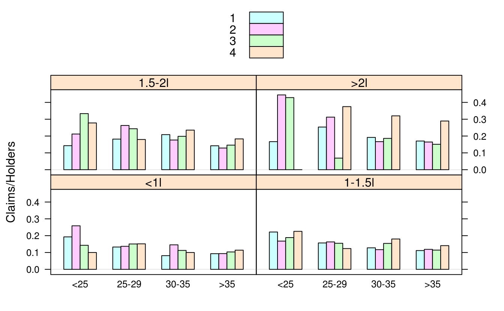
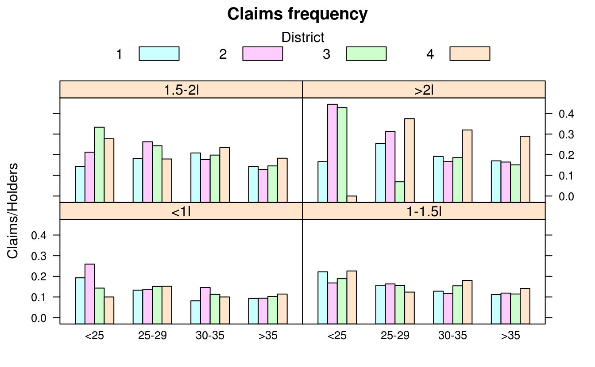
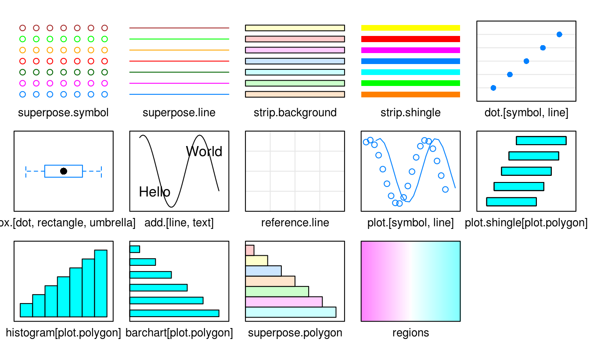
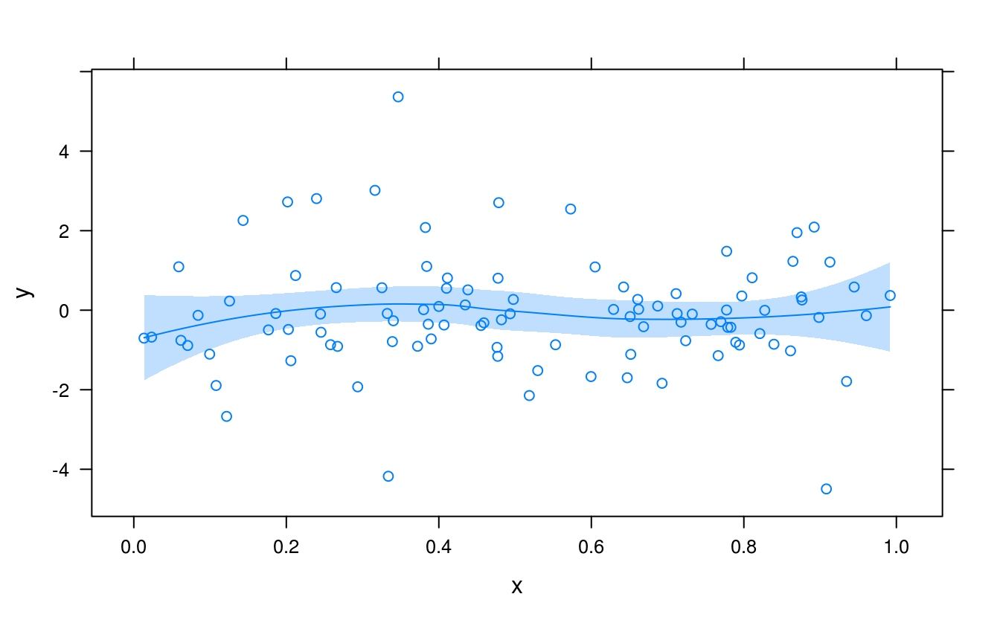
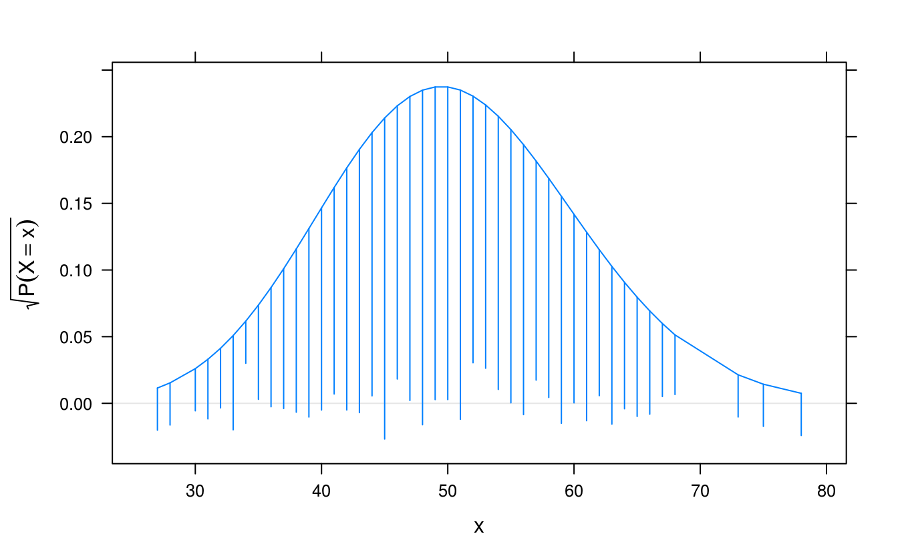
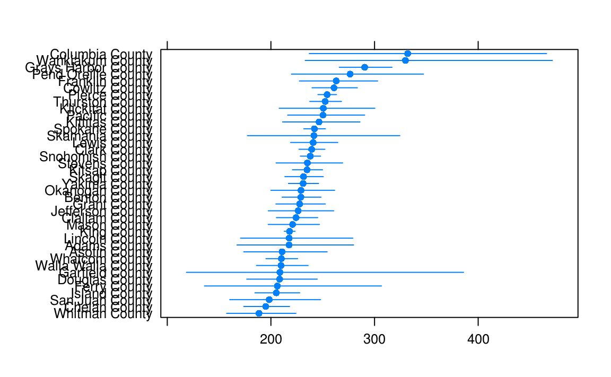
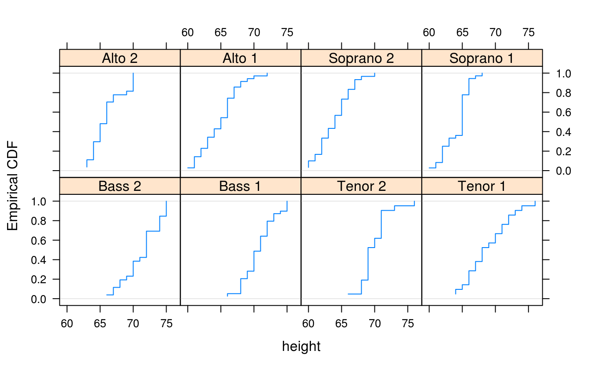
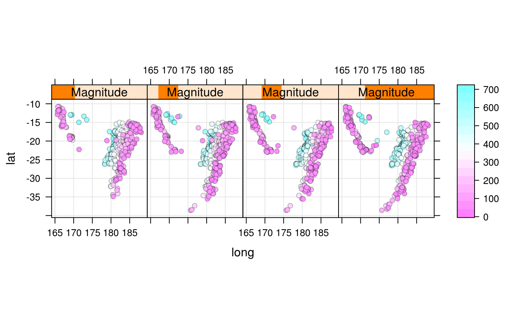

# Lattice 图形 {#chap:lattice}

> If you imagine that this pen is Trellis, then Lattice is not this pen.
>
>   --- Paul Murrell [^lattice-2001]

[^lattice-2001]:  Paul 在 DSC 2001 大会上的幻灯片 见<https://www.stat.auckland.ac.nz/~paul/Talks/dsc2001.pdf>

把网站搬出来，汉化 <http://latticeextra.r-forge.r-project.org/>


## 箱线图 {#sec:boxplot}


```r
library(lattice)
bwplot(voice.part ~ height, data = singer)
```


## 折线图 {#sec:line}

latticeExtra 包提供了强大的图层函数 `layer()`

多元时间序列


```r
library(RColorBrewer)
library(latticeExtra)
xyplot(EuStockMarkets) +
  layer(panel.scaleArrow(
    x = 0.99, append = " units", col = "grey", srt = 90, cex = 0.8
  ))
```


如何解释

时序图

Plot many time series in parallel


```r
horizonplot(EuStockMarkets,
  colorkey = TRUE,
  origin = 4000, horizonscale = 1000
) +
  layer(panel.scaleArrow(
    x = 0.99, digits = 1, col = "grey",
    srt = 90, cex = 0.7
  )) +
  layer(
    lim <- current.panel.limits(),
    panel.text(lim$x[1], lim$y[1], round(lim$y[1], 1),
      font = 2,
      cex = 0.7, adj = c(-0.5, -0.5), col = "#9FC8DC"
    )
  )
```


```r
# # https://stackoverflow.com/questions/25109196/r-lattice-package-add-legend-to-a-figure
library(lattice)
library(nlme)

plot(Orange,
  outer = ~1,
  key = list(
    space = "right", title = "Tree", cex.title = 1,
    lines = list(lty = 1, col = hcl.colors(5)),
    # points = list(pch = 1, col = hcl.colors(5)),
    text = list(c("3", "1", "5", "2", "4"))
  ),
  par.settings = list(
    # plot.line = list(col = hcl.colors(5), border = "transparent"),
    # plot.symbol = list(col = hcl.colors(5), border = "transparent"),
    strip.background = list(col = "white"),
    strip.border = list(col = "black")
  )
)
```




```r
library(MASS)
library(lattice)
## Plot the claims frequency against age group by engine size and district

barchart(Claims / Holders ~ Age | Group,
  groups = District,
  data = Insurance, origin = 0, auto.key = TRUE
)
```




```r
barchart(Claims / Holders ~ Age | Group,
  groups = District, data = Insurance,
  main = "Claims frequency",
  auto.key = list(space = "top", columns = 4, title = "District", cex.title = 1)
)
```




```r
# lattice 的设置
show.settings()
```


```r
myColours <- brewer.pal(6, "Blues")
my.settings <- list(
  superpose.polygon = list(col = myColours[2:5], border = "transparent"),
  strip.background = list(col = myColours[6]),
  strip.border = list(col = "black")
)

# 获取参数设置
trellis.par.get()

# 全局参数设置
trellis.par.set(my.settings)
```


```r
library(MASS)
library(lattice)

myColours <- hcl.colors(6)

barchart(Claims / Holders * 100 ~ Age | Group,
  groups = District, data = Insurance,
  origin = 0, main = "Motor insurance claims frequency",
  xlab = "Age", ylab = "Claims frequency %",
  scales = list(alternating = 1),
  auto.key = list(
    space = "top", columns = 4, points = FALSE, rectangles = TRUE,
    title = "District", cex.title = 1
  ),
  par.settings = list(
    superpose.polygon = list(col = myColours[2:5], border = "transparent"),
    strip.background = list(col = myColours[6]),
    strip.border = list(col = "black")
  ),
  par.strip.text = list(col = "white", font = 2),
  panel = function(x, y, ...) {
    panel.grid(h = -1, v = 0)
    panel.barchart(x, y, ...)
  }
)
```



## 平滑图 {#sec:smooth}


```r
set.seed(1)
xy <- data.frame(
  x = runif(100),
  y = rt(100, df = 5)
)

xyplot(y ~ x, xy, panel = function(...) {
  panel.xyplot(...)
  panel.smoother(..., span = 0.9)
})

library(splines)
xyplot(y ~ x, xy) +
  layer(panel.smoother(y ~ ns(x, 5), method = "lm"))

library(nlme)
library(mgcv)
xyplot(y ~ x, xy) +
  layer(panel.smoother(y ~ s(x), method = "gam"))
```



Trellis Displays of Tukey's Hanging Rootograms


```r
x <- rpois(1000, lambda = 50)
rootogram(~x, dfun = function(x) dpois(x, lambda = 50))
```



## 点图 {#sec:dotplot}


```r
# 添加背景网格线作为参考线
segplot(reorder(factor(county), rate.male) ~ LCL95.male + UCL95.male,
  data = subset(USCancerRates, state == "Washington"),
  draw.bands = FALSE, centers = rate.male
)
```



## 阶梯图 {#sec:step}

经验累积分布图


```r
ecdfplot(~height | voice.part, data = singer)
```



## 分面图 {#sec:facet}


```r
## a variant of Figure 5.6 from Sarkar (2008)
## http://lmdvr.r-forge.r-project.org/figures/figures.html?chapter=05;figure=05_06

depth.ord <- rev(order(quakes$depth))
quakes$Magnitude <- equal.count(quakes$mag, 4)
quakes.ordered <- quakes[depth.ord, ]

levelplot(depth ~ long + lat | Magnitude, data = quakes.ordered,
         panel = panel.levelplot.points, type = c("p", "g"),
         aspect = "iso", prepanel = prepanel.default.xyplot)
```


## 等高线图 {#sec:contour}


```r
set.seed(1)
xyz <- data.frame(x = rnorm(100), y = rnorm(100))
xyz$z <- with(xyz, x * y + rnorm(100, sd = 1))

## GAM smoother with smoothness by cross validation
library(mgcv)
levelplot(z ~ x * y, xyz,
  panel = panel.2dsmoother,
  form = z ~ s(x, y), method = "gam"
)
```


## 地图 {#sub:map}


```r
library(maps)
library(mapproj)
# 找一个新的 map 包含夏威夷和阿拉斯加
## Note: Alaska, Hawaii and others are not included in county map;
## this generates warnings with both USCancerRates and ancestry.
data(USCancerRates)
mapplot(rownames(USCancerRates) ~ log(rate.male) + log(rate.female),
        data = USCancerRates,
        map = map("county", plot = FALSE, fill = TRUE,
                  projection = "mercator"))
```


## 聚类图 {#sub:cluster}


```r
xyplot(Sepal.Length ~ Petal.Length,
  groups = Species,
  data = iris, scales = "free",
  par.settings = list(
    superpose.symbol = list(pch = c(15:17)),
    superpose.line = list(lwd = 2, lty = 1:3)
  ),
  panel = function(x, y, ...) {
    panel.xyplot(x, y, ...)
    panel.ellipse(x, y, ...)
  },
  auto.key = list(x = .1, y = .8, corner = c(0, 0))
)
```


## 运行环境 {#sec:lattice-sessioninfo}


```r
sessionInfo()
#> R Under development (unstable) (2019-12-29 r77627)
#> Platform: x86_64-pc-linux-gnu (64-bit)
#> Running under: Ubuntu 16.04.6 LTS
#> 
#> Matrix products: default
#> BLAS:   /home/travis/R-bin/lib/R/lib/libRblas.so
#> LAPACK: /home/travis/R-bin/lib/R/lib/libRlapack.so
#> 
#> locale:
#>  [1] LC_CTYPE=en_US.UTF-8       LC_NUMERIC=C              
#>  [3] LC_TIME=en_US.UTF-8        LC_COLLATE=en_US.UTF-8    
#>  [5] LC_MONETARY=en_US.UTF-8    LC_MESSAGES=en_US.UTF-8   
#>  [7] LC_PAPER=en_US.UTF-8       LC_NAME=C                 
#>  [9] LC_ADDRESS=C               LC_TELEPHONE=C            
#> [11] LC_MEASUREMENT=en_US.UTF-8 LC_IDENTIFICATION=C       
#> 
#> attached base packages:
#> [1] splines   stats     graphics  grDevices utils     datasets  methods  
#> [8] base     
#> 
#> other attached packages:
#> [1] mapproj_1.2.6       maps_3.3.0          mgcv_1.8-31        
#> [4] MASS_7.3-51.5       nlme_3.1-143        latticeExtra_0.6-29
#> [7] RColorBrewer_1.1-2  lattice_0.20-38    
#> 
#> loaded via a namespace (and not attached):
#>  [1] Rcpp_1.0.3      knitr_1.26      magrittr_1.5    jpeg_0.1-8.1   
#>  [5] rlang_0.4.2     stringr_1.4.0   tools_4.0.0     grid_4.0.0     
#>  [9] xfun_0.11       png_0.1-7       htmltools_0.4.0 yaml_2.2.0     
#> [13] digest_0.6.23   bookdown_0.16   Matrix_1.2-18   curl_4.3       
#> [17] evaluate_0.14   rmarkdown_2.0   stringi_1.4.3   compiler_4.0.0
```

