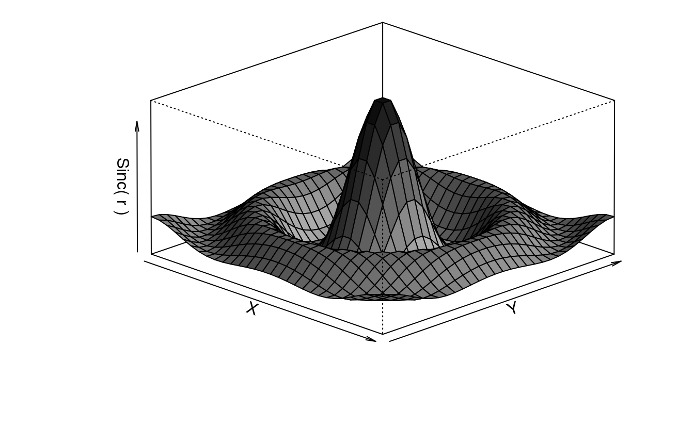
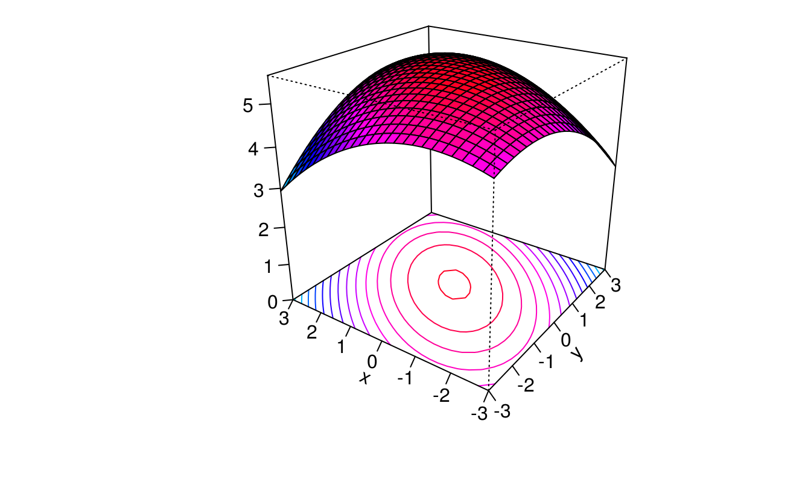
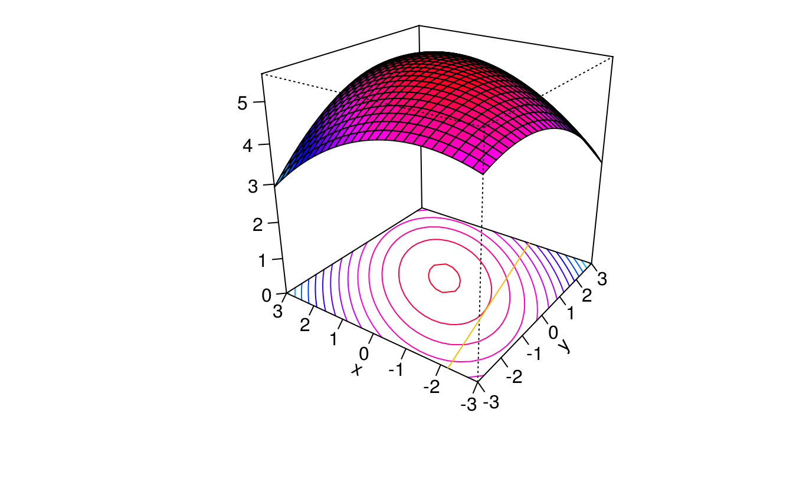
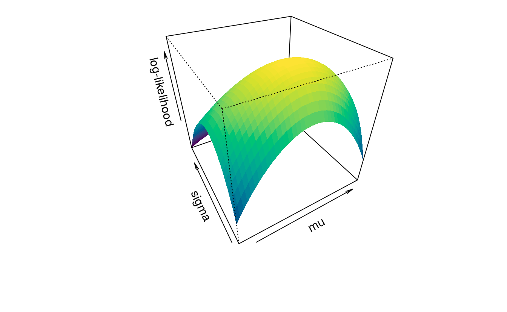
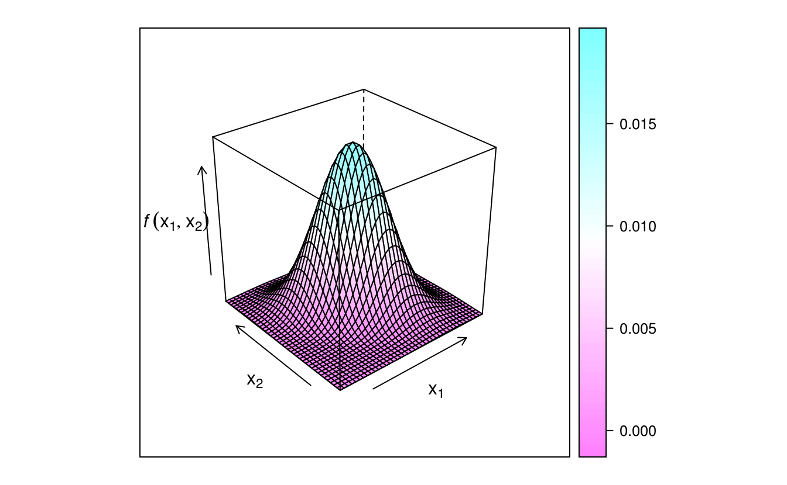
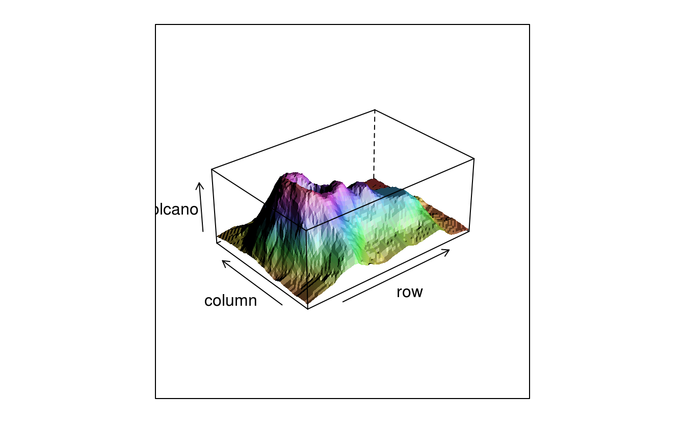
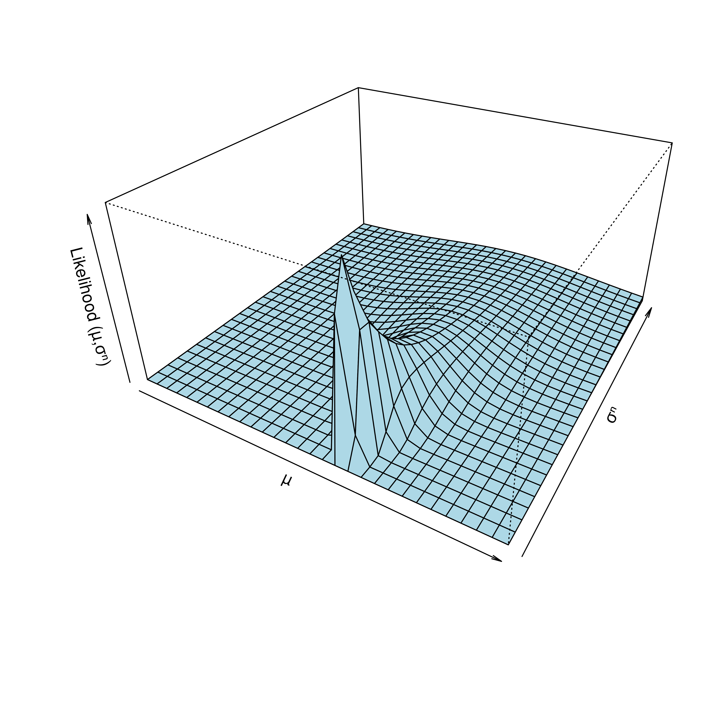
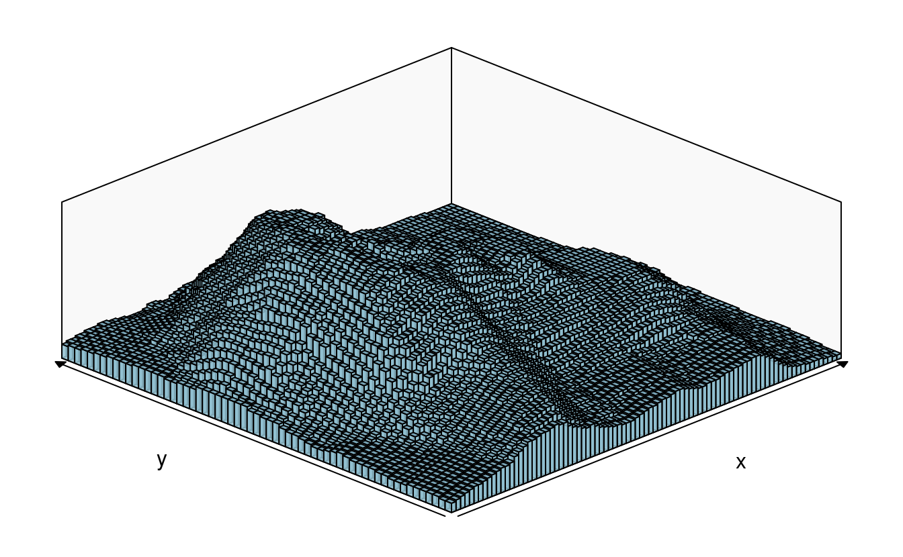
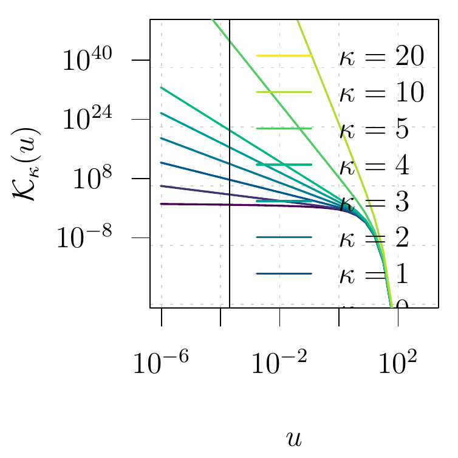
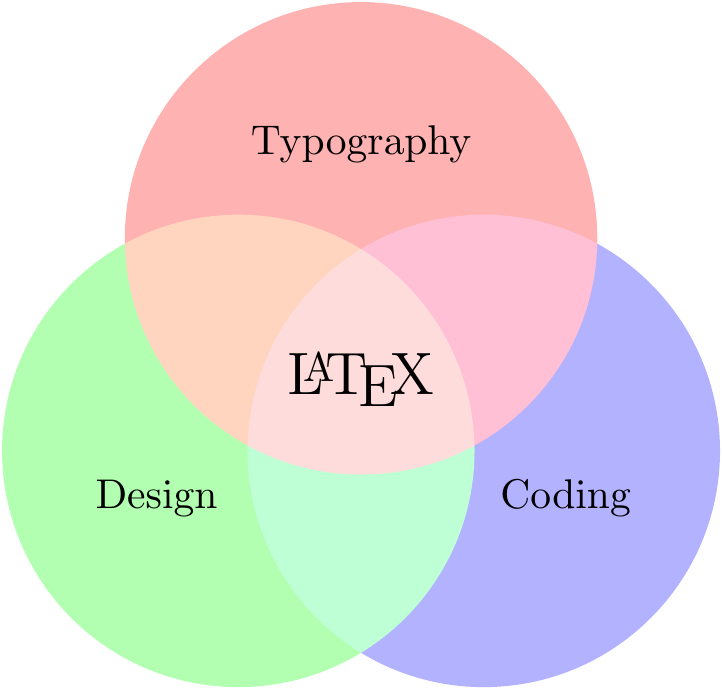

# 三维可视化 {#plot-3d}

画图 graphics 使用基础 R 包和基于基础包的扩展包绘图 **plotrix** [@Plotrix_2006_Lemon]， **plotrix** 饼图 pie3D  **scatterplot3d** 三维图形 **plot3D** 三维图形 **barsurf** 三维条形图、曲面图


```r
library(barsurf)
#> 
#> Attaching package: 'barsurf'
#> The following object is masked from 'package:grDevices':
#> 
#>     rgb2hsv
library(plotrix)
library(scatterplot3d)
library(plot3D)
library(MBA)
```

## 饼图 {#pie-3d}

## 柱形图 {#bar-3d}

## 散点图 {#scatter-3d}

## 函数图 {#curve-3d}

## 透视图 {#persp-3d}


```r
x <- seq(-10, 10, length = 30)
y <- x
f <- function(x, y) {
  r <- sqrt(x^2 + y^2)
  10 * sin(r) / r
}
z <- outer(x, y, f)
z[is.na(z)] <- 1
op <- par(bg = "white")
nrz <- nrow(z)
ncz <- ncol(z)
jet.colors <- colorRampPalette(c("gray80", "gray10"))
nbcol <- 100
color <- jet.colors(nbcol)
zfacet <- z[-1, -1] + z[-1, -ncz] + z[-nrz, -1] + z[-nrz, -ncz]
facetcol <- cut(zfacet, nbcol)

persp(x, y, z,
  theta = 30, phi = 30,
  expand = 0.5, col = color[facetcol]
)
```


```r
persp(x, y, z, xaxs = "i", expand = 0.5, phi = 20, theta = 60, col = color[facetcol])
```


```r
persp(x, y, z,
  theta = 45, phi = 20,
  expand = 0.5, col = color[facetcol],
  r = 180,
  ltheta = 120,
  shade = 0.75,
  # ticktype = "detailed", # 坐标轴上刻度数字
  # box=FALSE, # 长方体框线
  # nticks=6, # 刻度间隔数目
  xlab = "X", ylab = "Y", zlab = "Sinc( r )"
  # border=30
)
```



`theta`参数给出了主要方向，控制三维图的左右，`phi`给出纬度，`expand` 控制三维图的立体性

安装 rsm 包，添加拟合曲线，响应面曲线


```r
x <- seq(-3, 3, by = 0.25)
y <- seq(-3, 3, by = 0.25)
d <- expand.grid(x = x, y = y)
z <- c(data = NA, 1089)
b0 <- 5.628
b1 <- 0
b2 <- 0
b3 <- -.1
b4 <- .1
b5 <- -.1
k <- 1
for (i in 1:25) {
  for (j in 1:25) {
    z[k] <- b0 + b1 * x[i] + b2 * y[j] + b3 * x[i] * x[i] + b4 * x[i] * y[j] + b5 * y[j] * y[j]
    k <- k + 1
  }
}
library(rsm)
data.lm <- lm(z ~ poly(x, y, degree = 2), data = d)
persp(data.lm, x ~ y,
  zlim = c(0, max(z)),
  contour = list(z = "bottom", col = "colors"), theta = -55, phi = 25
)
```




```r
res1 <- persp(data.lm, x ~ y,
  zlim = c(0, max(z)),
  contour = list(z = "bottom", col = "colors"), theta = -55, phi = 25
)
xy <- matrix(c((-3 - 8) / 5, -3, (3 - 8) / 5, 3), ncol = 2, byrow = T)
lines(trans3d(xy[, 2], xy[, 1], 0, pmat = res1$`y ~ x`$transf), col = 3)
```




单个总体的最大似然估计，生成总体服从指数分布的随机数


```r
set.seed(1234)
n <- 20 # 随机数的个数
x <- rexp(n, rate = 5)
m <- 40 # 网格数
mv <- seq(mean(x) - 1.5 * sd(x) / sqrt(n),
  mean(x) + 1.5 * sd(x) / sqrt(n),
  length.out = m
) # mu 均值范围
sv <- seq(0.8 * sd(x), 1.5 * sd(x), length.out = m) # 标准差的范围
z <- matrix(NA, m, m)
loglikelihood <- function(b) {
  -sum(dnorm(x, b[1], b[2], log = TRUE))
}

for (i in 1:m) {
  for (j in 1:m) {
    z[i, j] <- -loglikelihood(c(mv[i], sv[j]))
  }
}

nbcol <- 100
color <- hcl.colors(nbcol)
zfacet <- z[-1, -1] + z[-1, -m] + z[-m, -1] + z[-m, -m]
facetcol <- cut(zfacet, nbcol)
# "\n" adds one line before the label
persp(mv, sv, z,
  xlab = "\n mu", ylab = "\n sigma", zlab = "\n log-likelihood",
  phi = 35, theta = -30, col = color[facetcol], border = NA
)
```




第一个例子来自 Eric Lecoutre 的图库^[<http://www.ejwagenmakers.com/misc/Plotting_3d_in_R.pdf>]，这是我见过的图形中含有巨量公式，并且用 R 实现的例子。在他的基础上我修改了颜色，设置图片尺寸，基于 persp 实现的透视图，唯一不足的是 persp 不支持表达式形式的坐标轴标签。


```r
library(latex2exp)
# 代码来自  http://www.ejwagenmakers.com/misc/Plotting_3d_in_R.pdf
mu1 <- 0 # setting the expected value of x1
mu2 <- 0 # setting the expected value of x2
s11 <- 10 # setting the variance of x1
s12 <- 15 # setting the covariance between x1 and x2
s22 <- 10 # setting the variance of x2
rho <- 0.5 # setting the correlation coefficient between x1 and x2
x1 <- seq(-10, 10, length = 41) # generating the vector series x1
x2 <- x1 # copying x1 to x2
# setting up the function of the multivariate normal density
f <- function(x1, x2) {
  term1 <- 1 / (2 * pi * sqrt(s11 * s22 * (1 - rho^2)))
  term2 <- -1 / (2 * (1 - rho^2))
  term3 <- (x1 - mu1)^2 / s11
  term4 <- (x2 - mu2)^2 / s22
  term5 <- -2 * rho * ((x1 - mu1) * (x2 - mu2)) / (sqrt(s11) * sqrt(s22))
  term1 * exp(term2 * (term3 + term4 - term5))
}
z <- outer(x1, x2, f) # calculating the density values
nrz <- nrow(z)
ncz <- ncol(z)
nbcol <- 100
color <- hcl.colors(100)
# Compute the z-value at the facet centres
zfacet <- z[-1, -1] + z[-1, -ncz] + z[-nrz, -1] + z[-nrz, -ncz]
# Recode facet z-values into color indices
facetcol <- cut(zfacet, nbcol)

par(mar = c(4.1, 4.1, 4.5, 1.5), ps = 10)
persp(x1, x2, z,
  xlab = "\n x1",
  ylab = "\n x2",
  zlab = "\n\n f(x1,x2)",
  # xlab = TeX('$x_{1}$'), # latex2exp 其实是使用 LaTeX 语法将 LaTeX 公式翻译为 R 能接受的表达式形式
  # ylab = TeX('$x_{2}$'),
  # zlab = TeX('$f(x_{1},x_{2})$'),
  main = "Two dimensional Normal Distribution",
  col = color[facetcol], border = NA, theta = 30, phi = 20,
  r = 50, d = 0.1, expand = 0.5, ltheta = 90, lphi = 180,
  shade = 0.1, ticktype = "detailed", nticks = 5, box = TRUE
)
mtext(expression(list(
  mu[1] == 0, mu[2] == 0, sigma[11] == 10,
  sigma[22] == 10, sigma[12] == 15, rho == 0.5
)),
side = 3
)

mtext(expression(italic(f) ~ group("(", list(x[1], x[2]), ")") == frac(1, 2 ~ pi ~ sqrt(sigma[11] ~ sigma[22] ~ (1 - rho^2))) ~ exp ~
bgroup(
  "{",
  paste(
    -frac(1, 2(1 - rho^2)) * phantom(0),
    bgroup(
      "[",
      frac((x[1] ~ -~ mu[1])^2, sigma[11]) ~
      -~2 ~ rho ~ frac(x[1] ~ -~ mu[1], sqrt(sigma[11])) ~ frac(x[2] ~ -~ mu[2], sqrt(sigma[22])) ~
      +~ frac((x[2] ~ -~ mu[2])^2, sigma[22]),
      "]"
    )
  ),
  "}"
)), side = 1, line = 3)
```

<div class="figure" style="text-align: center">

<p class="caption">(\#fig:bivariate-normal-density-1)二元正态概率密度函数</p>
</div>

早在 2006 年的时候，Paul Murrell 就提出来一种解决方法^[<https://www.stat.auckland.ac.nz/~paul/Talks/fonts.pdf>]，可是比较复杂，后来谢大大接手了 [tikzDevice](https://github.com/daqana/tikzDevice) 包的开发，算是比较好的解决了这个问题，目前该 R 包由 Ralf Stubner 接手维护。


```r
# 代码来自  http://www.ejwagenmakers.com/misc/Plotting_3d_in_R.pdf
mu1 <- 0 # setting the expected value of x1
mu2 <- 0 # setting the expected value of x2
s11 <- 10 # setting the variance of x1
s12 <- 15 # setting the covariance between x1 and x2
s22 <- 10 # setting the variance of x2
rho <- 0.5 # setting the correlation coefficient between x1 and x2
x1 <- seq(-10, 10, length = 41) # generating the vector series x1
x2 <- x1 # copying x1 to x2
f <- function(x1, x2) {
  term1 <- 1 / (2 * pi * sqrt(s11 * s22 * (1 - rho^2)))
  term2 <- -1 / (2 * (1 - rho^2))
  term3 <- (x1 - mu1)^2 / s11
  term4 <- (x2 - mu2)^2 / s22
  term5 <- -2 * rho * ((x1 - mu1) * (x2 - mu2)) / (sqrt(s11) * sqrt(s22))
  term1 * exp(term2 * (term3 + term4 - term5))
} # setting up the function of the multivariate normal density
z <- outer(x1, x2, f) # calculating the density values
nrz <- nrow(z)
ncz <- ncol(z)
nbcol <- 100
color <- hcl.colors(100)
# Compute the z-value at the facet centres
zfacet <- z[-1, -1] + z[-1, -ncz] + z[-nrz, -1] + z[-nrz, -ncz]
# Recode facet z-values into color indices
facetcol <- cut(zfacet, nbcol)
par(mar = c(4.1, 4.1, 4.5, 1.5))
persp(x1, x2, z,
  xlab = "$x_{1}$",
  ylab = "$x_{2}$",
  zlab = "$f(x_{1},x_{2})$",
  main = "Two dimensional Normal Distribution",
  col = color[facetcol], border = NA, theta = 30, phi = 20,
  r = 50, d = 0.1, expand = 0.5, ltheta = 90, lphi = 180,
  shade = 0.1, ticktype = "detailed", nticks = 5, box = TRUE
)
mtext("$\\mu_1 = 0,\\mu_2 = 0,\\sigma_{11} = 10,\\sigma_{22} = 10,\\sigma_{12} = 15, \\rho = 0.5$", side = 3)
mtext("$f(x_{1},x_{2}) = \\frac{1}{2\\pi\\sqrt{\\sigma_{11}\\sigma_{22}(1-\\rho^2)}}\\exp\\big\\{-\\frac{1}{2(1-\\rho^2)}[\\frac{(x_1 - \\mu_1)^2}{\\sigma_{11}} - 2\\rho\\frac{(x_1 - \\mu_1)(x_2 - \\mu_2)}{\\sqrt{\\sigma_{11}}\\sqrt{\\sigma_{22}}} + \\frac{(x_2 - \\mu_2)^2}{\\sigma_{22}}]\\big\\}$",
  side = 1, line = 2, cex = 1.5
)
```

<div class="figure" style="text-align: center">

<p class="caption">(\#fig:bivariate-normal-density-2)二元正态密度函数</p>
</div>


```r
library(lattice)
wireframe(z ~ x1 + x2,
  data = data.frame(x1 = x1, x2 = rep(x2, each = length(x1)), z = z),
  xlab = expression(x[1]), ylab = expression(x[2]),
  zlab = expression(italic(f) ~ group("(", list(x[1], x[2]), ")")),
  colorkey = TRUE, drape = TRUE
)
```

<div class="figure" style="text-align: center">

<p class="caption">(\#fig:unnamed-chunk-8)表达式二元密度函数</p>
</div>


```r
## volcano  ## 87 x 61 matrix
wireframe(volcano,
  shade = TRUE,
  aspect = c(61 / 87, 0.4),
  light.source = c(10, 0, 10)
)
```



希腊字母用 unicode 字符代替，不要使用 `pdf` 不然数学符号 $\sigma$ 不能正确渲染，推荐选择 `cairo_pdf`


```r
# https://stackoverflow.com/questions/41190525/adjust-margins-in-persp-persp3d-in-r
# https://stackoverflow.com/questions/37571376/how-to-customize-nticks-in-persp-r
# https://stackoverflow.com/questions/43507680/are-xlab-ylab-and-zlab-in-persp-incompatible-with-bquote
x <- seq(-10, 10, len = 30)
y <- seq(0, 5, len = 30)
f <- function(x, y) {
  dnorm(2, x, y)
}
z <- outer(x, y, f)
persp(x, y, z,
  theta = 30, phi = 30, expand = 0.5, col = "lightblue",
  xlab = "\u03bc", ylab = "\u03c3\u207F",
  zlab = paste("Likelihood ", "(\u03bc,\u03c3\u207F)", sep = "")
)
```

<div class="figure" style="text-align: center">

<p class="caption">(\#fig:unicode-greek-letters)unicode 字符代替希腊字母</p>
</div>

透视图案例，插值 LIDAR 数据集包含 10123 组观测值，每组观测包含经度、维度和海拔三个分量, `mba.surf` 使用多水平 B-样条近似曲面


```r
library(MBA)
data(LIDAR) # 一小部分光探测和测距雷达数据，美国威斯康辛州森林景观

mba.int <- mba.surf(LIDAR, 300, 300, extend = TRUE)$xyz.est

image(mba.int, xaxs = "r", yaxs = "r")
# 透视图
persp(mba.int,
  theta = 90, phi = 20, col = "green3", scale = FALSE,
  ltheta = -120, shade = 0.75, expand = 10, border = NA, box = FALSE
)

z <- mba.int$z
nrz <- nrow(z)
ncz <- ncol(z)
nbcol <- 100
color <- hcl.colors(nbcol)
# Compute the z-value at the facet centres
zfacet <- z[-1, -1] + z[-1, -ncz] + z[-nrz, -1] + z[-nrz, -ncz]
# z 分量用颜色表示
facetcol <- cut(zfacet, nbcol)
# png(file="mba.png",res=300,width = 680,height = 680)
par(mar = rep(0, 4))
## 透视图
persp(mba.int,
  theta = 90, phi = 20, col = color[facetcol], scale = FALSE,
  ltheta = -120, shade = 0.75, expand = 20, border = NA, box = FALSE
)
# 热图
image(mba.int, xaxs = "r", yaxs = "r", col = gray(seq(1, 0, l = 101)))
```


```r
library(barsurf)
x <- y <- 1:4
f <- function(x, y) x^2 + y^2
z <- outer(x, y, f)
plot_bar(, , z)
```


```r
plot_bar(, , volcano)
plot_surface(, , volcano)
```




## TikZ 绘图 {#tikz}

> 用 Base R 绘制带有复杂数学公式的图形，tikzDevice 包结合 R Markdown 的使用，引入 LaTeX 绘图引擎 TikZ 主要是借助 LaTeX 对数学符号的强大支持，让R 语言绘制的图形上出现优美的复杂的数学符号表达式 

以 tikzDevice 绘图， `out.width='35%'` 设置一幅子图占页面的宽度，在 `_common.R` 设置页面宽度为 `out.width='70%'`，即全宽图占页面 70\% 的宽度。 `fig.asp=1` 设置子图的长宽比例为 1:1，即正方形。设置图片的宽度，默认是 `fig.width = 6` 相应地，图片的高度是 `fig.height = fig.width * fig.asp = 6 * 0.618 = 3.708` 但是这个比例使得图片上的字很小，所以设置`fig.width=2.5`。设置图形设备 `dev='tikz'`，此时会自动调用 tikzDevice 包处理图上的数学公式，tikzDevice 包将 LaTeX 中的 TikZ 绘图引擎引入到基础 R 绘图中，由于该引擎将R代码块转化为 `.tex` 文件，接着调用 LaTeX 编译，默认生成 PDF 格式图片，因此设置 `tikz2png='-density 300'` 调用 ImageMgick 的 `convert` 命令将 PDF 格式图片转化为 PNG 格式图片，转化前需要用 Ghostscript 读取该 PDF 文件，转化成功后，需要将该 PNG 格式文件路径返回，以插入到文档中。`bessel-function` 是给该图片的命名，这段代码生成两张图片，两个图片就分别叫做 `bessel-function-1.pdf` 和 `bessel-function-2.pdf`。在 LaTeX 里并排插入两个图片，需要在导言区加载 `subfig` 宏包。

knitr 提供 Tikz 图形的模版， `system.file('misc', 'tikz2pdf.tex', package = 'knitr')`，**tikzDevice** 包可以方便的把 R 代码转化为 tikz 代码，然后使用 LaTeX 引擎编译成 PDF 文档，特别地，它很好地支持了图里的数学公式


```r
library(tikzDevice)
tf <- file.path(getwd(), "demo-tikzDevice.tex")

tikz(tf, width = 6, height = 4, pointsize = 30, standAlone = TRUE)
# 绘图的代码，仅支持 Base R Graphics System
source(file = "code/chapter_03/matern.R")
dev.off()

tools::texi2dvi(tf, pdf = T)

system("rm demo-tikzDevice.tex *.log *.aux *.dvi")

system("convert -density 300 -trim demo-tikzDevice.pdf -quality 100 demo-tikzDevice.png")

system("mv demo-tikzDevice.* figures/")
# convert test.svg test.png
```

两个利用 tikzDevice 包的例子


```r
# 带有图标题
x <- rnorm(10)
y <- x + rnorm(5, sd = 0.25)
model <- lm(y ~ x)
rsq <- summary(model)$r.squared
rsq <- signif(rsq, 4)
plot(x, y, main = "Hello \\LaTeX!", xlab = "$x$", ylab = "$y$")
abline(model, col = "red")
mtext(paste("Linear model: $R^{2}=", rsq, "$"), line = 0.5)
legend("bottomright", legend = paste("$y = ", round(coef(model)[2], 3),
  "x +", round(coef(model)[1], 3), "$",
  sep = ""
), bty = "n")

plot(x, y, main = "Hello \\LaTeX!", xlab = "$x$", ylab = "$y$")
abline(model, col = "red")
mtext(paste("Linear model: $R^{2}=", rsq, "$"), line = 0.5)
legend("bottomright", legend = paste("$y = ", round(coef(model)[2], 3),
  "x +", round(coef(model)[1], 3), "$",
  sep = ""
), bty = "n")
```

<div class="figure" style="text-align: center">

<p class="caption">(\#fig:linear-model)线性回归模型</p>
</div>


```r
x0 <- 2^(-20:10)
nus <- c(0:5, 10, 20)
x <- seq(0, 4, length.out = 501)

plot(x0, x0^-8,
  frame.plot = TRUE, # 添加绘图框
  log = "xy", # x 和 y 轴都取对数尺度
  axes = FALSE, # 去掉坐标轴
  xlab = "$u$", ylab = "$\\mathcal{K}_{\\kappa}(u)$", # 设置坐标轴标签
  type = "n", # 清除绘图区域的内容
  ann = TRUE, # 添加标题 x和y轴标签
  panel.first = grid() # 添加背景参考线
)

axis(1,
  at = 10^seq(from = -8, to = 2, by = 2),
  labels = paste0("$\\mathsf{10^{", seq(from = -8, to = 2, by = 2), "}}$")
)
axis(2,
  at = 10^seq(from = -8, to = 56, by = 16),
  labels = paste0("$\\mathsf{10^{", seq(from = -8, to = 56, by = 16), "}}$"), las = 1
)

for (i in seq(length(nus))) {
  lines(x0, besselK(x0, nu = nus[i]), col = hcl.colors(9)[i], lwd = 2)
}
legend("topright",
  legend = paste0("$\\kappa=", rev(nus), "$"),
  col = hcl.colors(9, rev = T), lwd = 2, cex = 1
)

x <- seq(0, 4, length.out = 501)
x <- x[x > 0]
plot(x, x,
  frame.plot = TRUE,
  ylim = c(1e+0, 1e+20), log = "y",
  xlab = "$u$", type = "n", yaxt = "n",
  ylab = "$\\mathcal{K}_{\\kappa}(u)$", ann = TRUE, panel.first = grid()
)
axis(2,
  at = c(1e+0, 1e+05, 1e+10, 1e+15, 1e+20),
  labels = paste0("$\\mathsf{10^{", seq(from = 0, to = 20, by = 5), "}}$"), las = 1
)

for (i in seq(length(nus))) {
  lines(x, besselK(x, nu = nus[i]), col = hcl.colors(9)[i], lwd = 2)
}
legend("topright",
  legend = paste0("$\\kappa=", rev(nus), "$"),
  col = hcl.colors(9, rev = T), lwd = 2, cex = 1
)
```

<div class="figure" style="text-align: center">

<p class="caption">(\#fig:bessel)贝塞尔函数</p>
</div>


```tex
\begin{tikzpicture}
  \begin{scope}[blend group = soft light]
    \fill[red!30!white]   ( 90:1.2) circle (2);
    \fill[green!30!white] (210:1.2) circle (2);
    \fill[blue!30!white]  (330:1.2) circle (2);
  \end{scope}
  \node at ( 90:2)    {Typography};
  \node at ( 210:2)   {Design};
  \node at ( 330:2)   {Coding};
  \node [font=\Large] {\LaTeX};
\end{tikzpicture}
```


<div class="figure" style="text-align: center">

<p class="caption">(\#fig:tikz-venn)Venn 图</p>
</div>


## 图形导出 {#export-save}

图形导出的格式主要看面向的呈现方式，如插入 HTML 网页中，可选 png， svg， rgl 和 gif 格式，插入 LaTeX 文档中，可选 eps，ps，pdf 和 png 等格式 

保存绘制的图形，R 使用的图形渲染库的版本


```r
grSoftVersion()
#>                    cairo                  cairoFT                    pango 
#>                 "1.14.6"                       ""                 "1.38.1" 
#>                   libpng                     jpeg                  libtiff 
#>                 "1.2.54"                    "8.0" "LIBTIFF, Version 4.0.6"
```

当前 R 环境中支持的图形设备


```r
capabilities()
#>        jpeg         png        tiff       tcltk         X11        aqua 
#>        TRUE        TRUE        TRUE        TRUE        TRUE       FALSE 
#>    http/ftp     sockets      libxml        fifo      cledit       iconv 
#>        TRUE        TRUE        TRUE        TRUE       FALSE        TRUE 
#>         NLS     profmem       cairo         ICU long.double     libcurl 
#>        TRUE        TRUE        TRUE        TRUE        TRUE        TRUE
```

Table: (\#tab:graphics-devices) 图形设备列表

| 设备       | 函数                  |
| :--------- | :-------------------- |
| windows    | cairo\_pdf, cairo\_ps |
| pdf        | svg                   |
| postscript | png                   |
| xfig       | jpeg                  |
| bitmap     | bmp                   |
| pictex     | tiff                  |

图形设备控制函数


```r
apropos("dev.")
#>  [1] ".Device"             ".Devices"            "dev.capabilities"   
#>  [4] "dev.capture"         "dev.control"         "dev.copy"           
#>  [7] "dev.copy2eps"        "dev.copy2pdf"        "dev.cur"            
#> [10] "dev.flush"           "dev.hold"            "dev.interactive"    
#> [13] "dev.list"            "dev.new"             "dev.next"           
#> [16] "dev.off"             "dev.prev"            "dev.print"          
#> [19] "dev.set"             "dev.size"            "dev2bitmap"         
#> [22] "devAskNewPage"       "deviance"            "deviceIsInteractive"
#> [25] "trellis.device"
```

导入导出 SVG 格式矢量图形

[The Butterfly Affectation: A case study in embedding an external image in an R plot](https://www.stat.auckland.ac.nz/~paul/Reports/grImport/butterfly/butterfly.html)

[Improved Importing of Vector Graphics in R](https://sjp.co.nz/projects/grimport2/grImport2.html)

## 软件信息 {#plot3d-sessionInfo}


```r
sessionInfo()
#> R version 4.0.0 (2020-04-24)
#> Platform: x86_64-pc-linux-gnu (64-bit)
#> Running under: Ubuntu 16.04.6 LTS
#> 
#> Matrix products: default
#> BLAS:   /home/travis/R-bin/lib/R/lib/libRblas.so
#> LAPACK: /home/travis/R-bin/lib/R/lib/libRlapack.so
#> 
#> locale:
#>  [1] LC_CTYPE=en_US.UTF-8       LC_NUMERIC=C              
#>  [3] LC_TIME=en_US.UTF-8        LC_COLLATE=C              
#>  [5] LC_MONETARY=en_US.UTF-8    LC_MESSAGES=en_US.UTF-8   
#>  [7] LC_PAPER=en_US.UTF-8       LC_NAME=C                 
#>  [9] LC_ADDRESS=C               LC_TELEPHONE=C            
#> [11] LC_MEASUREMENT=en_US.UTF-8 LC_IDENTIFICATION=C       
#> 
#> attached base packages:
#> [1] stats     graphics  grDevices utils     datasets  methods   base     
#> 
#> other attached packages:
#> [1] lattice_0.20-41      latex2exp_0.4.0      rsm_2.10            
#> [4] MBA_0.0-9            plot3D_1.3           scatterplot3d_0.3-41
#> [7] plotrix_3.7-8        barsurf_0.5.0       
#> 
#> loaded via a namespace (and not attached):
#>  [1] Rcpp_1.0.5          knitr_1.29          magrittr_1.5       
#>  [4] misc3d_0.8-4        colorspace_1.4-1    rlang_0.4.6        
#>  [7] filehash_2.4-2      stringr_1.4.0       highr_0.8          
#> [10] pdftools_2.3.1      tools_4.0.0         grid_4.0.0         
#> [13] tikzDevice_0.12.3.1 xfun_0.15           tinytex_0.24       
#> [16] askpass_1.1         htmltools_0.5.0     kubik_0.2.0        
#> [19] yaml_2.2.1          digest_0.6.25       qpdf_1.1           
#> [22] bookdown_0.20       codetools_0.2-16    curl_4.3           
#> [25] evaluate_0.14       rmarkdown_2.3       stringi_1.4.6      
#> [28] compiler_4.0.0      magick_2.4.0
```
