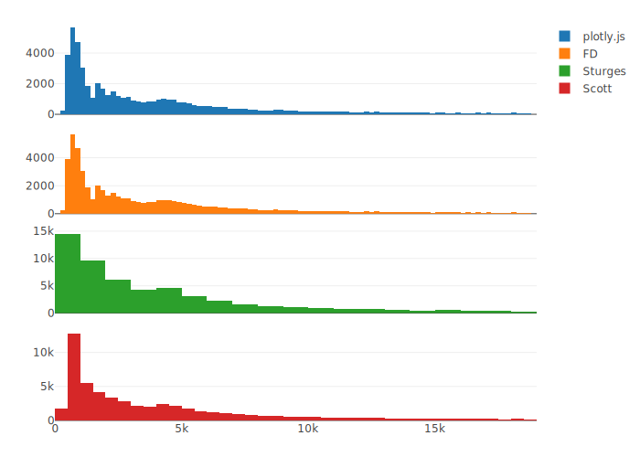

# 交互式图形 {#interactive-graphics}

## plotly

```r
library(plotly, warn.conflicts = FALSE, quietly = TRUE)
p1 <- plot_ly(diamonds, x = ~price) %>% add_histogram(name = "plotly.js")

price_hist <- function(method = "FD") {
  h <- hist(diamonds$price, breaks = method, plot = FALSE)
  plot_ly(x = h$mids, y = h$counts) %>% add_bars(name = method)
}

subplot(
  p1, price_hist(), price_hist("Sturges"),  price_hist("Scott"),
  nrows = 4, shareX = TRUE
)
```

Orca (Open-source Report Creator App) 软件针对 plotly.js 库渲染的图形具有很强的导出功能，[安装 Orca](https://github.com/plotly/orca#installation) 后，`plotly::orca` 函数可以将基于 htmlwidget 的 plotly 图形对象导出为高质量静态图片，支持导出 png、pdf 和 svg 等格式。

<div class="figure" style="text-align: center">

<p class="caption">(\#fig:bars-numeric)(ref:bars-numeric)</p>
</div>

(ref:bars-numeric) 直方图


## 饼图 {#sec:pie}


```r
library(ggplot2)
library(plotly)
#> 
#> Attaching package: 'plotly'
#> The following object is masked from 'package:ggplot2':
#> 
#>     last_plot
#> The following object is masked from 'package:stats':
#> 
#>     filter
#> The following object is masked from 'package:graphics':
#> 
#>     layout

USPersonalExpenditure <- data.frame("Categorie" = rownames(USPersonalExpenditure), USPersonalExpenditure)
data <- USPersonalExpenditure[, c("Categorie", "X1960")]

colors <- c("rgb(211,94,96)", "rgb(128,133,133)", "rgb(144,103,167)", "rgb(171,104,87)", "rgb(114,147,203)")

p <- plot_ly(data,
  labels = ~Categorie, values = ~X1960, type = "pie",
  textposition = "inside",
  textinfo = "label+percent",
  insidetextfont = list(color = "#FFFFFF"),
  hoverinfo = "text",
  text = ~ paste("$", X1960, " billions"),
  marker = list(
    colors = colors,
    line = list(color = "#FFFFFF", width = 1)
  ),
  # The 'pull' attribute can also be used to create space between the sectors
  showlegend = FALSE
) %>%
  layout(
    title = "United States Personal Expenditures by Categories in 1960",
    xaxis = list(showgrid = FALSE, zeroline = FALSE, showticklabels = FALSE),
    yaxis = list(showgrid = FALSE, zeroline = FALSE, showticklabels = FALSE)
  )

p
```

<!--html_preserve--><div id="htmlwidget-0eb6828b6c1154486afe" style="width:70%;height:1112.4px;" class="plotly html-widget"></div>
<script type="application/json" data-for="htmlwidget-0eb6828b6c1154486afe">{"x":{"visdat":{"49f040457e32":["function () ","plotlyVisDat"]},"cur_data":"49f040457e32","attrs":{"49f040457e32":{"labels":{},"values":{},"textposition":"inside","textinfo":"label+percent","insidetextfont":{"color":"#FFFFFF"},"hoverinfo":"text","text":{},"marker":{"colors":["rgb(211,94,96)","rgb(128,133,133)","rgb(144,103,167)","rgb(171,104,87)","rgb(114,147,203)"],"line":{"color":"#FFFFFF","width":1}},"showlegend":false,"alpha_stroke":1,"sizes":[10,100],"spans":[1,20],"type":"pie"}},"layout":{"margin":{"b":40,"l":60,"t":25,"r":10},"title":"United States Personal Expenditures by Categories in 1960","xaxis":{"showgrid":false,"zeroline":false,"showticklabels":false},"yaxis":{"showgrid":false,"zeroline":false,"showticklabels":false},"hovermode":"closest","showlegend":true},"source":"A","config":{"showSendToCloud":false},"data":[{"labels":["Food and Tobacco","Household Operation","Medical and Health","Personal Care","Private Education"],"values":[86.8,46.2,21.1,5.4,3.64],"textposition":["inside","inside","inside","inside","inside"],"textinfo":"label+percent","insidetextfont":{"color":"#FFFFFF"},"hoverinfo":["text","text","text","text","text"],"text":["$ 86.8  billions","$ 46.2  billions","$ 21.1  billions","$ 5.4  billions","$ 3.64  billions"],"marker":{"color":"rgba(31,119,180,1)","colors":["rgb(211,94,96)","rgb(128,133,133)","rgb(144,103,167)","rgb(171,104,87)","rgb(114,147,203)"],"line":{"color":"#FFFFFF","width":1}},"showlegend":false,"type":"pie","frame":null}],"highlight":{"on":"plotly_click","persistent":false,"dynamic":false,"selectize":false,"opacityDim":0.2,"selected":{"opacity":1},"debounce":0},"shinyEvents":["plotly_hover","plotly_click","plotly_selected","plotly_relayout","plotly_brushed","plotly_brushing","plotly_clickannotation","plotly_doubleclick","plotly_deselect","plotly_afterplot","plotly_sunburstclick"],"base_url":"https://plot.ly"},"evals":[],"jsHooks":[]}</script><!--/html_preserve-->

