# 动态性文档 {#Dynamic-Documents}


<!-- 不要安装新的 R 包，以截图的方式辅助说明即可 -->


```python
import os
print(os.listdir())
#> ['Dockerfile', 'interactives', 'data-table.utf8.md', 'includes', 'files.md', 'Adobe-Fonts.zip', 'dc-string-manipulation.Rmd', 'data-parallel.md', 'dv-ggplot2.utf8.md', 'RGraphics.Rproj', 'render4aae341273f.rds', '_common.R', 'dc-string-manipulation.utf8.md', 'dv-ggplot2.Rmd', 'requirements.txt', 'data-tibble.Rmd', 'odbc.ini', 'dv-colors-fonts.Rmd', 'data-import.md', 'setup.Rmd', 'dv-plot.Rmd', 'data-objects.utf8.md', 'data-parallel.utf8.md', 'dc-stringr.Rmd', 'dv-highcharter.md', '.Rprofile', 'interactive-graphics.Rmd', '_bookdown_files', 'README.md', 'dv-plot_files', 'dv-plot3d.utf8.md', '_bookdown.yml', 'preface.md', 'dv-spatio-temporal.utf8.md', 'data-frame.utf8.md', 'files.utf8.md', 'dv-highcharter.Rmd', '99-references.Rmd', 'sidebar.lua', 'Makefile', 'docker-compose.yml', 'dc-regular-expressions.utf8.md', 'figures', '_book', 'refer.bib', 'dv-highcharter_files', 'data', 'DESCRIPTION', 'dc-regular-expressions.Rmd', 'cs-cran-network.Rmd', 'dv-highcharter.utf8.md', 'data-frame.Rmd', 'dc-regular-expressions.md', 'index.utf8.md', '.gitignore', 'style.css', '_render.R', 'ubuntu', 'dv-lattice.md', 'data-parallel.Rmd', 'files.Rmd', 'index.Rmd', 'dv-plot3d.md', '_build.sh', 'dv-lattice_files', 'setup.utf8.md', 'data-objects.Rmd', 'setup.md', 'index.md', 'dynamic-documents.Rmd', 'data-import.Rmd', 'data-tibble.utf8.md', 'dv-plot3d-tikzDictionary', 'dv-spatio-temporal.md', 'data-table.Rmd', 'dv-plot.md', 'animated-graphics.Rmd', '.travis.yml', '.git', 'data-objects.md', '_main.rds', 'dv-plot3d_files', 'dv-colors-fonts.utf8.md', 'dv-ggplot2_files', 'data-frame.md', 'dv-colors-fonts.md', 'preface.Rmd', 'dv-plot3d.Rmd', 'LICENSE', 'dv-lattice.Rmd', 'data-frame_files', 'dv-network.md', 'dv-network.utf8.md', 'preface.utf8.md', 'data-tibble.md', 'demos', 'data-import.utf8.md', 'dv-spatio-temporal.Rmd', 'data-table.md', 'dv-ggplot2.md', 'cumcm2011A.RDS', 'dc-string-manipulation.md', 'dv-lattice.utf8.md', 'preamble.tex', 'dv-network.Rmd', 'maintainer_author.rds', 'dv-colors-fonts_files', '_deploy.sh', '_output.yml', 'dv-plot.utf8.md', 'dv-spatio-temporal_files']
```

::: rmdnote
R Markdown 文档[@xie2018rmarkdown] 中的 Python 代码块是由 knitr 包 [@xie_2015_knitr] 负责调度处理的，展示 Matplotlib 绘图的结果使用了 reticulate 包 [@R-reticulate] 提供的 Python 引擎而不是 knitr 自带的。
:::

- LaTeX 专家黄晨成写的译文 [Matplotlib 教程](https://liam.page/2014/09/11/matplotlib-tutorial-zh-cn/)
- [周沫凡](https://morvanzhou.github.io/) 制作的莫烦 Python 系列视频教程之 [Matplotlib 数据可视化神器](https://morvanzhou.github.io/tutorials/data-manipulation/plt/)
- 陈治兵维护的在线 [Matplotlib 中文文档](https://www.matplotlib.org.cn/)

编译书籍使用的 Python 3 模块有


```bash
pip3 list --format=columns
```


Package              Version   
-------------------- ----------
absl-py              0.9.0     
astor                0.8.1     
cachetools           4.0.0     
certifi              2019.11.28
chardet              3.0.4     
cycler               0.10.0    
gast                 0.2.2     
google-auth          1.11.2    
google-auth-oauthlib 0.4.1     
google-pasta         0.1.8     
grpcio               1.27.2    
h5py                 2.10.0    
idna                 2.9       
Keras-Applications   1.0.8     
Keras-Preprocessing  1.1.0     
kiwisolver           1.1.0     
Markdown             3.2.1     
matplotlib           3.0.3     
numpy                1.16.4    
oauthlib             3.1.0     
opt-einsum           3.2.0     
pandas               0.24.2    
pip                  20.0.2    
protobuf             3.11.3    
pyasn1               0.4.8     
pyasn1-modules       0.2.8     
pyparsing            2.4.6     
python-dateutil      2.8.1     
pytz                 2019.3    
requests             2.23.0    
requests-oauthlib    1.3.0     
rsa                  4.0       
scipy                1.4.1     
setuptools           45.2.0    
six                  1.14.0    
tensorboard          2.1.1     
tensorflow           2.1.0     
tensorflow-estimator 2.1.0     
termcolor            1.1.0     
urllib3              1.25.8    
Werkzeug             1.0.0     
wheel                0.34.2    
wrapt                1.12.0    

::: rmdtip
在 `knitr::opts_chunk` 中设置 `python.reticulate = TRUE` 意味着所有的 Python 代码块共享一个 Python Session，而 `python.reticulate = FALSE` 意味着使用 knitr 提供的 Python 引擎，所有的 Python 代码块独立运行。

`python.reticulate = TRUE` 会使用 reticulate 提供的 Python 引擎，它支持 matplotlib 绘图，但是不支持图 caption，knitr 的 python 引擎是支持 caption 的

R 和 Python 之间的交互，Python 负责数据处理和建模， R 负责绘图，有些复杂的机器学习模型及其相关数据操作需要在 Python 中完成，数据集清理至数据框的形式后导入到 R 中，画各种静态或者动态图，这时候需要加载 reticulate 包，只是设置 `python.reticulate = TRUE` 还不够
:::

## R 调用 Python {#r-call-python .unnumbered}

pandas 读取数据，整理后由 reticulate 包传递给 R 环境中的 data.frame 对象，加载 ggplot2 绘图


```python
import pandas as pd
iris2 = pd.read_csv('iris.csv')
```


```r
library(reticulate)
library(ggplot2)
ggplot(py$iris2, aes(x = Sepal.Length, y = Sepal.Width)) +
  geom_point(aes(color = Species)) +
  scale_color_viridis_d()
```

<div class="figure" style="text-align: center">
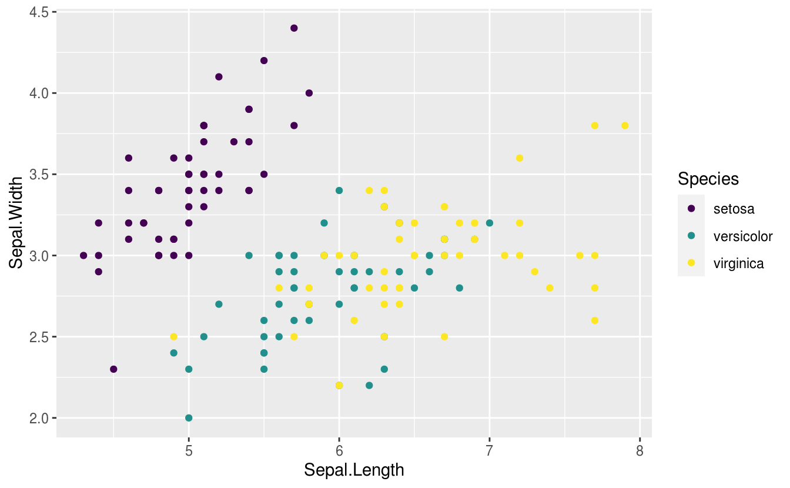
<p class="caption">(\#fig:reti-plot)散点图</p>
</div>


```r
library(ggplot2)
ggplot(faithfuld, aes(waiting, eruptions)) +
  geom_raster(aes(fill = density)) +
  scale_fill_continuous()
```

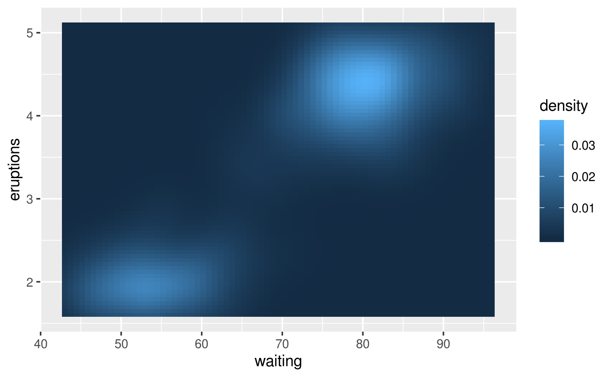

如图 \@ref(fig:demo) 所示


```python
import matplotlib.pyplot as plt
plt.switch_backend('agg')
import numpy as np
n = 1024    # data size
X = np.random.normal(0, 1, n)
Y = np.random.normal(0, 1, n)
T = np.arctan2(Y,X) # for color value
plt.scatter(X, Y, s=75, c=T, alpha=.5)
plt.xlim(-1.5, 1.5)
#> (-1.5, 1.5)
plt.ylim(-1.5, 1.5)
#> (-1.5, 1.5)
plt.show()
```


[^r-blogdown]: 有些内容也会放在我的博客上 <https://r-bloggers.netlify.com/>，博客使用 blogdown 包 [@xie2017blogdown] 搭建的


::: sidebar
- Pandoc 对 Markdown 语法的扩充
- R Markdown 加持
- 可重复数据分析 Rmd
- dashboard 面板
- Shiny 文档
- 写书
- 写博客
- 写幻灯片
:::


> shiny 

- [Mastering Shiny](https://jcheng5.github.io/shiny-book/)
- [Shiny Server Professional Administrator's Guide](https://docs.rstudio.com/shiny-server/)
- [Learn Shiny](https://shiny.rstudio.com/tutorial/)
- [rstudio::conf 2018](https://github.com/simecek/RStudioConf2018Slides)

> 三剑客 Markdown & Pandoc's Markdown & R Markdown
> [Markdown for scientific writing](https://github.com/scholmd/scholmd/wiki)

首先介绍 Markdown 在强调、标题、列表、断行、链接、图片、引用、代码块、LaTeX 公式等使用方式，然后在 Markdown 的基础上介绍 Pandoc's Markdown 功能有加强的地方，R Markdown 在 Pandoc's Markdown 的基础上介绍功能有加强的地方

## Markdown {#markdown}

Markdown 基础语法见 RStudio IDE 自带的 Markdown 手册：RStudio 顶部菜单栏 -> Help -> Markdown Quick Reference，这里主要介绍一下Markdown 高级语法，特别是 [Pandoc's Markdown](https://pandoc.org/MANUAL.html#pandocs-markdown)，其实是 Pandoc 提供了很多对 Markdown 的扩展支持，下面介绍一下被 Pandoc 加强后的 Markdown 表格、图片和公式的使用

### 列表 {#markdown-list}

- 有序的列表
  1. 第一条
  1. 第二条

- 无序的列表
  - 第一条
  - 第二条

  * here is my first
    list item.
  * and my second.

- 嵌套的列表

  1. 有序
  2. Item 2
  3. Item 3
      + Item 3a
      + Item 3b

  * 无序
  * Item 2
      + Item 2a
      + Item 2b

定义型列表中包含代码

Term 1

:   Definition 1

Term 2 with *inline markup*

:   Definition 2

        { some code, part of Definition 2 }

    Third paragraph of definition 2.

定义类型的列表，紧凑形式

Term 1
  ~ Definition 1

Term 2
  ~ Definition 2a
  ~ Definition 2b
  

无序列表

* fruits
  + apples
    - macintosh
    - red delicious
  + pears
  + peaches
* vegetables
  + broccoli
  + chard


对应  LaTeX 列表环境里的有序环境，通篇计数

(@)  My first example will be numbered (1).
(@)  My second example will be numbered (2).

Explanation of examples.

(@)  My third example will be numbered (3).

`(@)` 环境可以引用

(@good)  这是一个好例子

正如 (@good) 所指出的那样，


列表里包含代码块

-   item one
-   item two

<!-- end of list -->

    { my code block }

显示反引号 `` ` ``

### 强调 {#markdown-emphasis}

轻微强调 
:   这是倾斜的文字 _下划线表示强调_, and this is *星花表示强调*.

特别强调 
:   这是加粗的文字 **strong emphasis** and __with underscores__.

强烈强调
:   这是斜体加粗的文字 ***三个星花***

删除线 
:   This ~~is deleted text.~~

上下标 
:   H~2~O is a liquid.  2^10^ is 1024. C^137^ 是一种放射性元素


### 引用 {#markdown-quote}

注意在引用末尾空两格，出处另起一行，引用名人名言:

> It's always better to give 
> than to receive.  

或者

> A Markdown-formatted document should be publishable as-is, as plain text, without looking like it’s been marked up with tags or formatting instructions.
>
> --- John Gruber

> Trellis graphics are a bit like hash functions: 
> you can be close to the target, but get a far-off result.[^lattice-panel]
>
> --- Dieter Menne

[^lattice-panel]: (about problems with creating a suitable lattice panel function) R-help (August 2008)

> If you imagine that this pen is Trellis, then Lattice is not this pen.[^lattice-pen]
>
> --- Paul Murrell

[^lattice-pen]: (on the difference of Lattice (which eventually was called grid) and Trellis) DSC 2001, Wien (March 2001)

> You're overlooking something like line 800 of the documentation for xyplot. [...] 
> It's probably in the R-FAQ as well, 
> since my original feeling was that this behaviour was chosen 
> in order to confuse people and see how many people read the FAQ... :) [^xyplot]
>
> --- Barry Rowlingson 

[^xyplot]: (about the fact that lattice objects have to be print()ed) R-help (May 2005)

### 表格 {#markdown-table}

插入表格很简单的，如表 \@ref(tab:insert-tab) 所示，还带脚注哦，复杂的表格制作可以借助 R 包 knitr 提供的 kable 函数以及 kableExtra 包^[<https://xiangyunhuang.github.io/bookdown-kableExtra/>]，此外谢益辉的书籍 [bookdown: Authoring Books and Technical Documents with R Markdown](https://bookdown.org/yihui/bookdown/) 中也有一节专门介绍表格 <https://bookdown.org/yihui/bookdown/tables.html>

Table: (\#tab:insert-tab) 表格标题^[附有脚注]

| First Header | Second Header |
| :----------- | :------------ |
| Content Cell | Content Cell  |
| Content Cell | Content Cell  |

`kable` 支持多个表格并排，如表 \@ref(tab:table-multi) 所示


```r
knitr::kable(
  list(
    head(iris[, 1:2], 3),
    head(mtcars[, 1:3], 5)
  ),
  caption = 'A Tale of Two Tables.', booktabs = TRUE
)
```


<table class="kable_wrapper">
<caption>(\#tab:table-multi)A Tale of Two Tables.</caption>
<tbody>
  <tr>
   <td> 

 Sepal.Length   Sepal.Width
-------------  ------------
          5.1           3.5
          4.9           3.0
          4.7           3.2

 </td>
   <td> 

                      mpg   cyl   disp
------------------  -----  ----  -----
Mazda RX4            21.0     6    160
Mazda RX4 Wag        21.0     6    160
Datsun 710           22.8     4    108
Hornet 4 Drive       21.4     6    258
Hornet Sportabout    18.7     8    360

 </td>
  </tr>
</tbody>
</table>

在表格中引入数学符号


```r
knitr::kable(
  rbind(c("", "continuous", "discrete"),
        c("nominal", "", "$\\checkmark$"),
        c("ordinal", "", "$\\checkmark$"),
        c("interval", "$\\checkmark$", "$\\checkmark$"),
        c("ratio", "$\\checkmark$", "$\\checkmark$")
    
  )
  , caption = 'The relationship between the scales of measurement and the discrete/continuity distinction. Cells with a tick mark correspond to things that are possible.', align="lcc",
  booktabs = TRUE
)
```


Table: (\#tab:scalescont)The relationship between the scales of measurement and the discrete/continuity distinction. Cells with a tick mark correspond to things that are possible.

---------  --------------  --------------
             continuous       discrete   
nominal                     $\checkmark$ 
ordinal                     $\checkmark$ 
interval    $\checkmark$    $\checkmark$ 
ratio       $\checkmark$    $\checkmark$ 
---------  --------------  --------------

[kableExtra](https://github.com/haozhu233/kableExtra) 、broom 和 [pixiedust](https://github.com/nutterb/pixiedust) 包实现表格样式的精细调整，如黄湘云制作的 [样例](https://xiangyunhuang.github.io/bookdown-kableExtra/) 


### 图片 {#image}

插入图片大体遵循的语法如下

```markdown
{...}
```

中括号包含图片的标题，小括号是图片插入路径，大括号控制图片属性 

利用 `knitr::include_graphics` 函数在代码块中插入图片是很简单的，如图\@ref(fig:knitr-footnote)所示，图、表的标题很长或者需要插入脚注，可以使用[文本引用][text-references]


```r
knitr::include_graphics(path = system.file("help/figures", "mai.png", package = "graphics"))
```

<div class="figure" style="text-align: center">

<p class="caption">(\#fig:knitr-footnote)(ref:footnote)</p>
</div>


```r
par(mar = c(4.1, 4.1, 0.5, 0.5))
plot(rnorm(10), xlab = "", ylab = "")
```

<div class="figure" style="text-align: center">
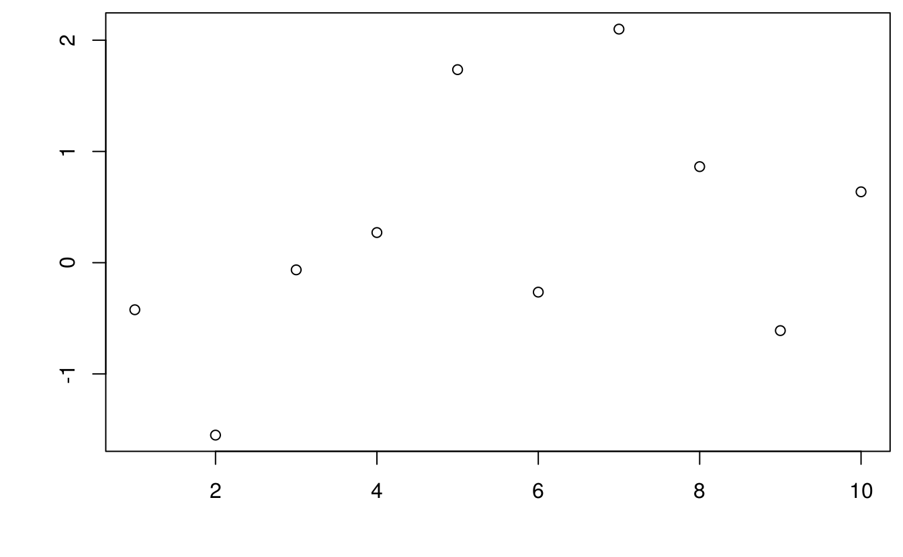
<p class="caption">(\#fig:unnamed-chunk-8)(ref:fig-cap)</p>
</div>

插入一幅普通图片，如图 \@ref(fig:left-fig) 和图 \@ref(fig:full-fig) 所示分别控制图片插入的宽度[^css-position]

```markdown
![(\#fig:left-fig) 默认图片位置居左^[这里是脚注]](figures/mai.png){ width=45% }
```

![(\#fig:left-fig) 默认图片位置居左^[这里是脚注]](figures/mai.png){ width=45% }

```markdown
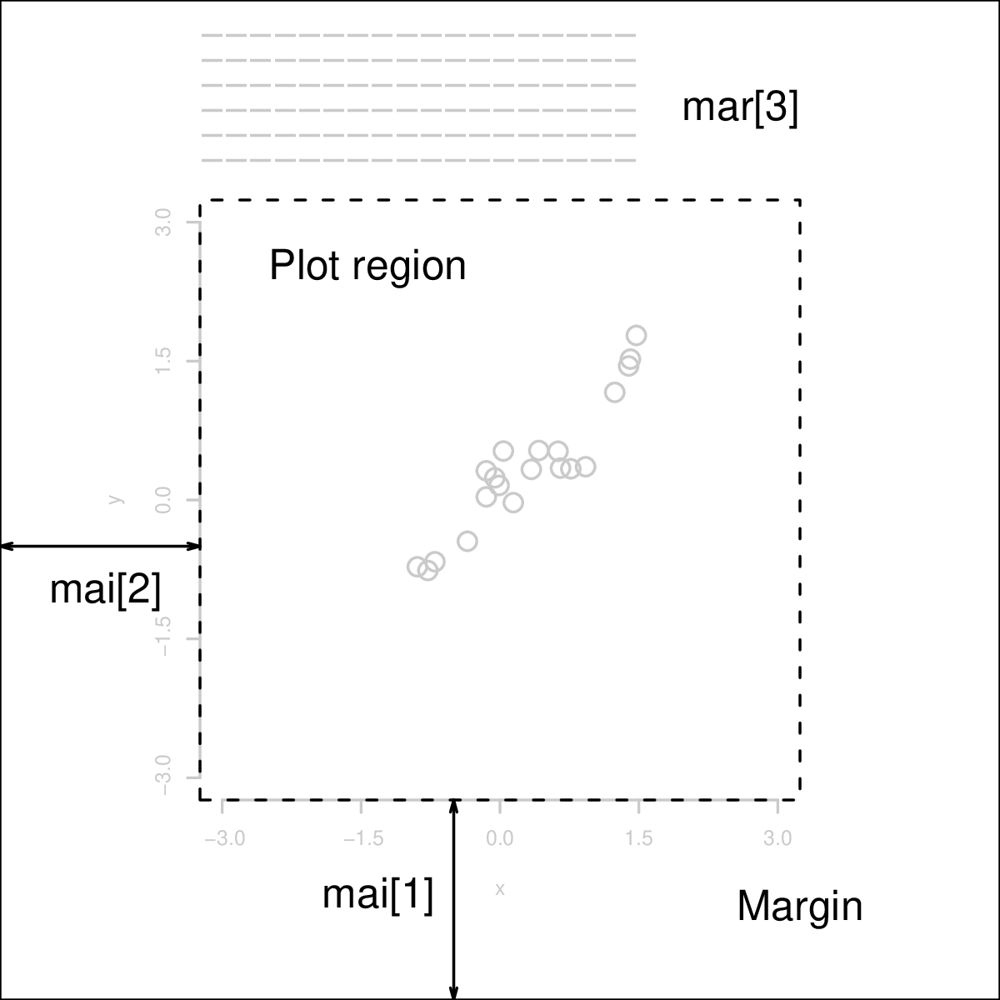{.full}
```

{.full}


-   One

-   Two

     { width=25% }

-   Three


根据代码动态生成图片，并插入文档中；外部图片插入文档中


```r
plot(AirPassengers)
```

<div class="figure" style="text-align: center">
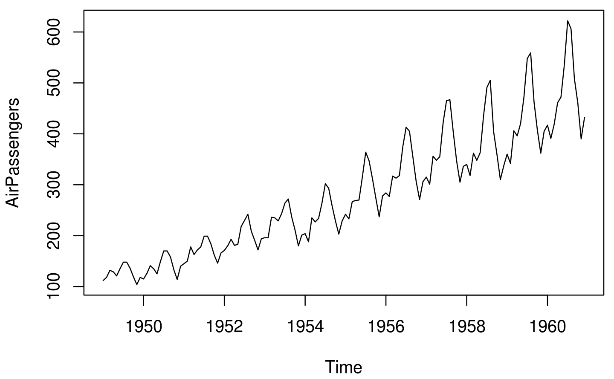
<p class="caption">(\#fig:air-passengers)时间序列图</p>
</div>


```r
plot(pressure)
plot(AirPassengers)
```

<div class="figure" style="text-align: center">
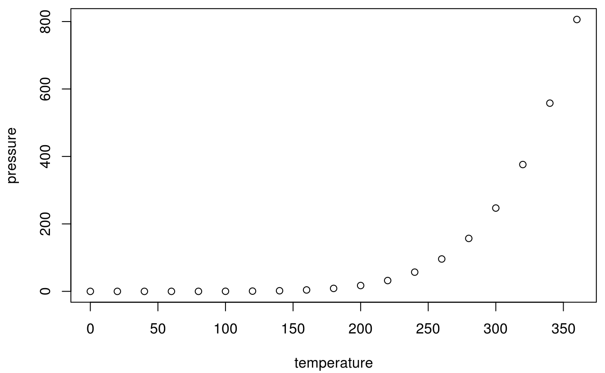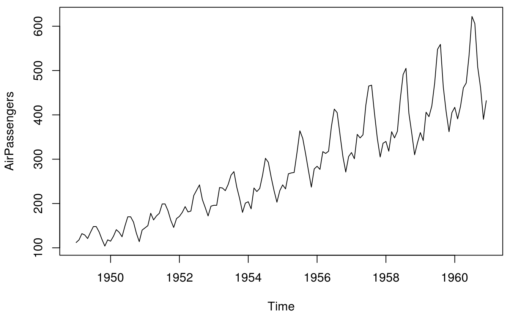
<p class="caption">(\#fig:two-rows)2行1列布局</p>
</div>


```r
plot(pressure)
plot(AirPassengers)
```

<div class="figure" style="text-align: center">
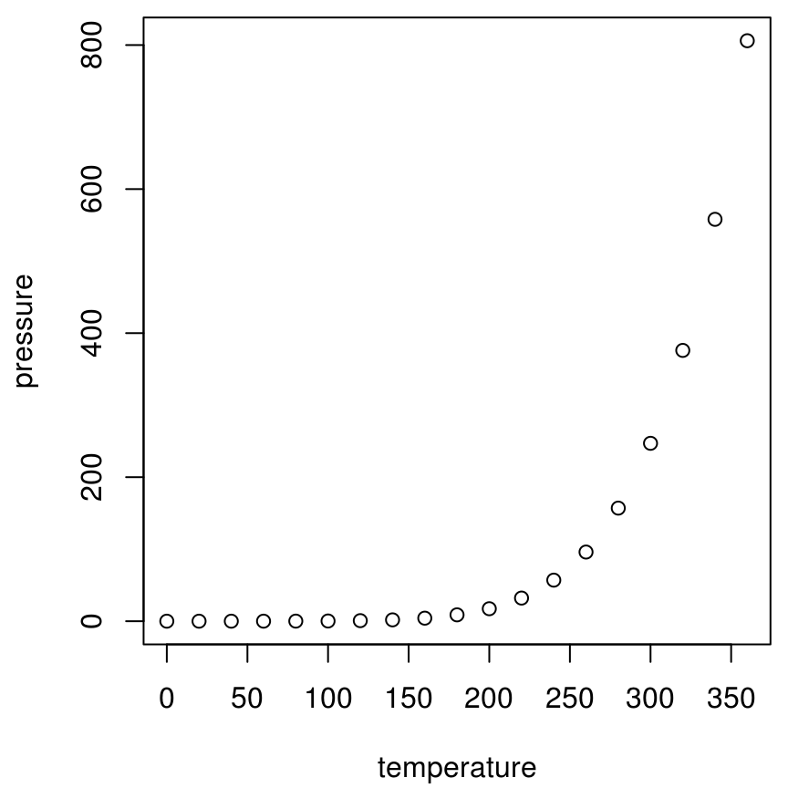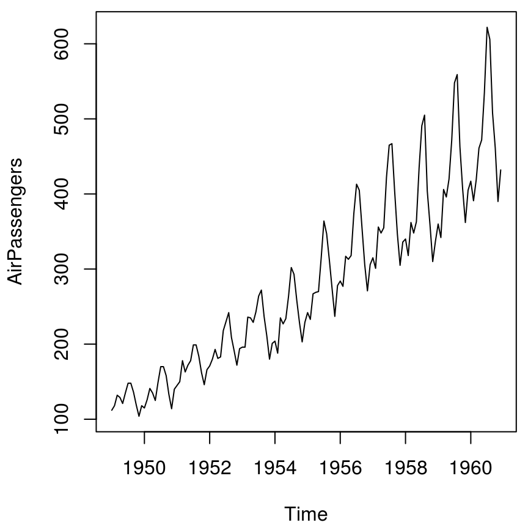
<p class="caption">(\#fig:two-cols)1行2列布局</p>
</div>


```r
plot(pressure)
plot(AirPassengers)
plot(pressure)
plot(AirPassengers)
```

<div class="figure" style="text-align: center">
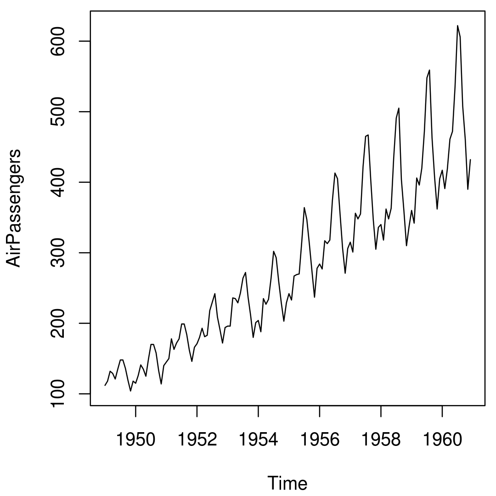
<p class="caption">(\#fig:two-rows-two-cols)2x2图布局</p>
</div>

(ref:fig-cap) 测试文本引用
(ref:text-references) 图表标题很长可使用[文本引用][text-references] 
(ref:footnote) 表格标题里插入脚注，但是 ebooks 不支持这样插入脚注[^longnote]
[^longnote]: Here's one with multiple blocks.
[text-references]: https://bookdown.org/yihui/bookdown/markdown-extensions-by-bookdown.html#text-references
[^css-position]: 参考谢益辉的博客： CSS 的位置属性以及如何居中对齐超宽元素 https://yihui.name/cn/2018/05/css-position/

### 公式 {#markdown-math}

行内公式一对美元符号 $\alpha$ 或者 \(\alpha+\beta\)，行间公式 $$\alpha$$ 或者 \[\alpha + \beta\] 对公式编号，如公式 \@ref(eq:likelihood)

\begin{equation}
L(\beta,\boldsymbol{\theta}) = f(y;\beta,\boldsymbol{\theta}) = \int_{\mathbb{R}^{n}}N(t;D\beta,\Sigma(\boldsymbol{\theta}))f(y|t)dt (\#eq:likelihood)
\end{equation}

多行公式分别编号，如公式\@ref(eq:BL-SGLMM) 和公式\@ref(eq:Poss-SGLMM) 

\begin{align}
\log\{\frac{p_i}{1-p_i}\} & = T_{i} = d(x_i)'\beta + S(x_i) + Z_i (\#eq:BL-SGLMM)\\
\log(\lambda_i)           & = T_{i} = d(x_i)'\beta + S(x_i) + Z_i (\#eq:Poss-SGLMM)
\end{align}

多行公式中对某一（些）行编号，如公式 \@ref(eq:align) 和 公式 \@ref(eq:Poss-SGLMM2)

\begin{align} 
g(X_{n}) &= g(\theta)+g'({\tilde{\theta}})(X_{n}-\theta) \\
\sqrt{n}[g(X_{n})-g(\theta)] &= g'\left({\tilde{\theta}}\right) 
  \sqrt{n}[X_{n}-\theta ] (\#eq:align) \\
\log(\lambda_i)  & = T_{i} = d(x_i)'\beta + S(x_i) + Z_i (\#eq:Poss-SGLMM2)  
\end{align} 

多行公式共用一个编号，如公式 \@ref(eq:likelihood2)

\begin{equation}
\begin{aligned}
L(\beta,\boldsymbol{\theta})
& = \int_{\mathbb{R}^{n}} \frac{N(t;D\beta,\Sigma(\boldsymbol{\theta}))f(y|t)}{N(t;D\beta_{0},\Sigma(\boldsymbol{\theta}_{0}))f(y|t)}f(y,t)dt\\
& \varpropto \int_{\mathbb{R}^{n}} \frac{N(t;D\beta,\Sigma(\boldsymbol{\theta}))}{N(t;D\beta_{0},\Sigma(\boldsymbol{\theta}_{0}))}f(t|y)dt \\
&= E_{T|y}\left[\frac{N(t;D\beta,\Sigma(\boldsymbol{\theta}))}{N(t;D\beta_{0},\Sigma(\boldsymbol{\theta}_{0}))}\right] 
\end{aligned}
(\#eq:likelihood2)
\end{equation}

推荐在 `equation` 公式中，使用 `split` 环境，意思是一个公式很长，需要拆成多行，如公式\@ref(eq:var-beta)

\begin{equation} 
\begin{split}
\mathrm{Var}(\hat{\beta}) & =\mathrm{Var}((X'X)^{-1}X'y)\\
 & =(X'X)^{-1}X'\mathrm{Var}(y)((X'X)^{-1}X')'\\
 & =(X'X)^{-1}X'\mathrm{Var}(y)X(X'X)^{-1}\\
 & =(X'X)^{-1}X'\sigma^{2}IX(X'X)^{-1}\\
 & =(X'X)^{-1}\sigma^{2}
\end{split}
(\#eq:var-beta)
\end{equation} 

注意，`\mathbf` 只对字母 $a,b,c,A,B,C$ 加粗，mathjax 不支持公式中使用 `\bm` 对 $\theta,\alpha,\beta,\ldots,\gamma$ 加粗，应该使用 `\boldsymbol`

## Pandoc's Markdown {#pandoc-markdown}

介绍在 Markdown 的基础上添加的功能

## R Markdown {#r-markdown}

R Markdown 站在巨人的肩膀上，这些巨人有 [Markdown](https://daringfireball.net/projects/markdown/)、 [Pandoc](http://pandoc.org) 和 [LaTeX](https://www.latex-project.org/) 等。 

生态系统

1. 报告
   - learnr: Interactive Tutorials with R Markdown <https://rstudio.github.com/learnr/>
   - r2d3: R Interface to D3 Visualizations <https://rstudio.github.io/r2d3/>
   - radix: Radix combines the technical authoring features of Distill with R Markdown, enabling a fully reproducible workflow based on literate programming <https://github.com/radixpub/radix-r>
2. 网络服务
   - RestRserve: RestRserve is a R web API framework for building high-performance microservices and app backends <https://github.com/dselivanov/RestRserve> 基于 [Rserve](https://github.com/s-u/Rserve) 在笔记本上处理请求的吞吐量是每秒10000次，比 plumber 快大约20倍
   - plumber: Turn your R code into a web API. <https://www.rplumber.io>
3. 展示
   - revealjs: R Markdown Format for reveal.js Presentations <https://github.com/rstudio/revealjs>
   - xaringan: Presentation Ninja 幻灯忍者写轮眼 <https://slides.yihui.name/xaringan/>


在指定目录创建 Book 项目，


```r
bookdown:::bookdown_skeleton("~/bookdown-demo")
```

项目根目录的文件列表

```markdown
directory/
├──  index.Rmd
├── 01-intro.Rmd
├── 02-literature.Rmd
├── 03-method.Rmd
├── 04-application.Rmd
├── 05-summary.Rmd
├── 06-references.Rmd
├── _bookdown.yml
├── _output.yml
├──  book.bib
├──  preamble.tex
├──  README.md
└──  style.css
```


### 语法高亮

Pandoc 通过 LaTeX 环境 lstlisting 支持语法高亮，比如

````markdown
```TeX
\begin{lstlisting}
\documentclass[cn]{elegantbook} 
\documentclass[lang=cn]{elegantbook}
\end{lstlisting}

\begin{lstlisting}[frame=single]
\nocite{EINAV2010,Havrylchyk2018} %or include some bibitems
\nocite{*} %include all the bibitems
\end{lstlisting}
```
````


```r
# knit 支持的编程语言及其语法高亮环境
names(knitr::knit_engines$get())
#>  [1] "awk"         "bash"        "coffee"      "gawk"        "groovy"     
#>  [6] "haskell"     "lein"        "mysql"       "node"        "octave"     
#> [11] "perl"        "psql"        "Rscript"     "ruby"        "sas"        
#> [16] "scala"       "sed"         "sh"          "stata"       "zsh"        
#> [21] "highlight"   "Rcpp"        "tikz"        "dot"         "c"          
#> [26] "fortran"     "fortran95"   "asy"         "cat"         "asis"       
#> [31] "stan"        "block"       "block2"      "js"          "css"        
#> [36] "sql"         "go"          "python"      "julia"       "sass"       
#> [41] "scss"        "theorem"     "lemma"       "corollary"   "proposition"
#> [46] "conjecture"  "definition"  "example"     "exercise"    "proof"      
#> [51] "remark"      "solution"    "nomnoml"
# knit 支持的语法高亮主题
# Pandoc 支持的语法高亮环境
c(
  "ABAP", "IDL", "Plasm", "ACSL",
  "inform", "POV", "Ada", "Java", "Prolog",
  "Algol", "JVMIS", "Promela", "Ant", "ksh",
  "Python", "Assembler", "Lisp", "R", "Awk",
  "Logo", "Reduce", "bash", "make", "Rexx",
  "Basic", "Mathematica", "RSL", "C", "Matlab",
  "Ruby", "C++", "Mercury", "S", "Caml",
  "MetaPost", "SAS", "Clean", "Miranda", "Scilab",
  "Cobol", "Mizar", "sh", "Comal", "ML", "SHELXL",
  "csh", "Modula-2", "Simula", "Delphi",
  "MuPAD", "SQL", "Eiffel", "NASTRAN", "tcl",
  "Elan", "Oberon-2", "TeX", "erlang",
  "OCL", "VBScript", "Euphoria", "Octave",
  "Verilog", "Fortran", "Oz", "VHDL", "GCL",
  "Pascal", "VRML", "Gnuplot", "Perl", "XML",
  "Haskell", "PHP", "XSLT", "HTML", "PL/I"
)
#>  [1] "ABAP"        "IDL"         "Plasm"       "ACSL"        "inform"     
#>  [6] "POV"         "Ada"         "Java"        "Prolog"      "Algol"      
#> [11] "JVMIS"       "Promela"     "Ant"         "ksh"         "Python"     
#> [16] "Assembler"   "Lisp"        "R"           "Awk"         "Logo"       
#> [21] "Reduce"      "bash"        "make"        "Rexx"        "Basic"      
#> [26] "Mathematica" "RSL"         "C"           "Matlab"      "Ruby"       
#> [31] "C++"         "Mercury"     "S"           "Caml"        "MetaPost"   
#> [36] "SAS"         "Clean"       "Miranda"     "Scilab"      "Cobol"      
#> [41] "Mizar"       "sh"          "Comal"       "ML"          "SHELXL"     
#> [46] "csh"         "Modula-2"    "Simula"      "Delphi"      "MuPAD"      
#> [51] "SQL"         "Eiffel"      "NASTRAN"     "tcl"         "Elan"       
#> [56] "Oberon-2"    "TeX"         "erlang"      "OCL"         "VBScript"   
#> [61] "Euphoria"    "Octave"      "Verilog"     "Fortran"     "Oz"         
#> [66] "VHDL"        "GCL"         "Pascal"      "VRML"        "Gnuplot"    
#> [71] "Perl"        "XML"         "Haskell"     "PHP"         "XSLT"       
#> [76] "HTML"        "PL/I"
```

## 表格样式 {#table-style}

在数据分析报告中，根据报告的文本格式，我们有不同的数据呈现形式，基于 HTML 和 LaTeX 甚至 DOCX 

表格样式工具 [gt](https://github.com/rstudio/gt) [kableExtra](https://github.com/haozhu233/kableExtra) [flextable](https://github.com/davidgohel/flextable) 和 [DT](https://github.com/rstudio/DT)

[remedy](https://github.com/ThinkR-open/remedy) 格式化 Markdown 语法
[beautifyR](https://github.com/mwip/beautifyR) 整理 Markdown 表格


### HTML 样式 {#table-html}

### LaTeX 样式 {#table-latex}


## 插件  {#rmarkdown-addins}

提高写作效率的 10 大 R 包或 RStudio 插件

- 简化 Markdown 写作 [remedy](https://github.com/ThinkR-open/remedy) 
- 源代码截图 [carbonate](https://github.com/yonicd/carbonate)
- 整理 Markdown 表格 [beautifyR](https://github.com/mwip/beautifyR)
- 引用参考文献 [citr](https://github.com/crsh/citr)
- 格式化 R 代码块 [styler](https://github.com/r-lib/styler)
- 准备可重复的例子，方便在论坛/Github上发问 [reprex](https://github.com/tidyverse/reprex)
- 快速获取 Github 等社交网络活动记录 [butteRfly](https://github.com/jonocarroll/butteRfly)
- 统计 R Markdown 文档中的单词 [wordcountaddin](https://github.com/benmarwick/wordcountaddin)
- 写可重复性研究报告 [rrtools](https://github.com/benmarwick/rrtools)
- RStudio 插件集合 [addinslist](https://github.com/daattali/addinslist)
- 高亮支持 R 帮助文档 [rdoc](https://github.com/mdequeljoe/rdoc)

markdown 简洁设计哲学， Sweave 文学编程思想，期间各种工具粉墨登场，最后分别回到 Pandoc 和 R Markdown


Table: (\#tab:rmarkdown-eco)R Markdown 生态系统

Package             Title                                                            
------------------  -----------------------------------------------------------------
**addinsOutline**   RStudio Addins for Show Outline of a R Markdown/LaTeX Project    
**blogdown**        Create Blogs and Websites with R Markdown                        
**bookdown**        Authoring Books and Technical Documents with R Markdown          
**bsplus**          Adds Functionality to the R Markdown + Shiny Bootstrap Framework 
**distill**         R Markdown Format for Scientific and Technical Writing           
**downloadthis**    Implement Download Buttons in rmarkdown                          
**flexdashboard**   R Markdown Format for Flexible Dashboards                        
**govdown**         GOV.UK Style Templates for R Markdown                            
**lazyrmd**         Render R Markdown Outputs Lazily                                 
**liftr**           Containerize R Markdown Documents for Continuous Reproducibility 
**memor**           A rmarkdown Template that Can be Highly Customized               
**pagedown**        Paginate the HTML Output of R Markdown with CSS for Print        
**posterdown**      Generate PDF Conference Posters Using R Markdown                 
**prereg**          R Markdown Templates to Preregister Scientific Studies           
**prettydoc**       Creating Pretty Documents from R Markdown                        
**radix**           R Markdown Format for Scientific and Technical Writing           
**revealjs**        R Markdown Format for reveal.js Presentations                    
**rmd**             Easily Install and Load the R Markdown Family                    
**rmdfiltr**        Lua filters for R Markdown                                       
**rmdformats**      HTML Output Formats and Templates for rmarkdown Documents        
**rmdplugr**        Plugins for R Markdown Formats                                   
**rmdshower**       R Markdown Format for shower Presentations                       
**rticles**         Article Formats for R Markdown                                   
**tufte**           Tufte's Styles for R Markdown Documents                          
**tufterhandout**   Tufte-style html document format for rmarkdown                   
**uiucthemes**      R Markdown Themes for UIUC Documents and Presentations           
**vitae**           Curriculum Vitae for R Markdown                                  
**webex**           Create Interactive Web Exercises in R Markdown                   
**ymlthis**         Write YAML for R Markdown, bookdown, blogdown, and More          

## 报告 {#subsec:rmarkdown}

数据分析报告 R Markdown

## 简历 {#subsec:pagedown}

pagedown

## 书籍 {#subsec:bookdown}

bookdown

## 网站 {#subsec:blogdown}

blogdown

## Shiny {#subsec:dashboard}

以 shiny 为代表


```r
library(ggplot2)
p1 <- ggplot(data = iris, aes(x = Sepal.Length, y = Sepal.Width, color = Species)) +
  geom_point() +
  theme_minimal()

p2 <- ggplot(data = iris, aes(x = Petal.Length, y = Petal.Width, color = Species)) +
  geom_point() +
  theme_minimal()

library(patchwork)
p1 + p2
```

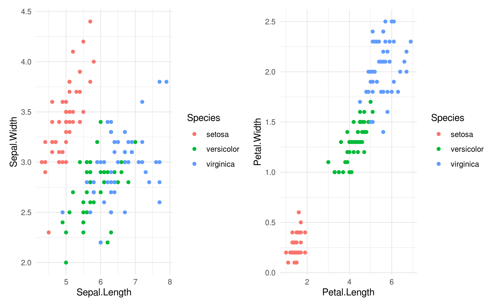

ggiraph 将 ggplot 对象转化为网页


```r
library(ggiraph)
girafe(code = print(p1 + p2), width_svg = 8, height_svg = 3)
```

将动态图形嵌入 Shiny App 中

<div class="figure" style="text-align: center">
<iframe src="https://xiangyun.shinyapps.io/01-iris-ggiraph/?showcase=0" width="70%" height="600px"></iframe>
<p class="caption">(\#fig:iris-ggiraph-shiny)A Shiny app created via the ggiraph package; you can see a live version at https://xiangyun.shinyapps.io/01-iris-ggiraph/.</p>
</div>

## 幻灯片 {#subsec:xaringan}

xaringan


## 动画视频 {#sec:animation-video}

**animation** 包 [@Xie_2013_animation] 将 Base R 绘制的图形转化为动画或视频

**av** 包 [@av] 基于 [FFmpeg](https://github.com/FFmpeg/FFmpeg) 将静态图片合成视频，而 **gifski** 包 [@gifski] 基于 [gifski](https://github.com/r-rust/gifski) 将静态图片合成 GIF 动画，**gganimate** 包 [@gganimate] 支持将 ggplot2 生成的图形，借助 **gifski** 包转化为动态图片或视频 


```r
library(gganimate)
ggplot(data = Orange, aes(x = age, y = circumference, color = Tree)) +
  geom_point() +
  geom_line() +
  transition_reveal(age)
```
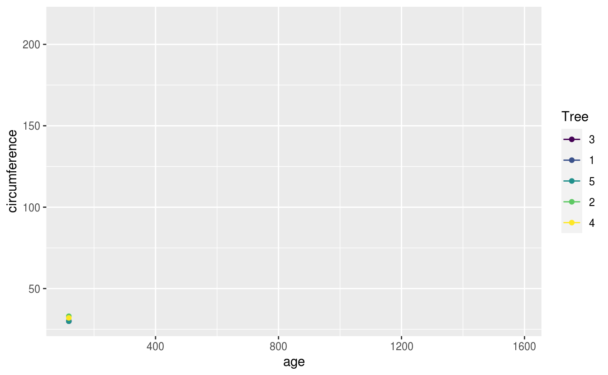


制作设计文档

ggplot2 功能结构图

R 闭包、环境等的关系图

## 图表 {#sec:diagram-table}

### TikZ


```tex
\usetikzlibrary{arrows}
\begin{tikzpicture}[node distance=2cm, auto,>=latex', thick, scale = 0.5]
\node (P) {$P$};
\node (B) [right of=P] {$B$};
\node (A) [below of=P] {$A$};
\node (C) [below of=B] {$C$};
\node (P1) [node distance=1.4cm, left of=P, above of=P] {$\hat{P}$};
\draw[->] (P) to node {$f$} (B);
\draw[->] (P) to node [swap] {$g$} (A);
\draw[->] (A) to node [swap] {$f$} (C);
\draw[->] (B) to node {$g$} (C);
\draw[->, bend right] (P1) to node [swap] {$\hat{g}$} (A);
\draw[->, bend left] (P1) to node {$\hat{f}$} (B);
\draw[->, dashed] (P1) to node {$k$} (P);
\end{tikzpicture}
```


<div class="figure" style="text-align: center">
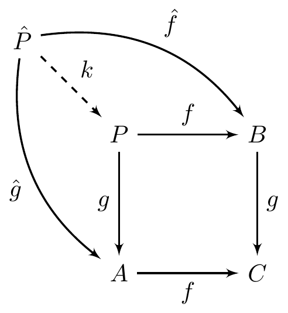
<p class="caption">(\#fig:tikz-ex)Funky tikz</p>
</div>

### DOT


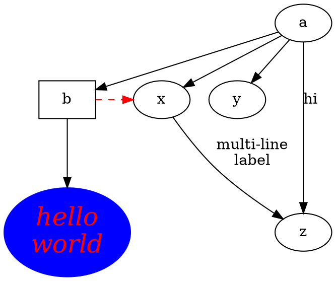


<div class="figure" style="text-align: center">
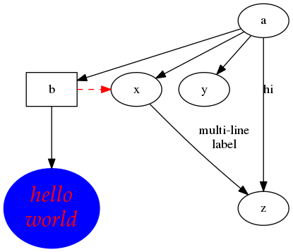
<p class="caption">(\#fig:dot-ex)Funky dot</p>
</div>


[DiagrammeR](https://github.com/rich-iannone/DiagrammeR)


```r
library(DiagrammeR)
```


### UML {#subsec:uml}


[nomnoml](https://github.com/javierluraschi/nomnoml)


```nomnoml
#stroke: orange
#.circle: fill=#8f8 dashed visual=note

[A]-[B]
[B]-[<circle>C]
```

<!--html_preserve--><div id="htmlwidget-9580c84d0c32f0a22a8c" style="width:70%;height:415.296px;" class="nomnoml html-widget"></div>
<script type="application/json" data-for="htmlwidget-9580c84d0c32f0a22a8c">{"x":{"code":"\n  #fill: #FEFEFF\n  #lineWidth: 1\n  #zoom: 4\n  #direction: right\n   #stroke: orange\n#.circle: fill=#8f8 dashed visual=note\n\n[A]-[B]\n[B]-[<circle>C]","svg":false},"evals":[],"jsHooks":[]}</script><!--/html_preserve-->

### 表格 {#subsec:table}

DT gt 和 kableExtra


DT 可以嵌在网页或 Shiny 应用中

kableExtra 支持 HTML 网页和 PDF 文档两种呈现方式


