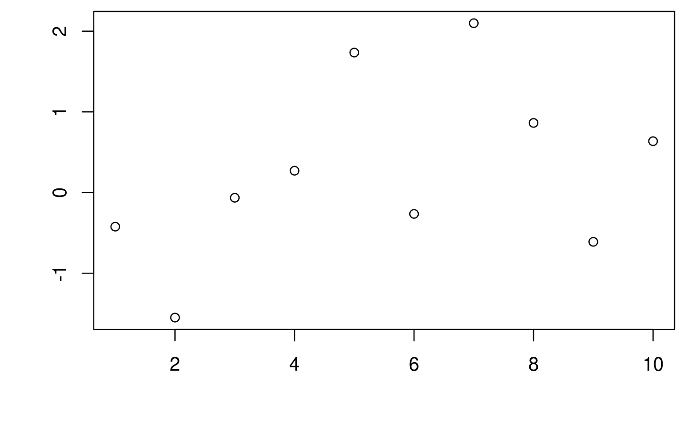
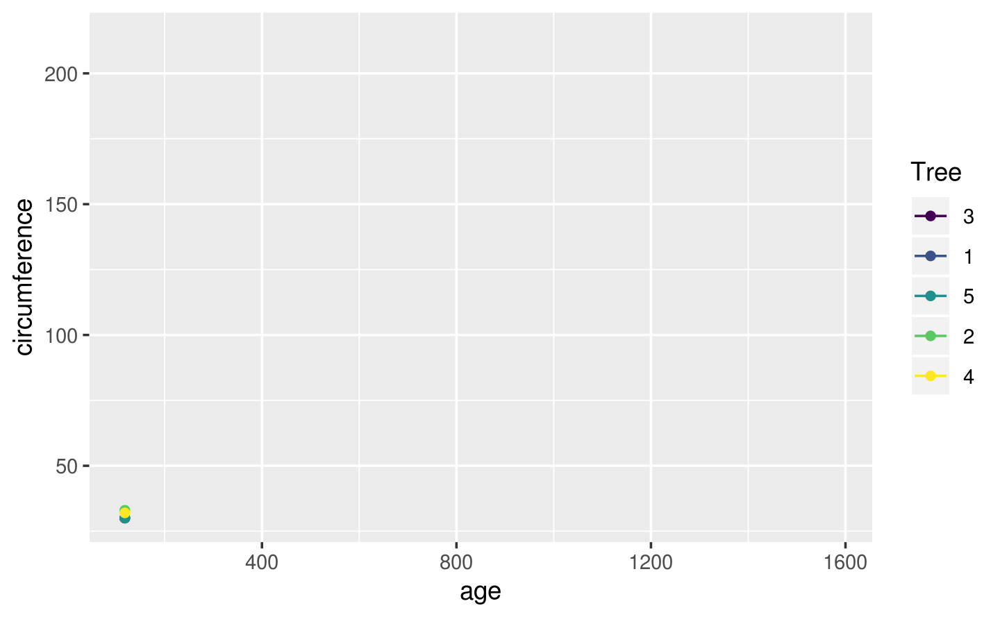
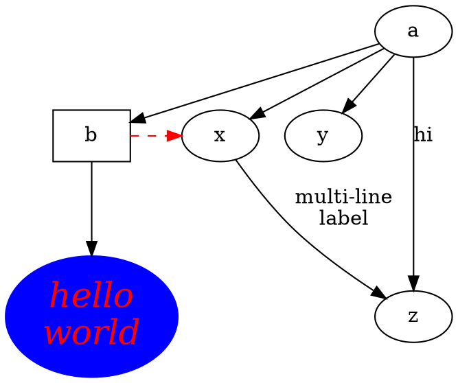

# 动态性文档 {#Dynamic-Documents}


<!-- 不要安装新的 R 包，以截图的方式辅助说明即可 -->


::: rmdnote
R Markdown 文档[@xie2018rmarkdown] 中的 Python 代码块是由 knitr 包 [@xie2015knitr] 负责调度处理的，展示 Matplotlib 绘图的结果使用了 reticulate 包 [@R-reticulate] 提供的 Python 引擎而不是 knitr 自带的。
:::

- LaTeX 专家黄晨成写的译文 [Matplotlib 教程](https://liam.page/2014/09/11/matplotlib-tutorial-zh-cn/)
- [周沫凡](https://morvanzhou.github.io/) 制作的莫烦 Python 系列视频教程之 [Matplotlib 数据可视化神器](https://morvanzhou.github.io/tutorials/data-manipulation/plt/)
- 陈治兵维护的在线 [Matplotlib 中文文档](https://www.matplotlib.org.cn/)

## 软件信息 {#sessioninfo .unnumbered} 

编译书籍使用的 Python 3 模块有


```bash
pip3 list --format=columns
```

R 代码运行环境


```r
sessionInfo()
#> R Under development (unstable) (2020-01-03 r77628)
#> Platform: x86_64-pc-linux-gnu (64-bit)
#> Running under: Ubuntu 16.04.6 LTS
#> 
#> Matrix products: default
#> BLAS:   /home/travis/R-bin/lib/R/lib/libRblas.so
#> LAPACK: /home/travis/R-bin/lib/R/lib/libRlapack.so
#> 
#> locale:
#>  [1] LC_CTYPE=en_US.UTF-8       LC_NUMERIC=C              
#>  [3] LC_TIME=en_US.UTF-8        LC_COLLATE=en_US.UTF-8    
#>  [5] LC_MONETARY=en_US.UTF-8    LC_MESSAGES=en_US.UTF-8   
#>  [7] LC_PAPER=en_US.UTF-8       LC_NAME=C                 
#>  [9] LC_ADDRESS=C               LC_TELEPHONE=C            
#> [11] LC_MEASUREMENT=en_US.UTF-8 LC_IDENTIFICATION=C       
#> 
#> attached base packages:
#> [1] stats     graphics  grDevices utils     datasets  methods   base     
#> 
#> other attached packages:
#> [1] magrittr_1.5       shiny_1.4.0        rmarkdown_2.0      knitr_1.26        
#> [5] nomnoml_0.1.0.9001
#> 
#> loaded via a namespace (and not attached):
#>  [1] Rcpp_1.0.3        bookdown_0.16     later_1.0.0       digest_0.6.23    
#>  [5] mime_0.8          R6_2.4.1          xtable_1.8-4      evaluate_0.14    
#>  [9] rlang_0.4.2       stringi_1.4.3     curl_4.3          promises_1.1.0   
#> [13] tools_4.0.0       stringr_1.4.0     htmlwidgets_1.5.1 fastmap_1.0.1    
#> [17] httpuv_1.5.2      xfun_0.11         yaml_2.2.0        compiler_4.0.0   
#> [21] htmltools_0.4.0
```

::: rmdtip
在 `knitr::opts_chunk` 中设置 `python.reticulate = TRUE` 意味着所有的 Python 代码块共享一个 Python Session，而 `python.reticulate = FALSE` 意味着使用 knitr 提供的 Python 引擎，所有的 Python 代码块独立运行。

`python.reticulate = TRUE` 会使用 reticulate 提供的 Python 引擎，它支持 matplotlib 绘图，但是不支持图 caption，knitr 的 python 引擎是支持 caption 的

R 和 Python 之间的交互，Python 负责数据处理和建模， R 负责绘图，有些复杂的机器学习模型及其相关数据操作需要在 Python 中完成，数据集清理至数据框的形式后导入到 R 中，画各种静态或者动态图，这时候需要加载 reticulate 包，只是设置 `python.reticulate = TRUE` 还不够
:::

## R 调用 Python {#r-call-python .unnumbered}

pandas 读取数据，整理后由 reticulate 包传递给 R 环境中的 data.frame 对象，加载 ggplot2 绘图


```python
import pandas as pd
iris2 = pd.read_csv('iris.csv')
```


```r
library(reticulate)
library(ggplot2)
ggplot(py$iris2, aes(x = Sepal.Length, y = Sepal.Width)) +
  geom_point(aes(color = Species)) +
  scale_color_viridis_d()
```


```r
library(ggplot2)
ggplot(faithfuld, aes(waiting, eruptions)) +
  geom_raster(aes(fill = density)) +
  scale_fill_continuous()
```


[^r-blogdown]: 有些内容也会放在我的博客上 <https://r-bloggers.netlify.com/>，博客使用 blogdown 包 [@xie2017blogdown] 搭建的


::: sidebar
- Pandoc 对 Markdown 语法的扩充
- R Markdown 加持
- 可重复数据分析 Rmd
- dashboard 面板
- Shiny 文档
- 写书
- 写博客
- 写幻灯片
:::


> shiny 

- [Mastering Shiny](https://jcheng5.github.io/shiny-book/)
- [Shiny Server Professional Administrator's Guide](https://docs.rstudio.com/shiny-server/)
- [Learn Shiny](https://shiny.rstudio.com/tutorial/)
- [rstudio::conf 2018](https://github.com/simecek/RStudioConf2018Slides)

> 三剑客 Markdown & Pandoc's Markdown & R Markdown
> [Markdown for scientific writing](https://github.com/scholmd/scholmd/wiki)

首先介绍 Markdown 在强调、标题、列表、断行、链接、图片、引用、代码块、LaTeX 公式等使用方式，然后在 Markdown 的基础上介绍 Pandoc's Markdown 功能有加强的地方，R Markdown 在 Pandoc's Markdown 的基础上介绍功能有加强的地方

## Markdown {#markdown}

Markdown 基础语法见 RStudio IDE 自带的 Markdown 手册：RStudio 顶部菜单栏 -> Help -> Markdown Quick Reference，这里主要介绍一下Markdown 高级语法，特别是 [Pandoc's Markdown](https://pandoc.org/MANUAL.html#pandocs-markdown)，其实是 Pandoc 提供了很多对 Markdown 的扩展支持，下面介绍一下被 Pandoc 加强后的 Markdown 表格、图片和公式的使用

### 列表 {#markdown-list}

- 有序的列表
  1. 第一条
  1. 第二条

- 无序的列表
  - 第一条
  - 第二条

  * here is my first
    list item.
  * and my second.

- 嵌套的列表

  1. 有序
  2. Item 2
  3. Item 3
      + Item 3a
      + Item 3b

  * 无序
  * Item 2
      + Item 2a
      + Item 2b

定义型列表中包含代码

Term 1

:   Definition 1

Term 2 with *inline markup*

:   Definition 2

        { some code, part of Definition 2 }

    Third paragraph of definition 2.

定义类型的列表，紧凑形式

Term 1
  ~ Definition 1

Term 2
  ~ Definition 2a
  ~ Definition 2b
  

无序列表

* fruits
  + apples
    - macintosh
    - red delicious
  + pears
  + peaches
* vegetables
  + broccoli
  + chard


对应  LaTeX 列表环境里的有序环境，通篇计数

(@)  My first example will be numbered (1).
(@)  My second example will be numbered (2).

Explanation of examples.

(@)  My third example will be numbered (3).

`(@)` 环境可以引用

(@good)  这是一个好例子

正如 (@good) 所指出的那样，


列表里包含代码块

-   item one
-   item two

<!-- end of list -->

    { my code block }

显示反引号 `` ` ``

### 强调 {#markdown-emphasis}

轻微强调 
:   这是倾斜的文字 _下划线表示强调_, and this is *星花表示强调*.

特别强调 
:   这是加粗的文字 **strong emphasis** and __with underscores__.

强烈强调
:   这是斜体加粗的文字 ***三个星花***

删除线 
:   This ~~is deleted text.~~

上下标 
:   H~2~O is a liquid.  2^10^ is 1024. C^137^ 是一种放射性元素


### 引用 {#markdown-quote}

注意在引用末尾空两格，出处另起一行，引用名人名言:

> It's always better to give 
> than to receive.  

或者

> A Markdown-formatted document should be publishable as-is, as plain text, without looking like it’s been marked up with tags or formatting instructions.
>
> --- John Gruber

> Trellis graphics are a bit like hash functions: 
> you can be close to the target, but get a far-off result.[^lattice-panel]
>
> --- Dieter Menne

[^lattice-panel]: (about problems with creating a suitable lattice panel function) R-help (August 2008)

> If you imagine that this pen is Trellis, then Lattice is not this pen.[^lattice-pen]
>
> --- Paul Murrell

[^lattice-pen]: (on the difference of Lattice (which eventually was called grid) and Trellis) DSC 2001, Wien (March 2001)

> You're overlooking something like line 800 of the documentation for xyplot. [...] 
> It's probably in the R-FAQ as well, 
> since my original feeling was that this behaviour was chosen 
> in order to confuse people and see how many people read the FAQ... :) [^xyplot]
>
> --- Barry Rowlingson 

[^xyplot]: (about the fact that lattice objects have to be print()ed) R-help (May 2005)

### 表格 {#markdown-table}

插入表格很简单的，如表 \@ref(tab:insert-tab) 所示，还带脚注哦，复杂的表格制作可以借助 R 包 knitr 提供的 kable 函数以及 kableExtra 包^[<https://xiangyunhuang.github.io/bookdown-kableExtra/>]，此外谢益辉的书籍 [bookdown: Authoring Books and Technical Documents with R Markdown](https://bookdown.org/yihui/bookdown/) 中也有一节专门介绍表格 <https://bookdown.org/yihui/bookdown/tables.html>

Table: (\#tab:insert-tab) 表格标题^[附有脚注]

| First Header | Second Header |
| :----------- | :------------ |
| Content Cell | Content Cell  |
| Content Cell | Content Cell  |

`kable` 支持多个表格并排，如表 \@ref(tab:table-multi) 所示


```r
knitr::kable(
  list(
    head(iris[, 1:2], 3),
    head(mtcars[, 1:3], 5)
  ),
  caption = 'A Tale of Two Tables.', booktabs = TRUE
)
```


<table class="kable_wrapper">
<caption>(\#tab:table-multi)A Tale of Two Tables.</caption>
<tbody>
  <tr>
   <td> 

 Sepal.Length   Sepal.Width
-------------  ------------
          5.1           3.5
          4.9           3.0
          4.7           3.2

 </td>
   <td> 

                      mpg   cyl   disp
------------------  -----  ----  -----
Mazda RX4            21.0     6    160
Mazda RX4 Wag        21.0     6    160
Datsun 710           22.8     4    108
Hornet 4 Drive       21.4     6    258
Hornet Sportabout    18.7     8    360

 </td>
  </tr>
</tbody>
</table>

在表格中引入数学符号


```r
knitr::kable(
  rbind(c("", "continuous", "discrete"),
        c("nominal", "", "$\\checkmark$"),
        c("ordinal", "", "$\\checkmark$"),
        c("interval", "$\\checkmark$", "$\\checkmark$"),
        c("ratio", "$\\checkmark$", "$\\checkmark$")
    
  )
  , caption = 'The relationship between the scales of measurement and the discrete/continuity distinction. Cells with a tick mark correspond to things that are possible.', align="lcc",
  booktabs = TRUE
)
```


Table: (\#tab:scalescont)The relationship between the scales of measurement and the discrete/continuity distinction. Cells with a tick mark correspond to things that are possible.

---------  --------------  --------------
             continuous       discrete   
nominal                     $\checkmark$ 
ordinal                     $\checkmark$ 
interval    $\checkmark$    $\checkmark$ 
ratio       $\checkmark$    $\checkmark$ 
---------  --------------  --------------

[kableExtra](https://github.com/haozhu233/kableExtra) 、broom 和 [pixiedust](https://github.com/nutterb/pixiedust) 包实现表格样式的精细调整，如黄湘云制作的 [样例](https://xiangyunhuang.github.io/bookdown-kableExtra/) 


### 图片 {#image}

插入图片大体遵循的语法如下

```markdown
{...}
```

中括号包含图片的标题，小括号是图片插入路径，大括号控制图片属性 

利用 `knitr::include_graphics` 函数在代码块中插入图片是很简单的，如图\@ref(fig:knitr-footnote)所示，图、表的标题很长或者需要插入脚注，可以使用[文本引用][text-references]


```r
knitr::include_graphics(path = system.file("help/figures", "mai.png", package = "graphics"))
```

<div class="figure" style="text-align: center">

<p class="caption">(\#fig:knitr-footnote)(ref:footnote)</p>
</div>


```r
par(mar = c(4.1, 4.1, 0.5, 0.5))
plot(rnorm(10), xlab = "", ylab = "")
```

<div class="figure" style="text-align: center">

<p class="caption">(\#fig:unnamed-chunk-9)(ref:fig-cap)</p>
</div>

插入一幅普通图片，如图 \@ref(fig:left-fig) 和图 \@ref(fig:full-fig) 所示分别控制图片插入的宽度[^css-position]

```markdown
![(\#fig:left-fig) 默认图片位置居左^[这里是脚注]](figures/mai.png){ width=45% }
```

![(\#fig:left-fig) 默认图片位置居左^[这里是脚注]](figures/mai.png){ width=45% }

```markdown
{.full}
```

{.full}


-   One

-   Two

     { width=25% }

-   Three


根据代码动态生成图片，并插入文档中；外部图片插入文档中


```r
plot(AirPassengers)
```

<div class="figure" style="text-align: center">

<p class="caption">(\#fig:air-passengers)时间序列图</p>
</div>


```r
plot(pressure)
plot(AirPassengers)
```

<div class="figure" style="text-align: center">

<p class="caption">(\#fig:two-rows)2行1列布局</p>
</div>


```r
plot(pressure)
plot(AirPassengers)
```

<div class="figure" style="text-align: center">

<p class="caption">(\#fig:two-cols)1行2列布局</p>
</div>


```r
plot(pressure)
plot(AirPassengers)
plot(pressure)
plot(AirPassengers)
```

<div class="figure" style="text-align: center">

<p class="caption">(\#fig:two-rows-two-cols)2x2图布局</p>
</div>

(ref:fig-cap) 测试文本引用
(ref:text-references) 图表标题很长可使用[文本引用][text-references] 
(ref:footnote) 表格标题里插入脚注，但是 ebooks 不支持这样插入脚注[^longnote]
[^longnote]: Here's one with multiple blocks.
[text-references]: https://bookdown.org/yihui/bookdown/markdown-extensions-by-bookdown.html#text-references
[^css-position]: 参考谢益辉的博客： CSS 的位置属性以及如何居中对齐超宽元素 https://yihui.name/cn/2018/05/css-position/

### 公式 {#markdown-math}

行内公式一对美元符号 $\alpha$ 或者 \(\alpha+\beta\)，行间公式 $$\alpha$$ 或者 \[\alpha + \beta\] 对公式编号，如公式 \@ref(eq:likelihood)

\begin{equation}
L(\beta,\boldsymbol{\theta}) = f(y;\beta,\boldsymbol{\theta}) = \int_{\mathbb{R}^{n}}N(t;D\beta,\Sigma(\boldsymbol{\theta}))f(y|t)dt (\#eq:likelihood)
\end{equation}

多行公式分别编号，如公式\@ref(eq:BL-SGLMM) 和公式\@ref(eq:Poss-SGLMM) 

\begin{align}
\log\{\frac{p_i}{1-p_i}\} & = T_{i} = d(x_i)'\beta + S(x_i) + Z_i (\#eq:BL-SGLMM)\\
\log(\lambda_i)           & = T_{i} = d(x_i)'\beta + S(x_i) + Z_i (\#eq:Poss-SGLMM)
\end{align}

多行公式中对某一（些）行编号，如公式 \@ref(eq:align) 和 公式 \@ref(eq:Poss-SGLMM2)

\begin{align} 
g(X_{n}) &= g(\theta)+g'({\tilde{\theta}})(X_{n}-\theta) \\
\sqrt{n}[g(X_{n})-g(\theta)] &= g'\left({\tilde{\theta}}\right) 
  \sqrt{n}[X_{n}-\theta ] (\#eq:align) \\
\log(\lambda_i)  & = T_{i} = d(x_i)'\beta + S(x_i) + Z_i (\#eq:Poss-SGLMM2)  
\end{align} 

多行公式共用一个编号，如公式 \@ref(eq:likelihood2)

\begin{equation}
\begin{aligned}
L(\beta,\boldsymbol{\theta})
& = \int_{\mathbb{R}^{n}} \frac{N(t;D\beta,\Sigma(\boldsymbol{\theta}))f(y|t)}{N(t;D\beta_{0},\Sigma(\boldsymbol{\theta}_{0}))f(y|t)}f(y,t)dt\\
& \varpropto \int_{\mathbb{R}^{n}} \frac{N(t;D\beta,\Sigma(\boldsymbol{\theta}))}{N(t;D\beta_{0},\Sigma(\boldsymbol{\theta}_{0}))}f(t|y)dt \\
&= E_{T|y}\left[\frac{N(t;D\beta,\Sigma(\boldsymbol{\theta}))}{N(t;D\beta_{0},\Sigma(\boldsymbol{\theta}_{0}))}\right] 
\end{aligned}
(\#eq:likelihood2)
\end{equation}

推荐在 `equation` 公式中，使用 `split` 环境，意思是一个公式很长，需要拆成多行，如公式\@ref(eq:var-beta)

\begin{equation} 
\begin{split}
\mathrm{Var}(\hat{\beta}) & =\mathrm{Var}((X'X)^{-1}X'y)\\
 & =(X'X)^{-1}X'\mathrm{Var}(y)((X'X)^{-1}X')'\\
 & =(X'X)^{-1}X'\mathrm{Var}(y)X(X'X)^{-1}\\
 & =(X'X)^{-1}X'\sigma^{2}IX(X'X)^{-1}\\
 & =(X'X)^{-1}\sigma^{2}
\end{split}
(\#eq:var-beta)
\end{equation} 

注意，`\mathbf` 只对字母 $a,b,c,A,B,C$ 加粗，mathjax 不支持公式中使用 `\bm` 对 $\theta,\alpha,\beta,\ldots,\gamma$ 加粗，应该使用 `\boldsymbol`

## Pandoc's Markdown {#pandoc-markdown}

介绍在 Markdown 的基础上添加的功能

## R Markdown {#r-markdown}

R Markdown 站在巨人的肩膀上，这些巨人有 [Markdown](https://daringfireball.net/projects/markdown/)、 [Pandoc](http://pandoc.org) 和 [LaTeX](https://www.latex-project.org/) 等。 

生态系统

1. 报告
   - learnr: Interactive Tutorials with R Markdown <https://rstudio.github.com/learnr/>
   - r2d3: R Interface to D3 Visualizations <https://rstudio.github.io/r2d3/>
   - radix: Radix combines the technical authoring features of Distill with R Markdown, enabling a fully reproducible workflow based on literate programming <https://github.com/radixpub/radix-r>
2. 网络服务
   - RestRserve: RestRserve is a R web API framework for building high-performance microservices and app backends <https://github.com/dselivanov/RestRserve> 基于 [Rserve](https://github.com/s-u/Rserve) 在笔记本上处理请求的吞吐量是每秒10000次，比 plumber 快大约20倍
   - plumber: Turn your R code into a web API. <https://www.rplumber.io>
3. 展示
   - revealjs: R Markdown Format for reveal.js Presentations <https://github.com/rstudio/revealjs>
   - xaringan: Presentation Ninja 幻灯忍者写轮眼 <https://slides.yihui.name/xaringan/>


在指定目录创建 Book 项目，


```r
bookdown:::bookdown_skeleton("~/bookdown-demo")
```

项目根目录的文件列表

```markdown
directory/
├──  index.Rmd
├── 01-intro.Rmd
├── 02-literature.Rmd
├── 03-method.Rmd
├── 04-application.Rmd
├── 05-summary.Rmd
├── 06-references.Rmd
├── _bookdown.yml
├── _output.yml
├──  book.bib
├──  preamble.tex
├──  README.md
└──  style.css
```


### 语法高亮

Pandoc 通过 LaTeX 环境 lstlisting 支持语法高亮，比如

````markdown
```TeX
\begin{lstlisting}
\documentclass[cn]{elegantbook} 
\documentclass[lang=cn]{elegantbook}
\end{lstlisting}

\begin{lstlisting}[frame=single]
\nocite{EINAV2010,Havrylchyk2018} %or include some bibitems
\nocite{*} %include all the bibitems
\end{lstlisting}
```
````


```r
# knit 支持的编程语言及其语法高亮环境
names(knitr::knit_engines$get())
#>  [1] "awk"         "bash"        "coffee"      "gawk"        "groovy"     
#>  [6] "haskell"     "lein"        "mysql"       "node"        "octave"     
#> [11] "perl"        "psql"        "Rscript"     "ruby"        "sas"        
#> [16] "scala"       "sed"         "sh"          "stata"       "zsh"        
#> [21] "highlight"   "Rcpp"        "tikz"        "dot"         "c"          
#> [26] "fortran"     "fortran95"   "asy"         "cat"         "asis"       
#> [31] "stan"        "block"       "block2"      "js"          "css"        
#> [36] "sql"         "go"          "python"      "julia"       "sass"       
#> [41] "scss"        "theorem"     "lemma"       "corollary"   "proposition"
#> [46] "conjecture"  "definition"  "example"     "exercise"    "proof"      
#> [51] "remark"      "solution"    "nomnoml"
# knit 支持的语法高亮主题
# Pandoc 支持的语法高亮环境
c(
  "ABAP", "IDL", "Plasm", "ACSL",
  "inform", "POV", "Ada", "Java", "Prolog",
  "Algol", "JVMIS", "Promela", "Ant", "ksh",
  "Python", "Assembler", "Lisp", "R", "Awk",
  "Logo", "Reduce", "bash", "make", "Rexx",
  "Basic", "Mathematica", "RSL", "C", "Matlab",
  "Ruby", "C++", "Mercury", "S", "Caml",
  "MetaPost", "SAS", "Clean", "Miranda", "Scilab",
  "Cobol", "Mizar", "sh", "Comal", "ML", "SHELXL",
  "csh", "Modula-2", "Simula", "Delphi",
  "MuPAD", "SQL", "Eiffel", "NASTRAN", "tcl",
  "Elan", "Oberon-2", "TeX", "erlang",
  "OCL", "VBScript", "Euphoria", "Octave",
  "Verilog", "Fortran", "Oz", "VHDL", "GCL",
  "Pascal", "VRML", "Gnuplot", "Perl", "XML",
  "Haskell", "PHP", "XSLT", "HTML", "PL/I"
)
#>  [1] "ABAP"        "IDL"         "Plasm"       "ACSL"        "inform"     
#>  [6] "POV"         "Ada"         "Java"        "Prolog"      "Algol"      
#> [11] "JVMIS"       "Promela"     "Ant"         "ksh"         "Python"     
#> [16] "Assembler"   "Lisp"        "R"           "Awk"         "Logo"       
#> [21] "Reduce"      "bash"        "make"        "Rexx"        "Basic"      
#> [26] "Mathematica" "RSL"         "C"           "Matlab"      "Ruby"       
#> [31] "C++"         "Mercury"     "S"           "Caml"        "MetaPost"   
#> [36] "SAS"         "Clean"       "Miranda"     "Scilab"      "Cobol"      
#> [41] "Mizar"       "sh"          "Comal"       "ML"          "SHELXL"     
#> [46] "csh"         "Modula-2"    "Simula"      "Delphi"      "MuPAD"      
#> [51] "SQL"         "Eiffel"      "NASTRAN"     "tcl"         "Elan"       
#> [56] "Oberon-2"    "TeX"         "erlang"      "OCL"         "VBScript"   
#> [61] "Euphoria"    "Octave"      "Verilog"     "Fortran"     "Oz"         
#> [66] "VHDL"        "GCL"         "Pascal"      "VRML"        "Gnuplot"    
#> [71] "Perl"        "XML"         "Haskell"     "PHP"         "XSLT"       
#> [76] "HTML"        "PL/I"
```

## 表格样式 {#table-style}

在数据分析报告中，根据报告的文本格式，我们有不同的数据呈现形式，基于 HTML 和 LaTeX 甚至 DOCX 

表格样式工具 [gt](https://github.com/rstudio/gt) [kableExtra](https://github.com/haozhu233/kableExtra) [flextable](https://github.com/davidgohel/flextable) 和 [DT](https://github.com/rstudio/DT)

[remedy](https://github.com/ThinkR-open/remedy) 格式化 Markdown 语法
[beautifyR](https://github.com/mwip/beautifyR) 整理 Markdown 表格


### HTML 样式 {#table-html}

### LaTeX 样式 {#table-latex}


## 插件  {#rmarkdown-addins}

提高写作效率的 10 大 R 包或 RStudio 插件

- 简化 Markdown 写作 [remedy](https://github.com/ThinkR-open/remedy) 
- 源代码截图 [carbonate](https://github.com/yonicd/carbonate)
- 整理 Markdown 表格 [beautifyR](https://github.com/mwip/beautifyR)
- 引用参考文献 [citr](https://github.com/crsh/citr)
- 格式化 R 代码块 [styler](https://github.com/r-lib/styler)
- 准备可重复的例子，方便在论坛/Github上发问 [reprex](https://github.com/tidyverse/reprex)
- 快速获取 Github 等社交网络活动记录 [butteRfly](https://github.com/jonocarroll/butteRfly)
- 统计 R Markdown 文档中的单词 [wordcountaddin](https://github.com/benmarwick/wordcountaddin)
- 写可重复性研究报告 [rrtools](https://github.com/benmarwick/rrtools)
- RStudio 插件集合 [addinslist](https://github.com/daattali/addinslist)
- 高亮支持 R 帮助文档 [rdoc](https://github.com/mdequeljoe/rdoc)

markdown 简洁设计哲学， Sweave 文学编程思想，期间各种工具粉墨登场，最后分别回到 Pandoc 和 R Markdown


Table: (\#tab:rmarkdown-eco)R Markdown 生态系统

Package             Title                                                            
------------------  -----------------------------------------------------------------
**addinsOutline**   RStudio Addins for Show Outline of a R Markdown/LaTeX Project    
**blogdown**        Create Blogs and Websites with R Markdown                        
**bookdown**        Authoring Books and Technical Documents with R Markdown          
**bsplus**          Adds Functionality to the R Markdown + Shiny Bootstrap Framework 
**distill**         R Markdown Format for Scientific and Technical Writing           
**flexdashboard**   R Markdown Format for Flexible Dashboards                        
**govdown**         GOV.UK Style Templates for R Markdown                            
**lazyrmd**         Render R Markdown Outputs Lazily                                 
**liftr**           Containerize R Markdown Documents for Continuous Reproducibility 
**memor**           A rmarkdown Template that Can be Highly Customized               
**pagedown**        Paginate the HTML Output of R Markdown with CSS for Print        
**posterdown**      Generate PDF Conference Posters Using R Markdown                 
**prereg**          R Markdown Templates to Preregister Scientific Studies           
**prettydoc**       Creating Pretty Documents from R Markdown                        
**radix**           R Markdown Format for Scientific and Technical Writing           
**revealjs**        R Markdown Format for reveal.js Presentations                    
**rmd**             Easily Install and Load the R Markdown Family                    
**rmdfiltr**        Lua filters for R Markdown                                       
**rmdformats**      HTML Output Formats and Templates for rmarkdown Documents        
**rmdplugr**        Plugins for R Markdown Formats                                   
**rmdshower**       R Markdown Format for shower Presentations                       
**rticles**         Article Formats for R Markdown                                   
**tufte**           Tufte's Styles for R Markdown Documents                          
**tufterhandout**   Tufte-style html document format for rmarkdown                   
**uiucthemes**      R Markdown Themes for UIUC Documents and Presentations           
**vitae**           Curriculum Vitae for R Markdown                                  
**webex**           Create Interactive Web Exercises in R Markdown                   
**ymlthis**         Write YAML for R Markdown, bookdown, blogdown, and More          

## 报告 {#subsec:rmarkdown}

数据分析报告 R Markdown

## 简历 {#subsec:pagedown}

pagedown

## 书籍 {#subsec:bookdown}

bookdown

## 网站 {#subsec:blogdown}

blogdown

## Shiny {#subsec:dashboard}

以 shiny 为代表


```r
library(ggplot2)
p1 <- ggplot(data = iris, aes(x = Sepal.Length, y = Sepal.Width, color = Species)) +
  geom_point() +
  theme_minimal()

p2 <- ggplot(data = iris, aes(x = Petal.Length, y = Petal.Width, color = Species)) +
  geom_point() +
  theme_minimal()

library(patchwork)
p1 + p2
```


ggiraph 将 ggplot 对象转化为网页


```r
library(ggiraph)
girafe(code = print(p1 + p2), width_svg = 8, height_svg = 3)
```

<!--html_preserve--><div id="htmlwidget-9580c84d0c32f0a22a8c" style="width:70%;height:1112.4px;" class="girafe html-widget"></div>
<script type="application/json" data-for="htmlwidget-9580c84d0c32f0a22a8c">{"x":{"html":"<?xml version=\"1.0\" encoding=\"UTF-8\"?>\n<svg xmlns=\"http://www.w3.org/2000/svg\" xmlns:xlink=\"http://www.w3.org/1999/xlink\" id=\"svg_c1e15b00-2e26-478b-b7f3-eb2db320caa1\" viewBox=\"0 0 576.00 216.00\">\n  <g>\n    <defs>\n      <clipPath id=\"svg_c1e15b00-2e26-478b-b7f3-eb2db320caa1_cl_1\">\n        <rect x=\"0.00\" y=\"0.00\" width=\"576.00\" height=\"216.00\"/>\n      <\/clipPath>\n    <\/defs>\n    <rect x=\"0.00\" y=\"0.00\" width=\"576.00\" height=\"216.00\" id=\"svg_c1e15b00-2e26-478b-b7f3-eb2db320caa1_el_1\" clip-path=\"url(#svg_c1e15b00-2e26-478b-b7f3-eb2db320caa1_cl_1)\" fill=\"#FFFFFF\" fill-opacity=\"1\" stroke-width=\"0.75\" stroke=\"#FFFFFF\" stroke-opacity=\"1\" stroke-linejoin=\"round\" stroke-linecap=\"round\"/>\n    <defs>\n      <clipPath id=\"svg_c1e15b00-2e26-478b-b7f3-eb2db320caa1_cl_2\">\n        <rect x=\"0.00\" y=\"0.00\" width=\"576.00\" height=\"216.00\"/>\n      <\/clipPath>\n    <\/defs>\n    <rect x=\"0.00\" y=\"0.00\" width=\"576.00\" height=\"216.00\" id=\"svg_c1e15b00-2e26-478b-b7f3-eb2db320caa1_el_2\" clip-path=\"url(#svg_c1e15b00-2e26-478b-b7f3-eb2db320caa1_cl_2)\" fill=\"#FFFFFF\" fill-opacity=\"1\" stroke-width=\"1.06698\" stroke=\"#FFFFFF\" stroke-opacity=\"1\" stroke-linejoin=\"round\" stroke-linecap=\"round\"/>\n    <defs>\n      <clipPath id=\"svg_c1e15b00-2e26-478b-b7f3-eb2db320caa1_cl_3\">\n        <rect x=\"5.48\" y=\"5.48\" width=\"282.52\" height=\"205.04\"/>\n      <\/clipPath>\n    <\/defs>\n    <defs>\n      <clipPath id=\"svg_c1e15b00-2e26-478b-b7f3-eb2db320caa1_cl_4\">\n        <rect x=\"0.00\" y=\"0.00\" width=\"576.00\" height=\"216.00\"/>\n      <\/clipPath>\n    <\/defs>\n    <defs>\n      <clipPath id=\"svg_c1e15b00-2e26-478b-b7f3-eb2db320caa1_cl_5\">\n        <rect x=\"43.24\" y=\"10.96\" width=\"150.69\" height=\"167.68\"/>\n      <\/clipPath>\n    <\/defs>\n    <polyline points=\"43.24,155.14 193.93,155.14\" id=\"svg_c1e15b00-2e26-478b-b7f3-eb2db320caa1_el_3\" clip-path=\"url(#svg_c1e15b00-2e26-478b-b7f3-eb2db320caa1_cl_5)\" fill=\"none\" stroke-width=\"0.533489\" stroke=\"#EBEBEB\" stroke-opacity=\"1\" stroke-linejoin=\"round\" stroke-linecap=\"butt\"/>\n    <polyline points=\"43.24,123.38 193.93,123.38\" id=\"svg_c1e15b00-2e26-478b-b7f3-eb2db320caa1_el_4\" clip-path=\"url(#svg_c1e15b00-2e26-478b-b7f3-eb2db320caa1_cl_5)\" fill=\"none\" stroke-width=\"0.533489\" stroke=\"#EBEBEB\" stroke-opacity=\"1\" stroke-linejoin=\"round\" stroke-linecap=\"butt\"/>\n    <polyline points=\"43.24,91.62 193.93,91.62\" id=\"svg_c1e15b00-2e26-478b-b7f3-eb2db320caa1_el_5\" clip-path=\"url(#svg_c1e15b00-2e26-478b-b7f3-eb2db320caa1_cl_5)\" fill=\"none\" stroke-width=\"0.533489\" stroke=\"#EBEBEB\" stroke-opacity=\"1\" stroke-linejoin=\"round\" stroke-linecap=\"butt\"/>\n    <polyline points=\"43.24,59.86 193.93,59.86\" id=\"svg_c1e15b00-2e26-478b-b7f3-eb2db320caa1_el_6\" clip-path=\"url(#svg_c1e15b00-2e26-478b-b7f3-eb2db320caa1_cl_5)\" fill=\"none\" stroke-width=\"0.533489\" stroke=\"#EBEBEB\" stroke-opacity=\"1\" stroke-linejoin=\"round\" stroke-linecap=\"butt\"/>\n    <polyline points=\"43.24,28.11 193.93,28.11\" id=\"svg_c1e15b00-2e26-478b-b7f3-eb2db320caa1_el_7\" clip-path=\"url(#svg_c1e15b00-2e26-478b-b7f3-eb2db320caa1_cl_5)\" fill=\"none\" stroke-width=\"0.533489\" stroke=\"#EBEBEB\" stroke-opacity=\"1\" stroke-linejoin=\"round\" stroke-linecap=\"butt\"/>\n    <polyline points=\"57.70,178.64 57.70,10.96\" id=\"svg_c1e15b00-2e26-478b-b7f3-eb2db320caa1_el_8\" clip-path=\"url(#svg_c1e15b00-2e26-478b-b7f3-eb2db320caa1_cl_5)\" fill=\"none\" stroke-width=\"0.533489\" stroke=\"#EBEBEB\" stroke-opacity=\"1\" stroke-linejoin=\"round\" stroke-linecap=\"butt\"/>\n    <polyline points=\"95.75,178.64 95.75,10.96\" id=\"svg_c1e15b00-2e26-478b-b7f3-eb2db320caa1_el_9\" clip-path=\"url(#svg_c1e15b00-2e26-478b-b7f3-eb2db320caa1_cl_5)\" fill=\"none\" stroke-width=\"0.533489\" stroke=\"#EBEBEB\" stroke-opacity=\"1\" stroke-linejoin=\"round\" stroke-linecap=\"butt\"/>\n    <polyline points=\"133.81,178.64 133.81,10.96\" id=\"svg_c1e15b00-2e26-478b-b7f3-eb2db320caa1_el_10\" clip-path=\"url(#svg_c1e15b00-2e26-478b-b7f3-eb2db320caa1_cl_5)\" fill=\"none\" stroke-width=\"0.533489\" stroke=\"#EBEBEB\" stroke-opacity=\"1\" stroke-linejoin=\"round\" stroke-linecap=\"butt\"/>\n    <polyline points=\"171.86,178.64 171.86,10.96\" id=\"svg_c1e15b00-2e26-478b-b7f3-eb2db320caa1_el_11\" clip-path=\"url(#svg_c1e15b00-2e26-478b-b7f3-eb2db320caa1_cl_5)\" fill=\"none\" stroke-width=\"0.533489\" stroke=\"#EBEBEB\" stroke-opacity=\"1\" stroke-linejoin=\"round\" stroke-linecap=\"butt\"/>\n    <polyline points=\"43.24,171.01 193.93,171.01\" id=\"svg_c1e15b00-2e26-478b-b7f3-eb2db320caa1_el_12\" clip-path=\"url(#svg_c1e15b00-2e26-478b-b7f3-eb2db320caa1_cl_5)\" fill=\"none\" stroke-width=\"1.06698\" stroke=\"#EBEBEB\" stroke-opacity=\"1\" stroke-linejoin=\"round\" stroke-linecap=\"butt\"/>\n    <polyline points=\"43.24,139.26 193.93,139.26\" id=\"svg_c1e15b00-2e26-478b-b7f3-eb2db320caa1_el_13\" clip-path=\"url(#svg_c1e15b00-2e26-478b-b7f3-eb2db320caa1_cl_5)\" fill=\"none\" stroke-width=\"1.06698\" stroke=\"#EBEBEB\" stroke-opacity=\"1\" stroke-linejoin=\"round\" stroke-linecap=\"butt\"/>\n    <polyline points=\"43.24,107.50 193.93,107.50\" id=\"svg_c1e15b00-2e26-478b-b7f3-eb2db320caa1_el_14\" clip-path=\"url(#svg_c1e15b00-2e26-478b-b7f3-eb2db320caa1_cl_5)\" fill=\"none\" stroke-width=\"1.06698\" stroke=\"#EBEBEB\" stroke-opacity=\"1\" stroke-linejoin=\"round\" stroke-linecap=\"butt\"/>\n    <polyline points=\"43.24,75.74 193.93,75.74\" id=\"svg_c1e15b00-2e26-478b-b7f3-eb2db320caa1_el_15\" clip-path=\"url(#svg_c1e15b00-2e26-478b-b7f3-eb2db320caa1_cl_5)\" fill=\"none\" stroke-width=\"1.06698\" stroke=\"#EBEBEB\" stroke-opacity=\"1\" stroke-linejoin=\"round\" stroke-linecap=\"butt\"/>\n    <polyline points=\"43.24,43.99 193.93,43.99\" id=\"svg_c1e15b00-2e26-478b-b7f3-eb2db320caa1_el_16\" clip-path=\"url(#svg_c1e15b00-2e26-478b-b7f3-eb2db320caa1_cl_5)\" fill=\"none\" stroke-width=\"1.06698\" stroke=\"#EBEBEB\" stroke-opacity=\"1\" stroke-linejoin=\"round\" stroke-linecap=\"butt\"/>\n    <polyline points=\"43.24,12.23 193.93,12.23\" id=\"svg_c1e15b00-2e26-478b-b7f3-eb2db320caa1_el_17\" clip-path=\"url(#svg_c1e15b00-2e26-478b-b7f3-eb2db320caa1_cl_5)\" fill=\"none\" stroke-width=\"1.06698\" stroke=\"#EBEBEB\" stroke-opacity=\"1\" stroke-linejoin=\"round\" stroke-linecap=\"butt\"/>\n    <polyline points=\"76.73,178.64 76.73,10.96\" id=\"svg_c1e15b00-2e26-478b-b7f3-eb2db320caa1_el_18\" clip-path=\"url(#svg_c1e15b00-2e26-478b-b7f3-eb2db320caa1_cl_5)\" fill=\"none\" stroke-width=\"1.06698\" stroke=\"#EBEBEB\" stroke-opacity=\"1\" stroke-linejoin=\"round\" stroke-linecap=\"butt\"/>\n    <polyline points=\"114.78,178.64 114.78,10.96\" id=\"svg_c1e15b00-2e26-478b-b7f3-eb2db320caa1_el_19\" clip-path=\"url(#svg_c1e15b00-2e26-478b-b7f3-eb2db320caa1_cl_5)\" fill=\"none\" stroke-width=\"1.06698\" stroke=\"#EBEBEB\" stroke-opacity=\"1\" stroke-linejoin=\"round\" stroke-linecap=\"butt\"/>\n    <polyline points=\"152.83,178.64 152.83,10.96\" id=\"svg_c1e15b00-2e26-478b-b7f3-eb2db320caa1_el_20\" clip-path=\"url(#svg_c1e15b00-2e26-478b-b7f3-eb2db320caa1_cl_5)\" fill=\"none\" stroke-width=\"1.06698\" stroke=\"#EBEBEB\" stroke-opacity=\"1\" stroke-linejoin=\"round\" stroke-linecap=\"butt\"/>\n    <polyline points=\"190.88,178.64 190.88,10.96\" id=\"svg_c1e15b00-2e26-478b-b7f3-eb2db320caa1_el_21\" clip-path=\"url(#svg_c1e15b00-2e26-478b-b7f3-eb2db320caa1_cl_5)\" fill=\"none\" stroke-width=\"1.06698\" stroke=\"#EBEBEB\" stroke-opacity=\"1\" stroke-linejoin=\"round\" stroke-linecap=\"butt\"/>\n    <circle cx=\"80.53\" cy=\"75.74\" r=\"1.47pt\" id=\"svg_c1e15b00-2e26-478b-b7f3-eb2db320caa1_el_22\" clip-path=\"url(#svg_c1e15b00-2e26-478b-b7f3-eb2db320caa1_cl_5)\" fill=\"#F8766D\" fill-opacity=\"1\" stroke-width=\"0.708661\" stroke=\"#F8766D\" stroke-opacity=\"1\" stroke-linejoin=\"round\" stroke-linecap=\"round\"/>\n    <circle cx=\"72.92\" cy=\"107.50\" r=\"1.47pt\" id=\"svg_c1e15b00-2e26-478b-b7f3-eb2db320caa1_el_23\" clip-path=\"url(#svg_c1e15b00-2e26-478b-b7f3-eb2db320caa1_cl_5)\" fill=\"#F8766D\" fill-opacity=\"1\" stroke-width=\"0.708661\" stroke=\"#F8766D\" stroke-opacity=\"1\" stroke-linejoin=\"round\" stroke-linecap=\"round\"/>\n    <circle cx=\"65.31\" cy=\"94.80\" r=\"1.47pt\" id=\"svg_c1e15b00-2e26-478b-b7f3-eb2db320caa1_el_24\" clip-path=\"url(#svg_c1e15b00-2e26-478b-b7f3-eb2db320caa1_cl_5)\" fill=\"#F8766D\" fill-opacity=\"1\" stroke-width=\"0.708661\" stroke=\"#F8766D\" stroke-opacity=\"1\" stroke-linejoin=\"round\" stroke-linecap=\"round\"/>\n    <circle cx=\"61.51\" cy=\"101.15\" r=\"1.47pt\" id=\"svg_c1e15b00-2e26-478b-b7f3-eb2db320caa1_el_25\" clip-path=\"url(#svg_c1e15b00-2e26-478b-b7f3-eb2db320caa1_cl_5)\" fill=\"#F8766D\" fill-opacity=\"1\" stroke-width=\"0.708661\" stroke=\"#F8766D\" stroke-opacity=\"1\" stroke-linejoin=\"round\" stroke-linecap=\"round\"/>\n    <circle cx=\"76.73\" cy=\"69.39\" r=\"1.47pt\" id=\"svg_c1e15b00-2e26-478b-b7f3-eb2db320caa1_el_26\" clip-path=\"url(#svg_c1e15b00-2e26-478b-b7f3-eb2db320caa1_cl_5)\" fill=\"#F8766D\" fill-opacity=\"1\" stroke-width=\"0.708661\" stroke=\"#F8766D\" stroke-opacity=\"1\" stroke-linejoin=\"round\" stroke-linecap=\"round\"/>\n    <circle cx=\"91.95\" cy=\"50.34\" r=\"1.47pt\" id=\"svg_c1e15b00-2e26-478b-b7f3-eb2db320caa1_el_27\" clip-path=\"url(#svg_c1e15b00-2e26-478b-b7f3-eb2db320caa1_cl_5)\" fill=\"#F8766D\" fill-opacity=\"1\" stroke-width=\"0.708661\" stroke=\"#F8766D\" stroke-opacity=\"1\" stroke-linejoin=\"round\" stroke-linecap=\"round\"/>\n    <circle cx=\"61.51\" cy=\"82.09\" r=\"1.47pt\" id=\"svg_c1e15b00-2e26-478b-b7f3-eb2db320caa1_el_28\" clip-path=\"url(#svg_c1e15b00-2e26-478b-b7f3-eb2db320caa1_cl_5)\" fill=\"#F8766D\" fill-opacity=\"1\" stroke-width=\"0.708661\" stroke=\"#F8766D\" stroke-opacity=\"1\" stroke-linejoin=\"round\" stroke-linecap=\"round\"/>\n    <circle cx=\"76.73\" cy=\"82.09\" r=\"1.47pt\" id=\"svg_c1e15b00-2e26-478b-b7f3-eb2db320caa1_el_29\" clip-path=\"url(#svg_c1e15b00-2e26-478b-b7f3-eb2db320caa1_cl_5)\" fill=\"#F8766D\" fill-opacity=\"1\" stroke-width=\"0.708661\" stroke=\"#F8766D\" stroke-opacity=\"1\" stroke-linejoin=\"round\" stroke-linecap=\"round\"/>\n    <circle cx=\"53.89\" cy=\"113.85\" r=\"1.47pt\" id=\"svg_c1e15b00-2e26-478b-b7f3-eb2db320caa1_el_30\" clip-path=\"url(#svg_c1e15b00-2e26-478b-b7f3-eb2db320caa1_cl_5)\" fill=\"#F8766D\" fill-opacity=\"1\" stroke-width=\"0.708661\" stroke=\"#F8766D\" stroke-opacity=\"1\" stroke-linejoin=\"round\" stroke-linecap=\"round\"/>\n    <circle cx=\"72.92\" cy=\"101.15\" r=\"1.47pt\" id=\"svg_c1e15b00-2e26-478b-b7f3-eb2db320caa1_el_31\" clip-path=\"url(#svg_c1e15b00-2e26-478b-b7f3-eb2db320caa1_cl_5)\" fill=\"#F8766D\" fill-opacity=\"1\" stroke-width=\"0.708661\" stroke=\"#F8766D\" stroke-opacity=\"1\" stroke-linejoin=\"round\" stroke-linecap=\"round\"/>\n    <circle cx=\"91.95\" cy=\"63.04\" r=\"1.47pt\" id=\"svg_c1e15b00-2e26-478b-b7f3-eb2db320caa1_el_32\" clip-path=\"url(#svg_c1e15b00-2e26-478b-b7f3-eb2db320caa1_cl_5)\" fill=\"#F8766D\" fill-opacity=\"1\" stroke-width=\"0.708661\" stroke=\"#F8766D\" stroke-opacity=\"1\" stroke-linejoin=\"round\" stroke-linecap=\"round\"/>\n    <circle cx=\"69.12\" cy=\"82.09\" r=\"1.47pt\" id=\"svg_c1e15b00-2e26-478b-b7f3-eb2db320caa1_el_33\" clip-path=\"url(#svg_c1e15b00-2e26-478b-b7f3-eb2db320caa1_cl_5)\" fill=\"#F8766D\" fill-opacity=\"1\" stroke-width=\"0.708661\" stroke=\"#F8766D\" stroke-opacity=\"1\" stroke-linejoin=\"round\" stroke-linecap=\"round\"/>\n    <circle cx=\"69.12\" cy=\"107.50\" r=\"1.47pt\" id=\"svg_c1e15b00-2e26-478b-b7f3-eb2db320caa1_el_34\" clip-path=\"url(#svg_c1e15b00-2e26-478b-b7f3-eb2db320caa1_cl_5)\" fill=\"#F8766D\" fill-opacity=\"1\" stroke-width=\"0.708661\" stroke=\"#F8766D\" stroke-opacity=\"1\" stroke-linejoin=\"round\" stroke-linecap=\"round\"/>\n    <circle cx=\"50.09\" cy=\"107.50\" r=\"1.47pt\" id=\"svg_c1e15b00-2e26-478b-b7f3-eb2db320caa1_el_35\" clip-path=\"url(#svg_c1e15b00-2e26-478b-b7f3-eb2db320caa1_cl_5)\" fill=\"#F8766D\" fill-opacity=\"1\" stroke-width=\"0.708661\" stroke=\"#F8766D\" stroke-opacity=\"1\" stroke-linejoin=\"round\" stroke-linecap=\"round\"/>\n    <circle cx=\"107.17\" cy=\"43.99\" r=\"1.47pt\" id=\"svg_c1e15b00-2e26-478b-b7f3-eb2db320caa1_el_36\" clip-path=\"url(#svg_c1e15b00-2e26-478b-b7f3-eb2db320caa1_cl_5)\" fill=\"#F8766D\" fill-opacity=\"1\" stroke-width=\"0.708661\" stroke=\"#F8766D\" stroke-opacity=\"1\" stroke-linejoin=\"round\" stroke-linecap=\"round\"/>\n    <circle cx=\"103.36\" cy=\"18.58\" r=\"1.47pt\" id=\"svg_c1e15b00-2e26-478b-b7f3-eb2db320caa1_el_37\" clip-path=\"url(#svg_c1e15b00-2e26-478b-b7f3-eb2db320caa1_cl_5)\" fill=\"#F8766D\" fill-opacity=\"1\" stroke-width=\"0.708661\" stroke=\"#F8766D\" stroke-opacity=\"1\" stroke-linejoin=\"round\" stroke-linecap=\"round\"/>\n    <circle cx=\"91.95\" cy=\"50.34\" r=\"1.47pt\" id=\"svg_c1e15b00-2e26-478b-b7f3-eb2db320caa1_el_38\" clip-path=\"url(#svg_c1e15b00-2e26-478b-b7f3-eb2db320caa1_cl_5)\" fill=\"#F8766D\" fill-opacity=\"1\" stroke-width=\"0.708661\" stroke=\"#F8766D\" stroke-opacity=\"1\" stroke-linejoin=\"round\" stroke-linecap=\"round\"/>\n    <circle cx=\"80.53\" cy=\"75.74\" r=\"1.47pt\" id=\"svg_c1e15b00-2e26-478b-b7f3-eb2db320caa1_el_39\" clip-path=\"url(#svg_c1e15b00-2e26-478b-b7f3-eb2db320caa1_cl_5)\" fill=\"#F8766D\" fill-opacity=\"1\" stroke-width=\"0.708661\" stroke=\"#F8766D\" stroke-opacity=\"1\" stroke-linejoin=\"round\" stroke-linecap=\"round\"/>\n    <circle cx=\"103.36\" cy=\"56.69\" r=\"1.47pt\" id=\"svg_c1e15b00-2e26-478b-b7f3-eb2db320caa1_el_40\" clip-path=\"url(#svg_c1e15b00-2e26-478b-b7f3-eb2db320caa1_cl_5)\" fill=\"#F8766D\" fill-opacity=\"1\" stroke-width=\"0.708661\" stroke=\"#F8766D\" stroke-opacity=\"1\" stroke-linejoin=\"round\" stroke-linecap=\"round\"/>\n    <circle cx=\"80.53\" cy=\"56.69\" r=\"1.47pt\" id=\"svg_c1e15b00-2e26-478b-b7f3-eb2db320caa1_el_41\" clip-path=\"url(#svg_c1e15b00-2e26-478b-b7f3-eb2db320caa1_cl_5)\" fill=\"#F8766D\" fill-opacity=\"1\" stroke-width=\"0.708661\" stroke=\"#F8766D\" stroke-opacity=\"1\" stroke-linejoin=\"round\" stroke-linecap=\"round\"/>\n    <circle cx=\"91.95\" cy=\"82.09\" r=\"1.47pt\" id=\"svg_c1e15b00-2e26-478b-b7f3-eb2db320caa1_el_42\" clip-path=\"url(#svg_c1e15b00-2e26-478b-b7f3-eb2db320caa1_cl_5)\" fill=\"#F8766D\" fill-opacity=\"1\" stroke-width=\"0.708661\" stroke=\"#F8766D\" stroke-opacity=\"1\" stroke-linejoin=\"round\" stroke-linecap=\"round\"/>\n    <circle cx=\"80.53\" cy=\"63.04\" r=\"1.47pt\" id=\"svg_c1e15b00-2e26-478b-b7f3-eb2db320caa1_el_43\" clip-path=\"url(#svg_c1e15b00-2e26-478b-b7f3-eb2db320caa1_cl_5)\" fill=\"#F8766D\" fill-opacity=\"1\" stroke-width=\"0.708661\" stroke=\"#F8766D\" stroke-opacity=\"1\" stroke-linejoin=\"round\" stroke-linecap=\"round\"/>\n    <circle cx=\"61.51\" cy=\"69.39\" r=\"1.47pt\" id=\"svg_c1e15b00-2e26-478b-b7f3-eb2db320caa1_el_44\" clip-path=\"url(#svg_c1e15b00-2e26-478b-b7f3-eb2db320caa1_cl_5)\" fill=\"#F8766D\" fill-opacity=\"1\" stroke-width=\"0.708661\" stroke=\"#F8766D\" stroke-opacity=\"1\" stroke-linejoin=\"round\" stroke-linecap=\"round\"/>\n    <circle cx=\"80.53\" cy=\"88.45\" r=\"1.47pt\" id=\"svg_c1e15b00-2e26-478b-b7f3-eb2db320caa1_el_45\" clip-path=\"url(#svg_c1e15b00-2e26-478b-b7f3-eb2db320caa1_cl_5)\" fill=\"#F8766D\" fill-opacity=\"1\" stroke-width=\"0.708661\" stroke=\"#F8766D\" stroke-opacity=\"1\" stroke-linejoin=\"round\" stroke-linecap=\"round\"/>\n    <circle cx=\"69.12\" cy=\"82.09\" r=\"1.47pt\" id=\"svg_c1e15b00-2e26-478b-b7f3-eb2db320caa1_el_46\" clip-path=\"url(#svg_c1e15b00-2e26-478b-b7f3-eb2db320caa1_cl_5)\" fill=\"#F8766D\" fill-opacity=\"1\" stroke-width=\"0.708661\" stroke=\"#F8766D\" stroke-opacity=\"1\" stroke-linejoin=\"round\" stroke-linecap=\"round\"/>\n    <circle cx=\"76.73\" cy=\"107.50\" r=\"1.47pt\" id=\"svg_c1e15b00-2e26-478b-b7f3-eb2db320caa1_el_47\" clip-path=\"url(#svg_c1e15b00-2e26-478b-b7f3-eb2db320caa1_cl_5)\" fill=\"#F8766D\" fill-opacity=\"1\" stroke-width=\"0.708661\" stroke=\"#F8766D\" stroke-opacity=\"1\" stroke-linejoin=\"round\" stroke-linecap=\"round\"/>\n    <circle cx=\"76.73\" cy=\"82.09\" r=\"1.47pt\" id=\"svg_c1e15b00-2e26-478b-b7f3-eb2db320caa1_el_48\" clip-path=\"url(#svg_c1e15b00-2e26-478b-b7f3-eb2db320caa1_cl_5)\" fill=\"#F8766D\" fill-opacity=\"1\" stroke-width=\"0.708661\" stroke=\"#F8766D\" stroke-opacity=\"1\" stroke-linejoin=\"round\" stroke-linecap=\"round\"/>\n    <circle cx=\"84.34\" cy=\"75.74\" r=\"1.47pt\" id=\"svg_c1e15b00-2e26-478b-b7f3-eb2db320caa1_el_49\" clip-path=\"url(#svg_c1e15b00-2e26-478b-b7f3-eb2db320caa1_cl_5)\" fill=\"#F8766D\" fill-opacity=\"1\" stroke-width=\"0.708661\" stroke=\"#F8766D\" stroke-opacity=\"1\" stroke-linejoin=\"round\" stroke-linecap=\"round\"/>\n    <circle cx=\"84.34\" cy=\"82.09\" r=\"1.47pt\" id=\"svg_c1e15b00-2e26-478b-b7f3-eb2db320caa1_el_50\" clip-path=\"url(#svg_c1e15b00-2e26-478b-b7f3-eb2db320caa1_cl_5)\" fill=\"#F8766D\" fill-opacity=\"1\" stroke-width=\"0.708661\" stroke=\"#F8766D\" stroke-opacity=\"1\" stroke-linejoin=\"round\" stroke-linecap=\"round\"/>\n    <circle cx=\"65.31\" cy=\"94.80\" r=\"1.47pt\" id=\"svg_c1e15b00-2e26-478b-b7f3-eb2db320caa1_el_51\" clip-path=\"url(#svg_c1e15b00-2e26-478b-b7f3-eb2db320caa1_cl_5)\" fill=\"#F8766D\" fill-opacity=\"1\" stroke-width=\"0.708661\" stroke=\"#F8766D\" stroke-opacity=\"1\" stroke-linejoin=\"round\" stroke-linecap=\"round\"/>\n    <circle cx=\"69.12\" cy=\"101.15\" r=\"1.47pt\" id=\"svg_c1e15b00-2e26-478b-b7f3-eb2db320caa1_el_52\" clip-path=\"url(#svg_c1e15b00-2e26-478b-b7f3-eb2db320caa1_cl_5)\" fill=\"#F8766D\" fill-opacity=\"1\" stroke-width=\"0.708661\" stroke=\"#F8766D\" stroke-opacity=\"1\" stroke-linejoin=\"round\" stroke-linecap=\"round\"/>\n    <circle cx=\"91.95\" cy=\"82.09\" r=\"1.47pt\" id=\"svg_c1e15b00-2e26-478b-b7f3-eb2db320caa1_el_53\" clip-path=\"url(#svg_c1e15b00-2e26-478b-b7f3-eb2db320caa1_cl_5)\" fill=\"#F8766D\" fill-opacity=\"1\" stroke-width=\"0.708661\" stroke=\"#F8766D\" stroke-opacity=\"1\" stroke-linejoin=\"round\" stroke-linecap=\"round\"/>\n    <circle cx=\"84.34\" cy=\"37.63\" r=\"1.47pt\" id=\"svg_c1e15b00-2e26-478b-b7f3-eb2db320caa1_el_54\" clip-path=\"url(#svg_c1e15b00-2e26-478b-b7f3-eb2db320caa1_cl_5)\" fill=\"#F8766D\" fill-opacity=\"1\" stroke-width=\"0.708661\" stroke=\"#F8766D\" stroke-opacity=\"1\" stroke-linejoin=\"round\" stroke-linecap=\"round\"/>\n    <circle cx=\"95.75\" cy=\"31.28\" r=\"1.47pt\" id=\"svg_c1e15b00-2e26-478b-b7f3-eb2db320caa1_el_55\" clip-path=\"url(#svg_c1e15b00-2e26-478b-b7f3-eb2db320caa1_cl_5)\" fill=\"#F8766D\" fill-opacity=\"1\" stroke-width=\"0.708661\" stroke=\"#F8766D\" stroke-opacity=\"1\" stroke-linejoin=\"round\" stroke-linecap=\"round\"/>\n    <circle cx=\"72.92\" cy=\"101.15\" r=\"1.47pt\" id=\"svg_c1e15b00-2e26-478b-b7f3-eb2db320caa1_el_56\" clip-path=\"url(#svg_c1e15b00-2e26-478b-b7f3-eb2db320caa1_cl_5)\" fill=\"#F8766D\" fill-opacity=\"1\" stroke-width=\"0.708661\" stroke=\"#F8766D\" stroke-opacity=\"1\" stroke-linejoin=\"round\" stroke-linecap=\"round\"/>\n    <circle cx=\"76.73\" cy=\"94.80\" r=\"1.47pt\" id=\"svg_c1e15b00-2e26-478b-b7f3-eb2db320caa1_el_57\" clip-path=\"url(#svg_c1e15b00-2e26-478b-b7f3-eb2db320caa1_cl_5)\" fill=\"#F8766D\" fill-opacity=\"1\" stroke-width=\"0.708661\" stroke=\"#F8766D\" stroke-opacity=\"1\" stroke-linejoin=\"round\" stroke-linecap=\"round\"/>\n    <circle cx=\"95.75\" cy=\"75.74\" r=\"1.47pt\" id=\"svg_c1e15b00-2e26-478b-b7f3-eb2db320caa1_el_58\" clip-path=\"url(#svg_c1e15b00-2e26-478b-b7f3-eb2db320caa1_cl_5)\" fill=\"#F8766D\" fill-opacity=\"1\" stroke-width=\"0.708661\" stroke=\"#F8766D\" stroke-opacity=\"1\" stroke-linejoin=\"round\" stroke-linecap=\"round\"/>\n    <circle cx=\"72.92\" cy=\"69.39\" r=\"1.47pt\" id=\"svg_c1e15b00-2e26-478b-b7f3-eb2db320caa1_el_59\" clip-path=\"url(#svg_c1e15b00-2e26-478b-b7f3-eb2db320caa1_cl_5)\" fill=\"#F8766D\" fill-opacity=\"1\" stroke-width=\"0.708661\" stroke=\"#F8766D\" stroke-opacity=\"1\" stroke-linejoin=\"round\" stroke-linecap=\"round\"/>\n    <circle cx=\"53.89\" cy=\"107.50\" r=\"1.47pt\" id=\"svg_c1e15b00-2e26-478b-b7f3-eb2db320caa1_el_60\" clip-path=\"url(#svg_c1e15b00-2e26-478b-b7f3-eb2db320caa1_cl_5)\" fill=\"#F8766D\" fill-opacity=\"1\" stroke-width=\"0.708661\" stroke=\"#F8766D\" stroke-opacity=\"1\" stroke-linejoin=\"round\" stroke-linecap=\"round\"/>\n    <circle cx=\"80.53\" cy=\"82.09\" r=\"1.47pt\" id=\"svg_c1e15b00-2e26-478b-b7f3-eb2db320caa1_el_61\" clip-path=\"url(#svg_c1e15b00-2e26-478b-b7f3-eb2db320caa1_cl_5)\" fill=\"#F8766D\" fill-opacity=\"1\" stroke-width=\"0.708661\" stroke=\"#F8766D\" stroke-opacity=\"1\" stroke-linejoin=\"round\" stroke-linecap=\"round\"/>\n    <circle cx=\"76.73\" cy=\"75.74\" r=\"1.47pt\" id=\"svg_c1e15b00-2e26-478b-b7f3-eb2db320caa1_el_62\" clip-path=\"url(#svg_c1e15b00-2e26-478b-b7f3-eb2db320caa1_cl_5)\" fill=\"#F8766D\" fill-opacity=\"1\" stroke-width=\"0.708661\" stroke=\"#F8766D\" stroke-opacity=\"1\" stroke-linejoin=\"round\" stroke-linecap=\"round\"/>\n    <circle cx=\"57.70\" cy=\"151.96\" r=\"1.47pt\" id=\"svg_c1e15b00-2e26-478b-b7f3-eb2db320caa1_el_63\" clip-path=\"url(#svg_c1e15b00-2e26-478b-b7f3-eb2db320caa1_cl_5)\" fill=\"#F8766D\" fill-opacity=\"1\" stroke-width=\"0.708661\" stroke=\"#F8766D\" stroke-opacity=\"1\" stroke-linejoin=\"round\" stroke-linecap=\"round\"/>\n    <circle cx=\"53.89\" cy=\"94.80\" r=\"1.47pt\" id=\"svg_c1e15b00-2e26-478b-b7f3-eb2db320caa1_el_64\" clip-path=\"url(#svg_c1e15b00-2e26-478b-b7f3-eb2db320caa1_cl_5)\" fill=\"#F8766D\" fill-opacity=\"1\" stroke-width=\"0.708661\" stroke=\"#F8766D\" stroke-opacity=\"1\" stroke-linejoin=\"round\" stroke-linecap=\"round\"/>\n    <circle cx=\"76.73\" cy=\"75.74\" r=\"1.47pt\" id=\"svg_c1e15b00-2e26-478b-b7f3-eb2db320caa1_el_65\" clip-path=\"url(#svg_c1e15b00-2e26-478b-b7f3-eb2db320caa1_cl_5)\" fill=\"#F8766D\" fill-opacity=\"1\" stroke-width=\"0.708661\" stroke=\"#F8766D\" stroke-opacity=\"1\" stroke-linejoin=\"round\" stroke-linecap=\"round\"/>\n    <circle cx=\"80.53\" cy=\"56.69\" r=\"1.47pt\" id=\"svg_c1e15b00-2e26-478b-b7f3-eb2db320caa1_el_66\" clip-path=\"url(#svg_c1e15b00-2e26-478b-b7f3-eb2db320caa1_cl_5)\" fill=\"#F8766D\" fill-opacity=\"1\" stroke-width=\"0.708661\" stroke=\"#F8766D\" stroke-opacity=\"1\" stroke-linejoin=\"round\" stroke-linecap=\"round\"/>\n    <circle cx=\"69.12\" cy=\"107.50\" r=\"1.47pt\" id=\"svg_c1e15b00-2e26-478b-b7f3-eb2db320caa1_el_67\" clip-path=\"url(#svg_c1e15b00-2e26-478b-b7f3-eb2db320caa1_cl_5)\" fill=\"#F8766D\" fill-opacity=\"1\" stroke-width=\"0.708661\" stroke=\"#F8766D\" stroke-opacity=\"1\" stroke-linejoin=\"round\" stroke-linecap=\"round\"/>\n    <circle cx=\"80.53\" cy=\"56.69\" r=\"1.47pt\" id=\"svg_c1e15b00-2e26-478b-b7f3-eb2db320caa1_el_68\" clip-path=\"url(#svg_c1e15b00-2e26-478b-b7f3-eb2db320caa1_cl_5)\" fill=\"#F8766D\" fill-opacity=\"1\" stroke-width=\"0.708661\" stroke=\"#F8766D\" stroke-opacity=\"1\" stroke-linejoin=\"round\" stroke-linecap=\"round\"/>\n    <circle cx=\"61.51\" cy=\"94.80\" r=\"1.47pt\" id=\"svg_c1e15b00-2e26-478b-b7f3-eb2db320caa1_el_69\" clip-path=\"url(#svg_c1e15b00-2e26-478b-b7f3-eb2db320caa1_cl_5)\" fill=\"#F8766D\" fill-opacity=\"1\" stroke-width=\"0.708661\" stroke=\"#F8766D\" stroke-opacity=\"1\" stroke-linejoin=\"round\" stroke-linecap=\"round\"/>\n    <circle cx=\"88.14\" cy=\"63.04\" r=\"1.47pt\" id=\"svg_c1e15b00-2e26-478b-b7f3-eb2db320caa1_el_70\" clip-path=\"url(#svg_c1e15b00-2e26-478b-b7f3-eb2db320caa1_cl_5)\" fill=\"#F8766D\" fill-opacity=\"1\" stroke-width=\"0.708661\" stroke=\"#F8766D\" stroke-opacity=\"1\" stroke-linejoin=\"round\" stroke-linecap=\"round\"/>\n    <circle cx=\"76.73\" cy=\"88.45\" r=\"1.47pt\" id=\"svg_c1e15b00-2e26-478b-b7f3-eb2db320caa1_el_71\" clip-path=\"url(#svg_c1e15b00-2e26-478b-b7f3-eb2db320caa1_cl_5)\" fill=\"#F8766D\" fill-opacity=\"1\" stroke-width=\"0.708661\" stroke=\"#F8766D\" stroke-opacity=\"1\" stroke-linejoin=\"round\" stroke-linecap=\"round\"/>\n    <circle cx=\"152.83\" cy=\"94.80\" r=\"1.47pt\" id=\"svg_c1e15b00-2e26-478b-b7f3-eb2db320caa1_el_72\" clip-path=\"url(#svg_c1e15b00-2e26-478b-b7f3-eb2db320caa1_cl_5)\" fill=\"#00BA38\" fill-opacity=\"1\" stroke-width=\"0.708661\" stroke=\"#00BA38\" stroke-opacity=\"1\" stroke-linejoin=\"round\" stroke-linecap=\"round\"/>\n    <circle cx=\"130.00\" cy=\"94.80\" r=\"1.47pt\" id=\"svg_c1e15b00-2e26-478b-b7f3-eb2db320caa1_el_73\" clip-path=\"url(#svg_c1e15b00-2e26-478b-b7f3-eb2db320caa1_cl_5)\" fill=\"#00BA38\" fill-opacity=\"1\" stroke-width=\"0.708661\" stroke=\"#00BA38\" stroke-opacity=\"1\" stroke-linejoin=\"round\" stroke-linecap=\"round\"/>\n    <circle cx=\"149.03\" cy=\"101.15\" r=\"1.47pt\" id=\"svg_c1e15b00-2e26-478b-b7f3-eb2db320caa1_el_74\" clip-path=\"url(#svg_c1e15b00-2e26-478b-b7f3-eb2db320caa1_cl_5)\" fill=\"#00BA38\" fill-opacity=\"1\" stroke-width=\"0.708661\" stroke=\"#00BA38\" stroke-opacity=\"1\" stroke-linejoin=\"round\" stroke-linecap=\"round\"/>\n    <circle cx=\"95.75\" cy=\"151.96\" r=\"1.47pt\" id=\"svg_c1e15b00-2e26-478b-b7f3-eb2db320caa1_el_75\" clip-path=\"url(#svg_c1e15b00-2e26-478b-b7f3-eb2db320caa1_cl_5)\" fill=\"#00BA38\" fill-opacity=\"1\" stroke-width=\"0.708661\" stroke=\"#00BA38\" stroke-opacity=\"1\" stroke-linejoin=\"round\" stroke-linecap=\"round\"/>\n    <circle cx=\"133.81\" cy=\"120.20\" r=\"1.47pt\" id=\"svg_c1e15b00-2e26-478b-b7f3-eb2db320caa1_el_76\" clip-path=\"url(#svg_c1e15b00-2e26-478b-b7f3-eb2db320caa1_cl_5)\" fill=\"#00BA38\" fill-opacity=\"1\" stroke-width=\"0.708661\" stroke=\"#00BA38\" stroke-opacity=\"1\" stroke-linejoin=\"round\" stroke-linecap=\"round\"/>\n    <circle cx=\"103.36\" cy=\"120.20\" r=\"1.47pt\" id=\"svg_c1e15b00-2e26-478b-b7f3-eb2db320caa1_el_77\" clip-path=\"url(#svg_c1e15b00-2e26-478b-b7f3-eb2db320caa1_cl_5)\" fill=\"#00BA38\" fill-opacity=\"1\" stroke-width=\"0.708661\" stroke=\"#00BA38\" stroke-opacity=\"1\" stroke-linejoin=\"round\" stroke-linecap=\"round\"/>\n    <circle cx=\"126.19\" cy=\"88.45\" r=\"1.47pt\" id=\"svg_c1e15b00-2e26-478b-b7f3-eb2db320caa1_el_78\" clip-path=\"url(#svg_c1e15b00-2e26-478b-b7f3-eb2db320caa1_cl_5)\" fill=\"#00BA38\" fill-opacity=\"1\" stroke-width=\"0.708661\" stroke=\"#00BA38\" stroke-opacity=\"1\" stroke-linejoin=\"round\" stroke-linecap=\"round\"/>\n    <circle cx=\"72.92\" cy=\"145.61\" r=\"1.47pt\" id=\"svg_c1e15b00-2e26-478b-b7f3-eb2db320caa1_el_79\" clip-path=\"url(#svg_c1e15b00-2e26-478b-b7f3-eb2db320caa1_cl_5)\" fill=\"#00BA38\" fill-opacity=\"1\" stroke-width=\"0.708661\" stroke=\"#00BA38\" stroke-opacity=\"1\" stroke-linejoin=\"round\" stroke-linecap=\"round\"/>\n    <circle cx=\"137.61\" cy=\"113.85\" r=\"1.47pt\" id=\"svg_c1e15b00-2e26-478b-b7f3-eb2db320caa1_el_80\" clip-path=\"url(#svg_c1e15b00-2e26-478b-b7f3-eb2db320caa1_cl_5)\" fill=\"#00BA38\" fill-opacity=\"1\" stroke-width=\"0.708661\" stroke=\"#00BA38\" stroke-opacity=\"1\" stroke-linejoin=\"round\" stroke-linecap=\"round\"/>\n    <circle cx=\"84.34\" cy=\"126.55\" r=\"1.47pt\" id=\"svg_c1e15b00-2e26-478b-b7f3-eb2db320caa1_el_81\" clip-path=\"url(#svg_c1e15b00-2e26-478b-b7f3-eb2db320caa1_cl_5)\" fill=\"#00BA38\" fill-opacity=\"1\" stroke-width=\"0.708661\" stroke=\"#00BA38\" stroke-opacity=\"1\" stroke-linejoin=\"round\" stroke-linecap=\"round\"/>\n    <circle cx=\"76.73\" cy=\"171.01\" r=\"1.47pt\" id=\"svg_c1e15b00-2e26-478b-b7f3-eb2db320caa1_el_82\" clip-path=\"url(#svg_c1e15b00-2e26-478b-b7f3-eb2db320caa1_cl_5)\" fill=\"#00BA38\" fill-opacity=\"1\" stroke-width=\"0.708661\" stroke=\"#00BA38\" stroke-opacity=\"1\" stroke-linejoin=\"round\" stroke-linecap=\"round\"/>\n    <circle cx=\"110.97\" cy=\"107.50\" r=\"1.47pt\" id=\"svg_c1e15b00-2e26-478b-b7f3-eb2db320caa1_el_83\" clip-path=\"url(#svg_c1e15b00-2e26-478b-b7f3-eb2db320caa1_cl_5)\" fill=\"#00BA38\" fill-opacity=\"1\" stroke-width=\"0.708661\" stroke=\"#00BA38\" stroke-opacity=\"1\" stroke-linejoin=\"round\" stroke-linecap=\"round\"/>\n    <circle cx=\"114.78\" cy=\"158.31\" r=\"1.47pt\" id=\"svg_c1e15b00-2e26-478b-b7f3-eb2db320caa1_el_84\" clip-path=\"url(#svg_c1e15b00-2e26-478b-b7f3-eb2db320caa1_cl_5)\" fill=\"#00BA38\" fill-opacity=\"1\" stroke-width=\"0.708661\" stroke=\"#00BA38\" stroke-opacity=\"1\" stroke-linejoin=\"round\" stroke-linecap=\"round\"/>\n    <circle cx=\"118.58\" cy=\"113.85\" r=\"1.47pt\" id=\"svg_c1e15b00-2e26-478b-b7f3-eb2db320caa1_el_85\" clip-path=\"url(#svg_c1e15b00-2e26-478b-b7f3-eb2db320caa1_cl_5)\" fill=\"#00BA38\" fill-opacity=\"1\" stroke-width=\"0.708661\" stroke=\"#00BA38\" stroke-opacity=\"1\" stroke-linejoin=\"round\" stroke-linecap=\"round\"/>\n    <circle cx=\"99.56\" cy=\"113.85\" r=\"1.47pt\" id=\"svg_c1e15b00-2e26-478b-b7f3-eb2db320caa1_el_86\" clip-path=\"url(#svg_c1e15b00-2e26-478b-b7f3-eb2db320caa1_cl_5)\" fill=\"#00BA38\" fill-opacity=\"1\" stroke-width=\"0.708661\" stroke=\"#00BA38\" stroke-opacity=\"1\" stroke-linejoin=\"round\" stroke-linecap=\"round\"/>\n    <circle cx=\"141.42\" cy=\"101.15\" r=\"1.47pt\" id=\"svg_c1e15b00-2e26-478b-b7f3-eb2db320caa1_el_87\" clip-path=\"url(#svg_c1e15b00-2e26-478b-b7f3-eb2db320caa1_cl_5)\" fill=\"#00BA38\" fill-opacity=\"1\" stroke-width=\"0.708661\" stroke=\"#00BA38\" stroke-opacity=\"1\" stroke-linejoin=\"round\" stroke-linecap=\"round\"/>\n    <circle cx=\"99.56\" cy=\"107.50\" r=\"1.47pt\" id=\"svg_c1e15b00-2e26-478b-b7f3-eb2db320caa1_el_88\" clip-path=\"url(#svg_c1e15b00-2e26-478b-b7f3-eb2db320caa1_cl_5)\" fill=\"#00BA38\" fill-opacity=\"1\" stroke-width=\"0.708661\" stroke=\"#00BA38\" stroke-opacity=\"1\" stroke-linejoin=\"round\" stroke-linecap=\"round\"/>\n    <circle cx=\"107.17\" cy=\"126.55\" r=\"1.47pt\" id=\"svg_c1e15b00-2e26-478b-b7f3-eb2db320caa1_el_89\" clip-path=\"url(#svg_c1e15b00-2e26-478b-b7f3-eb2db320caa1_cl_5)\" fill=\"#00BA38\" fill-opacity=\"1\" stroke-width=\"0.708661\" stroke=\"#00BA38\" stroke-opacity=\"1\" stroke-linejoin=\"round\" stroke-linecap=\"round\"/>\n    <circle cx=\"122.39\" cy=\"158.31\" r=\"1.47pt\" id=\"svg_c1e15b00-2e26-478b-b7f3-eb2db320caa1_el_90\" clip-path=\"url(#svg_c1e15b00-2e26-478b-b7f3-eb2db320caa1_cl_5)\" fill=\"#00BA38\" fill-opacity=\"1\" stroke-width=\"0.708661\" stroke=\"#00BA38\" stroke-opacity=\"1\" stroke-linejoin=\"round\" stroke-linecap=\"round\"/>\n    <circle cx=\"99.56\" cy=\"139.26\" r=\"1.47pt\" id=\"svg_c1e15b00-2e26-478b-b7f3-eb2db320caa1_el_91\" clip-path=\"url(#svg_c1e15b00-2e26-478b-b7f3-eb2db320caa1_cl_5)\" fill=\"#00BA38\" fill-opacity=\"1\" stroke-width=\"0.708661\" stroke=\"#00BA38\" stroke-opacity=\"1\" stroke-linejoin=\"round\" stroke-linecap=\"round\"/>\n    <circle cx=\"110.97\" cy=\"94.80\" r=\"1.47pt\" id=\"svg_c1e15b00-2e26-478b-b7f3-eb2db320caa1_el_92\" clip-path=\"url(#svg_c1e15b00-2e26-478b-b7f3-eb2db320caa1_cl_5)\" fill=\"#00BA38\" fill-opacity=\"1\" stroke-width=\"0.708661\" stroke=\"#00BA38\" stroke-opacity=\"1\" stroke-linejoin=\"round\" stroke-linecap=\"round\"/>\n    <circle cx=\"118.58\" cy=\"120.20\" r=\"1.47pt\" id=\"svg_c1e15b00-2e26-478b-b7f3-eb2db320caa1_el_93\" clip-path=\"url(#svg_c1e15b00-2e26-478b-b7f3-eb2db320caa1_cl_5)\" fill=\"#00BA38\" fill-opacity=\"1\" stroke-width=\"0.708661\" stroke=\"#00BA38\" stroke-opacity=\"1\" stroke-linejoin=\"round\" stroke-linecap=\"round\"/>\n    <circle cx=\"126.19\" cy=\"139.26\" r=\"1.47pt\" id=\"svg_c1e15b00-2e26-478b-b7f3-eb2db320caa1_el_94\" clip-path=\"url(#svg_c1e15b00-2e26-478b-b7f3-eb2db320caa1_cl_5)\" fill=\"#00BA38\" fill-opacity=\"1\" stroke-width=\"0.708661\" stroke=\"#00BA38\" stroke-opacity=\"1\" stroke-linejoin=\"round\" stroke-linecap=\"round\"/>\n    <circle cx=\"118.58\" cy=\"120.20\" r=\"1.47pt\" id=\"svg_c1e15b00-2e26-478b-b7f3-eb2db320caa1_el_95\" clip-path=\"url(#svg_c1e15b00-2e26-478b-b7f3-eb2db320caa1_cl_5)\" fill=\"#00BA38\" fill-opacity=\"1\" stroke-width=\"0.708661\" stroke=\"#00BA38\" stroke-opacity=\"1\" stroke-linejoin=\"round\" stroke-linecap=\"round\"/>\n    <circle cx=\"130.00\" cy=\"113.85\" r=\"1.47pt\" id=\"svg_c1e15b00-2e26-478b-b7f3-eb2db320caa1_el_96\" clip-path=\"url(#svg_c1e15b00-2e26-478b-b7f3-eb2db320caa1_cl_5)\" fill=\"#00BA38\" fill-opacity=\"1\" stroke-width=\"0.708661\" stroke=\"#00BA38\" stroke-opacity=\"1\" stroke-linejoin=\"round\" stroke-linecap=\"round\"/>\n    <circle cx=\"137.61\" cy=\"107.50\" r=\"1.47pt\" id=\"svg_c1e15b00-2e26-478b-b7f3-eb2db320caa1_el_97\" clip-path=\"url(#svg_c1e15b00-2e26-478b-b7f3-eb2db320caa1_cl_5)\" fill=\"#00BA38\" fill-opacity=\"1\" stroke-width=\"0.708661\" stroke=\"#00BA38\" stroke-opacity=\"1\" stroke-linejoin=\"round\" stroke-linecap=\"round\"/>\n    <circle cx=\"145.22\" cy=\"120.20\" r=\"1.47pt\" id=\"svg_c1e15b00-2e26-478b-b7f3-eb2db320caa1_el_98\" clip-path=\"url(#svg_c1e15b00-2e26-478b-b7f3-eb2db320caa1_cl_5)\" fill=\"#00BA38\" fill-opacity=\"1\" stroke-width=\"0.708661\" stroke=\"#00BA38\" stroke-opacity=\"1\" stroke-linejoin=\"round\" stroke-linecap=\"round\"/>\n    <circle cx=\"141.42\" cy=\"107.50\" r=\"1.47pt\" id=\"svg_c1e15b00-2e26-478b-b7f3-eb2db320caa1_el_99\" clip-path=\"url(#svg_c1e15b00-2e26-478b-b7f3-eb2db320caa1_cl_5)\" fill=\"#00BA38\" fill-opacity=\"1\" stroke-width=\"0.708661\" stroke=\"#00BA38\" stroke-opacity=\"1\" stroke-linejoin=\"round\" stroke-linecap=\"round\"/>\n    <circle cx=\"114.78\" cy=\"113.85\" r=\"1.47pt\" id=\"svg_c1e15b00-2e26-478b-b7f3-eb2db320caa1_el_100\" clip-path=\"url(#svg_c1e15b00-2e26-478b-b7f3-eb2db320caa1_cl_5)\" fill=\"#00BA38\" fill-opacity=\"1\" stroke-width=\"0.708661\" stroke=\"#00BA38\" stroke-opacity=\"1\" stroke-linejoin=\"round\" stroke-linecap=\"round\"/>\n    <circle cx=\"103.36\" cy=\"132.91\" r=\"1.47pt\" id=\"svg_c1e15b00-2e26-478b-b7f3-eb2db320caa1_el_101\" clip-path=\"url(#svg_c1e15b00-2e26-478b-b7f3-eb2db320caa1_cl_5)\" fill=\"#00BA38\" fill-opacity=\"1\" stroke-width=\"0.708661\" stroke=\"#00BA38\" stroke-opacity=\"1\" stroke-linejoin=\"round\" stroke-linecap=\"round\"/>\n    <circle cx=\"95.75\" cy=\"145.61\" r=\"1.47pt\" id=\"svg_c1e15b00-2e26-478b-b7f3-eb2db320caa1_el_102\" clip-path=\"url(#svg_c1e15b00-2e26-478b-b7f3-eb2db320caa1_cl_5)\" fill=\"#00BA38\" fill-opacity=\"1\" stroke-width=\"0.708661\" stroke=\"#00BA38\" stroke-opacity=\"1\" stroke-linejoin=\"round\" stroke-linecap=\"round\"/>\n    <circle cx=\"95.75\" cy=\"145.61\" r=\"1.47pt\" id=\"svg_c1e15b00-2e26-478b-b7f3-eb2db320caa1_el_103\" clip-path=\"url(#svg_c1e15b00-2e26-478b-b7f3-eb2db320caa1_cl_5)\" fill=\"#00BA38\" fill-opacity=\"1\" stroke-width=\"0.708661\" stroke=\"#00BA38\" stroke-opacity=\"1\" stroke-linejoin=\"round\" stroke-linecap=\"round\"/>\n    <circle cx=\"107.17\" cy=\"126.55\" r=\"1.47pt\" id=\"svg_c1e15b00-2e26-478b-b7f3-eb2db320caa1_el_104\" clip-path=\"url(#svg_c1e15b00-2e26-478b-b7f3-eb2db320caa1_cl_5)\" fill=\"#00BA38\" fill-opacity=\"1\" stroke-width=\"0.708661\" stroke=\"#00BA38\" stroke-opacity=\"1\" stroke-linejoin=\"round\" stroke-linecap=\"round\"/>\n    <circle cx=\"114.78\" cy=\"126.55\" r=\"1.47pt\" id=\"svg_c1e15b00-2e26-478b-b7f3-eb2db320caa1_el_105\" clip-path=\"url(#svg_c1e15b00-2e26-478b-b7f3-eb2db320caa1_cl_5)\" fill=\"#00BA38\" fill-opacity=\"1\" stroke-width=\"0.708661\" stroke=\"#00BA38\" stroke-opacity=\"1\" stroke-linejoin=\"round\" stroke-linecap=\"round\"/>\n    <circle cx=\"91.95\" cy=\"107.50\" r=\"1.47pt\" id=\"svg_c1e15b00-2e26-478b-b7f3-eb2db320caa1_el_106\" clip-path=\"url(#svg_c1e15b00-2e26-478b-b7f3-eb2db320caa1_cl_5)\" fill=\"#00BA38\" fill-opacity=\"1\" stroke-width=\"0.708661\" stroke=\"#00BA38\" stroke-opacity=\"1\" stroke-linejoin=\"round\" stroke-linecap=\"round\"/>\n    <circle cx=\"114.78\" cy=\"82.09\" r=\"1.47pt\" id=\"svg_c1e15b00-2e26-478b-b7f3-eb2db320caa1_el_107\" clip-path=\"url(#svg_c1e15b00-2e26-478b-b7f3-eb2db320caa1_cl_5)\" fill=\"#00BA38\" fill-opacity=\"1\" stroke-width=\"0.708661\" stroke=\"#00BA38\" stroke-opacity=\"1\" stroke-linejoin=\"round\" stroke-linecap=\"round\"/>\n    <circle cx=\"141.42\" cy=\"101.15\" r=\"1.47pt\" id=\"svg_c1e15b00-2e26-478b-b7f3-eb2db320caa1_el_108\" clip-path=\"url(#svg_c1e15b00-2e26-478b-b7f3-eb2db320caa1_cl_5)\" fill=\"#00BA38\" fill-opacity=\"1\" stroke-width=\"0.708661\" stroke=\"#00BA38\" stroke-opacity=\"1\" stroke-linejoin=\"round\" stroke-linecap=\"round\"/>\n    <circle cx=\"126.19\" cy=\"151.96\" r=\"1.47pt\" id=\"svg_c1e15b00-2e26-478b-b7f3-eb2db320caa1_el_109\" clip-path=\"url(#svg_c1e15b00-2e26-478b-b7f3-eb2db320caa1_cl_5)\" fill=\"#00BA38\" fill-opacity=\"1\" stroke-width=\"0.708661\" stroke=\"#00BA38\" stroke-opacity=\"1\" stroke-linejoin=\"round\" stroke-linecap=\"round\"/>\n    <circle cx=\"99.56\" cy=\"107.50\" r=\"1.47pt\" id=\"svg_c1e15b00-2e26-478b-b7f3-eb2db320caa1_el_110\" clip-path=\"url(#svg_c1e15b00-2e26-478b-b7f3-eb2db320caa1_cl_5)\" fill=\"#00BA38\" fill-opacity=\"1\" stroke-width=\"0.708661\" stroke=\"#00BA38\" stroke-opacity=\"1\" stroke-linejoin=\"round\" stroke-linecap=\"round\"/>\n    <circle cx=\"95.75\" cy=\"139.26\" r=\"1.47pt\" id=\"svg_c1e15b00-2e26-478b-b7f3-eb2db320caa1_el_111\" clip-path=\"url(#svg_c1e15b00-2e26-478b-b7f3-eb2db320caa1_cl_5)\" fill=\"#00BA38\" fill-opacity=\"1\" stroke-width=\"0.708661\" stroke=\"#00BA38\" stroke-opacity=\"1\" stroke-linejoin=\"round\" stroke-linecap=\"round\"/>\n    <circle cx=\"95.75\" cy=\"132.91\" r=\"1.47pt\" id=\"svg_c1e15b00-2e26-478b-b7f3-eb2db320caa1_el_112\" clip-path=\"url(#svg_c1e15b00-2e26-478b-b7f3-eb2db320caa1_cl_5)\" fill=\"#00BA38\" fill-opacity=\"1\" stroke-width=\"0.708661\" stroke=\"#00BA38\" stroke-opacity=\"1\" stroke-linejoin=\"round\" stroke-linecap=\"round\"/>\n    <circle cx=\"118.58\" cy=\"107.50\" r=\"1.47pt\" id=\"svg_c1e15b00-2e26-478b-b7f3-eb2db320caa1_el_113\" clip-path=\"url(#svg_c1e15b00-2e26-478b-b7f3-eb2db320caa1_cl_5)\" fill=\"#00BA38\" fill-opacity=\"1\" stroke-width=\"0.708661\" stroke=\"#00BA38\" stroke-opacity=\"1\" stroke-linejoin=\"round\" stroke-linecap=\"round\"/>\n    <circle cx=\"107.17\" cy=\"132.91\" r=\"1.47pt\" id=\"svg_c1e15b00-2e26-478b-b7f3-eb2db320caa1_el_114\" clip-path=\"url(#svg_c1e15b00-2e26-478b-b7f3-eb2db320caa1_cl_5)\" fill=\"#00BA38\" fill-opacity=\"1\" stroke-width=\"0.708661\" stroke=\"#00BA38\" stroke-opacity=\"1\" stroke-linejoin=\"round\" stroke-linecap=\"round\"/>\n    <circle cx=\"76.73\" cy=\"151.96\" r=\"1.47pt\" id=\"svg_c1e15b00-2e26-478b-b7f3-eb2db320caa1_el_115\" clip-path=\"url(#svg_c1e15b00-2e26-478b-b7f3-eb2db320caa1_cl_5)\" fill=\"#00BA38\" fill-opacity=\"1\" stroke-width=\"0.708661\" stroke=\"#00BA38\" stroke-opacity=\"1\" stroke-linejoin=\"round\" stroke-linecap=\"round\"/>\n    <circle cx=\"99.56\" cy=\"126.55\" r=\"1.47pt\" id=\"svg_c1e15b00-2e26-478b-b7f3-eb2db320caa1_el_116\" clip-path=\"url(#svg_c1e15b00-2e26-478b-b7f3-eb2db320caa1_cl_5)\" fill=\"#00BA38\" fill-opacity=\"1\" stroke-width=\"0.708661\" stroke=\"#00BA38\" stroke-opacity=\"1\" stroke-linejoin=\"round\" stroke-linecap=\"round\"/>\n    <circle cx=\"103.36\" cy=\"107.50\" r=\"1.47pt\" id=\"svg_c1e15b00-2e26-478b-b7f3-eb2db320caa1_el_117\" clip-path=\"url(#svg_c1e15b00-2e26-478b-b7f3-eb2db320caa1_cl_5)\" fill=\"#00BA38\" fill-opacity=\"1\" stroke-width=\"0.708661\" stroke=\"#00BA38\" stroke-opacity=\"1\" stroke-linejoin=\"round\" stroke-linecap=\"round\"/>\n    <circle cx=\"103.36\" cy=\"113.85\" r=\"1.47pt\" id=\"svg_c1e15b00-2e26-478b-b7f3-eb2db320caa1_el_118\" clip-path=\"url(#svg_c1e15b00-2e26-478b-b7f3-eb2db320caa1_cl_5)\" fill=\"#00BA38\" fill-opacity=\"1\" stroke-width=\"0.708661\" stroke=\"#00BA38\" stroke-opacity=\"1\" stroke-linejoin=\"round\" stroke-linecap=\"round\"/>\n    <circle cx=\"122.39\" cy=\"113.85\" r=\"1.47pt\" id=\"svg_c1e15b00-2e26-478b-b7f3-eb2db320caa1_el_119\" clip-path=\"url(#svg_c1e15b00-2e26-478b-b7f3-eb2db320caa1_cl_5)\" fill=\"#00BA38\" fill-opacity=\"1\" stroke-width=\"0.708661\" stroke=\"#00BA38\" stroke-opacity=\"1\" stroke-linejoin=\"round\" stroke-linecap=\"round\"/>\n    <circle cx=\"80.53\" cy=\"139.26\" r=\"1.47pt\" id=\"svg_c1e15b00-2e26-478b-b7f3-eb2db320caa1_el_120\" clip-path=\"url(#svg_c1e15b00-2e26-478b-b7f3-eb2db320caa1_cl_5)\" fill=\"#00BA38\" fill-opacity=\"1\" stroke-width=\"0.708661\" stroke=\"#00BA38\" stroke-opacity=\"1\" stroke-linejoin=\"round\" stroke-linecap=\"round\"/>\n    <circle cx=\"103.36\" cy=\"120.20\" r=\"1.47pt\" id=\"svg_c1e15b00-2e26-478b-b7f3-eb2db320caa1_el_121\" clip-path=\"url(#svg_c1e15b00-2e26-478b-b7f3-eb2db320caa1_cl_5)\" fill=\"#00BA38\" fill-opacity=\"1\" stroke-width=\"0.708661\" stroke=\"#00BA38\" stroke-opacity=\"1\" stroke-linejoin=\"round\" stroke-linecap=\"round\"/>\n    <circle cx=\"126.19\" cy=\"88.45\" r=\"1.47pt\" id=\"svg_c1e15b00-2e26-478b-b7f3-eb2db320caa1_el_122\" clip-path=\"url(#svg_c1e15b00-2e26-478b-b7f3-eb2db320caa1_cl_5)\" fill=\"#619CFF\" fill-opacity=\"1\" stroke-width=\"0.708661\" stroke=\"#619CFF\" stroke-opacity=\"1\" stroke-linejoin=\"round\" stroke-linecap=\"round\"/>\n    <circle cx=\"107.17\" cy=\"126.55\" r=\"1.47pt\" id=\"svg_c1e15b00-2e26-478b-b7f3-eb2db320caa1_el_123\" clip-path=\"url(#svg_c1e15b00-2e26-478b-b7f3-eb2db320caa1_cl_5)\" fill=\"#619CFF\" fill-opacity=\"1\" stroke-width=\"0.708661\" stroke=\"#619CFF\" stroke-opacity=\"1\" stroke-linejoin=\"round\" stroke-linecap=\"round\"/>\n    <circle cx=\"156.64\" cy=\"107.50\" r=\"1.47pt\" id=\"svg_c1e15b00-2e26-478b-b7f3-eb2db320caa1_el_124\" clip-path=\"url(#svg_c1e15b00-2e26-478b-b7f3-eb2db320caa1_cl_5)\" fill=\"#619CFF\" fill-opacity=\"1\" stroke-width=\"0.708661\" stroke=\"#619CFF\" stroke-opacity=\"1\" stroke-linejoin=\"round\" stroke-linecap=\"round\"/>\n    <circle cx=\"126.19\" cy=\"113.85\" r=\"1.47pt\" id=\"svg_c1e15b00-2e26-478b-b7f3-eb2db320caa1_el_125\" clip-path=\"url(#svg_c1e15b00-2e26-478b-b7f3-eb2db320caa1_cl_5)\" fill=\"#619CFF\" fill-opacity=\"1\" stroke-width=\"0.708661\" stroke=\"#619CFF\" stroke-opacity=\"1\" stroke-linejoin=\"round\" stroke-linecap=\"round\"/>\n    <circle cx=\"133.81\" cy=\"107.50\" r=\"1.47pt\" id=\"svg_c1e15b00-2e26-478b-b7f3-eb2db320caa1_el_126\" clip-path=\"url(#svg_c1e15b00-2e26-478b-b7f3-eb2db320caa1_cl_5)\" fill=\"#619CFF\" fill-opacity=\"1\" stroke-width=\"0.708661\" stroke=\"#619CFF\" stroke-opacity=\"1\" stroke-linejoin=\"round\" stroke-linecap=\"round\"/>\n    <circle cx=\"175.66\" cy=\"107.50\" r=\"1.47pt\" id=\"svg_c1e15b00-2e26-478b-b7f3-eb2db320caa1_el_127\" clip-path=\"url(#svg_c1e15b00-2e26-478b-b7f3-eb2db320caa1_cl_5)\" fill=\"#619CFF\" fill-opacity=\"1\" stroke-width=\"0.708661\" stroke=\"#619CFF\" stroke-opacity=\"1\" stroke-linejoin=\"round\" stroke-linecap=\"round\"/>\n    <circle cx=\"72.92\" cy=\"139.26\" r=\"1.47pt\" id=\"svg_c1e15b00-2e26-478b-b7f3-eb2db320caa1_el_128\" clip-path=\"url(#svg_c1e15b00-2e26-478b-b7f3-eb2db320caa1_cl_5)\" fill=\"#619CFF\" fill-opacity=\"1\" stroke-width=\"0.708661\" stroke=\"#619CFF\" stroke-opacity=\"1\" stroke-linejoin=\"round\" stroke-linecap=\"round\"/>\n    <circle cx=\"164.25\" cy=\"113.85\" r=\"1.47pt\" id=\"svg_c1e15b00-2e26-478b-b7f3-eb2db320caa1_el_129\" clip-path=\"url(#svg_c1e15b00-2e26-478b-b7f3-eb2db320caa1_cl_5)\" fill=\"#619CFF\" fill-opacity=\"1\" stroke-width=\"0.708661\" stroke=\"#619CFF\" stroke-opacity=\"1\" stroke-linejoin=\"round\" stroke-linecap=\"round\"/>\n    <circle cx=\"141.42\" cy=\"139.26\" r=\"1.47pt\" id=\"svg_c1e15b00-2e26-478b-b7f3-eb2db320caa1_el_130\" clip-path=\"url(#svg_c1e15b00-2e26-478b-b7f3-eb2db320caa1_cl_5)\" fill=\"#619CFF\" fill-opacity=\"1\" stroke-width=\"0.708661\" stroke=\"#619CFF\" stroke-opacity=\"1\" stroke-linejoin=\"round\" stroke-linecap=\"round\"/>\n    <circle cx=\"160.44\" cy=\"69.39\" r=\"1.47pt\" id=\"svg_c1e15b00-2e26-478b-b7f3-eb2db320caa1_el_131\" clip-path=\"url(#svg_c1e15b00-2e26-478b-b7f3-eb2db320caa1_cl_5)\" fill=\"#619CFF\" fill-opacity=\"1\" stroke-width=\"0.708661\" stroke=\"#619CFF\" stroke-opacity=\"1\" stroke-linejoin=\"round\" stroke-linecap=\"round\"/>\n    <circle cx=\"133.81\" cy=\"94.80\" r=\"1.47pt\" id=\"svg_c1e15b00-2e26-478b-b7f3-eb2db320caa1_el_132\" clip-path=\"url(#svg_c1e15b00-2e26-478b-b7f3-eb2db320caa1_cl_5)\" fill=\"#619CFF\" fill-opacity=\"1\" stroke-width=\"0.708661\" stroke=\"#619CFF\" stroke-opacity=\"1\" stroke-linejoin=\"round\" stroke-linecap=\"round\"/>\n    <circle cx=\"130.00\" cy=\"126.55\" r=\"1.47pt\" id=\"svg_c1e15b00-2e26-478b-b7f3-eb2db320caa1_el_133\" clip-path=\"url(#svg_c1e15b00-2e26-478b-b7f3-eb2db320caa1_cl_5)\" fill=\"#619CFF\" fill-opacity=\"1\" stroke-width=\"0.708661\" stroke=\"#619CFF\" stroke-opacity=\"1\" stroke-linejoin=\"round\" stroke-linecap=\"round\"/>\n    <circle cx=\"145.22\" cy=\"107.50\" r=\"1.47pt\" id=\"svg_c1e15b00-2e26-478b-b7f3-eb2db320caa1_el_134\" clip-path=\"url(#svg_c1e15b00-2e26-478b-b7f3-eb2db320caa1_cl_5)\" fill=\"#619CFF\" fill-opacity=\"1\" stroke-width=\"0.708661\" stroke=\"#619CFF\" stroke-opacity=\"1\" stroke-linejoin=\"round\" stroke-linecap=\"round\"/>\n    <circle cx=\"103.36\" cy=\"139.26\" r=\"1.47pt\" id=\"svg_c1e15b00-2e26-478b-b7f3-eb2db320caa1_el_135\" clip-path=\"url(#svg_c1e15b00-2e26-478b-b7f3-eb2db320caa1_cl_5)\" fill=\"#619CFF\" fill-opacity=\"1\" stroke-width=\"0.708661\" stroke=\"#619CFF\" stroke-opacity=\"1\" stroke-linejoin=\"round\" stroke-linecap=\"round\"/>\n    <circle cx=\"107.17\" cy=\"120.20\" r=\"1.47pt\" id=\"svg_c1e15b00-2e26-478b-b7f3-eb2db320caa1_el_136\" clip-path=\"url(#svg_c1e15b00-2e26-478b-b7f3-eb2db320caa1_cl_5)\" fill=\"#619CFF\" fill-opacity=\"1\" stroke-width=\"0.708661\" stroke=\"#619CFF\" stroke-opacity=\"1\" stroke-linejoin=\"round\" stroke-linecap=\"round\"/>\n    <circle cx=\"130.00\" cy=\"94.80\" r=\"1.47pt\" id=\"svg_c1e15b00-2e26-478b-b7f3-eb2db320caa1_el_137\" clip-path=\"url(#svg_c1e15b00-2e26-478b-b7f3-eb2db320caa1_cl_5)\" fill=\"#619CFF\" fill-opacity=\"1\" stroke-width=\"0.708661\" stroke=\"#619CFF\" stroke-opacity=\"1\" stroke-linejoin=\"round\" stroke-linecap=\"round\"/>\n    <circle cx=\"133.81\" cy=\"107.50\" r=\"1.47pt\" id=\"svg_c1e15b00-2e26-478b-b7f3-eb2db320caa1_el_138\" clip-path=\"url(#svg_c1e15b00-2e26-478b-b7f3-eb2db320caa1_cl_5)\" fill=\"#619CFF\" fill-opacity=\"1\" stroke-width=\"0.708661\" stroke=\"#619CFF\" stroke-opacity=\"1\" stroke-linejoin=\"round\" stroke-linecap=\"round\"/>\n    <circle cx=\"179.47\" cy=\"56.69\" r=\"1.47pt\" id=\"svg_c1e15b00-2e26-478b-b7f3-eb2db320caa1_el_139\" clip-path=\"url(#svg_c1e15b00-2e26-478b-b7f3-eb2db320caa1_cl_5)\" fill=\"#619CFF\" fill-opacity=\"1\" stroke-width=\"0.708661\" stroke=\"#619CFF\" stroke-opacity=\"1\" stroke-linejoin=\"round\" stroke-linecap=\"round\"/>\n    <circle cx=\"179.47\" cy=\"132.91\" r=\"1.47pt\" id=\"svg_c1e15b00-2e26-478b-b7f3-eb2db320caa1_el_140\" clip-path=\"url(#svg_c1e15b00-2e26-478b-b7f3-eb2db320caa1_cl_5)\" fill=\"#619CFF\" fill-opacity=\"1\" stroke-width=\"0.708661\" stroke=\"#619CFF\" stroke-opacity=\"1\" stroke-linejoin=\"round\" stroke-linecap=\"round\"/>\n    <circle cx=\"114.78\" cy=\"158.31\" r=\"1.47pt\" id=\"svg_c1e15b00-2e26-478b-b7f3-eb2db320caa1_el_141\" clip-path=\"url(#svg_c1e15b00-2e26-478b-b7f3-eb2db320caa1_cl_5)\" fill=\"#619CFF\" fill-opacity=\"1\" stroke-width=\"0.708661\" stroke=\"#619CFF\" stroke-opacity=\"1\" stroke-linejoin=\"round\" stroke-linecap=\"round\"/>\n    <circle cx=\"149.03\" cy=\"94.80\" r=\"1.47pt\" id=\"svg_c1e15b00-2e26-478b-b7f3-eb2db320caa1_el_142\" clip-path=\"url(#svg_c1e15b00-2e26-478b-b7f3-eb2db320caa1_cl_5)\" fill=\"#619CFF\" fill-opacity=\"1\" stroke-width=\"0.708661\" stroke=\"#619CFF\" stroke-opacity=\"1\" stroke-linejoin=\"round\" stroke-linecap=\"round\"/>\n    <circle cx=\"99.56\" cy=\"120.20\" r=\"1.47pt\" id=\"svg_c1e15b00-2e26-478b-b7f3-eb2db320caa1_el_143\" clip-path=\"url(#svg_c1e15b00-2e26-478b-b7f3-eb2db320caa1_cl_5)\" fill=\"#619CFF\" fill-opacity=\"1\" stroke-width=\"0.708661\" stroke=\"#619CFF\" stroke-opacity=\"1\" stroke-linejoin=\"round\" stroke-linecap=\"round\"/>\n    <circle cx=\"179.47\" cy=\"120.20\" r=\"1.47pt\" id=\"svg_c1e15b00-2e26-478b-b7f3-eb2db320caa1_el_144\" clip-path=\"url(#svg_c1e15b00-2e26-478b-b7f3-eb2db320caa1_cl_5)\" fill=\"#619CFF\" fill-opacity=\"1\" stroke-width=\"0.708661\" stroke=\"#619CFF\" stroke-opacity=\"1\" stroke-linejoin=\"round\" stroke-linecap=\"round\"/>\n    <circle cx=\"126.19\" cy=\"126.55\" r=\"1.47pt\" id=\"svg_c1e15b00-2e26-478b-b7f3-eb2db320caa1_el_145\" clip-path=\"url(#svg_c1e15b00-2e26-478b-b7f3-eb2db320caa1_cl_5)\" fill=\"#619CFF\" fill-opacity=\"1\" stroke-width=\"0.708661\" stroke=\"#619CFF\" stroke-opacity=\"1\" stroke-linejoin=\"round\" stroke-linecap=\"round\"/>\n    <circle cx=\"141.42\" cy=\"88.45\" r=\"1.47pt\" id=\"svg_c1e15b00-2e26-478b-b7f3-eb2db320caa1_el_146\" clip-path=\"url(#svg_c1e15b00-2e26-478b-b7f3-eb2db320caa1_cl_5)\" fill=\"#619CFF\" fill-opacity=\"1\" stroke-width=\"0.708661\" stroke=\"#619CFF\" stroke-opacity=\"1\" stroke-linejoin=\"round\" stroke-linecap=\"round\"/>\n    <circle cx=\"160.44\" cy=\"94.80\" r=\"1.47pt\" id=\"svg_c1e15b00-2e26-478b-b7f3-eb2db320caa1_el_147\" clip-path=\"url(#svg_c1e15b00-2e26-478b-b7f3-eb2db320caa1_cl_5)\" fill=\"#619CFF\" fill-opacity=\"1\" stroke-width=\"0.708661\" stroke=\"#619CFF\" stroke-opacity=\"1\" stroke-linejoin=\"round\" stroke-linecap=\"round\"/>\n    <circle cx=\"122.39\" cy=\"120.20\" r=\"1.47pt\" id=\"svg_c1e15b00-2e26-478b-b7f3-eb2db320caa1_el_148\" clip-path=\"url(#svg_c1e15b00-2e26-478b-b7f3-eb2db320caa1_cl_5)\" fill=\"#619CFF\" fill-opacity=\"1\" stroke-width=\"0.708661\" stroke=\"#619CFF\" stroke-opacity=\"1\" stroke-linejoin=\"round\" stroke-linecap=\"round\"/>\n    <circle cx=\"118.58\" cy=\"107.50\" r=\"1.47pt\" id=\"svg_c1e15b00-2e26-478b-b7f3-eb2db320caa1_el_149\" clip-path=\"url(#svg_c1e15b00-2e26-478b-b7f3-eb2db320caa1_cl_5)\" fill=\"#619CFF\" fill-opacity=\"1\" stroke-width=\"0.708661\" stroke=\"#619CFF\" stroke-opacity=\"1\" stroke-linejoin=\"round\" stroke-linecap=\"round\"/>\n    <circle cx=\"130.00\" cy=\"120.20\" r=\"1.47pt\" id=\"svg_c1e15b00-2e26-478b-b7f3-eb2db320caa1_el_150\" clip-path=\"url(#svg_c1e15b00-2e26-478b-b7f3-eb2db320caa1_cl_5)\" fill=\"#619CFF\" fill-opacity=\"1\" stroke-width=\"0.708661\" stroke=\"#619CFF\" stroke-opacity=\"1\" stroke-linejoin=\"round\" stroke-linecap=\"round\"/>\n    <circle cx=\"160.44\" cy=\"107.50\" r=\"1.47pt\" id=\"svg_c1e15b00-2e26-478b-b7f3-eb2db320caa1_el_151\" clip-path=\"url(#svg_c1e15b00-2e26-478b-b7f3-eb2db320caa1_cl_5)\" fill=\"#619CFF\" fill-opacity=\"1\" stroke-width=\"0.708661\" stroke=\"#619CFF\" stroke-opacity=\"1\" stroke-linejoin=\"round\" stroke-linecap=\"round\"/>\n    <circle cx=\"168.05\" cy=\"120.20\" r=\"1.47pt\" id=\"svg_c1e15b00-2e26-478b-b7f3-eb2db320caa1_el_152\" clip-path=\"url(#svg_c1e15b00-2e26-478b-b7f3-eb2db320caa1_cl_5)\" fill=\"#619CFF\" fill-opacity=\"1\" stroke-width=\"0.708661\" stroke=\"#619CFF\" stroke-opacity=\"1\" stroke-linejoin=\"round\" stroke-linecap=\"round\"/>\n    <circle cx=\"187.08\" cy=\"56.69\" r=\"1.47pt\" id=\"svg_c1e15b00-2e26-478b-b7f3-eb2db320caa1_el_153\" clip-path=\"url(#svg_c1e15b00-2e26-478b-b7f3-eb2db320caa1_cl_5)\" fill=\"#619CFF\" fill-opacity=\"1\" stroke-width=\"0.708661\" stroke=\"#619CFF\" stroke-opacity=\"1\" stroke-linejoin=\"round\" stroke-linecap=\"round\"/>\n    <circle cx=\"130.00\" cy=\"120.20\" r=\"1.47pt\" id=\"svg_c1e15b00-2e26-478b-b7f3-eb2db320caa1_el_154\" clip-path=\"url(#svg_c1e15b00-2e26-478b-b7f3-eb2db320caa1_cl_5)\" fill=\"#619CFF\" fill-opacity=\"1\" stroke-width=\"0.708661\" stroke=\"#619CFF\" stroke-opacity=\"1\" stroke-linejoin=\"round\" stroke-linecap=\"round\"/>\n    <circle cx=\"126.19\" cy=\"120.20\" r=\"1.47pt\" id=\"svg_c1e15b00-2e26-478b-b7f3-eb2db320caa1_el_155\" clip-path=\"url(#svg_c1e15b00-2e26-478b-b7f3-eb2db320caa1_cl_5)\" fill=\"#619CFF\" fill-opacity=\"1\" stroke-width=\"0.708661\" stroke=\"#619CFF\" stroke-opacity=\"1\" stroke-linejoin=\"round\" stroke-linecap=\"round\"/>\n    <circle cx=\"118.58\" cy=\"132.91\" r=\"1.47pt\" id=\"svg_c1e15b00-2e26-478b-b7f3-eb2db320caa1_el_156\" clip-path=\"url(#svg_c1e15b00-2e26-478b-b7f3-eb2db320caa1_cl_5)\" fill=\"#619CFF\" fill-opacity=\"1\" stroke-width=\"0.708661\" stroke=\"#619CFF\" stroke-opacity=\"1\" stroke-linejoin=\"round\" stroke-linecap=\"round\"/>\n    <circle cx=\"179.47\" cy=\"107.50\" r=\"1.47pt\" id=\"svg_c1e15b00-2e26-478b-b7f3-eb2db320caa1_el_157\" clip-path=\"url(#svg_c1e15b00-2e26-478b-b7f3-eb2db320caa1_cl_5)\" fill=\"#619CFF\" fill-opacity=\"1\" stroke-width=\"0.708661\" stroke=\"#619CFF\" stroke-opacity=\"1\" stroke-linejoin=\"round\" stroke-linecap=\"round\"/>\n    <circle cx=\"126.19\" cy=\"82.09\" r=\"1.47pt\" id=\"svg_c1e15b00-2e26-478b-b7f3-eb2db320caa1_el_158\" clip-path=\"url(#svg_c1e15b00-2e26-478b-b7f3-eb2db320caa1_cl_5)\" fill=\"#619CFF\" fill-opacity=\"1\" stroke-width=\"0.708661\" stroke=\"#619CFF\" stroke-opacity=\"1\" stroke-linejoin=\"round\" stroke-linecap=\"round\"/>\n    <circle cx=\"130.00\" cy=\"101.15\" r=\"1.47pt\" id=\"svg_c1e15b00-2e26-478b-b7f3-eb2db320caa1_el_159\" clip-path=\"url(#svg_c1e15b00-2e26-478b-b7f3-eb2db320caa1_cl_5)\" fill=\"#619CFF\" fill-opacity=\"1\" stroke-width=\"0.708661\" stroke=\"#619CFF\" stroke-opacity=\"1\" stroke-linejoin=\"round\" stroke-linecap=\"round\"/>\n    <circle cx=\"114.78\" cy=\"107.50\" r=\"1.47pt\" id=\"svg_c1e15b00-2e26-478b-b7f3-eb2db320caa1_el_160\" clip-path=\"url(#svg_c1e15b00-2e26-478b-b7f3-eb2db320caa1_cl_5)\" fill=\"#619CFF\" fill-opacity=\"1\" stroke-width=\"0.708661\" stroke=\"#619CFF\" stroke-opacity=\"1\" stroke-linejoin=\"round\" stroke-linecap=\"round\"/>\n    <circle cx=\"149.03\" cy=\"101.15\" r=\"1.47pt\" id=\"svg_c1e15b00-2e26-478b-b7f3-eb2db320caa1_el_161\" clip-path=\"url(#svg_c1e15b00-2e26-478b-b7f3-eb2db320caa1_cl_5)\" fill=\"#619CFF\" fill-opacity=\"1\" stroke-width=\"0.708661\" stroke=\"#619CFF\" stroke-opacity=\"1\" stroke-linejoin=\"round\" stroke-linecap=\"round\"/>\n    <circle cx=\"141.42\" cy=\"101.15\" r=\"1.47pt\" id=\"svg_c1e15b00-2e26-478b-b7f3-eb2db320caa1_el_162\" clip-path=\"url(#svg_c1e15b00-2e26-478b-b7f3-eb2db320caa1_cl_5)\" fill=\"#619CFF\" fill-opacity=\"1\" stroke-width=\"0.708661\" stroke=\"#619CFF\" stroke-opacity=\"1\" stroke-linejoin=\"round\" stroke-linecap=\"round\"/>\n    <circle cx=\"149.03\" cy=\"101.15\" r=\"1.47pt\" id=\"svg_c1e15b00-2e26-478b-b7f3-eb2db320caa1_el_163\" clip-path=\"url(#svg_c1e15b00-2e26-478b-b7f3-eb2db320caa1_cl_5)\" fill=\"#619CFF\" fill-opacity=\"1\" stroke-width=\"0.708661\" stroke=\"#619CFF\" stroke-opacity=\"1\" stroke-linejoin=\"round\" stroke-linecap=\"round\"/>\n    <circle cx=\"107.17\" cy=\"126.55\" r=\"1.47pt\" id=\"svg_c1e15b00-2e26-478b-b7f3-eb2db320caa1_el_164\" clip-path=\"url(#svg_c1e15b00-2e26-478b-b7f3-eb2db320caa1_cl_5)\" fill=\"#619CFF\" fill-opacity=\"1\" stroke-width=\"0.708661\" stroke=\"#619CFF\" stroke-opacity=\"1\" stroke-linejoin=\"round\" stroke-linecap=\"round\"/>\n    <circle cx=\"145.22\" cy=\"94.80\" r=\"1.47pt\" id=\"svg_c1e15b00-2e26-478b-b7f3-eb2db320caa1_el_165\" clip-path=\"url(#svg_c1e15b00-2e26-478b-b7f3-eb2db320caa1_cl_5)\" fill=\"#619CFF\" fill-opacity=\"1\" stroke-width=\"0.708661\" stroke=\"#619CFF\" stroke-opacity=\"1\" stroke-linejoin=\"round\" stroke-linecap=\"round\"/>\n    <circle cx=\"141.42\" cy=\"88.45\" r=\"1.47pt\" id=\"svg_c1e15b00-2e26-478b-b7f3-eb2db320caa1_el_166\" clip-path=\"url(#svg_c1e15b00-2e26-478b-b7f3-eb2db320caa1_cl_5)\" fill=\"#619CFF\" fill-opacity=\"1\" stroke-width=\"0.708661\" stroke=\"#619CFF\" stroke-opacity=\"1\" stroke-linejoin=\"round\" stroke-linecap=\"round\"/>\n    <circle cx=\"141.42\" cy=\"107.50\" r=\"1.47pt\" id=\"svg_c1e15b00-2e26-478b-b7f3-eb2db320caa1_el_167\" clip-path=\"url(#svg_c1e15b00-2e26-478b-b7f3-eb2db320caa1_cl_5)\" fill=\"#619CFF\" fill-opacity=\"1\" stroke-width=\"0.708661\" stroke=\"#619CFF\" stroke-opacity=\"1\" stroke-linejoin=\"round\" stroke-linecap=\"round\"/>\n    <circle cx=\"126.19\" cy=\"139.26\" r=\"1.47pt\" id=\"svg_c1e15b00-2e26-478b-b7f3-eb2db320caa1_el_168\" clip-path=\"url(#svg_c1e15b00-2e26-478b-b7f3-eb2db320caa1_cl_5)\" fill=\"#619CFF\" fill-opacity=\"1\" stroke-width=\"0.708661\" stroke=\"#619CFF\" stroke-opacity=\"1\" stroke-linejoin=\"round\" stroke-linecap=\"round\"/>\n    <circle cx=\"133.81\" cy=\"107.50\" r=\"1.47pt\" id=\"svg_c1e15b00-2e26-478b-b7f3-eb2db320caa1_el_169\" clip-path=\"url(#svg_c1e15b00-2e26-478b-b7f3-eb2db320caa1_cl_5)\" fill=\"#619CFF\" fill-opacity=\"1\" stroke-width=\"0.708661\" stroke=\"#619CFF\" stroke-opacity=\"1\" stroke-linejoin=\"round\" stroke-linecap=\"round\"/>\n    <circle cx=\"122.39\" cy=\"82.09\" r=\"1.47pt\" id=\"svg_c1e15b00-2e26-478b-b7f3-eb2db320caa1_el_170\" clip-path=\"url(#svg_c1e15b00-2e26-478b-b7f3-eb2db320caa1_cl_5)\" fill=\"#619CFF\" fill-opacity=\"1\" stroke-width=\"0.708661\" stroke=\"#619CFF\" stroke-opacity=\"1\" stroke-linejoin=\"round\" stroke-linecap=\"round\"/>\n    <circle cx=\"110.97\" cy=\"107.50\" r=\"1.47pt\" id=\"svg_c1e15b00-2e26-478b-b7f3-eb2db320caa1_el_171\" clip-path=\"url(#svg_c1e15b00-2e26-478b-b7f3-eb2db320caa1_cl_5)\" fill=\"#619CFF\" fill-opacity=\"1\" stroke-width=\"0.708661\" stroke=\"#619CFF\" stroke-opacity=\"1\" stroke-linejoin=\"round\" stroke-linecap=\"round\"/>\n    <defs>\n      <clipPath id=\"svg_c1e15b00-2e26-478b-b7f3-eb2db320caa1_cl_6\">\n        <rect x=\"0.00\" y=\"0.00\" width=\"576.00\" height=\"216.00\"/>\n      <\/clipPath>\n    <\/defs>\n    <g clip-path=\"url(#svg_c1e15b00-2e26-478b-b7f3-eb2db320caa1_cl_6)\">\n      <text x=\"24.00\" y=\"174.30\" id=\"svg_c1e15b00-2e26-478b-b7f3-eb2db320caa1_el_172\" font-size=\"6.60pt\" fill=\"#4D4D4D\" fill-opacity=\"1\" font-family=\"DejaVu Sans\">2.0<\/text>\n    <\/g>\n    <g clip-path=\"url(#svg_c1e15b00-2e26-478b-b7f3-eb2db320caa1_cl_6)\">\n      <text x=\"24.00\" y=\"142.54\" id=\"svg_c1e15b00-2e26-478b-b7f3-eb2db320caa1_el_173\" font-size=\"6.60pt\" fill=\"#4D4D4D\" fill-opacity=\"1\" font-family=\"DejaVu Sans\">2.5<\/text>\n    <\/g>\n    <g clip-path=\"url(#svg_c1e15b00-2e26-478b-b7f3-eb2db320caa1_cl_6)\">\n      <text x=\"24.00\" y=\"110.78\" id=\"svg_c1e15b00-2e26-478b-b7f3-eb2db320caa1_el_174\" font-size=\"6.60pt\" fill=\"#4D4D4D\" fill-opacity=\"1\" font-family=\"DejaVu Sans\">3.0<\/text>\n    <\/g>\n    <g clip-path=\"url(#svg_c1e15b00-2e26-478b-b7f3-eb2db320caa1_cl_6)\">\n      <text x=\"24.00\" y=\"79.02\" id=\"svg_c1e15b00-2e26-478b-b7f3-eb2db320caa1_el_175\" font-size=\"6.60pt\" fill=\"#4D4D4D\" fill-opacity=\"1\" font-family=\"DejaVu Sans\">3.5<\/text>\n    <\/g>\n    <g clip-path=\"url(#svg_c1e15b00-2e26-478b-b7f3-eb2db320caa1_cl_6)\">\n      <text x=\"24.00\" y=\"47.27\" id=\"svg_c1e15b00-2e26-478b-b7f3-eb2db320caa1_el_176\" font-size=\"6.60pt\" fill=\"#4D4D4D\" fill-opacity=\"1\" font-family=\"DejaVu Sans\">4.0<\/text>\n    <\/g>\n    <g clip-path=\"url(#svg_c1e15b00-2e26-478b-b7f3-eb2db320caa1_cl_6)\">\n      <text x=\"24.00\" y=\"15.51\" id=\"svg_c1e15b00-2e26-478b-b7f3-eb2db320caa1_el_177\" font-size=\"6.60pt\" fill=\"#4D4D4D\" fill-opacity=\"1\" font-family=\"DejaVu Sans\">4.5<\/text>\n    <\/g>\n    <g clip-path=\"url(#svg_c1e15b00-2e26-478b-b7f3-eb2db320caa1_cl_6)\">\n      <text x=\"73.86\" y=\"190.13\" id=\"svg_c1e15b00-2e26-478b-b7f3-eb2db320caa1_el_178\" font-size=\"6.60pt\" fill=\"#4D4D4D\" fill-opacity=\"1\" font-family=\"DejaVu Sans\">5<\/text>\n    <\/g>\n    <g clip-path=\"url(#svg_c1e15b00-2e26-478b-b7f3-eb2db320caa1_cl_6)\">\n      <text x=\"111.92\" y=\"190.13\" id=\"svg_c1e15b00-2e26-478b-b7f3-eb2db320caa1_el_179\" font-size=\"6.60pt\" fill=\"#4D4D4D\" fill-opacity=\"1\" font-family=\"DejaVu Sans\">6<\/text>\n    <\/g>\n    <g clip-path=\"url(#svg_c1e15b00-2e26-478b-b7f3-eb2db320caa1_cl_6)\">\n      <text x=\"149.97\" y=\"190.13\" id=\"svg_c1e15b00-2e26-478b-b7f3-eb2db320caa1_el_180\" font-size=\"6.60pt\" fill=\"#4D4D4D\" fill-opacity=\"1\" font-family=\"DejaVu Sans\">7<\/text>\n    <\/g>\n    <g clip-path=\"url(#svg_c1e15b00-2e26-478b-b7f3-eb2db320caa1_cl_6)\">\n      <text x=\"188.02\" y=\"190.13\" id=\"svg_c1e15b00-2e26-478b-b7f3-eb2db320caa1_el_181\" font-size=\"6.60pt\" fill=\"#4D4D4D\" fill-opacity=\"1\" font-family=\"DejaVu Sans\">8<\/text>\n    <\/g>\n    <g clip-path=\"url(#svg_c1e15b00-2e26-478b-b7f3-eb2db320caa1_cl_6)\">\n      <text x=\"82.50\" y=\"202.76\" id=\"svg_c1e15b00-2e26-478b-b7f3-eb2db320caa1_el_182\" font-size=\"8.25pt\" font-family=\"DejaVu Sans\">Sepal.Length<\/text>\n    <\/g>\n    <g clip-path=\"url(#svg_c1e15b00-2e26-478b-b7f3-eb2db320caa1_cl_6)\">\n      <text transform=\"translate(18.97,127.91) rotate(-90)\" id=\"svg_c1e15b00-2e26-478b-b7f3-eb2db320caa1_el_183\" font-size=\"8.25pt\" font-family=\"DejaVu Sans\">Sepal.Width<\/text>\n    <\/g>\n    <g clip-path=\"url(#svg_c1e15b00-2e26-478b-b7f3-eb2db320caa1_cl_6)\">\n      <text x=\"210.37\" y=\"70.15\" id=\"svg_c1e15b00-2e26-478b-b7f3-eb2db320caa1_el_184\" font-size=\"8.25pt\" font-family=\"DejaVu Sans\">Species<\/text>\n    <\/g>\n    <circle cx=\"219.01\" cy=\"85.41\" r=\"1.47pt\" id=\"svg_c1e15b00-2e26-478b-b7f3-eb2db320caa1_el_185\" clip-path=\"url(#svg_c1e15b00-2e26-478b-b7f3-eb2db320caa1_cl_6)\" fill=\"#F8766D\" fill-opacity=\"1\" stroke-width=\"0.708661\" stroke=\"#F8766D\" stroke-opacity=\"1\" stroke-linejoin=\"round\" stroke-linecap=\"round\"/>\n    <circle cx=\"219.01\" cy=\"102.69\" r=\"1.47pt\" id=\"svg_c1e15b00-2e26-478b-b7f3-eb2db320caa1_el_186\" clip-path=\"url(#svg_c1e15b00-2e26-478b-b7f3-eb2db320caa1_cl_6)\" fill=\"#00BA38\" fill-opacity=\"1\" stroke-width=\"0.708661\" stroke=\"#00BA38\" stroke-opacity=\"1\" stroke-linejoin=\"round\" stroke-linecap=\"round\"/>\n    <circle cx=\"219.01\" cy=\"119.97\" r=\"1.47pt\" id=\"svg_c1e15b00-2e26-478b-b7f3-eb2db320caa1_el_187\" clip-path=\"url(#svg_c1e15b00-2e26-478b-b7f3-eb2db320caa1_cl_6)\" fill=\"#619CFF\" fill-opacity=\"1\" stroke-width=\"0.708661\" stroke=\"#619CFF\" stroke-opacity=\"1\" stroke-linejoin=\"round\" stroke-linecap=\"round\"/>\n    <g clip-path=\"url(#svg_c1e15b00-2e26-478b-b7f3-eb2db320caa1_cl_6)\">\n      <text x=\"233.13\" y=\"88.69\" id=\"svg_c1e15b00-2e26-478b-b7f3-eb2db320caa1_el_188\" font-size=\"6.60pt\" font-family=\"DejaVu Sans\">setosa<\/text>\n    <\/g>\n    <g clip-path=\"url(#svg_c1e15b00-2e26-478b-b7f3-eb2db320caa1_cl_6)\">\n      <text x=\"233.13\" y=\"105.97\" id=\"svg_c1e15b00-2e26-478b-b7f3-eb2db320caa1_el_189\" font-size=\"6.60pt\" font-family=\"DejaVu Sans\">versicolor<\/text>\n    <\/g>\n    <g clip-path=\"url(#svg_c1e15b00-2e26-478b-b7f3-eb2db320caa1_cl_6)\">\n      <text x=\"233.13\" y=\"123.25\" id=\"svg_c1e15b00-2e26-478b-b7f3-eb2db320caa1_el_190\" font-size=\"6.60pt\" font-family=\"DejaVu Sans\">virginica<\/text>\n    <\/g>\n    <defs>\n      <clipPath id=\"svg_c1e15b00-2e26-478b-b7f3-eb2db320caa1_cl_7\">\n        <rect x=\"288.00\" y=\"5.48\" width=\"282.52\" height=\"205.04\"/>\n      <\/clipPath>\n    <\/defs>\n    <defs>\n      <clipPath id=\"svg_c1e15b00-2e26-478b-b7f3-eb2db320caa1_cl_8\">\n        <rect x=\"0.00\" y=\"0.00\" width=\"576.00\" height=\"216.00\"/>\n      <\/clipPath>\n    <\/defs>\n    <defs>\n      <clipPath id=\"svg_c1e15b00-2e26-478b-b7f3-eb2db320caa1_cl_9\">\n        <rect x=\"325.76\" y=\"10.96\" width=\"150.69\" height=\"167.68\"/>\n      <\/clipPath>\n    <\/defs>\n    <polyline points=\"325.76,161.49 476.45,161.49\" id=\"svg_c1e15b00-2e26-478b-b7f3-eb2db320caa1_el_191\" clip-path=\"url(#svg_c1e15b00-2e26-478b-b7f3-eb2db320caa1_cl_9)\" fill=\"none\" stroke-width=\"0.533489\" stroke=\"#EBEBEB\" stroke-opacity=\"1\" stroke-linejoin=\"round\" stroke-linecap=\"butt\"/>\n    <polyline points=\"325.76,129.73 476.45,129.73\" id=\"svg_c1e15b00-2e26-478b-b7f3-eb2db320caa1_el_192\" clip-path=\"url(#svg_c1e15b00-2e26-478b-b7f3-eb2db320caa1_cl_9)\" fill=\"none\" stroke-width=\"0.533489\" stroke=\"#EBEBEB\" stroke-opacity=\"1\" stroke-linejoin=\"round\" stroke-linecap=\"butt\"/>\n    <polyline points=\"325.76,97.97 476.45,97.97\" id=\"svg_c1e15b00-2e26-478b-b7f3-eb2db320caa1_el_193\" clip-path=\"url(#svg_c1e15b00-2e26-478b-b7f3-eb2db320caa1_cl_9)\" fill=\"none\" stroke-width=\"0.533489\" stroke=\"#EBEBEB\" stroke-opacity=\"1\" stroke-linejoin=\"round\" stroke-linecap=\"butt\"/>\n    <polyline points=\"325.76,66.22 476.45,66.22\" id=\"svg_c1e15b00-2e26-478b-b7f3-eb2db320caa1_el_194\" clip-path=\"url(#svg_c1e15b00-2e26-478b-b7f3-eb2db320caa1_cl_9)\" fill=\"none\" stroke-width=\"0.533489\" stroke=\"#EBEBEB\" stroke-opacity=\"1\" stroke-linejoin=\"round\" stroke-linecap=\"butt\"/>\n    <polyline points=\"325.76,34.46 476.45,34.46\" id=\"svg_c1e15b00-2e26-478b-b7f3-eb2db320caa1_el_195\" clip-path=\"url(#svg_c1e15b00-2e26-478b-b7f3-eb2db320caa1_cl_9)\" fill=\"none\" stroke-width=\"0.533489\" stroke=\"#EBEBEB\" stroke-opacity=\"1\" stroke-linejoin=\"round\" stroke-linecap=\"butt\"/>\n    <polyline points=\"332.61,178.64 332.61,10.96\" id=\"svg_c1e15b00-2e26-478b-b7f3-eb2db320caa1_el_196\" clip-path=\"url(#svg_c1e15b00-2e26-478b-b7f3-eb2db320caa1_cl_9)\" fill=\"none\" stroke-width=\"0.533489\" stroke=\"#EBEBEB\" stroke-opacity=\"1\" stroke-linejoin=\"round\" stroke-linecap=\"butt\"/>\n    <polyline points=\"379.05,178.64 379.05,10.96\" id=\"svg_c1e15b00-2e26-478b-b7f3-eb2db320caa1_el_197\" clip-path=\"url(#svg_c1e15b00-2e26-478b-b7f3-eb2db320caa1_cl_9)\" fill=\"none\" stroke-width=\"0.533489\" stroke=\"#EBEBEB\" stroke-opacity=\"1\" stroke-linejoin=\"round\" stroke-linecap=\"butt\"/>\n    <polyline points=\"425.48,178.64 425.48,10.96\" id=\"svg_c1e15b00-2e26-478b-b7f3-eb2db320caa1_el_198\" clip-path=\"url(#svg_c1e15b00-2e26-478b-b7f3-eb2db320caa1_cl_9)\" fill=\"none\" stroke-width=\"0.533489\" stroke=\"#EBEBEB\" stroke-opacity=\"1\" stroke-linejoin=\"round\" stroke-linecap=\"butt\"/>\n    <polyline points=\"471.92,178.64 471.92,10.96\" id=\"svg_c1e15b00-2e26-478b-b7f3-eb2db320caa1_el_199\" clip-path=\"url(#svg_c1e15b00-2e26-478b-b7f3-eb2db320caa1_cl_9)\" fill=\"none\" stroke-width=\"0.533489\" stroke=\"#EBEBEB\" stroke-opacity=\"1\" stroke-linejoin=\"round\" stroke-linecap=\"butt\"/>\n    <polyline points=\"325.76,177.37 476.45,177.37\" id=\"svg_c1e15b00-2e26-478b-b7f3-eb2db320caa1_el_200\" clip-path=\"url(#svg_c1e15b00-2e26-478b-b7f3-eb2db320caa1_cl_9)\" fill=\"none\" stroke-width=\"1.06698\" stroke=\"#EBEBEB\" stroke-opacity=\"1\" stroke-linejoin=\"round\" stroke-linecap=\"butt\"/>\n    <polyline points=\"325.76,145.61 476.45,145.61\" id=\"svg_c1e15b00-2e26-478b-b7f3-eb2db320caa1_el_201\" clip-path=\"url(#svg_c1e15b00-2e26-478b-b7f3-eb2db320caa1_cl_9)\" fill=\"none\" stroke-width=\"1.06698\" stroke=\"#EBEBEB\" stroke-opacity=\"1\" stroke-linejoin=\"round\" stroke-linecap=\"butt\"/>\n    <polyline points=\"325.76,113.85 476.45,113.85\" id=\"svg_c1e15b00-2e26-478b-b7f3-eb2db320caa1_el_202\" clip-path=\"url(#svg_c1e15b00-2e26-478b-b7f3-eb2db320caa1_cl_9)\" fill=\"none\" stroke-width=\"1.06698\" stroke=\"#EBEBEB\" stroke-opacity=\"1\" stroke-linejoin=\"round\" stroke-linecap=\"butt\"/>\n    <polyline points=\"325.76,82.09 476.45,82.09\" id=\"svg_c1e15b00-2e26-478b-b7f3-eb2db320caa1_el_203\" clip-path=\"url(#svg_c1e15b00-2e26-478b-b7f3-eb2db320caa1_cl_9)\" fill=\"none\" stroke-width=\"1.06698\" stroke=\"#EBEBEB\" stroke-opacity=\"1\" stroke-linejoin=\"round\" stroke-linecap=\"butt\"/>\n    <polyline points=\"325.76,50.34 476.45,50.34\" id=\"svg_c1e15b00-2e26-478b-b7f3-eb2db320caa1_el_204\" clip-path=\"url(#svg_c1e15b00-2e26-478b-b7f3-eb2db320caa1_cl_9)\" fill=\"none\" stroke-width=\"1.06698\" stroke=\"#EBEBEB\" stroke-opacity=\"1\" stroke-linejoin=\"round\" stroke-linecap=\"butt\"/>\n    <polyline points=\"325.76,18.58 476.45,18.58\" id=\"svg_c1e15b00-2e26-478b-b7f3-eb2db320caa1_el_205\" clip-path=\"url(#svg_c1e15b00-2e26-478b-b7f3-eb2db320caa1_cl_9)\" fill=\"none\" stroke-width=\"1.06698\" stroke=\"#EBEBEB\" stroke-opacity=\"1\" stroke-linejoin=\"round\" stroke-linecap=\"butt\"/>\n    <polyline points=\"355.83,178.64 355.83,10.96\" id=\"svg_c1e15b00-2e26-478b-b7f3-eb2db320caa1_el_206\" clip-path=\"url(#svg_c1e15b00-2e26-478b-b7f3-eb2db320caa1_cl_9)\" fill=\"none\" stroke-width=\"1.06698\" stroke=\"#EBEBEB\" stroke-opacity=\"1\" stroke-linejoin=\"round\" stroke-linecap=\"butt\"/>\n    <polyline points=\"402.27,178.64 402.27,10.96\" id=\"svg_c1e15b00-2e26-478b-b7f3-eb2db320caa1_el_207\" clip-path=\"url(#svg_c1e15b00-2e26-478b-b7f3-eb2db320caa1_cl_9)\" fill=\"none\" stroke-width=\"1.06698\" stroke=\"#EBEBEB\" stroke-opacity=\"1\" stroke-linejoin=\"round\" stroke-linecap=\"butt\"/>\n    <polyline points=\"448.70,178.64 448.70,10.96\" id=\"svg_c1e15b00-2e26-478b-b7f3-eb2db320caa1_el_208\" clip-path=\"url(#svg_c1e15b00-2e26-478b-b7f3-eb2db320caa1_cl_9)\" fill=\"none\" stroke-width=\"1.06698\" stroke=\"#EBEBEB\" stroke-opacity=\"1\" stroke-linejoin=\"round\" stroke-linecap=\"butt\"/>\n    <circle cx=\"341.90\" cy=\"164.66\" r=\"1.47pt\" id=\"svg_c1e15b00-2e26-478b-b7f3-eb2db320caa1_el_209\" clip-path=\"url(#svg_c1e15b00-2e26-478b-b7f3-eb2db320caa1_cl_9)\" fill=\"#F8766D\" fill-opacity=\"1\" stroke-width=\"0.708661\" stroke=\"#F8766D\" stroke-opacity=\"1\" stroke-linejoin=\"round\" stroke-linecap=\"round\"/>\n    <circle cx=\"341.90\" cy=\"164.66\" r=\"1.47pt\" id=\"svg_c1e15b00-2e26-478b-b7f3-eb2db320caa1_el_210\" clip-path=\"url(#svg_c1e15b00-2e26-478b-b7f3-eb2db320caa1_cl_9)\" fill=\"#F8766D\" fill-opacity=\"1\" stroke-width=\"0.708661\" stroke=\"#F8766D\" stroke-opacity=\"1\" stroke-linejoin=\"round\" stroke-linecap=\"round\"/>\n    <circle cx=\"339.58\" cy=\"164.66\" r=\"1.47pt\" id=\"svg_c1e15b00-2e26-478b-b7f3-eb2db320caa1_el_211\" clip-path=\"url(#svg_c1e15b00-2e26-478b-b7f3-eb2db320caa1_cl_9)\" fill=\"#F8766D\" fill-opacity=\"1\" stroke-width=\"0.708661\" stroke=\"#F8766D\" stroke-opacity=\"1\" stroke-linejoin=\"round\" stroke-linecap=\"round\"/>\n    <circle cx=\"344.22\" cy=\"164.66\" r=\"1.47pt\" id=\"svg_c1e15b00-2e26-478b-b7f3-eb2db320caa1_el_212\" clip-path=\"url(#svg_c1e15b00-2e26-478b-b7f3-eb2db320caa1_cl_9)\" fill=\"#F8766D\" fill-opacity=\"1\" stroke-width=\"0.708661\" stroke=\"#F8766D\" stroke-opacity=\"1\" stroke-linejoin=\"round\" stroke-linecap=\"round\"/>\n    <circle cx=\"341.90\" cy=\"164.66\" r=\"1.47pt\" id=\"svg_c1e15b00-2e26-478b-b7f3-eb2db320caa1_el_213\" clip-path=\"url(#svg_c1e15b00-2e26-478b-b7f3-eb2db320caa1_cl_9)\" fill=\"#F8766D\" fill-opacity=\"1\" stroke-width=\"0.708661\" stroke=\"#F8766D\" stroke-opacity=\"1\" stroke-linejoin=\"round\" stroke-linecap=\"round\"/>\n    <circle cx=\"348.86\" cy=\"151.96\" r=\"1.47pt\" id=\"svg_c1e15b00-2e26-478b-b7f3-eb2db320caa1_el_214\" clip-path=\"url(#svg_c1e15b00-2e26-478b-b7f3-eb2db320caa1_cl_9)\" fill=\"#F8766D\" fill-opacity=\"1\" stroke-width=\"0.708661\" stroke=\"#F8766D\" stroke-opacity=\"1\" stroke-linejoin=\"round\" stroke-linecap=\"round\"/>\n    <circle cx=\"341.90\" cy=\"158.31\" r=\"1.47pt\" id=\"svg_c1e15b00-2e26-478b-b7f3-eb2db320caa1_el_215\" clip-path=\"url(#svg_c1e15b00-2e26-478b-b7f3-eb2db320caa1_cl_9)\" fill=\"#F8766D\" fill-opacity=\"1\" stroke-width=\"0.708661\" stroke=\"#F8766D\" stroke-opacity=\"1\" stroke-linejoin=\"round\" stroke-linecap=\"round\"/>\n    <circle cx=\"344.22\" cy=\"164.66\" r=\"1.47pt\" id=\"svg_c1e15b00-2e26-478b-b7f3-eb2db320caa1_el_216\" clip-path=\"url(#svg_c1e15b00-2e26-478b-b7f3-eb2db320caa1_cl_9)\" fill=\"#F8766D\" fill-opacity=\"1\" stroke-width=\"0.708661\" stroke=\"#F8766D\" stroke-opacity=\"1\" stroke-linejoin=\"round\" stroke-linecap=\"round\"/>\n    <circle cx=\"341.90\" cy=\"164.66\" r=\"1.47pt\" id=\"svg_c1e15b00-2e26-478b-b7f3-eb2db320caa1_el_217\" clip-path=\"url(#svg_c1e15b00-2e26-478b-b7f3-eb2db320caa1_cl_9)\" fill=\"#F8766D\" fill-opacity=\"1\" stroke-width=\"0.708661\" stroke=\"#F8766D\" stroke-opacity=\"1\" stroke-linejoin=\"round\" stroke-linecap=\"round\"/>\n    <circle cx=\"344.22\" cy=\"171.01\" r=\"1.47pt\" id=\"svg_c1e15b00-2e26-478b-b7f3-eb2db320caa1_el_218\" clip-path=\"url(#svg_c1e15b00-2e26-478b-b7f3-eb2db320caa1_cl_9)\" fill=\"#F8766D\" fill-opacity=\"1\" stroke-width=\"0.708661\" stroke=\"#F8766D\" stroke-opacity=\"1\" stroke-linejoin=\"round\" stroke-linecap=\"round\"/>\n    <circle cx=\"344.22\" cy=\"164.66\" r=\"1.47pt\" id=\"svg_c1e15b00-2e26-478b-b7f3-eb2db320caa1_el_219\" clip-path=\"url(#svg_c1e15b00-2e26-478b-b7f3-eb2db320caa1_cl_9)\" fill=\"#F8766D\" fill-opacity=\"1\" stroke-width=\"0.708661\" stroke=\"#F8766D\" stroke-opacity=\"1\" stroke-linejoin=\"round\" stroke-linecap=\"round\"/>\n    <circle cx=\"346.54\" cy=\"164.66\" r=\"1.47pt\" id=\"svg_c1e15b00-2e26-478b-b7f3-eb2db320caa1_el_220\" clip-path=\"url(#svg_c1e15b00-2e26-478b-b7f3-eb2db320caa1_cl_9)\" fill=\"#F8766D\" fill-opacity=\"1\" stroke-width=\"0.708661\" stroke=\"#F8766D\" stroke-opacity=\"1\" stroke-linejoin=\"round\" stroke-linecap=\"round\"/>\n    <circle cx=\"341.90\" cy=\"171.01\" r=\"1.47pt\" id=\"svg_c1e15b00-2e26-478b-b7f3-eb2db320caa1_el_221\" clip-path=\"url(#svg_c1e15b00-2e26-478b-b7f3-eb2db320caa1_cl_9)\" fill=\"#F8766D\" fill-opacity=\"1\" stroke-width=\"0.708661\" stroke=\"#F8766D\" stroke-opacity=\"1\" stroke-linejoin=\"round\" stroke-linecap=\"round\"/>\n    <circle cx=\"334.93\" cy=\"171.01\" r=\"1.47pt\" id=\"svg_c1e15b00-2e26-478b-b7f3-eb2db320caa1_el_222\" clip-path=\"url(#svg_c1e15b00-2e26-478b-b7f3-eb2db320caa1_cl_9)\" fill=\"#F8766D\" fill-opacity=\"1\" stroke-width=\"0.708661\" stroke=\"#F8766D\" stroke-opacity=\"1\" stroke-linejoin=\"round\" stroke-linecap=\"round\"/>\n    <circle cx=\"337.25\" cy=\"164.66\" r=\"1.47pt\" id=\"svg_c1e15b00-2e26-478b-b7f3-eb2db320caa1_el_223\" clip-path=\"url(#svg_c1e15b00-2e26-478b-b7f3-eb2db320caa1_cl_9)\" fill=\"#F8766D\" fill-opacity=\"1\" stroke-width=\"0.708661\" stroke=\"#F8766D\" stroke-opacity=\"1\" stroke-linejoin=\"round\" stroke-linecap=\"round\"/>\n    <circle cx=\"344.22\" cy=\"151.96\" r=\"1.47pt\" id=\"svg_c1e15b00-2e26-478b-b7f3-eb2db320caa1_el_224\" clip-path=\"url(#svg_c1e15b00-2e26-478b-b7f3-eb2db320caa1_cl_9)\" fill=\"#F8766D\" fill-opacity=\"1\" stroke-width=\"0.708661\" stroke=\"#F8766D\" stroke-opacity=\"1\" stroke-linejoin=\"round\" stroke-linecap=\"round\"/>\n    <circle cx=\"339.58\" cy=\"151.96\" r=\"1.47pt\" id=\"svg_c1e15b00-2e26-478b-b7f3-eb2db320caa1_el_225\" clip-path=\"url(#svg_c1e15b00-2e26-478b-b7f3-eb2db320caa1_cl_9)\" fill=\"#F8766D\" fill-opacity=\"1\" stroke-width=\"0.708661\" stroke=\"#F8766D\" stroke-opacity=\"1\" stroke-linejoin=\"round\" stroke-linecap=\"round\"/>\n    <circle cx=\"341.90\" cy=\"158.31\" r=\"1.47pt\" id=\"svg_c1e15b00-2e26-478b-b7f3-eb2db320caa1_el_226\" clip-path=\"url(#svg_c1e15b00-2e26-478b-b7f3-eb2db320caa1_cl_9)\" fill=\"#F8766D\" fill-opacity=\"1\" stroke-width=\"0.708661\" stroke=\"#F8766D\" stroke-opacity=\"1\" stroke-linejoin=\"round\" stroke-linecap=\"round\"/>\n    <circle cx=\"348.86\" cy=\"158.31\" r=\"1.47pt\" id=\"svg_c1e15b00-2e26-478b-b7f3-eb2db320caa1_el_227\" clip-path=\"url(#svg_c1e15b00-2e26-478b-b7f3-eb2db320caa1_cl_9)\" fill=\"#F8766D\" fill-opacity=\"1\" stroke-width=\"0.708661\" stroke=\"#F8766D\" stroke-opacity=\"1\" stroke-linejoin=\"round\" stroke-linecap=\"round\"/>\n    <circle cx=\"344.22\" cy=\"158.31\" r=\"1.47pt\" id=\"svg_c1e15b00-2e26-478b-b7f3-eb2db320caa1_el_228\" clip-path=\"url(#svg_c1e15b00-2e26-478b-b7f3-eb2db320caa1_cl_9)\" fill=\"#F8766D\" fill-opacity=\"1\" stroke-width=\"0.708661\" stroke=\"#F8766D\" stroke-opacity=\"1\" stroke-linejoin=\"round\" stroke-linecap=\"round\"/>\n    <circle cx=\"348.86\" cy=\"164.66\" r=\"1.47pt\" id=\"svg_c1e15b00-2e26-478b-b7f3-eb2db320caa1_el_229\" clip-path=\"url(#svg_c1e15b00-2e26-478b-b7f3-eb2db320caa1_cl_9)\" fill=\"#F8766D\" fill-opacity=\"1\" stroke-width=\"0.708661\" stroke=\"#F8766D\" stroke-opacity=\"1\" stroke-linejoin=\"round\" stroke-linecap=\"round\"/>\n    <circle cx=\"344.22\" cy=\"151.96\" r=\"1.47pt\" id=\"svg_c1e15b00-2e26-478b-b7f3-eb2db320caa1_el_230\" clip-path=\"url(#svg_c1e15b00-2e26-478b-b7f3-eb2db320caa1_cl_9)\" fill=\"#F8766D\" fill-opacity=\"1\" stroke-width=\"0.708661\" stroke=\"#F8766D\" stroke-opacity=\"1\" stroke-linejoin=\"round\" stroke-linecap=\"round\"/>\n    <circle cx=\"332.61\" cy=\"164.66\" r=\"1.47pt\" id=\"svg_c1e15b00-2e26-478b-b7f3-eb2db320caa1_el_231\" clip-path=\"url(#svg_c1e15b00-2e26-478b-b7f3-eb2db320caa1_cl_9)\" fill=\"#F8766D\" fill-opacity=\"1\" stroke-width=\"0.708661\" stroke=\"#F8766D\" stroke-opacity=\"1\" stroke-linejoin=\"round\" stroke-linecap=\"round\"/>\n    <circle cx=\"348.86\" cy=\"145.61\" r=\"1.47pt\" id=\"svg_c1e15b00-2e26-478b-b7f3-eb2db320caa1_el_232\" clip-path=\"url(#svg_c1e15b00-2e26-478b-b7f3-eb2db320caa1_cl_9)\" fill=\"#F8766D\" fill-opacity=\"1\" stroke-width=\"0.708661\" stroke=\"#F8766D\" stroke-opacity=\"1\" stroke-linejoin=\"round\" stroke-linecap=\"round\"/>\n    <circle cx=\"353.51\" cy=\"164.66\" r=\"1.47pt\" id=\"svg_c1e15b00-2e26-478b-b7f3-eb2db320caa1_el_233\" clip-path=\"url(#svg_c1e15b00-2e26-478b-b7f3-eb2db320caa1_cl_9)\" fill=\"#F8766D\" fill-opacity=\"1\" stroke-width=\"0.708661\" stroke=\"#F8766D\" stroke-opacity=\"1\" stroke-linejoin=\"round\" stroke-linecap=\"round\"/>\n    <circle cx=\"346.54\" cy=\"164.66\" r=\"1.47pt\" id=\"svg_c1e15b00-2e26-478b-b7f3-eb2db320caa1_el_234\" clip-path=\"url(#svg_c1e15b00-2e26-478b-b7f3-eb2db320caa1_cl_9)\" fill=\"#F8766D\" fill-opacity=\"1\" stroke-width=\"0.708661\" stroke=\"#F8766D\" stroke-opacity=\"1\" stroke-linejoin=\"round\" stroke-linecap=\"round\"/>\n    <circle cx=\"346.54\" cy=\"151.96\" r=\"1.47pt\" id=\"svg_c1e15b00-2e26-478b-b7f3-eb2db320caa1_el_235\" clip-path=\"url(#svg_c1e15b00-2e26-478b-b7f3-eb2db320caa1_cl_9)\" fill=\"#F8766D\" fill-opacity=\"1\" stroke-width=\"0.708661\" stroke=\"#F8766D\" stroke-opacity=\"1\" stroke-linejoin=\"round\" stroke-linecap=\"round\"/>\n    <circle cx=\"344.22\" cy=\"164.66\" r=\"1.47pt\" id=\"svg_c1e15b00-2e26-478b-b7f3-eb2db320caa1_el_236\" clip-path=\"url(#svg_c1e15b00-2e26-478b-b7f3-eb2db320caa1_cl_9)\" fill=\"#F8766D\" fill-opacity=\"1\" stroke-width=\"0.708661\" stroke=\"#F8766D\" stroke-opacity=\"1\" stroke-linejoin=\"round\" stroke-linecap=\"round\"/>\n    <circle cx=\"341.90\" cy=\"164.66\" r=\"1.47pt\" id=\"svg_c1e15b00-2e26-478b-b7f3-eb2db320caa1_el_237\" clip-path=\"url(#svg_c1e15b00-2e26-478b-b7f3-eb2db320caa1_cl_9)\" fill=\"#F8766D\" fill-opacity=\"1\" stroke-width=\"0.708661\" stroke=\"#F8766D\" stroke-opacity=\"1\" stroke-linejoin=\"round\" stroke-linecap=\"round\"/>\n    <circle cx=\"346.54\" cy=\"164.66\" r=\"1.47pt\" id=\"svg_c1e15b00-2e26-478b-b7f3-eb2db320caa1_el_238\" clip-path=\"url(#svg_c1e15b00-2e26-478b-b7f3-eb2db320caa1_cl_9)\" fill=\"#F8766D\" fill-opacity=\"1\" stroke-width=\"0.708661\" stroke=\"#F8766D\" stroke-opacity=\"1\" stroke-linejoin=\"round\" stroke-linecap=\"round\"/>\n    <circle cx=\"346.54\" cy=\"164.66\" r=\"1.47pt\" id=\"svg_c1e15b00-2e26-478b-b7f3-eb2db320caa1_el_239\" clip-path=\"url(#svg_c1e15b00-2e26-478b-b7f3-eb2db320caa1_cl_9)\" fill=\"#F8766D\" fill-opacity=\"1\" stroke-width=\"0.708661\" stroke=\"#F8766D\" stroke-opacity=\"1\" stroke-linejoin=\"round\" stroke-linecap=\"round\"/>\n    <circle cx=\"344.22\" cy=\"151.96\" r=\"1.47pt\" id=\"svg_c1e15b00-2e26-478b-b7f3-eb2db320caa1_el_240\" clip-path=\"url(#svg_c1e15b00-2e26-478b-b7f3-eb2db320caa1_cl_9)\" fill=\"#F8766D\" fill-opacity=\"1\" stroke-width=\"0.708661\" stroke=\"#F8766D\" stroke-opacity=\"1\" stroke-linejoin=\"round\" stroke-linecap=\"round\"/>\n    <circle cx=\"344.22\" cy=\"171.01\" r=\"1.47pt\" id=\"svg_c1e15b00-2e26-478b-b7f3-eb2db320caa1_el_241\" clip-path=\"url(#svg_c1e15b00-2e26-478b-b7f3-eb2db320caa1_cl_9)\" fill=\"#F8766D\" fill-opacity=\"1\" stroke-width=\"0.708661\" stroke=\"#F8766D\" stroke-opacity=\"1\" stroke-linejoin=\"round\" stroke-linecap=\"round\"/>\n    <circle cx=\"341.90\" cy=\"164.66\" r=\"1.47pt\" id=\"svg_c1e15b00-2e26-478b-b7f3-eb2db320caa1_el_242\" clip-path=\"url(#svg_c1e15b00-2e26-478b-b7f3-eb2db320caa1_cl_9)\" fill=\"#F8766D\" fill-opacity=\"1\" stroke-width=\"0.708661\" stroke=\"#F8766D\" stroke-opacity=\"1\" stroke-linejoin=\"round\" stroke-linecap=\"round\"/>\n    <circle cx=\"344.22\" cy=\"164.66\" r=\"1.47pt\" id=\"svg_c1e15b00-2e26-478b-b7f3-eb2db320caa1_el_243\" clip-path=\"url(#svg_c1e15b00-2e26-478b-b7f3-eb2db320caa1_cl_9)\" fill=\"#F8766D\" fill-opacity=\"1\" stroke-width=\"0.708661\" stroke=\"#F8766D\" stroke-opacity=\"1\" stroke-linejoin=\"round\" stroke-linecap=\"round\"/>\n    <circle cx=\"337.25\" cy=\"164.66\" r=\"1.47pt\" id=\"svg_c1e15b00-2e26-478b-b7f3-eb2db320caa1_el_244\" clip-path=\"url(#svg_c1e15b00-2e26-478b-b7f3-eb2db320caa1_cl_9)\" fill=\"#F8766D\" fill-opacity=\"1\" stroke-width=\"0.708661\" stroke=\"#F8766D\" stroke-opacity=\"1\" stroke-linejoin=\"round\" stroke-linecap=\"round\"/>\n    <circle cx=\"339.58\" cy=\"164.66\" r=\"1.47pt\" id=\"svg_c1e15b00-2e26-478b-b7f3-eb2db320caa1_el_245\" clip-path=\"url(#svg_c1e15b00-2e26-478b-b7f3-eb2db320caa1_cl_9)\" fill=\"#F8766D\" fill-opacity=\"1\" stroke-width=\"0.708661\" stroke=\"#F8766D\" stroke-opacity=\"1\" stroke-linejoin=\"round\" stroke-linecap=\"round\"/>\n    <circle cx=\"341.90\" cy=\"171.01\" r=\"1.47pt\" id=\"svg_c1e15b00-2e26-478b-b7f3-eb2db320caa1_el_246\" clip-path=\"url(#svg_c1e15b00-2e26-478b-b7f3-eb2db320caa1_cl_9)\" fill=\"#F8766D\" fill-opacity=\"1\" stroke-width=\"0.708661\" stroke=\"#F8766D\" stroke-opacity=\"1\" stroke-linejoin=\"round\" stroke-linecap=\"round\"/>\n    <circle cx=\"339.58\" cy=\"164.66\" r=\"1.47pt\" id=\"svg_c1e15b00-2e26-478b-b7f3-eb2db320caa1_el_247\" clip-path=\"url(#svg_c1e15b00-2e26-478b-b7f3-eb2db320caa1_cl_9)\" fill=\"#F8766D\" fill-opacity=\"1\" stroke-width=\"0.708661\" stroke=\"#F8766D\" stroke-opacity=\"1\" stroke-linejoin=\"round\" stroke-linecap=\"round\"/>\n    <circle cx=\"344.22\" cy=\"164.66\" r=\"1.47pt\" id=\"svg_c1e15b00-2e26-478b-b7f3-eb2db320caa1_el_248\" clip-path=\"url(#svg_c1e15b00-2e26-478b-b7f3-eb2db320caa1_cl_9)\" fill=\"#F8766D\" fill-opacity=\"1\" stroke-width=\"0.708661\" stroke=\"#F8766D\" stroke-opacity=\"1\" stroke-linejoin=\"round\" stroke-linecap=\"round\"/>\n    <circle cx=\"339.58\" cy=\"158.31\" r=\"1.47pt\" id=\"svg_c1e15b00-2e26-478b-b7f3-eb2db320caa1_el_249\" clip-path=\"url(#svg_c1e15b00-2e26-478b-b7f3-eb2db320caa1_cl_9)\" fill=\"#F8766D\" fill-opacity=\"1\" stroke-width=\"0.708661\" stroke=\"#F8766D\" stroke-opacity=\"1\" stroke-linejoin=\"round\" stroke-linecap=\"round\"/>\n    <circle cx=\"339.58\" cy=\"158.31\" r=\"1.47pt\" id=\"svg_c1e15b00-2e26-478b-b7f3-eb2db320caa1_el_250\" clip-path=\"url(#svg_c1e15b00-2e26-478b-b7f3-eb2db320caa1_cl_9)\" fill=\"#F8766D\" fill-opacity=\"1\" stroke-width=\"0.708661\" stroke=\"#F8766D\" stroke-opacity=\"1\" stroke-linejoin=\"round\" stroke-linecap=\"round\"/>\n    <circle cx=\"339.58\" cy=\"164.66\" r=\"1.47pt\" id=\"svg_c1e15b00-2e26-478b-b7f3-eb2db320caa1_el_251\" clip-path=\"url(#svg_c1e15b00-2e26-478b-b7f3-eb2db320caa1_cl_9)\" fill=\"#F8766D\" fill-opacity=\"1\" stroke-width=\"0.708661\" stroke=\"#F8766D\" stroke-opacity=\"1\" stroke-linejoin=\"round\" stroke-linecap=\"round\"/>\n    <circle cx=\"346.54\" cy=\"139.26\" r=\"1.47pt\" id=\"svg_c1e15b00-2e26-478b-b7f3-eb2db320caa1_el_252\" clip-path=\"url(#svg_c1e15b00-2e26-478b-b7f3-eb2db320caa1_cl_9)\" fill=\"#F8766D\" fill-opacity=\"1\" stroke-width=\"0.708661\" stroke=\"#F8766D\" stroke-opacity=\"1\" stroke-linejoin=\"round\" stroke-linecap=\"round\"/>\n    <circle cx=\"353.51\" cy=\"151.96\" r=\"1.47pt\" id=\"svg_c1e15b00-2e26-478b-b7f3-eb2db320caa1_el_253\" clip-path=\"url(#svg_c1e15b00-2e26-478b-b7f3-eb2db320caa1_cl_9)\" fill=\"#F8766D\" fill-opacity=\"1\" stroke-width=\"0.708661\" stroke=\"#F8766D\" stroke-opacity=\"1\" stroke-linejoin=\"round\" stroke-linecap=\"round\"/>\n    <circle cx=\"341.90\" cy=\"158.31\" r=\"1.47pt\" id=\"svg_c1e15b00-2e26-478b-b7f3-eb2db320caa1_el_254\" clip-path=\"url(#svg_c1e15b00-2e26-478b-b7f3-eb2db320caa1_cl_9)\" fill=\"#F8766D\" fill-opacity=\"1\" stroke-width=\"0.708661\" stroke=\"#F8766D\" stroke-opacity=\"1\" stroke-linejoin=\"round\" stroke-linecap=\"round\"/>\n    <circle cx=\"346.54\" cy=\"164.66\" r=\"1.47pt\" id=\"svg_c1e15b00-2e26-478b-b7f3-eb2db320caa1_el_255\" clip-path=\"url(#svg_c1e15b00-2e26-478b-b7f3-eb2db320caa1_cl_9)\" fill=\"#F8766D\" fill-opacity=\"1\" stroke-width=\"0.708661\" stroke=\"#F8766D\" stroke-opacity=\"1\" stroke-linejoin=\"round\" stroke-linecap=\"round\"/>\n    <circle cx=\"341.90\" cy=\"164.66\" r=\"1.47pt\" id=\"svg_c1e15b00-2e26-478b-b7f3-eb2db320caa1_el_256\" clip-path=\"url(#svg_c1e15b00-2e26-478b-b7f3-eb2db320caa1_cl_9)\" fill=\"#F8766D\" fill-opacity=\"1\" stroke-width=\"0.708661\" stroke=\"#F8766D\" stroke-opacity=\"1\" stroke-linejoin=\"round\" stroke-linecap=\"round\"/>\n    <circle cx=\"344.22\" cy=\"164.66\" r=\"1.47pt\" id=\"svg_c1e15b00-2e26-478b-b7f3-eb2db320caa1_el_257\" clip-path=\"url(#svg_c1e15b00-2e26-478b-b7f3-eb2db320caa1_cl_9)\" fill=\"#F8766D\" fill-opacity=\"1\" stroke-width=\"0.708661\" stroke=\"#F8766D\" stroke-opacity=\"1\" stroke-linejoin=\"round\" stroke-linecap=\"round\"/>\n    <circle cx=\"341.90\" cy=\"164.66\" r=\"1.47pt\" id=\"svg_c1e15b00-2e26-478b-b7f3-eb2db320caa1_el_258\" clip-path=\"url(#svg_c1e15b00-2e26-478b-b7f3-eb2db320caa1_cl_9)\" fill=\"#F8766D\" fill-opacity=\"1\" stroke-width=\"0.708661\" stroke=\"#F8766D\" stroke-opacity=\"1\" stroke-linejoin=\"round\" stroke-linecap=\"round\"/>\n    <circle cx=\"418.52\" cy=\"88.45\" r=\"1.47pt\" id=\"svg_c1e15b00-2e26-478b-b7f3-eb2db320caa1_el_259\" clip-path=\"url(#svg_c1e15b00-2e26-478b-b7f3-eb2db320caa1_cl_9)\" fill=\"#00BA38\" fill-opacity=\"1\" stroke-width=\"0.708661\" stroke=\"#00BA38\" stroke-opacity=\"1\" stroke-linejoin=\"round\" stroke-linecap=\"round\"/>\n    <circle cx=\"413.88\" cy=\"82.09\" r=\"1.47pt\" id=\"svg_c1e15b00-2e26-478b-b7f3-eb2db320caa1_el_260\" clip-path=\"url(#svg_c1e15b00-2e26-478b-b7f3-eb2db320caa1_cl_9)\" fill=\"#00BA38\" fill-opacity=\"1\" stroke-width=\"0.708661\" stroke=\"#00BA38\" stroke-opacity=\"1\" stroke-linejoin=\"round\" stroke-linecap=\"round\"/>\n    <circle cx=\"423.16\" cy=\"82.09\" r=\"1.47pt\" id=\"svg_c1e15b00-2e26-478b-b7f3-eb2db320caa1_el_261\" clip-path=\"url(#svg_c1e15b00-2e26-478b-b7f3-eb2db320caa1_cl_9)\" fill=\"#00BA38\" fill-opacity=\"1\" stroke-width=\"0.708661\" stroke=\"#00BA38\" stroke-opacity=\"1\" stroke-linejoin=\"round\" stroke-linecap=\"round\"/>\n    <circle cx=\"402.27\" cy=\"94.80\" r=\"1.47pt\" id=\"svg_c1e15b00-2e26-478b-b7f3-eb2db320caa1_el_262\" clip-path=\"url(#svg_c1e15b00-2e26-478b-b7f3-eb2db320caa1_cl_9)\" fill=\"#00BA38\" fill-opacity=\"1\" stroke-width=\"0.708661\" stroke=\"#00BA38\" stroke-opacity=\"1\" stroke-linejoin=\"round\" stroke-linecap=\"round\"/>\n    <circle cx=\"416.20\" cy=\"82.09\" r=\"1.47pt\" id=\"svg_c1e15b00-2e26-478b-b7f3-eb2db320caa1_el_263\" clip-path=\"url(#svg_c1e15b00-2e26-478b-b7f3-eb2db320caa1_cl_9)\" fill=\"#00BA38\" fill-opacity=\"1\" stroke-width=\"0.708661\" stroke=\"#00BA38\" stroke-opacity=\"1\" stroke-linejoin=\"round\" stroke-linecap=\"round\"/>\n    <circle cx=\"413.88\" cy=\"94.80\" r=\"1.47pt\" id=\"svg_c1e15b00-2e26-478b-b7f3-eb2db320caa1_el_264\" clip-path=\"url(#svg_c1e15b00-2e26-478b-b7f3-eb2db320caa1_cl_9)\" fill=\"#00BA38\" fill-opacity=\"1\" stroke-width=\"0.708661\" stroke=\"#00BA38\" stroke-opacity=\"1\" stroke-linejoin=\"round\" stroke-linecap=\"round\"/>\n    <circle cx=\"418.52\" cy=\"75.74\" r=\"1.47pt\" id=\"svg_c1e15b00-2e26-478b-b7f3-eb2db320caa1_el_265\" clip-path=\"url(#svg_c1e15b00-2e26-478b-b7f3-eb2db320caa1_cl_9)\" fill=\"#00BA38\" fill-opacity=\"1\" stroke-width=\"0.708661\" stroke=\"#00BA38\" stroke-opacity=\"1\" stroke-linejoin=\"round\" stroke-linecap=\"round\"/>\n    <circle cx=\"386.01\" cy=\"113.85\" r=\"1.47pt\" id=\"svg_c1e15b00-2e26-478b-b7f3-eb2db320caa1_el_266\" clip-path=\"url(#svg_c1e15b00-2e26-478b-b7f3-eb2db320caa1_cl_9)\" fill=\"#00BA38\" fill-opacity=\"1\" stroke-width=\"0.708661\" stroke=\"#00BA38\" stroke-opacity=\"1\" stroke-linejoin=\"round\" stroke-linecap=\"round\"/>\n    <circle cx=\"416.20\" cy=\"94.80\" r=\"1.47pt\" id=\"svg_c1e15b00-2e26-478b-b7f3-eb2db320caa1_el_267\" clip-path=\"url(#svg_c1e15b00-2e26-478b-b7f3-eb2db320caa1_cl_9)\" fill=\"#00BA38\" fill-opacity=\"1\" stroke-width=\"0.708661\" stroke=\"#00BA38\" stroke-opacity=\"1\" stroke-linejoin=\"round\" stroke-linecap=\"round\"/>\n    <circle cx=\"399.94\" cy=\"88.45\" r=\"1.47pt\" id=\"svg_c1e15b00-2e26-478b-b7f3-eb2db320caa1_el_268\" clip-path=\"url(#svg_c1e15b00-2e26-478b-b7f3-eb2db320caa1_cl_9)\" fill=\"#00BA38\" fill-opacity=\"1\" stroke-width=\"0.708661\" stroke=\"#00BA38\" stroke-opacity=\"1\" stroke-linejoin=\"round\" stroke-linecap=\"round\"/>\n    <circle cx=\"390.66\" cy=\"113.85\" r=\"1.47pt\" id=\"svg_c1e15b00-2e26-478b-b7f3-eb2db320caa1_el_269\" clip-path=\"url(#svg_c1e15b00-2e26-478b-b7f3-eb2db320caa1_cl_9)\" fill=\"#00BA38\" fill-opacity=\"1\" stroke-width=\"0.708661\" stroke=\"#00BA38\" stroke-opacity=\"1\" stroke-linejoin=\"round\" stroke-linecap=\"round\"/>\n    <circle cx=\"406.91\" cy=\"82.09\" r=\"1.47pt\" id=\"svg_c1e15b00-2e26-478b-b7f3-eb2db320caa1_el_270\" clip-path=\"url(#svg_c1e15b00-2e26-478b-b7f3-eb2db320caa1_cl_9)\" fill=\"#00BA38\" fill-opacity=\"1\" stroke-width=\"0.708661\" stroke=\"#00BA38\" stroke-opacity=\"1\" stroke-linejoin=\"round\" stroke-linecap=\"round\"/>\n    <circle cx=\"402.27\" cy=\"113.85\" r=\"1.47pt\" id=\"svg_c1e15b00-2e26-478b-b7f3-eb2db320caa1_el_271\" clip-path=\"url(#svg_c1e15b00-2e26-478b-b7f3-eb2db320caa1_cl_9)\" fill=\"#00BA38\" fill-opacity=\"1\" stroke-width=\"0.708661\" stroke=\"#00BA38\" stroke-opacity=\"1\" stroke-linejoin=\"round\" stroke-linecap=\"round\"/>\n    <circle cx=\"418.52\" cy=\"88.45\" r=\"1.47pt\" id=\"svg_c1e15b00-2e26-478b-b7f3-eb2db320caa1_el_272\" clip-path=\"url(#svg_c1e15b00-2e26-478b-b7f3-eb2db320caa1_cl_9)\" fill=\"#00BA38\" fill-opacity=\"1\" stroke-width=\"0.708661\" stroke=\"#00BA38\" stroke-opacity=\"1\" stroke-linejoin=\"round\" stroke-linecap=\"round\"/>\n    <circle cx=\"392.98\" cy=\"94.80\" r=\"1.47pt\" id=\"svg_c1e15b00-2e26-478b-b7f3-eb2db320caa1_el_273\" clip-path=\"url(#svg_c1e15b00-2e26-478b-b7f3-eb2db320caa1_cl_9)\" fill=\"#00BA38\" fill-opacity=\"1\" stroke-width=\"0.708661\" stroke=\"#00BA38\" stroke-opacity=\"1\" stroke-linejoin=\"round\" stroke-linecap=\"round\"/>\n    <circle cx=\"411.55\" cy=\"88.45\" r=\"1.47pt\" id=\"svg_c1e15b00-2e26-478b-b7f3-eb2db320caa1_el_274\" clip-path=\"url(#svg_c1e15b00-2e26-478b-b7f3-eb2db320caa1_cl_9)\" fill=\"#00BA38\" fill-opacity=\"1\" stroke-width=\"0.708661\" stroke=\"#00BA38\" stroke-opacity=\"1\" stroke-linejoin=\"round\" stroke-linecap=\"round\"/>\n    <circle cx=\"413.88\" cy=\"82.09\" r=\"1.47pt\" id=\"svg_c1e15b00-2e26-478b-b7f3-eb2db320caa1_el_275\" clip-path=\"url(#svg_c1e15b00-2e26-478b-b7f3-eb2db320caa1_cl_9)\" fill=\"#00BA38\" fill-opacity=\"1\" stroke-width=\"0.708661\" stroke=\"#00BA38\" stroke-opacity=\"1\" stroke-linejoin=\"round\" stroke-linecap=\"round\"/>\n    <circle cx=\"404.59\" cy=\"113.85\" r=\"1.47pt\" id=\"svg_c1e15b00-2e26-478b-b7f3-eb2db320caa1_el_276\" clip-path=\"url(#svg_c1e15b00-2e26-478b-b7f3-eb2db320caa1_cl_9)\" fill=\"#00BA38\" fill-opacity=\"1\" stroke-width=\"0.708661\" stroke=\"#00BA38\" stroke-opacity=\"1\" stroke-linejoin=\"round\" stroke-linecap=\"round\"/>\n    <circle cx=\"413.88\" cy=\"82.09\" r=\"1.47pt\" id=\"svg_c1e15b00-2e26-478b-b7f3-eb2db320caa1_el_277\" clip-path=\"url(#svg_c1e15b00-2e26-478b-b7f3-eb2db320caa1_cl_9)\" fill=\"#00BA38\" fill-opacity=\"1\" stroke-width=\"0.708661\" stroke=\"#00BA38\" stroke-opacity=\"1\" stroke-linejoin=\"round\" stroke-linecap=\"round\"/>\n    <circle cx=\"399.94\" cy=\"107.50\" r=\"1.47pt\" id=\"svg_c1e15b00-2e26-478b-b7f3-eb2db320caa1_el_278\" clip-path=\"url(#svg_c1e15b00-2e26-478b-b7f3-eb2db320caa1_cl_9)\" fill=\"#00BA38\" fill-opacity=\"1\" stroke-width=\"0.708661\" stroke=\"#00BA38\" stroke-opacity=\"1\" stroke-linejoin=\"round\" stroke-linecap=\"round\"/>\n    <circle cx=\"420.84\" cy=\"63.04\" r=\"1.47pt\" id=\"svg_c1e15b00-2e26-478b-b7f3-eb2db320caa1_el_279\" clip-path=\"url(#svg_c1e15b00-2e26-478b-b7f3-eb2db320caa1_cl_9)\" fill=\"#00BA38\" fill-opacity=\"1\" stroke-width=\"0.708661\" stroke=\"#00BA38\" stroke-opacity=\"1\" stroke-linejoin=\"round\" stroke-linecap=\"round\"/>\n    <circle cx=\"402.27\" cy=\"94.80\" r=\"1.47pt\" id=\"svg_c1e15b00-2e26-478b-b7f3-eb2db320caa1_el_280\" clip-path=\"url(#svg_c1e15b00-2e26-478b-b7f3-eb2db320caa1_cl_9)\" fill=\"#00BA38\" fill-opacity=\"1\" stroke-width=\"0.708661\" stroke=\"#00BA38\" stroke-opacity=\"1\" stroke-linejoin=\"round\" stroke-linecap=\"round\"/>\n    <circle cx=\"423.16\" cy=\"82.09\" r=\"1.47pt\" id=\"svg_c1e15b00-2e26-478b-b7f3-eb2db320caa1_el_281\" clip-path=\"url(#svg_c1e15b00-2e26-478b-b7f3-eb2db320caa1_cl_9)\" fill=\"#00BA38\" fill-opacity=\"1\" stroke-width=\"0.708661\" stroke=\"#00BA38\" stroke-opacity=\"1\" stroke-linejoin=\"round\" stroke-linecap=\"round\"/>\n    <circle cx=\"418.52\" cy=\"101.15\" r=\"1.47pt\" id=\"svg_c1e15b00-2e26-478b-b7f3-eb2db320caa1_el_282\" clip-path=\"url(#svg_c1e15b00-2e26-478b-b7f3-eb2db320caa1_cl_9)\" fill=\"#00BA38\" fill-opacity=\"1\" stroke-width=\"0.708661\" stroke=\"#00BA38\" stroke-opacity=\"1\" stroke-linejoin=\"round\" stroke-linecap=\"round\"/>\n    <circle cx=\"409.23\" cy=\"94.80\" r=\"1.47pt\" id=\"svg_c1e15b00-2e26-478b-b7f3-eb2db320caa1_el_283\" clip-path=\"url(#svg_c1e15b00-2e26-478b-b7f3-eb2db320caa1_cl_9)\" fill=\"#00BA38\" fill-opacity=\"1\" stroke-width=\"0.708661\" stroke=\"#00BA38\" stroke-opacity=\"1\" stroke-linejoin=\"round\" stroke-linecap=\"round\"/>\n    <circle cx=\"411.55\" cy=\"88.45\" r=\"1.47pt\" id=\"svg_c1e15b00-2e26-478b-b7f3-eb2db320caa1_el_284\" clip-path=\"url(#svg_c1e15b00-2e26-478b-b7f3-eb2db320caa1_cl_9)\" fill=\"#00BA38\" fill-opacity=\"1\" stroke-width=\"0.708661\" stroke=\"#00BA38\" stroke-opacity=\"1\" stroke-linejoin=\"round\" stroke-linecap=\"round\"/>\n    <circle cx=\"420.84\" cy=\"88.45\" r=\"1.47pt\" id=\"svg_c1e15b00-2e26-478b-b7f3-eb2db320caa1_el_285\" clip-path=\"url(#svg_c1e15b00-2e26-478b-b7f3-eb2db320caa1_cl_9)\" fill=\"#00BA38\" fill-opacity=\"1\" stroke-width=\"0.708661\" stroke=\"#00BA38\" stroke-opacity=\"1\" stroke-linejoin=\"round\" stroke-linecap=\"round\"/>\n    <circle cx=\"425.48\" cy=\"69.39\" r=\"1.47pt\" id=\"svg_c1e15b00-2e26-478b-b7f3-eb2db320caa1_el_286\" clip-path=\"url(#svg_c1e15b00-2e26-478b-b7f3-eb2db320caa1_cl_9)\" fill=\"#00BA38\" fill-opacity=\"1\" stroke-width=\"0.708661\" stroke=\"#00BA38\" stroke-opacity=\"1\" stroke-linejoin=\"round\" stroke-linecap=\"round\"/>\n    <circle cx=\"413.88\" cy=\"82.09\" r=\"1.47pt\" id=\"svg_c1e15b00-2e26-478b-b7f3-eb2db320caa1_el_287\" clip-path=\"url(#svg_c1e15b00-2e26-478b-b7f3-eb2db320caa1_cl_9)\" fill=\"#00BA38\" fill-opacity=\"1\" stroke-width=\"0.708661\" stroke=\"#00BA38\" stroke-opacity=\"1\" stroke-linejoin=\"round\" stroke-linecap=\"round\"/>\n    <circle cx=\"390.66\" cy=\"113.85\" r=\"1.47pt\" id=\"svg_c1e15b00-2e26-478b-b7f3-eb2db320caa1_el_288\" clip-path=\"url(#svg_c1e15b00-2e26-478b-b7f3-eb2db320caa1_cl_9)\" fill=\"#00BA38\" fill-opacity=\"1\" stroke-width=\"0.708661\" stroke=\"#00BA38\" stroke-opacity=\"1\" stroke-linejoin=\"round\" stroke-linecap=\"round\"/>\n    <circle cx=\"397.62\" cy=\"107.50\" r=\"1.47pt\" id=\"svg_c1e15b00-2e26-478b-b7f3-eb2db320caa1_el_289\" clip-path=\"url(#svg_c1e15b00-2e26-478b-b7f3-eb2db320caa1_cl_9)\" fill=\"#00BA38\" fill-opacity=\"1\" stroke-width=\"0.708661\" stroke=\"#00BA38\" stroke-opacity=\"1\" stroke-linejoin=\"round\" stroke-linecap=\"round\"/>\n    <circle cx=\"395.30\" cy=\"113.85\" r=\"1.47pt\" id=\"svg_c1e15b00-2e26-478b-b7f3-eb2db320caa1_el_290\" clip-path=\"url(#svg_c1e15b00-2e26-478b-b7f3-eb2db320caa1_cl_9)\" fill=\"#00BA38\" fill-opacity=\"1\" stroke-width=\"0.708661\" stroke=\"#00BA38\" stroke-opacity=\"1\" stroke-linejoin=\"round\" stroke-linecap=\"round\"/>\n    <circle cx=\"399.94\" cy=\"101.15\" r=\"1.47pt\" id=\"svg_c1e15b00-2e26-478b-b7f3-eb2db320caa1_el_291\" clip-path=\"url(#svg_c1e15b00-2e26-478b-b7f3-eb2db320caa1_cl_9)\" fill=\"#00BA38\" fill-opacity=\"1\" stroke-width=\"0.708661\" stroke=\"#00BA38\" stroke-opacity=\"1\" stroke-linejoin=\"round\" stroke-linecap=\"round\"/>\n    <circle cx=\"427.81\" cy=\"75.74\" r=\"1.47pt\" id=\"svg_c1e15b00-2e26-478b-b7f3-eb2db320caa1_el_292\" clip-path=\"url(#svg_c1e15b00-2e26-478b-b7f3-eb2db320caa1_cl_9)\" fill=\"#00BA38\" fill-opacity=\"1\" stroke-width=\"0.708661\" stroke=\"#00BA38\" stroke-opacity=\"1\" stroke-linejoin=\"round\" stroke-linecap=\"round\"/>\n    <circle cx=\"413.88\" cy=\"82.09\" r=\"1.47pt\" id=\"svg_c1e15b00-2e26-478b-b7f3-eb2db320caa1_el_293\" clip-path=\"url(#svg_c1e15b00-2e26-478b-b7f3-eb2db320caa1_cl_9)\" fill=\"#00BA38\" fill-opacity=\"1\" stroke-width=\"0.708661\" stroke=\"#00BA38\" stroke-opacity=\"1\" stroke-linejoin=\"round\" stroke-linecap=\"round\"/>\n    <circle cx=\"413.88\" cy=\"75.74\" r=\"1.47pt\" id=\"svg_c1e15b00-2e26-478b-b7f3-eb2db320caa1_el_294\" clip-path=\"url(#svg_c1e15b00-2e26-478b-b7f3-eb2db320caa1_cl_9)\" fill=\"#00BA38\" fill-opacity=\"1\" stroke-width=\"0.708661\" stroke=\"#00BA38\" stroke-opacity=\"1\" stroke-linejoin=\"round\" stroke-linecap=\"round\"/>\n    <circle cx=\"418.52\" cy=\"82.09\" r=\"1.47pt\" id=\"svg_c1e15b00-2e26-478b-b7f3-eb2db320caa1_el_295\" clip-path=\"url(#svg_c1e15b00-2e26-478b-b7f3-eb2db320caa1_cl_9)\" fill=\"#00BA38\" fill-opacity=\"1\" stroke-width=\"0.708661\" stroke=\"#00BA38\" stroke-opacity=\"1\" stroke-linejoin=\"round\" stroke-linecap=\"round\"/>\n    <circle cx=\"411.55\" cy=\"94.80\" r=\"1.47pt\" id=\"svg_c1e15b00-2e26-478b-b7f3-eb2db320caa1_el_296\" clip-path=\"url(#svg_c1e15b00-2e26-478b-b7f3-eb2db320caa1_cl_9)\" fill=\"#00BA38\" fill-opacity=\"1\" stroke-width=\"0.708661\" stroke=\"#00BA38\" stroke-opacity=\"1\" stroke-linejoin=\"round\" stroke-linecap=\"round\"/>\n    <circle cx=\"404.59\" cy=\"94.80\" r=\"1.47pt\" id=\"svg_c1e15b00-2e26-478b-b7f3-eb2db320caa1_el_297\" clip-path=\"url(#svg_c1e15b00-2e26-478b-b7f3-eb2db320caa1_cl_9)\" fill=\"#00BA38\" fill-opacity=\"1\" stroke-width=\"0.708661\" stroke=\"#00BA38\" stroke-opacity=\"1\" stroke-linejoin=\"round\" stroke-linecap=\"round\"/>\n    <circle cx=\"402.27\" cy=\"94.80\" r=\"1.47pt\" id=\"svg_c1e15b00-2e26-478b-b7f3-eb2db320caa1_el_298\" clip-path=\"url(#svg_c1e15b00-2e26-478b-b7f3-eb2db320caa1_cl_9)\" fill=\"#00BA38\" fill-opacity=\"1\" stroke-width=\"0.708661\" stroke=\"#00BA38\" stroke-opacity=\"1\" stroke-linejoin=\"round\" stroke-linecap=\"round\"/>\n    <circle cx=\"411.55\" cy=\"101.15\" r=\"1.47pt\" id=\"svg_c1e15b00-2e26-478b-b7f3-eb2db320caa1_el_299\" clip-path=\"url(#svg_c1e15b00-2e26-478b-b7f3-eb2db320caa1_cl_9)\" fill=\"#00BA38\" fill-opacity=\"1\" stroke-width=\"0.708661\" stroke=\"#00BA38\" stroke-opacity=\"1\" stroke-linejoin=\"round\" stroke-linecap=\"round\"/>\n    <circle cx=\"416.20\" cy=\"88.45\" r=\"1.47pt\" id=\"svg_c1e15b00-2e26-478b-b7f3-eb2db320caa1_el_300\" clip-path=\"url(#svg_c1e15b00-2e26-478b-b7f3-eb2db320caa1_cl_9)\" fill=\"#00BA38\" fill-opacity=\"1\" stroke-width=\"0.708661\" stroke=\"#00BA38\" stroke-opacity=\"1\" stroke-linejoin=\"round\" stroke-linecap=\"round\"/>\n    <circle cx=\"402.27\" cy=\"101.15\" r=\"1.47pt\" id=\"svg_c1e15b00-2e26-478b-b7f3-eb2db320caa1_el_301\" clip-path=\"url(#svg_c1e15b00-2e26-478b-b7f3-eb2db320caa1_cl_9)\" fill=\"#00BA38\" fill-opacity=\"1\" stroke-width=\"0.708661\" stroke=\"#00BA38\" stroke-opacity=\"1\" stroke-linejoin=\"round\" stroke-linecap=\"round\"/>\n    <circle cx=\"386.01\" cy=\"113.85\" r=\"1.47pt\" id=\"svg_c1e15b00-2e26-478b-b7f3-eb2db320caa1_el_302\" clip-path=\"url(#svg_c1e15b00-2e26-478b-b7f3-eb2db320caa1_cl_9)\" fill=\"#00BA38\" fill-opacity=\"1\" stroke-width=\"0.708661\" stroke=\"#00BA38\" stroke-opacity=\"1\" stroke-linejoin=\"round\" stroke-linecap=\"round\"/>\n    <circle cx=\"406.91\" cy=\"94.80\" r=\"1.47pt\" id=\"svg_c1e15b00-2e26-478b-b7f3-eb2db320caa1_el_303\" clip-path=\"url(#svg_c1e15b00-2e26-478b-b7f3-eb2db320caa1_cl_9)\" fill=\"#00BA38\" fill-opacity=\"1\" stroke-width=\"0.708661\" stroke=\"#00BA38\" stroke-opacity=\"1\" stroke-linejoin=\"round\" stroke-linecap=\"round\"/>\n    <circle cx=\"406.91\" cy=\"101.15\" r=\"1.47pt\" id=\"svg_c1e15b00-2e26-478b-b7f3-eb2db320caa1_el_304\" clip-path=\"url(#svg_c1e15b00-2e26-478b-b7f3-eb2db320caa1_cl_9)\" fill=\"#00BA38\" fill-opacity=\"1\" stroke-width=\"0.708661\" stroke=\"#00BA38\" stroke-opacity=\"1\" stroke-linejoin=\"round\" stroke-linecap=\"round\"/>\n    <circle cx=\"406.91\" cy=\"94.80\" r=\"1.47pt\" id=\"svg_c1e15b00-2e26-478b-b7f3-eb2db320caa1_el_305\" clip-path=\"url(#svg_c1e15b00-2e26-478b-b7f3-eb2db320caa1_cl_9)\" fill=\"#00BA38\" fill-opacity=\"1\" stroke-width=\"0.708661\" stroke=\"#00BA38\" stroke-opacity=\"1\" stroke-linejoin=\"round\" stroke-linecap=\"round\"/>\n    <circle cx=\"409.23\" cy=\"94.80\" r=\"1.47pt\" id=\"svg_c1e15b00-2e26-478b-b7f3-eb2db320caa1_el_306\" clip-path=\"url(#svg_c1e15b00-2e26-478b-b7f3-eb2db320caa1_cl_9)\" fill=\"#00BA38\" fill-opacity=\"1\" stroke-width=\"0.708661\" stroke=\"#00BA38\" stroke-opacity=\"1\" stroke-linejoin=\"round\" stroke-linecap=\"round\"/>\n    <circle cx=\"379.05\" cy=\"107.50\" r=\"1.47pt\" id=\"svg_c1e15b00-2e26-478b-b7f3-eb2db320caa1_el_307\" clip-path=\"url(#svg_c1e15b00-2e26-478b-b7f3-eb2db320caa1_cl_9)\" fill=\"#00BA38\" fill-opacity=\"1\" stroke-width=\"0.708661\" stroke=\"#00BA38\" stroke-opacity=\"1\" stroke-linejoin=\"round\" stroke-linecap=\"round\"/>\n    <circle cx=\"404.59\" cy=\"94.80\" r=\"1.47pt\" id=\"svg_c1e15b00-2e26-478b-b7f3-eb2db320caa1_el_308\" clip-path=\"url(#svg_c1e15b00-2e26-478b-b7f3-eb2db320caa1_cl_9)\" fill=\"#00BA38\" fill-opacity=\"1\" stroke-width=\"0.708661\" stroke=\"#00BA38\" stroke-opacity=\"1\" stroke-linejoin=\"round\" stroke-linecap=\"round\"/>\n    <circle cx=\"448.70\" cy=\"18.58\" r=\"1.47pt\" id=\"svg_c1e15b00-2e26-478b-b7f3-eb2db320caa1_el_309\" clip-path=\"url(#svg_c1e15b00-2e26-478b-b7f3-eb2db320caa1_cl_9)\" fill=\"#619CFF\" fill-opacity=\"1\" stroke-width=\"0.708661\" stroke=\"#619CFF\" stroke-opacity=\"1\" stroke-linejoin=\"round\" stroke-linecap=\"round\"/>\n    <circle cx=\"427.81\" cy=\"56.69\" r=\"1.47pt\" id=\"svg_c1e15b00-2e26-478b-b7f3-eb2db320caa1_el_310\" clip-path=\"url(#svg_c1e15b00-2e26-478b-b7f3-eb2db320caa1_cl_9)\" fill=\"#619CFF\" fill-opacity=\"1\" stroke-width=\"0.708661\" stroke=\"#619CFF\" stroke-opacity=\"1\" stroke-linejoin=\"round\" stroke-linecap=\"round\"/>\n    <circle cx=\"446.38\" cy=\"43.99\" r=\"1.47pt\" id=\"svg_c1e15b00-2e26-478b-b7f3-eb2db320caa1_el_311\" clip-path=\"url(#svg_c1e15b00-2e26-478b-b7f3-eb2db320caa1_cl_9)\" fill=\"#619CFF\" fill-opacity=\"1\" stroke-width=\"0.708661\" stroke=\"#619CFF\" stroke-opacity=\"1\" stroke-linejoin=\"round\" stroke-linecap=\"round\"/>\n    <circle cx=\"439.42\" cy=\"63.04\" r=\"1.47pt\" id=\"svg_c1e15b00-2e26-478b-b7f3-eb2db320caa1_el_312\" clip-path=\"url(#svg_c1e15b00-2e26-478b-b7f3-eb2db320caa1_cl_9)\" fill=\"#619CFF\" fill-opacity=\"1\" stroke-width=\"0.708661\" stroke=\"#619CFF\" stroke-opacity=\"1\" stroke-linejoin=\"round\" stroke-linecap=\"round\"/>\n    <circle cx=\"444.06\" cy=\"37.63\" r=\"1.47pt\" id=\"svg_c1e15b00-2e26-478b-b7f3-eb2db320caa1_el_313\" clip-path=\"url(#svg_c1e15b00-2e26-478b-b7f3-eb2db320caa1_cl_9)\" fill=\"#619CFF\" fill-opacity=\"1\" stroke-width=\"0.708661\" stroke=\"#619CFF\" stroke-opacity=\"1\" stroke-linejoin=\"round\" stroke-linecap=\"round\"/>\n    <circle cx=\"462.63\" cy=\"43.99\" r=\"1.47pt\" id=\"svg_c1e15b00-2e26-478b-b7f3-eb2db320caa1_el_314\" clip-path=\"url(#svg_c1e15b00-2e26-478b-b7f3-eb2db320caa1_cl_9)\" fill=\"#619CFF\" fill-opacity=\"1\" stroke-width=\"0.708661\" stroke=\"#619CFF\" stroke-opacity=\"1\" stroke-linejoin=\"round\" stroke-linecap=\"round\"/>\n    <circle cx=\"413.88\" cy=\"69.39\" r=\"1.47pt\" id=\"svg_c1e15b00-2e26-478b-b7f3-eb2db320caa1_el_315\" clip-path=\"url(#svg_c1e15b00-2e26-478b-b7f3-eb2db320caa1_cl_9)\" fill=\"#619CFF\" fill-opacity=\"1\" stroke-width=\"0.708661\" stroke=\"#619CFF\" stroke-opacity=\"1\" stroke-linejoin=\"round\" stroke-linecap=\"round\"/>\n    <circle cx=\"455.67\" cy=\"63.04\" r=\"1.47pt\" id=\"svg_c1e15b00-2e26-478b-b7f3-eb2db320caa1_el_316\" clip-path=\"url(#svg_c1e15b00-2e26-478b-b7f3-eb2db320caa1_cl_9)\" fill=\"#619CFF\" fill-opacity=\"1\" stroke-width=\"0.708661\" stroke=\"#619CFF\" stroke-opacity=\"1\" stroke-linejoin=\"round\" stroke-linecap=\"round\"/>\n    <circle cx=\"444.06\" cy=\"63.04\" r=\"1.47pt\" id=\"svg_c1e15b00-2e26-478b-b7f3-eb2db320caa1_el_317\" clip-path=\"url(#svg_c1e15b00-2e26-478b-b7f3-eb2db320caa1_cl_9)\" fill=\"#619CFF\" fill-opacity=\"1\" stroke-width=\"0.708661\" stroke=\"#619CFF\" stroke-opacity=\"1\" stroke-linejoin=\"round\" stroke-linecap=\"round\"/>\n    <circle cx=\"451.02\" cy=\"18.58\" r=\"1.47pt\" id=\"svg_c1e15b00-2e26-478b-b7f3-eb2db320caa1_el_318\" clip-path=\"url(#svg_c1e15b00-2e26-478b-b7f3-eb2db320caa1_cl_9)\" fill=\"#619CFF\" fill-opacity=\"1\" stroke-width=\"0.708661\" stroke=\"#619CFF\" stroke-opacity=\"1\" stroke-linejoin=\"round\" stroke-linecap=\"round\"/>\n    <circle cx=\"427.81\" cy=\"50.34\" r=\"1.47pt\" id=\"svg_c1e15b00-2e26-478b-b7f3-eb2db320caa1_el_319\" clip-path=\"url(#svg_c1e15b00-2e26-478b-b7f3-eb2db320caa1_cl_9)\" fill=\"#619CFF\" fill-opacity=\"1\" stroke-width=\"0.708661\" stroke=\"#619CFF\" stroke-opacity=\"1\" stroke-linejoin=\"round\" stroke-linecap=\"round\"/>\n    <circle cx=\"432.45\" cy=\"56.69\" r=\"1.47pt\" id=\"svg_c1e15b00-2e26-478b-b7f3-eb2db320caa1_el_320\" clip-path=\"url(#svg_c1e15b00-2e26-478b-b7f3-eb2db320caa1_cl_9)\" fill=\"#619CFF\" fill-opacity=\"1\" stroke-width=\"0.708661\" stroke=\"#619CFF\" stroke-opacity=\"1\" stroke-linejoin=\"round\" stroke-linecap=\"round\"/>\n    <circle cx=\"437.09\" cy=\"43.99\" r=\"1.47pt\" id=\"svg_c1e15b00-2e26-478b-b7f3-eb2db320caa1_el_321\" clip-path=\"url(#svg_c1e15b00-2e26-478b-b7f3-eb2db320caa1_cl_9)\" fill=\"#619CFF\" fill-opacity=\"1\" stroke-width=\"0.708661\" stroke=\"#619CFF\" stroke-opacity=\"1\" stroke-linejoin=\"round\" stroke-linecap=\"round\"/>\n    <circle cx=\"425.48\" cy=\"50.34\" r=\"1.47pt\" id=\"svg_c1e15b00-2e26-478b-b7f3-eb2db320caa1_el_322\" clip-path=\"url(#svg_c1e15b00-2e26-478b-b7f3-eb2db320caa1_cl_9)\" fill=\"#619CFF\" fill-opacity=\"1\" stroke-width=\"0.708661\" stroke=\"#619CFF\" stroke-opacity=\"1\" stroke-linejoin=\"round\" stroke-linecap=\"round\"/>\n    <circle cx=\"427.81\" cy=\"24.93\" r=\"1.47pt\" id=\"svg_c1e15b00-2e26-478b-b7f3-eb2db320caa1_el_323\" clip-path=\"url(#svg_c1e15b00-2e26-478b-b7f3-eb2db320caa1_cl_9)\" fill=\"#619CFF\" fill-opacity=\"1\" stroke-width=\"0.708661\" stroke=\"#619CFF\" stroke-opacity=\"1\" stroke-linejoin=\"round\" stroke-linecap=\"round\"/>\n    <circle cx=\"432.45\" cy=\"31.28\" r=\"1.47pt\" id=\"svg_c1e15b00-2e26-478b-b7f3-eb2db320caa1_el_324\" clip-path=\"url(#svg_c1e15b00-2e26-478b-b7f3-eb2db320caa1_cl_9)\" fill=\"#619CFF\" fill-opacity=\"1\" stroke-width=\"0.708661\" stroke=\"#619CFF\" stroke-opacity=\"1\" stroke-linejoin=\"round\" stroke-linecap=\"round\"/>\n    <circle cx=\"437.09\" cy=\"63.04\" r=\"1.47pt\" id=\"svg_c1e15b00-2e26-478b-b7f3-eb2db320caa1_el_325\" clip-path=\"url(#svg_c1e15b00-2e26-478b-b7f3-eb2db320caa1_cl_9)\" fill=\"#619CFF\" fill-opacity=\"1\" stroke-width=\"0.708661\" stroke=\"#619CFF\" stroke-opacity=\"1\" stroke-linejoin=\"round\" stroke-linecap=\"round\"/>\n    <circle cx=\"464.96\" cy=\"37.63\" r=\"1.47pt\" id=\"svg_c1e15b00-2e26-478b-b7f3-eb2db320caa1_el_326\" clip-path=\"url(#svg_c1e15b00-2e26-478b-b7f3-eb2db320caa1_cl_9)\" fill=\"#619CFF\" fill-opacity=\"1\" stroke-width=\"0.708661\" stroke=\"#619CFF\" stroke-opacity=\"1\" stroke-linejoin=\"round\" stroke-linecap=\"round\"/>\n    <circle cx=\"469.60\" cy=\"31.28\" r=\"1.47pt\" id=\"svg_c1e15b00-2e26-478b-b7f3-eb2db320caa1_el_327\" clip-path=\"url(#svg_c1e15b00-2e26-478b-b7f3-eb2db320caa1_cl_9)\" fill=\"#619CFF\" fill-opacity=\"1\" stroke-width=\"0.708661\" stroke=\"#619CFF\" stroke-opacity=\"1\" stroke-linejoin=\"round\" stroke-linecap=\"round\"/>\n    <circle cx=\"425.48\" cy=\"82.09\" r=\"1.47pt\" id=\"svg_c1e15b00-2e26-478b-b7f3-eb2db320caa1_el_328\" clip-path=\"url(#svg_c1e15b00-2e26-478b-b7f3-eb2db320caa1_cl_9)\" fill=\"#619CFF\" fill-opacity=\"1\" stroke-width=\"0.708661\" stroke=\"#619CFF\" stroke-opacity=\"1\" stroke-linejoin=\"round\" stroke-linecap=\"round\"/>\n    <circle cx=\"441.74\" cy=\"31.28\" r=\"1.47pt\" id=\"svg_c1e15b00-2e26-478b-b7f3-eb2db320caa1_el_329\" clip-path=\"url(#svg_c1e15b00-2e26-478b-b7f3-eb2db320caa1_cl_9)\" fill=\"#619CFF\" fill-opacity=\"1\" stroke-width=\"0.708661\" stroke=\"#619CFF\" stroke-opacity=\"1\" stroke-linejoin=\"round\" stroke-linecap=\"round\"/>\n    <circle cx=\"423.16\" cy=\"50.34\" r=\"1.47pt\" id=\"svg_c1e15b00-2e26-478b-b7f3-eb2db320caa1_el_330\" clip-path=\"url(#svg_c1e15b00-2e26-478b-b7f3-eb2db320caa1_cl_9)\" fill=\"#619CFF\" fill-opacity=\"1\" stroke-width=\"0.708661\" stroke=\"#619CFF\" stroke-opacity=\"1\" stroke-linejoin=\"round\" stroke-linecap=\"round\"/>\n    <circle cx=\"464.96\" cy=\"50.34\" r=\"1.47pt\" id=\"svg_c1e15b00-2e26-478b-b7f3-eb2db320caa1_el_331\" clip-path=\"url(#svg_c1e15b00-2e26-478b-b7f3-eb2db320caa1_cl_9)\" fill=\"#619CFF\" fill-opacity=\"1\" stroke-width=\"0.708661\" stroke=\"#619CFF\" stroke-opacity=\"1\" stroke-linejoin=\"round\" stroke-linecap=\"round\"/>\n    <circle cx=\"423.16\" cy=\"63.04\" r=\"1.47pt\" id=\"svg_c1e15b00-2e26-478b-b7f3-eb2db320caa1_el_332\" clip-path=\"url(#svg_c1e15b00-2e26-478b-b7f3-eb2db320caa1_cl_9)\" fill=\"#619CFF\" fill-opacity=\"1\" stroke-width=\"0.708661\" stroke=\"#619CFF\" stroke-opacity=\"1\" stroke-linejoin=\"round\" stroke-linecap=\"round\"/>\n    <circle cx=\"441.74\" cy=\"43.99\" r=\"1.47pt\" id=\"svg_c1e15b00-2e26-478b-b7f3-eb2db320caa1_el_333\" clip-path=\"url(#svg_c1e15b00-2e26-478b-b7f3-eb2db320caa1_cl_9)\" fill=\"#619CFF\" fill-opacity=\"1\" stroke-width=\"0.708661\" stroke=\"#619CFF\" stroke-opacity=\"1\" stroke-linejoin=\"round\" stroke-linecap=\"round\"/>\n    <circle cx=\"448.70\" cy=\"63.04\" r=\"1.47pt\" id=\"svg_c1e15b00-2e26-478b-b7f3-eb2db320caa1_el_334\" clip-path=\"url(#svg_c1e15b00-2e26-478b-b7f3-eb2db320caa1_cl_9)\" fill=\"#619CFF\" fill-opacity=\"1\" stroke-width=\"0.708661\" stroke=\"#619CFF\" stroke-opacity=\"1\" stroke-linejoin=\"round\" stroke-linecap=\"round\"/>\n    <circle cx=\"420.84\" cy=\"63.04\" r=\"1.47pt\" id=\"svg_c1e15b00-2e26-478b-b7f3-eb2db320caa1_el_335\" clip-path=\"url(#svg_c1e15b00-2e26-478b-b7f3-eb2db320caa1_cl_9)\" fill=\"#619CFF\" fill-opacity=\"1\" stroke-width=\"0.708661\" stroke=\"#619CFF\" stroke-opacity=\"1\" stroke-linejoin=\"round\" stroke-linecap=\"round\"/>\n    <circle cx=\"423.16\" cy=\"63.04\" r=\"1.47pt\" id=\"svg_c1e15b00-2e26-478b-b7f3-eb2db320caa1_el_336\" clip-path=\"url(#svg_c1e15b00-2e26-478b-b7f3-eb2db320caa1_cl_9)\" fill=\"#619CFF\" fill-opacity=\"1\" stroke-width=\"0.708661\" stroke=\"#619CFF\" stroke-opacity=\"1\" stroke-linejoin=\"round\" stroke-linecap=\"round\"/>\n    <circle cx=\"439.42\" cy=\"43.99\" r=\"1.47pt\" id=\"svg_c1e15b00-2e26-478b-b7f3-eb2db320caa1_el_337\" clip-path=\"url(#svg_c1e15b00-2e26-478b-b7f3-eb2db320caa1_cl_9)\" fill=\"#619CFF\" fill-opacity=\"1\" stroke-width=\"0.708661\" stroke=\"#619CFF\" stroke-opacity=\"1\" stroke-linejoin=\"round\" stroke-linecap=\"round\"/>\n    <circle cx=\"444.06\" cy=\"75.74\" r=\"1.47pt\" id=\"svg_c1e15b00-2e26-478b-b7f3-eb2db320caa1_el_338\" clip-path=\"url(#svg_c1e15b00-2e26-478b-b7f3-eb2db320caa1_cl_9)\" fill=\"#619CFF\" fill-opacity=\"1\" stroke-width=\"0.708661\" stroke=\"#619CFF\" stroke-opacity=\"1\" stroke-linejoin=\"round\" stroke-linecap=\"round\"/>\n    <circle cx=\"451.02\" cy=\"56.69\" r=\"1.47pt\" id=\"svg_c1e15b00-2e26-478b-b7f3-eb2db320caa1_el_339\" clip-path=\"url(#svg_c1e15b00-2e26-478b-b7f3-eb2db320caa1_cl_9)\" fill=\"#619CFF\" fill-opacity=\"1\" stroke-width=\"0.708661\" stroke=\"#619CFF\" stroke-opacity=\"1\" stroke-linejoin=\"round\" stroke-linecap=\"round\"/>\n    <circle cx=\"457.99\" cy=\"50.34\" r=\"1.47pt\" id=\"svg_c1e15b00-2e26-478b-b7f3-eb2db320caa1_el_340\" clip-path=\"url(#svg_c1e15b00-2e26-478b-b7f3-eb2db320caa1_cl_9)\" fill=\"#619CFF\" fill-opacity=\"1\" stroke-width=\"0.708661\" stroke=\"#619CFF\" stroke-opacity=\"1\" stroke-linejoin=\"round\" stroke-linecap=\"round\"/>\n    <circle cx=\"439.42\" cy=\"37.63\" r=\"1.47pt\" id=\"svg_c1e15b00-2e26-478b-b7f3-eb2db320caa1_el_341\" clip-path=\"url(#svg_c1e15b00-2e26-478b-b7f3-eb2db320caa1_cl_9)\" fill=\"#619CFF\" fill-opacity=\"1\" stroke-width=\"0.708661\" stroke=\"#619CFF\" stroke-opacity=\"1\" stroke-linejoin=\"round\" stroke-linecap=\"round\"/>\n    <circle cx=\"427.81\" cy=\"82.09\" r=\"1.47pt\" id=\"svg_c1e15b00-2e26-478b-b7f3-eb2db320caa1_el_342\" clip-path=\"url(#svg_c1e15b00-2e26-478b-b7f3-eb2db320caa1_cl_9)\" fill=\"#619CFF\" fill-opacity=\"1\" stroke-width=\"0.708661\" stroke=\"#619CFF\" stroke-opacity=\"1\" stroke-linejoin=\"round\" stroke-linecap=\"round\"/>\n    <circle cx=\"439.42\" cy=\"88.45\" r=\"1.47pt\" id=\"svg_c1e15b00-2e26-478b-b7f3-eb2db320caa1_el_343\" clip-path=\"url(#svg_c1e15b00-2e26-478b-b7f3-eb2db320caa1_cl_9)\" fill=\"#619CFF\" fill-opacity=\"1\" stroke-width=\"0.708661\" stroke=\"#619CFF\" stroke-opacity=\"1\" stroke-linejoin=\"round\" stroke-linecap=\"round\"/>\n    <circle cx=\"451.02\" cy=\"31.28\" r=\"1.47pt\" id=\"svg_c1e15b00-2e26-478b-b7f3-eb2db320caa1_el_344\" clip-path=\"url(#svg_c1e15b00-2e26-478b-b7f3-eb2db320caa1_cl_9)\" fill=\"#619CFF\" fill-opacity=\"1\" stroke-width=\"0.708661\" stroke=\"#619CFF\" stroke-opacity=\"1\" stroke-linejoin=\"round\" stroke-linecap=\"round\"/>\n    <circle cx=\"439.42\" cy=\"24.93\" r=\"1.47pt\" id=\"svg_c1e15b00-2e26-478b-b7f3-eb2db320caa1_el_345\" clip-path=\"url(#svg_c1e15b00-2e26-478b-b7f3-eb2db320caa1_cl_9)\" fill=\"#619CFF\" fill-opacity=\"1\" stroke-width=\"0.708661\" stroke=\"#619CFF\" stroke-opacity=\"1\" stroke-linejoin=\"round\" stroke-linecap=\"round\"/>\n    <circle cx=\"437.09\" cy=\"63.04\" r=\"1.47pt\" id=\"svg_c1e15b00-2e26-478b-b7f3-eb2db320caa1_el_346\" clip-path=\"url(#svg_c1e15b00-2e26-478b-b7f3-eb2db320caa1_cl_9)\" fill=\"#619CFF\" fill-opacity=\"1\" stroke-width=\"0.708661\" stroke=\"#619CFF\" stroke-opacity=\"1\" stroke-linejoin=\"round\" stroke-linecap=\"round\"/>\n    <circle cx=\"420.84\" cy=\"63.04\" r=\"1.47pt\" id=\"svg_c1e15b00-2e26-478b-b7f3-eb2db320caa1_el_347\" clip-path=\"url(#svg_c1e15b00-2e26-478b-b7f3-eb2db320caa1_cl_9)\" fill=\"#619CFF\" fill-opacity=\"1\" stroke-width=\"0.708661\" stroke=\"#619CFF\" stroke-opacity=\"1\" stroke-linejoin=\"round\" stroke-linecap=\"round\"/>\n    <circle cx=\"434.77\" cy=\"43.99\" r=\"1.47pt\" id=\"svg_c1e15b00-2e26-478b-b7f3-eb2db320caa1_el_348\" clip-path=\"url(#svg_c1e15b00-2e26-478b-b7f3-eb2db320caa1_cl_9)\" fill=\"#619CFF\" fill-opacity=\"1\" stroke-width=\"0.708661\" stroke=\"#619CFF\" stroke-opacity=\"1\" stroke-linejoin=\"round\" stroke-linecap=\"round\"/>\n    <circle cx=\"439.42\" cy=\"24.93\" r=\"1.47pt\" id=\"svg_c1e15b00-2e26-478b-b7f3-eb2db320caa1_el_349\" clip-path=\"url(#svg_c1e15b00-2e26-478b-b7f3-eb2db320caa1_cl_9)\" fill=\"#619CFF\" fill-opacity=\"1\" stroke-width=\"0.708661\" stroke=\"#619CFF\" stroke-opacity=\"1\" stroke-linejoin=\"round\" stroke-linecap=\"round\"/>\n    <circle cx=\"427.81\" cy=\"31.28\" r=\"1.47pt\" id=\"svg_c1e15b00-2e26-478b-b7f3-eb2db320caa1_el_350\" clip-path=\"url(#svg_c1e15b00-2e26-478b-b7f3-eb2db320caa1_cl_9)\" fill=\"#619CFF\" fill-opacity=\"1\" stroke-width=\"0.708661\" stroke=\"#619CFF\" stroke-opacity=\"1\" stroke-linejoin=\"round\" stroke-linecap=\"round\"/>\n    <circle cx=\"427.81\" cy=\"56.69\" r=\"1.47pt\" id=\"svg_c1e15b00-2e26-478b-b7f3-eb2db320caa1_el_351\" clip-path=\"url(#svg_c1e15b00-2e26-478b-b7f3-eb2db320caa1_cl_9)\" fill=\"#619CFF\" fill-opacity=\"1\" stroke-width=\"0.708661\" stroke=\"#619CFF\" stroke-opacity=\"1\" stroke-linejoin=\"round\" stroke-linecap=\"round\"/>\n    <circle cx=\"446.38\" cy=\"31.28\" r=\"1.47pt\" id=\"svg_c1e15b00-2e26-478b-b7f3-eb2db320caa1_el_352\" clip-path=\"url(#svg_c1e15b00-2e26-478b-b7f3-eb2db320caa1_cl_9)\" fill=\"#619CFF\" fill-opacity=\"1\" stroke-width=\"0.708661\" stroke=\"#619CFF\" stroke-opacity=\"1\" stroke-linejoin=\"round\" stroke-linecap=\"round\"/>\n    <circle cx=\"441.74\" cy=\"18.58\" r=\"1.47pt\" id=\"svg_c1e15b00-2e26-478b-b7f3-eb2db320caa1_el_353\" clip-path=\"url(#svg_c1e15b00-2e26-478b-b7f3-eb2db320caa1_cl_9)\" fill=\"#619CFF\" fill-opacity=\"1\" stroke-width=\"0.708661\" stroke=\"#619CFF\" stroke-opacity=\"1\" stroke-linejoin=\"round\" stroke-linecap=\"round\"/>\n    <circle cx=\"430.13\" cy=\"31.28\" r=\"1.47pt\" id=\"svg_c1e15b00-2e26-478b-b7f3-eb2db320caa1_el_354\" clip-path=\"url(#svg_c1e15b00-2e26-478b-b7f3-eb2db320caa1_cl_9)\" fill=\"#619CFF\" fill-opacity=\"1\" stroke-width=\"0.708661\" stroke=\"#619CFF\" stroke-opacity=\"1\" stroke-linejoin=\"round\" stroke-linecap=\"round\"/>\n    <circle cx=\"425.48\" cy=\"56.69\" r=\"1.47pt\" id=\"svg_c1e15b00-2e26-478b-b7f3-eb2db320caa1_el_355\" clip-path=\"url(#svg_c1e15b00-2e26-478b-b7f3-eb2db320caa1_cl_9)\" fill=\"#619CFF\" fill-opacity=\"1\" stroke-width=\"0.708661\" stroke=\"#619CFF\" stroke-opacity=\"1\" stroke-linejoin=\"round\" stroke-linecap=\"round\"/>\n    <circle cx=\"430.13\" cy=\"50.34\" r=\"1.47pt\" id=\"svg_c1e15b00-2e26-478b-b7f3-eb2db320caa1_el_356\" clip-path=\"url(#svg_c1e15b00-2e26-478b-b7f3-eb2db320caa1_cl_9)\" fill=\"#619CFF\" fill-opacity=\"1\" stroke-width=\"0.708661\" stroke=\"#619CFF\" stroke-opacity=\"1\" stroke-linejoin=\"round\" stroke-linecap=\"round\"/>\n    <circle cx=\"434.77\" cy=\"31.28\" r=\"1.47pt\" id=\"svg_c1e15b00-2e26-478b-b7f3-eb2db320caa1_el_357\" clip-path=\"url(#svg_c1e15b00-2e26-478b-b7f3-eb2db320caa1_cl_9)\" fill=\"#619CFF\" fill-opacity=\"1\" stroke-width=\"0.708661\" stroke=\"#619CFF\" stroke-opacity=\"1\" stroke-linejoin=\"round\" stroke-linecap=\"round\"/>\n    <circle cx=\"427.81\" cy=\"63.04\" r=\"1.47pt\" id=\"svg_c1e15b00-2e26-478b-b7f3-eb2db320caa1_el_358\" clip-path=\"url(#svg_c1e15b00-2e26-478b-b7f3-eb2db320caa1_cl_9)\" fill=\"#619CFF\" fill-opacity=\"1\" stroke-width=\"0.708661\" stroke=\"#619CFF\" stroke-opacity=\"1\" stroke-linejoin=\"round\" stroke-linecap=\"round\"/>\n    <defs>\n      <clipPath id=\"svg_c1e15b00-2e26-478b-b7f3-eb2db320caa1_cl_10\">\n        <rect x=\"0.00\" y=\"0.00\" width=\"576.00\" height=\"216.00\"/>\n      <\/clipPath>\n    <\/defs>\n    <g clip-path=\"url(#svg_c1e15b00-2e26-478b-b7f3-eb2db320caa1_cl_10)\">\n      <text x=\"306.52\" y=\"180.65\" id=\"svg_c1e15b00-2e26-478b-b7f3-eb2db320caa1_el_359\" font-size=\"6.60pt\" fill=\"#4D4D4D\" fill-opacity=\"1\" font-family=\"DejaVu Sans\">0.0<\/text>\n    <\/g>\n    <g clip-path=\"url(#svg_c1e15b00-2e26-478b-b7f3-eb2db320caa1_cl_10)\">\n      <text x=\"306.52\" y=\"148.89\" id=\"svg_c1e15b00-2e26-478b-b7f3-eb2db320caa1_el_360\" font-size=\"6.60pt\" fill=\"#4D4D4D\" fill-opacity=\"1\" font-family=\"DejaVu Sans\">0.5<\/text>\n    <\/g>\n    <g clip-path=\"url(#svg_c1e15b00-2e26-478b-b7f3-eb2db320caa1_cl_10)\">\n      <text x=\"306.52\" y=\"117.13\" id=\"svg_c1e15b00-2e26-478b-b7f3-eb2db320caa1_el_361\" font-size=\"6.60pt\" fill=\"#4D4D4D\" fill-opacity=\"1\" font-family=\"DejaVu Sans\">1.0<\/text>\n    <\/g>\n    <g clip-path=\"url(#svg_c1e15b00-2e26-478b-b7f3-eb2db320caa1_cl_10)\">\n      <text x=\"306.52\" y=\"85.38\" id=\"svg_c1e15b00-2e26-478b-b7f3-eb2db320caa1_el_362\" font-size=\"6.60pt\" fill=\"#4D4D4D\" fill-opacity=\"1\" font-family=\"DejaVu Sans\">1.5<\/text>\n    <\/g>\n    <g clip-path=\"url(#svg_c1e15b00-2e26-478b-b7f3-eb2db320caa1_cl_10)\">\n      <text x=\"306.52\" y=\"53.62\" id=\"svg_c1e15b00-2e26-478b-b7f3-eb2db320caa1_el_363\" font-size=\"6.60pt\" fill=\"#4D4D4D\" fill-opacity=\"1\" font-family=\"DejaVu Sans\">2.0<\/text>\n    <\/g>\n    <g clip-path=\"url(#svg_c1e15b00-2e26-478b-b7f3-eb2db320caa1_cl_10)\">\n      <text x=\"306.52\" y=\"21.86\" id=\"svg_c1e15b00-2e26-478b-b7f3-eb2db320caa1_el_364\" font-size=\"6.60pt\" fill=\"#4D4D4D\" fill-opacity=\"1\" font-family=\"DejaVu Sans\">2.5<\/text>\n    <\/g>\n    <g clip-path=\"url(#svg_c1e15b00-2e26-478b-b7f3-eb2db320caa1_cl_10)\">\n      <text x=\"352.97\" y=\"190.13\" id=\"svg_c1e15b00-2e26-478b-b7f3-eb2db320caa1_el_365\" font-size=\"6.60pt\" fill=\"#4D4D4D\" fill-opacity=\"1\" font-family=\"DejaVu Sans\">2<\/text>\n    <\/g>\n    <g clip-path=\"url(#svg_c1e15b00-2e26-478b-b7f3-eb2db320caa1_cl_10)\">\n      <text x=\"399.40\" y=\"190.13\" id=\"svg_c1e15b00-2e26-478b-b7f3-eb2db320caa1_el_366\" font-size=\"6.60pt\" fill=\"#4D4D4D\" fill-opacity=\"1\" font-family=\"DejaVu Sans\">4<\/text>\n    <\/g>\n    <g clip-path=\"url(#svg_c1e15b00-2e26-478b-b7f3-eb2db320caa1_cl_10)\">\n      <text x=\"445.84\" y=\"190.13\" id=\"svg_c1e15b00-2e26-478b-b7f3-eb2db320caa1_el_367\" font-size=\"6.60pt\" fill=\"#4D4D4D\" fill-opacity=\"1\" font-family=\"DejaVu Sans\">6<\/text>\n    <\/g>\n    <g clip-path=\"url(#svg_c1e15b00-2e26-478b-b7f3-eb2db320caa1_cl_10)\">\n      <text x=\"366.53\" y=\"202.76\" id=\"svg_c1e15b00-2e26-478b-b7f3-eb2db320caa1_el_368\" font-size=\"8.25pt\" font-family=\"DejaVu Sans\">Petal.Length<\/text>\n    <\/g>\n    <g clip-path=\"url(#svg_c1e15b00-2e26-478b-b7f3-eb2db320caa1_cl_10)\">\n      <text transform=\"translate(301.50,126.40) rotate(-90)\" id=\"svg_c1e15b00-2e26-478b-b7f3-eb2db320caa1_el_369\" font-size=\"8.25pt\" font-family=\"DejaVu Sans\">Petal.Width<\/text>\n    <\/g>\n    <g clip-path=\"url(#svg_c1e15b00-2e26-478b-b7f3-eb2db320caa1_cl_10)\">\n      <text x=\"492.89\" y=\"70.15\" id=\"svg_c1e15b00-2e26-478b-b7f3-eb2db320caa1_el_370\" font-size=\"8.25pt\" font-family=\"DejaVu Sans\">Species<\/text>\n    <\/g>\n    <circle cx=\"501.53\" cy=\"85.41\" r=\"1.47pt\" id=\"svg_c1e15b00-2e26-478b-b7f3-eb2db320caa1_el_371\" clip-path=\"url(#svg_c1e15b00-2e26-478b-b7f3-eb2db320caa1_cl_10)\" fill=\"#F8766D\" fill-opacity=\"1\" stroke-width=\"0.708661\" stroke=\"#F8766D\" stroke-opacity=\"1\" stroke-linejoin=\"round\" stroke-linecap=\"round\"/>\n    <circle cx=\"501.53\" cy=\"102.69\" r=\"1.47pt\" id=\"svg_c1e15b00-2e26-478b-b7f3-eb2db320caa1_el_372\" clip-path=\"url(#svg_c1e15b00-2e26-478b-b7f3-eb2db320caa1_cl_10)\" fill=\"#00BA38\" fill-opacity=\"1\" stroke-width=\"0.708661\" stroke=\"#00BA38\" stroke-opacity=\"1\" stroke-linejoin=\"round\" stroke-linecap=\"round\"/>\n    <circle cx=\"501.53\" cy=\"119.97\" r=\"1.47pt\" id=\"svg_c1e15b00-2e26-478b-b7f3-eb2db320caa1_el_373\" clip-path=\"url(#svg_c1e15b00-2e26-478b-b7f3-eb2db320caa1_cl_10)\" fill=\"#619CFF\" fill-opacity=\"1\" stroke-width=\"0.708661\" stroke=\"#619CFF\" stroke-opacity=\"1\" stroke-linejoin=\"round\" stroke-linecap=\"round\"/>\n    <g clip-path=\"url(#svg_c1e15b00-2e26-478b-b7f3-eb2db320caa1_cl_10)\">\n      <text x=\"515.65\" y=\"88.69\" id=\"svg_c1e15b00-2e26-478b-b7f3-eb2db320caa1_el_374\" font-size=\"6.60pt\" font-family=\"DejaVu Sans\">setosa<\/text>\n    <\/g>\n    <g clip-path=\"url(#svg_c1e15b00-2e26-478b-b7f3-eb2db320caa1_cl_10)\">\n      <text x=\"515.65\" y=\"105.97\" id=\"svg_c1e15b00-2e26-478b-b7f3-eb2db320caa1_el_375\" font-size=\"6.60pt\" font-family=\"DejaVu Sans\">versicolor<\/text>\n    <\/g>\n    <g clip-path=\"url(#svg_c1e15b00-2e26-478b-b7f3-eb2db320caa1_cl_10)\">\n      <text x=\"515.65\" y=\"123.25\" id=\"svg_c1e15b00-2e26-478b-b7f3-eb2db320caa1_el_376\" font-size=\"6.60pt\" font-family=\"DejaVu Sans\">virginica<\/text>\n    <\/g>\n  <\/g>\n<\/svg>\n","js":null,"uid":"svg_c1e15b00-2e26-478b-b7f3-eb2db320caa1","ratio":2.66666666666667,"settings":{"tooltip":{"css":" .tooltip_SVGID_ { padding:5px;background:black;color:white;border-radius:2px 2px 2px 2px ; position:absolute;pointer-events:none;z-index:999;}\n","offx":10,"offy":0,"use_cursor_pos":true,"opacity":0.9,"usefill":false,"usestroke":false,"delay":{"over":200,"out":500}},"hover":{"css":" .hover_SVGID_ { fill:orange;stroke:gray; }\n"},"hoverkey":{"css":" .hover_key_SVGID_ { stroke:red; }\n"},"hovertheme":{"css":" .hover_theme_SVGID_ { fill:green; }\n"},"zoom":{"min":1,"max":1},"capture":{"css":" .selected_SVGID_ { fill:red;stroke:gray; }\n","type":"multiple","only_shiny":true,"selected":[]},"capturekey":{"css":" .selected_key_SVGID_ { stroke:gray; }\n","type":"single","only_shiny":true,"selected":[]},"capturetheme":{"css":" .selected_theme_SVGID_ { stroke:gray; }\n","type":"single","only_shiny":true,"selected":[]},"toolbar":{"position":"topright","saveaspng":true},"sizing":{"rescale":true,"width":1}}},"evals":[],"jsHooks":[]}</script><!--/html_preserve-->

将动态图形嵌入 Shiny App 中

<div class="figure" style="text-align: center">
<iframe src="https://xiangyun.shinyapps.io/01-iris-ggiraph/?showcase=0" width="70%" height="600px"></iframe>
<p class="caption">(\#fig:iris-ggiraph-shiny)A Shiny app created via the ggiraph package; you can see a live version at https://xiangyun.shinyapps.io/01-iris-ggiraph/.</p>
</div>

## 幻灯片 {#subsec:xaringan}

xaringan


## 动画视频 {#sec:animation-video}

**animation** 包 [@Xie_2013_animation] 将 Base R 绘制的图形转化为动画或视频

**av** 包 [@av] 基于 [FFmpeg](https://github.com/FFmpeg/FFmpeg) 将静态图片合成视频，而 **gifski** 包 [@gifski] 基于 [gifski](https://github.com/r-rust/gifski) 将静态图片合成 GIF 动画，**gganimate** 包 [@gganimate] 支持将 ggplot2 生成的图形，借助 **gifski** 包转化为动态图片或视频 


```r
library(gganimate)
ggplot(data = Orange, aes(x = age, y = circumference, color = Tree)) +
  geom_point() +
  geom_line() +
  transition_reveal(age)
```



制作设计文档

ggplot2 功能结构图

R 闭包、环境等的关系图

## 图表 {#sec:diagram-table}

### TikZ


```tex
\usetikzlibrary{arrows}
\begin{tikzpicture}[node distance=2cm, auto,>=latex', thick, scale = 0.5]
\node (P) {$P$};
\node (B) [right of=P] {$B$};
\node (A) [below of=P] {$A$};
\node (C) [below of=B] {$C$};
\node (P1) [node distance=1.4cm, left of=P, above of=P] {$\hat{P}$};
\draw[->] (P) to node {$f$} (B);
\draw[->] (P) to node [swap] {$g$} (A);
\draw[->] (A) to node [swap] {$f$} (C);
\draw[->] (B) to node {$g$} (C);
\draw[->, bend right] (P1) to node [swap] {$\hat{g}$} (A);
\draw[->, bend left] (P1) to node {$\hat{f}$} (B);
\draw[->, dashed] (P1) to node {$k$} (P);
\end{tikzpicture}
```


<div class="figure" style="text-align: center">

<p class="caption">(\#fig:tikz-ex)Funky tikz</p>
</div>

### DOT





<div class="figure" style="text-align: center">

<p class="caption">(\#fig:dot-ex)Funky dot</p>
</div>


[DiagrammeR](https://github.com/rich-iannone/DiagrammeR)


```r
library(DiagrammeR)
```


### UML {#subsec:uml}


[nomnoml](https://github.com/javierluraschi/nomnoml)


```nomnoml
#stroke: orange
#.circle: fill=#8f8 dashed visual=note

[A]-[B]
[B]-[<circle>C]
```

<!--html_preserve--><div id="htmlwidget-30d3a97e9514ca5bbcd5" style="width:70%;height:1112.4px;" class="nomnoml html-widget"></div>
<script type="application/json" data-for="htmlwidget-30d3a97e9514ca5bbcd5">{"x":{"code":"\n  #fill: #FEFEFF\n  #lineWidth: 1\n  #zoom: 4\n  #direction: right\n   #stroke: orange\n#.circle: fill=#8f8 dashed visual=note\n\n[A]-[B]\n[B]-[<circle>C]","svg":false},"evals":[],"jsHooks":[]}</script><!--/html_preserve-->

### 表格 {#subsec:table}

DT gt 和 kableExtra


DT 可以嵌在网页或 Shiny 应用中

kableExtra 支持 HTML 网页和 PDF 文档两种呈现方式


